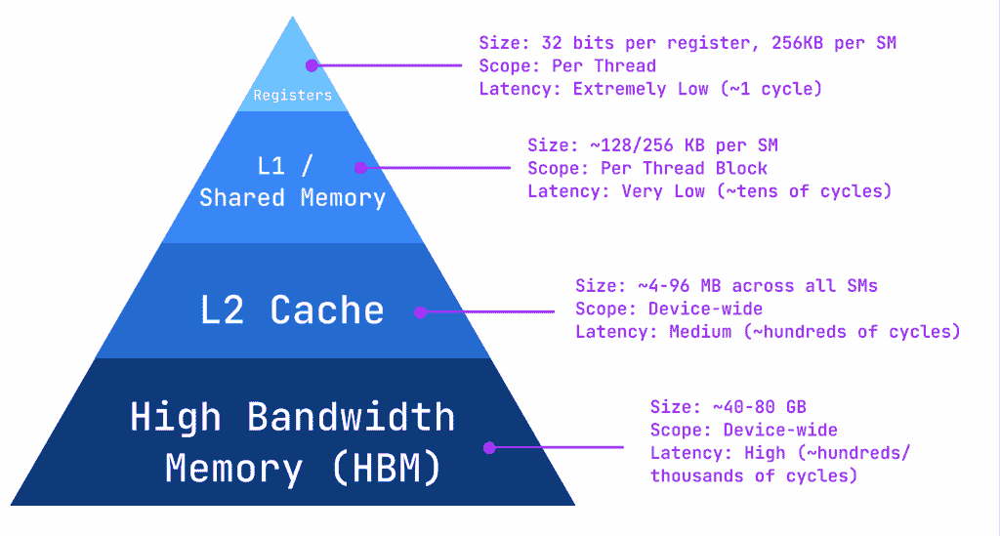
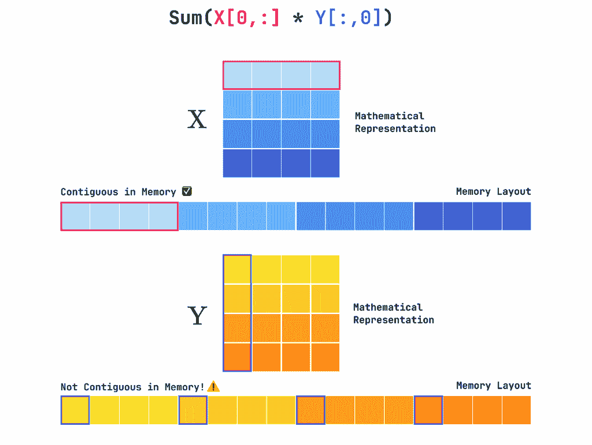
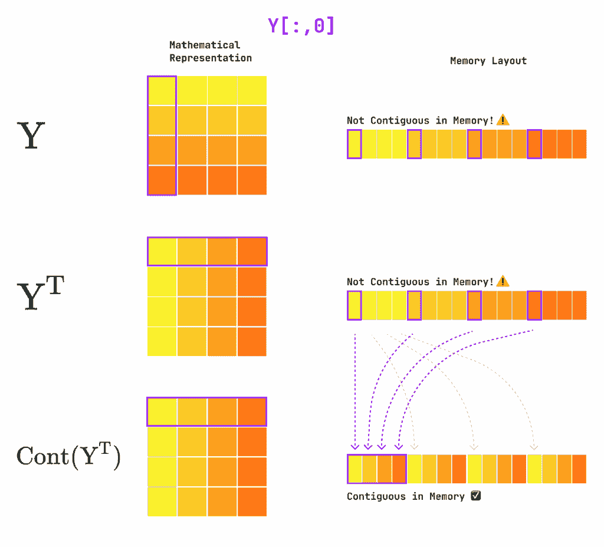

# 逐核学习 Triton：矩阵乘法

> 原文：[`towardsdatascience.com/learning-triton-one-kernel-at-a-time-matrix-multiplication/`](https://towardsdatascience.com/learning-triton-one-kernel-at-a-time-matrix-multiplication/)

<mdspan datatext="el1760116659048" class="mdspan-comment">矩阵乘法无疑是 GPU 执行的最常见操作。它是线性代数的基本构建块，在图形、物理模拟和科学计算等多个不同领域都有出现，同时在机器学习中无处不在。</mdspan>

在今天的文章中，我们将分解通用矩阵-矩阵乘法（GEMM）的概念实现，同时介绍一些优化概念，如分块和内存归约。最后，我们将实现 Triton 中的 GEMM！

*本文是关于 Triton 和 GPU 内核系列文章的第二篇。如果你不熟悉 Triton 或需要复习 GPU 基础知识，请查看上一篇文章！* *本文中展示的所有代码均可在 [GitHub](https://github.com/RPegoud/Triton-Kernels) 上找到。*

> [逐核学习 Triton：向量加法](https://towardsdatascience.com/learning-triton-one-kernel-at-a-time-vector-addition/)

*免责声明：以下所有图表和动画均由作者制作，除非另有说明。*

## 天真 GEMM

让我们从简单开始：我们想要乘以两个矩阵 `X` 和 `Y`，它们的形状分别为 `(M,N)` 和 `(N,K)`。因此，输出矩阵 `Z=X@Y` 将具有形状 `(M,K)`。

这个操作涉及计算 `X` 和 `Y` 中所有行和列对的点积。一个简单的 NumPy 实现可能看起来像这样：

虽然编写、阅读和理解都很简单，但这种实现从内存访问和缓存的角度来看效率非常低。正如本系列的第一篇文章中提到的，GPU 优化的一个基本方面是**最小化数据传输**。

然而，我们当前的实现首先从 `X` 中加载一行，迭代地加载 `Y` 的所有 `K` 列，计算它们的点积，并重复此过程以处理 `X` 中的每一行。这导致总共 `M(K+1)` 次加载操作。


如动画所示，内存访问模式是低效的，因为 `Y` 的每一列都被加载了 `M` 次。打个比方：这就像每次需要为菜肴添加新食材时都跑到杂货店（全局内存）去，而不是在厨房台面上（共享内存）准备所有食材。理想情况下，我们希望最小化每次加载数据块的数量，并最大化其加载后的重用性。这让我们有两个主要的优化轴：

1.  我们如何改进访问模式以最小化冗余加载？

1.  我们一次可以加载多少数据，并且应该在 GPU 的哪里存储它？

## 分块 GEMM

如前所述，GEMM 的朴素方法会导致许多冗余加载，这会引发不必要的开销。理想情况下，我们希望只加载每个数据段一次，并在它们从内存中删除之前在它们被使用的所有操作中执行。

解决这个问题的优雅方法是**瓦片化**，它涉及将大矩阵分成更小的*“瓦片”*或子矩阵。考虑两个形状分别为`(4,6)`和`(6,4)`的矩阵`X`和`Y`，`X@Y`的结果是一个形状为`(4,4)`的矩阵`Z`。

为了计算 Z 的第一个元素`Z[0,0]`，我们需要计算`X`的第一行和`Y`的第一列之间的点积：`Z[0,0] = dot(X[0, :], Y[:, 0])`。我们也可以将点积分解成更小的部分，例如每组 3 个元素：`Z[0,0] = dot(X[0,0:3], Y[0:3, 0]) + dot(X[0,3:6], Y[3:6, 0])`。

或者，我们可以将这种方法扩展到二维，一次计算 Z 的整个`(2,2)`块：`Z[0:2, 0:2] = dot(X[0:2, 0:2], Y[0:2, 0:2]) + dot(X[0:2, 2:4], Y[2:4, 0:2]) + dot(X[0:2, 4:6], Y[4:6, 0:2])`。

下面是瓦片矩阵乘法的可视化表示：


瓦片矩阵乘法。计算被分割成几个 X 和 Y 的“瓦片”（以浅蓝色和紫色突出显示），每个瓦片包含几个块（深蓝色和紫色）。在每个块中，我们计算点积（X 和 Y 中的绿色单元格）。这些点积在瓦片的块之间累积，以计算 Z 中的输出值（累积用从橙色到绿色的颜色表示）。

上述动画展示了瓦片 GEMM 中数据的重用方式。对于`X`和`Y`中的每个 2×2 块，我们计算 4 个点积，这导致在`Z`中产生一个`(2,2)`输出矩阵。由于每个瓦片包含 3 个块，我们需要累积 3 个这样的矩阵来计算`Z`中的最终`(2,2)`输出。这种累积在`Z`中用彩色单元格表示。

在厨房的类比中，这就像是从商店取回食材并在厨房台面上（即小共享内存）准备它们，在返回商店之前重复使用它们几次。

重要的是，在多个步骤中重用加载的数据，这可以使这种方法显著减少加载操作的数量。对于`(2,2)`块，每个`X`行和`Y`列在两个点积中使用。因此，我们使用每个加载的数据块执行**两倍多的操作**，大约**减半**了加载操作的数量！请注意，这同样适用于更大的块，使用`(32,32)`块可以将加载次数减少约 32 倍。

现在你可能想知道“这些块可以有多大”？为了回答这个问题，让我们回顾一下现代 GPU 中内存是如何管理的。

## GPU 内存层次结构

我们区分 Nvidia GPU 中的四种主要内存类型。这里，我们以 A100 为例：

+   **寄存器**：GPU 上最快、最小的内存类型，位于每个流式多处理器（SM）内部。在 A100 上，每个 SM 提供**256 KB**的寄存器文件空间（65,536 个 32 位寄存器），分布在它的线程之间。每个线程都有自己的私有 32 位寄存器，用于存储临时变量和中间结果，从而完全避免了内存流量。然而，每个线程的寄存器使用量直接影响占用率，因为每个线程使用过多的寄存器会限制可以同时运行的线程数量。

+   **L1/共享内存**：在 A100 上，每个 SM 有 192KB 的 SRAM，可以[灵活配置](https://docs.nvidia.com/cuda/ampere-tuning-guide/index.html?utm_source=chatgpt.com#unified-shared-memory-l1-texture-cache)为硬件管理的**L1 缓存**或程序员管理的**共享内存**。对于性能关键的核心，如矩阵乘法，我们明确使用这个空间作为共享内存，以便将数据块放置在计算单元附近，完全绕过 L1 缓存。这使我们能够对数据重用有精细的控制。

+   **L2 缓存**：这个缓存比 L1 慢，但大得多，在 A100 上大约有**40 MB**的共享空间分布在所有 SM 上。它作为数据和指令的全局缓存，减少了访问高延迟 HBM 内存的次数。L2 缓存在整个 SM 之间是**一致的**，这意味着一个 SM 的更新对其他 SM 都是可见的，从而实现了线程块之间的同步。其带宽可以达到每秒数个太字节，作为快速片上 SRAM 和较慢 HBM 之间的缓冲区。

+   **高带宽内存（HBM）**：这是设备内存，根据 A100 型号的不同，容量为 40GB 或 80GB。它提供**极高的带宽**（80 GB 变体的最高可达**2 TB/s**），但与片上缓存相比，延迟要高得多。HBM 是执行期间大型张量、模型权重和数据集所在的地方。由于访问 HBM 的成本很高，高效的内核旨在通过寄存器和共享内存**最小化数据移动**和**最大化片上数据重用**。

如您所见，存储层次结构通常在容量和延迟之间进行权衡。因此，最大化性能归结为高效地将数据从 HBM 加载到共享内存，并尽可能多地重用它。



GPU 内存层次结构，从最快/最小（顶部）到最慢/最大（底部）。

选择我们的块大小至关重要。我们希望块足够大，以创建大量的并行工作，但又要足够小，以便其数据可以适应 SM 的共享内存和寄存器。一个**64**的`BLOCK_SIZE`是一个常见的起点，因为它是**warp 大小**（32 个线程）的倍数，确保了硬件的充分利用。

## 并行分块 GEMM

考虑到这些因素，我们分块 GEMM 的自然后续步骤是将每个分块对的计算并行化到多个线程块中，如下面的动画所示。


并行分块矩阵乘法。将分块的迭代替换为多个线程块上的并行操作。

### 内存归约

在 Triton 中编写分块 GEMM 之前，我们需要考虑最后一个细节：**内存归约**，这是一种允许最优使用全局内存带宽的技术。当 **同一 warp 中的后续线程访问后续内存地址** 时，就实现了内存归约。想象一个图书管理员需要为客户取书，如果所有书籍都并排放在书架上，他们可以一次拿走所有书籍。相比之下，如果所有书籍都躺在不同的书架上，他们将不得不逐个拿走，这会花费更长的时间。

为了理解这如何适用于我们的情况，请注意，矩阵在内存中是线性存储的，换句话说，一个 `(2,2)` 的矩阵存储为一个连续的 `4` 个元素序列。像 PyTorch 这样的框架采用 **行主序** 布局，这意味着矩阵的元素在内存中是 **按行连续** 的。例如，我们的 `(2,2)` 矩阵将按以下方式存储：`[(0,0), (0,1), (1,0), (1,1)]`，请注意，同一行的元素是 *连续的*（接触的），而同一列的元素有 *步长* 为 1（由一个元素分隔）。



PyTorch 以行主序布局存储矩阵。一行的元素在内存中是连续的，而列的元素是步进的。

这意味着我们可以使用 **归约加载** 来加载行，但列 **不** 满足这个条件。然而，我们需要访问 `Y` 的列来计算点积。为了最大化性能，一个良好的做法是将 `Y` 转置，以便我们迭代其行而不是其列。

然而，仅仅转置 `Y` 并不足以修改其在内存中的布局。如前所述，PyTorch 以扁平数组的形式存储矩阵。每个矩阵维度都关联一个 `stride` 属性，表示沿着该维度从一个元素跳到下一个元素所需的跳跃。例如，一个 `(10,10)` 的矩阵会有 `strides=(10,1)`。确实，从元素 `[0,0]` 开始，元素 `[1,0]` 距离 10 个内存槽（即一行）远，而元素 `[0,1]` 是相邻的。

当转置张量时，PyTorch 不会修改内存中的布局，而是简单地重新计算步长。为了从内存的角度使转置有效，我们需要调用 `Y.T.contiguous()`。

这些是高效加载 `Y` 的列所需的步骤，然而我们还需要在内核中转置加载的块以正确执行点积：`z_block = tl.dot(X_block, Y_block.T)`。



Y、Y.T 和 Y.T.contiguous() 在其块表示和内存布局中的表示。转置操作改变了矩阵的行为，但没有修改其内存布局。这就是为什么我们需要添加 `.contiguous()` 来启用对行的归约读取。

### Triton 实现方法

从这里开始，我们首先描述没有内存合并的内核，以简化逻辑和指针运算，然后再总结在 `Y` 列上使加载操作合并所需的变化。

让我们从关注内核周围的 PyTorch 包装器开始。我们需要从输入矩阵中读取 `M, N, K` 并计算它们的步长，因为这些常数将在内核的后续部分很有用。然后，我们定义 `BLOCK_SIZE` 并声明 `grid`。

现在让我们深入实际的内核代码。我们将使用 Triton 的 `make_block_ptr` 工具，它简化了指针运算。我们为每个矩阵创建一个块指针，并将矩阵形状、其步长和块的大小作为输入。此外，我们指定偏移量，即当前块中左上角元素的坐标。对于 `X`，这对应于 `(m_idx * BLOCK_SIZE, 0)`，其中 `m_idx` 是当前块在 `M` 维度上的索引。

从那里，我们定义了一个 `z_acc`，一个零矩阵，它将接收我们在遍历瓦片时计算的局部点积。我们现在遍历共享维度 `N`，加载大小为 `(BLOCK_SIZE, BLOCK_SIZE)` 的块，并将它们的点积累加到 `z_acc` 中。然后，我们使用 `.advance` 沿着共享维度移动块指针。

你可能已经注意到，在加载数据时，我们使用 `boundary_check` 和 `padding_option` 而不是像前一篇文章中那样使用 `mask` 和 `other`。这些参数特定于块指针的使用，并指定了哪些轴需要检查越界操作（这里为 x 和 y 的 `(0,1)`）以及如何处理这些无效值。在这里，我们将它们设置为零，以便在点积中忽略。

我们现在可以使用以下函数查看这个内核的性能：

```py
def bench(fn: callable, x: torch.Tensor, y: torch.Tensor, repeat: int):
  flops = []
  med_latency = []

  for _ in tqdm(range(repeat), desc=f"Benchmarking {fn.__name__}"):
    latency_ms = triton.testing.do_bench(
      lambda: fn(x, y),
      quantiles=[0.5], # get the median latency
      return_mode="all",
      )
    n_flops = 2 * M * N * K # matmul roughly requires 2*M*N*K operations
    tflops = n_flops / (latency_ms / 1e3) / 1e12

    med_latency.append(latency_ms)
    flops.append(tflops)

  flops = np.array(flops)
  med_latency = np.array(med_latency)
  print(f"Absolute Error: {torch.sum(torch.abs(X@Y - fn(x, y)))}")
  print(f"Median Latency: {med_latency.mean():.4f} ± {med_latency.std():.3f} ms")
  print(f"Throughput: {flops.mean():.4f} ± {flops.std():.3f} TeraFLOPS")

M = 8192
N = 6144
K = 4096

X = torch.randn((M, N), device="cuda", dtype=torch.float32)
Y = torch.randn((N, K), device="cuda", dtype=torch.float32)

bench(block_matmul, X, Y, repeat=10)
```

我们得到了以下输出（使用 Colab 上的 T4 GPU）：

```py
Absolute Error: 0.0 # the kernel outputs the correct result!
Median Latency: 130.7831 ± 1.794 ms
Throughput: 3.1533 ± 0.043 TeraFLOPS
```

现在，让我们回顾在 `Y` 上进行合并加载所需的变化：我们主要需要在定义 `Y` 的块指针时翻转形状、步长和偏移量。此外，我们更新块指针以沿列维度（之前是行维度）移动。此实现的完整代码可在 [GitHub](https://github.com/RPegoud/Triton-Kernels) 上找到。

```py
@triton.jit
def coalesced_block_matmul_kernel(
    X_ptr, X_m_stride, X_n_stride,
    Y_ptr, Y_k_stride, Y_n_stride,
    Z_ptr, Z_m_stride, Z_k_stride,
    M, N, K,
    BLOCK_SIZE: tl.constexpr,
):
    ... 
    y_block_ptr = tl.make_block_ptr(
        base=Y_ptr,
        # flip the shape, strides and offsets to match Y.T
        shape=(K, N),
        strides=(Y_k_stride, Y_n_stride), 
        offsets=(k_idx * BLOCK_SIZE, 0),
        block_shape=(BLOCK_SIZE, BLOCK_SIZE),
        order=(0, 1),
    )
    ...

    for _ in range(0, N, BLOCK_SIZE):
        ... # loads
        z_acc += tl.dot(x, y.T)  # transpose Y back for dot product
        x_block_ptr = tl.advance(x_block_ptr, offsets=(0, BLOCK_SIZE))
        # advance the block pointer along columns of Y.T (i.e rows of Y)
        y_block_ptr = tl.advance(y_block_ptr, offsets=(0, BLOCK_SIZE))

    tl.store(pointer=z_block_ptr, value=z_acc, boundary_check=(0, 1))

def coalesced_block_matmul(X, Y):
    Y = Y.T.contiguous()  # Y is now (K,N)
    M, N = X.shape
    K, _ = Y.shape
    Z = torch.empty((M, K), device="cuda")

    x_stride_m, x_stride_n = X.stride()
    y_stride_k, y_stride_n = Y.stride()
    z_stride_m, z_stride_k = Z.stride()

    ...  # define BLOCK_SIZE and grid

    coalesced_block_matmul_kernelgrid

    return Z
```

这里是我们对具有合并加载的 `Y` 的内核的基准测试结果：

```py
Absolute Error: 0.0 # Again, the kernel is correct!
Median Latency: 261.9420 ± 0.858 ms
Throughput: 1.5741 ± 0.005 TeraFLOPS
```

令人惊讶的是，这个第二个内核的吞吐量只有第一个的一半，尽管我们提高了加载操作的效率 🤔

使用 `nsight`（Nvidia 的内核分析器，更多内容将在未来的文章中介绍）快速检查显示，内核内的转置操作创建了一个“交通堵塞”。具体来说，转置操作产生了**银行冲突**，导致线程大部分时间处于空闲状态。值得注意的是，87.6% 的时间中，warp 调度器没有可调度的 warp，因为它们正在等待银行冲突解决。此外，报告还指出：

———————– ———– ————–

指标名称 指标单位 指标值

———————– ———– ————–

…

DRAM 吞吐量百分比 8.20

计算吞吐量（SM）百分比 21.14

…

这表明内核是**延迟受限**的（即既不是内存受限也不是计算受限，更多细节请参考上一篇文章）。相比之下，第一个内核是**计算受限**的（即增加计算量将提高性能），因为计算吞吐量相对于 DRAM 吞吐量较高。

———————– ———– ————–

指标名称 指标单位 指标值

———————– ———– ————–

…

DRAM 吞吐量百分比 29.35

计算吞吐量（SM）百分比 74.39

…

## 结论

这个实验强调了分析和经验验证的重要性。即使是有良好意图的优化，如合并内存访问，如果没有仔细评估，也可能引入新的瓶颈。尽管第一个内核更简单，但它计算受限，更符合硬件特性。

在本系列的下一篇文章中，我们将实现一个 softmax 核，特别关注将 Triton 与 PyTorch 的`autograd`集成以及使用 Nsight 进行内核分析。

下次再见！👋

#### 有用资源

+   [完整实现](https://github.com/RPegoud/Triton-Kernels)

+   [GEMM 和分配简介](https://www.cs.sfu.ca/~ashriram/Courses/CS7ARCH/hw/hw4.html)

+   [Nvidia Ampere 架构（A100 规格）](https://en.wikipedia.org/wiki/Ampere_%28microarchitecture%29#cite_note-15)
