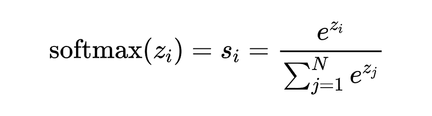
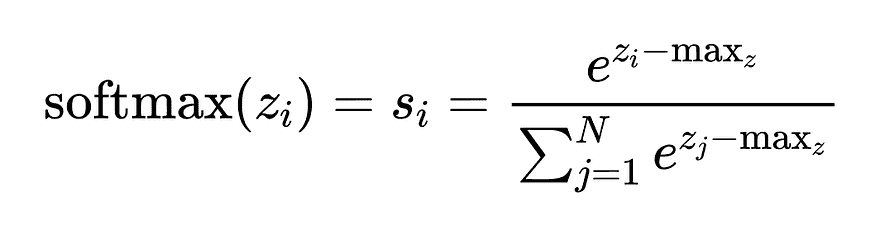
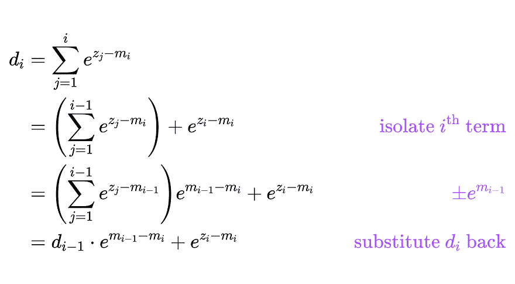
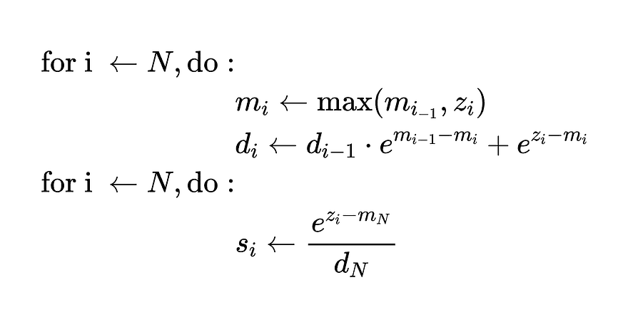
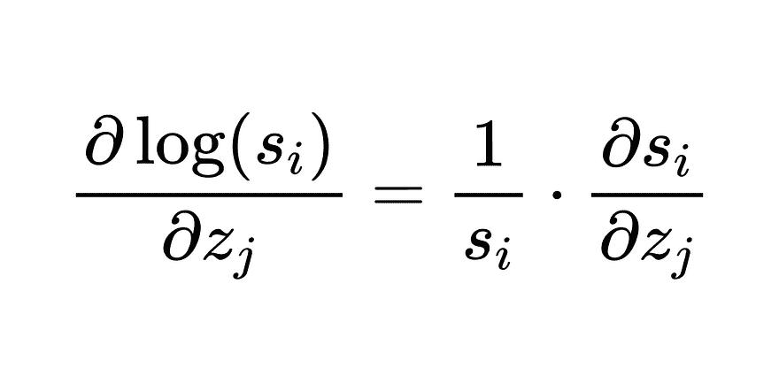
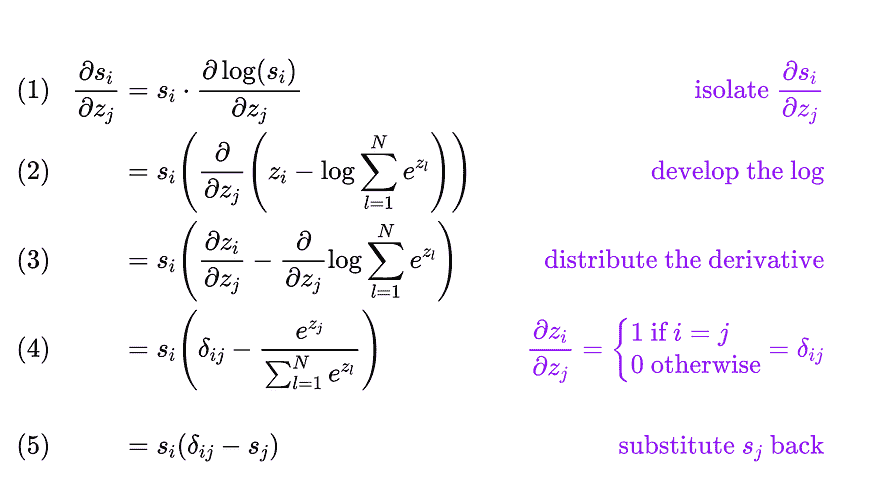
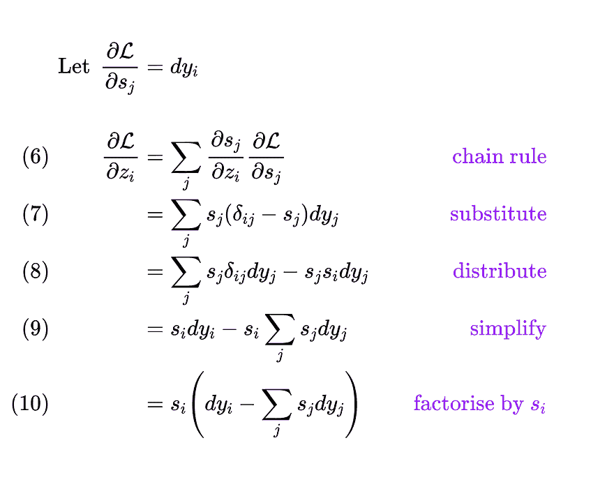
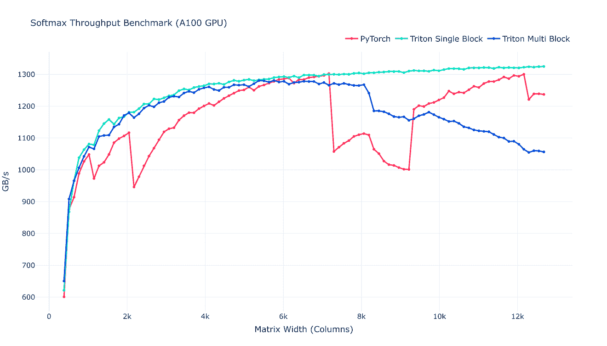
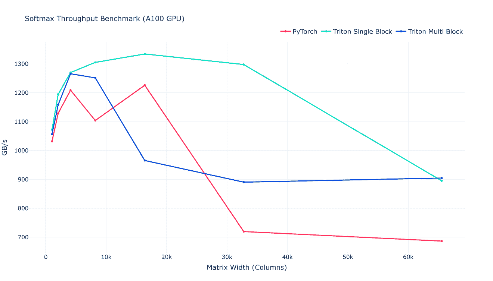

# 一次学习 Triton One 内核：Softmax

> 原文：[`towardsdatascience.com/learning-triton-one-kernel-at-a-time-softmax/`](https://towardsdatascience.com/learning-triton-one-kernel-at-a-time-softmax/)

在本系列的[上一篇文章](https://towardsdatascience.com/learning-triton-one-kernel-at-a-time-matrix-multiplication/)中，我们介绍了计算机科学所有领域普遍存在的操作：矩阵乘法。它在神经网络中用于计算线性层的激活。然而，激活本身很难解释，因为它们的值和统计信息（均值、方差、最小-最大振幅）可以从一层到另一层有很大的变化。这就是我们使用激活函数的原因之一，例如逻辑函数（也称为 sigmoid），它将任何实数投影到 `[0; 1]` 范围内。

softmax 函数，也称为归一化指数函数，是 sigmoid 的多维推广。它将原始分数（logits）向量转换为 **M** 个类别的**概率分布**。我们可以将其解释为**加权平均**，它表现为**平滑函数**，并且可以方便地进行**微分**。它是点积注意力、语言建模和多项式逻辑回归的关键组成部分。

在本文中，我们将涵盖：

1.  在 Triton 中实现高效的 softmax 内核。

1.  实现反向传播（`autograd`）。

1.  优化：缓存修改器和自动调整。

如果你对 Triton 还不熟悉，请参阅之前的文章！

> [一次学习 Triton One 内核：向量加法](https://towardsdatascience.com/learning-triton-one-kernel-at-a-time-vector-addition/)
> 
> [一次学习 Triton One 内核：矩阵乘法](https://towardsdatascience.com/learning-triton-one-kernel-at-a-time-matrix-multiplication/)

*免责声明：除非另有说明，所有插图和动画均由作者制作*。

## 定义

softmax 的定义如下：



正则化确保向量总和为 **1**，因此它可以被解释为有效的概率分布。

注意，这种 softmax 的公式对**数值溢出**非常敏感。回想一下，标准 **float16** 可以表示的最大值是 **65 504**，大约是 **exp(11**)。这意味着任何大于 ~11 的输入值都会导致 `exp(z_i)` 超出可表示的范围，从而导致**溢出**。

减少这种问题的常见技巧是从输入向量的每个元素中减去最大值，这样在指数运算之前新最大值是 **0**，在指数运算之后是 **1**。



## 天真实现

如您所见，计算 softmax 涉及**两个缩减操作**，一个**最大值**和一个**求和**。一个原始算法需要输入向量的三个单独遍历。首先计算最大值，然后求和，最后计算归一化输出。

这里是一个简单的 Numpy 实现示例：

在这个 Triton 系列中，一个反复出现的主题是**最小化高延迟的全局内存访问**。我们当前的 Numpy 实现需要读取完整的输入向量的三个单独的内存读取，这非常低效。

### 在线 Softmax

幸运的是，我们可以使用一个称为**在线 softmax**的巧妙技巧来融合 `max` 和 `sum` 步骤，将内存读取次数减少到 **2**。

首先，我们递归地定义指数的总和。在以下一系列等式中，`m_i` 指的是直到第 ***i*** 个索引的 `x` 的最大值。



这个等式允许我们通过使用到目前为止的最大值**迭代地**计算指数的总和。我们可以利用它来融合原始实现中的第一个和第二个循环，并迭代地计算指数的最大值和总和。

我们算法变为：



这可以轻松地转换为 Numpy：

现在我们已经理解了 softmax 的主要原理，我们将在 Triton 中实现它，从简单的单块版本开始，逐步构建到在线多块公式。最终，我们希望我们的内核表现得像 PyTorch 模块，并且与 `autograd` 兼容。

不幸的是，从 PyTorch 的角度来看，Triton 内核表现得像黑盒：它们执行的操作不会被 `autograd` 跟踪。这要求我们自行实现反向传播并明确指定如何计算梯度。让我们回顾一下我们喜爱的链式法则并推导 softmax 梯度。

## 梯度

由于 softmax 的输出严格为正，我们可以使用**对数导数**来简化梯度的推导。在这里，我们对输出的**对数**求导并应用链式法则：



从那里，我们重新排列项并遵循以下步骤：



现在假设我们有一些上游梯度，例如由损失函数 ***L***（例如交叉熵损失）生成。我们得到以下梯度的表达式：



**(9)** 中左端项的简化是由于 `δ_ij` 只会在**第 i 个**元素时等于 **1**，从而将 **j** 的求和简化为一个项。

## Triton 实现

### 单块 Softmax

现在我们已经完成了梯度的推导，我们可以编写正向和反向 softmax 内核。首先，让我们关注 PyTorch 包装器，以了解单块实现如何在高层上工作。给定一个二维输入张量，正向和反向内核将并行处理所有行。

为了简化，我们将定义`BLOCK_SIZE`足够大，以便一次处理所有列。具体来说，我们将将其设置为大于列数的下一个 2 的幂，这是 Triton 所要求的。

然后，我们将定义我们的`grid`为行数（它可能还处理批量维度）。

我们`SoftmaxSingleBlock`的 PyTorch 包装器是一个从`torch.autograd.Function`继承的类，它实现了`forward`和`backward`方法。这两个方法都接受一个`ctx`参数，我们将使用它来缓存正向传播期间的 softmax 输出并在反向传播期间重用它们。

这两个内核都很直接，我们首先使用与我之前文章中相同的语法加载行输入[**向量加法**](https://medium.com/data-science-collective/learning-triton-one-kernel-at-a-time-vector-addition-5f57e9d2f3e1)。注意，`BLOCK_SIZE`和`num_warps`是使用一个`calculate_settings`函数计算的。此函数来自[**Unsloth**](https://unsloth.ai/)库，并在其他内核库（如[**LigerKernel**](https://github.com/linkedin/Liger-Kernel)）中重用，这些内核库的内核与本文中的内核松散相关），它提供了调整这两个变量的启发式方法：

```py
def calculate_settings(n: int) -> tuple[int, int]:
 MAX_FUSED_SIZE = 65536 # maximum grid dimension on Nvidia GPUs
    BLOCK_SIZE = next_power_of_2(n)
    if BLOCK_SIZE > MAX_FUSED_SIZE:
        # we remove this assertion in this article
        raise RuntimeError(
            f"Cannot launch Triton kernel since n = {n} exceeds "
            f"the maximum CUDA blocksize = {MAX_FUSED_SIZE}."
        )
    num_warps = 4
    if BLOCK_SIZE >= 32768:
        num_warps = 32
    elif BLOCK_SIZE >= 8192:
        num_warps = 16
    elif BLOCK_SIZE >= 2048:
        num_warps = 8
    return BLOCK_SIZE, num_warps
```

然后，我们实现正向传播的常规 softmax 和反向传播的方程式**（10**）。与之前的文章相比，这里唯一的创新是使用了缓存修饰符，这些修饰符告诉编译器如何缓存和驱逐数据。目前，我们只关注三个缓存修饰符：

+   **`.ca`**（**所有级别缓存**）：告诉编译器在 L1 和 L2 缓存中加载数据，暗示它可能很快会被重用。当数据足够小，可以适合 L1（例如，在 A100 上每个 SM 大约 128-192KB）并且可能会被重复访问时，应使用此修饰符。

+   **`.cs`**（**流式处理**）：将数据视为**流式处理**，它将被使用一次然后丢弃以释放 L1 中的空间。

+   **`.wb`**（**写回**）：正常的缓存写入，数据将保留在缓存层次结构中，如果输出可能被重用则很好。

在接下来的内核中，我们将使用`.ca`修饰符进行加载，因为我们将在加载的数据上执行多个操作。对于存储，我们在正向传播中使用`.cs`，因为输出不会立即重用，在反向传播中使用`.wb`，因为在`autograd`的上下文中（即链式法则），梯度输出将被下游内核消耗。

### 多块 Softmax

现在，让我们看看 softmax 的在线公式。在本节中，我们实现了之前内核的多块变体。这个版本将使用`BLOCK_SIZE < n_cols`，换句话说，我们每次只加载一个包含`BLOCK_SIZE`个元素的块，类似于我们在[上一教程](https://medium.com/data-science-collective/learning-triton-one-kernel-at-a-time-matrix-multiplication-44851b4146dd)中处理分块 GEMM 的方式。现在你可能想知道“我们如何选择块大小？”。

这是一个介绍 Triton 的`autotune`实用工具的好机会。提供一组配置列表，`autotune`将执行网格搜索以确定并缓存特定输入形状的最佳配置。每次向内核传递新的输入形状时，此过程都会重复。

在这里，我们使用以下实用函数在块大小和线程数上执行网格搜索：

```py
from itertools import product

# --- Multi Block Tuning ---
BLOCK_SIZES = [256, 512, 1024, 2048, 4096, 8192]
NUM_WARPS = [2, 4, 8, 16]

def get_autotune_config(
    block_sizes: list[int], num_warps: list[int]
) -> list[triton.Config]:
    return [
        triton.Config(kwargs={"BLOCK_SIZE": bs}, num_warps=nw)
        for (bs, nw) in list(product(block_sizes, num_warps))
    ]
```

我们现在可以用`autotune`装饰我们的多块内核，并传递配置列表，`key="n_cols"`表示最佳配置取决于输入的列数。

这些内核的实现从概念上非常接近我们之前覆盖的在线 softmax，主要区别在于我们遍历块（而不是像 Numpy 中的单个元素），这需要一些调整。例如，我们在`d`更新中添加了对块的求和，反向内核现在也需要两次迭代。

*注意：PyTorch 包装器完全相同，除了我们删除了声明`BLOCK_SIZE`和`num_warps`的行（因为它们由`autotune`选择）。*

## 测试和基准测试

我们现在可以使用以下实用函数执行前向和反向传递，并确保它们与 PyTorch 基线匹配：

```py
def validate_kernel(kernel_fn: callable) -> None:
    device = "cuda:0" if torch.cuda.is_available() else "cpu"
    torch.random.manual_seed(0)

    # Generate inputs
    x = torch.randn((256, 512), device=device) # triton input
    x.requires_grad = True
    xt = deepcopy(x) # torch input

    triton_output = kernel_fn(x)
    torch_output = torch.softmax(xt, dim=1)
    torch.testing.assert_close(triton_output, torch_output) # test fwd kernel

    # Setup fake labels
    y = torch.zeros_like(x)
    inds = (torch.arange(0, y.shape[0]), torch.randint(0, 3, (y.shape[0],)))
    y[inds] = 1

    # Define loss and run backward pass
    loss_fn = torch.nn.CrossEntropyLoss()
    loss = loss_fn(torch_output, y)
    loss.backward()

    # Save gradient tensor for later
    torch_xgrad = xt.grad.detach().clone()
    triton_loss = loss_fn(triton_output, y)
    triton_loss.backward()
    torch.testing.assert_close(x.grad, torch_xgrad) # test grad outputs

validate_kernel(softmax_sb)
validate_kernel(softmax_mb)
```

最后，我们使用以下代码片段将我们的实现与 PyTorch 基线进行基准测试：

```py
# --- Source: Triton softmax tutorial ---
@triton.testing.perf_report(
    triton.testing.Benchmark(
        x_names=["N"],  # argument names to use as an x-axis for the plot
        x_vals=[
            128 * i for i in range(2, 100)
        ],  # different possible values for `x_name`
        line_arg="provider",  # argument name whose value corresponds to a different line in the plot
        line_vals=[
            "triton_single_block",
            "triton_multi_block",
            "torch",
        ],  # possible values for `line_arg``
        line_names=[
            "Triton_single_block",
            "Triton_multi_block",
            "Torch",
        ],  # label name for the lines
        styles=[("blue", "-"), ("green", "-"), ("red", "-")],
        ylabel="GB/s",  # label name for the y-axis
        plot_name="softmax-performance",  # name for the plot. Used also as a file name for saving the plot.
        args={"M": 4096},  # values for function arguments not in `x_names` and `y_name`
    )
)
def benchmark(M, N, provider):
    x = torch.randn(M, N, device=DEVICE, dtype=torch.float32)
    stream = getattr(torch, DEVICE.type).Stream()
    getattr(torch, DEVICE.type).set_stream(stream)
    if provider == "torch":
        ms = triton.testing.do_bench(lambda: torch.softmax(x, axis=-1))
    if provider == "triton_single_block":
        torch.cuda.synchronize()
        ms = triton.testing.do_bench(lambda: softmax_sb(x))
        torch.cuda.synchronize()
    if provider == "triton_multi_block":
        torch.cuda.synchronize()
        ms = triton.testing.do_bench(lambda: softmax_mb(x))
        torch.cuda.synchronize()
    gbps = lambda ms: 2 * x.numel() * x.element_size() * 1e-9 / (ms * 1e-3)
    return gbps(ms)

benchmark.run(show_plots=True, print_data=True)
```

好消息！我们的单块内核始终优于 PyTorch 基线，而多块变体在输入超过 6k 列时下降：



考虑到更大的输入，我们可以得出几个观察结果：

1.  多块内核最终稳定在 900GB/s 的吞吐量，超过了具有 30k 列以上输入的 PyTorch 基线。

1.  有趣的是，对于具有 60k 列以上的输入，多块变体似乎将占主导地位。

1.  尽管我们使用单块变体超过了最大块大小，但出于某种原因，内核仍然运行顺畅。确实，Triton 在底层自动管理块大小。

    当`n_cols`大于硬件限制时，Triton 将拆分输入并对其进行迭代。然而，这似乎比多块方法慢。

要进一步深入，我们可以将两种方法结合在一个内核中，该内核会根据输入大小显式选择最优内核。这样，对于小于 60k 列的小输入，我们可以从单块内核的高性能中受益，而对于超过 60k 列的输入，我们可以从多块变体的更高吞吐量中受益。



这标志着 Triton 系列的第三集结束，再次感谢您的支持！

在下一篇文章中，我们将利用在线 softmax 公式在 **Flash Attention** 的背景下进行探讨。

下次再见！👋

## 资源：

+   [**LigerKernel Softmax 实现**](https://github.com/linkedin/Liger-Kernel/blob/main/src/liger_kernel/ops/softmax.py)

+   [**托马斯·库尔比尔的 Softmax 梯度推导**](https://medium.com/data-science/derivative-of-the-softmax-function-and-the-categorical-cross-entropy-loss-ffceefc081d1)

+   [**GPU 内核优化：Softmax — 第二部分 by Hugo Rosenkranz-costa**](https://medium.com/@hugo.rosenkranz/gpu-kernel-optimization-softmax-part-2-43ce9f8019e8) (Cuda & Triton 内核，更侧重于性能分析和硬件优化)

+   [**从在线 softmax 到 FlashAttention by 叶子豪**](https://courses.cs.washington.edu/courses/cse599m/23sp/notes/flashattn.pdf)
