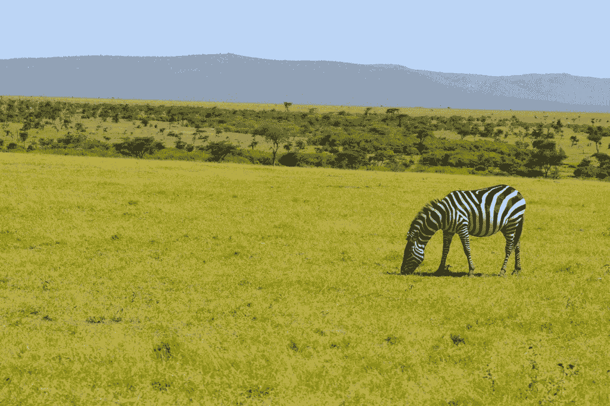
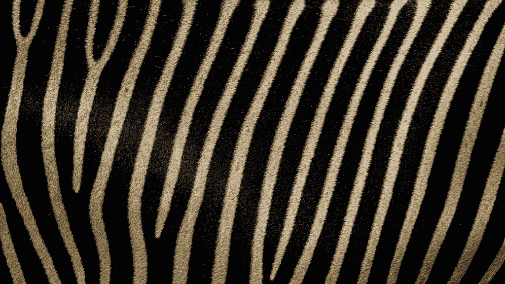
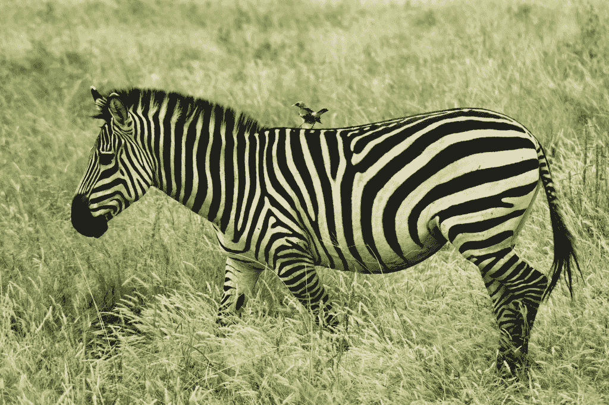
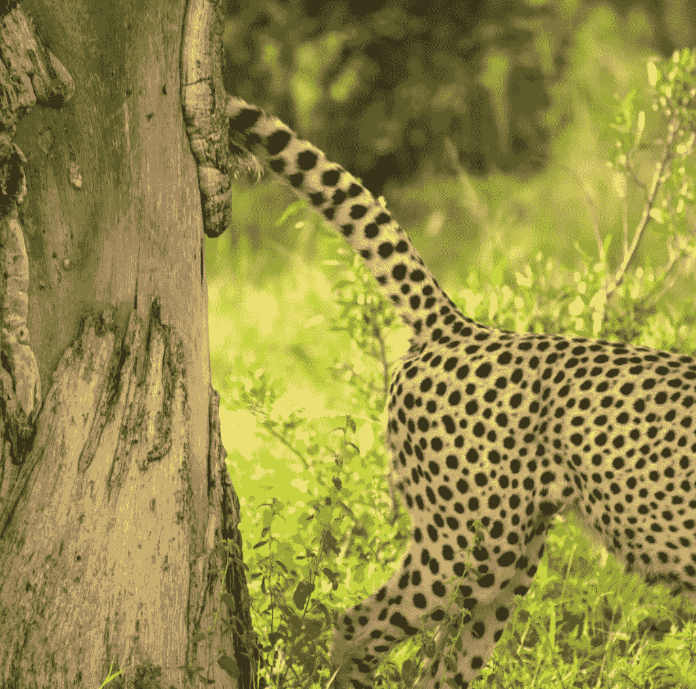
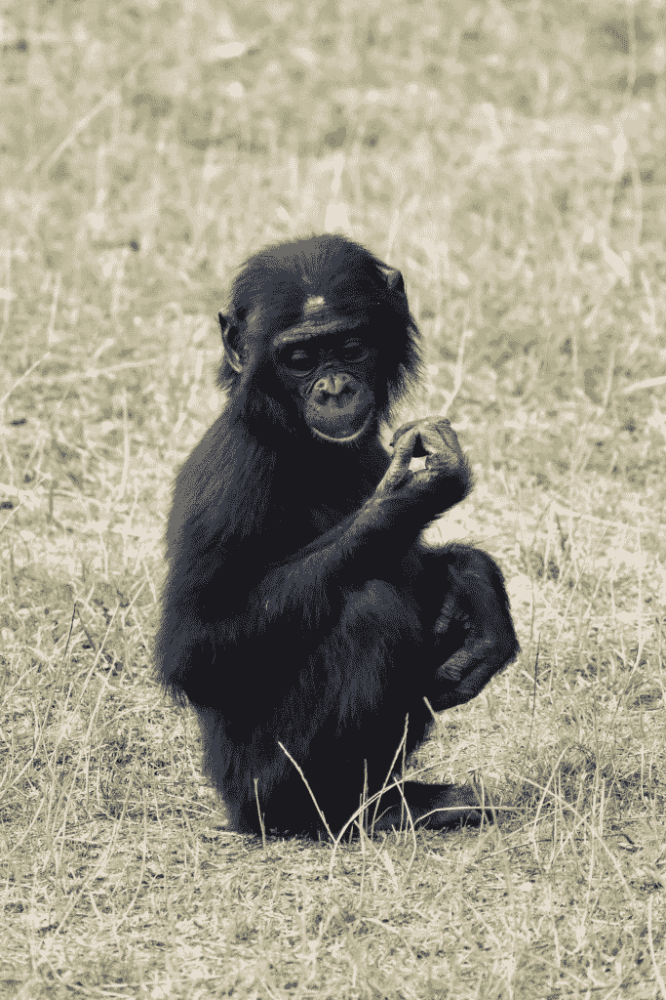
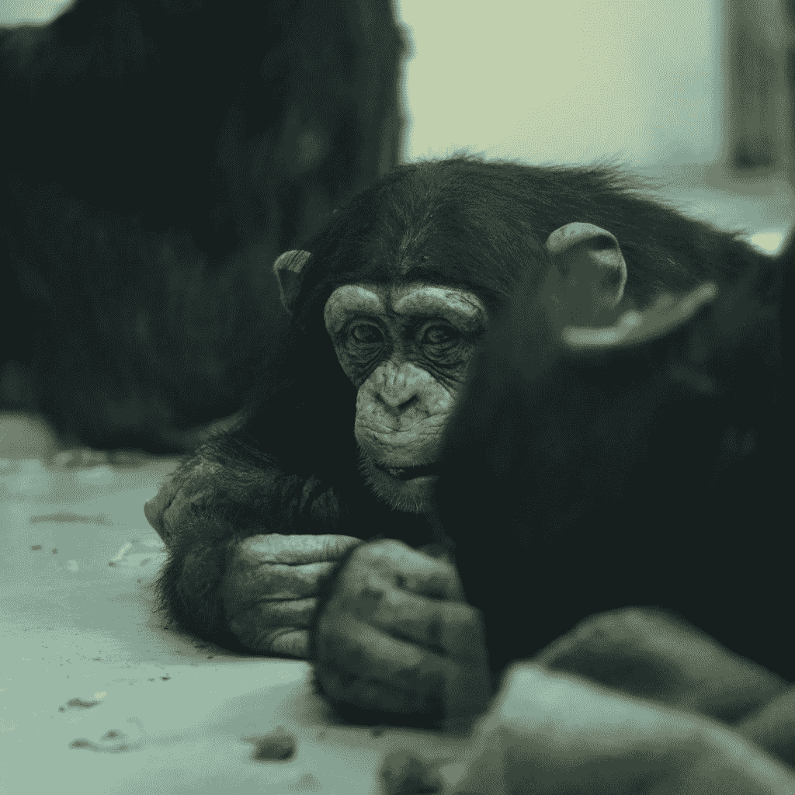
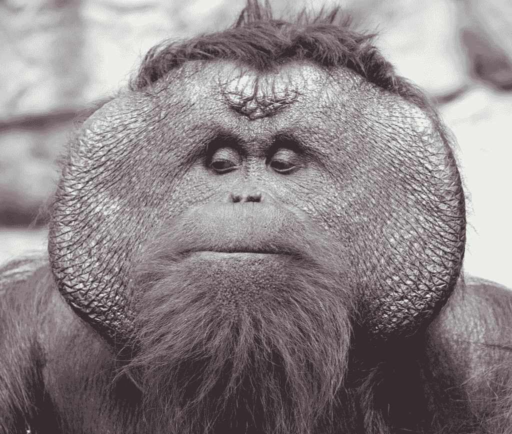
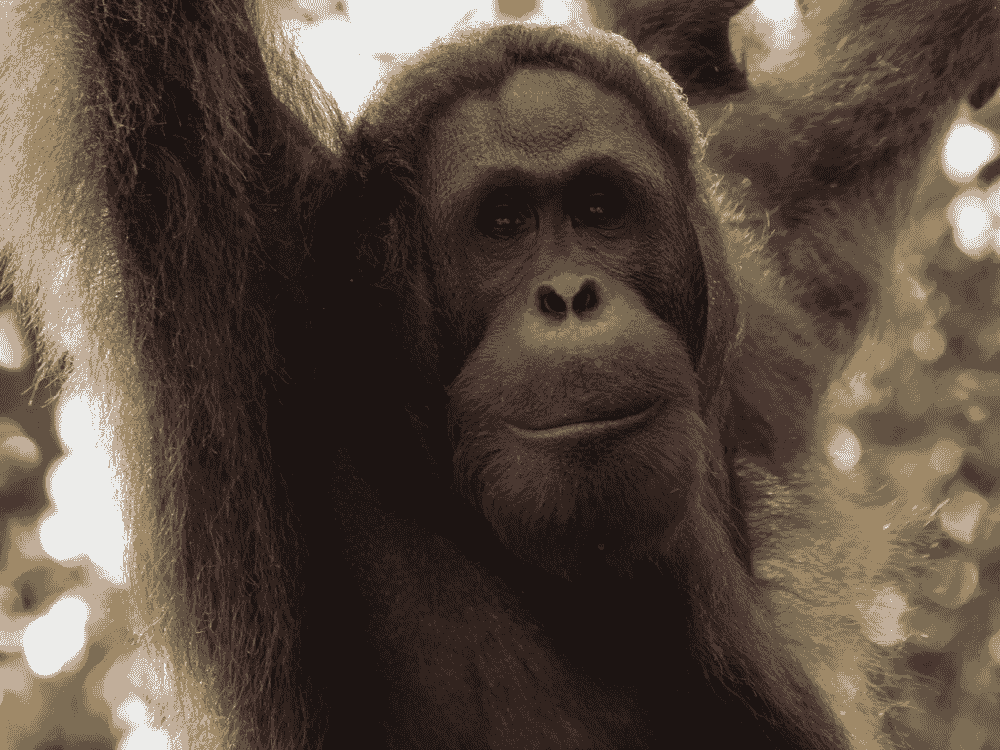

# 机器学习工程师的学习经验 — 第一部分：数据

> 原文：[`towardsdatascience.com/learnings-from-a-machine-learning-engineer-part-1-the-data/`](https://towardsdatascience.com/learnings-from-a-machine-learning-engineer-part-1-the-data/)

据说，为了使机器学习模型成功，你需要拥有良好的数据。虽然这是真的（而且几乎是显而易见的），但定义、构建和维持良好的数据却极为困难。让我与你们分享我在过去几年中构建不断增长的图像分类系统所学习到的独特流程，以及你如何将这些技术应用到自己的应用中。

通过坚持不懈和勤奋努力，你可以避免经典的“垃圾输入，垃圾输出”，最大化模型精度，并展示真正的商业价值。

在这一系列文章中，我将深入探讨多类单标签图像分类应用的数据维护和喂养，以及达到最高性能所需的方法。我不会涉及任何编码或特定用户界面，只是介绍你可以结合自己需求，利用现有工具理解的主要概念。

这里是对文章的简要描述。你会注意到模型在列表的末尾，因为我们首先需要关注的是数据整理：

+   第一部分 — 数据 — 标注标准、类别和子类别

+   [第二部分 — 数据集](https://towardsdatascience.com/learnings-from-a-machine-learning-engineer-part-2-the-data-sets/)— 截止值和阈值、基准集、分阶段和合成数据

+   [第三部分 — 评估](https://towardsdatascience.com/learnings-from-a-machine-learning-engineer-part-3-the-evaluation/) — 训练模型与部署模型评估

+   [第四部分 — 模型](https://towardsdatascience.com/learnings-from-a-machine-learning-engineer-part-4-the-model/)— 微调、批量识别、性能报告

## **背景**

在过去的六年里，我主要专注于为一家制造公司构建和维护图像分类应用。在我开始的时候，大多数软件要么不存在，要么太昂贵，所以我从头开始创建了这些。在这段时间里，我部署了两个标识应用，最大的处理了 1,500 个类别，并实现了 97-98%的准确率。

大约八年前，我开始在线学习数据科学和机器学习。因此，当有机会创建一个 AI 应用时，我已经准备好构建我需要的工具来利用最新的进步。我全力以赴地投入其中！

我很快发现，构建和部署模型可能是工作中最简单的一部分。将高质量的数据输入模型是提高性能的最佳方式，而这需要专注和耐心。注重细节是我最擅长的，所以这非常适合我。

## **一切始于数据**

我觉得太多的注意力都放在了模型选择（决定哪个神经网络最好）上，而数据只是事后考虑。我艰难地发现，即使是一两件坏数据也会对模型性能产生重大影响，所以这是我们需要关注的重点。

例如，假设你训练了一个经典的猫与狗图像分类器。你有 50 张猫的图片和 50 张狗的图片，然而其中一张“猫”的图片明显（客观上）是狗的图片。计算机没有忽略错误标记的图片的奢侈，而是调整模型权重以使其适应。方枘圆凿。

另一个例子可能是一张猫爬上树的图片。但当你从整体来看，你会描述它为一张树（首先）和猫（其次）的图片。再次，计算机不知道要忽略大树而专注于猫——它甚至会开始将树识别为猫，即使那里有一只狗。你可以将这些图片视为异常值，应该将其移除。

无论你拥有世界上最好的神经网络，你都可以确信，当它用“坏”数据训练时，模型会做出错误的预测。我学到的经验是，每次我看到模型出错，就是时候审查数据了。

## **示例应用 — 动物园动物**

在接下来的这部分内容中，我将使用识别动物园动物的例子。假设你的目标是创建一个移动应用程序，让动物园的游客可以拍照他们看到的动物，并让应用程序识别它们。具体来说，这是一个多类单标签应用。

这里是你的挑战：

+   **多样性** — 动物园里有各种各样的动物，其中许多看起来非常相似。

+   **质量** — 使用应用程序的游客并不总是拍出好的照片（缩放过大、模糊、太暗），所以我们不希望在图像质量差的情况下提供答案。

+   **增长** — 动物园一直在扩张，并不断添加新的物种。

+   **超出范围** — 有时你可能会发现，人们在食品法庭附近拍照麻雀，抓取掉落的爆米花。

+   **恶作剧者** — 只为了好玩，客人可能会拍一张爆米花的袋子，看看会得到什么结果。

这些都是真正的挑战——能够区分动物之间的细微差别，处理超出范围的案例，以及处理普通质量差的图像。

在我们到达那里之前，让我们从开始的地方说起。

## **收集和标记**

现在有很多工具可以帮助你完成这个过程的一部分，但挑战仍然是相同的——收集、标记和整理数据。

有数据可收集是挑战#1。没有图像，你就没有可以训练的东西。你可能需要创造性地获取数据，甚至创建合成数据。关于这一点，稍后会有更多介绍。

关于图像预处理的一个简要说明。我将所有图像转换为神经网络输入的大小，并以 PNG 格式保存。在这个正方形 PNG 内部，我保留了原始图片的宽高比，并将背景填充为黑色。我不会拉伸图像，也不会裁剪任何特征。这也有助于将主题居中。

第二个挑战是建立数据质量标准，并确保这些标准得到遵守！这些标准将引导你走向“好”数据。当然，这也假设标签是正确的。两者都容易说而不易做！

我希望展示“好”和“正确”实际上是如何相辅相成的，以及将这些标准应用到每一张图片上有多么重要。

## **好的数据**

首先，我想指出的是，这里讨论的图像数据是用于训练集的。对于**训练**而言，什么样的图像算作好图像与用于**评估**的好图像略有不同。更多内容将在[第三部分](https://towardsdatascience.com/learnings-from-a-machine-learning-engineer-part-3-the-evaluation/)中介绍。

那么，当我们谈论图像时，“好”数据是什么意思呢？“一张图片胜过千言万语”，如果你用来描述图片的第一句话没有包括你试图标记的主题，那么它就不是好的，你需要将其从训练集中移除。

例如，假设你被展示了一匹斑马的图片，并且（不考虑你应用中的偏见）你将其描述为“一个开阔的田野，远处有一匹斑马”。换句话说，如果你首先注意到的是“开阔的田野”，那么你很可能不想使用这张图片。相反的情况也是一样——如果图片太近，你会描述它为“斑马图案”。

图片由[Meg von Haartman](https://unsplash.com/@traveleroohlala)在[Unsplash](https://unsplash.com/)提供

图片由[Jason Dent](https://unsplash.com/@jdent)在[Unsplash](https://unsplash.com/)提供

图片由[Martin Olsen](https://unsplash.com/@martinols3n)在[Unsplash](https://unsplash.com/)提供

你想要的描述可能是，“一匹斑马，位于中央”。这样，主题将占据大约 80-90%的总画面。有时我会花时间裁剪原始图像，以确保主题被正确构图。

记住训练时使用图像增强。在边缘留出缓冲区将允许“放大”增强。而“缩小”增强将模拟更小的主题，因此不要将主题的起始大小设置为小于总画面的 50%，因为这样你会失去细节。

“好”图像的另一个方面与标签相关。如果你只能看到动物园动物的背面，你真的能分辨出，比如，它是猎豹还是豹子吗？关键识别特征必须是可见的。如果人类都难以识别，你不能期望计算机学到任何东西。

图片由[Jan Harder](https://unsplash.com/@jdh84)在[Unsplash](https://unsplash.com/)提供

一张“糟糕”的图片是什么样的？以下是我经常注意到的几点：

+   广角镜头拉伸

+   逆光或剪影

+   高对比度或暗影

+   模糊或朦胧

+   隐藏的特征

+   多个主题

+   “篡改”的图片，画线或箭头

+   “不寻常”的角度或情况

+   携带你的主题图片的移动设备图片

## **正确标签**

如果你手头有一支领域专家团队来标记图片，你有一个很好的起点。动物园的动物训练员了解各种物种，可以区分，例如，黑猩猩和倭黑猩猩之间的差异。

图片由[Adèle](https://unsplash.com/@aadelee)在[Unsplash](https://unsplash.com/)提供

图片由[Andrius Ordojan](https://unsplash.com/@andriusordojan)在[Unsplash](https://unsplash.com/)提供

对于机器学习工程师来说，你可能会很容易地假设所有来自领域专家的标签都是正确的，然后直接进入模型训练。然而，即使是专家也会犯错误，所以如果你能在标签上得到第二意见，你的错误率应该会降低。

实际上，获得一个，更不用说两个，领域专家来审查图片标签可能是非常昂贵的。领域专家通常有几年的经验，使他们能够在其他工作领域对业务更有价值。我的经验是，机器学习工程师（也就是你和我）成为第二意见，很多时候甚至是第一意见。

随着时间的推移，你可以变得相当擅长标记，但肯定不是领域专家。如果你有幸能够接触到专家，向他们解释标记标准以及这些标准对于应用程序成功的重要性。强调“质量胜于数量”。

有一点是毫无疑问的，拥有一个**正确**的标签非常重要。然而，只要有一两张标签错误的图片就足以降低性能。这些图片可能会因为粗心或匆忙的标签而轻易地进入你的数据集。所以，花时间确保标签正确是很重要的。

最终，我们作为机器学习工程师，对模型性能负责。所以，如果我们只专注于模型训练和部署，我们可能会发现自己想知道为什么性能不足。

## **未知标签**

有很多次，你会遇到一张非常有趣的主体图片，但你却不知道它是什么！简单地丢弃它真是太可惜了。你可以做的是给它分配一个通用的标签，比如“未知鸟类”或“随机植物”，这些标签**不包括**在你的训练集中。在[第四部分](https://towardsdatascience.com/learnings-from-a-machine-learning-engineer-part-4-the-model/)中，你将看到如何在你对它们有更好的了解时返回这些图片，你将会很高兴你保存了它们。

## **模型辅助**

如果你进行过任何图像标注，那么你知道这有多么耗时且困难。但这就是拥有模型，即使是远非完美的模型，能帮助你的时候。

通常，你有一大堆未标记的图像，你需要逐个检查它们以分配标签。模型仅提供一个最佳猜测并显示前三个结果，让你能在几秒钟内浏览每一张图像！

即使前三个结果都是错误的，这也可以帮助你缩小搜索范围。随着时间的推移，新的模型会变得更好，标注过程甚至可能变得有些有趣！

在[第四部分](https://towardsdatascience.com/learnings-from-a-machine-learning-engineer-part-4-the-model/)中，我将展示如何批量识别图像，并将这一过程提升到下一个层次，以实现更快的标注。

## **类别和子类别**

我提到了上面提到的两个看起来非常相似的物种的例子，黑猩猩和倭黑猩猩。当你开始构建你的数据集时，你可能对这两种物种中的一个或两个的覆盖范围非常稀疏。在机器学习的术语中，我们称这些为“类别”。一个选择是继续使用你拥有的内容，并希望模型仅通过少量示例图像就能捕捉到差异。

我使用的方法是将两个或多个类别合并为一个，至少暂时如此。因此，在这种情况下，我会创建一个名为“chimp-bonobo”的类别，它由黑猩猩和倭黑猩猩物种类别的有限示例图片组成。结合这些，可能足以训练“chimp-bonobo”模型，但代价是它是一个更通用的识别。

子类别甚至可以是正常变异。例如，**幼年**粉红 flamingos 是灰色的而不是粉色的。或者，雄性和雌性猩猩有明显的面部特征。你想要有相当平衡的图像数量来表示这些正常变异，保持子类别将允许你完成这一点。

图片由[David Valentine](https://unsplash.com/@thephotochad)在[Unsplash](https://unsplash.com/)提供

图片由[Hongbin](https://unsplash.com/@hbsun2013)在[Unsplash](https://unsplash.com/)提供

不要担心你正在合并看起来完全不同的类别——神经网络在应用“或”操作方面做得很好。这双向都适用——它可以帮助你将雄性和雌性变异作为同一物种识别，但如果有“坏”的异常图像混入，比如例子中的“远处开阔地上的斑马”，它可能会对你造成伤害。

随着时间的推移，你（希望）能够收集更多子类别的图像，然后能够成功地将它们分开（如果需要的话）并训练模型来单独识别它们。这个过程对我非常有效。只是确保在分开时仔细检查所有图像，以确保标签没有意外混淆——这将是一段值得的时间。

所有这些都当然取决于你的用户需求，你可以通过创建一个独特的类标签，如“黑猩猩-倭黑猩猩”，或者在前端展示层中通知用户你有意合并了这些类别，并提供进一步优化结果的指导来处理这个问题。即使你决定将这两个类别分开，你也可能想要提醒用户，由于这两个类别非常相似，模型可能是错误的。

## **接下来…**

我意识到这本来是一篇关于表面上看似直观事物的长篇大论，但这些确实是我过去因为未给予足够关注而踩过的坑。一旦你对这些原则有了稳固的理解，你就可以继续构建一个成功的应用。

在[第二部分](https://towardsdatascience.com/learnings-from-a-machine-learning-engineer-part-2-the-data-sets/)中，我们将使用这里收集的精选数据来创建经典数据集，并附带一个定制的基准集，这将进一步丰富你的数据。然后我们将看到如何最好地使用特定的“训练心态”来评估我们的训练模型，并在评估部署的模型时切换到“生产心态”。
