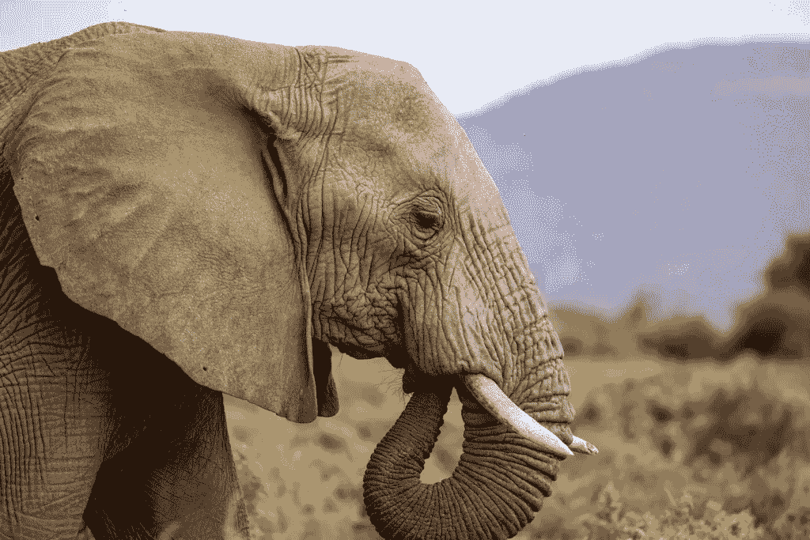
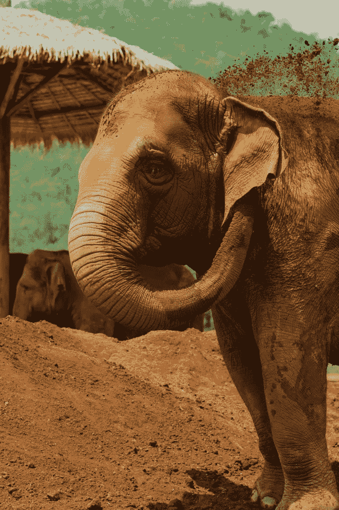
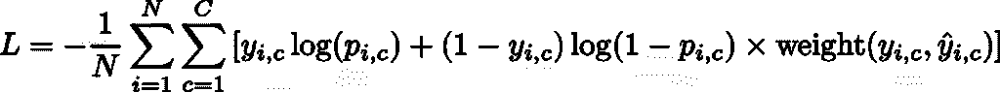
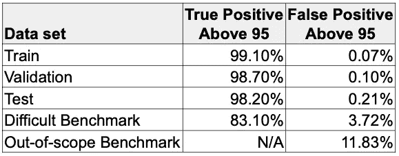
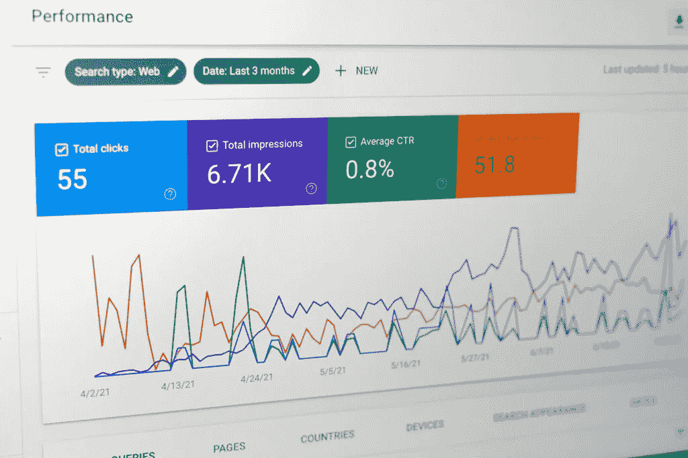

# 机器学习工程师的学习经验 — 第三部分：评估

> 原文：[`towardsdatascience.com/learnings-from-a-machine-learning-engineer-part-3-the-evaluation/`](https://towardsdatascience.com/learnings-from-a-machine-learning-engineer-part-3-the-evaluation/)

在本系列的第三部分，我将探讨评估过程，这是至关重要的一个环节，将导致数据集更加干净，并提升你的模型性能。我们将看到对**训练**模型（尚未投入生产的模型）的评估与对**部署**模型（进行实际预测的模型）的评估之间的区别。

在[第一部分](https://towardsdatascience.com/learnings-from-a-machine-learning-engineer-part-1-the-data/)中，我讨论了你在图像分类项目中使用的图像数据的标签过程。我展示了如何定义“好”图片并创建子类。在[第二部分](https://towardsdatascience.com/learnings-from-a-machine-learning-engineer-part-2-the-data-sets/)中，我概述了各种数据集，包括通常的训练-验证-测试集以外的基准集，以及如何处理合成数据和重复图片。

## **训练模型的评估**

作为机器学习工程师，我们关注准确率、F1、对数损失和其他指标，以决定模型是否准备好投入生产。这些都是重要的衡量标准，但根据我的经验，随着类别数量的增加，这些分数可能会具有欺骗性。

虽然这可能很耗时，但我认为手动审查模型判断错误的图片以及模型给出低**softmax**“置信度”分的图片非常重要。这意味着在训练运行完成后立即添加一个步骤来计算所有图片的分数——训练、验证、测试和基准集。你只需要手动审查模型有问题的那些图片。这应该只占总图片数量的一小部分。请参阅下面的双重检查过程。

在手动评估过程中，你需要将自己置于“**训练心态**”，以确保遵循你在[第一部分](https://towardsdatascience.com/learnings-from-a-machine-learning-engineer-part-1-the-data/)中设置的标签标准。问问自己：

+   “这是一张好图片吗？”主题是否位于中心，你是否可以清楚地看到所有特征？

+   “这个标签正确吗？”如果你发现错误的标签，请不要感到惊讶。

你可以选择移除不良图片或修正错误的标签。否则，你可以将它们保留在数据集中，并迫使模型在下次做得更好。我还问了一些其他问题：

+   “为什么模型会犯这个错误？”

+   “为什么这张图片得分低？”

+   “是什么让这张图片引起了混淆？”

有时候答案与**那个**特定的图像无关。经常，它与**其他**图像有关，无论是在真实类别中还是在预测类别中。如果你看到持续错误的猜测，检查这两组中的所有图像都是值得努力的。再次提醒，如果你发现图像质量差或标签错误，请不要感到惊讶。

## **加权评估**

在评估训练好的模型（上面）时，我们应用了很多主观分析——“为什么模型会犯这个错误？”和“这是一张好图片吗？”从这些分析中，你可能只能得到一种**直觉**。

经常，我会基于直觉决定推迟将模型推向生产。但是，你如何向你的经理证明你想踩刹车呢？这就是通过创建 softmax“置信度”分数的加权平均来引入更**客观**分析的地方。

为了应用加权评估，我们需要识别需要调整分数的类别集合。在这里，我创建了一个“常见混淆”类别的列表。

## **常见混淆类别**

我们动物园中的一些动物很容易混淆。例如，非洲象和亚洲象的耳朵形状不同。如果你的模型将这两个搞混，这并不比猜到长颈鹿更糟糕！所以也许你可以在这里给予部分信用。你可以和你的主题专家（SMEs）一起制定一个这些配对和每个配对的加权调整列表。

图片由[Matt Bango](https://unsplash.com/@mattbango)在[Unsplash](https://unsplash.com/)提供

图片由[Mathew Krizmanich](https://unsplash.com/@matkrizmanich)在[Unsplash](https://unsplash.com/)提供

这个权重可以纳入以下方程中修改后的交叉熵损失函数。方程的后半部分将通过使用“权重”函数作为查找来减少特定真实和预测对的错误影响。默认情况下，加权调整对所有配对都是 1，而常见混淆的类别会得到类似 0.5 的值。

换句话说，当你错误的时候，不如不确定（拥有较低的置信度分数），相比于非常自信却错误。

修改后的交叉熵损失函数，图片由作者提供

一旦计算出这个加权对数损失，我就可以将其与之前的训练运行进行比较，以查看新模型是否准备好投入生产。

## **置信度阈值报告**

另一个包含置信度阈值的（在我的例子中是 95）有价值的度量是报告准确率和假阳性率。记住，在我们将置信度阈值应用于结果展示之前，我们有助于减少假阳性对最终用户的影响。

在这个表格中，我们查看每个数据集中“高于 95 的真实阳性”的分解情况。我们可以感觉到，当“好的”图片出现（如我们训练-验证-测试集中的图片）时，它很可能超过阈值，因此用户对结果“满意”。相反，“高于 95 的假阳性”对于好图片来说非常低，因此只有少数用户会对结果“失望”。

示例置信度阈值报告，图片由作者提供

我们期望训练-验证-测试集的结果会非常出色，因为我们的数据是经过精心挑选的。所以，只要人们拍摄“好的”图片，模型应该表现得很好。但要了解它在极端情况下的表现，让我们看看我们的基准。

“困难”的基准具有更适度的真实阳性和假阳性率，这反映了图像更具挑战性的事实。这些值在训练运行之间更容易比较，因此我可以设定一个最小/最大目标。例如，如果我为真实阳性设定一个最小目标为 80%，为假阳性设定一个最大目标为 5%，那么我可以有信心将其移至生产环境。

“超出范围”的基准没有真实阳性率，因为**没有任何**图片属于模型可以识别的任何类别。记住，我们选择了像爆米花袋等不属于动物园动物的东西，所以不可能有任何真实阳性。但我们确实得到了一个假阳性率，这意味着模型对这个爆米花袋给出了一个自信的分数，认为它是一种动物。如果我们为这个基准设定一个目标最大值为 10%，那么我们可能不想将其移至生产环境。

图片由[Linus Mimietz](https://unsplash.com/@linusmimietz)在[Unsplash](https://unsplash.com/)上提供

现在，你可能正在想，“嗯，它为爆米花袋选择了哪种动物？”这是一个很好的问题！现在你理解了手动审查得到不良结果的图片的重要性。

## **已部署模型的评估**

我上面描述的评估适用于**训练**后的模型。现在，你想要评估你的模型在**现实世界**中的表现。过程类似，但需要你转换到一个“**生产心态**”，并问自己，“模型是否得到了正确的结果？”“它应该得到正确的结果吗？”“我们是否告诉用户正确的事情？”

假设你早上登录——当然是在啜饮你的[cold brew coffee](https://medium.com/@dmartin0409/cold-brew-coffee-0aabd53a1f3e)之后——面前展示的是 500 张你昨天动物园游客拍摄的不同动物的图片。你的任务是确定游客使用你的模型识别动物园动物时的满意度。

使用每个图像的 softmax“置信度”分数，我们在呈现结果之前有一个阈值。高于阈值，我们告诉客人模型预测了什么。我将称之为“快乐路径”。低于阈值的是“悲伤路径”，我们要求他们再试一次。

你的审查界面首先会一次显示所有“快乐路径”图像。这是你问自己的地方，“我们做对了吗？”希望如此！

但如果不是，这里事情就变得棘手了。所以现在你必须问，“为什么不是？”这里有一些可能的原因：

+   “坏”图片 —— 光线差、角度不好、缩放过大等——参考你的标注标准。

+   范围外 —— 它是动物园的动物，但不幸的是，它并不在这个动物园里。也许它属于另一个动物园（你的客人喜欢旅行并尝试你的应用程序）。考虑将这些添加到你的数据集中。

+   范围外 —— 它不是动物园的动物。它可能是你动物园里的动物，但不是通常*包含*在那里的动物，比如邻居的麻雀或野鸭。这可能是一个添加的候选者。

+   范围外 —— 它是动物园里发现的某物。动物园通常有有趣的树木和灌木，所以人们可能会尝试识别它们。这可能是一个添加的候选者。

+   恶作剧者 —— 完全范围外。因为人们喜欢玩弄技术，所以有可能有一个恶作剧者拍了一个爆米花袋、软饮料杯，甚至自拍。这些很难预防，但希望它们的分数足够低（低于阈值），以至于模型没有将其识别为动物园动物。如果你在这些图像中看到足够的模式，考虑创建一个具有前端特殊处理的类别。

在审查“快乐路径”图像后，你将转到“悲伤路径”图像——那些得到低置信度分数并且应用程序给出了“抱歉，请重试”信息的图像。这次你要问自己，“*应该*给这张图像更高的分数吗？”这将把它放入“快乐路径”。如果是这样，那么你想要确保这些图像被添加到训练集中，以便下次它能做得更好。但大多数情况下，低分数反映了上述许多“坏”或范围外的情况。

也许你的模型性能不佳，但这与你模型无关。可能是因为用户与应用程序交互的方式。留意非技术问题，并与你的团队分享你的观察。例如：

+   你的用户是否以你预期的方式使用应用程序？

+   他们没有遵循指示吗？

+   指示需要更清晰地陈述吗？

+   你能做些什么来改善体验？

## **收集统计数据和新图像**

上述两个手动评估都打开了一个数据宝库。所以，务必收集这些统计数据并将它们输入仪表板——你的经理和未来的你都会感谢你！

图片由[Justin Morgan](https://unsplash.com/@justin_morgan)在[Unsplash](https://unsplash.com/)上拍摄

记录这些统计数据并生成报告，供你和你的团队参考：

+   模型被调用的频率是多少？

+   在什么时间，什么星期几使用它？

+   您的系统资源能否处理峰值负载？

+   哪些课程是最常见的？

+   评估后，每个类别的准确率是多少？

+   置信度分数的分布情况如何？

+   有多少分数高于和低于置信度阈值？

从部署的模型中获得的最宝贵的东西是额外的真实世界图片！你现在可以添加这些图片来提高现有动物园动物的覆盖范围。但更重要的是，它们为你提供了关于**其他**类别的洞察。例如，假设人们喜欢在门口拍摄大海象雕像的照片。其中一些可能适合纳入你的数据集，以提供更好的用户体验。

创建一个新的类别，如海象雕像，并不需要很大的努力，并且可以避免误报。将海象雕像识别为大象会更尴尬！至于恶作剧者和爆米花袋，你可以配置前端以静默处理这些情况。你甚至可以发挥创意，让它变得有趣，比如，“感谢您光顾美食广场。”

## **双重检查流程**

当你怀疑数据可能存在问题时，检查你的图片集是个好主意。我并不是建议从头到尾检查，因为那将是一项巨大的工作！而是检查你怀疑可能包含不良数据、从而降低模型性能的特定类别。

在我的训练运行完成后，我有一个脚本将使用这个新模型为我的**整个**数据集生成预测。当这完成时，它将列出错误的识别以及得分较低的预测，并将该列表自动输入到双重检查界面中。

此界面将逐个显示问题图片，以及一个真实情况的示例图片和一个模型预测的示例图片。我可以直观地比较这三个图片，并排查看。我首先确保原始图片符合我的标注标准，是一张“好”的图片。然后检查真实标签是否确实正确，或者是否有导致模型认为它是预测标签的因素。

在这个阶段，我可以：

+   如果图片质量差，请移除原始图片。

+   如果图片属于不同的类别，请重新标注图片。

在这次手动评估中，你可能会注意到数十次相同的错误预测。问问自己，当图片看起来完全正常时，模型为什么会犯这个错误。答案可能是真实情况中的图片标签有误，甚至是在预测类别中的标签错误！

不要犹豫，将这些类和子类重新添加到双检查界面中，并逐一检查它们。你可能需要审查 100-200 张图片，但有很大可能性有一两张图片会突出显示为问题所在。

## **接下来…**

对于训练模型和部署模型的不同心态，我们现在可以评估性能以决定哪些模型适合生产，以及生产模型将如何为公众服务。这依赖于一个坚实的双检查流程和对数据的批判性审视。而且，除了对模型的“直觉”之外，我们还可以依赖基准分数来支持我们。

在[第四部分](https://towardsdatascience.com/learnings-from-a-machine-learning-engineer-part-4-the-model/)中，我们开始了训练运行，但有一些微妙的技术可以帮助我们充分利用这个过程，甚至有利用废弃模型来扩展你的图像数据库的方法。
