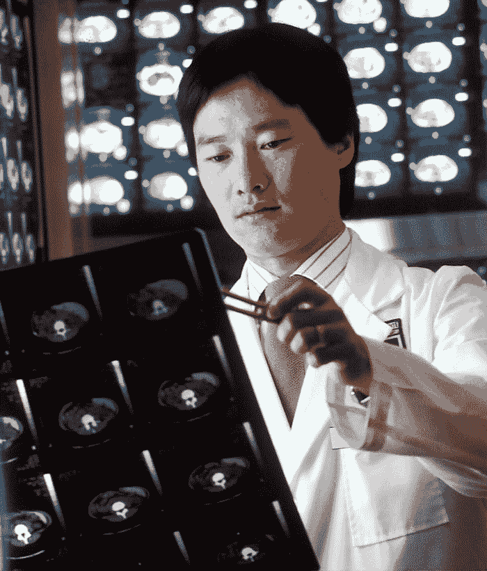
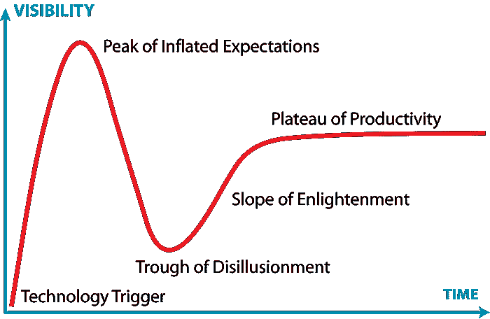

# 机器学习工程师的学习经验 — 第六部分：人的方面

> 原文：[`towardsdatascience.com/learnings-from-a-machine-learning-engineer-part-6-the-human-side/`](https://towardsdatascience.com/learnings-from-a-machine-learning-engineer-part-6-the-human-side/)

在我之前的文章中，我花费了大量时间讨论图像分类问题的**技术方面**，从[数据收集](https://towardsdatascience.com/learnings-from-a-machine-learning-engineer-part-1-the-data/)、[模型评估](https://towardsdatascience.com/learnings-from-a-machine-learning-engineer-part-3-the-evaluation/)、[性能优化](https://towardsdatascience.com/learnings-from-a-machine-learning-engineer-part-4-the-model/)，以及详细探讨[模型训练](https://towardsdatascience.com/learnings-from-a-machine-learning-engineer-part-5-the-training/)。

这些元素需要一定程度的深入专业知识，并且它们（通常）有明确定义的指标和既定的流程，这些都在我们的控制范围内。

现在是时候考虑了...

> 机器学习的人性方面

是的，这听起来可能有些矛盾！但正是与人们的互动——您与之共事的人和那些使用您应用程序的人——帮助使这项技术变得生动，并为您的工作带来满足感。

这些人际互动包括：

+   向非技术受众传达技术概念。

+   理解您的最终用户如何与您的应用程序互动。

+   明确说明模型能做什么和不能做什么的期望。

我还想要谈谈人工智能成为我们日常生活一部分对人们工作的影响，无论是积极的还是消极的。

## 概述

正如我之前的文章一样，我将围绕一个图像分类应用程序来引导这次讨论。考虑到这一点，以下是参与您项目的群体：

+   **AI/ML 工程师**（即您）——赋予机器学习应用程序生命。

+   **MLOps 团队**——您的同事，他们将部署、监控和增强您的应用程序。

+   **领域专家**——那些将提供标注数据照顾和喂养的人。

+   **利益相关者**——那些在寻找解决现实世界问题方案的人。

+   **最终用户**——那些将使用您应用程序的人。这些可能是内部和外部客户。

+   **市场营销**——那些将推广您应用程序使用的人。

+   **领导层**——那些支付账单并需要看到商业价值的人。

让我们直接深入探讨...

## AI/ML 工程师

您可能是团队的一员或独自一人。您可能是个人贡献者或团队领导者。

由[Christina @ wocintechchat.com](https://unsplash.com/@wocintechchat?utm_source=medium&utm_medium=referral)在[Unsplash](https://unsplash.com/?utm_source=medium&utm_medium=referral)上的照片

无论您的角色是什么，重要的是要看到整体情况——不仅仅是编码、数据科学以及 AI/ML 背后的技术——以及它为您组织带来的价值。

## 理解业务需求

您的公司面临着许多挑战，以减少开支、提高客户满意度和保持盈利。将自己定位为能够创建帮助实现他们目标的应用程序的人。

+   业务流程中的痛点是什么？

+   使用您的应用程序的价值是什么（时间节省，成本节省）？

+   实施不佳的风险是什么？

+   未来增强和用例的路线图是什么？

+   企业的哪些其他领域可以从应用程序中受益，以及哪些设计选择将帮助您的作品面向未来？

## 沟通。

与同行进行深入的技术讨论可能是我们的舒适区。然而，要成为一名更成功的 AI/ML 工程师，您应该能够清楚地向不同的受众解释您正在做的工作。

通过练习，您可以用非技术业务用户能够跟随和理解的方式解释这些主题，并了解您的技术将如何使他们受益。

为了帮助您适应这一点，尝试创建一个包含 2-3 张幻灯片、您可以在 5-10 分钟内涵盖的 PowerPoint。例如，解释神经网络如何通过识别图像中的猫或狗来确定它是哪一种。

在心中练习向朋友——甚至您的宠物狗或猫！这样做会使您更适应过渡，使内容更加紧凑，并确保您尽可能清晰地涵盖所有重要点。

+   一定要包括视觉元素——纯文本是无聊的，图形是令人难忘的。

+   关注时间——尊重您受众忙碌的日程，并坚持您被给予的 5-10 分钟。

+   置身于他们的位置——您的受众对技术如何使他们受益感兴趣，而不是您有多聪明。

创建技术演示文稿很像**费曼技巧**——通过将复杂主题分解成易于消化的部分向您的受众解释，同时还有帮助您更完全理解它的额外好处。

## MLOps 团队

这些人是部署您的应用程序、管理数据管道以及监控保持系统运行的基础设施的人员。

没有他们，您的模型就生活在 Jupyter 笔记本中，对任何人都没有帮助！

图片由[airfocus](https://unsplash.com/@airfocus?utm_source=medium&utm_medium=referral)在[Unsplash](https://unsplash.com/?utm_source=medium&utm_medium=referral)提供。

这些是您的技术同行，因此您应该能够更自然地与他们建立联系。您说的行话对大多数人来说听起来像外语。即便如此，为您创建文档以设定关于以下方面的期望也是极其有帮助的：

+   流程和数据流。

+   数据质量标准。

+   模型性能和可用性的服务级别协议。

+   计算和存储的基础设施需求。

+   角色和职责。

与你的 MLOps 团队保持更非正式的关系很容易，但记住，每个人都同时在处理许多项目。

邮件和聊天消息适用于快速处理问题。但对于更大的任务，你将需要一个系统来跟踪用户故事、增强请求和故障修复问题。这样你可以优先处理工作，并确保不会忘记任何事情。此外，你可以向你的主管展示进度。

一些优秀的工具存在，例如：

+   Jira、GitHub、Azure DevOps Boards、Asana、Monday 等。

我们都是专业人士，所以拥有一个更正式的系统来避免误解和不信任是好的商业行为。

## 领域专家

这些是那些在 AI/ML 项目中使用的数据方面经验最丰富的团队成员。

图片由[National Cancer Institute](https://unsplash.com/@nci?utm_source=medium&utm_medium=referral)在[Unsplash](https://unsplash.com/?utm_source=medium&utm_medium=referral)提供

领域专家在处理杂乱数据方面非常熟练——毕竟他们是人！他们可以通过考虑他们专业领域之外的知识来处理一次性情况。例如，医生可能识别出患者 X 光片中的金属植入物，这表明之前做过手术。他们也可能注意到由于设备故障或技术人员错误导致的 X 光片损坏。

然而，你的机器学习模型只知道它所知道的内容，这些内容来自它所训练的数据。因此，那些一次性案例可能不适合你正在训练的模型。你的领域专家需要理解，清晰的、高质量的训练材料是你所寻找的。

## 像计算机一样思考

在图像分类应用的情况下，模型的输出会告诉你它在数据集上的训练效果如何。这以**错误率**的形式呈现，非常类似于学生参加考试，你可以通过看到他们答错**多少**题以及**哪些**题来判断他们学习得如何。

为了降低错误率，你的图像数据集需要客观上是“好”的训练材料。为此，让自己处于分析思维状态，并问自己：

+   计算机将从中获得最有用的信息的图像是什么？确保所有相关特征都可见。

+   是什么让模型对图像感到困惑？当它出错时，试着通过查看**整个**图片来客观地理解原因。

+   这张图像是“一次性”的还是最终用户发送的典型示例？考虑创建一个新的异常子类。

一定要向你的领域专家传达模型性能与数据质量直接相关，并给他们提供明确的指导：

+   提供成功的视觉示例。

+   提供不成功的反例。

+   请求广泛的多种数据点。在 X 光片示例中，确保获取不同年龄、性别和种族的患者。

+   提供创建你数据的子类以进行进一步细化的选项。使用之前做过手术的患者的 X 光片作为子类，随着时间的推移，你可以获取更多示例，模型可以处理它们。

这也意味着你应该熟悉他们正在处理的数据——可能不是专家水平，但肯定高于新手水平。

最后，当与中小企业合作时，要意识到他们可能有的印象，即你所做的工作可能会以某种方式取代他们的工作。当有人问你如何做你的工作时，这可能会感到威胁，所以要有意识。

理想情况下，你正在构建一个具有诚实意图的工具，这将使你的中小企业能够增强他们的日常工作。如果他们能够使用这个工具作为第二意见，在更短的时间内验证他们的结论，或者甚至避免错误，那么这对每个人来说都是一种胜利。最终的目标是让他们能够专注于更具挑战性的情况，并取得更好的成果。

我在结束语中还有更多要说的。

## 利益相关者

这些是你将建立最密切关系的人。

利益相关者是那些最初创建商业案例让你构建机器学习模型的人。

图片由[Ninthgrid](https://unsplash.com/@ninthgrid_?utm_source=medium&utm_medium=referral)在[Unsplash](https://unsplash.com/?utm_source=medium&utm_medium=referral)提供

他们对拥有一个表现良好的模型有直接的利益。在与你的利益相关者合作时，以下是一些关键点：

+   一定要倾听他们的需求和期望。

+   预测他们的问题，并准备好回答。

+   寻找提高你的模型性能的机会。你的利益相关者可能不像你那样接近技术细节，也可能认为没有改进的余地。

+   将问题和问题带到他们的注意。他们可能不想听到坏消息，但他们会欣赏诚实而不是回避。

+   安排定期的更新，包括使用情况和性能报告。

+   用易于理解的语言解释技术细节。

+   对定期培训和部署周期及时间表设定期望。

作为 AI/ML 工程师，你的角色是使利益相关者的愿景成为现实。你的应用程序使他们的生活变得更轻松，这证明了你所做工作的合理性和有效性。这是一条双向的道路，所以请确保分享这条路。

## 最终用户

这些是使用你的应用程序的人。他们也可能成为你最严厉的批评者，但你可能永远不会听到他们的反馈。

图片由[Alina Ruf](https://unsplash.com/@auna_f?utm_source=medium&utm_medium=referral)在[Unsplash](https://unsplash.com/?utm_source=medium&utm_medium=referral)提供

## 像人类一样思考

回想一下，当我建议在分析训练集数据时“像计算机一样思考”。现在是你将自己置于你应用程序的非技术用户的位置的时候了。

图像分类模型的最终用户通过糟糕的图像传达他们对期望的理解。这些人就像没有为考试复习，或者更糟糕的是没有阅读问题，所以他们的答案没有意义。

你的模型可能非常好，但如果最终用户误用应用程序或对输出不满意，你应该问自己：

+   指令是否令人困惑或误导？用户是否将相机聚焦于被分类的主题，或者它更多的是一个广角图像？如果用户遵循了错误的指令，你不能责怪他们。

+   他们的期望是什么？当结果呈现给用户时，他们是满意还是沮丧？你可能注意到沮丧的用户重复出现相同的图像。

+   使用模式是否在改变？他们是否试图以意想不到的方式使用应用程序？这可能是一个改进模型的机会。

向你的利益相关者报告你的观察结果。可能有简单的修复来提高最终用户的满意度，或者可能还有更复杂的工作在前方。

如果你很幸运，你可能会发现一种意想不到的方式来利用应用程序，这可能导致使用范围的扩大或对你业务的令人兴奋的好处。

## 可解释性

大多数 AI/ML 模型被认为是“黑盒”，它们在极高维度的数据上进行数百万次计算，并产生一个相当简单化的结果，没有任何背后的原因。

> **《银河系漫游指南》中关于生命、宇宙和万物终极问题的答案是 42。** ——《银河系漫游指南》

根据情况，你的最终用户可能需要更多对结果的解释，例如在医学成像中。在可能的情况下，你应该考虑结合模型可解释性技术，如 LIME、SHAP 等。这些响应可以帮助给冷冰冰的计算带来人性化的触感。

现在是时候转换思路，考虑你组织中的高层管理人员。

## 市场营销团队

这些人是在推广你辛勤工作的使用。如果你的最终用户对应用程序一无所知，或者不知道在哪里找到它，你的努力就会白费。

市场营销团队控制着用户在网站上找到你的应用以及通过社交媒体渠道链接到它的地方。他们还从不同的角度看待这项技术。

Gartner 炒作周期。图片来自维基百科 – [`en.wikipedia.org/wiki/Gartner_hype_cycle`](https://en.wikipedia.org/wiki/Gartner_hype_cycle)

上述的炒作周期很好地展示了技术进步通常是如何流动的。一开始，可能会对你新的 AI/ML 工具能做什么有不切实际的期望——它是自切片面包以来最伟大的东西！

然后，“新”的兴奋感消退。你可能会面临对应用程序缺乏兴趣的情况，市场营销团队（以及你的最终用户）会转向下一件事。实际上，你的努力的价值就在中间。

理解到市场营销团队的兴趣在于推广工具的使用，因为它将如何使组织受益。他们可能不需要了解其技术内部运作。但他们应该了解该工具能做什么，以及它不能做什么。

事先进行诚实和清晰的沟通将有助于平息炒作周期，并使每个人都保持更长时间的兴趣。这样，从顶峰期望到幻灭的低谷的崩溃就不会那么严重，以至于应用程序被完全放弃。

## 领导团队

这些人是授权支出并具有如何将应用程序融入整体公司战略的愿景的人。他们受到你无法控制的因素的驱动，你可能甚至都没有意识到。确保为他们提供关于你项目的关键信息，以便他们可以做出明智的决定。

图片由[Adeolu Eletu](https://unsplash.com/@adeolueletu?utm_source=medium&utm_medium=referral)在[Unsplash](https://unsplash.com/?utm_source=medium&utm_medium=referral)提供

根据你的角色，你可能或可能没有与公司的高管直接互动。你的工作是总结与你的项目相关的成本和收益，即使这仅仅是与你的直接上司沟通，他将把信息传递下去。

你的成本可能包括：

+   计算和存储——训练和部署模型。

+   图像数据收集——既包括现实世界的数据，也包括合成或模拟的数据。

+   每周小时数——SME、MLOps、AI/ML 工程时间。

突出节省和/或增加的价值：

+   提供关于速度和准确性的衡量标准。

+   将效率转化为节省的 FTE 小时数和客户满意度。

+   如果你能够找到一种产生收入的方法，那么你将获得额外的加分。

商业领导者，就像市场营销团队一样，可能会遵循炒作周期：

+   对模型性能保持现实。不要试图过度销售，但要诚实地关于改进的机会。

+   考虑创建一个人类基准测试来衡量 SME 的准确性和速度。说人类准确率是 95%很容易，但衡量它则是另一回事。

+   突出短期胜利以及它们如何成为长期成功。

## 结论

我希望你能看到，在创建 AI/ML 应用程序的技术挑战之外，许多人在一个成功的项目中发挥着作用。能够与这些人互动，并在他们期望技术的地方与他们相遇，对于推进你应用程序的采用至关重要。

图片由[Vlad Hilitanu](https://unsplash.com/@vladhilitanu?utm_source=medium&utm_medium=referral)在[Unsplash](https://unsplash.com/?utm_source=medium&utm_medium=referral)提供

关键要点：

+   理解你的应用程序如何满足业务需求。

+   练习与非技术受众沟通。

+   收集模型性能的度量标准，并定期向利益相关者报告这些信息。

+   预期炒作周期可能会帮助也可能伤害你的事业，而设定一致和现实的期望将确保稳定的采用。

+   注意到超出你控制范围的因素，如预算和商业战略，可能会影响你的项目。

最重要的是……

> 不要让机器独占学习的乐趣！

人类的天性赋予我们理解我们世界的求知欲。抓住每一个机会增长和扩展你的技能，并记住人类互动是机器学习的核心。

## 总结发言

人工智能/机器学习的进步（假设它们得到适当的开发）有可能像人类一样完成许多任务。说“比人类更好”可能有些夸张，因为它的好坏取决于人类提供的训练数据。然而，可以说人工智能/机器学习可以比人类**更快**。

下一个合乎逻辑的问题可能是，“那么，这意味着我们可以取代人类工人吗？”

这是一个微妙的话题，我想明确表示，我并不是消除工作的倡导者。

我认为我的角色作为人工智能/机器学习工程师，是创造工具来帮助他人完成工作或提高他们成功完成工作的能力的。当这些工具被正确使用时，它们可以验证困难的决策并快速完成重复性任务，使您的专家有更多时间关注需要更多关注的独特情况。

也可能存在新的职业机会，从数据的维护和喂养、质量评估、用户体验，甚至到利用这项技术在令人兴奋和意想不到的方式中发挥作用的全新角色。

不幸的是，商业领袖可能会做出影响人们工作的决策，而这完全超出了你的控制范围。但并非一切都已失去——即使是对于我们人工智能/机器学习工程师来说……

> 我们可以做些事情

+   对我们称之为“同事”的人类同伴保持友好。

+   注意科技进步带来的恐惧和不确定性。

+   寻找帮助人们利用人工智能/机器学习在他们的职业生涯中取得进步并改善他们生活的途径。

这都是人类的一部分。
