# 最小二乘法：便利性与最优性的交汇

> 原文：[`towardsdatascience.com/least-squares-where-convenience-meets-optimality/`](https://towardsdatascience.com/least-squares-where-convenience-meets-optimality/)

### 0\. <mdspan datatext="el1742888848513" class="mdspan-comment">引言</mdspan>

在机器学习的数值优化和回归任务中，几乎到处都使用最小二乘法。它的目标是使给定模型的均方误差（MSE）最小化。

L1（绝对值之和）和 L2（平方之和）范数提供了一种直观的方法来求和有符号误差，同时防止它们相互抵消。然而，L2 范数导致损失函数更加平滑，避免了绝对值中的尖角。

但为什么这样一个简单的损失函数如此受欢迎呢？我们将看到，除了易于计算之外，还有相当有力的论据支持最小二乘法。

1.  **计算便利性**：平方损失函数易于微分，并且在优化线性回归时提供封闭形式的解。

1.  **均值和中位数**：我们都很熟悉这两个量，但有趣的是，很少有人知道它们自然源于 L2 和 L1 损失。

1.  **OLS 是 BLUE**：在所有无偏估计量中，普通最小二乘法（OLS）是最佳线性无偏估计量（BLUE），即具有最低方差的那个。

1.  **LS 是具有正态误差的 MLE**：使用最小二乘法拟合任何模型（线性或非线性）相当于在正态分布误差下的最大似然估计。

总之，从数学角度来看，最小二乘法是完全有道理的。然而，请注意，如果理论假设不再满足，它可能会变得不可靠，例如当数据分布包含异常值时。

> 注意：我知道已经有一个关于这个主题的优秀 subreddit，[“为什么我们在线性回归中使用最小二乘法？”](https://www.reddit.com/r/math/comments/1g0b6h9/why_do_we_use_least_squares_in_linear_regression/)。然而，我在这篇文章中想专注于展示直观理解和严格的证明。

* * *

照片由 [Pablo Arroyo](https://unsplash.com/@pablogamedev?utm_source=medium&utm_medium=referral) 在 [Unsplash](https://unsplash.com?utm_source=medium&utm_medium=referral) 上提供

### 1\. 计算便利性

#### 优化

训练一个模型意味着调整其参数以优化给定的成本函数。在一些非常幸运的情况下，其微分可以直接导出最优参数的封闭形式解，无需经过迭代优化。

准确地说，平方函数是凸的、光滑的，并且易于微分。相比之下，绝对函数在 0 处不可微分，使得优化过程不那么直接。

#### 可微性

当使用`n`个输入-输出对`(x,y)`和由θ参数化的模型`f`训练回归模型时，最小二乘损失函数为：

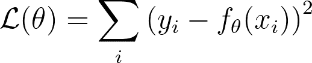

只要模型`f`相对于θ是可微的，我们就可以轻松推导出损失函数的梯度。

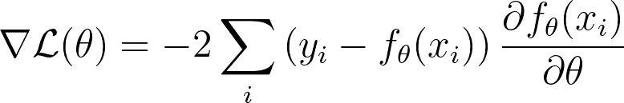

#### 线性回归

线性回归估计给定`n`个输入-输出对`(x,y)`数据集的最佳线性系数β。

下面的方程式展示了左侧的 L1 损失和右侧的 L2 损失，用于评估β在数据集上的适应性。

> 我们通常省略索引`<em>i</em>`并切换到向量化的表示，以便更好地利用线性代数。这可以通过将输入向量作为行堆叠以形成设计矩阵 X 来完成。同样，输出被堆叠到一个向量 Y 中。

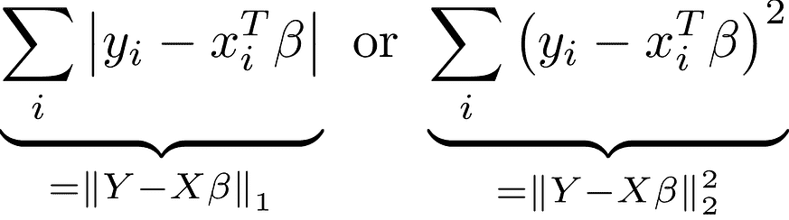

#### 普通最小二乘法

L1 公式的改进空间非常有限。另一方面，L2 公式是可微的，并且其梯度仅在单个最佳参数集β时为零。这种方法被称为普通最小二乘法（OLS）。

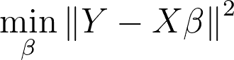

将梯度置零得到 OLS 估计器的闭式解，使用伪逆矩阵。这意味着我们可以直接计算最佳系数，而无需进行数值优化过程。

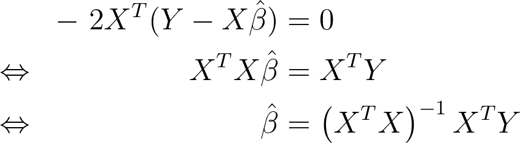

#### 备注

现代计算机非常高效，解析解和数值解之间的性能下降通常并不显著。因此，计算便利性并不是我们实际使用最小二乘法的主要原因。

***

图片由[Chris Lawton](https://unsplash.com/@chrislawton?utm_source=medium&utm_medium=referral)在[Unsplash](https://unsplash.com?utm_source=medium&utm_medium=referral)提供

### 2. 平均值和中位数

#### 简介

你肯定已经计算过平均值或中位数，无论是使用 Excel、NumPy 还是手工计算。它们是统计学中的关键概念，并且经常为收入、成绩、测试分数或年龄分布提供有价值的见解。

我们对这两个量非常熟悉，以至于很少质疑它们的起源。然而，有趣的是，它们自然源于 L2 和 L1 损失。

给定一组实数`xi`，我们通常试图将它们聚合到一个单一的代表性值，例如平均值或中位数。这样，我们可以更容易地比较不同的值集。然而，“很好地”代表数据是纯粹主观的，取决于我们的期望，即成本函数。例如，平均收入和中位数收入都相关，但它们传达了不同的见解。平均值反映了总体财富，而中位数提供了一个不受极低或极高收入影响的典型收入的更清晰的画面。

给定一个成本函数ρ，正如我们所期望的，我们解决以下优化问题以找到“最佳”代表值µ。

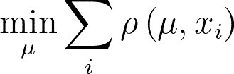

#### 均值

让我们考虑ρ是 L2 损失。

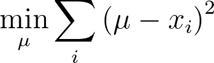

将梯度置零很简单，并揭示了均值定义。

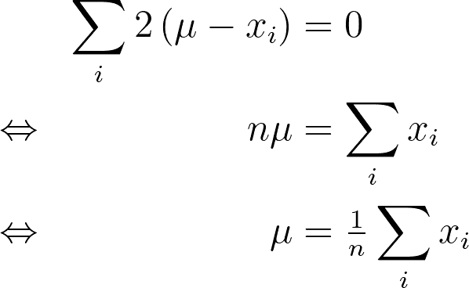

因此，我们已经表明，从 L2 损失的角度来看，均值最好地代表了`xi`。

#### 中位数

让我们考虑 L1 损失。作为一个分段线性函数的总和，它本身也是分段线性的，其梯度在每个`xi`处有间断。

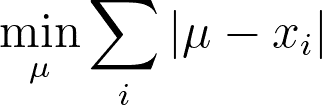

下图说明了每个`xi`的 L1 损失。为了不失一般性，我已经对`xi`进行了排序以排列非可微的尖点。每个函数`|µ-xi|`在`xi`以下为`xi-µ`，在`xi`以上为`µ-xi`。

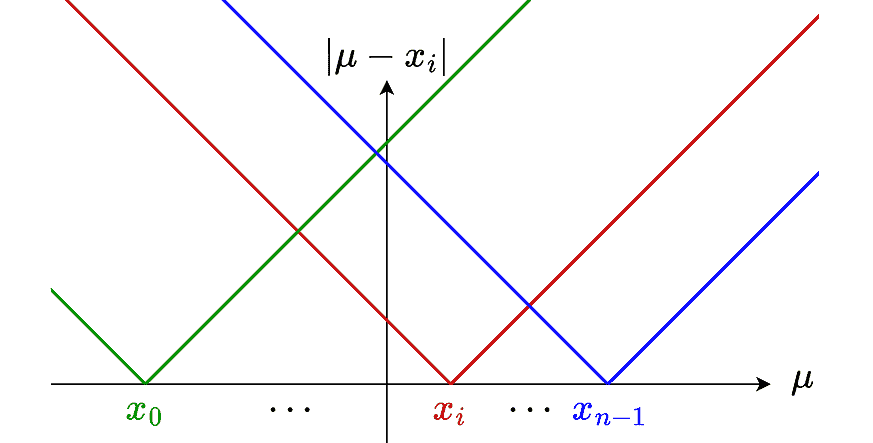

µ和每个`xi`之间的 L1 损失——作者制图

下表清晰地说明了每个单独的 L1 项`|µ-xi|`的分段表达式。我们可以将这些表达式相加以获得总的 L1 损失。当`xi`排序后，最左边部分有斜率为`-n`，最右边部分有斜率为`+n`。

> 为了提高可读性，我已经将常数截距隐藏为`<em>Ci</em>`。

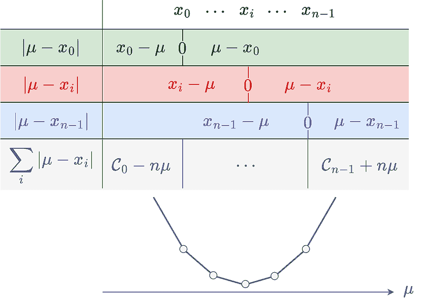

每个单独的绝对函数及其总和的分段定义表——作者制图

直观地，这个分段线性函数的最小值发生在斜率从负变正的地方，这正是中位数所在的位置，因为点已经排序。

因此，我们已经表明，中位数从 L1 损失的角度来看，最好地代表了`xi`。

> 注意。对于奇数个点，中位数是中间值，是 L1 损失的唯一最小化值。对于偶数个点，中位数是两个中间值的平均值，L1 损失形成一个平台，这两个值之间的任何值都可以最小化损失。

* * *

由[Fauzan Saari](https://unsplash.com/@fznsr_?utm_source=medium&utm_medium=referral)在[Unsplash](https://unsplash.com?utm_source=medium&utm_medium=referral)上的照片

### 3. OLS 是 BLUE

#### 高斯-马尔可夫定理

高斯-马尔可夫定理表明，普通最小二乘法（OLS）估计量是最佳线性无偏估计量（BLUE）。这里的“最佳”意味着 OLS 在所有线性无偏估计量中具有最低的方差。

> 这个样本方差表示从同一总体中抽取的不同样本中β系数估计值的变化程度。

该定理假设`Y`遵循一个具有真实线性系数β和随机误差ε的线性模型。这样，我们可以分析估计量的β估计值如何随噪声ε的不同值而变化。

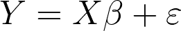

对随机误差 ε 的假设确保它们是无偏的（零均值）、同方差（常数有限方差）和无关的（对角协方差矩阵）。

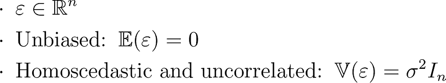

#### 线性

注意，高斯-马尔可夫定理中的“线性”指的是两个不同的概念：

+   **模型线性**: 回归假设 `Y` 和 `X` 之间存在线性关系。

+   **估计线性**: 我们只考虑在 `Y` 上线性的估计量，这意味着它们必须包含一个由矩阵 `C` 表示的线性成分，该矩阵只依赖于 `X`。

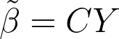

#### OLS 的无偏性

OLS 估计量，用帽子表示，已经在之前推导出来。将 Y 的随机误差模型代入给出一个更好地捕捉真实 β 偏差的表达式。

> 我们引入矩阵 `<em>A</em>` 来表示 OLS 特定的线性成分 `<em>C</em>`，以提高可读性。

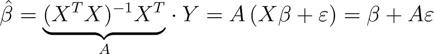

如预期的那样，OLS 估计量是无偏的，因为它的期望值围绕无偏误差 ε 的真实 β 中心。

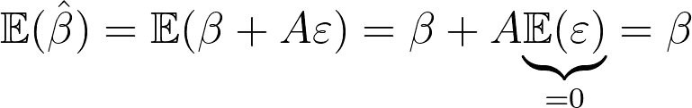

#### 定理的证明

让我们考虑一个线性估计量，用波浪号表示，其线性成分 `A+D`，其中 `D` 代表从 OLS 估计量中产生的平移。

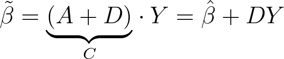

这个线性估计量的期望值最终是真实的 β 加上一个额外的项 DXβ。为了使估计量被认为是无偏的，这个项必须是零，因此 `DX=0`。这种正交性确保平移 `D` 不会引入任何偏差。

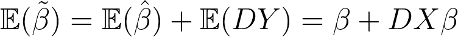

注意，这也意味着 `DA'=0`，这在以后会很有用。

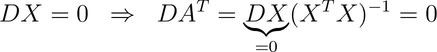

现在我们已经保证了我们的线性估计量的无偏性，我们可以将其方差与 OLS 估计量进行比较。

由于矩阵 `C` 是常数且误差 ε 是球形的，我们得到以下方差。

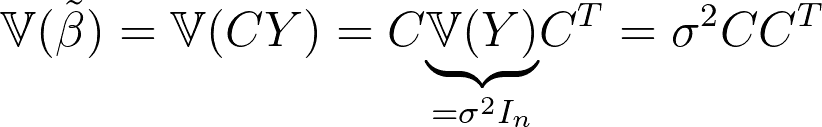

在将 `C` 替换为 `A+D`、展开项并使用 `DA'` 的正交性之后，我们最终得到我们的线性估计量的方差等于两个项的和。第一个项是 OLS 估计量的方差，第二个项是正的，因为 `DD’` 的正定性。

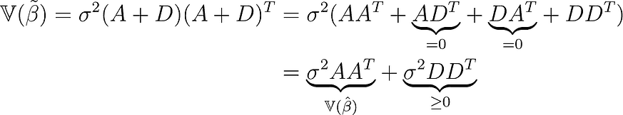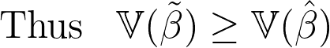

因此，我们已经表明，OLS 估计量在具有无偏球形误差的线性回归中，在所有线性估计量中实现了最低的方差。

#### 备注

OLS 估计量在最小方差方面被认为是“最佳”。然而，值得注意的是，方差的定义本身与最小二乘法紧密相关，因为它反映了从期望值到平方差的期望。

因此，关键问题将是为什么方差通常这样定义。

* * *

图片由 [Alperen Yazgı](https://unsplash.com/@armato?utm_source=medium&utm_medium=referral) 在 [Unsplash](https://unsplash.com?utm_source=medium&utm_medium=referral) 上提供

### 4. 最小二乘法是具有正态误差的最大似然估计

#### 最大似然估计

最大似然估计（MLE）是一种通过最大化在由θ定义的模型下观察给定数据`(x,y)`的似然来估计模型参数θ的方法。

假设成对`(xi,yi)`是独立同分布的（i.i.d.），我们可以将似然表示为条件概率的乘积。

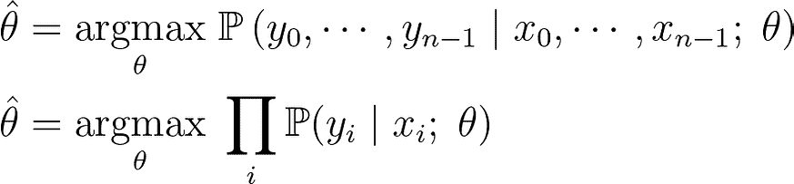

一个常见的技巧是在乘积上应用对数，将其转换为更方便且数值上更稳定的对数和。由于对数是单调递增的，因此它仍然等同于解决相同的优化问题。这就是我们得到众所周知的对数似然的原因。

> 在数值优化中，我们通常在最大化量之前添加一个负号来最小化它们。

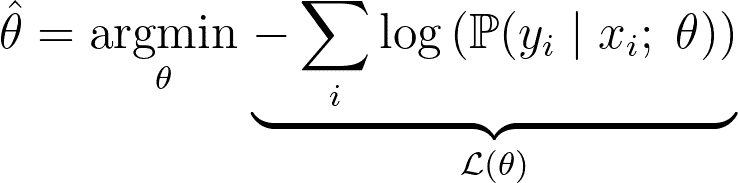

#### MLE 推断

一旦估计了最优模型参数θ，推断就是通过找到给定观察到的`x`条件下最大化条件概率的`y`值来进行的，即最可能的`y`。

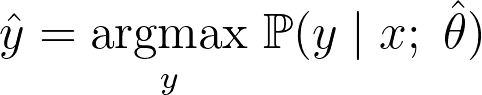

#### 模型参数

注意，对模型没有特定的假设。它可以任何类型，其参数只是简单地堆叠成一个扁平向量θ。

例如，θ可以代表神经网络的权重、随机森林的参数、线性回归模型的系数等等。

#### 正态误差

至于真实模型周围的误差，我们假设它们是无偏且正态分布的。

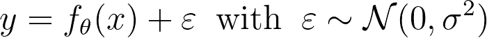

> 这相当于假设`<em>y</em>`遵循由模型预测的均值和固定方差σ²的正态分布。

注意，推断步骤是直接的，因为正态分布的峰值在均值处，即模型预测的值。

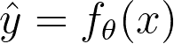

有趣的是，正态密度中的指数项与对数似然的对数相抵消。结果证明，它等同于一个简单的最小二乘法最小化问题！

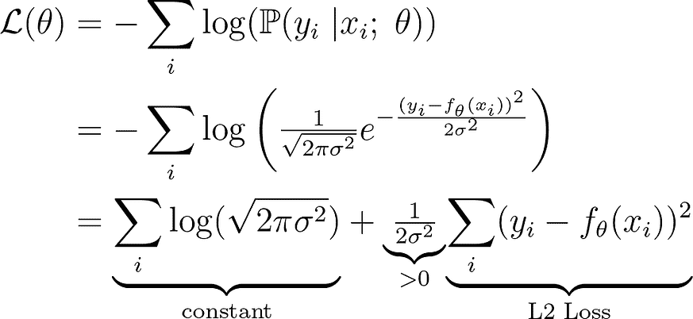

因此，使用最小二乘法拟合任何模型，无论是线性的还是非线性的，在正态分布误差下都等同于最大似然估计。

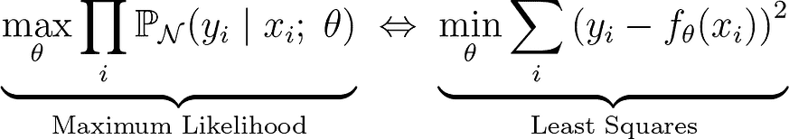

* * *

图片由 [Brad Switzer](https://unsplash.com/@mintchap?utm_source=medium&utm_medium=referral) 在 [Unsplash](https://unsplash.com?utm_source=medium&utm_medium=referral) 上提供

### 结论

#### 基本工具

总之，最小二乘法的流行源于其计算简单性和与关键统计原理的深层联系。它为线性回归（即最佳线性无偏估计）提供了一个闭式解，定义了均值，并且在正态误差下等同于最大似然估计。

#### BLUE 还是 BUE？

甚至有人争论是否可以放宽高斯-马尔可夫定理的线性假设，使得 OLS 也可以被认为是最佳无偏估计（BUE）。

> 我们仍在解决线性回归问题，但这次估计量可以保持线性，也可以是非线性的，因此是 BUE 而不是 BLUE。

经济学家 Bruce Hansen 认为他在 2022 年[1]中已经证明了这一点，但 Pötscher 和 Preinerstorfer 很快驳斥了他的证明[2]。

#### 异常值

当误差不是正态分布时，例如存在异常值时，最小二乘法很可能变得不可靠。

如我们之前所见，由 L2 定义的均值高度受极端值的影响，而由 L1 定义的中位数则简单地忽略它们。

像 Huber 或 Tukey 这样的鲁棒损失函数倾向于在小的误差情况下仍然模仿最小二乘法的二次行为，而对于大的误差则通过接近 L1 或常数行为来大幅度减少其影响。它们相比于 L2 来说，是处理异常值和提供稳健估计的更好选择。

#### 正则化

在某些情况下，使用带有正则化的有偏估计量，如岭回归，可以提高对未见数据的泛化能力。虽然引入了偏差，但它有助于防止过拟合，使模型更加稳健，特别是在噪声或高维设置中。

* * *

[1] Bruce E. Hansen, 2022. “**现代高斯-马尔可夫定理**”，[Econometrica](https://ideas.repec.org/s/wly/emetrp.html)，计量经济学学会，第 90 卷第 3 期，第 1283-1294 页，2022 年 5 月。

[2] Pötscher, Benedikt M. & Preinerstorfer, David, 2022. “**现代高斯-马尔可夫定理？真的吗？**”，[MPRA 论文](https://ideas.repec.org/s/pra/mprapa.html) 112185，德国慕尼黑大学图书馆。
