# 🚪🚪🐐 从蒙提霍尔问题中学到的决策经验

> 原文：[`towardsdatascience.com/lessons-in-decision-making-from-the-monty-hall-problem-2/`](https://towardsdatascience.com/lessons-in-decision-making-from-the-monty-hall-problem-2/)

<mdspan datatext="el1747338606995" class="mdspan-comment">蒙提霍尔问题</mdspan> 是一个著名的思维游戏，我们可以从中学习到在决策中非常重要的经验教训，这些经验教训对一般人和数据科学家都很有用。

如果你对这个问题不熟悉，准备感到困惑 🤯。如果你熟悉，我希望能够阐明你可能没有考虑到的方面 💡。

我介绍了这个问题，并使用三种直觉来解决它：

+   **常见** — 这篇文章的核心是应用我们的*常识*来解决这个问题。我们将探讨为什么它让我们失望 😕，以及我们可以如何直观地克服它，使解决方案清晰可见 🤓。我们将通过使用视觉 🎨，定性论点和一些基本概率（不会太深，我保证）来实现这一点。

+   **贝叶斯** — 我们将简要讨论信念传播的重要性。

+   **因果** — 我们将使用图模型来可视化在现实世界设置中使用蒙提霍尔问题的条件。

    🚨剧透警告 🚨 我还没有确信有任何经验，但这个过程非常有用。

我通过讨论从中学到的经验来总结，以更好地进行数据决策。

关于贝叶斯和因果直觉，我们将以温和的形式进行讨论。对于数学爱好者 ⚔️，我在总结之后还提供了补充部分，简要深入探讨了每种方法。（注意：这些不是欣赏文章主要观点所必需的。）

通过检查这个概率谜题的不同方面 🧩，你可能会希望提高你的数据决策能力 ⚖️。


信用：[维基百科](https://upload.wikimedia.org/wikipedia/en/c/cf/LMADlogo2011.jpg)

首先，一些历史。*让我们做交易* 是一个始于 1963 年的美国电视游戏节目。其前提是观众参与者被视为与主持人蒙提霍尔 🎩 做交易的交易者。

问题的核心是一个看似简单的场景：

一个交易者面临着一个问题：从三个门中选择一个，以赢得豪华奖品的机会，例如一辆汽车 🚗。其他两个门后面是山羊 🐐。


交易者面前有三扇关闭的门。

交易者选择了一扇门。我们可以称之为（不失一般性）门 A，并用 ☝️ 标记它。

保持所选的门 ☝️ 关闭，主持人揭示了一个剩余的门，显示了一只山羊 🐐（我们可以称之为门 C）。

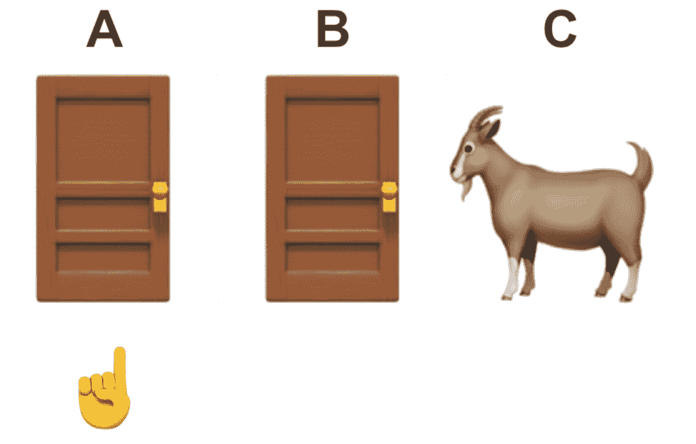

交易者选择了一个门 ☝️，主持人 🎩 揭示了门 C，显示了一只山羊。

然后，主持人会问交易者他们是否想坚持他们的第一个选择 ☝️ 或切换到另一个剩余的门（我们将称之为门 B）。

如果交易者猜对了，他们将赢得奖品 🚗。如果猜错了，他们将看到另一只山羊 🐐（也被称为 *zonk*）。

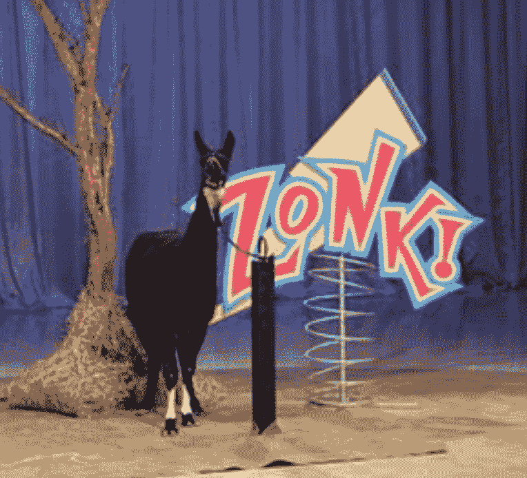

被击中的概率是多少？来源：[维基百科](https://upload.wikimedia.org/wikipedia/en/a/a6/2009lmadzonkgoat.jpg)

交易者应该坚持他们原始的选择门 A 还是切换到 B？

在继续阅读之前，试一试。你会怎么做？

大多数人可能有一种直觉，认为“这无关紧要”，认为在第一种情况下，每个门有 1/3 的机会隐藏奖品，而在主持人干预 🎩之后，当只剩下两个门关闭时，赢得奖品的机会是 50:50。

有各种方法可以解释为什么抛硬币的直觉是错误的。其中大多数涉及数学方程式或模拟。而我们将稍后解决这些问题，我们将尝试通过应用奥卡姆剃刀来解决：

*一个原则，即简单的解释比复杂的解释更可取* —— 奥卡姆的威廉（1287–1347）

为了做到这一点，将问题稍微重新定义为一个大的 *N* 门而不是原来的三个，是有教育意义的。

## 大 N 门问题

与之前类似：你必须从许多门中选择一个。为了说明，让我们假设 *N*=100。其中一扇门后面有奖品 🚗，其余 99 (*N-1*)扇门后面是山羊 🐐。

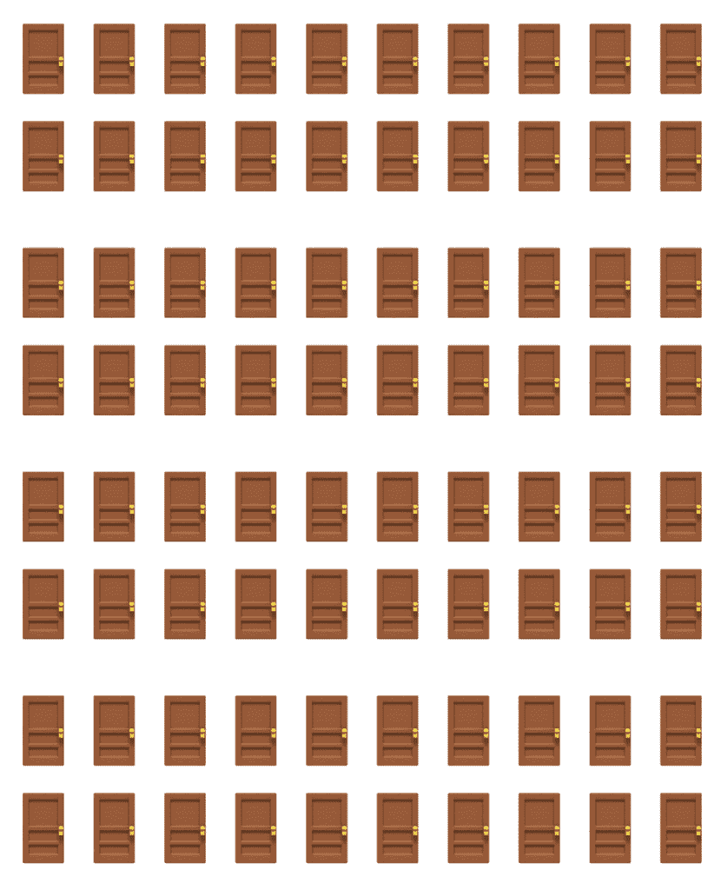

主持人干预之前的 100 道门蒙提霍尔问题。

你选择一个门 👇，主持人 🎩揭示其余 98 (*N-2*) 有山羊 🐐的门，留下你的 👇 和一个额外的关闭 🚪。

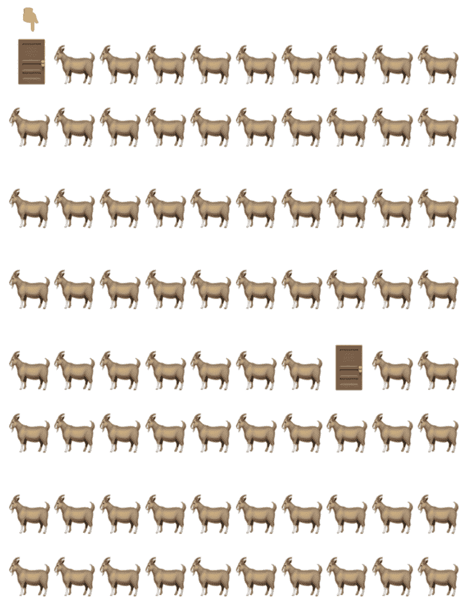

主持人干预之后的 100 道门蒙提霍尔问题。你应该坚持你的门 👇 还是做出改变？

你应该坚持你的原始选择还是做出改变？

我想你会同意我的看法，剩下的门，你没有选择的，更有可能隐藏奖品……所以你绝对应该做出改变！

比较到目前为止讨论的两种场景是有说明性的。在下一张图中，我们比较了主持人干预后的 *N*=3 设置（顶部面板）和 *N*=100（底部）：

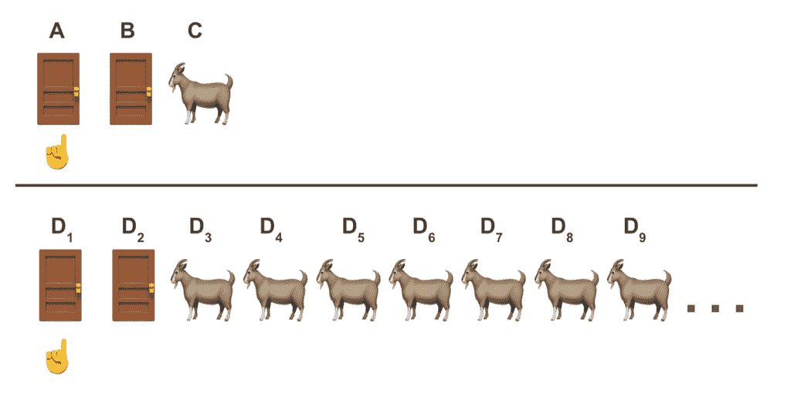

N=3 设置（顶部）和 N=100（底部）的干预后设置。

在这两种情况下，我们都看到两个关闭的门，其中一个是我们的选择。这些场景之间的主要区别在于，在第一种情况下我们看到了一只山羊，而在第二种情况下，我们看到的多于眼睛愿意看到的（除非你以放牧为生）。

为什么大多数人认为第一种情况是“50:50”的投掷，而在第二种情况下显然应该做出改变？

我们很快就会解决这个问题，为什么。首先，让我们看看不同场景成功的概率。

## 肯尼思，频率是多少？

到目前为止，我们从*N*=100 的场景中了解到，换门显然是有益的。对于大多数人来说，推断*N*=3 可能是一种信仰的飞跃。在这里使用一些基本的概率论来量化为什么在任何数量的门场景*N*中换门都是有利的。

我们从标准的蒙提霍尔问题(*N*=3)开始。当它开始时，每个门 A、B 和 C 后面有奖品的概率是*p*=⅓。为了明确起见，让我们定义*Y*参数为有奖品的门 🚗，即*p*(*Y*=A)= *p(Y=*B*)*=*p(Y=*C*)*=⅓。

解决这个问题的技巧是，一旦选择了交易者的门 A ☝️，我们就应该密切关注其他门集合{B,C}，其概率为*p(Y∈{B,C})*=p(Y=B)+p(Y=C)=⅔。这个视觉图可以帮助理解这一点：

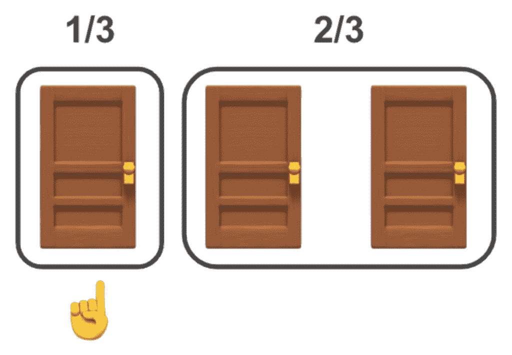

通过关注{B,C}，其他部分应该随之而来。当揭示山羊 🐐 时

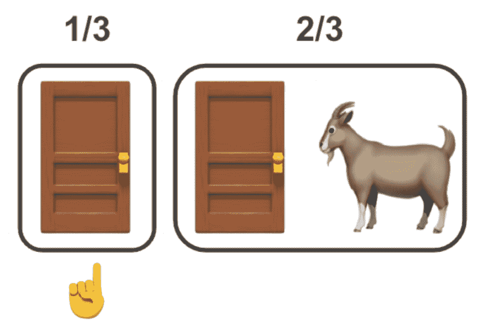

显然，干预后的概率发生了变化。请注意，为了便于阅读，我将省略*Y*符号，其中 p(Y=A)将读作 p(A)，*p(Y∈{B,C})*将读作*p(*{B,C}). 此外，由于它是条件性的，干预后的完整术语应该更长，例如，p(*Y*=A|*Z*=C)，*p(Y*∈{B,C}|*Z*=C)，其中*Z*是一个表示主持人选择的参数 🎩。 (在下面的贝叶斯补充部分中，我使用适当的符号而没有这种缩写。)

+   *p*(A)仍然是⅓

+   *p(*{B,C})*=p*(B)+p*(C)仍然是⅔，

+   *p*(C)=0；我们刚刚了解到山羊🐐在门 C 后面，而不是奖品。

+   *p*(B)= *p(*{B,C})-*p*(C) = ⅔

对于任何拥有主持人提供的信息的人来说（意味着交易者和观众），这意味着这不是一个公平硬币的投掷！对他们来说，*p*(C)变为零并不意味着“所有其他船只”都上升（门 A 和 B 的概率），而是*p*(A)保持不变，而*p*(B)翻倍。

重要的是，交易者应该考虑*p(*A*)* = ⅓和*p(*B*)*=⅔，因此通过换门，他们是在翻倍赢得的机会！

让我们推广到*N*（为了使视觉更简单，我们再次使用*N*=100 作为类比）。

当我们开始时，所有门赢得奖品的概率都是*p*=1/*N*。在交易者选择一个门之后，我们将称之为 D₁，意味着*p*(*Y*=D₁)=*1/N*，我们现在应该注意剩余的门集合{D₂, …, Dₙ}将有一个机会*p*(*Y*∈{D₂, …, Dₙ})=*(N-1)/N*。

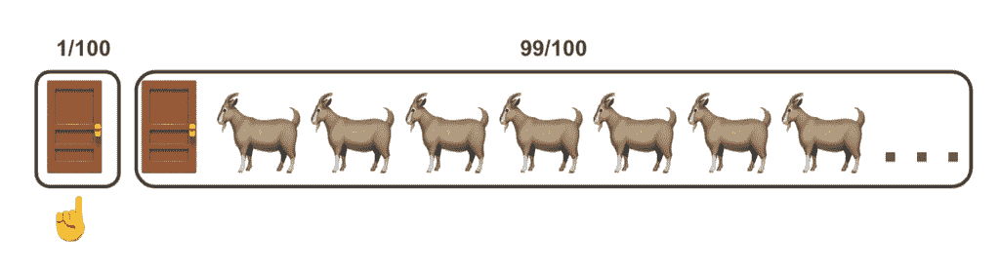

当主持人揭示含有山羊的(*N*-2)个门{D₃, …, Dₙ}时：

+   *p*(D₁)仍然是*1/N*

+   p({D₂, …, Dₙ})=*p*(D₂)+*p*(D₃)+… + *p*(Dₙ)仍然是*(N-1)/N*

+   *p*(D₃)=*p*(D₄)= …=*p*(Dₙ₋₁) =*p*(Dₙ) = 0；我们刚刚了解到它们有山羊，而不是奖品。

+   *p*(D₂)=p({D₂, …, Dₙ}) — *p*(D₃) — … — *p*(Dₙ)=*(N-1)/N*

交易者现在应该考虑两个门值*p*(D₁)=*1/N*和*p*(D₂)=*(N-1)/N*。

因此，获胜的几率提高了 *N-1* 倍！在 *N*=100 的情况下，这意味着获胜比率为 99！（即，换门时赢得奖品的可能性为 99%，如果不换门则只有 1%。）

在 *N*=3 到 100 之间所有场景中，获胜概率比率的提高可以在以下图表中看到。细线是选择任何门之前的获胜概率 p(*Y*)=1/*N*。注意，它也代表了干预后如果他们决定坚持自己的选择而不换门的话获胜的概率 p(*Y=D*₁*|Z={D*₃*…D*ₙ*}*）。（这里我重新引入了之前提到的更严谨的条件形式。）粗线是换门后获胜奖品概率 p(*Y=D*₂*|Z={D*₃*…D*ₙ*}*)=(*N-1)*/*N*：

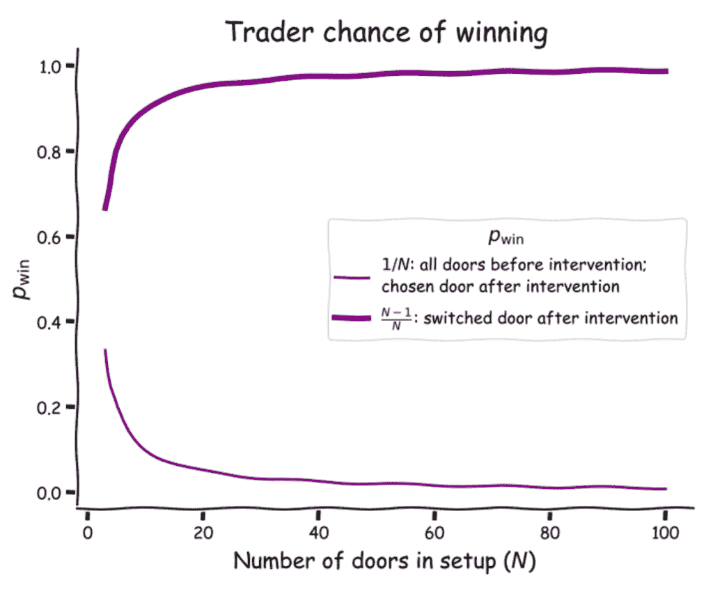

获胜概率作为 N 的函数。p(Y)=p(Y=no switch|Z)=1/N 是细线；p(Y=switch|Z)=N/(N-1) 是粗线。（按定义，对于每个 N，两条线的总和为 1。）

也许这个图表（尽管按定义也是）最有趣的一个方面是，*N*=3 的情况在主持人干预 **之前** 具有最高的概率，但在干预 **之后** 的概率最低，反之亦然，对于 *N*=100。

另一个有趣的特点是，换门者的获胜概率迅速上升：

+   *N*=3: p=67%

+   *N*=4: p=75%

+   *N*=5=80%

换门者的曲线逐渐达到一个接近 100% 的渐近线，而 *N*=99 时为 98.99%，*N*=100 时等于 99%。

这开始回答了一个有趣的问题：

> 为什么对于大的 N 来说换门是明显的，但对于 N=3 来说却不是？

答案是这个谜题有点含糊不清。只有高度警觉的人才会意识到，通过揭示山羊（而不是奖品！）主持人实际上传达了 **大量信息**，这些信息应该纳入到自己的计算中。稍后我们将讨论基于直觉在心中进行这种计算与放慢速度，通过把笔放在纸上或编写代码来解决问题的差异。

主持人通过干预传达了多少信息？

一个手舞足蹈的解释 👋 👋 是，这个信息可以想象成上面图表中线条之间的差距。对于 *N*=3，我们看到获胜的概率翻倍（这可不是小数目！），但这并不像 *N*=100 时的 99 倍那样强烈地触动我们的常识直觉。

我还考虑过描述来自 *信息论* 的更强论证，这些论证提供了有用的词汇来表达信息的交流。然而，我觉得这个迷人的领域值得一篇单独的文章，我已经发表了。

对于蒙提霍尔问题的主要启示是，我使用这个公式计算了信息增益是门数 *c* 的对数函数：

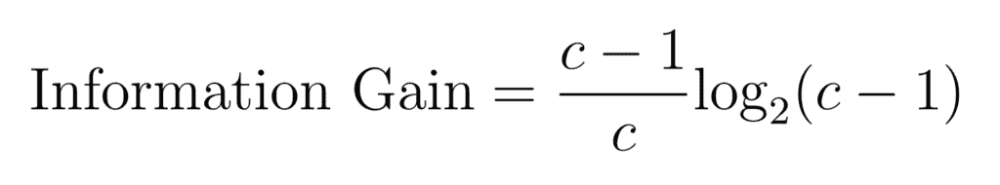

主持人干预 🎩 导致的信息增益。详细信息请见我即将发表的文章。

对于 *c*=3 门的情形，例如，信息增益是 ⅔ 比特（最大可能为 1.58 比特）。详细信息请参阅这篇关于熵的[文章](https://medium.com/towards-data-science/quantifying-uncertainty-4814b759da5f)。

总结本节，我们使用基本的概率论来量化赢得奖品的概率，展示了在所有 *N* 门的场景中切换的好处。对于那些对更正式的解决方案感兴趣⚔️，我在底部提供了使用贝叶斯和因果关系的补充部分。

在接下来的三个最终部分中，我们将讨论这个问题的解决方案在 1990 年代初期是如何被公众接受的，讨论学到的经验，然后总结我们如何在现实世界场景中应用它们。

## 感到困惑是正常的 😕

> “不，这是不可能的，这应该没有区别。” — 保罗·埃尔德什

如果你仍然对 *N*=3 蒙提霍尔问题的解决方案感到不舒服，不要担心，你并不孤单！根据 Vazsonyi（1999）¹ 的研究，即使是被认为是“概率论最伟大的专家”的保罗·埃尔德什，直到计算机模拟演示给他看时才感到困惑。

当史蒂夫·塞尔文（1975）² 的原始解决方案在 1990 年由玛琳·沃斯·萨万特在《游行》杂志的“玛琳问玛琳”专栏中普及时，许多读者写信说塞尔文和萨万特是错误的³。根据 Tierney 1991 年在《纽约时报》的文章，这包括大约 10,000 名读者，其中包括近 1,000 名拥有博士学位⁴。

说到个人经历，十年前我接触到了标准的 *N*=3 问题，从那时起就多次忘记了解决方案。当我了解到大 *N* 方法时，我非常兴奋，因为它非常直观。然而，我在午餐时未能向我的技术经理解释清楚，所以这是我的补偿尝试。我仍然做着同样的日常工作 :)。

在研究这篇文章时，我意识到在决策方面有很多东西可以学习，特别是对数据科学非常有用。

## 从蒙提霍尔问题中学到的经验

在他的著作《思考，快与慢》中，已故的丹尼尔·卡尼曼，行为经济学的共同创造者，提出了我们有两种思维过程：

+   系统 1 — 快速思考 🐇：基于直觉。这有助于我们快速自信地应对熟悉的情况。

+   系统 2 – 慢速思考 🐢：基于深入思考。这有助于我们弄清楚生活中向我们抛来的新复杂情况。

假设这个前提，你可能已经注意到在上文中你同时应用了两种（思维过程）。

通过观察 *N*=100 门的视觉图，你的系统 1 🐇 立即启动，并立即知道了答案。我猜在 *N*=3 的情况下，你处于系统 1 和 2 之间。考虑到你在进行概率练习时不得不停下来思考，这肯定是系统 2 🐢。


决策者之间系统 1 🐰 和系统 2 🐢 的斗争。使用 Gemini Imagen 3 生成

除了快思考和慢思考之外，我认为还有很多数据决策的教训可以学习。

### (1) 评估概率可能具有反直觉性……

或

舒适地转向深入思考 🐢

我们已经清楚地展示了在 *N*=3 的情况下。正如之前提到的，这使许多人感到困惑，包括一些杰出的统计学家。

另一个经典的例子是 *生日悖论* 🥳🎂，它展示了我们如何低估巧合的可能性。在这个问题中，大多数人会认为需要一大群人才能找到一对共享同一天生日的人。结果是，你只需要 23 个人就有 50%的机会，而 70 个人就有 99.9%的机会。

数据分析领域中最令人困惑的悖论之一是辛普森悖论，我在一篇 [之前的文章](https://medium.com/towards-data-science/mastering-simpsons-paradox-my-gateway-drug-to-causality-87e10b613a80) 中详细介绍了它。这是一种趋势在总体中可能在其子群体中逆转的情况。

所有这些悖论的共同之处在于它们要求我们习惯于从系统 1 快速思考 🐇 转向系统 2 慢 🐢。这也是下面概述的教训的共同主题。

一些更经典的例子包括：赌徒谬误 🎲、基础率谬误 🩺 和琳达 [银行出纳员] 问题 🏦。这些超出了本文的范围，但我强烈建议查找它们以进一步磨练关于数据思考的方式。

### (2) ……特别是在处理模糊性时

或

在模糊中寻找清晰 🔎

让我们再次阅读这个问题，这次是按照“问玛丽莲”的表述

*假设你在一个游戏节目中，你有三个门可以选择：其中一个门后面是一辆车；其他门后面是山羊。你选择了一个门，比如说 №1，主持人* ***他知道门后面是什么，打开另一个门****，比如说 №3，门后面有山羊。然后他对你说，“你想要选择门 №2 吗？”改变你的选择对你有利吗？*

我们讨论了最重要的信息没有被明确指出。它说主持人“知道门后面是什么”，但没有说他们随机打开一个门，尽管隐含地理解主持人永远不会打开有车的门。

数据科学中的许多实际问题涉及处理模糊的需求以及利益相关者提供的数据。

对于研究人员来说，追踪任何可能产生影响的相关信息，并将其更新到解决方案中至关重要。统计学家将此称为“信念更新”。

### (3) 在获得新信息时，我们应该更新我们的信念 🔁

这是区分贝叶斯思维流派和频率主义的主要方面。频率主义方法直接接受数据（称为 *平坦先验*）。贝叶斯方法结合先验信念，并在引入新发现时更新它。这在处理模糊情况时特别有用。

为了使这一点更加明确，让我们重新审视这个图，比较干预后的 *N*=3 设置（顶部面板）和 *N*=100 设置（底部面板）。

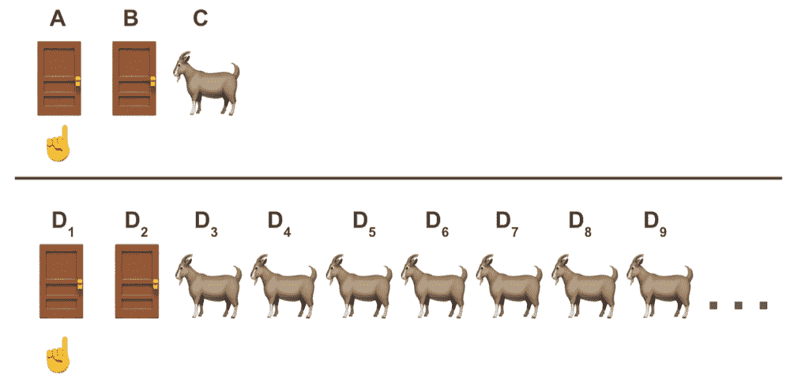

从上面复制。干预后的 N=3 设置（顶部）和 N=100（底部）。

在这两种情况下，我们事先都认为所有门赢得奖品的概率是相等的，即 *p*=1/N。

当主持人打开了一扇门 (*N*=3；或者当 *N*=100 时的 98 道门) 时，揭示了大量的有价值信息，而在 *N*=100 的情况下，这些信息比 *N*=3 时更为明显。

然而，在频率主义方法中，大部分这些信息都会被忽略，因为它只关注两扇关闭的门。因此，频率主义者的结论是，无论其他关于情况的信息如何，赢得奖品的概率都是 50%。因此，频率主义者采取了保罗·埃尔德什的“没有区别”的观点，我们现在知道这是不正确的。

如果展示的只是两扇门，而不是干预和山羊，这是合理的。然而，如果提供了这些信息，就应该切换到系统 2 思维，并更新系统中的信念。这就是我们通过不仅关注关闭的门，而是考虑关于整个系统的学习所做的事情。

对于勇敢的人 ⚔️，在下面的补充部分称为**贝叶斯观点**中，我使用贝叶斯形式解决了蒙提霍尔问题。

### (4) 与主观性合而为一 🧘

经验主义者在“转向贝叶斯”方面的主要保留意见是——“统计学应该是客观的”。

贝叶斯派的回应是——频率主义者也在不知不觉中应用了一个先验，那就是一个平坦的先验。

不论是贝叶斯派还是频率主义派的争论，作为研究人员，我们尽力在分析的每一步都尽可能客观。

话虽如此，主观决策是不可避免的。

例如，在一个偏斜分布中，应该引用平均值还是中位数？这高度取决于上下文，因此需要做出主观的决定。

分析师的责任是首先为自己的选择提供合理的解释，以说服自己和利益相关者。

### (5) 当感到困惑时——寻找有用的类比

…但需谨慎行事 ⚠️

我们看到，从 *N*=3 设置到 *N*=100 设置，解决方案是显而易见的。这是科学家经常使用的一个技巧——如果问题一开始看起来有点令人困惑/压倒性，就将其分解，并尝试找到一个有用的类比。

这可能不是一个完美的比较，但从 *N*=3 的设置到 *N*=100 的设置，就像是从近距离检查一张图片，然后放大以看到整体画面。想象一下，你只有一片拼图 🧩，然后瞥了一眼盒子上的拼图照片。

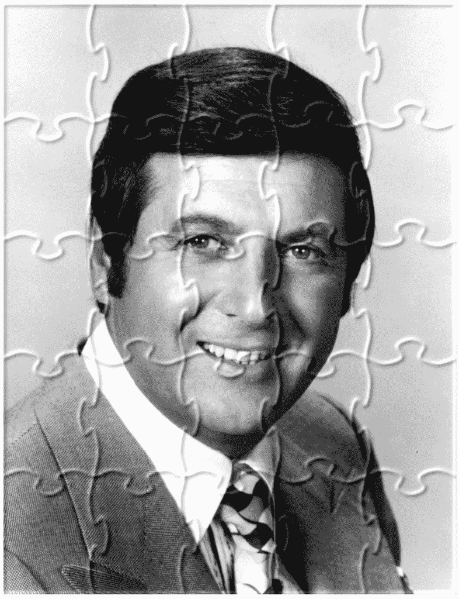

1976 年的蒙提霍尔问题。来源：[维基百科](https://upload.wikimedia.org/wikipedia/commons/4/48/Monty_hall_abc_tv.JPG) 和使用 [Visual Paradigm Online](https://online.visual-paradigm.com/) 来实现谜题效果

注意：虽然类比可能很强大，但应该谨慎使用，不要过度简化。物理学家将这种情况称为“球形牛”方法，其中模型可能会过度简化复杂现象。

我承认，即使有多年应用统计学的经验，有时我仍然会困惑于应该使用哪种方法。我思考过程的大部分是识别与已知已解决的问题的类比。有时在某个方向上取得进展后，我会意识到我的假设是错误的，并寻求新的方向。我过去经常和同事们开玩笑说，在我第三次尝试之前，他们不应该相信我……

### (6) 模拟很强大，但并非总是必要的 🤖

有趣的是，保罗·埃尔德什和其他数学家只有在看到问题的模拟后才会确信。

在解决问题时，我对使用模拟的态度是矛盾的。

一方面，模拟是分析复杂和难以处理问题的强大工具。特别是在现实生活中，人们不仅想要掌握基本公式，还想要了解随机性。

但是，这里有一个大问题——如果一个问题可以像蒙提霍尔问题那样通过分析解决，那么即使模拟很有趣（比如 MythBusters 所做的⁶），可能也不是必要的。

根据奥卡姆剃刀原理，解释现象只需要简短的直觉。这正是我在这里通过运用常识和一些基本的概率推理所尝试做的。对于那些喜欢深入研究的人来说，我下面提供了两个分析方法，一个使用贝叶斯统计，另一个使用因果关系。

***[更新]** 在发布本文的第一版之后，有人评论说 Savant 的解决方案³可能比这里提出的更简单。我重新审视了她的交流，并同意应该添加。在这个过程中，我意识到还有三个教训可以学习。

### (7) 一个设计良好的视觉效果可以走很长的路 🎨

继续遵循奥卡姆剃刀原理，Savant 在³我的观点中相当有说服力地解释了：

> *你应该换门。第一个门有 1/3 的获胜机会，但第二个门有 2/3 的获胜机会。这是一个很好的可视化方法。假设有一百万扇门，你选择了门#1。然后主持人，他知道门后面是什么，并且总是会避开有奖品的门，打开了除了门#777,777 之外的所有门。你很快就会换到那扇门，不是吗？*

因此，她为读者提供了一个抽象的视觉图。我也尝试用 100 扇门的情况做了同样的事情。


马里琳·沃斯·萨凡特，她普及了蒙提霍尔问题。[来源：Ben David on Flickr](https://www.flickr.com/photos/156235789@N02/41959101350) 在 [许可](https://creativecommons.org/licenses/by-sa/2.0/#ref-appropriate-credit) 下

如许多读者所提到的，尤其是那些有数学和统计学背景的读者，仍然没有信服。

她用另一个心理图像进行了修订：

> *通过玩六次游戏，可以轻易证明切换的好处。对于前三次游戏，你每次都选择#1 并“切换”，对于后三次游戏，你每次都选择#1 并“留下”，主持人总是打开一个输家。以下是结果。*

她增加了一个包含所有场景的表格。我发挥了一些艺术想象力，创作了以下图表。如图所示，顶部批次是交易者切换的场景，底部是他们不切换的场景。绿色线条代表交易者赢得的游戏，红色线条代表他们输掉的游戏。👇符号代表交易者选择的门，蒙提霍尔随后选择一个有山羊🐐的不同的门。

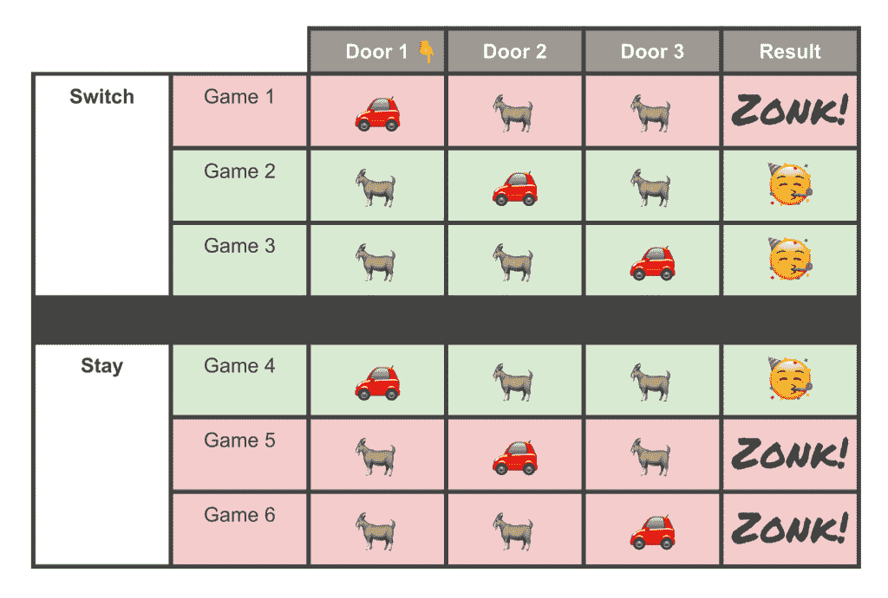

对萨凡特六种场景表的改编，展示了蒙提霍尔问题的解决方案

从这个图中，我们可以清楚地看到，切换者有三分之二的获胜机会，而坚持者只有三分之一的获胜机会。

这又是一个优雅的视觉化，清楚地解释了非直观的内容。

这加强了这样一个论点：在这种情况下，实际上并不需要模拟，因为所有他们要做的就是重新运行这六种场景。

另一种更受欢迎的解决方案是决策树图示。你可以在维基百科页面上找到这些，但我发现它对萨凡特的表格来说有点冗余。

我们可以用这么多方式解决这个问题的事实，又给我们带来了另一个教训：

### (8) 解决问题有很多方法 🐈

从已故理查德·费曼的著作中，我学到了许多教训，他是最好的物理和思想传播者之一，其中之一就是问题可以用多种方式解决。数学家和物理学家一直在这样做。

一句引用奥卡姆剃刀原理的恰当引言：

如果你不能简单解释它，说明你对它理解得还不够充分——据说是爱因斯坦说的

最后

### (9) 接受无知，保持谦卑 🤷‍♂

> *“你完全错了……需要多少愤怒的数学家才能让你改变主意？”* — 乔治敦大学博士
> 
> *“在你再次尝试回答这类问题之前，我建议你先获取并参考一本关于概率的标准教科书。”* — 佛罗里达大学博士
> 
> *“你错了，但阿尔伯特·爱因斯坦在承认错误后，在人们心中的地位更加崇高。”* — 密歇根大学博士

ouch！

这些是一些数学家对《游行》文章的回应。

这种不必要的恶意。

您可以通过查看参考文献³来了解作者的姓名和其他类似内容。为了激发您的兴趣：“您搞砸了，而且是大搞砸了！”，，“您犯了一个错误，但看看积极的一面。如果所有那些博士都错了，国家会陷入一些非常严重的麻烦。”，“我震惊的是，在至少三位数学家的纠正后，您仍然没有看到您的错误。”。

如预期的那样，从 20 世纪 90 年代来看，最令人尴尬的可能是一位俄勒冈州居民的例子：

> *“也许女性看待数学问题的方式与男性不同。”*

这些让我感到尴尬，并因性别和博士头衔与这些毕业生和教授联系在一起而感到羞愧。

希望在 2020 年代，大多数人都会更加谦逊地对待自己的无知。[尤瓦尔·赫拉利](https://medium.com/u/8a6d8f1fc05c?source=post_page---user_mention--a6032f4b1032---------------------------------------)讨论了伽利略·伽利莱等人的科学革命不是由于知识，而是由于承认无知的事实。

> “科学革命中的一项伟大发现是，人类不知道他们最重要问题的答案”——[尤瓦尔·赫拉利](https://medium.com/u/8a6d8f1fc05c?source=post_page---user_mention--a6032f4b1032---------------------------------------)

幸运的是，对于数学家的形象来说，也有很多更加开明的评论。我喜欢麻省理工学院的一位[塞思·卡尔森，博士](https://www.linkedin.com/in/szkalson/)的这条评论：

> *您确实是对的。我工作中的同事们对这个问题非常感兴趣，我敢说他们中的大多数，包括我最初，都认为你是错的！*

我们将通过检查蒙提霍尔问题如何在现实世界中应用，以及是否可以应用，来总结，这样您就可以尝试将其与您正在从事的项目联系起来。

## 在现实世界中的应用

<mdspan datatext="el1747338601095" class="mdspan-comment">研究</mdspan>这篇文章时，我发现除了为了娱乐的人工设置⁶⁷之外，没有实际的环境可以用来类比这个问题。当然，我可能错了⁸，如果您知道的话，我很乐意听到。

评估类比可行性的一个方法是通过因果关系的论证，这提供了一些不能用标准统计学表达的语言。

在一篇[之前的帖子](https://medium.com/data-science/%EF%B8%8F-start-asking-your-data-why-a-gentle-intro-to-causality-47142d5ec96a)中，我讨论了数据背后的故事与数据本身一样重要。特别是因果图模型可以可视化数据背后的故事，我们将以此作为合理类比的基础框架。

对于蒙提霍尔问题，我们可以构建一个类似于这样的因果图模型：

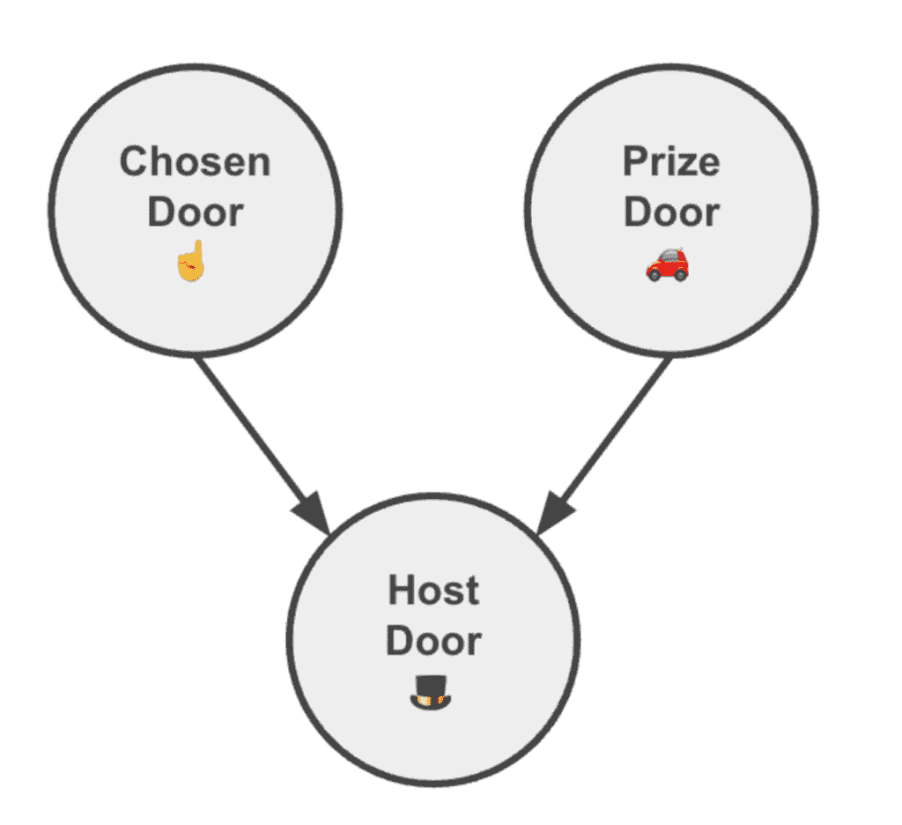

阅读：

+   交易者选择的门与奖品🚗的门是独立的，反之亦然。同样重要的是，它们之间没有共同的原因，这可能会产生虚假的相关性。

+   主持人的选择 🎩取决于☝️和🚗。

通过比较两个系统的因果图，可以了解它们是如何相似的。一个完美的类比需要更多细节，但这超出了本文的范围。简而言之，人们会希望确保参数之间有相似的功能（被称为*结构因果模型；*有关详细信息，请参阅下文补充部分称为**➡️因果视角**）。

对学习如何使用因果图模型来评估现实世界问题中的因果关系感兴趣的人可能会对[这篇文章](https://medium.com/towards-data-science/causality-mental-hygiene-for-data-science-b7efc302eb72?source=user_profile_page---------5-------------5ff5dbdb1017----------------------)感兴趣。

根据轶事，也值得提一下，在“让我们来交易”节目中，蒙提自己多年后承认曾与参赛者玩心理游戏，并不总是遵循规则，例如，并不总是按照“这完全取决于他的心情”进行干预⁴。

在我们的设置中，我们假设了完美的条件，即一个不会偏离脚本并且/或者不会玩弄交易者情绪的主持人。考虑到这一点，需要更新上面的图形模型，但这超出了本文的范围。

一些人在意识到在文章的这个阶段，这个问题可能没有真正的实际应用时可能会感到沮丧。

我认为从蒙提霍尔问题中学到的教训无疑是。

只是为了再次总结它们：

(1) 评估概率可能具有反直觉性……

(Be comfortable with shifting to deep thought 🐢)

(2) ……尤其是在处理含糊不清的情况时

(Search for clarity 🔎)

(3) 在获得新信息后，我们应该更新我们的信念 🔁

(4) 与主观性合为一体 🧘

(5) 当感到困惑时——寻找有用的类比……但要注意谨慎⚠️

(6) 模拟很强大，但并非总是必要的 🤖

(7) 一个设计良好的视觉可以走很长的路 🎨

(8) 解决问题的方法有很多种 🐈

(9) 接受无知并保持谦逊 🤷‍♂

虽然蒙提霍尔问题可能看起来像是一个简单的谜题，但它为决策提供了宝贵的见解，尤其是对于数据科学家。这个问题强调了超越直觉并接受更分析性、数据驱动的方法的重要性。通过理解贝叶斯思维的原则并根据新信息更新我们的信念，我们可以在生活的许多方面做出更明智的决定，包括数据科学。蒙提霍尔问题提醒我们，即使是看似简单的情况也可能包含隐藏的复杂性，并且通过仔细检查可用信息，我们可以揭示隐藏的真相并做出更好的决策。

在文章的底部，我提供了一份资源列表，这些资源对我学习这个主题非常有用。


信用：[维基百科](https://upload.wikimedia.org/wikipedia/commons/1/17/Star_of_Monty_Hall.jpg)

喜欢这篇帖子？💌 加入我[LinkedIn](https://www.linkedin.com/in/eyal-kazin)或☕[买我一杯咖啡](http://buymeacoffee.com/zurdo)！

## 致谢

除非另有说明，所有图像均由作者创建。

感谢 Jim Parr、[Will Reynolds](https://www.linkedin.com/in/reynoldswilliam/)和[Betty Kazin](https://www.linkedin.com/in/betty-kazin-68711812/)提供的宝贵意见。

在以下补充部分 ⚔️，我从两个角度推导出蒙提霍尔问题的解决方案：

+   贝叶斯

+   因果

这两者都源于教科书中的问题：Judea Pearl、Madelyn Glymour 和 Nicholas P. Jewell（2016 年）所著的《统计学因果推断入门》。

## 补充 1：贝叶斯观点

本节假设对贝叶斯定理有基本的了解，特别是对条件概率感到舒适。换句话说，如果这有意义的话：

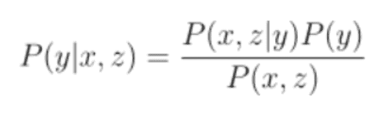

我们着手使用贝叶斯定理来证明换门可以提高在*N*=3 的蒙提霍尔问题中的机会。（入门教科书的问题**1.3.3**）

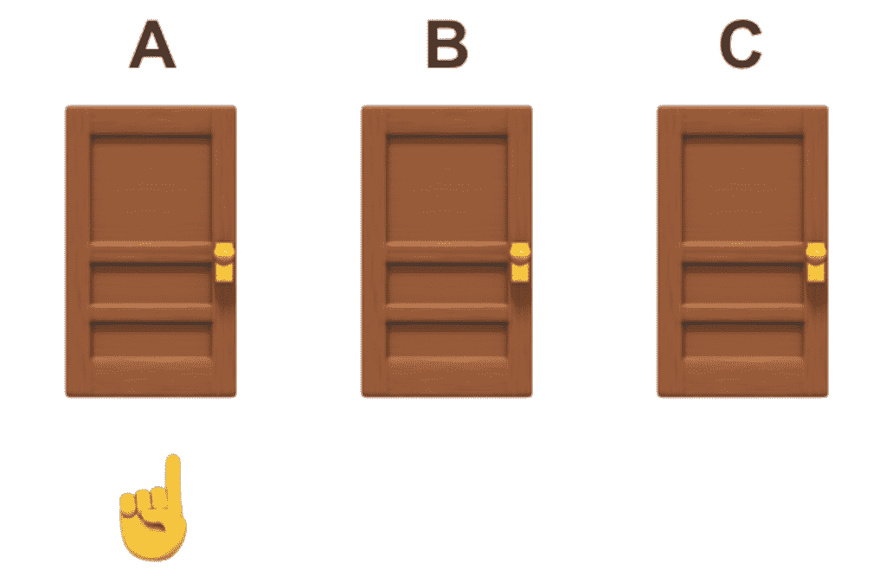

我们定义

+   *X* — 选择的大门 ☝️

+   *Y*— 奖品🚗所在的门

+   *Z* — 主持人打开的门 🎩

将门标记为 A、B 和 C，不失一般性，我们需要求解：

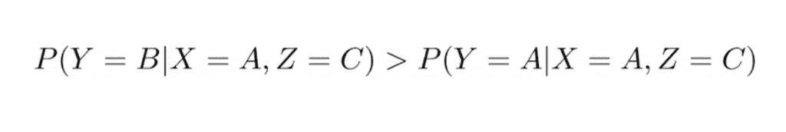

使用贝叶斯定理，我们将左侧等式为

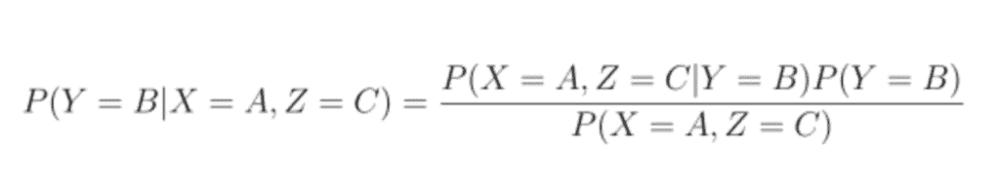

并且将右侧等式为：

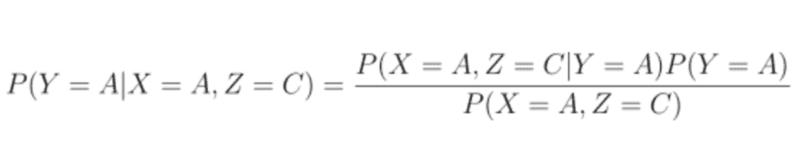

大多数组件是相等的（记住*P(Y=A)*=*P(Y=B)*=⅓，所以我们只剩下证明：

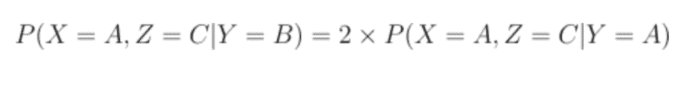

在*Y=B*（奖品🚗在门 B🚪后面）的情况下，主持人只有一个选择（只能选择门 C🚪），使得 P(X=A, Z=C|Y=B)= 1。

在*Y=A*（奖品🚗在门 A ☝️后面）的情况下，主持人有两个选择（门 B 🚪和门 C 🚪），使得 P(X=A, Z=C|Y=A)= 1/2。

从这里：

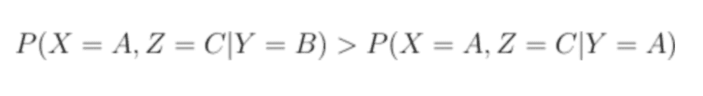

**Q**uod **e**rat **d**emonstrandum.

注意：如果“主持人选择”的论点没有意义，请查看下表，其中明确显示了这一点。您将想要比较条目{***X*****=A，***Y*****=B，***Z*****=C}**和{***X*****=A，***Y*****=A，***Z*****=C}**。

## 补充 2：因果观点 ➡️

本节假设对有向无环图（DAGs）和结构因果模型（SCMs）有基本的了解是有用的，但不是必需的。简而言之：

+   有向无环图（DAGs）定性可视化参数节点之间的因果关系。

+   结构因果模型（SCMs）定量地表达了参数之间的公式关系。

给定有向无环图（DAG）


我们将定义与经典 *N*=3 摩纳哥大厅问题相对应的 SCM，并使用它来描述所有变量的联合分布。我们稍后将普遍扩展到 *N*。 (受《入门》教材中问题 **1.5.4** 以及对其 *N* 门问题的简要提及的启发。)

我们定义

+   *X* — 被选中的门 ☝️

+   *Y* — 奖品 🚗 所在的门

+   *Z* — 主持人 🎩 打开的大门

根据我们看到的 DAG，根据链式法则：

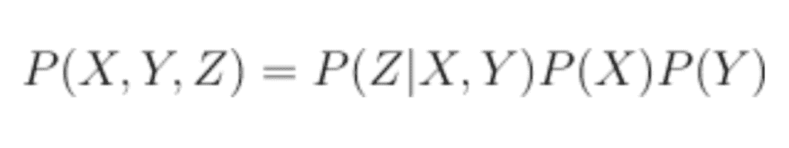

SCM 由外生变量 *U*，内生变量 *V* 以及它们之间的函数 *F* 定义：

+   *U = {X,Y}*, *V={Z}*, *F= {f(Z)}*

其中 *X*，*Y* 和 *Z* 有门值：

+   *D = {A, B, C}*

主持人选择 🎩 定义为 *f(Z)*：

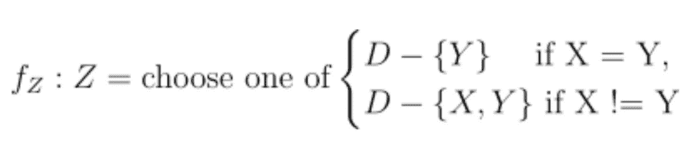

为了推广到 *N* 个门，DAG 保持不变，但 SCM 需要更新 D 以成为一组 *N* 个门 Dᵢ：{*D*₁, *D*₂, … *D*ₙ}。

**探索示例场景**

为了获得对这个 SCM 的直觉，让我们考察 27 (=3³) 的 6 个示例：

当 *X*=*Y*（即，奖品 🚗 **在** 被选中的门 ☝️ 后面）

+   *P(Z=A|X=A, Y=A)* = 0; 🎩 不能选择参与者的门 ☝️

+   *P(Z=B|X=A, Y=A)* = 1/2; 🚗 在 ☝️ → 🎩 以 50% 的概率选择 B

+   *P(Z=C|X=A, Y=A)* = 1/2; 🚗 在 ☝️ → 🎩 以 50% 的概率选择 C

    （与上述内容互补）

当 X≠Y（即，奖品 🚗 **不在** 被选中的门 ☝️ 后面）

+   P(Z=A|X=A, Y=B) = 0; 🎩 不能选择参与者的门 ☝️

+   P(Z=B|X=A, Y=B) = 0; 🎩 不能选择奖品门 🚗

+   P(Z=C|X=A, Y=B) = 1; 🎩 在此问题上没有选择

    （与上述内容互补）

**计算联合概率**

使用逻辑，让我们用 python 🐍 编码所有 27 种可能性

```py
df = pd.DataFrame({"X": (["A"] * 9) + (["B"] * 9) + (["C"] * 9), "Y": ((["A"] * 3) + (["B"] * 3) + (["C"] * 3) )* 3, "Z": ["A", "B", "C"] * 9})

df["P(Z|X,Y)"] = None

p_x = 1./3

p_y = 1./3

df.loc[df.query("X == Y == Z").index, "P(Z|X,Y)"] = 0

df.loc[df.query("X == Y != Z").index, "P(Z|X,Y)"] = 0.5

df.loc[df.query("X != Y == Z").index, "P(Z|X,Y)"] = 0

df.loc[df.query("Z == X != Y").index, "P(Z|X,Y)"] = 0

df.loc[df.query("X != Y").query("Z != Y").query("Z != X").index, "P(Z|X,Y)"] = 1

df["P(X, Y, Z)"] = df["P(Z|X,Y)"] * p_x * p_y

print(f"Testing normalisation of P(X,Y,Z) {df['P(X, Y, Z)'].sum()}")

df
```

产生

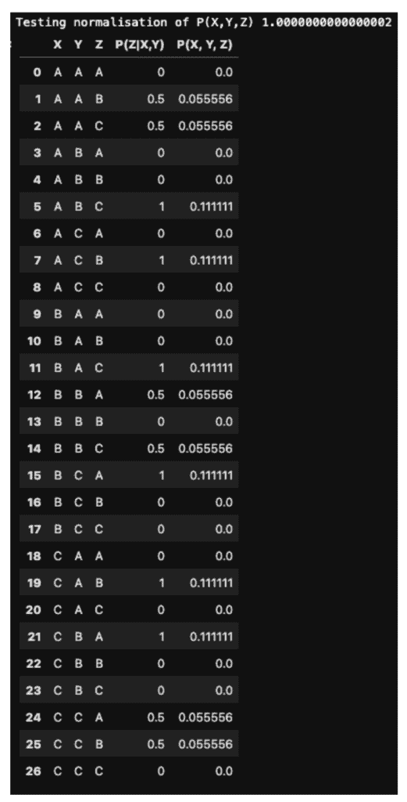

## 资源

+   [Joshua Engel 的这个 Quora 讨论](https://www.quora.com/Are-there-any-scenarios-in-real-life-where-you-could-benefit-from-the-knowledge-of-the-Monty-Hall-Problem) 帮助我塑造了这篇文章的一些方面。

+   *Causal Inference in Statistics A Primer* / Pearl, Glymour & Jewell (2016) — 优秀的简短教科书 ([网站](http://bayes.cs.ucla.edu/PRIMER/))

+   我也非常喜欢 Tim Harford 的播客“Cautionary Tales”。他在 2017 年 11 月 3 日为《金融时报》写了关于这个话题的文章：[*蒙提霍尔和游戏节目 stick-or-switch 纠结*](https://timharford.com/2017/11/monty-hall-and-the-game-show-stick-or-switch-conundrum/)

## 脚注

¹ Vazsonyi, Andrew (December 1998 — January 1999). [“哪扇门有凯迪拉克？”](https://web.archive.org/web/20140413131827/http://www.decisionsciences.org/DecisionLine/Vol30/30_1/vazs30_1.pdf) (PDF). *决策线*: 17–19\. 从 [原始版本](http://www.decisionsciences.org/DecisionLine/Vol30/30_1/vazs30_1.pdf) (PDF) 存档于 2014 年 4 月 13 日。2012 年 10 月 16 日检索。

² [史蒂夫·塞尔文](https://en.wikipedia.org/wiki/Steve_Selvin) 在 1975 年致 [*《美国统计学家》*](https://en.wikipedia.org/wiki/The_American_Statistician) [[1]](https://en.wikipedia.org/wiki/Monty_Hall_problem#cite_note-FOOTNOTESelvin1975a-1)[[2]](https://en.wikipedia.org/wiki/Monty_Hall_problem#cite_note-FOOTNOTESelvin1975b-2)

³[Marilyn vos Savant](https://en.wikipedia.org/wiki/Marilyn_vos_Savant) 的“Ask Marilyn”网站上的 [*《游戏节目问题》*](https://en.wikipedia.org/wiki/Marilyn_vos_Savant) ([网络存档](https://archive.ph/ro4M#selection-203.0-203.393))：“*本文中的材料最初于 1990 年和 1991 年发表在《PARADE》杂志上*”

⁴[约翰·蒂尔尼](https://en.wikipedia.org/wiki/John_Tierney_(journalist)) (1991 年 7 月 21 日). “蒙提·霍尔之门背后：谜题、辩论和答案？”[*《纽约时报》*]. 收取于 2008 年 1 月 18 日.

⁵ 卡尼曼，D. (2011). *《思考，快与慢》.* Farrar, Straus and Giroux.

⁶ [《选门游戏》节目第 177 集](https://mythresults.com/wheel-of-mythfortune) ([维基百科](https://en.wikipedia.org/wiki/MythBusters_(2011_season)#Pick_a_Door)) 🤡 观看《流言终结者》的处理方式

⁶《幸存者》第 41 季中的蒙提·霍尔问题 ([LinkedIn](https://www.reddit.com/r/probabilitytheory/comments/r7p4qh/monty_hall_problem_on_survivor_41/), [YouTube](https://www.youtube.com/watch?v=pENqt1p7_D8&ab_channel=TribalCouncilBlog)) 🤡 观看幸存者对问题的看法

⁷ [李静怡·杰西卡·李 (2024)](https://pmc.ncbi.nlm.nih.gov/articles/PMC11078861/) 蒙提·霍尔问题如何与高通量数据分析中的假发现率相似。

虽然作者提到了假设检验与蒙提·霍尔问题之间的“相似性”，但我认为这有点误导。作者正确地指出，这两个问题都会因为处理过程的顺序而改变，但这只是贝叶斯统计的一般特性，并不局限于蒙提·霍尔问题。
