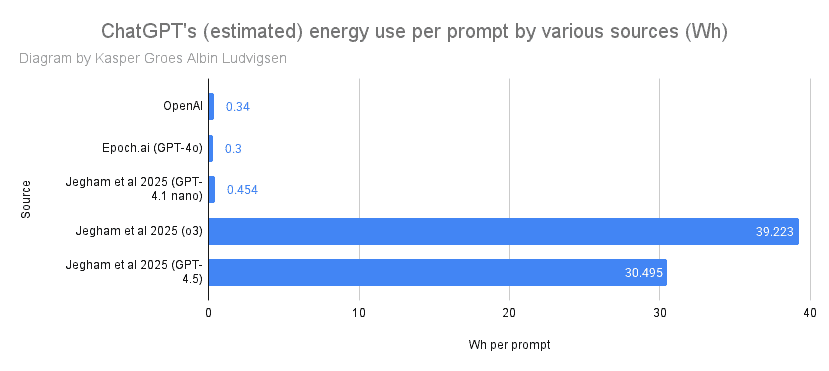

# 分析 OpenAI 关于 ChatGPT 能耗的主张

> 原文：[`towardsdatascience.com/lets-analyze-openais-claims-about-chatgpt-energy-use/`](https://towardsdatascience.com/lets-analyze-openais-claims-about-chatgpt-energy-use/)

<mdspan datatext="el1750102197936" class="mdspan-comment">OpenAI 首席执行官 Sam Altman</mdspan> [最近分享](https://blog.samaltman.com/the-gentle-singularity) 了 ChatGPT 查询的能源和水消耗的具体数字。根据他的博客文章，每个 ChatGPT 查询大约消耗 0.34 瓦时（0.00034 千瓦时）的电力和约 0.000085 加仑的水。相当于高效节能灯泡几分钟的消耗量，大约是汤匙的十五分之一。

这是 OpenAI 首次公开分享此类数据，它为关于大型人工智能系统环境影响的持续辩论增加了一个重要的数据点。这一公告引发了广泛的讨论 – 既有支持的也有怀疑的。在这篇文章中，我分析了这一主张，并分析了社交媒体上的反应，以探讨两方面的论据。

## 0.34 瓦时主张的支持因素是什么？

让我们来看看那些为 OpenAI 的数字提供可信度的论据。

### 1. 独立估计与 OpenAI 的数据点一致

一些认为该数字可信的关键原因是它与之前的第三方估计非常接近。2025 年，研究机构 Epoch.AI 估计，单个 GPT-4o 查询大约消耗 0.0003 千瓦时的能量 – 与 OpenAI 自己的估计非常吻合。这假设 GPT-4o 使用混合专家架构，拥有 1000 亿个活跃参数，典型的响应长度为 500 个标记。然而，他们没有考虑除了 GPU 服务器能耗之外的其他因素，也没有像通常那样纳入功率使用效率（PUE）。

Jehham 等人（2025）最近的一项学术研究估计，GPT-4.1 nano 使用 0.000454 千瓦时，o3 使用 0.0039 千瓦时，GPT-4.5 使用 0.030 千瓦时进行长提示（大约 7,000 个输入单词和 1,000 个输出单词）。

估计与 OpenAI 数据点的一致性表明，OpenAI 的数字至少在模型仅对提示做出响应的阶段（称为“推理”）时，处于一个合理的范围内。

作者提供的图片

### 2. OpenAI 的数字可能在硬件层面上是合理的

据报道，OpenAI 的服务器每天处理 10 亿次查询。[让我们看看 ChatGPT 每天处理这么多查询背后的数学原理。如果这是真的，并且每次查询的能量是 0.34 Wh，那么每天的能源消耗可能达到大约 340 兆瓦时，根据一位[行业专家](https://www.linkedin.com/feed/update/urn:li:activity:7338549458990718976/)的说法。他推测这意味着 OpenAI 可能需要大约 3,200 台服务器（假设使用 Nvidia DGX A100）。如果 3,200 台服务器需要处理每天 10 亿次查询，那么每台服务器每秒需要处理大约 4.5 个提示。如果我们假设每台服务器上部署了一个 ChatGPT 的底层 LLM 实例，并且平均提示会产生 500 个输出 token（根据 OpenAI 的经验法则，大约是 375 个单词），那么服务器每秒需要生成 2,250 个 token。这是否现实？

[Stojkovic 等人（2024）](https://arxiv.org/html/2408.00741v1)能够在 Nvidia DGX H100 服务器上，使用 8 个 H100 GPU，从 Llama-2–70b 达到每秒 6,000 个 token 的吞吐量。

然而，Jegham 等人（2025 年）发现，三个不同的 OpenAI 模型平均每秒生成 75 到 200 个 token。然而，他们是如何得出这个结论的，目前还不清楚。

因此，我们不能完全排除 3,200 台服务器能够处理每天 10 亿次查询的可能性。

## 3. 缺乏细节引发疑问

尽管有支持性的证据，许多人仍然对 0.34 Wh 的数字持谨慎或批评态度，提出了几个关键问题。让我们来看看这些问题。

### 1. OpenAI 的数字可能遗漏了系统的主要部分

我怀疑这个数字只包括了 GPU 服务器本身所使用的能量，而没有包括其他基础设施——例如数据存储、冷却系统、网络设备、防火墙、电力转换损耗或备份系统。这是科技公司在能源报告中的常见限制。

例如，Meta 过去也曾报告过仅使用 GPU 的能量数据。但在现实世界的数据中心，GPU 的电力只是整个画面的一部分。

### 2. 服务器估计与行业报告相比似乎偏低

一些评论员，如 GreenOps 倡导者 Mark Butcher，认为 3,200 台 GPU 服务器似乎远远不足以支持 ChatGPT 的所有用户，尤其是如果你考虑到全球使用、高可用性以及其他超出日常聊天（如编码或图像分析）的应用。

其他报告表明，OpenAI 使用成千上万甚至数十万个 GPU 进行推理。如果这是真的，总能源消耗可能远高于 0.34 Wh/查询的数字所暗示的。

### 3. 缺乏细节引发疑问

批评者，例如[David Mytton](https://www.devsustainability.com/p/chatgpt-energy-usage-is-034-wh-per)，也指出 OpenAI 的声明缺乏基本背景。例如：

+   “平均查询”究竟是什么？是一个单独的问题，还是一次完整的对话？

+   这个数字是针对一个模型（例如，GPT-3.5，GPT-4o）还是几个模型的平均值？

+   它是否包括像多模态输入（例如，分析 PDF 或生成图像）这样的更复杂的新任务？

+   水的使用量是直接的（用于冷却服务器）还是间接的（来自水电等电力来源）？

+   那么碳排放呢？这严重取决于地理位置和能源组合。

没有这些问题的答案，很难知道应该对数字有多少信任，以及如何将其与其他人工智能系统进行比较。

## 视角

### 大型科技公司终于听到我们的祈祷了吗？

OpenAI 的披露发生在[Nvidia 发布 GPU 的实体排放数据](https://images.nvidia.com/aem-dam/Solutions/documents/HGX-H100-PCF-Summary.pdf)和[Google 关于其 TPU 硬件生命周期排放的博客文章](https://cloud.google.com/blog/topics/sustainability/tpus-improved-carbon-efficiency-of-ai-workloads-by-3x)之后。这可能表明这些公司最终开始回应许多要求更多透明度的呼吁。我们是在见证新时代的曙光吗？还是萨姆·奥特曼只是在玩弄我们，因为贬低他公司对气候的影响符合他的经济利益？我将把这个问题留给读者作为一个思考实验。

### 推理与训练

从历史上看，我们看到的关于人工智能能耗的估计和报告都与训练人工智能模型的能源使用有关。虽然训练阶段可能非常耗能，但长期来看，处理数十亿个查询（推理）实际上可能比最初训练模型使用的能源还要多。我的[估计表明](https://medium.com/data-science/the-carbon-footprint-of-gpt-4-d6c676eb21ae)，训练 GPT-4 可能使用了大约 5000 万至 6000 万千瓦时的电力。以每次查询 0.34 瓦时和每天 10 亿次查询计算，回答用户查询所使用的能源将在 150-200 天后超过训练阶段的能源使用。这为推理能源值得密切测量的观点提供了可信度。

## 结论：这是一个受欢迎的第一步，但远非全貌

正当我们认为关于 OpenAI 能源使用的争论已经过时，这家臭名昭著的封闭公司通过披露这个数字又把它搅动起来。许多人对于 OpenAI 现在进入关于其产品能源和水使用的辩论感到兴奋，并希望这是朝着更大透明度迈出的第一步，即关于大科技对资源和气候影响的问题。另一方面，许多人怀疑 OpenAI 的数字。而且有充分的理由。它是在一篇关于完全不同主题的博客文章的括号中披露的，而且没有提供任何上述详细说明的背景。

尽管我们可能正在见证向更多透明度的转变，但我们仍然需要从 OpenAI 那里获取大量信息，以便能够批判性地评估他们的 0.34 Wh 数据。在此之前，我们应该不仅仅带着一颗盐粒，而应该带着一把盐来对待。

* * *

就这些！希望你喜欢这个故事。告诉我你的想法！

跟随我了解更多关于人工智能和可持续性的内容，并且请随意在[LinkedIn](https://www.linkedin.com/in/kaspergroesludvigsen)上关注我。
