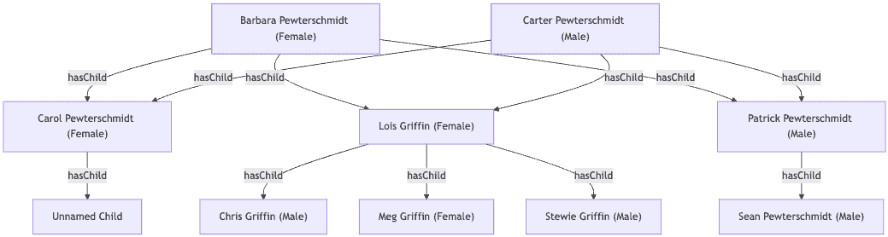
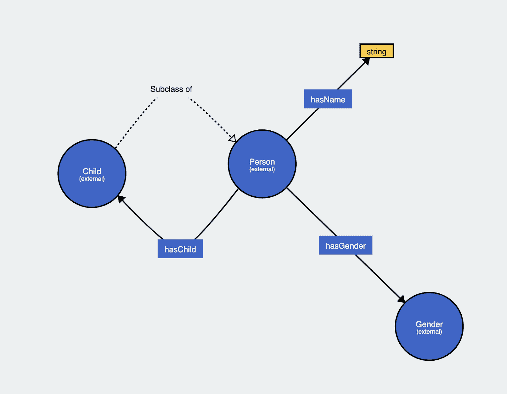
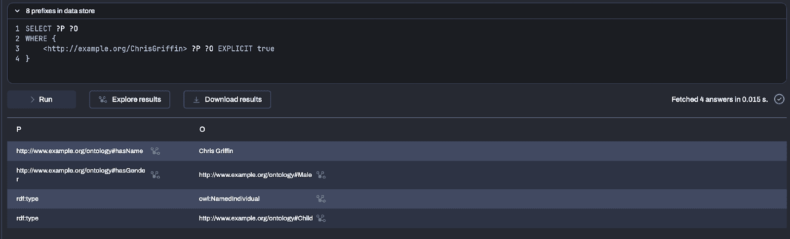
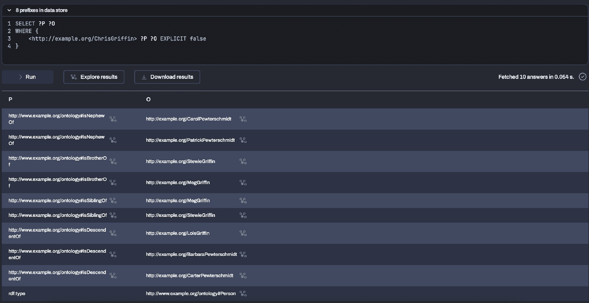
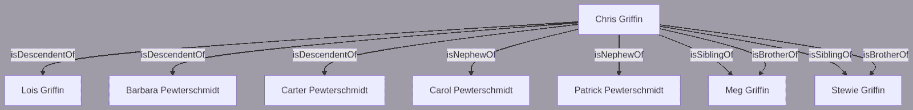

# 让我们直言不讳：RDF 和 LPG —— 应该学会共同生活的表亲

> 原文：[`towardsdatascience.com/lets-call-a-spade-a-spade-rdf-and-lpg-cousins-who-should-learn-to-live-together/`](https://towardsdatascience.com/lets-call-a-spade-a-spade-rdf-and-lpg-cousins-who-should-learn-to-live-together/)

在 <mdspan datatext="el1744068376029" class="mdspan-comment">近年来</mdspan>，有大量文章、LinkedIn 帖子和营销材料从不同角度介绍了图数据模型。本文将避免讨论具体产品，而是专注于 RDF（资源描述框架）和 LPG（标记属性图）数据模型的比较。为了澄清，RDF 和 LPG 之间没有相互排斥的选择——它们可以结合使用。合适的选择取决于具体用例，在某些情况下，可能需要同时使用这两种模型；没有一种数据模型是普遍适用的。实际上，多语言持久性和多模型数据库（能够在数据库引擎内部或引擎之上支持不同数据模型的数据库）正在变得越来越受欢迎，因为企业认识到以多种格式存储数据的重要性，以最大化其价值并防止停滞。例如，将时间序列金融数据存储在图模型中并不是最有效的方法，因为它与存储在时间序列矩阵数据库中相比，可能只能提取最小价值，而时间序列矩阵数据库能够实现快速的多维分析查询。

本讨论的目的是提供一个关于 RDF 和 LPG 数据模型的全面比较，突出它们各自的目的和重叠的使用。虽然文章常常呈现有偏见的评估，推广自己的工具，但承认这些比较往往是错误的，因为它们是将苹果与手推车比较，而不是将苹果与苹果比较，这一点是至关重要的。这种主观性可能会让读者感到困惑，不确定作者的意图信息。相比之下，本文旨在提供一个客观的分析，专注于 RDF 和 LPG 数据模型的优点和缺点，而不是作为任何工具的推广材料。

## 数据模型快速回顾

RDF 和 LPG 都是图数据模型的继承者，尽管它们具有不同的结构和特征。图由顶点（节点）和连接两个顶点的边组成。存在各种图类型，包括无向图、有向图、多重图、超图等。RDF 和 LPG 数据模型采用有向多重图方法，其中边具有“从”和“到”的顺序，并且可以连接任意数量的不同边。

RDF 数据模型通过一组 *三元组* 来表示，这些三元组反映了自然语言的主体-谓语-宾语结构，其中 *主体*、*谓语* 和 *宾语* 如此表示。考虑以下简单的例子：*Jeremy was born in Birkirkara*。这个句子可以表示为一个具有以下结构的 RDF 陈述或事实——*Jeremy* 是一个主体资源，谓语（关系）是 *born in*，而 *Birkirkara* 的对象值。值节点可以是 URI（唯一资源标识符）或数据类型值（如整数或字符串）。如果对象是一个语义 URI，或者如它们所知的一个 *资源*，那么该对象将引导到其他事实，例如 *Birkirkara* *townIn Malta*。这种数据模型允许资源在相同的 RDF 基于图中或任何其他 RDF 图中（内部或外部）被重用和相互链接。一旦定义了资源并“铸造”了 URI，这个 URI 就立即可用，并可以在任何被认为必要的上下文中使用。

另一方面，LPG 数据模型封装了顶点集、边、顶点和边的标签分配函数，以及顶点和边的键值属性分配函数。对于前面的例子，表示方式如下：

```py
 (person:Person {name: "Jeremy"})

(city:City {name: "Birkirkara"}) 

(person)—[:BORN_IN]—>(city)
```

因此，RDF 和 LPG 之间的主要区别在于节点是如何连接在一起的。在 RDF 模型中，**关系是三元组，其中谓语定义了连接**。在 LPG 数据模型中，**边是一等公民，具有自己的属性**。因此，在 RDF 数据模型中，谓语在模式中全局定义并在数据图中重用，而在 LPG 数据模型中，每条边都是唯一标识的。

## 模式与无模式。语义是否真的重要？

语义学是语言学和逻辑的一个分支，它关注的是意义，在这种情况下是数据的意义，使人类和机器都能解释数据的上下文以及该上下文中的任何关系。

历史上，万维网联盟（W3C）建立了资源描述框架（RDF）数据模型，作为在网络上进行数据交换的标准框架。RDF 促进了数据的无缝集成和不同来源的合并，同时支持模式演变，而无需对数据消费者进行修改。模式（或称为本体），是 RDF 中表示的数据的基础，通过这些本体可以定义数据的语义意义。这种能力使得数据集成成为 RDF 数据模型众多合适应用之一。通过各种 W3C 小组，建立了关于如何定义模式和本体的标准，主要包括 RDF 模式（RDFS）、网络本体语言（OWL）以及最近的 SHACL。RDFS 提供了定义本体的低级构造，例如具有属性名称、性别、认识的人和节点预期类型的 Person 实体。OWL 通过公理和规则提供构造和机制，以正式定义本体，从而实现隐含数据的推理。虽然 OWL 公理被视为知识图谱的一部分并用于推断额外的事实，但 SHACL 被引入作为验证约束的模式，也称为数据形状（可以将其视为“一个人应该由什么组成？”）与知识图谱相对。此外，通过 SHACL 规范的附加功能，还可以使用 SHACL 定义规则和推理公理。

总结来说，模式促进了正确实例数据的执行。这是因为 RDF 允许在事实中定义任何值，只要它符合规范。验证器，如内置的 SHACL 引擎或 OWL 构造，负责验证数据的完整性。鉴于这些验证器是标准化的，所有遵循 RDF 数据模型的图库都鼓励实施它们。然而，这并不否定灵活性的概念。RDF 数据模型旨在适应模式边界内数据的**增长、扩展和演变**。因此，虽然 RDF 数据模型强烈鼓励使用模式（或本体论）作为其基础，但专家们反对**创建象牙塔本体论**。这一努力确实需要前期努力和与领域专家的合作，以构建一个准确反映用例和将在知识图中存储的数据的本体论。尽管如此，RDF 数据模型提供了灵活性，可以独立于预存在的本体论创建和定义基于 RDF 的数据，或者在整个数据项目中迭代地开发本体论。此外，模式是为了重用而设计的，RDF 数据模型促进了这种重用性。值得注意的是，基于 RDF 的知识图通常包括实例数据（例如，“Giulia 和 Matteo 是兄弟姐妹”）和本体论/模式公理（例如，“当两个人有一个共同的父母时，他们就是兄弟姐妹”）。

尽管如此，本体论的重要性并不仅仅在于提供数据结构；它们还向数据赋予了语义意义。例如，在构建家谱时，本体论允许明确地定义诸如阿姨、叔叔、堂兄弟姐妹、侄女、侄子、祖先和后代等关系，而无需在知识图中明确定义这些数据。考虑一下这一概念如何在各种制药场景中应用，仅以一个垂直领域为例。推理是使 RDF 数据模型成为设计知识图语义强大模型的基本组成部分。本体论为特定数据点提供所有必要的上下文，包括其邻域及其意义。例如，如果有一个值为 37 的文本节点，基于 RDF 的代理可以理解值 37 代表名叫*Jeremy*的人的年龄，他是名叫*Peter*的人的侄子。

相比之下，LPG 数据模型提供了更灵活和直接的图数据部署。LPG 对模式（它们只支持一些约束和“标签”/类）的关注减少。遵循 LPG 数据模型的图数据库因其模式较少而以其准备数据供消费的速度而闻名。这使得它们成为寻求以这种方式部署数据的架构师更合适的选择。LPG 数据模型在数据不打算增长或发生重大变化的情况下特别有利。例如，对属性的修改将需要重构图以更新具有新添加或更新的键值属性节点。虽然 LPG 通过节点和边标签以及相应的函数提供了通过语义的错觉，但它本身并不这样做。LPG 函数始终返回与节点或边相关联的值的映射。尽管如此，当需要执行快速图算法且数据直接在节点和边中可用且无需进一步图遍历时，这是基本的。

然而，LPG 数据模型的一个基本特征是将其细粒度属性或属性轻松地附加到顶点或边上的灵活性和易用性。例如，如果有两个表示人的节点，“Alice”和“Bob”，以及一个标记为“marriedTo”的边，LPG 数据模型可以准确且容易地声明 Alice 和 Bob 于 2024 年 2 月 29 日结婚。相比之下，RDF 数据模型可以通过各种方法实现这一点，例如具体化，但这将导致比 LPG 数据模型的对应物更复杂的查询。

## 标准、标准化机构、互操作性。

在上一节中，我们描述了 W3C 为 RDF 数据模型提供标准化小组的情况。例如，一个 W3C 工作组正在积极开发 RDF*标准，该标准在 RDF 数据模型中包含*复杂关系*概念（将属性附加到事实/三元组）。预计该标准将被所有基于 RDF 数据模型的三元组存储工具和代理采用和支持。然而，标准化过程可能会延长，通常会导致延迟，使这些供应商处于不利地位。

尽管如此，标准促进了急需的互操作性。基于 RDF 数据模型的知识图谱可以轻松地在不同的应用程序和三元组存储之间迁移，因为它们没有供应商锁定，并且提供了标准化格式。同样，它们可以使用一个称为 SPARQL 的标准查询语言进行查询，该语言被不同的供应商使用。虽然查询语言是相同的，但供应商会选择不同的*查询执行计划*，相当于任何数据库引擎（SQL 或 NoSQL）的实现，以提高性能和速度。

大多数 LPG 图实现，尽管是开源的，但使用专有或自定义语言来存储和查询数据，缺乏对标准的遵循。这种做法降低了不同供应商之间数据的互操作性和可移植性。然而，在最近几个月，ISO 批准并发布了**ISO/IEC 39075:2024**，该标准基于 Cypher 对图查询语言（GQL）进行了标准化。正如章程正确指出的那样，图数据模型相对于关系数据库具有独特的优势，例如适合具有层次结构、复杂或任意结构的数据。尽管如此，特定供应商的实现激增忽视了关键功能——查询属性图的标准化方法。因此，属性图供应商将他们的产品反映到这个标准上是至关重要的。

最近，OneGraph^(2)被提出作为一个互操作元模型，旨在克服 RDF 数据模型和 LPG 数据模型之间的选择。此外，还提出了对 openCypher 的扩展^(3)，以允许查询 RDF 数据，作为一种查询 RDF 数据的方式。这一愿景旨在为在单个、集成的数据库中结合 RDF 和 LPG 数据铺平道路，确保两种数据模型的优势。

## 其他显著差异

显著的差异，主要在查询语言中，是为了支持数据模型。然而，我们强烈反对一组查询语言特性应该决定使用哪种数据模型的事实。尽管如此，我们将讨论一些差异，以获得更全面的概述。

RDF 数据模型提供了一种自然的方式支持全局唯一资源标识符（URIs），这体现在三个不同的特征上。在 RDF 领域，一组由具有相同主题 URI 的 RDF 语句（即*s, p, o*）描述的事实被称为*资源*。存储在 RDF 图中的数据可以方便地分成多个***命名图***，确保每个图封装了不同的关注点。例如，使用 RDF 数据模型，可以轻松构建存储数据或资源、元数据、审计和溯源数据的图，同时***互连***和查询能力可以无缝地在这些多个图之间执行。此外，图可以与位于不同服务器上托管的图中的资源建立互连。通过 SPARQL 协议中的***查询联邦***，可以方便地查询这些外部资源。鉴于对 URIs 的采用，RDF 体现了原始的 Linked Data^(4)愿景，这一愿景后来在一定程度上被作为 FAIR 原则^(5)、数据织物、数据网格和 HATEOAS 等原则的指导原则所采用。因此，RDF 数据模型作为一个灵活的框架，可以无缝地与这些愿景集成，而无需任何修改。

LPGs（轻量级图模式）另一方面，更适合于***路径遍历查询***、***图分析***和***可变长度路径***查询。虽然这些功能可以被视为查询语言中的特定实现，但在图数据建模时，这些也是相对于传统关系数据库的优势。SPARQL 通过 W3C 推荐，对路径遍历^(6)的支持有限，并且一些供应商的三元组存储实现支持并实现了（尽管不是作为 SPARQL 1.1 推荐的一部分）可变长度路径^(7)。在撰写本文时，SPARQL 1.2 推荐也不会包含这个功能。

## 数据图模式

下一个部分将描述各种数据图模式以及它们如何适合或不适合本文中讨论的两种数据模型。

| **模式** | **RDF 数据模型** | **LPG 数据模型** |
| --- | --- | --- |
| *关系/属性的全球定义* | 通过模式，属性通过各种语义属性（如域和范围）和代数属性（如逆、自反、传递）全局定义，并允许在属性定义上进行信息性注释。 | 属性图不支持关系的语义（边）。 |
| *多语言* | 字符串数据可以附加语言标签，并在处理时考虑。 | 可以是自定义字段或关系（例如，label_en、label_mt），但没有特殊处理。 |
| *分类 – 层次结构* | 自动推理、推理并能处理复杂类。 | 可以建模层次结构，但不能建模个体类的层次结构。需要显式遍历分类层次结构 |
| *个体关系* | 需要像具体化和复杂查询这样的解决方案。 | 可以直接对这些关系进行断言，自然表示和高效查询。 |
| *属性继承* | 通过定义的类层次结构继承的属性。此外，RDF 数据模型具有表示子属性的能力。 | 必须在应用程序逻辑中处理。 |
| *N-元关系* | 通常，二元关系在三元组中表示，但 N-元关系可以通过空白节点、额外资源或具体化来完成。 | 通常可以转换为边上的额外属性。 |
| *属性约束和验证* | 通过模式定义提供：RDFS、OWL 或 SHACL。 | 支持最小约束，如值唯一性，但通常需要通过模式层或应用程序逻辑进行验证。 |
| *上下文和来源* | 可以通过多种方式完成，包括拥有单独的命名图和链接到主要资源，或者通过具体化。 | 可以向节点和边添加属性来捕获上下文和来源。 |
| *推理* | 自动推断逆关系、可传递模式、复杂属性链、不相交性和否定。 | 或者需要显式定义，在应用逻辑中，或者根本不支持（不相交性和否定）。 |

## 图中的语义——家谱示例

在 Medium、LinkedIn 和其他博客上发布的各种文章中可以找到对 RDF 数据模型和语义在 LPG 应用中应用的全面探索。如前节所述，LPG 数据模型并非专门为推理目的而设计。推理涉及将逻辑规则应用于现有事实，作为推导新知识的一种方式；这一点很重要，因为它有助于揭示之前未明确陈述的隐藏关系。

在本节中，我们将演示如何为一个简单但实用的家谱示例定义公理。家谱由于其层次结构和在任意数据模型中定义的灵活性，是任何图数据库的理想候选。为了演示，我们将模拟皮特施密特家族，这是一个来自流行动画电视系列[Family Guy](https://www.imdb.com/title/tt0182576/)的虚构家庭。



所有图片，除非另有说明，均为作者所有。

在这种情况下，我们只是创建了一个名为“hasChild”的关系。因此，卡特有一个名叫路易丝的孩子，等等。我们添加的唯一其他属性是性别（男/女）。对于 RDF 数据模型，我们创建了一个简单的 OWL 本体：



当前模式使我们能够用 RDF 数据模型表示家谱。通过本体，我们可以开始定义以下属性，其数据可以从初始数据中推导出来。我们引入以下属性：

| 属性 | 注释 | 公理 | 示例 |
| --- | --- | --- | --- |
| isAncestorOf | 一个可传递属性，也是 isDescendentOf 属性的逆属性。OWL 引擎自动推断可传递属性，无需规则。 | hasChild(?x, ?y) —> isAncestorOf(?x, ?y) | 卡特 – *isAncestorOf* —> 路易丝 – *isAncestorOf* —> 卡特·卡特  – *isAncestorOf*  —> 克里斯 |
| isDescendentOf | 一个可传递属性，是 isAncestorOf 属性的逆属性。OWL 引擎自动推断逆属性，无需规则。 | — | Chris – *isDescendentOf* —> Peter |
| isBrotherOf | isSiblingOf 的子属性，与 isSisterOf 不相交，意味着同一个人不能同时是另一个人的兄弟和姐妹，同时他们也不能是自己的兄弟。 | hasChild(?x, ?y), hasChild(?x, ?z), hasGender(?y, Male), notEqual(?y, ?z) —> isBrotherOf(?y, ?z) | Chris – *isBrotherOf* —> Meg |
| isSisterOf | isSiblingOf 的子属性，与 isBrotherOf 不相交，意味着同一个人不能同时是兄弟和姐妹或其他人，同时他们不能是自己的兄弟。 | hasChild(?x, ?y), hasChild(?x, ?z), hasGender(?y, Female), notEqual(?y, ?z) —> isSisterOf(?y, ?z) | Meg – *isSisterOf* —> Chris |
| isSiblingOf | 是 isBrotherOf 和 isSisterOf 的超属性。OWL 引擎自动推断超属性 | — | Chris –  *isSiblingOf* —> Meg |
| isNephewOf | 基于孩子的性别推断阿姨和叔叔的属性。 | isSiblingOf(?x, ?y), hasChild(?x, ?z), hasGender(?z, Male), notEqual(?y, ?x) —> isNephewOf(?z, ?y | Stewie – *isNephewOf* —> Carol |
| isNieceOf | 基于孩子的性别推断阿姨和叔叔的属性。 | isSiblingOf(?x, ?y), hasChild(?x, ?z), hasGender(?z, Female), notEqual(?y, ?x) —> isNieceOf(?z, ?y) | Meg – *isNieceOf* —> Carol |

这些公理被导入到三元组存储中，引擎将实时将这些公理应用于显式事实。通过这些公理，三元组存储允许查询推断/隐藏的三元组。因此，如果我们想获取 Chris Griffin 的显式信息，可以执行以下查询：

```py
SELECT ?p ?o WHERE {
 <http://example.org/ChrisGriffin> ?p ?o EXPLICIT true
}
```



如果我们需要获取 Chris 的推断值，SPARQL 引擎将为我们提供 10 个推断事实：

```py
SELECT ?p ?o WHERE {
 <http://example.org/ChrisGriffin> ?p ?o EXPLICIT false
}
```



这个查询将返回 Chris Griffin 的所有隐含事实。下面的图像显示了发现的事实。这些事实并未明确存储在三元组存储中。



这些结果不能由属性图存储产生，因为没有推理可以自动应用。

RDF 数据模型赋予用户发现先前未知事实的能力，这是 LPG 数据模型所缺乏的。尽管如此，LPG 实现可以通过开发复杂的存储过程来绕过这一限制。然而，与 RDF 不同，这些存储过程在不同供应商实现中可能会有所不同（如果可能的话），这使得它们不可移植且不实用。

## 要点

在本文中，RDF 和 LPG 数据模型被客观地介绍。一方面，LPG 数据模型提供了一种快速部署图数据库的方法，无需定义高级模式（即它是无模式的）。相反，由于需要定义模式，RDF 数据模型在图数据或知识图方面需要更耗时的启动过程。然而，采用一种模型而不是另一种模型的决定应考虑是否额外的努力是合理的，以提供有意义的数据上下文。这种考虑受到特定用例的影响。例如，在社会网络中，如果邻域探索是一个主要要求，LPG 数据模型可能更合适。另一方面，对于需要推理或跨多个来源进行数据集成的更高级知识图，RDF 数据模型是首选选择。

避免让个人对查询语言的偏好决定数据模型的选择至关重要。遗憾的是，许多文章主要作为营销工具而非教育资源，阻碍了采用并导致图数据库社区内产生混淆。此外，在信息丰富且易于获取的时代，供应商最好避免宣传关于对立数据模型的错误信息。属性图倡导者推广的一种普遍误解是，RDF 数据模型过于复杂和学术化，导致其被摒弃。这种说法基于一种偏好偏见。RDF 是一种既适合机器又适合人类阅读的数据模型，它接近于业务语言，尤其是在定义模式和本体时。此外，RDF 数据模型的采用非常广泛。例如，谷歌使用 RDF 数据模型作为其标准，通过 schema.org 表示网页的元信息。还有一种假设认为，RDF 数据模型将仅与模式一起工作。这也是一个误解，因为毕竟，使用 RDF 数据模型定义的数据也可以是无模式的。然而，人们承认，所有语义都将丢失，数据将简化为仅仅是图数据。本文还提到了 oneGraph 愿景旨在在两种数据模型之间建立桥梁。

总结来说，仅仅技术可行性不应驱动选择图数据模型的实施决策。将高级抽象降低到原始结构通常会增加复杂性，并可能阻碍有效地解决特定用例。决策应受用例需求和性能考虑的指导，而不仅仅是技术上可能做到的。

* * *

*作者想感谢 Matteo Casu 的贡献和审阅。本文献给 Norm Friend，他的过早去世在知识图社区中留下了空白*。

* * *

¹ 本文中将模式和本体互换使用。

² Lassila, O. et al. The OneGraph Vision: Challenges of Breaking the Graph Model Lock—In. [`www.semantic-web-journal.net/system/files/swj3273.pdf`](https://www.semantic-web-journal.net/system/files/swj3273.pdf).

³ Broekema, W. et al. openCypher Queries over Combined RDF and LPG Data in Amazon Neptune. [`ceur-ws.org/Vol-3828/paper44.pdf`](https://ceur-ws.org/Vol-3828/paper44.pdf).

⁴ [`www.w3.org/DesignIssues/LinkedData.html`](https://www.w3.org/DesignIssues/LinkedData.html)

⁵ [`www.go-fair.org/fair-principles`](https://www.go-fair.org/fair-principles/)
