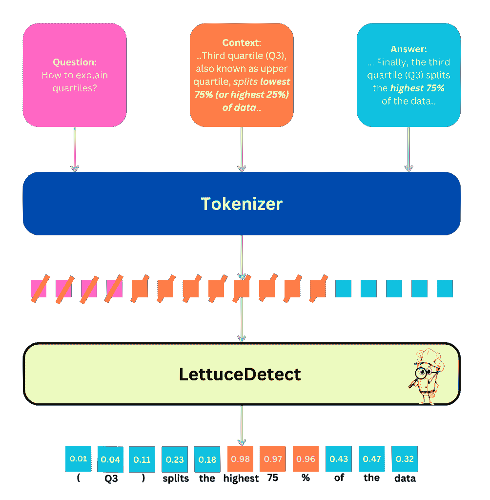
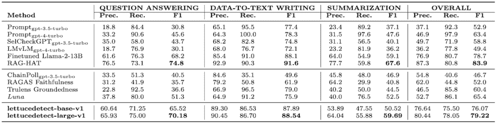
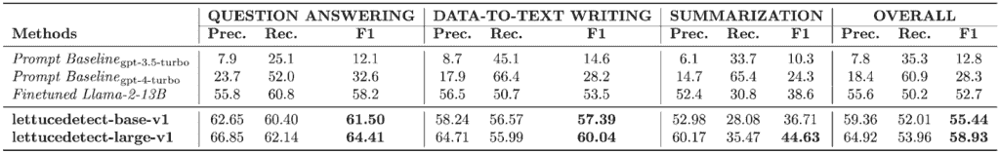

# LettuceDetect：RAG 应用的幻觉检测框架

> 原文：[`towardsdatascience.com/lettucedetect-a-hallucination-detection-framework-for-rag-applications/`](https://towardsdatascience.com/lettucedetect-a-hallucination-detection-framework-for-rag-applications/)

*最初发布于* [*HuggingFace*](https://huggingface.co/adaamko)

## TL;DR

我们介绍了**LettuceDetect**，这是一个轻量级的幻觉检测器，用于检索增强生成（RAG）管道。它是一个基于[ModernBERT](https://github.com/AnswerDotAI/ModernBERT)的**编码器**模型，在 MIT 许可下发布，带有可用的 Python 包和预训练模型。

+   **什么是**：LettuceDetect 是一个标记级检测器，用于标记 LLM 答案中的不受支持的片段。🥬

+   **如何**：在[RAGTruth](https://aclanthology.org/2024.acl-long.585/)（18k 个示例）上训练，利用 ModernBERT 进行上下文长度高达 4k 个标记。🚀

+   **原因**：它解决了（1）先前仅基于编码器的模型中的上下文窗口限制，以及（2）基于 LLM 的检测器的高计算成本。⚖️

+   **亮点**：

    +   在 RAGTruth 上击败了先前的基于编码器的模型（例如，[Luna](https://aclanthology.org/2025.coling-industry.34/)）。✅

    +   在大小的一小部分内超越了微调的 Llama-2-13B [2]，并且在推理方面非常高效。⚡️

    +   完全**开源**，MIT 许可。🔓

**LettuceDetect**通过识别 LLM 输出的“腐烂”部分，使你的 RAG 框架保持**新鲜**。😊

## 快速链接

+   **GitHub**：[github.com/KRLabsOrg/LettuceDetect](https://github.com/KRLabsOrg/LettuceDetect)

+   **PyPI**：[pypi.org/project/lettucedetect](https://pypi.org/project/lettucedetect/)

+   **arXiv 论文**：[2502.17125](https://arxiv.org/abs/2502.17125)

+   **Hugging Face 模型**：

    +   [基础模型](https://huggingface.co/KRLabsOrg/lettucedect-base-modernbert-en-v1)

    +   [大型模型](https://huggingface.co/KRLabsOrg/lettucedect-large-modernbert-en-v1)

+   **Streamlit 演示**：访问我们的[Hugging Face Space](https://huggingface.co/spaces/KRLabsOrg/LettuceDetect)或根据 GitHub 说明在本地运行。

* * *

## 为什么选择 LettuceDetect？

大型语言模型（LLMs）在 NLP 任务上取得了显著的进步，如 GPT-4 [4]、Llama-3 模型[5]、Mistral [6]（以及更多）。尽管 LLMs 取得了成功，但**幻觉**仍然是将 LLMs 部署在高风险场景（如医疗保健或法律）中的关键障碍[7,8]。

**检索增强生成（RAG）**试图通过将 LLM 的响应根植于检索到的文档中，提供外部知识供模型参考[9]，来减轻幻觉。但尽管 RAG 是减少幻觉的有力方法，LLM 在这些设置中仍然存在幻觉[1]。幻觉是输出中的信息，它是无意义的、事实错误的，或者与检索到的上下文不一致[8]。Ji 等人[10]将幻觉分为：

+   内在幻觉：源于模型预先存在的内部知识。

+   外部幻觉：当答案与提供的上下文或参考冲突时发生

虽然 RAG 方法可以减轻内部幻觉，但它们并非对外部幻觉免疫。Sun 等人 [11] 表明，模型倾向于优先考虑其内部知识而不是外部上下文。由于 LLM 仍然容易产生幻觉，它们在关键领域（例如医疗或法律）中的应用仍然可能存在缺陷。

### 幻觉检测的当前解决方案

幻觉检测的当前解决方案可以根据它们采用的方法分为不同的类别：

1.  **基于提示的检测器** 这些方法（例如，[RAGAS](https://github.com/explodinggradients/ragas)，[Trulens](https://github.com/truera/trulens)，[ARES](https://github.com/stanford-futuredata/ARES)）通常利用零样本或少量样本提示来检测幻觉。它们通常依赖于大型 LLM（如 GPT-4）并采用 SelfCheckGPT [12]，LM vs. LM [13] 或 Chainpoll [14] 等策略。虽然通常有效，但由于重复调用 LLM，它们可能计算成本较高。

1.  **微调的 LLM 检测器** 大型模型（例如，Llama-2，Llama-3）可以被微调用于幻觉检测 [1,15]。这可以带来高精度（如 RAGTruth 作者使用 Llama-2-13B 或 RAG-HAT 在 Llama-3-8B 上的工作所示），但训练和部署资源密集。由于模型大小和较慢的速度，推理成本也往往较高。

1.  **基于编码器的检测器** 类似于 [Luna [2]](https://aclanthology.org/2025.coling-industry.34/) 的模型依赖于 BERT 风格的编码器（通常限制在 512 个标记以内）进行标记级分类。这些方法在推理时通常比运行完整的 LLM 更高效，但受限于 **短上下文窗口** 和针对较小输入优化的注意力机制。

### ModernBERT 用于长上下文

ModernBERT [3] 是 BERT 的直接替代品，它是一个最先进的仅编码器变压器架构，在原始 BERT 模型的基础上融入了多项现代设计改进，例如它使用旋转位置编码 ([RoPe](https://huggingface.co/blog/designing-positional-encoding)) 来处理长达 8,192 个标记的序列，[去填充优化](https://arxiv.org/abs/2208.08124) 以消除填充标记上的浪费计算，以及 [GeGLU](https://arxiv.org/abs/2002.05202) 激活层以增强表达性和 [交替注意力](https://arxiv.org/abs/2004.05150v2) 以提高注意力计算的效率。

**LettuceDetect**利用 ModernBERT 扩展的上下文窗口构建一个用于幻觉检测的标记级分类器。这种方法绕过了许多旧 BERT 模型的局限性（例如，短上下文边界）并避免了大型 LLM 检测器的推理开销。我们的实验表明，LettuceDetect 在计算成本的一小部分内优于其他基于编码器的系统，同时在微调 LLM 检测器方面保持**竞争力**。

## 数据

[RAGTruth](https://aclanthology.org/2024.acl-long.585/) 是第一个专门为评估检索增强生成（RAG）设置中的**幻觉检测**而设计的大规模开源（MIT 许可证）基准。它包含**18,000**个注释示例，涵盖多个任务：

+   **问答（QA）**：从[MS MARCO](https://microsoft.github.io/msmarco/)数据集中采样，每个问题检索最多三份文档，并提示 LLM 生成答案。

+   **数据到文本生成**：基于[Yelp Open Dataset](https://www.yelp.com/dataset/)，其中 LLM 为采样的企业生成评论。

+   **新闻摘要**：使用来自[CNN/DailyMail](https://huggingface.co/datasets/cnn_dailymail)的随机文档，提示 LLM 提供摘要。

RAGTruth 中的每个示例都包括：

1.  一个**问题**和一个**提示**，

1.  一个或多个**参考段落**或**上下文文档**，

1.  一个**LLM 生成的响应**，

1.  **人类注释**在范围级别上指示答案的任何部分是否在事实上不受支持或与参考段落矛盾。

以下是从 RAGTruth 中摘录的示例，展示了幻觉的一个实例：

* * *

**问题**

> 如何解释四分位数？

**参考**

> **第二部分：**
> 
> 第二四分位数（Q2），更常被称为中位数，将数据分成两半（50%）。
> 
> 中位数将数据分成下半部和上半部。
> 
> 第三四分位数（Q3），也称为上四分位数，*将最低的 75%（或最高的 25%）的数据分开*。
> 
> *(…)*

**响应**

> 第一四分位数（Q1）将数据的最低 25%分开，而第二四分位数（Q2）将数据分成两个相等的部分，中位数是下半部分的中间值。最后，第三四分位数（Q3）将*数据的最高 75%分开*。
> 
> *(…)*

**注释**

+   **范围**：“最高的 75%”

+   **类型**：明显冲突

+   **原因**：

    +   原文：“最低的 75%（或最高的 25%）”

    +   生成文本：“最高的 75%”

* * *

这个例子展示了 RAGTruth 注释中涉及答案中特定范围与参考段落冲突的情况，提供了**幻觉类型**（例如，明显冲突）和可读的**理由**。我们的方法仅使用二进制注释，不使用幻觉类型的注释。

## 方法



作者提供的图像

**LettuceDetect 的高级描述**。在此，一个示例**问题**、**上下文**和**答案**三元组被处理。首先，文本被分词，然后 LettuceDetect 执行标记级分类。问题和上下文中的标记都被**掩码**（如图中的红线所示）以排除它们对损失函数的贡献。答案中的每个标记都接收一个概率，指示它是否被幻觉或支持。对于**跨度级别**检测，我们将幻觉概率高于 0.5 的连续标记合并为一个单一的预测跨度。

* * *

我们在 RAGTruth 数据集上训练**ModernBERT-base**和**ModernBERT-large**变体作为标记分类模型。模型的输入是**上下文**、**问题**和**答案**段落的拼接，其中包含专门的标记([CLS])（用于上下文）和([SEP])（作为分隔符）。我们限制序列长度为 4,096 个标记以实现计算可行性，尽管 ModernBERT 理论上可以处理高达 8,192 个标记。

### 分词和数据预处理

+   **分词器**：我们使用 Transformers 库中的*AutoTokenizer*来处理子词分词，并适当地插入[CLS]和[SEP]。

+   **标注**：

    +   上下文/问题标记被**掩码**（即在 PyTorch 中分配标签-100）以使它们不贡献于损失。

    +   每个答案标记接收**0**（支持）或**1**（幻觉）的标签。

### 模型架构

我们在 Hugging Face 的*AutoModelForTokenClassification*的基础上构建模型，使用**ModernBERT**作为编码器，并在其上方添加分类头。与一些之前的基于编码器的方法（例如在 NLI 任务上预训练的方法）不同，我们的方法**仅使用**ModernBERT，没有额外的预训练阶段。

### 训练配置

+   **优化器**：AdamW，学习率为 1 * 10^-5，权重衰减为 0.01。

+   **硬件**：单个 NVIDIA A100 GPU。

+   **训练轮数**：总共 6 个训练轮次。

+   **批处理**：

    +   批处理大小为 8，

    +   使用 PyTorch *DataLoader*加载数据（启用打乱），

    +   通过*DataCollatorForTokenClassification*进行动态填充，以有效地处理可变长度的序列。

在训练过程中，我们监控验证分割上的**标记级 F1**分数，使用*safetensors*格式保存检查点。一旦训练完成，我们将表现最佳的模型上传到 Hugging Face 以供公众访问。

在推理时，模型为答案中的每个标记输出幻觉概率。我们将超过 0.5 阈值的连续标记聚合以产生**跨度级别**的预测，指示答案中哪些部分可能被幻觉。上图说明了这个工作流程。

接下来，我们提供对模型性能的更详细评估。

## 结果

我们在所有任务类型（问答、数据到文本和摘要）的 RAGTruth 测试集上评估我们的模型。对于每个示例，RAGTruth 包括手动标注的表示幻觉内容的跨度。

### 示例级结果

我们首先评估**示例级**问题：*生成的答案是否包含任何幻觉？* 我们的大模型（**lettucedetect-large-v1**）实现了**总体 F1 分数为 79.22**%，超过了：

+   **GPT-4** (63.4%),

+   **Luna**（65.4%）（之前基于编码器的最先进模型），

+   **微调后的 Llama-2-13B**（78.7%）如 RAGTruth 论文中所示。

它仅次于**RAG-HAT**论文[15]中微调的**Llama-3-8B**（83.9%），但 LettuceDetect 在运行时**更小**且**更快**。同时，我们的基础模型（**lettucedetect-base-v1**）在参数使用较少的情况下仍保持高度竞争力。



作者提供的图片

上表是一个比较表格，展示了 LettuceDetect 如何与基于提示的方法（例如，GPT-4）和基于替代编码器的解决方案（例如，Luna）进行对齐。总体而言，**lettucedetect-large-v1**和**lettucedect-base-v1**是非常高效的模型，在推理设置中非常有效。

### 层级结果

除了检测答案是否包含幻觉之外，我们还考察了 LettuceDetect 识别**确切跨度**中不支持内容的能力。在这里，LettuceDetect 在报告了层级性能的模型中实现了**最先进**的结果，显著优于 RAGTruth 论文[1]中微调的 Llama-2-13B 模型和其他基线。



作者提供的图片

大多数方法，如 RAG-HAT[15]，没有报告层级指标，所以我们在这里没有进行比较。

### 推理效率

**lettucedetect-base-v1**和**lettucedetect-large-v1**比典型的基于 LLM 的检测器（例如，GPT-4 或 Llama-3-8B）使用的参数更少，并且可以在单个 NVIDIA A100 GPU 上每秒处理**30-60 个示例**。这使得它们适用于工业负载、面向用户的实时系统以及资源受限的环境。

总体而言，这些结果表明**LettuceDetect**具有良好的平衡：它在大规模 LLM 基础评判器的一小部分大小和成本下实现了接近最先进的准确性，同时提供了精确的、基于标记的幻觉检测。

## 开始使用

安装包：

```py
pip install lettucedetect
```

然后，你可以按以下方式使用该包：

```py
from lettucedetect.models.inference import HallucinationDetector

# For a transformer-based approach:

detector = HallucinationDetector(

    method="transformer", model_path="KRLabsOrg/lettucedect-base-modernbert-en-v1"

)

contexts = ["France is a country in Europe. The capital of France is Paris. The population of France is 67 million.",]

question = "What is the capital of France? What is the population of France?"

answer = "The capital of France is Paris. The population of France is 69 million."

# Get span-level predictions indicating which parts of the answer are considered hallucinated.

predictions = detector.predict(context=contexts, question=question, answer=answer, output_format="spans")

print("Predictions:", predictions)

# Predictions: [{'start': 31, 'end': 71, 'confidence': 0.9944414496421814, 'text': ' The population of France is 69 million.'}]
```

## 结论

我们介绍了**LettuceDetect**，这是一个轻量级且高效的 RAG 系统中幻觉检测框架。通过利用 ModernBERT 扩展的上下文能力，我们的模型在 RAGTruth 基准测试中实现了强大的性能，同时保持了**高推理效率**。这项工作为未来的研究方向奠定了基础，例如扩展到更多数据集、支持多种语言以及探索更先进的架构。即使在目前这个阶段，LettuceDetect 也证明了**有效的幻觉检测**可以使用**精简、专门构建**的基于编码器的模型来实现。

## 引用

如果您觉得这项工作有用，请按照以下方式引用：

```py
@misc{Kovacs:2025,
      title={LettuceDetect: A Hallucination Detection Framework for RAG Applications}, 
      author={Ádám Kovács and Gábor Recski},
      year={2025},
      eprint={2502.17125},
      archivePrefix={arXiv},
      primaryClass={cs.CL},
      url={https://arxiv.org/abs/2502.17125}, 
}
```

此外，如果您使用我们的代码，请别忘了在我们的 GitHub 仓库[这里](https://github.com/KRLabsOrg/LettuceDetect)给我们一个星⭐。

## 参考文献

[1] [刘等，2024，RAGTruth：检索增强生成中幻觉检测的数据集](https://aclanthology.org/2024.acl-long.585/)

[2] [Luna：用于检索增强生成中幻觉检测的简单而有效的基于编码器的模型](https://aclanthology.org/2025.coling-industry.34/)

[3] [ModernBERT：用于长上下文处理的现代 BERT 模型](https://huggingface.co/blog/modernbert)

[4] [GPT-4 报告](https://arxiv.org/abs/2303.08774)

[5] [Llama-3 报告](https://arxiv.org/abs/2307.09288)

[6] [Mistral 7B](https://arxiv.org/abs/2310.06825)

[7] [卡杜尔等，2023，大型语言模型的挑战和应用](https://arxiv.org/pdf/2307.10169)

[8] [黄等，2025，大型语言模型中幻觉的综述：原理、分类、挑战和开放性问题](https://dl.acm.org/doi/10.1145/3703155)

[9] [高文等，2024，大型语言模型的检索增强生成：综述](https://arxiv.org/abs/2312.10997)

[10] [纪等，2023，自然语言生成中幻觉的综述](https://doi.org/10.1145/3571730)

[11] [孙等，2025，ReDeEP：通过机制可解释性检测检索增强生成中的幻觉](https://arxiv.org/abs/2410.11414)

[12] [马纳库等，2023，SelfCheckGPT：用于生成大型语言模型的零资源黑盒幻觉检测](https://aclanthology.org/2023.emnlp-main.557/)

[13] [科恩等，2023，LM vs LM：通过交叉审问检测事实错误](https://aclanthology.org/2023.emnlp-main.778/)

[14] [弗里尔等，2023，Chainpoll：一种用于 LLM 幻觉检测的高效方法](https://arxiv.org/abs/2310.18344)

[15] [宋等，2024，RAG-HAT：检索增强生成中{LLM}的幻觉感知调整管道](https://aclanthology.org/2024.emnlp-industry.113/)

[16] [德夫林等，2019，BERT：用于语言理解的深度双向变换器预训练](https://arxiv.org/abs/1810.04805)
