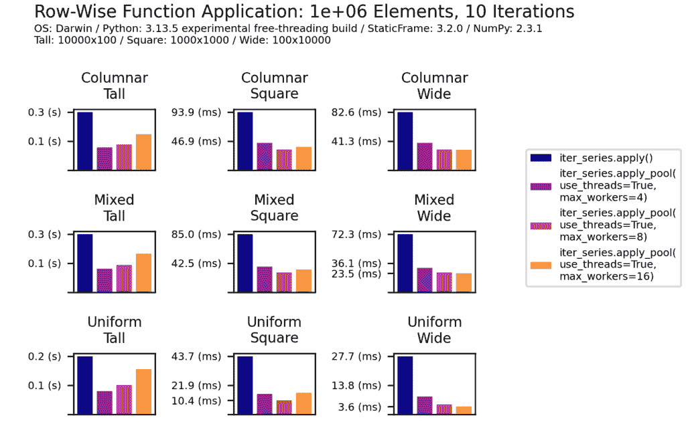
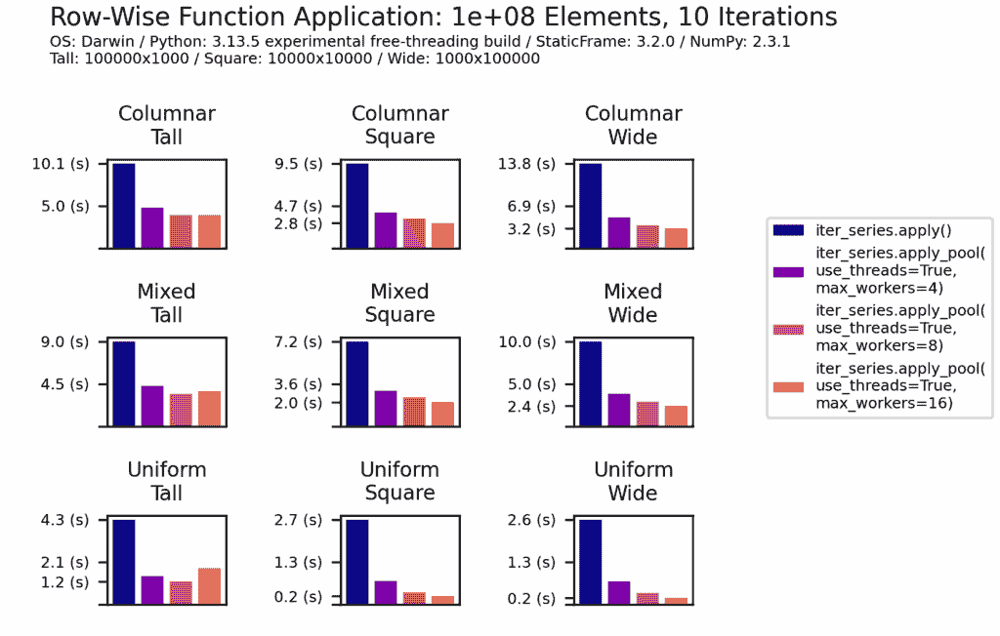
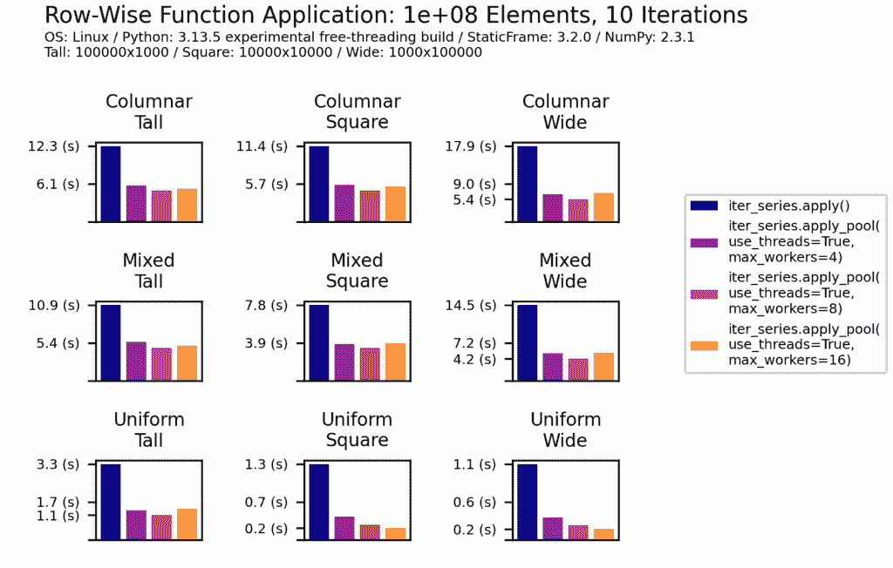
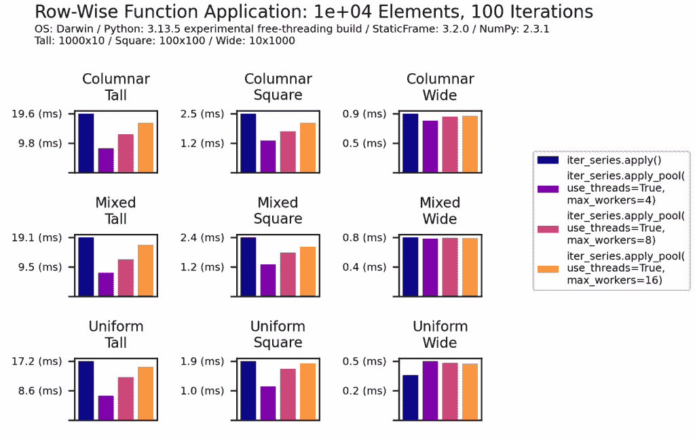
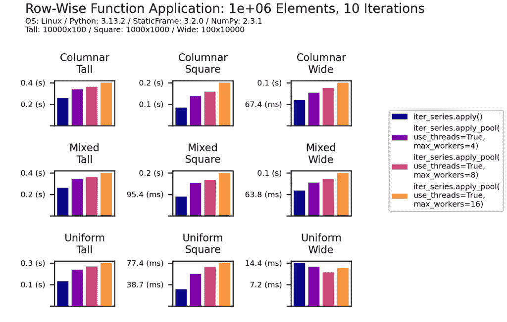
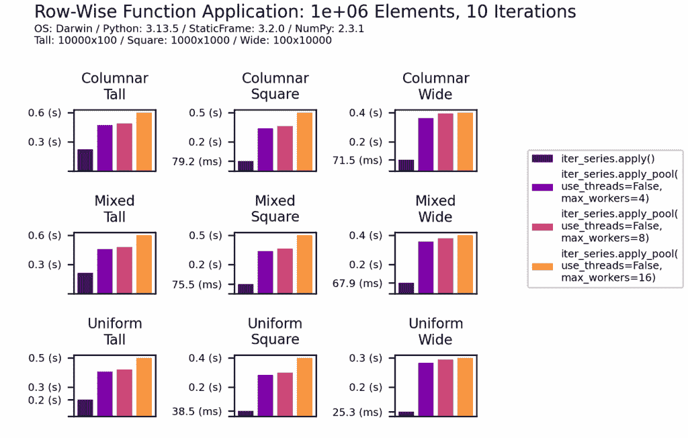

# 在免费线程 Python 中使用不可变 DataFrame 释放性能

> 原文：[`towardsdatascience.com/liberating-performance-with-immutable-dataframes-in-free-threaded-python/`](https://towardsdatascience.com/liberating-performance-with-immutable-dataframes-in-free-threaded-python/)

<mdspan datatext="el1751675262572" class="mdspan-comment">将函数应用于 DataFrame 的每一行是一个常见操作。这些操作是令人尴尬的并行：每一行都可以独立处理。在有多个核心 CPU 的情况下，可以同时处理许多行。

直到最近，在 Python 中利用这个机会是不可能的。多线程函数应用，由于是 CPU 密集型，被全局解释器锁（GIL）所限制。

Python 现在提供了一个解决方案：使用 Python 3.13 的“实验性免费线程构建”，移除了 GIL，从而实现了 CPU 密集型操作的真正多线程并发。

性能优势是显著的。利用免费线程 Python，[StaticFrame](https://github.com/static-frame/static-frame) 3.2 可以在 DataFrame 上以至少两倍于单线程执行的速度进行行级函数应用。

例如，对于一百万个整数的正方形 DataFrame 的每一行，我们可以使用`lambda s: s.loc[s % 2 == 0].sum()`来计算所有偶数的总和。当使用 Python 3.13t（“t”表示免费线程版本）时，持续时间（使用`ipython` `%timeit`测量）降低了 60%以上，从 21.3 毫秒降至 7.89 毫秒：

```py
# Python 3.13.5 experimental free-threading build (main, Jun 11 2025, 15:36:57) [Clang 16.0.0 (clang-1600.0.26.6)] on darwin
>>> import numpy as np; import static_frame as sf

>>> f = sf.Frame(np.arange(1_000_000).reshape(1000, 1000))
>>> func = lambda s: s.loc[s % 2 == 0].sum()

>>> %timeit f.iter_series(axis=1).apply(func)
21.3 ms ± 77.1 μs per loop (mean ± std. dev. of 7 runs, 10 loops each)

>>> %timeit f.iter_series(axis=1).apply_pool(func, use_threads=True, max_workers=4)
7.89 ms ± 60.1 μs per loop (mean ± std. dev. of 7 runs, 100 loops each)
```

在 StaticFrame 中，行级函数应用使用`iter_series(axis=1)`接口，然后是`apply()`（用于单线程应用）或`apply_pool()`（用于多线程`use_threads=True`或多进程`use_threads=False`应用）。

使用免费线程 Python 的好处是稳健的：性能提升在广泛的 DataFrame 形状和组成中是一致的，在 MacOS 和 Linux 中都是成比例的，并且与 DataFrame 大小呈正相关。

当使用启用 GIL 的标准 Python 时，CPU 密集型进程的多线程处理通常会降低性能。如下所示，标准 Python 中相同操作的持续时间从单线程的 17.7 毫秒增加到多线程的近 40 毫秒：

```py
# Python 3.13.5 (main, Jun 11 2025, 15:36:57) [Clang 16.0.0 (clang-1600.0.26.6)]
>>> import numpy as np; import static_frame as sf

>>> f = sf.Frame(np.arange(1_000_000).reshape(1000, 1000))
>>> func = lambda s: s.loc[s % 2 == 0].sum()

>>> %timeit f.iter_series(axis=1).apply(func)
17.7 ms ± 144 µs per loop (mean ± std. dev. of 7 runs, 100 loops each)

>>> %timeit f.iter_series(axis=1).apply_pool(func, use_threads=True, max_workers=4)
39.9 ms ± 354 µs per loop (mean ± std. dev. of 7 runs, 10 loops each)
```

在使用免费线程的 Python 时存在权衡：正如这些示例所示，单线程处理速度较慢（在 3.13t 上为 21.3 毫秒，而在 3.13 上为 17.7 毫秒）。总的来说，免费线程的 Python 会带来性能开销。这是 CPython 开发的一个活跃领域，预计在 3.14t 及以后会有改进。

此外，尽管许多 C 扩展包如 NumPy 现在为 3.13t 提供了预编译的二进制轮子，但仍然存在诸如线程竞争或数据竞争等风险。

StaticFrame 通过强制不可变性来避免这些风险：线程安全是隐含的，消除了使用锁或防御性副本的需要。StaticFrame 通过使用不可变的 NumPy 数组（`flags.writeable` 设置为 `False`）并禁止原地修改来实现这一点。

## 扩展 DataFrame 性能测试

评估复杂数据结构如 DataFrame 的性能特性需要测试多种类型的 DataFrame。以下性能面板对九种不同的 DataFrame 类型进行行级函数应用，测试了三种形状和三种类型同质性的所有组合。

对于固定数量的元素（例如，100 万），测试了三种形状：高（10,000 行 x 100 列）、正方形（1,000 行 x 1,000 列）和宽（100 列 x 10,000 列）。为了改变类型同质性，定义了三种合成数据类别：列式（相邻列没有相同的类型）、混合式（四组相邻列共享相同的类型）和统一式（所有列都是相同的类型）。StaticFrame 允许相同类型的相邻列以二维 NumPy 数组的形式表示，从而降低了列交叉和行形成的成本。在统一极端情况下，整个 DataFrame 可以用一个二维数组表示。合成数据使用 [frame-fixtures](https://github.com/static-frame/frame-fixtures) 包生成。

使用的是相同的函数：`lambda s: s.loc[s % 2 == 0].sum()`。虽然使用 NumPy 直接实现可能更高效，但此函数近似了创建许多中间 `Series` 的常见应用。

图例文档了并发配置。当 `use_threads=True` 时，使用多线程；当 `use_threads=False` 时，使用多进程。StaticFrame 使用标准库中的 `ThreadPoolExecutor` 和 `ProcessPoolExecutor` 接口，并公开它们的参数：`max_workers` 参数定义了使用的最大线程数或进程数。还有一个 `chunksize` 参数，但在本研究中没有变化。

### 多线程函数应用与 Free-Threaded Python 3.13t

如下所示，3.13t 中多线程处理的性能优势在所有测试的 DataFrame 类型中是一致的：处理时间至少减少了 50%，在某些情况下超过 80%。对于高 DataFrame，最佳线程数（`max_workers` 参数）较小，因为较小行的快速处理意味着额外的线程开销实际上降低了性能。



图表由作者绘制。

扩展到包含 1 亿个元素（1e8）的 DataFrame，性能提升。除了两种 DataFrame 类型外，所有类型的处理时间都减少了超过 70%。



图表由作者绘制。

多线程的开销在不同平台之间可能差异很大。在所有情况下，使用免费线程 Python 的性能提升在 MacOS 和 Linux 之间成比例一致，尽管 MacOS 显示出略微更大的好处。在 Linux 上处理一亿个元素显示出类似的相对性能提升：



图表由作者提供。

令人惊讶的是，即使在 3.13t 中只有一万个元素（1e4）的小型 DataFrame 也能从多线程处理中受益。而对于宽 DataFrame 没有发现任何好处，但高和方 DataFrame 的处理时间可以减少一半。



图表由作者提供。

### 标准 Python 3.13 下的多线程函数应用

在免费线程的 Python 之前，CPU 密集型应用程序的多线程处理会导致性能下降。以下将清楚地说明，这里使用标准 Python 3.13 进行了相同的测试。



图表由作者提供。

### 标准 Python 3.13 下的多进程函数应用

在免费线程的 Python 之前，多进程是 CPU 密集型并发的唯一选项。然而，多进程只有在每个进程的工作量足够大，可以抵消创建每个进程的解释器和进程间复制数据的高成本时，才能带来好处。

如此所示，多进程行级函数应用显著降低了性能，处理时间从单线程的两次增加到十倍。每个工作单元太小，无法弥补多进程的开销。



图表由作者提供。

## 免费线程 Python 的状态

[PEP 703](https://peps.python.org/pep-0703)，“在 CPython 中使全局解释器锁可选”，于 2023 年 7 月被 Python 指导委员会接受，指导方针是，在第一阶段（Python 3.13）它是实验性的和非默认的；在第二阶段，它变为非实验性和官方支持的；在第三阶段，它成为默认的 Python 实现。

在经过显著的 CPython 开发和像 NumPy 这样的关键包的支持后，[PEP 779](https://peps.python.org/pep-0779)，“免费线程 Python 支持状态的准则”于 2025 年 6 月被 Python 指导委员会接受。在 Python 3.14 中，免费线程 Python 将进入第二阶段：非实验性和官方支持。虽然还不确定免费线程 Python 将何时成为默认选项，但很明显，已经设定了轨迹。

## 结论

行级函数应用只是开始：分组操作、窗口函数应用以及许多其他不可变 DataFrame 的操作都同样适合并发执行，并且可能会显示出可比较的性能提升。

使 CPython 变得更快的工作已经取得了成功：据说 Python 3.14 的速度比 Python 3.10 快 20% 到 40%。不幸的是，这些性能优势并没有被许多使用 DataFrames 的人所实现，在这些情况下，性能主要受限于 C 扩展（无论是 NumPy、Arrow 还是其他库）。

如此所示，免费线程的 Python 可以通过使用低成本、内存高效的线程实现高效的并行执行，即使性能主要受限于像 NumPy 这样的 C 扩展库，也能将处理时间减少 50% 到 90%。现在，由于能够在线程之间安全地共享不可变数据结构，大幅提高性能的机会变得丰富起来。
