# 线性规划：辅助变量

> 原文：[`towardsdatascience.com/linear-programming-auxiliary-variables-c66bb66c6aee/`](https://towardsdatascience.com/linear-programming-auxiliary-variables-c66bb66c6aee/)


来自 pexels.com 的 Pixababy 图片

辅助变量似乎是在许多线性规划材料中经常被快速跳过的主题。我认为它们非常有趣且相当强大。因此，我决定写一篇简短的文章来解释和演示辅助变量在线性规划中通常是如何使用的。

在我们深入探讨辅助变量之前——我想提到这是我在线性规划（LP）上撰写的一系列文章的第五部分。要查看我已涵盖的其他 LP 主题，请使用下面的链接：

> [**线性规划**](https://medium.com/@jarom.hulet/list/fe5c1fba2583)

首先，让我们来回答这个问题——什么是*辅助变量*？我在线性规划（LP）中的辅助变量定义是“添加到线性规划问题中的额外变量，允许使用否则不可能的逻辑。”

> 辅助变量：添加到线性规划问题中的额外变量，允许使用否则不可能的逻辑。

通常，辅助变量以巧妙的方式用于构建目标函数和约束中的非线性关系（通常是违反线性规划规则），同时仍然适用于线性规划。换句话说，它们允许线性化没有它们将是非线性的函数。由于有多种使用辅助变量的方式，在这篇文章中，我们将讨论我见过的最常见的方法。我的目标是让你对辅助变量做什么以及如何在线性规划中使用它们有一个良好的直觉。文章的其余部分将详细介绍辅助变量的具体应用，并为每个应用提供详细的示例。请注意，这并不是对辅助变量在线性规划中使用的详尽描述。它的目的是展示它们最常用的几种方式。

### 创建分段线性函数

分段线性方程中发生的跳跃在线性规划中是不允许的。幸运的是，我们可以使用辅助变量来实现分段函数的等效功能！让我们来看一个例子。

让我们想象一下，你管理着一个制造工厂。你需要生产一定数量的产品，同时最小化公司的工资支出。每位员工都有每小时工资和每小时生产率。你的目标是制定一个工作计划，以最小化工资支出，同时满足特定数量的产品产量。这听起来很容易？但是有一个问题！任何每周工作超过 20 小时的员工都有资格获得福利——这些福利将额外花费每位员工 500 美元。这代表着函数斜率不变（每小时工资）的跳跃。

我们将首先探讨如何执行截距跳跃。让我们设置一个没有截距跳跃的简单问题，然后我们可以添加 20 小时工作带来的额外福利成本复杂性。在我们的简单例子中，我们有三名员工，他们各自有不同的工资和不同的生产水平（如下表所示）。我们的目标是最小化劳动力成本，同时每周至少生产 600 个单位。

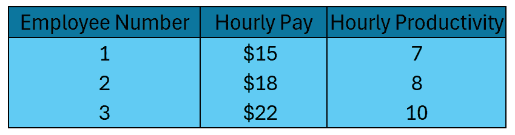

图片由作者提供

在考虑额外福利费用带来的复杂性之前，我们的目标函数和约束条件如下：

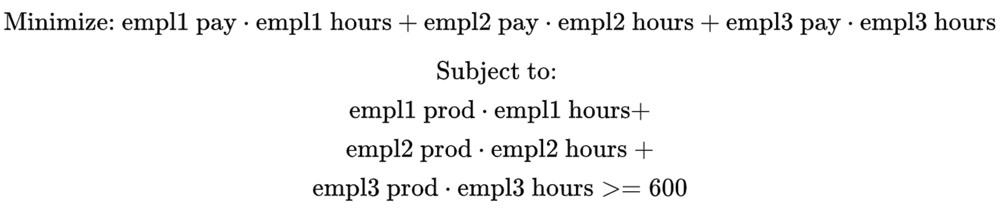

截距跳跃前的线性规划设置 – 1 个目标函数，1 个约束

好的，在设置了线性规划 101 问题之后，让我们来添加 20 小时的截距跳跃。我们将使用所谓的“大 M 方法”来完成这个任务。在这个方法中，我们创建一个或多个二元辅助变量，并创建一个额外的约束条件来绑定辅助变量到原始决策变量。在约束配置中，“大 M”中的“M”部分发挥作用。

下面是我们将添加的新约束条件的示例——*y* 是我们添加到问题中的二元辅助变量，M 是一个任意大的数。

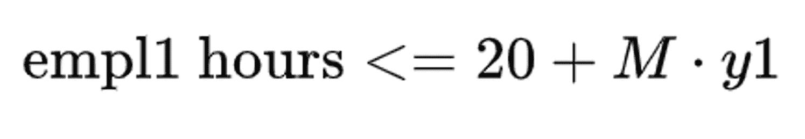

大 M 约束

让我们分解这个约束条件，因为这是执行跳跃的主要概念。在左边，我们有为员工 1 安排的小时数的决策变量。在右边，我们有需要福利的小时数加上‘M’（这是一个任意大的数，因此称为 _big-_M）和 y1 是我们的二元辅助变量。在我们的例子中，我将 M 设置为 1,000。理解这个约束条件是关键！让我们通过运行不同的值通过员工 1 小时的不等式来建立我们的直觉。请参见下表和解释：

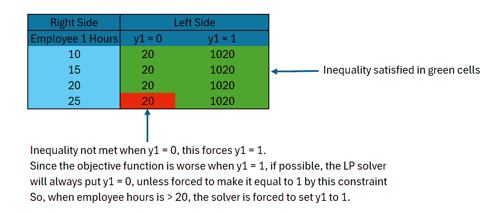

大 M 方法的解释 – 图片由作者提供

除了新的约束之外，我们还需要对我们的目标函数进行修改。这很简单，我们只需将我们的新辅助变量（记住，它们是二进制的）与拦截跳跃的乘积（在这种情况下为 500 美元）添加到目标函数中。当辅助变量为 0 时，不会添加额外成本。当员工工作时间超过 20 小时时，辅助变量被迫为 1，并将 500 美元添加到该员工的客观值中。

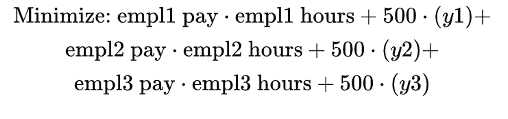

更新后的拦截跳跃目标函数

在问题完全形成后，让我们使用 Python 中的 pulp 包来设置和解决它！

```py
import pulp

# Define the problem
problem = pulp.LpProblem("Staff_Management", pulp.LpMinimize)

# Define the decision variables as integers
empl1 = pulp.LpVariable("empl1", lowBound=0, upBound=60)
empl2 = pulp.LpVariable("empl2", lowBound=0, upBound=60)
empl3 = pulp.LpVariable("empl3", lowBound=0, upBound=60)

# establish employee pay and productivity
empl1_pay = 15
empl2_pay = 18
empl3_pay = 22

empl1_prod = 7
empl2_prod = 8
empl3_prod = 10

# create auxiliary variables to capture piecewise OT function
empl1 = pulp.LpVariable("empl1_reg", lowBound=0, upBound=40)
empl2 = pulp.LpVariable("empl2_reg", lowBound=0, upBound=40)
empl3 = pulp.LpVariable("empl3_reg", lowBound=0, upBound=40)

# add auxiliary variables
y1 = pulp.LpVariable("y1", lowBound=0, cat="Integer")
y2 = pulp.LpVariable("y2", lowBound=0, cat="Integer")
y3 = pulp.LpVariable("y3", lowBound=0, cat="Integer")

# Objective function
problem += empl1_pay*empl1 + 500*y1 +  empl2_pay*empl2 + 500*y2 + empl3_pay*empl3 + 500*y3  , "Salary Cost"

# Constraints
# force ret and ot hours to add up to total hours
M = 1000

# big M method
problem += empl1 <= 20 + M*y1
problem += empl2 <= 20 + M*y2
problem += empl3 <= 20 + M*y3

problem += (empl1_prod * empl1 + 
            empl2_prod * empl2 + 
            empl3_prod * empl3 >= 600)

# Solve the problem
status = problem.solve()

# Output the results
print(f"Status: {pulp.LpStatus[status]}")
print(f"Optimal value of empl1: {empl1.varValue}")
print(f"Optimal value of empl2: {empl2.varValue}")
print(f"Optimal value of empl3: {empl3.varValue}")
print(f"Minimized salary cost: {pulp.value(problem.objective)}")
```

下面是运行结果，看起来我们可以在产生 600 个部件的同时，产生 1,810 美元的劳动力费用。员工 1 将是唯一获得福利的员工（员工 2 的加班时间刚刚超过 20 小时）。

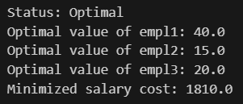

优化输出 – 图像由作者提供

好的，现在我们已经解决了额外福利费用的难题，让我们通过添加加班费（常规工资的 1.5 倍）使事情变得更加复杂！这实际上会相当简单 😁。为此，我们需要将我们的员工小时变量分成两个单独的变量（常规小时和加班小时）。因此，现在我们有了六个员工小时变量，而不是三个。每个员工都有一个常规小时变量和一个加班小时变量。我们创建一个约束来将常规小时数限制在不超过 40 小时（在 pulp 中，您可以使用内置的 upBound 参数来完成此操作）。然后我们将修改目标函数以反映这一变化——我将在下面的代码中复制/粘贴一个摘录：

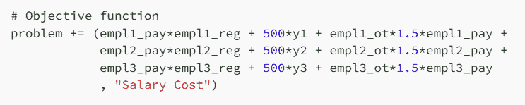

新的目标函数，将常规时间和加班时间分成两个辅助变量

注意，由于加班成本高于常规时间，求解器将在开始添加加班时间之前始终最大化常规时间，因此我们不需要约束来强制这种行为。我还将生产要求提高到 1,000，以便我们的示例需要一些加班时间。

下面是解决包含福利和加班部分的完整问题的代码：

```py
import pulp

# Define the problem
problem = pulp.LpProblem("Staff_Management", pulp.LpMinimize)

# establish employee pay and productivity
empl1_pay = 15
empl2_pay = 18
empl3_pay = 22

empl1_prod = 7
empl2_prod = 8
empl3_prod = 10

# create auxiliary variables to capture piecewise OT function
empl1_reg = pulp.LpVariable("empl1_reg", lowBound=0, upBound=40)
empl2_reg = pulp.LpVariable("empl2_reg", lowBound=0, upBound=40)
empl3_reg = pulp.LpVariable("empl3_reg", lowBound=0, upBound=40)

empl1_ot = pulp.LpVariable("empl1_ot", lowBound=0, upBound=20)
empl2_ot = pulp.LpVariable("empl2_ot", lowBound=0, upBound=20)
empl3_ot = pulp.LpVariable("empl3_ot", lowBound=0, upBound=20)

# add auxiliary variables
y1 = pulp.LpVariable("y1", lowBound=0, cat="Integer")
y2 = pulp.LpVariable("y2", lowBound=0, cat="Integer")
y3 = pulp.LpVariable("y3", lowBound=0, cat="Integer")

# Objective function
problem += (empl1_pay*empl1_reg + 500*y1 + empl1_ot*1.5*empl1_pay +
            empl2_pay*empl2_reg + 500*y2 + empl2_ot*1.5*empl2_pay + 
            empl3_pay*empl3_reg + 500*y3 + empl3_ot*1.5*empl3_pay 
            , "Salary Cost")

# Constraints
# force ret and ot hours to add up to total hours
M = 1000

# big M method
problem += (empl1_reg + empl1_ot) <= 20 + M*y1
problem += (empl2_reg + empl2_ot) <= 20 + M*y2
problem += (empl3_reg + empl3_ot) <= 20 + M*y3

# constraint on minimum items produced
problem += empl1_prod * (empl1_reg + empl1_ot) + empl2_prod * (empl2_reg + empl2_ot) + empl3_prod * (empl3_reg + empl3_ot) >= 1000

# Solve the problem
status = problem.solve()

# Output the results
print(f"Status: {pulp.LpStatus[status]}")
print(f"Optimal value of empl1 reg: {empl1_reg.varValue}")
print(f"Optimal value of empl1 ot: {empl1_ot.varValue}")
print(f"Optimal value of empl2 reg: {empl2_reg.varValue}")
print(f"Optimal value of empl2 ot: {empl2_ot.varValue}")
print(f"Optimal value of empl3 reg: {empl3_reg.varValue}")
print(f"Optimal value of empl3 ot: {empl3_ot.varValue}")
print(f"Minimized salary cost: {pulp.value(problem.objective)}")
```

下面是最佳输出：

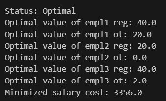

优化输出 – 图像由作者提供

最佳策略是将员工 1 的工作时间最大化到 60 小时，将员工 2 的工作时间用到福利限制，让员工 3 工作一整周再加 2 小时。我希望这个例子说明了我们如何将拦截跳跃和斜率的变化线性化，以便将它们纳入线性规划问题中。

### 变量之间的条件关系

有时候我们需要对变量之间的条件关系进行建模以解决优化问题。在这里，我将深入探讨我为不久前撰写的一篇文章创建的一个例子（下文有链接）。那篇文章是关于模拟的，并间接提到了线性规划（LP）。我完全没有提到它所使用的辅助变量——我想借此机会在这里补充我之前没有提到的内容。

> [**模拟数据，真实学习：情景分析**](https://towardsdatascience.com/simulated-data-real-learnings-scenario-analysis-02ee56ed8886)

这是问题的设置方式——想象你是一位正在规划住宅区的开发商。你有多个楼层平面可供选择，并且你希望在特定约束下优化你的利润。以下是不同楼层平面及其关键指标的一张表格：

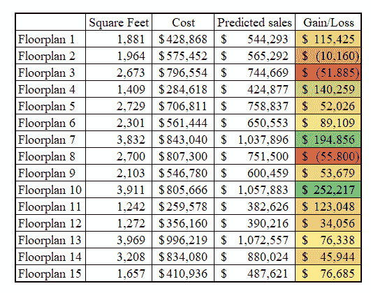

每个楼层平面图的详细信息——作者图片

我们的主要决策变量是上表每行的整数值。这些整数值代表我们将要建造的每种楼层平面的房屋数量。这在上文末尾的代码列表‘x’中有所表示。

这里是该问题的三个约束：

+   我们必须在我们的社区中至少有 6 种不同的楼层平面

+   我们需要至少有 10 座小于 2,000 平方英尺的房屋，15 座在 2,000 平方英尺和 3,000 平方英尺之间，以及 10 座大于 3,000 平方英尺的房屋

+   最后，我们有 150,000 平方英尺的用地——每座房屋需要比楼层平面多 25%的平方英尺——我们不能建造比我们有土地更多的房屋！

第一个约束将需要辅助变量，其他两个可以直接通过输入数据和主要决策变量（“x's”）来处理。

在我们设置这个约束之前，让我们先了解一下主要决策变量是如何工作的。上表中的每一行都将有一个自己的‘x’决策变量。因此，我们将有 15 个‘x’变量——每个变量将代表我们将为相应的楼层平面建造的房屋数量。例如，X1 代表将建造的楼层平面 1 房屋的数量。所以，如果 X1 = 10，住宅区将建造 10 座楼层平面 1 的房屋。

好的，现在让我们进入对话的核心——辅助变量！我们需要一种方法来确保至少有 6 个‘x’变量大于 0。我们通过为每个楼层平面创建一个二进制辅助变量来实现这一点。因此，我们现在有 15 个二进制‘y’变量。接下来，我们需要将‘y’s 与‘x’s 联系起来，以便当一个 x 变量大于 0 时，相应的 y 变量被设置为 1。我们通过创建一个约束 x ≥ y 来实现这一点——让我们通过下表来建立对这个约束满足我们需求的理解：

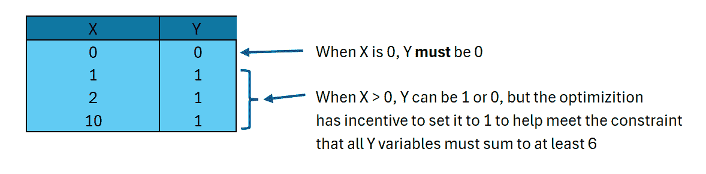

解释将辅助变量（y）与决策变量（x）关联的约束——图片由作者提供

在设置这些辅助变量并引入新的约束以将 x 与 y 相关联之后，我们需要添加一个最终约束——即 y 变量需要至少相加到 6。有了这个约束，我们现在可以设置并运行我们的优化了！

以下代码展示了如何在 Python 中设置和解决此问题：

```py
import pandas as pd
import numpy as np
from pulp import *

df = pd.read_csv(csv_path)
n = len(df)

# create dummy indicators to categorize home size
df['small_house'] = np.where(df['square_feet'] < 2000, 1, 0)
df['medium_house'] = np.where((df['square_feet'] >= 2000) &amp; 
                              (df['square_feet'] < 3000), 
                               1, 0)
df['large_house'] = np.where(df['square_feet'] >= 3000, 1, 0)

# Create a MILP problem
problem = LpProblem("Simple MILP Problem", LpMaximize)

# Define decision variables
x = LpVariable.dicts("x", range(n), lowBound=0, cat='Integer')
y = LpVariable.dicts('y', range(n), cat='Binary')

# Objective 
problem += lpSum(x[i]*df['gain_loss'][i] for i in range(n))

# constraints

# limit to amount of land available
# assume each floorplan takes 25% more land than its square footage
problem += lpSum(x[i]*df['square_feet'][i]*1.25 for i in range(n)) <= 150000

# requirements for diversity in home sizes
problem += lpSum(x[i]*df['small_house'][i] for i in range(n)) >= 15
problem += lpSum(x[i]*df['medium_house'][i] for i in range(n)) >= 15
problem += lpSum(x[i]*df['large_house'][i] for i in range(n)) >= 10

# Create at least 6 unique floorplans
for i in range(n):
    # if x is 0, y has to be 0
    problem += x[i] >= y[i]

# if x = 1, y coud be 0 or 1
# but because we want sum(y) to be >= 6, the optimization
# will assign y to be 1
problem += lpSum(y[i] for i in range(n)) >= 6

# solve problem
problem.solve()

# print solution
for i in range(n):
    print(f'{i + 1} : {value(x[i])}')

# print optimal profit
print("Optimal profit :", value(problem.objective))
```

下面是最佳解决方案：

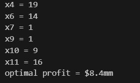

最佳楼层规划策略——图片由作者提供

我们可以看到，我们的约束是有效的！有 6 个楼层规划被选中以进行最佳输出建设。

### “或”逻辑

在线性规划中，我们经常需要访问“或”逻辑。原始的“或”逻辑不是线性的，因此我们必须使用辅助变量来线性化它。为此，我们需要为“或”逻辑中的每个条件添加一个辅助变量，然后添加另一个辅助变量来将它们连接起来。

想象你管理着一个微芯片制造厂。出于国家安全原因，政府为特定水平的芯片生产提供 2,000 美元的补助金。为了有资格获得补助金，你每周至少需要生产 42 个芯片 A 或 15 个芯片 B。你每周只能获得一个补助金，所以生产 >42 个 A 和 >15 个 B 不会得到双倍补助金。这是一个“或”逻辑的例子，因为如果你满足 A 或 B 的要求，你就能获得补助金。

为了制定这个问题，我们需要为每种芯片类型设置一个**二进制**辅助变量。我们将创建一个“grant_a”变量和一个“grant_b”变量。然后，我们将添加约束 chip_a ≥ 45 * grant_a——其中 chip_a 是生产的芯片 a 的总数。我们将为 chip b 添加相同的约束，对应于所需的芯片数量。

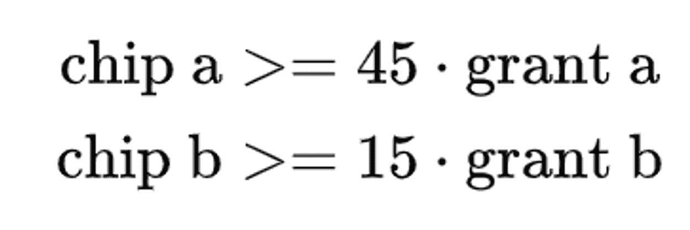

使用‘grant a’和‘grant b’辅助变量的约束——图片由作者提供

最后，我们需要一种方法来使用“或”逻辑将 grant_a 和 grant_b 连接起来。为此，我们将创建一个额外的**二进制**辅助变量——“grant”——以及一个额外的约束。

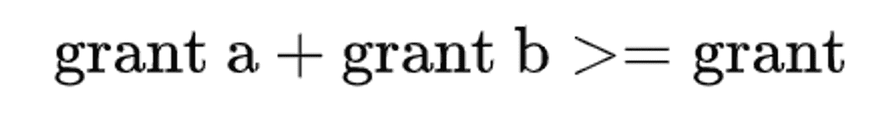

将 grant a 和 b 辅助变量与 grant 辅助变量关联的约束——图片由作者提供

如果 grant_a 和 grant_b 都为 0，这将迫使 grant 为 0。但是，如果 grant_a 和/或 grant_b 为 1，grant 也可以取值为 1。当有选择时（再次强调，这是当 grant_a 和/或 grant_b 为 1 时），优化将始终将 grant 设置为 1，因为将 grant 设置为 1 将使目标函数增加 2,000！

下面是 Python 代码示例。请注意，我已将边际利润添加到目标函数中（芯片 A 为$20，芯片 B 为$30）并添加了一个材料使用约束来绑定问题。

```py
from pulp import LpProblem, LpMaximize, LpVariable, LpBinary, lpSum

# Define the problem
problem = LpProblem("chip_manufacturing", LpMaximize)

# Decision variables
chip_a = LpVariable("chip_a", lowBound=0, cat="integer")
chip_b = LpVariable("chip_b", lowBound=0, cat="integer")

# set up three auxiliary variables
# one for if the factory qualfies for a grant through chip a production
# one for if the factory qualifies for a grant through chip b production
# and one more to indicate of at least one of the chip production levels qualifies for the grant
grant = LpVariable("grant", cat="Binary")
grant_a = LpVariable("grant_a", cat="Binary")
grant_b = LpVariable("grant_b", cat="Binary")

# Objective function
profit = 20 * chip_a + 30 * chip_b + 2000 * grant
problem += profit, "total profit"

# Constraints
# Material usage and availability
problem += 5 * chip_a + 12 * chip_b <= 200, "raw_material_constraint"

# Grant eligibility conditions
# If 100 units of chip_a are made, grant can be awarded
problem += chip_a >= 45 * grant_a, "grant_chip_A_constraint"

# If 75 units of chip_b are made, grant can be awarded
problem += chip_b >= 15 * grant_b, "grant_chip_b_constraint"

# if grant_a and grant_b are 0, force grant to be 0
problem += grant_a + grant_b >= grant, "grant_or_condition"

# Solve the problem
problem.solve()

# Output the results
print(f"Status: {problem.status}")
print(f"Profit: ${problem.objective.value():,.2f}")
print(f"Chip A: {chip_a.value():.0f} units")
print(f"Chip B: {chip_b.value():.0f} units")
print(f"Grant Awarded: {'Yes' if grant.value() else 'No'}")
```

优化后的解决方案如下：

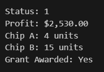

优化结果 - 作者提供的图像

在这里，我们可以看到，尽管我们使用芯片 A 每单位原材料能生产出更多的产品，但我们仍需要生产 15 个单位的芯片 B 以获得资助。一旦我们获得资助，我们就用剩下的材料来生产芯片 A。看起来“或”逻辑是正确的！我们现在明白了如何使用辅助变量来解决带有“或”逻辑的线性规划问题！

### 结论

我希望您对如何使用辅助变量大大提高线性规划的灵活性有了更全面的理解。本文旨在介绍辅助变量，并给出了一些使用示例。它们还有其他的使用方法，您可以进一步探索。一开始它们可能有点难以理解，但一旦掌握了它们，线性规划优化的新世界就会向您敞开！
