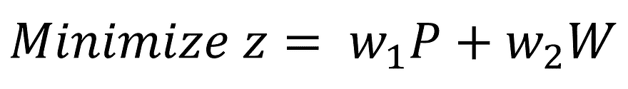
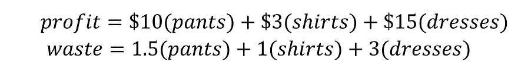
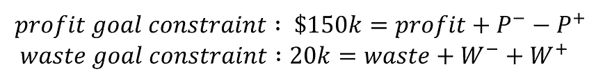
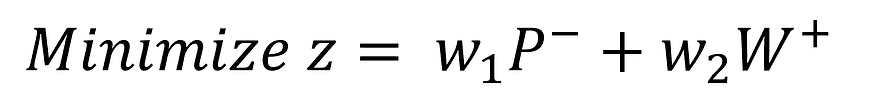
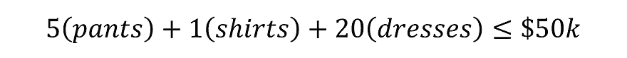
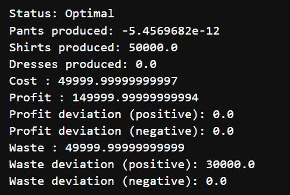
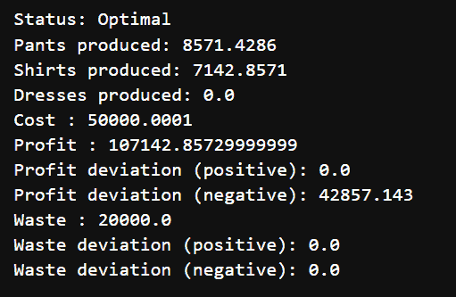
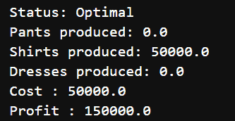
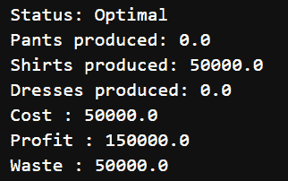

# 线性规划：使用目标规划管理多个目标

> 原文：[`towardsdatascience.com/linear-programming-managing-multiple-targets-with-goal-programming/`](https://towardsdatascience.com/linear-programming-managing-multiple-targets-with-goal-programming/)

这是我一直在撰写的线性规划系列文章的第六部分（也可能是最后一部分）。在前面的文章中，我们已经覆盖了核心概念，这篇文章将重点介绍目标规划，这是一种较少见的线性规划（LP）用例。目标规划是一种特定的线性规划设置，可以在单个 LP 问题中处理多个目标的优化。

到这篇文章结束时，你将了解：

**1.** 目标规划的定义及其适用场景

**2.** 加权目标规划方法——通过示例说明

**3.** 预先目标规划方法——通过示例说明

## **目标规划的定义和用例**

目标规划是线性规划的一个特殊案例，允许平衡多个——通常是冲突的——目标。在常规的 LP 问题中，你选择一个单一指标进行优化（最小化或最大化）并设置约束以确保最优解是可行的。目标规划是一种技术，允许同时针对多个目标指标进行优化。

目标规划的心态与普通的线性规划问题有根本的不同。基本的 LP 寻找尽可能少或尽可能多的**单一**指标的方法——例如，最大化利润或最小化浪费——在约束条件下。在目标函数或约束中经常会发现相互冲突的优先级。例如，在最大化的利润（目标）的同时，受到最大浪费量（约束）的限制。在目标规划中，我们可以将重要的约束指标移动到目标函数中，这样我们就可以对它们进行优化，而不仅仅是约束它们。我们可以同时最大化利润和最小化浪费！

现在是建立我们将探索整篇文章的示例的好时机：

让我们设想我们管理一家服装制造工厂。我们的工厂可以生产裤子、衬衫和连衣裙。每件服装的生产都与成本、利润和浪费相关。我们希望制定一个生产计划，既能实现一定的利润水平，又能因环保承诺而将浪费控制在一定数量以下。比如说，我们希望每月实现 15 万美元的利润，同时希望浪费的布料不超过 2 万码。除了我们的目标外，我们也不能在材料和人工上花费超过 5 万美元。

上述示例听起来很像一个常规线性规划问题，对吧？好吧，转折点是，我们无法同时赚取$150k 的利润和浪费少于 20k 码的布料。换句话说，如果我们把这个放入一个常规线性规划问题中，将没有可行的解决方案。通常，问题中设定的目标不能通过单一解决方案实现，否则使用目标规划就没有意义了。我们只会使用常规的线性规划，并将目标作为约束。目标规划的实际价值在于，它可以在常规线性规划产生不可行解的情况下，在相互冲突的目标之间创造一种妥协。

> 目标规划的实际价值在于，它可以在常规线性规划产生不可行解的情况下，在相互冲突的目标之间创造一种妥协。

目标规划如何平衡和妥协以解决冲突的目标？有两种流行的方法：（1）加权方法和（2）优先方法。我们将在接下来的章节中详细介绍这些方法。

## **权重方法**

在这里，我们将深入了解权重方法的细节。权重方法有一个单一的目标函数，并基于（不出所料）权重运行单个优化！在权重方法下只运行一个优化可能看起来是理所当然的——但实际上，优先方法实际上运行多个线性规划优化。我们将在下一节中讨论这一点…

权重方法针对多个指标有特定的目标和目标——例如，通过卖衣服至少赚取$150k 的利润或浪费不超过 20k 码的布料。对于常规线性规划（LP），我们希望实现完全优化。对于目标规划的权重方法，我们希望尽可能接近实现目标——一旦达到目标，优化过程就不会从进一步的最大化或最小化中获得更多收益，因此它优先考虑实现下一个最重要的目标。如果现在这听起来很困惑，别担心，随着我们进入示例，它将变得更加清晰。

权重方法的**目标函数**专门制定，以最小化指标目标与指标实际值之间的**加权**差异。让我们回到我们上面的例子——即，我们希望赚取$150k 的利润并浪费少于 20k 码的原材料。我们的目标是尽可能减少我们偏离这两个目标的情况。

这里是这个目标函数的数学公式：



其中，w1 和 w2 被分配了权重，P 和 W 分别表示我们偏离利润目标和浪费目标有多远。

在设置我们的目标函数后，我们需要定义我们的约束条件。我们将有两种类型的约束（1）目标相关约束和（2）常规线性规划约束（你会在普通的线性规划中找到的相同类型的约束）。让我们首先谈谈目标相关约束。

我们需要创建两个东西来设置与目标相关的约束，(1)利润和浪费函数和(2)多个**松弛变量**。让我们逐一讨论这些。

利润和浪费函数非常直接。它们将我们的决策变量结合起来，计算特定解决方案的总利润和总浪费。以下是将利润和浪费与生产的裤子、衬衫和裙子的数量联系起来的公式：



利润和浪费函数

在我们的利润和浪费函数建立之后，让我们开始讨论我们的松弛变量。在目标规划中，松弛变量用于衡量解决方案距离达到目标有多远。在我们的例子中，变量*P*和*W*都是松弛变量——它们代表我们的利润与利润目标相比降低了多少，以及我们的浪费与浪费目标相比增加了多少。松弛变量嵌入在约束条件中。以下是我们的利润和浪费目标的约束函数——同样，*P*和*W*是我们的松弛变量：



P+，P-，W+和 W-是松弛变量，利润和浪费是使用上述公式建立的功能

注意，我们有正松弛变量和负松弛变量——这允许我们在任一端错过目标。我们只想惩罚与我们目标方向相反的松弛变量（例如，我们不想惩罚超过我们目标的利润，我们只想惩罚利润较少的情况）——这就是为什么每个目标只有一个松弛变量在目标函数中。用这种新的表示法，让我们重写我们的目标函数：



更新松弛变量的目标函数表示

我们现在已经完成了目标规划的所有特殊工作。最后我们需要做的是快速添加我们的普通预算约束。我们使用常规约束来处理预算，因为，在我们的例子中，它是一个硬约束。与利润和浪费不同，我们不能违反预算。



普通预算约束（与目标规划无关）

现在，我们已经完全指定了目标规划问题。让我们在 Python 中设置它并解决它！

```py
# $150,000 in profit
problem += profit + profit_deviation_neg - profit_deviation_pos == 150000, "Profit_Goal"

# Waste goal: No more than 20,000 yards of waste
problem += waste + waste_deviation_neg - waste_deviation_pos == 20000, "Cost_Goal"

# Budget constraint
problem += cost <= 50000

# Solve the problem
problem.solve()

# Display the results
print("Status:", pulp.LpStatus[problem.status])
print("Pants produced:", pulp.value(pants))
print("Shirts produced:", pulp.value(shirts))
print("Dresses produced:", pulp.value(dresses))
print("Cost :", pulp.value(cost))
print("Profit :", pulp.value(profit))
print("Profit deviation (positive):", pulp.value(profit_deviation_pos))
print("Profit deviation (negative):", pulp.value(profit_deviation_neg))
print("Waste :", pulp.value(waste))
print("Waste deviation (positive):", pulp.value(waste_deviation_pos))
print("Waste deviation (negative):", pulp.value(waste_deviation_neg))
```

这个优化建议我们生产 0 条裤子，5000 件衬衫和 0 条裙子。我们赚取了 15 万美元的利润，正好符合我们的目标，但我们浪费了 5 万千克的布料，超过了最大浪费量 3 万千克。完整的成果由代码打印并如下所示：



等权重优化运行的结果

现在我们已经掌握了加权方法的基本结构，让我们真正谈谈*权重*！在我们的第一个例子中，我们给利润和浪费的每一美元相同的权重。这可能没有太多意义，因为它们是不同的单位。设置权重是实践者需要做出的主观决定。在我们的例子中，我们将决定浪费 1.5 码的布料和赚取 1 美元的利润一样糟糕。换句话说，我们将布料浪费的权重增加到我们的目标函数中的 1.5。

```py
problem += profit_deviation_neg + 1.5*waste_deviation_pos
```

使用更新后的比率进行的优化建议我们制作大约 8,572 条裤子，7,143 件衬衫和 0 件连衣裙。采用这种方案，我们产生了 107k 的利润（这比目标少了 43k），并且浪费了 20,000 码的布料，这正好符合我们的目标。完整的成果由代码打印出来，如下所示：



在布料浪费上使用 1.5 权重进行的优化结果

显然，调整目标权重可以对优化结果产生重大影响。我们需要仔细设置我们的权重，以充分平衡我们目标之间的相对重要性！

现在我们已经对加权方法的工作原理有了坚实的理解，让我们转向讨论带有预防性方法的目標规划。

## **预防性方法**

虽然权重方法通过目标函数中的权重平衡目标，但预防性方法通过迭代优化给予目标层次优先级。这些话听起来很多，别担心，我们会一步步解释！

下面是预防性方法的步骤：

**1.** 对你的第一个目标运行常规线性规划优化——例如，最大化利润

**2.** 保存那次运行的目标值

**3.** 对下一个最重要的目标运行另一个常规线性规划——例如，最小化浪费——但是，添加上一次运行的目标值作为约束

**4.** 重复此过程，直到你已经完成了所有目标指标

预防性方法有两个重要特性：(1)它通过排名优先考虑目标，(2)在优化较低优先级的目标时，较高重要性目标的客观值不能降低（因为硬约束）。让我们通过一个例子来建立直观理解。

对于我们的例子，让我们假设利润是最重要的目标，最小化浪费是第二重要的。我们将从运行一个简单的优化开始，该优化最大化利润：

```py
# Define the problem
problem = pulp.LpProblem("Clothing_Company_Goal_Programming", pulp.LpMaximize)

# Decision variables: number of pants, shirts, and dresses produced
pants = pulp.LpVariable('pants', lowBound=0, cat='Continuous')
shirts = pulp.LpVariable('shirts', lowBound=0, cat='Continuous')
dresses = pulp.LpVariable('dresses', lowBound=0, cat='Continuous')

# Profit and cost coefficients
profit = 10 * pants + 3 * shirts + 15 * dresses
cost = 5 * pants + 1 * shirts + 10 * dresses
waste = 1.5 * pants + 1 * shirts + 3 * dresses

# Objective function: Maximize profit
problem += profit

# Constraints
# Budget constraint
problem += cost <= 50000

# Solve the problem
problem.solve()

# Display the results
print("Status:", pulp.LpStatus[problem.status])
print("Pants produced:", pulp.value(pants))
print("Shirts produced:", pulp.value(shirts))
print("Dresses produced:", pulp.value(dresses))
print("Cost :", pulp.value(cost))
print("Profit :", pulp.value(profit))
```

最大化利润的 LP 问题的结果如下：



利润最大化

因此，我们的目标函数表明要制作 50k 件衬衫并赚取 150k 美元的利润。这只是我们将要运行的第一个优化！按照上述算法，我们现在将运行另一个 LP，该 LP 最小化浪费，但我们将添加利润≥150k 的约束，以确保我们不会得到更差的利润。

```py
# Define the problem
problem = pulp.LpProblem("Clothing_Company_Goal_Programming", pulp.LpMinimize)

# Decision variables: number of pants, shirts, and dresses produced
pants = pulp.LpVariable('pants', lowBound=0, cat='Continuous')
shirts = pulp.LpVariable('shirts', lowBound=0, cat='Continuous')
dresses = pulp.LpVariable('dresses', lowBound=0, cat='Continuous')

# Profit and cost coefficients
profit = 10 * pants + 3 * shirts + 15 * dresses
cost = 5 * pants + 1 * shirts + 10 * dresses
waste = 1.5 * pants + 1 * shirts + 3 * dresses

# Objective function: Minimize the fabric waste
problem += waste

# Budget constraint
problem += cost <= 50000

problem += profit >= 150000

# Solve the problem
problem.solve()

# Display the results
print("Status:", pulp.LpStatus[problem.status])
print("Pants produced:", pulp.value(pants))
print("Shirts produced:", pulp.value(shirts))
print("Dresses produced:", pulp.value(dresses))
print("Cost :", pulp.value(cost))
print("Profit :", pulp.value(profit))
```

下面是这次最终优化的结果：



最小化浪费的优化结果

聪明的观察者会注意到优化过程是完全相同的 😅。这通常是先发制人方法的情况。先前优化目标约束可能非常限制性。迭代优化唯一不同的时间是在存在多种方式可以得到先前目标最优值时。例如，如果有两种方式可以得到 15 万美元的利润；一种方式浪费更多，另一种方式浪费更少，我们的第二次迭代将返回低浪费的解决方案的结果。在先发制人方法中，目标之间没有权衡。即使有一个解决方案可以赚取 14.9 万美元的利润且浪费 0 码布料，先发制人方法也会始终选择赚取 15 万美元的利润，浪费 5 万码布料。额外的 1000 美元利润比任何数量的浪费布料都更重要。

当目标明确优先级，且它们之间没有替代关系时，应使用先发制人的方法——这意味着在低优先级目标中取得的任何成功都无法弥补高优先级目标优化减少的影响。当正确使用时，先发制人的方法可以非常有效地帮助优化主要目标，同时尝试为低优先级目标找到良好的解决方案。

## **结论**

目标规划提供了一个框架，它将传统的线性规划扩展到同时优化多个指标。加权方法通过目标函数中的权重平衡优先级，当目标指标具有可量化的相对重要性时适用。先发制人的方法是一种基于层次优先级的迭代方法。当某些目标完全比其他目标更重要时适用。在正确的情况下，这两种方法都可以是强大的优化技术！

快乐优化！

## 本系列早期文章：

+   第一部分：[线性规划优化：基础](https://towardsdatascience.com/linear-programming-optimization-foundations-2f12770f66ca/)

+   第二部分：[线性规划：库存切割问题](https://towardsdatascience.com/linear-programming-the-stock-cutting-problem-dc6ba3bf3de1/)

+   第三部分：[线性规划优化：单纯形法](https://towardsdatascience.com/linear-programming-optimization-the-simplex-method-b2f912e4c6fd/)

+   第四部分：[线性规划：分支定界法进行整数线性规划](https://towardsdatascience.com/linear-programming-integer-linear-programming-with-branch-and-bound-fe25a0f8ae55/)

+   第五部分：[线性规划：辅助变量](https://towardsdatascience.com/linear-programming-auxiliary-variables-c66bb66c6aee/)
