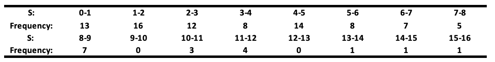
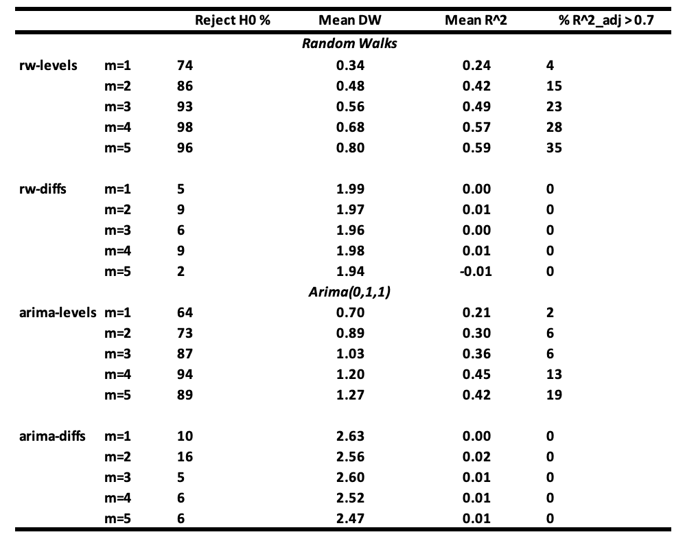
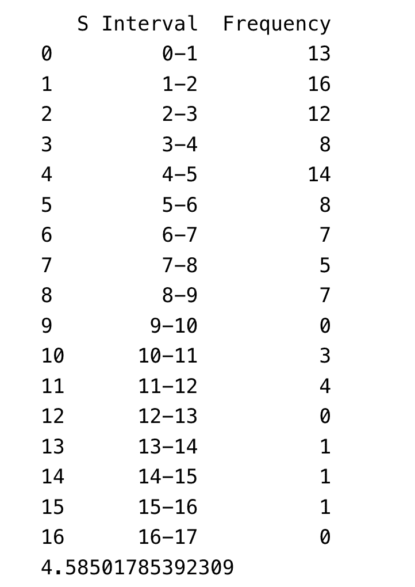
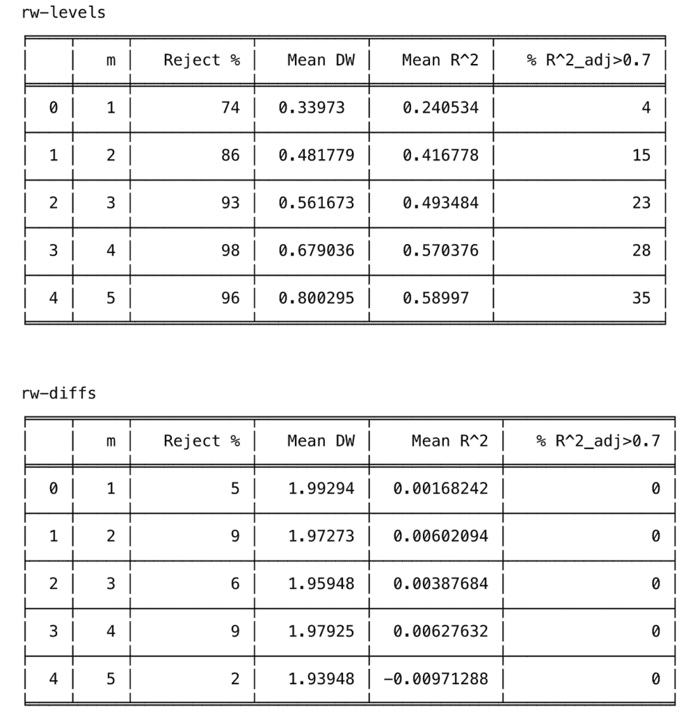
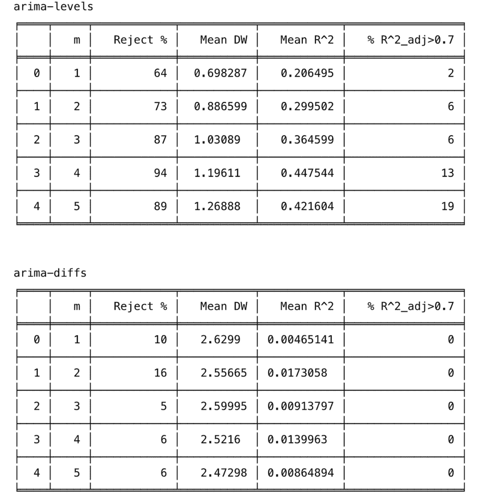

# 时间序列中的线性回归：伪回归的来源

> 原文：[`towardsdatascience.com/linear-regression-in-time-series-sources-of-spurious-regression/`](https://towardsdatascience.com/linear-regression-in-time-series-sources-of-spurious-regression/)

## 1. 简介

很明显，我们的大部分工作在未来都将由人工智能自动化完成。这是可能的，因为许多研究人员和专业人士正在努力使他们的工作在线可用。这些贡献不仅帮助我们理解基本概念，而且完善 AI 模型，最终腾出时间专注于其他活动。

然而，有一个概念即使在专家中仍然被误解。那就是时间序列分析中的**伪回归**。当回归模型表明变量之间存在强烈的关联，即使实际上并不存在时，就会出现这个问题。这通常在时间序列回归方程式中观察到，这些方程式**似乎具有很高的拟合度**——如高**R²（多重相关系数）**所示——但具有**极低的 Durbin-Watson 统计量(d)**，这表明误差项中存在强烈的自相关。

尤为令人惊讶的是，几乎所有计量经济学教科书都警告关于自相关误差的危险，然而这个问题在许多已发表的论文中仍然存在。格兰杰和纽博尔德([1974](https://jumbong.github.io/personal-website/Others/spurious_reg.html#ref-granger1974spurious))识别了几个例子。例如，他们发现了一些已发表的方程式，其**R² = 0.997**，Durbin-Watson 统计量(d)等于 0.53。最极端的例子是一个**R² = 0.999**且**d = 0.093**的方程式。

在经济学和金融学中，这个问题尤其严重，因为**许多关键变量表现出自相关或相邻值之间的序列相关**，尤其是如果采样间隔很小，如一周或一个月，如果不正确处理，会导致误导性的结论。例如，今天的 GDP 与上一季度的 GDP 高度相关。我们的文章提供了对格兰杰和纽博尔德([1974](https://jumbong.github.io/personal-website/Others/spurious_reg.html#ref-granger1974spurious))的结果的详细解释，以及复制他们文章中展示的关键结果的 Python 模拟（**见第七部分**）。

无论你是经济学家、数据科学家还是分析师，处理时间序列数据时，理解这个问题对于确保**你的模型产生有意义的成果**至关重要。

为了引导你了解这篇论文，下一节将介绍随机游走和 ARIMA(0,1,1)过程。在第三部分中，我们将解释格兰杰和纽博尔德([1974](https://jumbong.github.io/personal-website/Others/spurious_reg.html#ref-granger1974spurious))如何描述伪回归的出现，第四部分将通过例子进行说明。最后，我们将展示如何在处理时间序列数据时避免伪回归。

## 2. 随机游走和 ARIMA(0,1,1) 过程的简单介绍

### 2.1 随机游走

设 𝐗ₜ 为一个时间序列。我们说 𝐗ₜ 遵循随机游走，如果它的表示形式为：

𝐗ₜ = 𝐗ₜ₋₁ + 𝜖ₜ. (1)

其中 𝜖ₜ 是白噪声。它可以写成白噪声的和，这对于模拟来说是一个有用的形式。因为它的时间方差依赖于时间 t，所以它是一个非平稳时间序列。

2.2 **ARIMA(0,1,1) 过程**

ARIMA(0,1,1) 过程由以下公式给出：

𝐗ₜ = 𝐗ₜ₋₁ + 𝜖ₜ − 𝜃 𝜖ₜ₋₁. (2)

其中 𝜖ₜ 是白噪声。ARIMA(0,1,1) 过程是非平稳的。它可以写成独立随机游走和白噪声的和：

𝐗ₜ = 𝐗₀ **+ 随机游走 + 白噪声. (3)** 这种形式对于模拟是有用的。

那些非平稳序列通常被用作基准，以衡量其他模型的预测性能。

## 3. 随机游走可能导致无意义回归

首先，让我们回顾一下线性回归模型。线性回归模型由以下公式给出：

𝐘 = 𝐗𝛽 + 𝜖. (4)

其中 𝐘 是一个 T × 1 的因变量向量，𝛽 是一个 K × 1 的系数向量，𝐗 是一个 T × K 的自变量矩阵，包含一个单位列和 (K−1) 个列，每个 (K−1) 个自变量都有 T 个观测值，这些自变量是随机的，但与 T × 1 的误差向量 𝜖 独立。通常假设：

𝐄(𝜖) = 0, (5)

和

𝐄(𝜖𝜖′) = 𝜎²𝐈. (6)

其中 𝐈 是单位矩阵。

检验自变量对因变量解释贡献的测试是 F 测试。测试的零假设由以下公式给出：

𝐇₀: 𝛽₁ = 𝛽₂ = ⋯ = 𝛽ₖ₋₁ = 0, (7)

测试的统计量由以下公式给出：

𝐅 = (𝐑² / (𝐊−1)) / ((1−𝐑²) / (𝐓−𝐊)). (8)

其中 𝐑² 是确定系数。

如果我们想要构建测试的统计量，假设零假设是真实的，并尝试将形式 (方程 4) 的回归拟合到经济时间序列的水平。假设接下来这些序列是非平稳的或高度自相关的。在这种情况下，测试程序是无效的，因为 (方程 8) 中的 𝐅 在零假设 (方程 7) 下不服从 F 分布。事实上，在零假设下，(方程 4) 的误差或残差由以下公式给出：

𝜖ₜ = 𝐘ₜ − 𝐗𝛽₀ ; t = 1, 2, …, T. (9)

它将具有与原始序列 𝐘 相同的自相关结构。

在某些情况下，可能会出现分布问题的想法：

𝐘ₜ = 𝛽₀ + 𝐗ₜ𝛽₁ + 𝜖ₜ. (10)

其中 𝐘ₜ 和 𝐗ₜ 遵循独立的一阶自回归过程：

𝐘ₜ = 𝜌 𝐘ₜ₋₁ + 𝜂ₜ，和 𝐗ₜ = 𝜌* 𝐗ₜ₋₁ + 𝜈ₜ. (11)

其中 𝜂ₜ 和 𝜈ₜ 是白噪声。

我们知道在这种情况下，𝐑² 是 𝐘ₜ 和 𝐗ₜ 之间相关性的平方。他们使用了 Knowles 文章中的 Kendall 结果 ([1954](https://jumbong.github.io/personal-website/Others/spurious_reg.html#ref-knowles1954exercises))，该结果表达了 𝐑 的方差：

𝐕𝐚𝐫(𝐑) = (1/T)* (1 + 𝜌𝜌*) / (1 − 𝜌𝜌*). (12)

由于 𝐑 被限制在 -1 和 1 之间，如果其方差大于 1/3，𝐑 的分布不能在 0 处有模态。这表明 𝜌𝜌* > (T−1) / (T+1)。

因此，例如，如果 T = 20 且 𝜌 = 𝜌*，当 𝜌 > 0.86 时，将获得一个在 0 处不是单峰的分布，如果 𝜌 = 0.9，𝐕𝐚𝐫(𝐑) = 0.47。因此，𝐄(𝐑²) 将接近 0.47。

已经证明，当 𝜌 接近 1 时，𝐑² 可以非常高，表明 𝐘ₜ 和 𝐗ₜ 之间存在强烈的关系。然而，在现实中，这两个序列是完全独立的。当 𝜌 接近 1 时，两个序列都像随机游走或近似随机游走。除此之外，两个序列都是高度自相关的，这导致回归的残差也高度自相关。因此，**Durbin-Watson 统计量** 𝐝 将非常低。

这就是为什么在这个背景下，高 𝐑² 永远不能被视为两个序列之间真实关系的证据。

为了探索在回归两个独立随机游走时获得伪回归的可能性，下一节将进行 Granger 和 Newbold 提出的模拟系列（[1974](https://jumbong.github.io/personal-website/Others/spurious_reg.html#ref-granger1974spurious)）。

## 4. 使用 Python 的模拟结果。

在本节中，我们将通过模拟展示，使用具有独立随机游走偏差的回归模型会偏误系数的估计，以及系数的假设检验无效。将产生模拟结果的相关 Python 代码将在第六部分中展示。

由 Granger 和 Newbold 提出的回归方程（[1974](https://jumbong.github.io/personal-website/Others/spurious_reg.html#ref-granger1974spurious)）给出：

𝐘ₜ = 𝛽₀ + 𝐗ₜ𝛽₁ + 𝜖ₜ

在 𝐘ₜ 和 𝐗ₜ 作为长度为 50 的独立随机游走生成的情况下，表示测试 𝛽₁ 显著性的统计量 𝐒 = |𝛽̂₁| / √(𝐒𝐄̂(𝛽̂₁))，对于 100 次模拟的结果将在下表中报告。



**表 1：回归两个独立的随机游走**

当 𝐒 > 2 时，无关系零假设（𝛽 = 0）在 5% 的水平上被拒绝。此表显示，在所有情况下，大约四分之一（71 次）的零假设（𝛽 = 0）被错误地拒绝。这是尴尬的，因为两个变量是独立的随机游走，意味着实际上没有关系。让我们分析一下为什么会发生这种情况。

如果 𝛽̂₁ / 𝐒𝐄̂ 符合 𝐍(0,1)，𝐒 的期望值，其绝对值，应该是 √2 / π ≈ 0.8 (√2/π 是标准正态分布绝对值均值)。然而，模拟结果显示平均值为 4.59，这意味着估计的 𝐒 被低估了 5.7 倍。

4.59 / 0.8 = 5.7

在经典统计学中，我们通常使用大约 2 的 t 检验阈值来检查系数的显著性。然而，这些结果表明，在这种情况下，你需要使用 11.4 的阈值来正确地测试显著性：

2 × (4.59 / 0.8) = 11.4

解释：我们刚刚表明，包括不属于模型中的变量——特别是随机游走——会导致系数的显著性测试完全无效。

为了使他们的模拟更加清晰，Granger 和 Newbold([1974](https://jumbong.github.io/personal-website/Others/spurious_reg.html#ref-granger1974spurious))使用遵循随机游走或 ARIMA(0,1,1)过程的变量进行了一系列回归。

这是他们设置模拟的方式：

他们将因变量序列𝐘ₜ对 m 个自变量序列𝐗ⱼ,ₜ（其中 j = 1, 2, …, m）进行回归，m 从 1 变化到 5。因变量序列𝐘ₜ和自变量序列𝐗ⱼ,ₜ遵循相同类型的进程，并且他们测试了四种情况：

+   **案例 1（水平）**：𝐘ₜ和𝐗ⱼ,ₜ遵循随机游走。

+   **案例 2（差分）**：他们使用随机游走的第一差分，这些差分是平稳的。

+   **案例 3（水平）**：𝐘ₜ和𝐗ⱼ,ₜ遵循 ARIMA(0,1,1)。

+   **案例 4（差分）**：他们使用先前 ARIMA(0,1,1)过程的第一差分，这些差分是平稳的。

每个序列有 50 个观测值，并且他们对每个案例进行了 100 次模拟。

所有误差项都服从𝐍(0,1)分布，ARIMA(0,1,1)序列是通过随机游走和独立白噪声的和推导出来的。基于 100 次重复和长度为 50 的序列的模拟结果总结在下表中。



**表 2：对 m 个独立的“解释”序列的序列回归。**

结果解释：

+   可以看到，当使用随机游走序列（rw-levels）进行回归时，当 m ≥ 3 时，不拒绝𝐘ₜ和𝐗ⱼ,ₜ之间无关系零假设的概率变得非常小。𝐑²和平均 Durbin-Watson 值增加。当使用 ARIMA(0,1,1)序列（arima-levels）进行回归时，也得到类似的结果。

+   当使用白噪声序列（rw-diffs）时，经典回归分析是有效的，因为误差序列将是白噪声，最小二乘法将是有效的。

+   然而，当使用 ARIMA(0,1,1)序列的差分（arima-diffs）或一阶移动平均序列 MA(1)过程进行回归时，平均而言，零假设被拒绝：

(10 + 16 + 5 + 6 + 6) / 5 = 8.6

这大于 5%的时间。

如果你的变量是随机游走或接近随机游走，并且在回归中包含了不必要的变量，你通常会得到错误的结论。高的𝐑²和低的 Durbin-Watson 值并不确认真正的相关性，反而表明可能是一个虚假的相关性。

## 5. 如何避免时间序列中的虚假回归

构思一个避免虚假回归的完整列表确实很困难。然而，有一些良好的实践可以遵循，以尽可能**最小化风险**。

如果对时间序列数据进行回归分析并发现残差高度自相关，那么在解释方程系数时将存在严重问题。为了检查残差中的自相关性，可以使用杜宾-沃森检验或波尔特曼检验。

根据上述研究，我们可以得出结论，如果使用经济变量进行的回归分析产生了高度自相关的残差，即低杜宾-沃森统计量，那么分析的结果很可能是虚假的，无论观察到的决定系数 R²的值如何。

在这种情况下，了解误指定来源非常重要。根据文献，误指定通常分为三类：(i)省略一个相关变量，(ii)包含一个不相关变量，或(iii)误差的自相关性。大多数情况下，误指定来自这三个来源的混合。

为了避免时间序列中的虚假回归，可以提出以下建议：

+   第一项建议是选择可能解释因变量的正确宏观经济变量。这可以通过查阅文献或咨询该领域的专家来完成。

+   第二项建议是通过取一阶差分来使序列平稳化。在大多数情况下，宏观经济变量的一阶差分是平稳的，并且仍然容易解释。对于宏观经济数据，强烈建议对序列进行一次微分，以减少残差的自相关性，尤其是在样本量较小的情况下。确实有时在这些变量中观察到强烈的序列相关性。简单的计算表明，一阶差分几乎总是比原始序列具有更小的序列相关性。

+   第三项建议是使用 Box-Jenkins 方法单独对每个宏观经济变量进行建模，然后通过将每个单独模型的残差联系起来来寻找序列之间的关系。这里的想法是 Box-Jenkins 过程提取了序列的解释部分，留下了残差，这些残差只包含序列自身过去行为无法解释的部分。这使得检查这些未解释的部分（残差）是否跨变量相关变得更容易。

## 6. 结论

许多计量经济学教科书都警告回归模型中的指定错误，但这个问题仍然出现在许多已发表的论文中。格兰杰和纽博尔德([1974](https://jumbong.github.io/personal-website/Others/spurious_reg.html#ref-granger1974spurious))强调了虚假回归的风险，在这种回归中，你会得到一个很高的相关系数，同时伴随着非常低的杜宾-沃森统计量。

使用 Python 模拟，我们展示了这些伪回归的主要原因，特别是包括不属于模型且高度自相关的变量。我们还演示了这些问题如何完全扭曲系数的假设检验。

希望这篇帖子能帮助减少未来计量经济学分析中伪回归的风险。

## 7\. 附录：模拟的 Python 代码。

#####################################################表 1 的模拟代码 #####################################################

```py
import numpy as np
import pandas as pd
import statsmodels.api as sm
import matplotlib.pyplot as plt

np.random.seed(123)
M = 100 
n = 50
S = np.zeros(M)
for i in range(M):
#---------------------------------------------------------------
# Generate the data
#---------------------------------------------------------------
    espilon_y = np.random.normal(0, 1, n)
    espilon_x = np.random.normal(0, 1, n)

    Y = np.cumsum(espilon_y)
    X = np.cumsum(espilon_x)
#---------------------------------------------------------------
# Fit the model
#---------------------------------------------------------------
    X = sm.add_constant(X)
    model = sm.OLS(Y, X).fit()
#---------------------------------------------------------------
# Compute the statistic
#------------------------------------------------------
    S[i] = np.abs(model.params[1])/model.bse[1]

#------------------------------------------------------ 
#              Maximum value of S
#------------------------------------------------------
S_max = int(np.ceil(max(S)))

#------------------------------------------------------ 
#                Create bins
#------------------------------------------------------
bins = np.arange(0, S_max + 2, 1)  

#------------------------------------------------------
#    Compute the histogram
#------------------------------------------------------
frequency, bin_edges = np.histogram(S, bins=bins)

#------------------------------------------------------
#    Create a dataframe
#------------------------------------------------------

df = pd.DataFrame({
    "S Interval": [f"{int(bin_edges[i])}-{int(bin_edges[i+1])}" for i in range(len(bin_edges)-1)],
    "Frequency": frequency
})
print(df)
print(np.mean(S))
```



#####################################################表 2 的模拟代码 #####################################################

```py
import numpy as np
import pandas as pd
import statsmodels.api as sm
from statsmodels.stats.stattools import durbin_watson
from tabulate import tabulate

np.random.seed(1)  # Pour rendre les résultats reproductibles

#------------------------------------------------------
# Definition of functions
#------------------------------------------------------

def generate_random_walk(T):
    """
    Génère une série de longueur T suivant un random walk :
        Y_t = Y_{t-1} + e_t,
    où e_t ~ N(0,1).
    """
    e = np.random.normal(0, 1, size=T)
    return np.cumsum(e)

def generate_arima_0_1_1(T):
    """
    Génère un ARIMA(0,1,1) selon la méthode de Granger & Newbold :
    la série est obtenue en additionnant une marche aléatoire et un bruit blanc indépendant.
    """
    rw = generate_random_walk(T)
    wn = np.random.normal(0, 1, size=T)
    return rw + wn

def difference(series):
    """
    Calcule la différence première d'une série unidimensionnelle.
    Retourne une série de longueur T-1.
    """
    return np.diff(series)

#------------------------------------------------------
# Paramètres
#------------------------------------------------------

T = 50           # longueur de chaque série
n_sims = 100     # nombre de simulations Monte Carlo
alpha = 0.05     # seuil de significativité

#------------------------------------------------------
# Definition of function for simulation
#------------------------------------------------------

def run_simulation_case(case_name, m_values=[1,2,3,4,5]):
    """
    case_name : un identifiant pour le type de génération :
        - 'rw-levels' : random walk (levels)
        - 'rw-diffs'  : differences of RW (white noise)
        - 'arima-levels' : ARIMA(0,1,1) en niveaux
        - 'arima-diffs'  : différences d'un ARIMA(0,1,1) => MA(1)

    m_values : liste du nombre de régresseurs.

    Retourne un DataFrame avec pour chaque m :
        - % de rejets de H0
        - Durbin-Watson moyen
        - R²_adj moyen
        - % de R² > 0.1
    """
    results = []

    for m in m_values:
        count_reject = 0
        dw_list = []
        r2_adjusted_list = []

        for _ in range(n_sims):
#--------------------------------------
# 1) Generation of independents de Y_t and X_{j,t}.
#----------------------------------------
            if case_name == 'rw-levels':
                Y = generate_random_walk(T)
                Xs = [generate_random_walk(T) for __ in range(m)]

            elif case_name == 'rw-diffs':
                # Y et X sont les différences d'un RW, i.e. ~ white noise
                Y_rw = generate_random_walk(T)
                Y = difference(Y_rw)
                Xs = []
                for __ in range(m):
                    X_rw = generate_random_walk(T)
                    Xs.append(difference(X_rw))
                # NB : maintenant Y et Xs ont longueur T-1
                # => ajuster T_effectif = T-1
                # => on prendra T_effectif points pour la régression

            elif case_name == 'arima-levels':
                Y = generate_arima_0_1_1(T)
                Xs = [generate_arima_0_1_1(T) for __ in range(m)]

            elif case_name == 'arima-diffs':
                # Différences d'un ARIMA(0,1,1) => MA(1)
                Y_arima = generate_arima_0_1_1(T)
                Y = difference(Y_arima)
                Xs = []
                for __ in range(m):
                    X_arima = generate_arima_0_1_1(T)
                    Xs.append(difference(X_arima))

            # 2) Prépare les données pour la régression
            #    Selon le cas, la longueur est T ou T-1
            if case_name in ['rw-levels','arima-levels']:
                Y_reg = Y
                X_reg = np.column_stack(Xs) if m>0 else np.array([])
            else:
                # dans les cas de différences, la longueur est T-1
                Y_reg = Y
                X_reg = np.column_stack(Xs) if m>0 else np.array([])

            # 3) Régression OLS
            X_with_const = sm.add_constant(X_reg)  # Ajout de l'ordonnée à l'origine
            model = sm.OLS(Y_reg, X_with_const).fit()

            # 4) Test global F : H0 : tous les beta_j = 0
            #    On regarde si p-value < alpha
            if model.f_pvalue is not None and model.f_pvalue < alpha:
                count_reject += 1

            # 5) R², Durbin-Watson
            r2_adjusted_list.append(model.rsquared_adj)

            dw_list.append(durbin_watson(model.resid))

        # Statistiques sur n_sims répétitions
        reject_percent = 100 * count_reject / n_sims
        dw_mean = np.mean(dw_list)
        r2_mean = np.mean(r2_adjusted_list)
        r2_above_0_7_percent = 100 * np.mean(np.array(r2_adjusted_list) > 0.7)

        results.append({
            'm': m,
            'Reject %': reject_percent,
            'Mean DW': dw_mean,
            'Mean R²': r2_mean,
            '% R²_adj>0.7': r2_above_0_7_percent
        })

    return pd.DataFrame(results)

#------------------------------------------------------
# Application of the simulation
#------------------------------------------------------       

cases = ['rw-levels', 'rw-diffs', 'arima-levels', 'arima-diffs']
all_results = {}

for c in cases:
    df_res = run_simulation_case(c, m_values=[1,2,3,4,5])
    all_results[c] = df_res

#------------------------------------------------------
# Store data in table
#------------------------------------------------------

for case, df_res in all_results.items():
    print(f"\n\n{case}")
    print(tabulate(df_res, headers='keys', tablefmt='fancy_grid'))
```



## 参考文献

+   Granger, Clive WJ, and Paul Newbold. 1974\. “计量经济学中的伪回归.” *计量经济学杂志* 2 (2): 111–20。

+   Knowles, EAG. 1954\. “理论统计学的练习.” 奥克森大学出版社。
