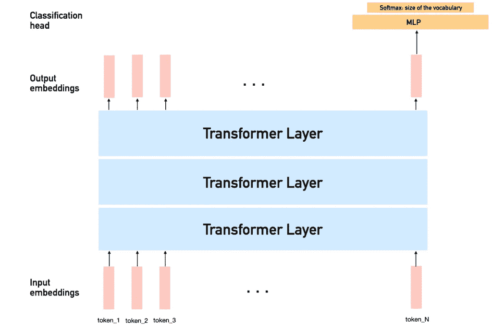
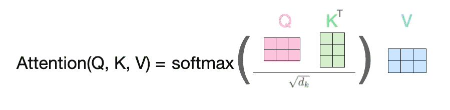
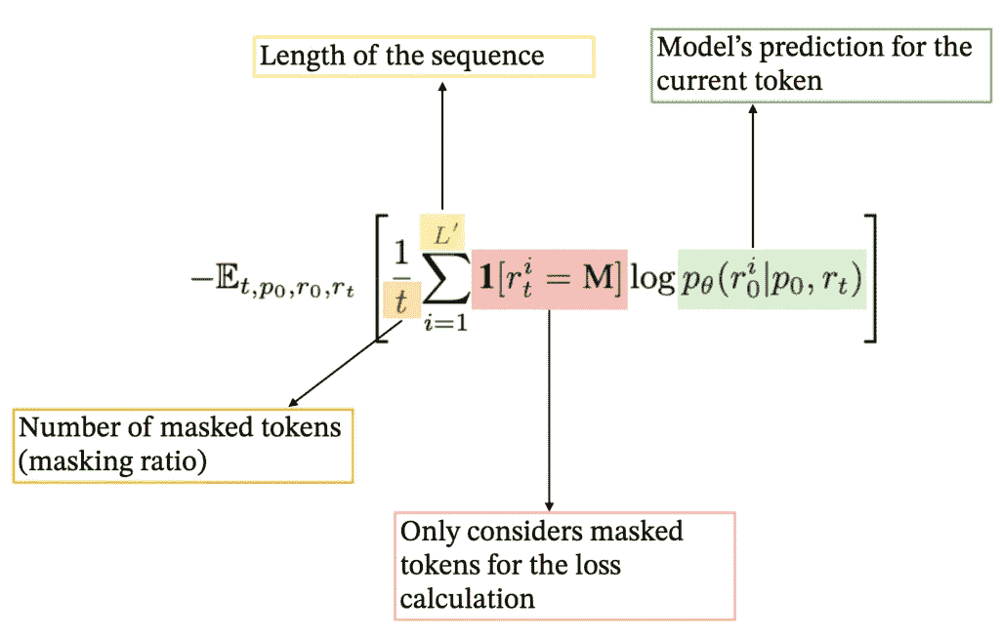
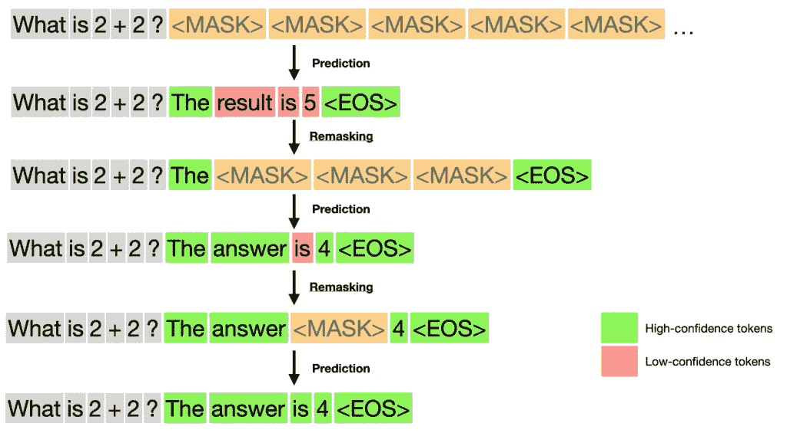
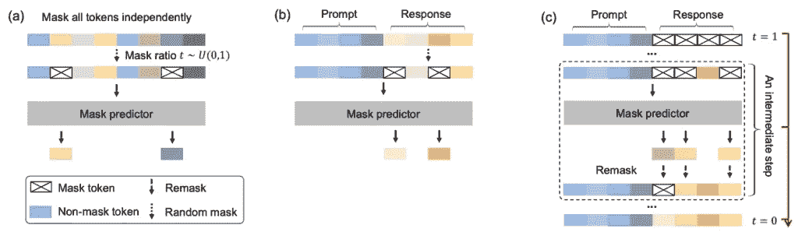
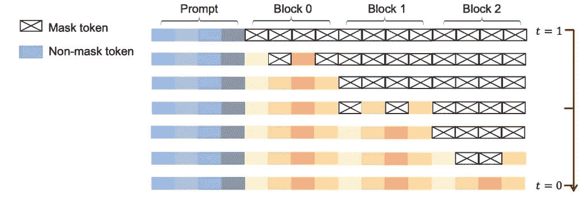
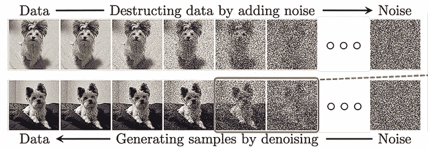
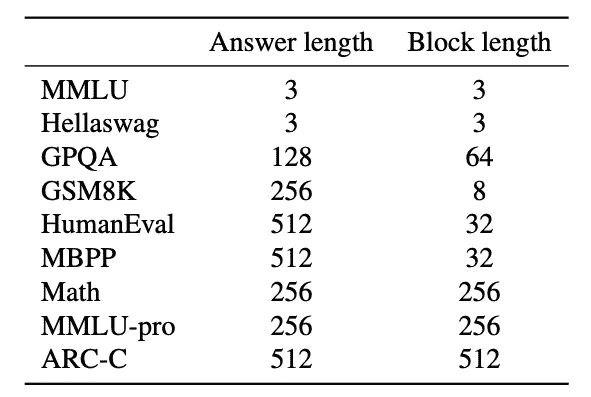
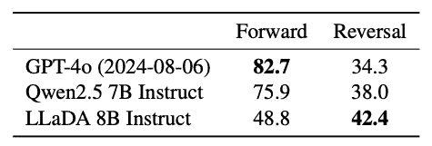

# LLaDA：可能重新定义语言生成的扩散模型

> 原文：[`towardsdatascience.com/llada-the-diffusion-model-that-could-redefine-language-generation/`](https://towardsdatascience.com/llada-the-diffusion-model-that-could-redefine-language-generation/)

## 简介

如果语言模型能更像是人类思考会怎样？它们不是一次写一个词，而是先勾勒出他们的想法，然后逐渐完善它们呢？

这正是大型语言扩散模型（LLaDA）引入的：一种不同于当前在大型语言模型（LLMs）中使用的文本生成方法。与传统的自回归模型（ARMs）不同，后者按顺序、从左到右预测文本，**LLaDA 利用类似扩散的过程来生成文本**。它不是逐个生成标记，而是**逐步细化掩码文本，直到形成一个连贯的响应**。

在这篇文章中，我们将深入探讨 LLaDA 的工作原理、其重要性以及它如何塑造下一代大型语言模型（LLMs）。

希望您喜欢这篇文章！

## LLMs 的当前状态

要欣赏 LLaDA 所代表的创新，我们首先需要了解当前大型语言模型（LLMs）的工作方式。现代 LLMs 遵循一个两步的训练过程，已成为行业标准：

1.  **预训练**：模型通过自监督学习在大量文本数据集中预测下一个标记，从而学习通用的语言模式和知识。

1.  **监督微调（SFT）**：模型在精心挑选的数据上进行微调，以提高其遵循指令和生成有用输出的能力。

*请注意，当前 LLMs 通常也使用 RLHF 来进一步微调模型的权重，但 LLaDA 不使用这一步骤，因此在此处省略。*

这些模型主要基于 Transformer 架构，通过预测下一个标记来逐个生成文本。

文本生成的简化 Transformer 架构（图片由作者提供）

这里有一个简化的示意图，说明数据如何通过此类模型。**每个标记被嵌入到一个向量中，并通过连续的 Transformer 层进行转换**。在当前的 LLMs（LLaMA、ChatGPT、DeepSeek 等）中，仅使用分类头对最后一个标记嵌入进行预测，以预测序列中的下一个标记。

这得益于**掩码自注意力**的概念：每个标记都会关注其之前的所有标记。我们稍后会看到 LLaDA 如何在其注意力层中去除掩码。

注意力过程：输入嵌入通过查询（Query）、键（Key）和值（Value）矩阵相乘以生成新的嵌入（图片由作者提供，灵感来源于[3]）

*如果你想了解更多关于 Transformers 的信息，请查看我的文章[这里](https://towardsdatascience.com/transformers-how-do-they-transform-your-data-72d69e383e0d/#:~:text=We%20pass%20our%20data%20through,several%20(num_layers)%20encoder%20layers).)*。

虽然这种方法已经导致了令人印象深刻的结果，但它也伴随着重大的局限性，其中一些局限性促使 LLaDA 的开发。

## 当前 LLMs 的局限性

当前 LLMs 面临几个关键挑战：

### 计算效率低下

想象一下，你需要写一部小说，但你只能一次想一个词，并且对于每个词，你都需要重新阅读你之前写过的所有内容。这正是当前大型语言模型（LLMs）运作的方式——它们一次预测一个标记，需要为每个新标记对之前的序列进行完整处理。即使有像 KV 缓存这样的优化技术，这个过程也是**相当计算密集且耗时的**。

### 有限的双向推理

传统的自回归模型（ARMs）就像那些永远无法向前看或修改他们已经写过的内容的作家。**它们只能根据过去的内容预测未来的标记，这限制了它们推理文本不同部分之间关系的能力**。作为人类，我们在写下之前通常对想要表达的内容有一个大致的想法，而当前的 LLMs 在某种程度上缺乏这种能力。

### 数据量

现有的模型需要**大量的训练数据**才能达到良好的性能，这使得它们在开发上资源密集，并可能在数据可用性有限的专业领域限制其适用性。

## 什么是 LLaDA

LLaDA 通过用**“基于扩散”**的过程（我们稍后会深入探讨为什么称之为“扩散”）取代传统的自回归过程，引入了一种对语言生成根本不同的方法。

让我们一步一步地了解它是如何工作的，从预训练开始。

### LLaDA 预训练

记住，在预训练阶段我们不需要任何“标记”的数据。目标是向模型输入大量原始文本数据。对于每个文本序列，我们执行以下操作：

1.  我们设定一个最大长度（类似于 ARMs）。通常，这可能是 4096 个标记。1%的时间，序列的长度会在 1 到 4096 之间随机采样，并填充，以便模型也能接触到较短的序列。

1.  我们随机选择一个“掩码率”。例如，可以选择 40%。

1.  我们以 0.4 的概率对每个标记进行掩码。那么“掩码”究竟是什么意思呢？好吧，我们只是用一个特殊的标记替换了标记：**<MASK>**。就像任何其他标记一样，这个标记与一个特定的索引和嵌入向量相关联，模型可以在训练过程中处理和解释这个向量。

1.  我们然后将整个序列输入到基于 transformer 的模型中。这个过程将所有输入嵌入向量转换为新的嵌入。我们对每个掩码标记**应用分类头**以获得每个标记的预测。从数学上讲，我们的损失函数平均了序列中所有掩码标记的交叉熵损失，如下所示：

LLaDA 使用的损失函数（作者提供）

5. 然后...我们重复这个程序数十亿或数万亿个文本序列。

> **注意**，与 ARMs 不同，LLaDA 可以完全利用文本中的双向依赖关系：它不再需要在注意力层中进行掩码。然而，这可能会增加计算成本。

希望你能看到训练阶段本身（数据流入模型的过程）与任何其他 LLMs 非常相似。**我们只是随机预测掩码的标记，而不是预测下一个标记**。

### LLaDA SFT

对于**自回归模型**，SFT 与预训练非常相似，只是我们拥有**(提示，响应**)对，并希望在提供提示作为输入时生成响应。

这正是**LLaDA 的相同概念**！模仿预训练过程：我们只是传递提示和响应，只从响应中随机掩码标记，并将整个序列输入到模型中，该模型**将预测响应中的缺失标记**。

### 推理中的创新

创新是 LLaDA 变得更有趣的地方，真正利用了“扩散”范式。

到目前为止，我们总是随机掩码一些文本作为输入，并要求模型预测这些标记。但在推理过程中，**我们只能访问提示**，我们需要生成整个响应。你可能认为（这并不错），模型在 SFT 期间看到了掩码率非常高的例子（可能为 1），并且它必须以某种方式学习如何**从提示中生成完整的响应**。

然而，在推理过程中一次性生成完整的响应很可能会产生非常差的结果，因为模型缺乏信息。相反，我们需要一种方法来**逐步细化预测**，这正是“重新掩码”**的关键思想**。

这是它的工作方式，在文本生成过程的每个步骤中：

+   将当前输入输入到模型中（这是提示，后跟**<MASK>**标记）

+   模型为每个输入标记生成一个嵌入。我们只对**<MASK>**标记进行预测。并且这是重要的一步：**我们重新掩码其中的一部分**。特别是：我们只保留“最佳”标记，即**预测最好**的标记，具有最高的置信度。

+   我们可以使用这个**部分未掩码的序列**作为下一阶段的输入，并重复直到所有标记都未掩码。

你可以看到，有趣的是，与 ARMs 相比，**我们对生成过程有更多的控制**：我们可以选择重新掩码 0 个标记（只有一个生成步骤），或者我们可以决定每次只保留最好的标记（如响应中的标记数量）。显然，**这里在预测质量和推理时间之间存在权衡**。

让我们用一个简单的例子来说明这一点（在这种情况下，我选择在每一步保留最好的 2 个标记）

LLaDA 生成过程示例（图片由作者提供）

注意，在实践中，重新掩码步骤将如下工作。我们不会重新掩码固定数量的标记，而是会随着时间的推移重新掩码 s/t 比例的标记，从 t=1 下降到 0，其中 s 在[0, t]范围内。特别是，这意味着随着生成步骤的增加，我们将重新掩码越来越少标记。

**示例**：如果我们想进行 N 个采样步骤（因此从 t=1 到 t=1/N 的 N 个离散步骤，步长为 1/N），取 s = (t-1/N)是一个不错的选择，并确保在过程结束时 s=0。

下面的图像总结了上述 3 个步骤。“掩码预测器”简单地表示 LLM（LLaDA），预测被掩码的标记。

使用 LLaDA 进行预训练（a.）、SFT（b.）和推理（c.）（来源：[1]）

## 可以将自回归和扩散结合吗？

LLaDA 中发展出的另一个巧妙想法是**将扩散与传统自回归生成结合，以利用两者的最佳之处**！这被称为**半自回归扩散**。

+   将生成过程分为块（例如，每个块 32 个标记）。

+   目标是**一次生成一个块**（就像我们在 ARMs 中一次生成一个标记一样）。

+   **对于每个块，我们通过逐步揭示标记来应用扩散逻辑**，以揭示整个块。然后继续预测下一个块。

半自回归过程（来源：[1]）

这是一个混合方法：我们可能失去了模型的一些“向后”生成和并行化能力，但**我们更好地“引导”模型**向最终输出。

我认为这是一个非常有趣的想法，因为它在很大程度上取决于一个超参数（块的数目），这可以进行调节。我想不同的任务可能更多地受益于向后生成过程，而其他任务可能更多地受益于从左到右的更“引导”的生成（更多内容见最后一段）。

## 为什么叫“扩散”？

我认为简要解释这个术语的来源很重要。它反映了与**图像扩散模型（如 Dall-E）**的相似性，这些模型在图像生成任务中非常受欢迎。

在图像扩散中，模型首先向图像添加噪声，直到它无法辨认，然后逐步学习重建它。LLaDA 通过**掩码标记而不是添加噪声**来将这个想法应用于文本，然后逐步**解掩码**以生成连贯的语言。在图像生成的上下文中，掩码步骤通常被称为“噪声调度”，而反向（重新掩码）是“去噪”步骤。

扩散模型是如何工作的？（来源：[2]）

你也可以把 LLaDA 看作是一种**离散**（非连续）的扩散模型：我们不对标记添加噪声，而是通过掩码“停用”一些标记，模型学习如何解掩码其中的一部分。

## 结果

让我们来看看 LLaDA 的一些有趣的结果。

*你可以在论文中找到所有结果。我选择关注这里我认为最有趣的部分。*

+   **训练效率**：LLaDA 在相同参数数量的情况下表现出与 ARMs 相似的性能，但在训练过程中使用了**远少于 ARMs**的标记（并且没有 RLHF！）例如，8B 版本使用了大约 2.3T 个标记，而 LLaMa3 使用了 15T。

+   **为不同任务使用不同块和答案长度**：例如，对于数学数据集，块长度特别大，模型在这个领域表现出强大的性能。这可能表明数学推理可能更多地受益于**基于扩散和逆向过程**。

来源：[1]

+   有趣的是，LLaDA 在“反向诗歌完成任务”上表现更好。这个任务要求模型**从最后一行开始，逆向完成一首诗**。正如预期的那样，由于它们严格的从左到右的生成过程，ARMs 遇到了困难。

来源：[1]

> LLaDA 不仅仅是一个 ARMs 的实验性替代品：它在效率、结构化推理和双向文本生成方面显示出真正的优势。

## 结论

我认为 LLaDA 是语言生成的一个有前景的方法。它能够在保持全局连贯性的同时并行生成多个标记，这肯定能导致**更高效的训练**、**更好的推理**和**改进的上下文理解**，同时使用更少的计算资源。

除了效率之外，我认为 LLaDA 还带来了很多**灵活性**。通过调整生成的块数量和生成步骤数量等参数，它可以**更好地适应不同的任务和约束**，使其成为各种语言建模需求的通用工具，并允许**更多的人为控制**。扩散模型也能够在主动 AI 和代理系统中发挥重要作用，因为它能够进行更全面的推理。

随着基于扩散的语言模型的研究不断深入，LLaDA 可能成为迈向**更自然和高效的语言模型**的有用步骤。虽然还处于早期阶段，但我相信这种从顺序生成到并行生成的转变是 AI 发展的一个有趣方向。

感谢阅读！

* * *

欢迎查看我的先前文章：

> [从 TRPO 到 GRPO 训练大型语言模型](https://towardsdatascience.com/training-large-language-models-from-trpo-to-grpo/)
> 
> [“维度诅咒”背后的数学](https://towardsdatascience.com/the-math-behind-the-curse-of-dimensionality-cf8780307d74/)

* * *

+   欢迎在[LinkedIn](https://www.linkedin.com/in/maxime-wolf/)上与我联系

+   在[GitHub](https://github.com/maxime7770)上关注我，获取更多内容

+   访问我的网站：[maximewolf.com](http://maximewolf.com/)

* * *

## 参考文献：

+   [1] 刘，C.，吴，J.，徐，Y.，张，Y.，朱，X.，& 宋，D. (2024). **大型语言扩散模型**. *arXiv 预印本 arXiv:2502.09992*. [`arxiv.org/pdf/2502.09992`](https://arxiv.org/pdf/2502.09992)

+   [2] 杨，L.，等. “扩散模型：方法与应用的综合调查.” ACM 计算调查 56.4 (2023): 1–39. [`dl.acm.org/doi/10.1145/3626235`](https://dl.acm.org/doi/10.1145/3626235)

+   [3] 阿尔马马尔，J. (2018, 6 月 27 日). **图解 Transformer**. *Jay Alammar 的博客*. [`jalammar.github.io/illustrated-transformer/`](https://jalammar.github.io/illustrated-transformer/)
