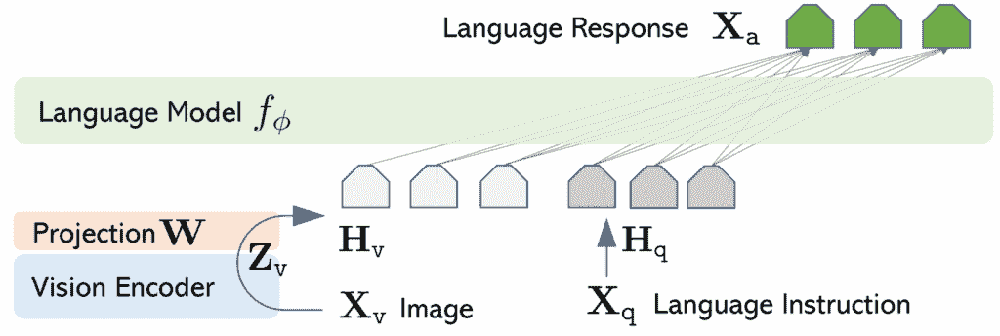
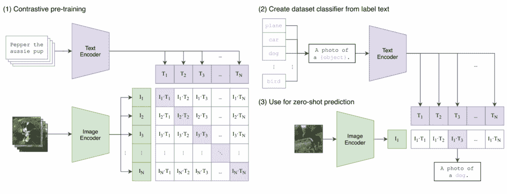

# LLaVA on a Budget: Multimodal AI with Limited Resources

> 原文：[`towardsdatascience.com/llava-on-a-budget-multimodal-ai-with-limited-resources/`](https://towardsdatascience.com/llava-on-a-budget-multimodal-ai-with-limited-resources/)

## <mdspan datatext="el1750099237634" class="mdspan-comment">简介</mdspan>

在过去几年里，我主要与大型语言模型一起工作，进行训练、微调、提示等等，因为这在市场和用户中需求很高。但我相信，主要在文本上工作的 LLM 只是 GenAI 的开始。在某个时刻，每个人都会想要 **物理 AI**，其中模型可以看、听、感受并以更接地气、更人性化的方式推理。

因此，让我们开始多模态处理。在这个笔记本中，我介绍了 LLaVA，这是一个能够解释图像和文本以生成多模态响应的架构。

在这个教程中，我们将使用一个更轻量级的组件，适合在 Google Colab 等免费层环境中运行笔记本。

我们将要使用的组件是：

1️⃣ **CLIP-ViT B/32** 作为图像编码器

2️⃣ **TinyLlama-1.1B** 作为语言模型

3️⃣ 一个 **2 层 MLP 适配器** 来连接两者



来自论文 [Visual Instruction Tuning](https://www.google.com/url?q=https%3A%2F%2Farxiv.org%2Fpdf%2F2304.08485) (NeurIPS 2023)

## 设置

在我们深入代码之前，让我们设置我们的环境。

让我们先安装数据集库。

```py
!pip install -U datasets
```

我们现在需要从 Hugging Face 和 PyTorch 导入所需的包。这些导入提供了预训练模型和多模态处理的实用工具。

```py
import json
from pathlib import Path

import requests
import safetensors
import torch
from datasets import load_dataset
from huggingface_hub import hf_hub_download
from PIL import Image
from transformers import (
    AutoConfig,
    AutoTokenizer,
    LlamaTokenizer,
    LlavaConfig,
    LlavaForConditionalGeneration,
    LlavaProcessor,
    Seq2SeqTrainer,
    Seq2SeqTrainingArguments,
)
from transformers.models.clip.modeling_clip import CLIPVisionModel
from transformers.models.clip.image_processing_clip import CLIPImageProcessor
```

## 下载预训练模型组件

我们的 LLaVA 模型将由以下部分组成：

+   一个预训练的 **CLIP** 编码器 [openai/clip-vit-base-patch32](https://huggingface.co/openai/clip-vit-base-patch32)



图片来源：[`arxiv.org/pdf/2103.00020`](https://arxiv.org/pdf/2103.00020)

+   一个预训练的 **Tiny LLaMA** 解码器 [TinyLlama/TinyLlama-1.1B-Chat-v1.0](https://huggingface.co/TinyLlama/TinyLlama-1.1B-Chat-v1.0)

+   两个之间的 2 层 MLP 投影器

`hf_hub_download` 是我们正在探索的一个 hub，用于检索预训练权重：

```py
vision_backbone_name = "openai/clip-vit-base-patch32"
text_backbone_name = "TinyLlama/TinyLlama-1.1B-Chat-v1.0"
```

```py
_ = hf_hub_download(
    vision_backbone_name, filename="pytorch_model.bin", local_dir="/content"
)
_ = hf_hub_download(
    text_backbone_name, filename="model.safetensors", local_dir="/content"
)
```

## 模型

### 实例化一个新的 LLaVA 模型

现在让我们实例化一个新的 LlaVA 模型。如上所述，一个 LlaVA 模型由两部分组成，一个视觉编码器和一个文本解码器，我们刚刚已经下载了。

```py
vision_config = AutoConfig.from_pretrained(vision_backbone_name).vision_config
text_config = AutoConfig.from_pretrained(text_backbone_name)
```

我们在 LlaVA 配置中指定了骨干模型。然后我们使用 `LlavaForConditionalGeneration(llava_config)` 实例化实际的模型。

```py
llava_config = LlavaConfig(vision_config=vision_config, text_config=text_config)
```

```py
model = LlavaForConditionalGeneration(llava_config).cuda()
model
```

### 执行一些手术操作


*图片来源：[`unsplash.com/photos/doctor-having-operation-E285pJbC4uE`](https://unsplash.com/photos/doctor-having-operation-E285pJbC4uE)*

之前，我们提到我们可以从一个预训练的图像编码器和一个预训练的 LLM 开始构建一个 LLaVA 模型。让我们就这样做吧！

原始 LLaVA 模型是从**CLIP-ViT L/14**和**Vicuna v1.5 7B**初始化的。为了更好地利用 Google Colab 免费计划提供的资源，我们将使用**CLIP-ViT B/16**和**TinyLlama 1.1B**。

**我们唯一要训练的组件是它们之间一个 2 层的 MLP 适配器。**

为了使用 CLIP 和 TinyLlama 模型，我们需要加载它们的预训练权重。但这些权重可以以不同的格式出现，如.safetensors 或.bin。`load_weights`函数为我们处理这些。

```py
def load_weights(path_to_weights: str):
    if path_to_weights.endswith(".safetensors"):
        return load_safetensors_weights(path_to_weights)
    elif path_to_weights.endswith(".bin"):
        return load_bin_weights(path_to_weights)
    else:
        raise ValueError(f"Unsupported weights file: {path_to_weights}")

def load_bin_weights(path_to_weights: str):
    return torch.load(path_to_weights, weights_only=True)

def load_safetensors_weights(path_to_weights: str):
    return safetensors.torch.load_file(path_to_weights)
```

```py
vision_backbone_state_dict = load_weights("/content/pytorch_model.bin")
text_backbone_state_dict = load_weights("/content/model.safetensors")
```

### 将视觉主干权重注入到模型 💉

接下来的几行将权重加载到模型的视觉部分。我们设置*strict=False*以保持灵活性，因为它允许我们跳过任何与模型预期结构不完全匹配的权重。

```py
incompatible_keys = model.vision_tower.load_state_dict(
    vision_backbone_state_dict, strict=False
)

assert len(incompatible_keys.missing_keys) == 0, (
    f"Missing keys in state dict: {incompatible_keys.missing_keys}"
)

incompatible_keys.unexpected_keys
```

### 将文本主干权重注入到模型 💉

与之前相同的逻辑，但也适用于文本模型。

```py
incompatible_keys = model.language_model.load_state_dict(
    text_backbone_state_dict, strict=True
)
```

### 冻结预训练组件 ❄️

我们现在想要冻结视觉和文本模型的主干，因为我们不希望在训练时更新它们的权重。

我们将只训练小型适配器（连接视觉和语言的 MLP），它更轻量且训练速度更快。

```py
_ = model.vision_tower.requires_grad_(False)
_ = model.language_model.requires_grad_(False)
```

```py
# Then we define a helper function to count model parameters

def count_parameters(model, trainable_only=False):
    return sum(
        p.numel()
        for p in model.parameters()
        if not trainable_only or p.requires_grad
    )

print(f"Total parameters: {count_parameters(model)}")
print(f"Trainable parameters: {count_parameters(model, trainable_only=True)}")
```

## 处理器

在将一些文本输入到我们的模型之前，我们需要将单词转换为数字。这就是分词器所需要的。

```py
tokenizer = LlamaTokenizer.from_pretrained(
    text_backbone_name, additional_special_tokens=["<image>", "<pad>"]
)
tokenizer.pad_token_id = 32001
```

下面是我们将与我们的 LLaVA 模型进行聊天的格式。

第一部分是所谓的*系统提示*，它包含模型应该如何响应用户的一般指南。

第二部分是一个 Jinja 模板（基本上是代码），它根据一些结构化输入（见下例）确定如何渲染对话。

```py
LLAVA_CHAT_TEMPLATE = (
    "A chat between a curious user and an artificial intelligence assistant. The assistant gives helpful, detailed, and polite answers to the user's questions. "
    "USER: ASSISTANT: {{ item['text'] }}<image> {{eos_token}}"
)
tokenizer.chat_template = LLAVA_CHAT_TEMPLATE
```

```py
sample_messages = [
    {
        "content": [
            {
                "index": 0,
                "text": None,
                "type": "image"
            },
            {
                "index": None,
                "text": "\nWhat potential activities might be popular at this location?",
                "type": "text"
            }
        ],
        "role": "user"
    },
    {
        "content": [
            {
                "index": None,
                "text": (
                    "At this location, with a sandy path leading to the ocean where multiple boats, including "
                    "sailboats, are moored, popular activities might include boating, sailing, swimming, and "
                    "beachcombing. Additionally, the sandy path and shoreline provide an ideal setting for leisurely "
                    "strolls and picnics, while the ocean view offers a serene environment for relaxation and "
                    "photography. Depending on the specific area and available facilities, other water sports such as "
                    "kayaking, paddleboarding, and snorkeling could also be prevalent."
                ),
                "type": "text"
            }
        ],
        "role": "assistant"
    }
]
```

让我们将聊天模板应用到我们的样本上。

```py
tokenizer.apply_chat_template(
    sample_messages, tokenize=False, add_generation_prompt=False
)
```

到目前为止，我们已经设置了我们的分词器并下载了视觉模型。我们将它们组合成一个统一的**处理器**。

```py
processor = LlavaProcessor(
    image_processor=CLIPImageProcessor.from_pretrained(vision_backbone_name),
    tokenizer=tokenizer,
    patch_size=model.config.vision_config.patch_size,
)
processor.chat_template = LLAVA_CHAT_TEMPLATE
```

由于我们在分词器中添加了特殊标记如`<image>`和`<pad>`，因此模型也需要**调整其词汇表**以理解它们。

```py
model.resize_token_embeddings(len(tokenizer), pad_to_multiple_of=8)
```

## 数据集

让我们从 Hugging Face 下载我们将要使用的数据集。

包含图像-文本对样本的数据集是公开可用的，可以在[这里](https://huggingface.co/datasets/HuggingFaceH4/llava-instruct-mix-vsft)找到。

```py
train_dataset = load_dataset(
    "HuggingFaceH4/llava-instruct-mix-vsft", split="train", streaming=True
)
```

我们的训练示例看起来是什么样子？

```py
next(iter(train_dataset))
```

我们如何构建一批示例？

下面的函数将原始图像-文本示例转换为模型输入。它使用聊天模板格式化消息，使用我们之前定义的`LlavaProcessor`处理文本和图像，并在忽略填充的同时创建适当的训练标签。

```py
def get_data_collator(processor, ignore_index):
    def collate_examples(examples):
        # Extract texts and images from the raw examples
        texts = []
        images = []
        for example in examples:
            messages = example["messages"]
            text = processor.tokenizer.apply_chat_template(
                messages, tokenize=False, add_generation_prompt=False
            )
            texts.append(text)
            images.append(example["images"][0])

        # Process the inputs (tokenize text and transform images)
        batch = processor(texts, images, return_tensors="pt", padding=True)

        # Create labels
        labels = batch["input_ids"].clone()
        if processor.tokenizer.pad_token_id is not None:
            labels[labels == processor.tokenizer.pad_token_id] = ignore_index
        batch["labels"] = labels

        return batch

    return collate_examples

# NOTE: this does a bit more than a collate function should...
```

## 训练

最后，我们定义训练参数，包括批量大小、学习率、总步数，并使用混合精度（fp16）以提高速度。我们还避免保存检查点以保持内容轻量。然后我们将所有内容包装进一个`Seq2SeqTrainer`，传入模型、数据集以及我们为图像-文本输入自定义的 collator。

```py
args = Seq2SeqTrainingArguments(
    output_dir="/content/training_output",
    per_device_train_batch_size=2,
    gradient_accumulation_steps=4,
    learning_rate=2e-4,
    max_steps=350,
    lr_scheduler_type="cosine_with_min_lr",
    lr_scheduler_kwargs={"min_lr": 2e-5},
    warmup_ratio=0.05,
    logging_strategy="steps",
    logging_steps=5,
    fp16=True,
    remove_unused_columns=False,  # Important!
    optim="adamw_torch",
    report_to="none",
    save_strategy="no",  # let's not save the checkpoint to disk, otherwise it'll take 5 mins
)

trainer = Seq2SeqTrainer(
    model=model,
    args=args,
    data_collator=get_data_collator(
        processor, ignore_index=model.config.ignore_index,
    ),
    train_dataset=train_dataset,
)
```

```py
trainer.train()
```

## 推理

注意，为了确保推理按预期工作，您应该使用更重的模型，并延长训练时间。

我们将使用这张图片进行推理：


*图片来源：[`it.wikipedia.org/wiki/Gioconda#/media/File:Mona_Lisa,_by_Leonardo_da_Vinci,_from_C2RMF_retouched.jpg`](https://it.wikipedia.org/wiki/Gioconda#/media/File:Mona_Lisa,_by_Leonardo_da_Vinci,_from_C2RMF_retouched.jpg)*

```py
conversation = [
    {
        "content": [
            {
                "type": "image"
            },
            {
                "text": "\nWhat is represented in the image?",
                "type": "text"
            }
        ],
        "role": "user"
    }
]
```

以这个单元格块为例，我们从 URL 加载一张图片，并使用聊天模板格式化对话。处理器将两者都转换为张量。然后我们将输入移动到模型的设备上，并生成一个响应，让模型根据用户的提示描述图片。

```py
image_url = "https://llava-vl.github.io/static/images/monalisa.jpg"

inputs_for_generation = processor(
    images=Image.open(requests.get(image_url, stream=True).raw),
    text=processor.apply_chat_template(conversation, add_generation_prompt=True),
    return_tensors="pt",
)

inputs_for_generation = inputs_for_generation.to(device=model.device)
output = trainer.model.generate(
    **inputs_for_generation, max_new_tokens=200, do_sample=False
)
```

```py
print(processor.decode(output[0], skip_special_tokens=True))
```

## 扩展和改进

+   使用更大的图像编码器（例如 **CLIP-ViT Large**）和 LLM（例如 **Llama 3.1 8B**）

+   延长训练时间。模型需要一些时间来弄清楚如何在图像特征存在的情况下遵循指令

+   按照原始 LLaVA 采用的分阶段训练程序进行

    +   **第一阶段：特征对齐的预训练** –> 在单轮指令数据上训练模型，要求其简要描述图片。图像编码器和 LLM 被冻结

    +   **第二阶段：端到端微调** –> 在多轮指令数据上训练模型。只有图像编码器被冻结

工作演示：[huggingface.co/spaces/badayvedat/LLaVA](https://www.google.com/url?q=https%3A%2F%2Fhuggingface.co%2Fspaces%2Fbadayvedat%2FLLaVA)

## 结论

我认为这个小型项目有助于更好地理解多模态模型如 LLaVA 的工作方式。即使我们使用了较小的模型，主要思想是相同的：将视觉和语言结合成一个系统，该系统能够理解图像并对其进行讨论。

当然，在这个玩具示例中获得的结果并不真正好；有很多改进的空间。但让 LLaVA 在资源有限的环境中工作是非常具有挑战性的

如果您喜欢这篇文章，请关注我[TDS](https://towardsdatascience.com/author/marcellopoliti/)！ 😁

💼 领英 ️| 🐦 X (Twitter) | 💻 网站
