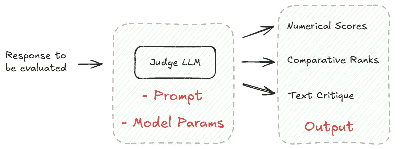

# LLM 作为裁判：实用指南

> 原文：[`towardsdatascience.com/llm-as-a-judge-a-practical-guide/`](https://towardsdatascience.com/llm-as-a-judge-a-practical-guide/)

如果 <mdspan datatext="el1750359282382" class="mdspan-comment">您已经构建</mdspan> 了由 LLM 驱动的功能，您已经知道评估的重要性。让模型说出某些内容很容易，但确定它是否说对了话才是真正的挑战所在。

对于少数测试案例，人工审查是可行的。但一旦例子数量增加，人工检查会迅速变得不切实际。相反，您需要某种可扩展的、自动化的东西。

这就是像 BLEU、ROUGE 或 METEOR 这样的指标发挥作用的地方。它们快速且便宜，但它们只通过检查标记重叠来触及表面。实际上，它们告诉您两个文本看起来是否相似，但不一定告诉您它们是否意味着相同的事情。不幸的是，这种遗漏的语义理解对于评估开放性任务是至关重要的。

所以你可能想知道：有没有一种方法可以结合人工评估的深度和自动化的可扩展性？

进入**LLM 作为裁判**。

在这篇文章中，我们将更深入地探讨这种正在获得广泛关注的方法。具体来说，我们将探讨：

+   **它是什么是，为什么你应该关心**

+   **如何**使其有效工作

+   它的**局限性**以及如何处理它们

+   **工具**和真实世界的**案例研究**

最后，我们将总结一些关键要点，您可以将这些要点应用到您自己的 LLM 评估流程中。

* * *

**1. 什么是 LLM 作为裁判，为什么你应该关心？**

如其名称所暗示的，LLM 作为裁判本质上是用一个 LLM 来评估另一个 LLM 的工作。就像您在人类审阅者开始评分之前给他们一个详细的评分标准一样，您会给您的 LLM 裁判具体的标准，以便它可以以结构化的方式评估任何抛向它的内容。

那么，使用这种方法有哪些好处？以下是一些值得您关注的顶级好处：

+   **它易于扩展且运行速度快**。LLM 可以比任何人类审阅者更快地处理大量文本。这使得您可以快速迭代并彻底测试，这两者对于开发 LLM 驱动的产品至关重要。

+   **它是成本效益的**。使用 LLM 进行评估可以大幅减少人工工作。这对于小型团队或早期项目来说是一个变革，在这些团队或项目中，您需要质量评估，但可能没有资源进行广泛的人工审查。

+   **它超越了简单的指标，以捕捉细微差别**。这是最吸引人的优势之一：LLM 裁判可以评估响应的深层、定性方面。这为丰富、多方面的评估打开了大门。例如，我们可以检查：答案是否准确，是否基于事实（**事实正确性**）？是否充分回答了用户的问题（**相关性 & 完整性**）？响应是否从始至终逻辑一致（**连贯性**）？响应是否适当、非有害且公平（**安全 & 偏见**）？或者它是否与你的预期角色相匹配（**风格 & 语调**）？

+   **它保持一致性**。人类审评员可能在解释、关注或标准上随时间而变化。另一方面，LLM 裁判每次都应用相同的规则。这促进了更可重复的评估，这对于跟踪长期改进至关重要。

+   **它是可解释的**。这是使这种方法吸引人的另一个因素。当使用 LLM 裁判进行评估时，我们可以要求它不仅输出简单的决定，还要输出它用来做出这个决定的逻辑推理。这种可解释性使得您能够轻松审计结果并检查 LLM 裁判本身的有效性。

在这一点上，你可能想知道：要求 LLM 对另一个 LLM 进行评分真的有效吗？这不是让模型给自己批改作业吗？

令人惊讶的是，到目前为止的证据表明**是的，它有效**，**只要你小心行事**。在以下内容中，让我们讨论如何使 LLM 作为裁判的方法在实践中有效运作的技术细节。

* * *

**2. 使 LLM 作为裁判工作**

我们可以采用的一个简单的心智模型来观察 LLM 作为裁判的系统如下：



图 1. LLM 作为裁判系统的心智模型（图片由作者提供）

你首先构建 LLM 裁判的提示，这本质上是对**什么**要评判和**如何**评判的详细说明。此外，您还需要配置模型，包括选择要使用的 LLM 以及设置模型参数，例如温度、最大令牌数等。

根据给定的提示和配置，当面对响应（或多个响应）时，LLM 裁判可以产生不同类型的评估结果，例如*数值评分*（例如，A 1–5 级别评分）、*比较排名*（例如，从最好到最差排列多个响应）或*文本评论*（例如，对为什么一个响应好或坏的开端解释）。通常，只进行一种类型的评估，并且应在提示中指定 LLM 裁判。

不可否认，系统的核心部分是提示，因为它直接决定了评估的质量和可靠性。现在让我们更仔细地看看这一点。

**2.1 提示设计**

提示是将通用型 LLM 转变为有用评估者的关键。为了有效地构建提示，只需问自己以下 **六个问题**。这些问题的答案将成为你最终提示的基石。让我们逐一探讨：

**问题 1：你的 LLM 评委应该是谁？**

不要只是简单地告诉大型语言模型（LLM）“评估某物”，而是给它一个具体的专家角色。例如：

> “你是一位拥有 10 年技术支持质量保证经验的资深客户体验专家。”

通常，角色越具体，评估视角就越好。

**问题 2：你具体在评估什么？**

通知 LLM 评委你希望它评估的内容类型。例如：

> “为我们的电子商务平台生成的 AI 产品描述。”

**问题 3：你关心哪些质量方面？**

定义你希望评委 LLM 评估的准则。你是判断事实准确性、有用性、连贯性、语气、安全性还是其他方面？评估准则应与你的应用目标一致。例如：

> [由 GPT-4o 生成的示例]
> 
> “根据回答与用户问题的相关性以及是否符合公司的语气指南来评估回答。”

限制自己关注 3-5 个方面。否则，焦点就会分散。

**问题 4：评委应该如何评分？**

这部分提示为 LLM 评委设定了评估策略。根据你需要什么样的洞察，可以采用不同的方法：

+   **单一输出评分**：要求评委根据每个评估标准对回答进行评分——通常是 1 到 5 或 1 到 10 级。

> “针对每个质量方面，用 1-5 级别来评估这个回答。”

+   **比较/排名**：要求评委比较两个（或更多）回答，并决定哪个在整体上或特定标准上更好。

> “比较回答 A 和回答 B。哪个更有帮助，事实更准确？”

+   **二元标签**：要求评委生成将回答分类的标签，例如，正确/错误，相关/不相关，通过/未通过，安全/不安全等。

> “判断这个回答是否符合我们的最低质量标准。”

**问题 5：你应该给评委提供哪些评分标准和示例？**

明确的评分标准和具体的示例是确保 LLM 评估一致性和准确性的关键。

一个评分标准描述了在不同得分级别上“好”是什么样的，例如，连贯性方面 5 分和 3 分的区别。这为 LLM 提供了一个稳定的框架来应用其判断。

为了使评分标准可操作，总是包含示例回答及其相应的分数是一个好主意。这是少样本学习在行动中，并且这是一个众所周知的方法，可以显著提高 LLM 输出的可靠性和一致性。

这里是一个用于评估电子商务平台上 AI 生成的产品描述中的 **有用性**（1-5 级）的示例评分标准：

> [由 GPT-4o 生成的示例]
> 
> “**得分 5：描述非常信息丰富、具体且结构良好。它清楚地突出了产品的关键特性、优势和潜在用例，使客户易于理解价值。”
> 
> **得分 4：大部分有帮助，对特性和用例有很好的覆盖，但可能遗漏一些细节或包含轻微重复。**
> 
> **得分 3：基本有帮助。涵盖了基本功能，但缺乏深度或未能回答可能的客户问题。**
> 
> **得分 2：略微有帮助。提供模糊或泛泛而谈的陈述，缺乏实质内容。客户可能仍有重要未解答的问题。**
> 
> **得分 1：无帮助。包含误导性、无关或不实用的产品信息。**
> 
> **示例描述：**
> 
> “这款时尚的背包适合任何场合。空间充足，设计时尚，是您的理想伴侣。”
> 
> **分配的得分：****3**
> 
> **解释：**
> 
> 虽然语气友好，语言流畅，但描述缺乏具体细节。它没有提到材料、尺寸、用例或像隔间或防水这样的实用功能。它是实用的，但不是深入的信息——这是评分标准中“3”的典型特征。”

**问题 6：您需要哪种输出格式？**

在提示中您需要最后指定的是输出格式。如果您打算为人工审阅准备评估结果，通常**自然语言解释**就足够了。除了原始得分外，您还可以要求判定员给出一个简短的段落来证明其决定。

然而，如果您计划在自动化管道中消费评估结果或在仪表板上显示它们，那么像 JSON 这样的**结构化格式**将更加实用。您可以轻松地通过编程解析多个字段：

```py
{
  "helpfulness_score": 4,
  "tone_score": 5,
  "explanation": "The response was clear and engaging, covering most key 
                  details with appropriate tone."
}
```

除了这些主要问题，还有两个额外的要点值得记住，这些可以在实际使用中提高性能：

+   **明确的推理指示。**您可以指示 LLM 判定员“逐步思考”或在进行最终判断之前提供推理。这些思维链技术通常可以提高评估的准确性（和透明度）。

+   **处理不确定性。**有时提交给评估的响应可能是含糊不清的或缺乏上下文。对于这些情况，最好明确指示 LLM 判定者在证据不足时应该做什么，例如，“如果您无法验证一个事实，将其标记为‘未知’”。这些未知案例可以转交给人工审阅员进行进一步审查。这个小技巧有助于避免无声的幻觉或过于自信的评分。

太好了！我们现在已经涵盖了提示构建的关键方面。让我们用一个快速清单来结束：

✅ 您的 LLM 判定员是谁？（角色）

✅ 您评估的内容是什么？（上下文）

✅ 评估时哪些质量方面很重要？（评估维度）

✅ 如何评分响应？（方法）

✅ 评分时使用哪些评分标准和示例？（标准）

✅ 您需要哪种输出格式？（结构）

✅ 你是否包含了逐步推理说明？你是否处理了不确定性？

**2.2 使用哪个 LLM？**

要使 LLM 作为评判者工作，另一个需要考虑的重要因素是使用哪个 LLM 模型。通常，你有两条前进的道路：采用大型前沿模型或使用小型特定模型。让我们来分析一下。

对于广泛的任务，大型前沿模型，比如 GPT-4o、Claude 4、Gemini-2.5，与人类评判者有更好的相关性，并且可以遵循长篇、精心编写的评估提示（就像我们在上一节中编写的那些）。因此，它们通常是扮演 LLM 评判者的默认选择。

然而，调用这些大型模型的 API 通常意味着高延迟、高成本（如果你有很多案例要评估），最重要的是，你必须将你的数据发送给第三方。

为了解决这些担忧，小型语言模型正在进入场景。它们通常是 Llama（Meta）/Phi（Microsoft）/Qwen（Alibaba）的开源变体，这些变体在评估数据上进行了微调。这使得它们成为你最关心的特定领域的“小而强大”的评判者。

因此，一切都归结于你的具体用例和约束。作为一个经验法则，你可以从大型 LLM 开始，以建立质量标准，然后尝试使用更小、经过微调的模型来满足延迟、成本或数据主权的要求。

* * *

**3. 现实检查：局限性及处理方法**

就像生活中的每一件事一样，LLM 作为评判者并非没有缺陷。尽管它有承诺，但它也伴随着不一致性、偏见等问题，这些问题你需要留意。在本节中，让我们谈谈这些局限性。

**3.1 不一致性**

LLMs 本质上是概率性的。这意味着，对于同一个 LLM 评判者，当被相同的指令提示时，如果运行两次，它可能会输出不同的评估结果（例如，分数、推理等）。这使得评估结果难以重现或信任。

有几种方法可以使 LLM 评判者更加一致。例如，在提示中提供更多示例评估被证明是一种有效的缓解策略。然而，这也带来了成本，因为更长的提示意味着更高的推理令牌消耗。另一个你可以调整的旋钮是 LLM 的温度参数。通常建议设置一个较低的值以生成更确定的评估。

**3.2 偏见**

这是在实践中采用 LLM 作为评判者方法的主要担忧之一。LLM 评判者，像所有 LLMs 一样，容易受到不同形式的偏见的影响。在这里，我们列出一些常见的偏见：

+   **位置偏见**：据报道，LLM 评判者倾向于偏好那些在提示中呈现顺序的响应。例如，LLM 评判者可能会持续偏好成对比较中的第一个响应，而不管其实际质量如何。

+   **自我偏好偏见**：一些 LLM 倾向于对其自己的输出或同一家族模型的输出给予更高的评价。

+   **冗长偏差**：LLM 裁判似乎喜欢更长、更冗长的回应。当简洁是期望的品质，或者更短的回应更准确或相关时，这可能会令人沮丧。

+   **继承偏差**：LLM 裁判从其训练数据中继承了偏差。这些偏差可能会以微妙的方式体现在他们的评估中。例如，裁判 LLM 可能更喜欢与某些观点、语气或人口统计线索相匹配的回应。

那么，我们应该如何对抗这些偏见呢？有几个策略需要记住。

首先，细化提示。尽可能明确地定义评估标准，以确保没有隐含偏见驱动决策的空间。明确告诉裁判避免特定的偏见，例如，“纯粹基于事实准确性评估回应，不考虑其长度或呈现顺序。”

接下来，在您的 few-shot 提示中包含多样化的示例回应。这确保了 LLM 裁判有平衡的接触。

为了具体减轻立场偏差，尝试在两个方向上评估成对的内容，即 A 对 B，然后 B 对 A，并平均结果。这可以大大提高公平性。

最后，持续迭代。完全消除 LLM 裁判中的偏差是具有挑战性的。更好的方法是为 LLM 裁判制作一个良好的测试集进行压力测试，使用所学知识改进提示，然后重新运行评估以检查改进情况。

**3.3 过度自信**

我们都见过 LLM 表现得自信，但实际上是错误的。不幸的是，这种特性也延续到了它们作为评估者的角色中。当他们的评估用于自动化管道时，错误的自信很容易被忽视，并导致令人困惑的结论。

为了解决这个问题，尝试在提示中明确鼓励*校准推理*。例如，告诉 LLM 如果它在回应中缺乏足够的信息来做出可靠的评估，就说“无法确定”。您还可以在结构化输出中添加置信度分数字段，以帮助揭示模糊性。这些边缘案例可以进一步由人工审查员审查。

* * *

**4. 有用的工具和实际应用**

**4.1 工具**

要开始使用 LLM 作为裁判的方法，好消息是，您可以选择一系列开源工具和商业平台。

在开源方面，我们有：

[**OpenAI Evals**](https://github.com/openai/evals)：一个用于评估 LLM 和 LLM 系统的框架，以及一个开源的基准测试注册表。

[**DeepEval**](https://github.com/confident-ai/deepeval)：一个简单易用的 LLM 评估框架，用于评估和测试大型语言模型系统（例如，RAG 管道、聊天机器人、AI 代理等）。它与 Pytest 类似，但专门用于单元测试 LLM 输出。

[**TruLens**](https://github.com/truera/trulens)：系统地评估和跟踪 LLM 实验。核心功能包括反馈函数、RAG 三联和诚实、无害且有帮助的评估。

[**Promptfoo**](https://github.com/promptfoo/promptfoo)：一个面向开发者的本地工具，用于测试 LLM 应用。支持在提示、代理和 RAG 上进行测试。为 LLM 提供红队、渗透测试和漏洞扫描。

**[LangSmith](https://docs.smith.langchain.com/evaluation/how_to_guides/llm_as_judge?utm_source=chatgpt.com)**：LangChain 提供的评估工具，LangChain 是一个流行的构建 LLM 应用的框架。支持离线和在线评估的 LLM-as-a-judge 评估器。

如果你更喜欢托管服务，也有商业产品可供选择。例如：[Amazon Bedrock 模型评估](https://aws.amazon.com/blogs/machine-learning/llm-as-a-judge-on-amazon-bedrock-model-evaluation/?utm_source=chatgpt.com)、[Azure AI Foundry/MLflow 3](https://learn.microsoft.com/en-us/azure/ai-foundry/how-to/flow-develop-evaluation?utm_source=chatgpt.com)、[Google Vertex AI 评估服务](https://cloud.google.com/vertex-ai/generative-ai/docs/models/evaluation-overview?utm_source=chatgpt.com)、[Evidently AI](https://www.evidentlyai.com/llm-testing?utm_source=chatgpt.com)、[Weights & Biases Weave](https://weave-docs.wandb.ai/tutorial-eval/?utm_source=chatgpt.com)和[Langfuse](https://langfuse.com/docs/scores/model-based-evals?utm_source=chatgpt.com)。

**4.2 应用**

通过观察他人如何在现实世界中已经使用 LLM-as-a-Judge，是一种很好的学习方法。一个例子是 Webflow 如何使用 LLM-as-a-Judge 来评估他们 AI 功能的输出质量[1-2]。

为了开发稳健的 LLM 管道，Webflow 产品团队高度依赖模型评估，也就是说，他们准备大量测试输入，通过 LLM 系统运行，并最终评估输出的质量。客观和主观评估并行进行，LLM-as-a-Judge 方法主要用于大规模提供主观评估。

他们定义了一个多级评分方案来捕捉主观判断：“成功”、“部分成功”和“失败”。LLM 评审员将此评分标准应用于数千个测试输入，并在 CI 仪表板上记录分数。这使产品团队能够共享，几乎实时的了解他们 LLM 管道的健康状况。

为了确保 LLM 评审员与真实用户期望保持一致，团队还定期随机抽取一小部分输出进行人工评分。比较这两组分数，如果发现任何差距扩大，将触发对提示或 LLM 评审员本身的重训练任务的微调。

那么，这教会了我们什么呢？

首先，LLM-as-a-Judge 不仅仅是一个理论概念，而是一种有用的策略，它在行业中提供了实际的价值。通过将 LLM-as-a-Judge 与明确的评分标准和 CI 集成操作化，Webflow 使主观质量变得可衡量和可操作。

第二，LLM-as-a-Judge 并不是为了取代人类判断；它只是将其扩展。人工介入的审查是一个关键的校准层，确保自动评估分数真正反映了质量。

* * *

**5. 结论**

在这篇博客中，我们详细介绍了 LLM-as-a-Judge：它是什么，为什么你应该关心，如何使其工作，其局限性及缓解策略，可用的工具，以及可以从中学习的真实案例。

总结来说，我会给你留下两个核心思维模式。

首先，**停止追求完美的绝对真理**在评估中。相反，专注于获取一致、可操作的反馈，以推动真正的改进。

第二，**没有免费的午餐**。LLM-as-a-Judge 并没有消除对人类判断的需求——它只是改变了判断的应用位置。现在，你不再需要审查单个响应，而是需要仔细设计评估提示，整理高质量测试案例，管理各种偏见，并持续监控法官的表现。

现在，你准备好将“LLM-as-a-Judge”添加到你的下一个 LLM 项目的工具箱了吗？

* * *

**参考文献**

[1] [掌握 AI 质量：我们如何使用语言模型评估来提高大型语言模型输出质量](https://webflow.com/blog/mastering-ai-quality)，Webflow 博客。

[2] [LLM-as-a-judge：使用 LLM 进行评估的完整指南](https://www.evidentlyai.com/llm-guide/llm-as-a-judge)，Evidently AI。
