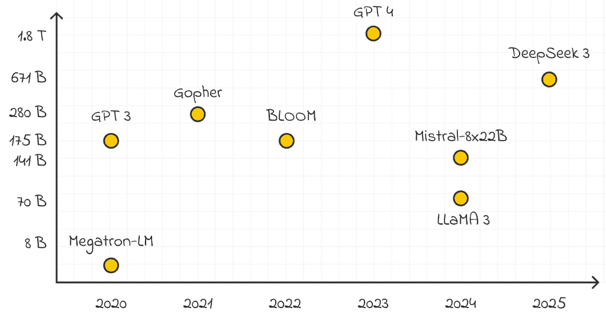
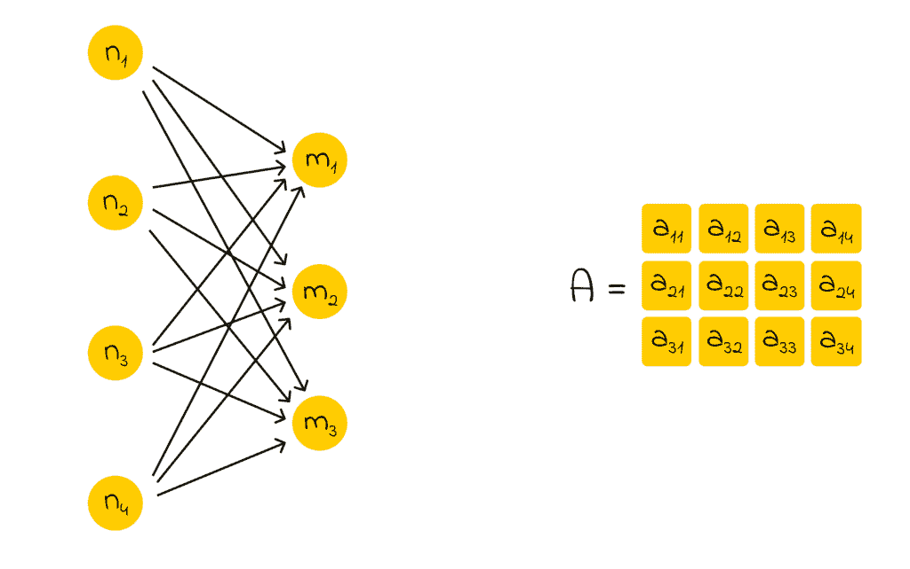
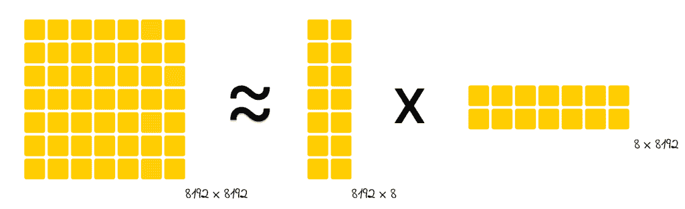
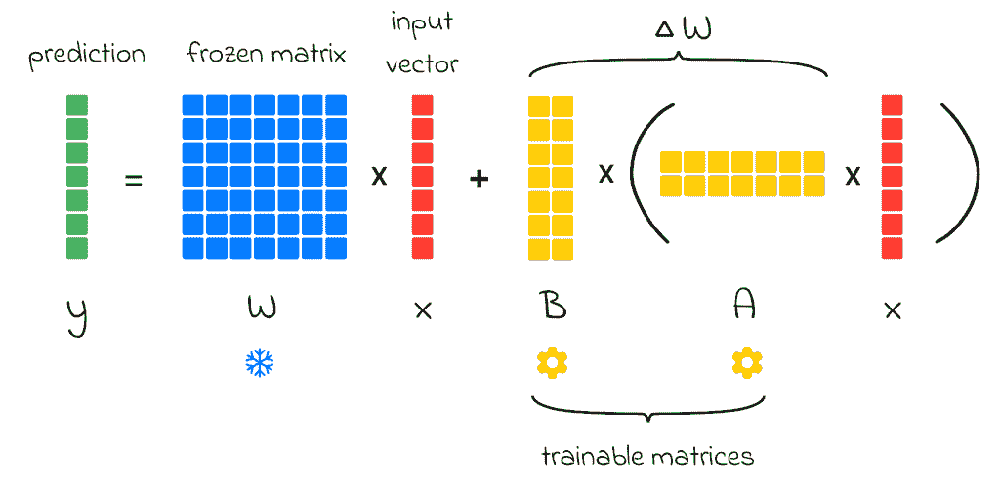
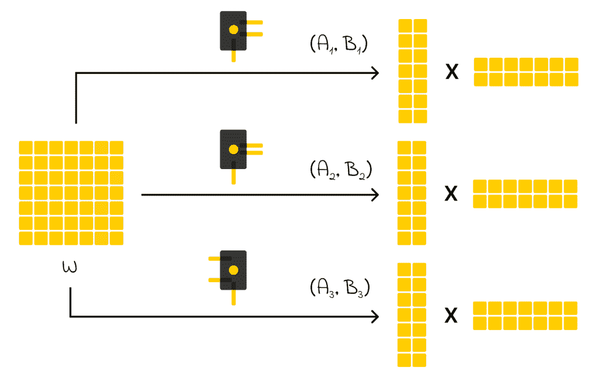
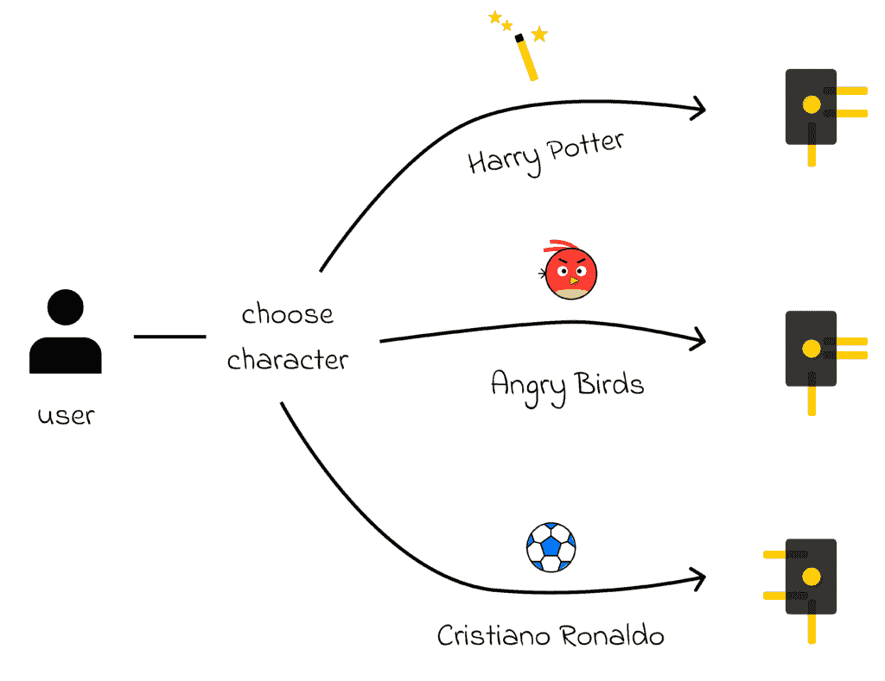
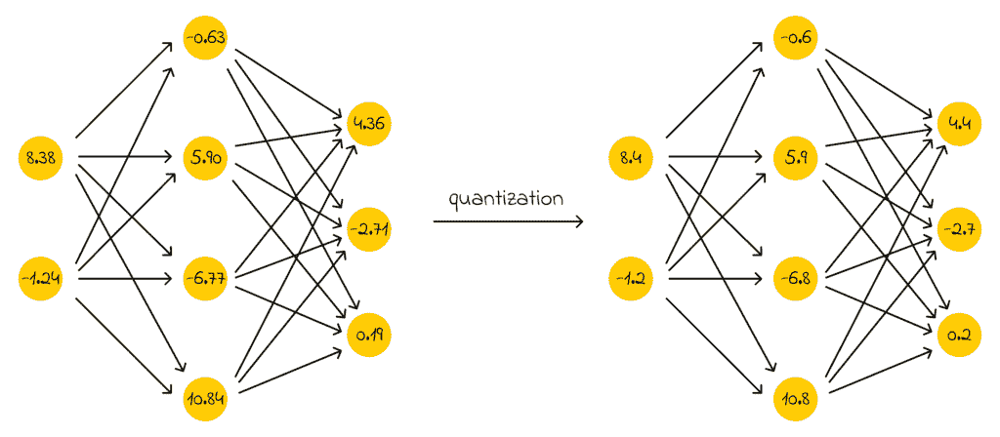

# LLM 优化：LoRA 和 QLoRA

> 原文：[`towardsdatascience.com/llm-optimization-lora-and-qlora/`](https://towardsdatascience.com/llm-optimization-lora-and-qlora/)

### <mdspan datatext="el1748630563997" class="mdspan-comment">简介</mdspan>

随着 ChatGPT 的出现，世界认识到了大型语言模型的强大潜力，这些模型能够理解自然语言并以高精度响应用户请求。在 LLM 的缩写中，第一个字母**L**代表**大型**，反映了这些模型通常具有的庞大参数数量。

现代大型语言模型（LLM）通常包含超过十亿个参数。现在，想象一下我们想要将一个 LLM 适配到下游任务的情况。一个常见的方法是**微调**，这涉及到在新数据集上调整模型现有的权重。然而，这个过程非常缓慢且资源密集——尤其是在有限的硬件上运行时。

近年来训练的一些最大语言模型的参数数量。

> *在微调期间，一些神经网络层可以被冻结以减少训练复杂性，但由于计算成本高，这种方法在规模上仍然不足。*

为了应对这一挑战，在这篇文章中，我们将探讨**LoRA（低秩适配）**的核心原则，这是一种在大型模型微调期间减少计算负载的流行技术。作为额外内容，我们还将了解 QLoRA，它通过引入量化进一步提高了效率。

### 神经网络表示

让我们以一个全连接神经网络为例。它的每一层都由*n*个神经元组成，这些神经元与下一层的*m*个神经元完全连接。总共有*n *⋅ *m*个连接，可以用相应维度的矩阵表示。

一个展示全连接神经网络层其权重可以用矩阵形式表示的例子。

当一个新输入传递给一个层时，我们只需执行权重矩阵和输入向量的矩阵乘法。在实践中，这个操作通过高级线性代数库高度优化，并且通常在整个输入批次上同时执行以加快计算速度。

### 乘法技巧

神经网络中的权重矩阵可以具有极其大的维度。**而不是存储和更新整个矩阵，我们可以将其分解为两个较小矩阵的乘积**。具体来说，如果一个权重矩阵的维度是*n × m*，我们可以使用两个大小为*n × k*和*k × m*的矩阵来近似它，其中*k*是一个远小于内在维度的值（*k << n, m*）。

例如，假设原始权重矩阵是*8192 × 8192*，这大约对应于*67M*个参数。如果我们选择**k = 8**，分解版本将包括两个矩阵：一个大小为*8192 × 8*，另一个大小为*8 × 8192*。总共，它们只包含大约*131K*个参数——比原始的少 500 多倍，大大减少了内存和计算需求。

一个大矩阵可以近似表示为两个较小矩阵的乘积。

**使用较小的矩阵来近似较大的矩阵的明显缺点是可能损失精度**。当我们用较小的矩阵相乘以重建原始矩阵时，得到的结果将不会与原始矩阵的元素完全匹配。这种权衡是我们为了显著减少内存和计算需求所付出的代价。

> *然而，即使像**k = 8**这样的小值，也常常可以以最小的精度损失来近似原始矩阵。事实上，在实践中，有时甚至可以使用**k = 2**或**k = 4**这样的低值有效地使用。*

### LoRA

上节所述的思想完美地阐述了 LoRA 的核心概念。**LoRA**代表**低秩自适应**，其中“低秩”指的是通过将大权重矩阵分解为两个较小矩阵的乘积，这两个矩阵的秩**k**要低得多**。这种方法显著减少了可训练参数的数量，同时保留了模型的大部分能力。

#### 训练

假设我们有一个输入向量**x**传递给神经网络中的一个全连接层，在微调之前，它由权重矩阵**W**表示。为了计算输出向量**y**，我们只需将矩阵乘以输入：**y = Wx**。

在微调过程中，目标是通过对权重进行调整来为下游任务调整模型。这可以表示为学习一个额外的矩阵**ΔW**，使得：**y = (W + ΔW)x = Wx + ΔWx**。正如我们上面看到的乘法技巧，我们现在可以用乘法**BA**来替换**ΔW**，所以我们最终得到：**y = Wx + BAx**。因此，我们冻结矩阵**W**并解决优化任务以找到矩阵**A**和**B**，它们总共包含的参数比**ΔW**少得多！

然而，由于矩阵乘法**BA**是一个重操作，因此在每次前向传递中直接计算乘法***(BA)x***非常慢。为了避免这种情况，我们可以利用矩阵乘法的结合性质，并将操作重写为**B(Ax)**。**A**乘以**x**的结果是一个向量，然后将被乘以**B**，这最终也会产生一个向量。这个操作序列要快得多。

LoRA 的训练过程

在反向传播方面，LoRA 也提供了几个好处。尽管单个神经元的梯度仍然需要几乎相同数量的操作，但我们现在处理网络中的参数要少得多，这意味着：

+   我们需要为***A***和***B***计算远少于原本为***W***所需的梯度。

+   我们不再需要存储一个巨大的梯度矩阵***W***。

最后，为了计算***y***，我们只需将已经计算出的***Wx***和***BAx***相加。这里没有困难，因为矩阵加法可以很容易地并行化。

> *作为一个技术细节，在微调之前，矩阵**A**使用高斯分布初始化，矩阵**B**使用零初始化。在开始时使用零矩阵**B**确保模型的行为与之前完全相同，因为**BAx = 0 · Ax = 0**，所以**y**保持与**Wx**等价。
> 
> *这使得微调的初始阶段更加稳定。然后，在反向传播过程中，模型逐渐调整**A**和**B**的权重来学习新的知识。*

#### 训练后

训练完成后，我们已经计算出了最优矩阵***A***和***B***。我们只需将它们相乘来计算***ΔW***，然后将它加到预训练矩阵***W***上，以获得最终的权重。

> *虽然矩阵乘法**BA**可能看起来是一个重量级的操作，但我们只执行一次，所以它不应该让我们过于担忧！此外，在加法之后，我们不再需要存储**A**、**B**或**ΔW**.*

#### 精妙之处

虽然 LoRA 的想法看起来很有启发性，但可能会出现一个问题：在神经网络的正常训练过程中，为什么我们不能直接用***BAx***来表示 y，而不是使用重量级的矩阵***W***来计算**y = Wx**？

仅使用***BAx***的问题在于，模型的容量会低得多，可能不足以让模型有效地学习。在训练过程中，模型需要学习大量的信息，因此它自然需要大量的参数。

在 LoRA 优化中，我们将***Wx***视为大模型的先验知识，并将***ΔWx = BAx***解释为微调期间引入的任务特定知识。因此，我们仍然不能否认***W***在模型整体性能中的重要性。

### 适配器

研究 LLM 理论时，重要的是要提到许多 LLM 论文中出现的术语“**适配器**”。

> *在 LoRA 的上下文中，一个**适配器**是由矩阵 A 和 B 的组合，用于解决给定矩阵 W 的特定下游任务。*

例如，假设我们已经训练了一个矩阵***W***，使得模型能够理解自然语言。然后我们可以执行几个独立的 LoRA 优化来调整模型在不同任务上的表现。结果，我们获得了几对矩阵：

+   ***(A₁, B₁)***—用于执行问答任务的适配器。

+   ***(A₂, B₂)***—用于文本摘要问题的适配器。

+   ***(A₃, B₃)***—用于聊天机器人开发的适配器训练。

为每个下游任务开发一个单独的适配器是一种高效且可扩展的方法，可以将大型单一模型适应到不同的问题。

> *鉴于这一点，我们可以存储一个单独的矩阵，并为不同的任务创建尽可能多的适配器！由于矩阵 A 和 B 很小，它们非常容易存储。*

#### 实时适配器调整

***适配器的优点在于我们可以动态地切换它们***。想象一下这样一个场景，我们需要开发一个聊天机器人系统，允许用户根据所选的角色来选择机器人应该如何响应，比如*哈利·波特*、一只*愤怒的小鸟*或*Cristiano Ronaldo*。

然而，系统限制可能阻止我们存储或微调三个单独的大型模型，因为它们的大小很大。那么解决方案是什么？

这就是适配器发挥作用的地方！*我们需要的只是一个大型模型 W 和三个单独的适配器，每个角色一个*。

一个聊天机器人应用，用户可以根据机器人的角色选择其行为。对于每个角色，使用一个单独的适配器。当用户想要更改角色时，可以通过矩阵加法动态切换。

我们只保留内存中的矩阵***W***和三个矩阵对：***(A₁, B₁)***、***(A₂, B₂)***、***(A₃, B₃)***。每当用户为机器人选择一个新的角色时，我们只需通过在***W***和***(Aᵢ, Bᵢ)***之间执行矩阵加法来动态地替换适配器矩阵。因此，如果我们未来需要添加新角色，我们得到的是一个扩展性极强的系统！

### QLoRA

QLoRA 是另一个流行的术语，其与 LoRA 的不同之处仅在于其第一个字母，即**Q**，代表“**量化**”。术语“**量化**”指的是用于存储神经元权重的位数减少。

例如，我们可以将神经网络权重表示为需要 32 位每个单独权重的浮点数。***量化的想法是将神经网络权重压缩到更小的精度，而不会对模型性能产生重大损失或影响。***因此，我们不必使用 32 位，我们可以去掉几个位，例如，只使用 16 位。

简化的量化示例。神经网络权重四舍五入到一位小数。实际上，四舍五入取决于量化位数的数量。

> *说到 QLoRA，量化用于预训练矩阵 W 以减少其权重大小*。

### *附加说明：前缀调整*

**前缀调整**是 LoRA 的一个有趣替代方案。*这个想法也包含使用适配器来处理不同的下游任务，但这次适配器被集成在 Transformer 的注意力层中*。

更具体地说，在训练过程中，除了那些作为前缀添加到注意力层内部计算的一些嵌入中的模型层之外，所有模型层都被冻结。与 LoRA 相比，前缀调整不会改变模型表示，并且通常具有更少的可训练参数。正如之前所述，为了考虑前缀适配器，我们需要进行加法运算，但这次元素更少。

> *除非受到非常有限的计算和内存限制，否则在许多情况下，与前缀调整相比，LoRA 适配器仍然更受欢迎。*

### 结论

在这篇文章中，我们探讨了高级 LLM 概念，以了解大型模型如何在不增加计算开销的情况下进行有效调整。LoRA 通过矩阵分解压缩权重矩阵的优雅之处不仅使模型训练速度更快，而且所需的内存空间更少。此外，LoRA 作为一个优秀的例子，展示了可以灵活使用和切换的适配器概念，这些适配器适用于下游任务。

此外，我们还可以添加一个量化过程，通过减少表示每个神经元所需的位数来进一步减少内存空间。

最后，我们探讨了另一种名为“前缀调整”的替代方案，它扮演着与适配器相同的作用，但不会改变模型表示。

### 资源

+   [LoRA: 大型语言模型的低秩调整](https://arxiv.org/pdf/2106.09685)

+   [QLORA: 量化 LLM 的高效微调](https://arxiv.org/pdf/2305.14314)

+   [Prefix-Tuning: 优化连续提示以进行生成](https://arxiv.org/pdf/2101.00190)

*除非另有说明，所有图像均为作者所有。*
