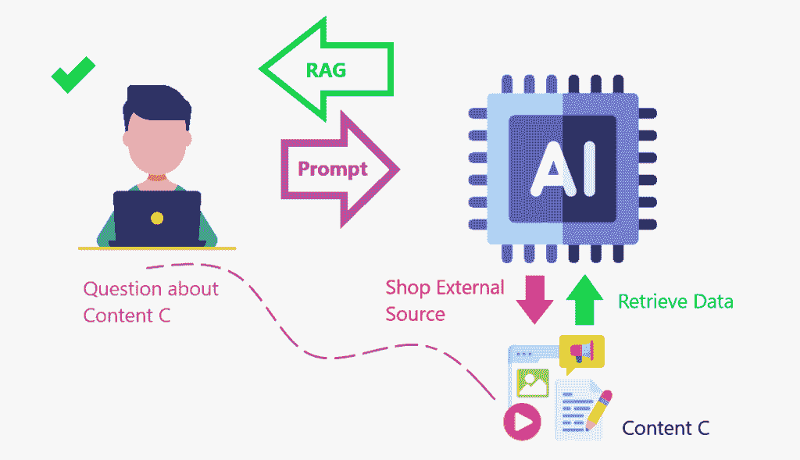
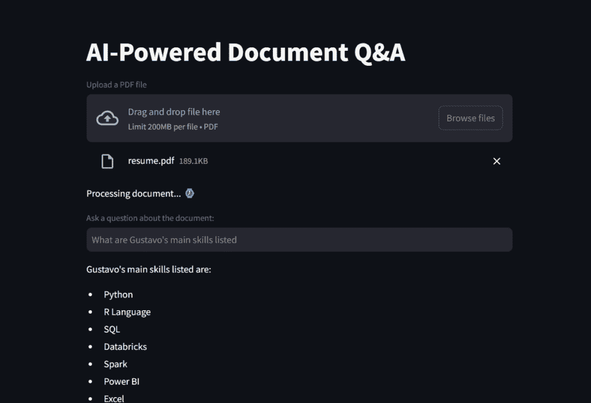
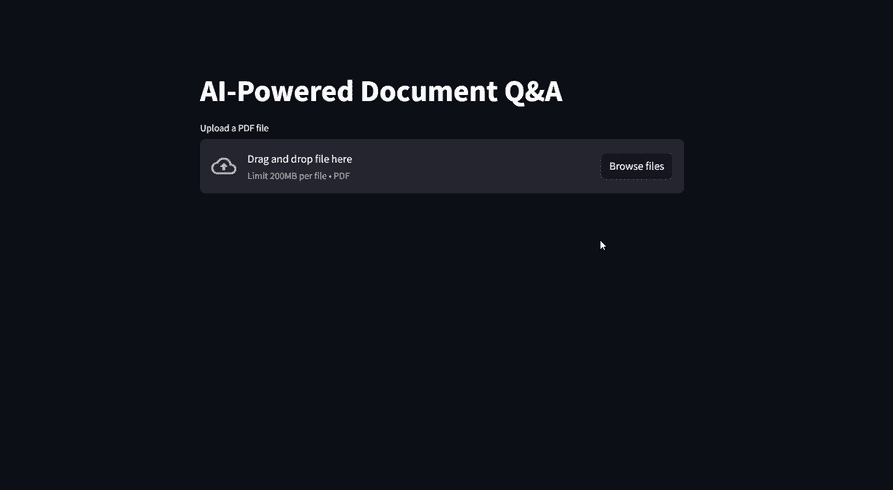

# LLM + RAG：创建一个 AI 驱动的文件阅读助手

> 原文：[`towardsdatascience.com/llm-rag-creating-an-ai-powered-file-reader-assistant/`](https://towardsdatascience.com/llm-rag-creating-an-ai-powered-file-reader-assistant/)

## 引言

AI 无处不在。

每天至少与一个大语言模型（LLM）互动一次是很困难的。聊天机器人会一直存在。它们在你的应用中，帮助你写出更好的内容，撰写电子邮件，阅读电子邮件……好吧，它们做很多事情。

我认为这并不坏。事实上，我的观点正好相反——至少到目前为止。我捍卫并倡导在日常生活中使用 AI，因为让我们同意，它使一切变得更容易。

我不必花时间逐字阅读文档来查找标点符号问题或打字错误。AI 为我做这件事。我不用在每个周一都浪费时间写那封后续电子邮件。AI 为我做这件事。当我有一个 AI 来总结主要收获和行动要点给我时，我就不需要阅读那些庞大而无聊的合同了！

这些只是 AI 的众多用途中的一些。如果你想了解更多关于 LLM 的用例，以便让我们的生活更轻松，我写了一本关于它们的整本书。

现在，作为一个数据科学家，从技术角度来看，并非一切都很光明和闪亮。

LLMs 非常适合多种通用用例，这些用例适用于任何人或任何公司。例如，编码、总结或回答关于截止到训练日期之前创建的通用内容的问题。然而，当涉及到特定的商业应用、单一目的或尚未达到截止日期的新事物时，如果直接使用这些模型，它们将不会那么有用——这意味着它们将不知道答案。因此，需要进行调整。

训练一个 LLM 模型可能需要数月和数百万美元。更糟糕的是，如果我们不调整和调整模型以适应我们的目的，结果将不会令人满意，或者会出现幻觉（当模型给出的回答不符合我们的查询时）。

那么，解决方案是什么呢？花大量金钱重新训练模型以包含我们的数据？

并非如此。这时，检索增强生成（RAG）变得有用。

*RAG 是一个框架，它结合了从外部知识库中获取信息和大语言模型（LLM）。它帮助 AI 模型产生更准确和相关的响应。*

让我们接下来更多地了解 RAG。

## RAG 是什么？

让我给你讲一个故事来阐述这个概念。

我喜欢电影。在过去的一段时间里，我知道哪些电影在奥斯卡最佳电影类别或最佳男女演员类别中竞争。我当然知道哪些电影获得了那一年的奖项。但现在我对这个主题已经生疏了。如果你问我谁在竞争，我就不知道。即使我尝试回答你，我也会给出一个薄弱的回答。

因此，为了提供高质量的回答，我将做其他人都会做的事情：在网上搜索信息，获取它，然后把它给你。我刚才做的事情与 RAG 的想法相同：我从外部数据库中获取数据来给你一个答案。

当我们增强 LLM，使其能够访问一个可以**检索**数据以**增强**（增加）其知识库的*内容存储库*时，这就是 RAG 框架在起作用。

*RAG 就像创建一个内容存储库，模型可以在其中增强其知识并更准确地回答问题*。



用户提示关于内容 C。LLM 检索外部内容以聚合到答案中。图片由作者提供。

总结：

1.  使用搜索算法查询外部数据源，例如数据库、知识库和网页。

1.  预处理检索到的信息。

1.  将预处理的信息整合到 LLM 中。

## 为什么使用 RAG？

既然我们已经了解了 RAG 框架是什么，那么让我们了解为什么我们应该使用它。

这里有一些好处：

+   通过引用真实数据增强事实准确性。

+   RAG 可以帮助 LLM 处理和整合知识以创建更相关的答案

+   RAG 可以帮助 LLM 访问额外的知识库，例如内部组织数据

+   RAG 可以帮助 LLM 创建更准确的特定领域内容

+   RAG 可以帮助减少知识差距和 AI 幻觉

如前所述，我喜欢说，使用 RAG 框架，我们正在为想要添加到知识库的内容提供一个内部搜索引擎。

好吧。所有这些都很有趣。但让我们看看 RAG 的一个应用。我们将学习如何创建一个 AI 驱动的 PDF 阅读助手。

## 项目

这是一个允许用户上传 PDF 文档并使用 AI 驱动的自然语言处理（NLP）工具对其内容提出问题的应用程序。

+   该应用程序使用`Streamlit`作为前端。

+   `Langchain`、OpenAI 的 GPT-4 模型和`FAISS`（Facebook AI 相似性搜索）用于后端文档检索和问答。

让我们分解步骤以更好地理解：

1.  加载 PDF 文件并将其拆分为文本块。

    1.  这使得数据优化了检索

1.  将这些块呈现给嵌入工具。

    1.  嵌入是数据的数值向量表示，用于以机器可以理解的方式捕获关系、相似性和含义。它们在自然语言处理（NLP）、推荐系统和搜索引擎中得到广泛应用。

1.  接下来，我们将这些文本块和嵌入放入同一个数据库中进行检索。

1.  最后，我们使其对 LLM 可用。

### 数据准备

准备一个*内容存储库*需要一些步骤，正如我们刚才看到的。所以，让我们首先创建一个可以加载文件并将其拆分为文本块以进行高效检索的功能。

```py
# Imports
from  langchain_community.document_loaders import PyPDFLoader
from langchain.text_splitter import RecursiveCharacterTextSplitter

def load_document(pdf):
    # Load a PDF
    """
    Load a PDF and split it into chunks for efficient retrieval.

    :param pdf: PDF file to load
    :return: List of chunks of text
    """

    loader = PyPDFLoader(pdf)
    docs = loader.load()

    # Instantiate Text Splitter with Chunk Size of 500 words and Overlap of 100 words so that context is not lost
    text_splitter = RecursiveCharacterTextSplitter(chunk_size=500, chunk_overlap=100)
    # Split into chunks for efficient retrieval
    chunks = text_splitter.split_documents(docs)

    # Return
    return chunks
```

接下来，我们将开始构建我们的 Streamlit 应用程序，并在下一个脚本中使用该功能。

### 网络应用程序

我们将开始导入必要的 Python 模块。其中大部分将来自 langchain 包。

`FAISS` 用于文档检索；`OpenAIEmbeddings` 将文本块转换为数值分数，以便 LLM 进行更好的相似度计算；`ChatOpenAI` 是使我们能够与 OpenAI API 交互的东西；`create_retrieval_chain` 是 RAG 实际上所做的工作，检索并增强 LLM 的数据；`create_stuff_documents_chain` 将模型和 ChatPromptTemplate 粘合在一起。

*注意：您需要* [*生成一个 OpenAI 密钥*](https://www.geeksforgeeks.org/how-to-get-your-own-openai-api-key/) *才能运行此脚本。如果您是第一次创建账户，您将获得一些免费积分。但如果您已经拥有它一段时间，您可能需要添加 5 美元的积分才能访问 OpenAI 的 API。一个选项是使用 Hugging Face 的 Embedding*。

```py
# Imports
from langchain_community.vectorstores import FAISS
from langchain_openai import OpenAIEmbeddings
from langchain.chains import create_retrieval_chain
from langchain_openai import ChatOpenAI
from langchain.chains.combine_documents import create_stuff_documents_chain
from langchain_core.prompts import ChatPromptTemplate
from scripts.secret import OPENAI_KEY
from scripts.document_loader import load_document
import streamlit as st
```

这个第一个代码片段将创建应用标题，创建一个文件上传框，并准备要添加到 `load_document()` 函数中的文件。

```py
# Create a Streamlit app
st.title("AI-Powered Document Q&A")

# Load document to streamlit
uploaded_file = st.file_uploader("Upload a PDF file", type="pdf")

# If a file is uploaded, create the TextSplitter and vector database
if uploaded_file :

    # Code to work around document loader from Streamlit and make it readable by langchain
    temp_file = "./temp.pdf"
    with open(temp_file, "wb") as file:
        file.write(uploaded_file.getvalue())
        file_name = uploaded_file.name

    # Load document and split it into chunks for efficient retrieval.
    chunks = load_document(temp_file)

    # Message user that document is being processed with time emoji
    st.write("Processing document... :watch:")
```

机器比文本更擅长理解数字，所以在最后，我们必须向模型提供一个数字数据库，它可以在执行查询时进行比较和检查相似性。这就是 `embeddings` 在创建 `vector_db` 的下一部分代码中将变得有用的地方。

```py
# Generate embeddings
    # Embeddings are numerical vector representations of data, typically used to capture relationships, similarities,
    # and meanings in a way that machines can understand. They are widely used in Natural Language Processing (NLP),
    # recommender systems, and search engines.
    embeddings = OpenAIEmbeddings(openai_api_key=OPENAI_KEY,
                                  model="text-embedding-ada-002")

    # Can also use HuggingFaceEmbeddings
    # from langchain_huggingface.embeddings import HuggingFaceEmbeddings
    # embeddings = HuggingFaceEmbeddings(model_name="sentence-transformers/all-MiniLM-L6-v2")

    # Create vector database containing chunks and embeddings
    vector_db = FAISS.from_documents(chunks, embeddings)
```

接下来，我们创建一个检索对象以在 `vector_db` 中导航。

```py
# Create a document retriever
    retriever = vector_db.as_retriever()
    llm = ChatOpenAI(model_name="gpt-4o-mini", openai_api_key=OPENAI_KEY)
```

然后，我们将创建 `system_prompt`，这是一组指示 LLM 如何回答的指令，并且我们将创建一个提示模板，准备将其添加到模型中，一旦我们从用户那里获得输入。

```py
# Create a system prompt
    # It sets the overall context for the model.
    # It influences tone, style, and focus before user interaction starts.
    # Unlike user inputs, a system prompt is not visible to the end user.

    system_prompt = (
        "You are a helpful assistant. Use the given context to answer the question."
        "If you don't know the answer, say you don't know. "
        "{context}"
    )

    # Create a prompt Template
    prompt = ChatPromptTemplate.from_messages(
        [
            ("system", system_prompt),
            ("human", "{input}"),
        ]
    )

    # Create a chain
    # It creates a StuffDocumentsChain, which takes multiple documents (text data) and "stuffs" them together before passing them to the LLM for processing.

    question_answer_chain = create_stuff_documents_chain(llm, prompt)
```

接下来，我们创建 RAG 框架的核心，将 `retriever` 对象和 `prompt` 粘贴在一起。此对象从数据源（例如，向量数据库）添加相关文档，并使其准备好使用 LLM 进行处理以生成响应。

```py
# Creates the RAG
     chain = create_retrieval_chain(retriever, question_answer_chain)
```

最后，我们为用户输入创建了一个变量 `question`。如果这个问题框中填入了查询，我们就将其传递给 `chain`，它调用 LLM 进行处理并返回响应，该响应将在应用的屏幕上打印。

```py
# Streamlit input for question
    question = st.text_input("Ask a question about the document:")
    if question:
        # Answer
        response = chain.invoke({"input": question})['answer']
        st.write(response)
```

这里是结果的截图。



最终应用的截图。图片由作者提供。

这还有一个 GIF，让您看到文件阅读 AI 助手在运行！



文件阅读 AI 助手正在运行。图片由作者提供。

## 在你继续之前

在这个项目中，我们学习了 RAG 框架是什么以及它是如何帮助 LLM 表现得更好，并且也能与特定知识很好地协同工作。

AI 可以通过来自操作手册的知识、公司的数据库、一些财务文件或合同的知识来供电，然后经过微调以准确响应特定领域的内容查询。知识库通过内容存储进行**增强**。

回顾一下，这是框架的工作方式：

1️⃣ **用户查询** → 接收输入文本。

2️⃣ **检索相关文档** → 在知识库（例如，数据库、向量存储）中进行搜索。

3️⃣ **增强上下文** → 将检索到的文档添加到输入中。

4️⃣ **生成响应** → 一个大型语言模型处理组合输入并生成答案。

### GitHub 仓库

[`github.com/gurezende/Basic-Rag`](https://github.com/gurezende/Basic-Rag)

### 关于我

如果你喜欢这个内容并想了解更多关于我的工作，请访问我的网站，在那里你还可以找到我的所有联系方式。

[`gustavorsantos.me`](https://gustavorsantos.me)

## 参考文献

[`cloud.google.com/use-cases/retrieval-augmented-generation`](https://cloud.google.com/use-cases/retrieval-augmented-generation)

[`www.ibm.com/think/topics/retrieval-augmented-generation`](https://www.ibm.com/think/topics/retrieval-augmented-generation)

[`youtu.be/T-D1OfcDW1M?si=G0UWfH5-wZnMu0nw`](https://youtu.be/T-D1OfcDW1M?si=G0UWfH5-wZnMu0nw)

[`python.langchain.com/docs/introduction`](https://python.langchain.com/docs/introduction)

[`www.geeksforgeeks.org/how-to-get-your-own-openai-api-key`](https://www.geeksforgeeks.org/how-to-get-your-own-openai-api-key)
