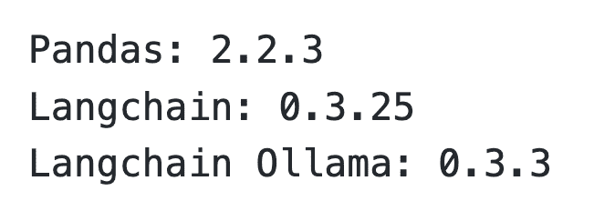
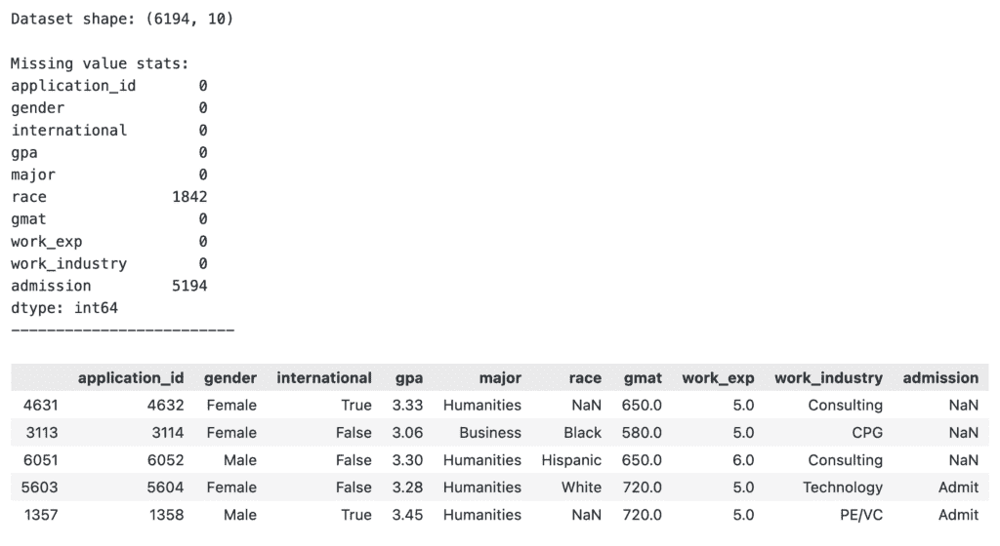
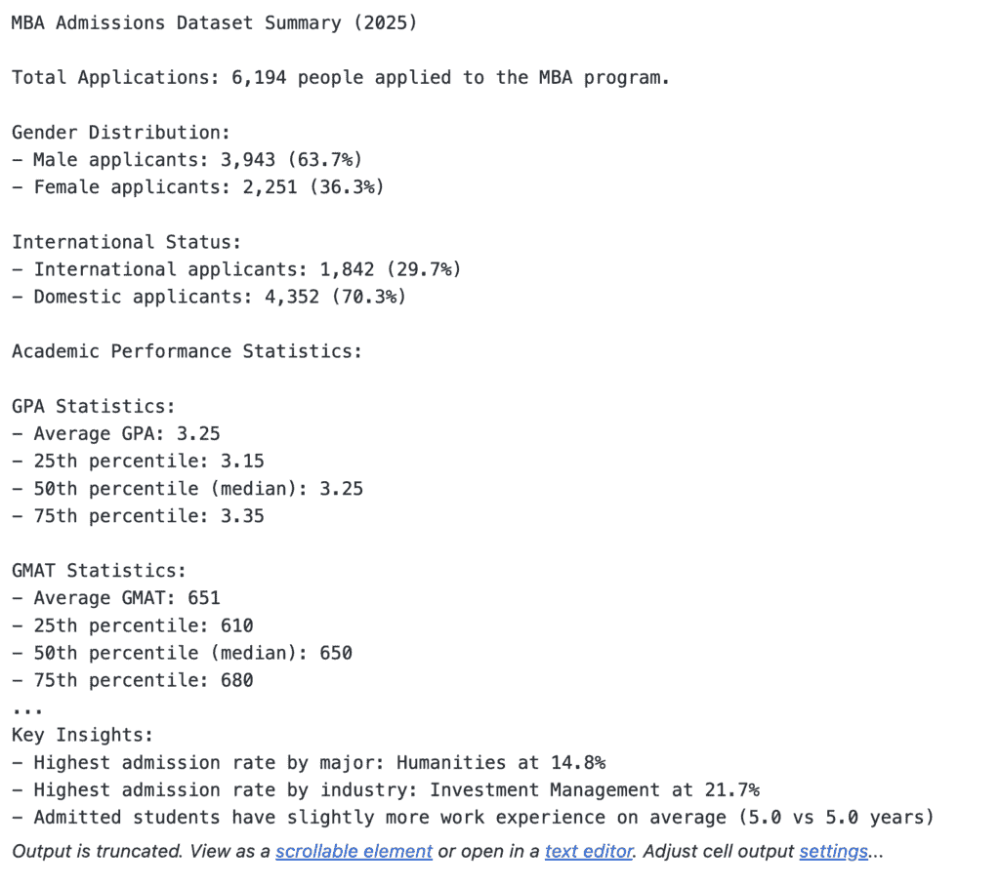
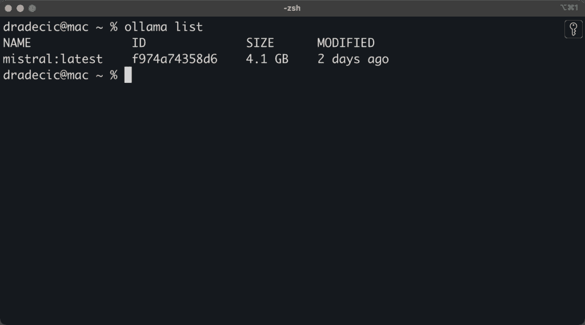
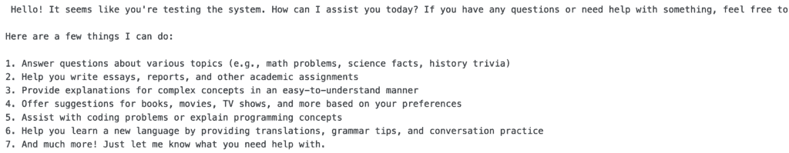
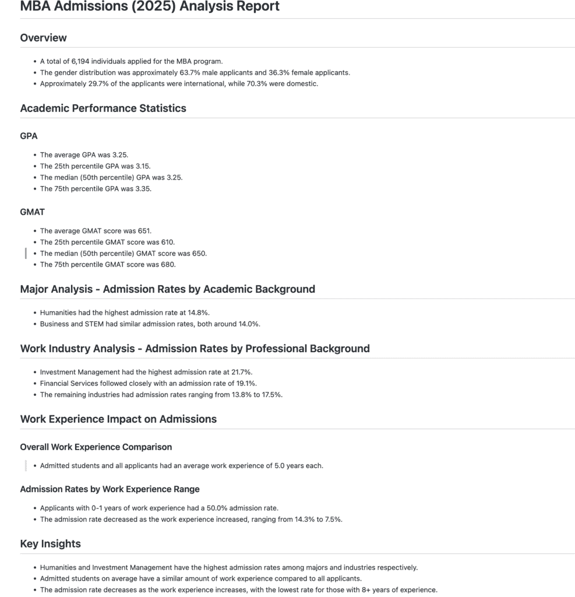
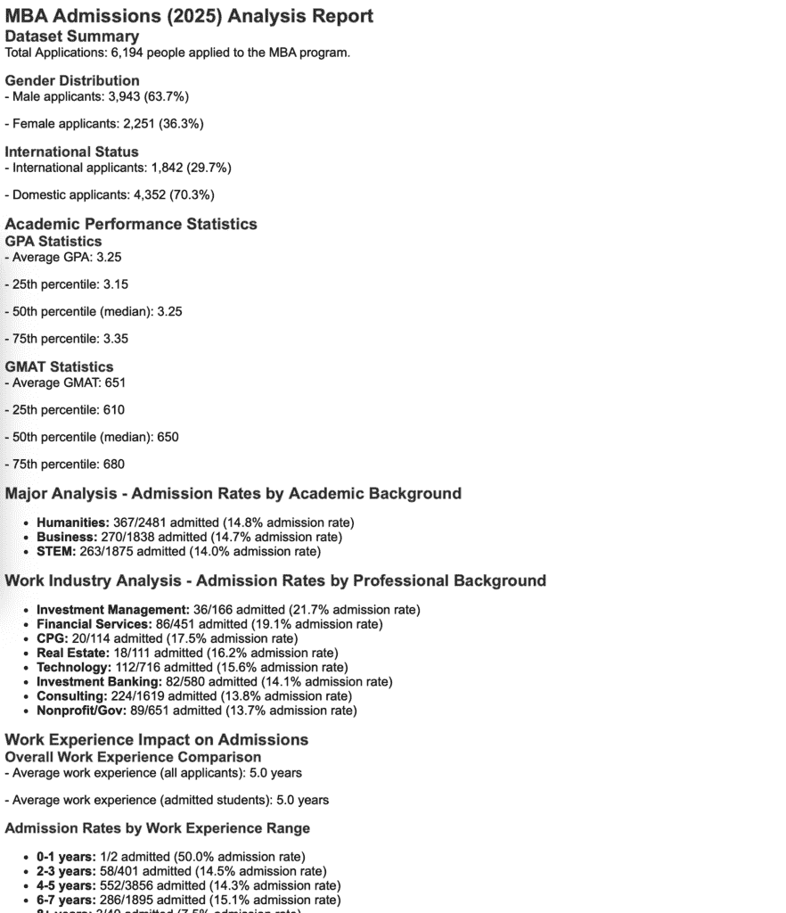

# LLMs + Pandas：我是如何使用生成式 AI 生成 Pandas DataFrame 摘要的

> 原文：[`towardsdatascience.com/llms-pandas-how-i-use-generative-ai-to-generate-pandas-dataframe-summaries-2/`](https://towardsdatascience.com/llms-pandas-how-i-use-generative-ai-to-generate-pandas-dataframe-summaries-2/)

<mdspan datatext="el1748909925911" class="mdspan-comment">如果你在庞大的数据集中挣扎，并希望快速获得洞察力，而又不想进行太多的手动操作，你就来对地方了。

到 2025 年，数据集通常包含数百万行和数百列，这使得手动分析几乎不可能。本地大型语言模型可以在几秒钟内（最坏情况下几分钟）将你的原始 DataFrame 统计信息转换为精致、易读的报告。这种方法消除了手动分析数据和编写管理报告的繁琐过程，尤其是如果数据结构没有变化的话。

Pandas 处理数据提取的重活，而 LLM 将你的技术输出转换为可展示的报告。你仍然需要编写函数从数据集中提取关键统计信息，但这只需要一次努力。

本指南假设你已经在本地上安装了 Ollama。如果没有，你仍然可以使用第三方 LLM 供应商，但我不解释如何连接到他们的 API。

### 目录：

+   数据集介绍和探索

+   无聊的部分：提取汇总统计信息

+   好玩的部分：与 LLM 一起工作

+   你可以改进的地方

## 数据集介绍和探索

对于本指南，我使用的是来自 Kaggle 的[MBA 录取数据集](https://www.kaggle.com/datasets/taweilo/mba-admission-dataset)。如果你想跟学，请下载它。

该数据集受**Apache 2.0 许可证**的许可，这意味着你可以自由地用于个人和商业项目。

要开始，你需要在你的系统上安装几个 Python 库。



图片 1 – 所需 Python 库和版本（图片由作者提供）

一切安装完毕后，在一个新脚本或笔记本中导入必要的库：

```py
import pandas as pd
from langchain_ollama import ChatOllama
from typing import Literal
```

### 数据集加载和预处理

首先，使用 Pandas 加载数据集。这个片段加载 CSV 文件，打印有关数据集形状的基本信息，并显示每列中存在的缺失值数量：

```py
df = pd.read_csv("data/MBA.csv")

# Basic dataset info
print(f"Dataset shape: {df.shape}\n")
print("Missing value stats:")
print(df.isnull().sum())
print("-" * 25)
df.sample(5)
```



图片 2 – 基本数据集统计信息（图片由作者提供）

由于数据清洗不是本文的主要焦点，我会尽量减少预处理。数据集只有几个需要关注的缺失值：

```py
df["race"] = df["race"].fillna("Unknown")
df["admission"] = df["admission"].fillna("Deny")
```

就这样！让我们看看如何从这些内容生成一份有意义的报告。

## 无聊的部分：提取汇总统计信息

即使在 AI 能力和可用性方面取得了所有这些进步，你可能也不愿意将整个数据集发送给 LLM 提供商。有几个很好的理由。

它可能会**消耗过多的令牌**，这直接转化为更高的成本。处理大型数据集可能**需要很长时间**，尤其是在你使用自己的硬件本地运行模型时。你也可能正在处理**敏感数据**，这些数据不应该离开你的组织。

仍然需要一些手动工作。

这种方法要求你编写一个函数，从你的 Pandas DataFrame 中提取关键元素和统计数据。你将不得不为不同的数据集从头开始编写这个函数，但核心思想在不同项目之间很容易转移。

`get_summary_context_message()` 函数接收一个 DataFrame 并返回一个格式化的多行字符串，其中包含详细的摘要。以下是它包含的内容：

+   总申请数量和性别分布

+   国际与国内申请者分布

+   GPA 和 GMAT 分数四分位数统计数据

+   按学术专业划分的录取率（按比率排序）

+   按工作行业划分的录取率（前 8 大行业）

+   使用分类拆分的工作经验分析

+   突出显示表现最佳类别的关键见解

这是该函数的完整源代码：

```py
def get_summary_context_message(df: pd.DataFrame) -> str:
    """
    Generate a comprehensive summary report of MBA admissions dataset statistics.

    This function analyzes MBA application data to provide detailed statistics on
    applicant demographics, academic performance, professional backgrounds, and
    admission rates across various categories. The summary includes gender and
    international status distributions, GPA and GMAT score statistics, admission
    rates by academic major and work industry, and work experience impact analysis.

    Parameters
    ----------
    df : pd.DataFrame
        DataFrame containing MBA admissions data with the following expected columns:
        - 'gender', 'international', 'gpa', 'gmat', 'major', 'work_industry', 'work_exp', 'admission'

    Returns
    -------
    str
        A formatted multi-line string containing comprehensive MBA admissions
        statistics.
    """
    # Basic application statistics
    total_applications = len(df)

    # Gender distribution
    gender_counts = df["gender"].value_counts()
    male_count = gender_counts.get("Male", 0)
    female_count = gender_counts.get("Female", 0)

    # International status
    international_count = (
        df["international"].sum()
        if df["international"].dtype == bool
        else (df["international"] == True).sum()
    )

    # GPA statistics
    gpa_data = df["gpa"].dropna()
    gpa_avg = gpa_data.mean()
    gpa_25th = gpa_data.quantile(0.25)
    gpa_50th = gpa_data.quantile(0.50)
    gpa_75th = gpa_data.quantile(0.75)

    # GMAT statistics
    gmat_data = df["gmat"].dropna()
    gmat_avg = gmat_data.mean()
    gmat_25th = gmat_data.quantile(0.25)
    gmat_50th = gmat_data.quantile(0.50)
    gmat_75th = gmat_data.quantile(0.75)

    # Major analysis - admission rates by major
    major_stats = []
    for major in df["major"].unique():
        major_data = df[df["major"] == major]
        admitted = len(major_data[major_data["admission"] == "Admit"])
        total = len(major_data)
        rate = (admitted / total) * 100
        major_stats.append((major, admitted, total, rate))

    # Sort by admission rate (descending)
    major_stats.sort(key=lambda x: x[3], reverse=True)

    # Work industry analysis - admission rates by industry
    industry_stats = []
    for industry in df["work_industry"].unique():
        if pd.isna(industry):
            continue
        industry_data = df[df["work_industry"] == industry]
        admitted = len(industry_data[industry_data["admission"] == "Admit"])
        total = len(industry_data)
        rate = (admitted / total) * 100
        industry_stats.append((industry, admitted, total, rate))

    # Sort by admission rate (descending)
    industry_stats.sort(key=lambda x: x[3], reverse=True)

    # Work experience analysis
    work_exp_data = df["work_exp"].dropna()
    avg_work_exp_all = work_exp_data.mean()

    # Work experience for admitted students
    admitted_students = df[df["admission"] == "Admit"]
    admitted_work_exp = admitted_students["work_exp"].dropna()
    avg_work_exp_admitted = admitted_work_exp.mean()

    # Work experience ranges analysis
    def categorize_work_exp(exp):
        if pd.isna(exp):
            return "Unknown"
        elif exp < 2:
            return "0-1 years"
        elif exp < 4:
            return "2-3 years"
        elif exp < 6:
            return "4-5 years"
        elif exp < 8:
            return "6-7 years"
        else:
            return "8+ years"

    df["work_exp_category"] = df["work_exp"].apply(categorize_work_exp)
    work_exp_category_stats = []

    for category in ["0-1 years", "2-3 years", "4-5 years", "6-7 years", "8+ years"]:
        category_data = df[df["work_exp_category"] == category]
        if len(category_data) > 0:
            admitted = len(category_data[category_data["admission"] == "Admit"])
            total = len(category_data)
            rate = (admitted / total) * 100
            work_exp_category_stats.append((category, admitted, total, rate))

    # Build the summary message
    summary = f"""MBA Admissions Dataset Summary (2025)

Total Applications: {total_applications:,} people applied to the MBA program.

Gender Distribution:
- Male applicants: {male_count:,} ({male_count/total_applications*100:.1f}%)
- Female applicants: {female_count:,} ({female_count/total_applications*100:.1f}%)

International Status:
- International applicants: {international_count:,} ({international_count/total_applications*100:.1f}%)
- Domestic applicants: {total_applications-international_count:,} ({(total_applications-international_count)/total_applications*100:.1f}%)

Academic Performance Statistics:

GPA Statistics:
- Average GPA: {gpa_avg:.2f}
- 25th percentile: {gpa_25th:.2f}
- 50th percentile (median): {gpa_50th:.2f}
- 75th percentile: {gpa_75th:.2f}

GMAT Statistics:
- Average GMAT: {gmat_avg:.0f}
- 25th percentile: {gmat_25th:.0f}
- 50th percentile (median): {gmat_50th:.0f}
- 75th percentile: {gmat_75th:.0f}

Major Analysis - Admission Rates by Academic Background:"""

    for major, admitted, total, rate in major_stats:
        summary += (
            f"\n- {major}: {admitted}/{total} admitted ({rate:.1f}% admission rate)"
        )

    summary += (
        "\n\nWork Industry Analysis - Admission Rates by Professional Background:"
    )

    # Show top 8 industries by admission rate
    for industry, admitted, total, rate in industry_stats[:8]:
        summary += (
            f"\n- {industry}: {admitted}/{total} admitted ({rate:.1f}% admission rate)"
        )

    summary += "\n\nWork Experience Impact on Admissions:\n\nOverall Work Experience Comparison:"
    summary += (
        f"\n- Average work experience (all applicants): {avg_work_exp_all:.1f} years"
    )
    summary += f"\n- Average work experience (admitted students): {avg_work_exp_admitted:.1f} years"

    summary += "\n\nAdmission Rates by Work Experience Range:"
    for category, admitted, total, rate in work_exp_category_stats:
        summary += (
            f"\n- {category}: {admitted}/{total} admitted ({rate:.1f}% admission rate)"
        )

    # Key insights
    best_major = major_stats[0]
    best_industry = industry_stats[0]

    summary += "\n\nKey Insights:"
    summary += (
        f"\n- Highest admission rate by major: {best_major[0]} at {best_major[3]:.1f}%"
    )
    summary += f"\n- Highest admission rate by industry: {best_industry[0]} at {best_industry[3]:.1f}%"

    if avg_work_exp_admitted > avg_work_exp_all:
        summary += f"\n- Admitted students have slightly more work experience on average ({avg_work_exp_admitted:.1f} vs {avg_work_exp_all:.1f} years)"
    else:
        summary += "\n- Work experience shows minimal difference between admitted and all applicants"

    return summary
```

一旦你定义了函数，只需调用它并打印结果：

```py
print(get_summary_context_message(df))
```



图像 3 – 从数据集中提取的发现和统计数据（作者提供）

现在让我们进入有趣的部分。

## 最酷的部分：与 LLM 一起工作

这里事情变得有趣，你的手动数据提取工作开始发挥作用。

### 用于与 LLM 一起工作的 Python 辅助函数

如果你拥有不错的硬件，我强烈建议使用本地 LLM 来处理这类简单任务。我使用 [Ollama](https://ollama.com) 和 **Mistral 模型**的最新版本来进行实际的 LLM 处理。



图像 4 – 可用的 Ollama 模型（作者提供）

如果你想要通过 OpenAI API 使用类似 ChatGPT 的东西，你仍然可以这样做。你只需要修改下面的函数来设置你的 API 密钥，并从 Langchain 返回适当的实例。

无论你选择哪个选项，使用测试消息调用 `get_llm()` 都不应返回错误：

```py
def get_llm(model_name: str = "mistral:latest") -> ChatOllama:
    """
    Create and configure a ChatOllama instance for local LLM inference.

    This function initializes a ChatOllama client configured to connect to a
    local Ollama server. The client is set up with deterministic output
    (temperature=0) for consistent responses across multiple calls with the
    same input.

    Parameters
    ----------
    model_name : str, optional
        The name of the Ollama model to use for chat completions.
        Must be a valid model name that is available on the local Ollama
        installation. Default is "mistral:latest".

    Returns
    -------
    ChatOllama
        A configured ChatOllama instance ready for chat completions.
    """
    return ChatOllama(
        model=model_name, base_url="http://localhost:11434", temperature=0
    )

print(get_llm().invoke("test").content)
```



图像 5 – LLM 测试消息（作者提供）

### 摘要提示

你可以在这里发挥创意，为你的 LLM 编写超具体的指令。为了演示目的，我决定保持简单，但请在这里自由实验。

没有单一的正确或错误提示。

无论你做什么，确保使用大括号包含格式参数 – 这些值将在稍后动态填充：

```py
SUMMARIZE_DATAFRAME_PROMPT = """
You are an expert data analyst and data summarizer. Your task is to take in complex datasets
and return user-friendly descriptions and findings.

You were given this dataset:
- Name: {dataset_name}
- Source: {dataset_source}

This dataset was analyzed in a pipeline before it was given to you.
These are the findings returned by the analysis pipeline:

<context>
{context}
</context>

Based on these findings, write a detailed report in {report_format} format.
Give the report a meaningful title and separate findings into sections with headings and subheadings.
Output only the report in {report_format} and nothing else.

Report:
"""
```

### Python 摘要函数

在声明了提示和 `get_llm()` 函数之后，剩下的只是连接这些点。`get_report_summary()` 函数接收将填充提示中的格式占位符的参数，然后使用该提示调用 LLM 生成报告。

你可以选择 Markdown 或 HTML 格式：

```py
def get_report_summary(
    dataset: pd.DataFrame,
    dataset_name: str,
    dataset_source: str,
    report_format: Literal["markdown", "html"] = "markdown",
) -> str:
    """
    Generate an AI-powered summary report from a pandas DataFrame.

    This function analyzes a dataset and generates a comprehensive summary report
    using a large language model (LLM). It first extracts statistical context
    from the dataset, then uses an LLM to create a human-readable report in the
    specified format.

    Parameters
    ----------
    dataset : pd.DataFrame
        The pandas DataFrame to analyze and summarize.
    dataset_name : str
        A descriptive name for the dataset that will be included in the
        generated report for context and identification.
    dataset_source : str
        Information about the source or origin of the dataset.
    report_format : {"markdown", "html"}, optional
        The desired output format for the generated report. Options are:
        - "markdown" : Generate report in Markdown format (default)
        - "html" : Generate report in HTML format

    Returns
    -------
    str
        A formatted summary report.

    """
    context_message = get_summary_context_message(df=dataset)
    prompt = SUMMARIZE_DATAFRAME_PROMPT.format(
        dataset_name=dataset_name,
        dataset_source=dataset_source,
        context=context_message,
        report_format=report_format,
    )
    return get_llm().invoke(input=prompt).content
```

使用该功能非常简单——只需传入数据集、其名称和来源。报告格式默认为 Markdown：

```py
md_report = get_report_summary(
    dataset=df, 
    dataset_name="MBA Admissions (2025)",
    dataset_source="https://www.kaggle.com/datasets/taweilo/mba-admission-dataset"
)
print(md_report)
```



图像 6 - Markdown 格式的最终报告（作者提供）

HTML 报告同样详细，但可能需要一些样式。也许你可以请 LLM 也处理这一点！



图像 7 - HTML 格式的最终报告（作者提供）

## 你可以改进的地方

我本可以将这变成一篇 30 分钟的阅读材料，通过优化管道的每一个细节，但我为了演示目的保持了简单。不过，你不必（也不应该）就此止步。

这里有一些你可以改进的地方，使这个管道更加强大：

+   **编写一个函数，将报告（Markdown 或 HTML）直接保存到磁盘**。这样，你可以自动化整个过程，并按计划生成报告，无需人工干预。

+   在提示中，**要求 LLM 为 HTML 报告添加 CSS 样式**，使其看起来更易于展示。你甚至可以提供你公司的品牌颜色和字体，以保持所有数据报告的一致性。

+   **扩展提示以遵循更具体的指令**。你可能希望报告专注于特定的业务指标，遵循特定的模板，或基于发现提供建议。

+   扩展`get_llm()`函数，使其能够**连接到 Ollama 和其他供应商**，如 OpenAI、Anthropic 或 Google。这为你提供了根据需要在不同本地和云模型之间切换的灵活性。

+   在 get_summary_context_message()函数中，你可以做任何实际的事情，因为它为 LLM 提供的所有**上下文数据**提供了基础。这是你可以发挥创意进行特征工程、统计分析以及对你特定用例有意义的见解的地方。

我希望这个最小示例能让你走上自动化自己的数据报告工作流程的正确道路。
