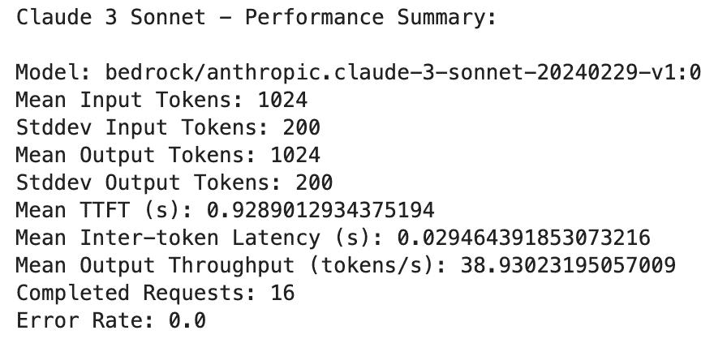

# 使用 LLMPerf 对 LLMs 进行负载测试

> 原文：[`towardsdatascience.com/load-testing-llmperf/`](https://towardsdatascience.com/load-testing-llmperf/)

<mdspan datatext="el1744962075287" class="mdspan-comment">部署你的大型语言模型（LLM）并不一定是将你的生成式 AI 应用投入生产的最终步骤。MLOps 生命周期中经常被遗忘但至关重要的一个部分是正确地进行[负载测试](https://www.opentext.com/what-is/load-testing)你的 LLM，并确保它能够承受你预期的生产流量。在较高层次上，负载测试是一种测试你的应用或在此情况下你的模型在预期生产环境中预期流量的实践，以确保其性能表现。>

在过去，我们讨论了使用开源 Python 工具如[Locust](https://locust.io/)进行[负载测试传统 ML 模型](https://towardsdatascience.com/why-load-testing-is-essential-to-take-your-ml-app-to-production-faab0df1c4e1/)的方法。Locust 有助于捕捉一般性能指标，如每秒请求数（RPS）和基于每个请求的延迟百分位数。虽然这对于更传统的 API 和 ML 模型是有效的，但它并不能完全捕捉到 LLMs 的全貌。

由于大小和更大的计算需求，LLMs 通常比传统的 ML 模型具有更低的 RPS 和更高的延迟。一般来说，RPS 指标并不真正提供最准确的画面，因为请求可能会根据 LLM 的输入而大幅变化。例如，你可能有一个请求要求总结一大段文本，另一个请求可能只需要一个单词的响应。

这就是为什么[标记](https://learn.microsoft.com/en-us/dotnet/ai/conceptual/understanding-tokens)被视为 LLM 性能的一个更准确的表示。在较高层次上，一个标记是一段文本，每当 LLM 处理你的输入时，它都会“标记化”输入。标记的具体差异取决于你使用的 LLM，但你可以想象它，例如，是一个单词、一系列单词或本质上是一系列字符。


图片由作者提供

在这篇文章中，我们将探讨如何生成基于标记的指标，以便我们可以从服务/部署的角度了解你的 LLM 的表现。在阅读完这篇文章后，你将了解如何设置一个负载测试工具，专门用于基准测试不同的 LLMs，在你评估多个模型或不同的部署配置，或者两者的组合时。

让我们动手实践！如果你更倾向于视频学习，请自由地观看下面的 YouTube 视频：

**注意**：本文假设你对 Python、LLM 和 Amazon Bedrock/SageMaker 有基本的了解。如果你是 Amazon Bedrock 的新手，请参阅我的入门指南[这里](https://www.youtube.com/watch?v=8aMJUV0qhow&t=3s)。如果你想了解更多关于 SageMaker JumpStart LLM 部署的信息，请参阅视频[这里](https://www.youtube.com/watch?v=c0ASHUm3BwA&t=636s)。

**免责声明**：我是 AWS 的机器学习架构师，我的观点仅代表个人。

### 目录

1.  LLM 特定指标

1.  LLMPerf 简介

1.  将 LLMPerf 应用于 Amazon Bedrock

1.  其他资源与结论

## LLM 特定指标

正如我们在引言中简要讨论的 LLM 托管问题，基于令牌的指标通常能更好地反映你的 LLM 对不同负载大小或查询类型（摘要 vs 问答）的响应。

传统上，我们一直跟踪 RPS 和延迟，我们在这里仍然会看到，但更多地是在令牌级别。在我们开始负载测试之前，这里有一些需要注意的指标：

1.  **首次生成令牌时间**：这是第一个令牌生成所需的时间。这在流式传输时特别有用。例如，当使用 ChatGPT 时，我们会在第一个文本片段（令牌）出现时开始处理信息。

1.  **每秒总输出令牌数**：这是每秒生成的总令牌数，你可以将其视为比我们传统上跟踪的每秒请求数更细粒度的替代方案。

这些是我们将关注的重点指标，还有一些其他指标，如令牌间延迟，也将在负载测试中显示。请注意，影响这些指标的因素还包括预期的输入和输出令牌大小。我们特别调整这些参数，以准确了解我们的 LLM 在应对不同生成任务时的表现。

现在我们来看一个工具，它使我们能够切换这些参数并显示我们需要的相关指标。

## LLMPerf 简介

LLMPerf 是建立在 [Ray](https://github.com/ray-project/ray) 之上的，这是一个流行的分布式计算 Python 框架。LLMPerf 特别利用 Ray 创建分布式负载测试，我们可以模拟实时生产级别的流量。

注意，任何负载测试工具也仅能在客户端机器有足够的计算能力以匹配你预期的负载时生成你预期的流量量。例如，当你扩展模型预期的并发性或吞吐量时，你也会想扩展运行负载测试的客户端机器。

现在特别在 [LLMPerf](https://github.com/ray-project/llmperf) 中，有一些参数被公开，这些参数针对 LLM 负载测试进行了定制，正如我们之前讨论的那样：

+   **模型**：这是您正在使用的模型提供者和托管模型。在我们的用例中，它将是[Amazon Bedrock](https://aws.amazon.com/bedrock/?trk=0eaabb80-ee46-4e73-94ae-368ffb759b62&sc_channel=ps&ef_id=Cj0KCQjwzYLABhD4ARIsALySuCRjoAi5pM0Mqz39YZd4i9YhVEBCQi7FFzshxslxIvrxgcl1lWipOvoaAl9BEALw_wcB:G:s&s_kwcid=AL!4422!3!692006004688!p!!g!!amazon%20bedrock!21048268554!159639952935&gclid=Cj0KCQjwzYLABhD4ARIsALySuCRjoAi5pM0Mqz39YZd4i9YhVEBCQi7FFzshxslxIvrxgcl1lWipOvoaAl9BEALw_wcB)和[Claude 3 Sonnet](https://www.anthropic.com/news/claude-3-5-sonnet)。

+   **LLM API**：这是负载应该结构化的 API 格式。我们使用[LiteLLM](https://www.litellm.ai/)，它为不同的模型提供者提供标准化的负载结构，从而简化了我们的设置过程，特别是如果我们想要测试托管在不同平台上的不同模型。

+   **输入令牌**：平均输入令牌长度，您还可以指定此数字的标准差。

+   **输出令牌**：平均输出令牌长度，您也可以指定此数字的标准差。

+   **并发请求**：负载测试模拟的并发请求数量。

+   **测试持续时间**：您可以控制测试的持续时间，此参数以秒为单位启用。

LLMPerf 特别通过他们的[token_benchmark_ray.py](https://github.com/ray-project/llmperf/blob/main/token_benchmark_ray.py)脚本公开了所有这些参数，我们使用特定的值进行配置。现在让我们看看如何具体为 Amazon Bedrock 配置它。

## 将 LLMPerf 应用于 Amazon Bedrock

### 设置

在此示例中，我们将在一个[SageMaker Classic Notebook 实例](https://docs.aws.amazon.com/sagemaker/latest/dg/nbi.html)上工作，使用**conda_python3 内核**和**ml.g5.12xlarge**实例。请注意，您需要选择一个具有足够计算能力以生成您想要模拟的流量负载的实例。确保您还有 LLMPerf 的[AWS 凭证](https://docs.aws.amazon.com/cli/v1/userguide/cli-configure-files.html)，以便 LLMPerf 可以访问托管模型，无论是在 Bedrock 还是 SageMaker 上。

### LiteLLM 配置

我们首先配置我们选择的 LLM API 结构，在这个例子中是 LiteLLM。在 LiteLLM 中，支持各种模型提供者，在这种情况下，我们配置[完成 API](https://docs.litellm.ai/docs/completion)以与 Amazon Bedrock 一起工作：

```py
import os
from litellm import completion

os.environ["AWS_ACCESS_KEY_ID"] = "Enter your access key ID"
os.environ["AWS_SECRET_ACCESS_KEY"] = "Enter your secret access key"
os.environ["AWS_REGION_NAME"] = "us-east-1"

response = completion(
    model="anthropic.claude-3-sonnet-20240229-v1:0",
    messages=[{ "content": "Who is Roger Federer?","role": "user"}]
)
output = response.choices[0].message.content
print(output)
```

要与 Bedrock 一起工作，我们配置模型 ID 指向 Claude 3 Sonnet，并传递我们的提示。LiteLLM 的巧妙之处在于，消息键在模型提供者之间具有一致的格式。

执行后，我们可以专注于为 Bedrock 特别配置 LLMPerf。

## LLMPerf Bedrock 集成

要使用 LLMPerf 执行负载测试，我们可以简单地使用提供的[token_benchmark_ray.py](https://github.com/ray-project/llmperf/blob/main/token_benchmark_ray.py)脚本，并传递我们之前提到的以下参数：

+   输入令牌的均值与标准差

+   输出令牌的均值与标准差

+   测试的最大请求数量

+   测试持续时间

+   并发请求

在这种情况下，我们也指定我们的 API 格式为 LiteLLM，并且我们可以使用以下简单的 shell 脚本来执行负载测试：

```py
%%sh
python llmperf/token_benchmark_ray.py \
    --model bedrock/anthropic.claude-3-sonnet-20240229-v1:0 \
    --mean-input-tokens 1024 \
    --stddev-input-tokens 200 \
    --mean-output-tokens 1024 \
    --stddev-output-tokens 200 \
    --max-num-completed-requests 30 \
    --num-concurrent-requests 1 \
    --timeout 300 \
    --llm-api litellm \
    --results-dir bedrock-outputs
```

在这种情况下，我们保持并发量较低，但请根据你在生产中期望的值自由调整这个数字。我们的测试将运行 300 秒，在测试持续时间后，你应该会看到一个输出目录，其中包含两个文件，分别代表每个推理的统计数据以及测试持续时间内的所有请求的平均指标。

我们可以通过使用 pandas 解析摘要文件来使这个看起来更整洁：

```py
import json
from pathlib import Path
import pandas as pd

# Load JSON files
individual_path = Path("bedrock-outputs/bedrock-anthropic-claude-3-sonnet-20240229-v1-0_1024_1024_individual_responses.json")
summary_path = Path("bedrock-outputs/bedrock-anthropic-claude-3-sonnet-20240229-v1-0_1024_1024_summary.json")

with open(individual_path, "r") as f:
    individual_data = json.load(f)

with open(summary_path, "r") as f:
    summary_data = json.load(f)

# Print summary metrics
df = pd.DataFrame(individual_data)
summary_metrics = {
    "Model": summary_data.get("model"),
    "Mean Input Tokens": summary_data.get("mean_input_tokens"),
    "Stddev Input Tokens": summary_data.get("stddev_input_tokens"),
    "Mean Output Tokens": summary_data.get("mean_output_tokens"),
    "Stddev Output Tokens": summary_data.get("stddev_output_tokens"),
    "Mean TTFT (s)": summary_data.get("results_ttft_s_mean"),
    "Mean Inter-token Latency (s)": summary_data.get("results_inter_token_latency_s_mean"),
    "Mean Output Throughput (tokens/s)": summary_data.get("results_mean_output_throughput_token_per_s"),
    "Completed Requests": summary_data.get("results_num_completed_requests"),
    "Error Rate": summary_data.get("results_error_rate")
}
print("Claude 3 Sonnet - Performance Summary:\n")
for k, v in summary_metrics.items():
    print(f"{k}: {v}")
```

最终的负载测试结果将类似于以下内容：



作者截图

正如我们所看到的，我们可以看到我们配置的输入参数，然后是相应的时间到第一个令牌和每秒平均输出令牌的吞吐量。

在实际应用场景中，你可能会在许多不同的模型提供商之间使用 LLMPerf，并在这些平台上运行测试。使用这个工具，当规模扩大时，你可以全面地使用它来识别适合你用例的正确模型和部署堆栈。

## 补充资源与结论

样本的完整代码可以在以下关联的[GitHub 仓库](https://github.com/RamVegiraju/load-testing-llms/blob/master/bedrock-claude-benchmark.ipynb)中找到。如果你也想使用 SageMaker 端点，你可以在[这里](https://github.com/RamVegiraju/load-testing-llms/blob/master/sagemaker-llama-benchmark.ipynb)找到一个 Llama JumpStart 部署负载测试示例。

总的来说，负载测试和评估对于确保在推向生产之前你的 LLM 能够应对预期的流量至关重要。在未来的文章中，我们将不仅涵盖评估部分，还会讨论如何创建一个包含这两个组件的全面测试。

如往常一样，感谢阅读，欢迎留下任何反馈，并在[LinkedIn](https://www.linkedin.com/in/ram-vegiraju-81272b162/)和[X](https://x.com/RamVegiraju)上与我联系。
