# R 中的对数链接与对数变换——误导整个数据分析的差异

> 原文：[`towardsdatascience.com/log-link-vs-log-transformation-in-r-the-difference-that-misleads-your-entire-data-analysis/`](https://towardsdatascience.com/log-link-vs-log-transformation-in-r-the-difference-that-misleads-your-entire-data-analysis/)

<mdspan datatext="el1746831473941" class="mdspan-comment">尽管是正态</mdspan>分布是最常用的，但很多现实世界的数据不幸并不正态。面对极度偏斜的数据时，我们倾向于使用对数变换来使分布正常化并稳定方差。我最近在一个分析训练 AI 模型能耗的项目上工作，使用了 Epoch AI [1]的数据。没有关于每个模型能耗的官方数据，所以我通过将每个模型的功耗与其训练时间相乘来计算它。新的变量，能量（以千瓦时为单位），高度右偏斜，还有一些极端和过度分散的异常值（图 1）。

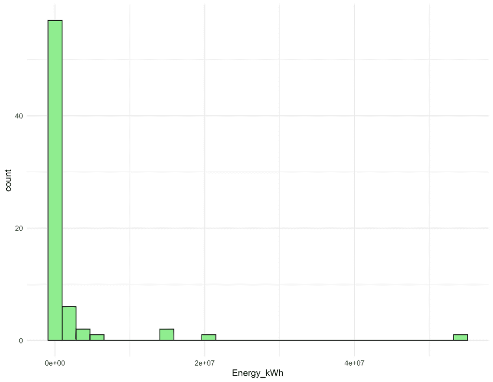

图 1. 能量消耗（千瓦时）的直方图

为了解决这种偏态和异方差性，我的第一个直觉是应用对数变换到能量变量上。对数能量（log(Energy)）的分布看起来更加正常（图 2），Shapiro-Wilk 检验也确认了接近正态性（p ≈ 0.5）。

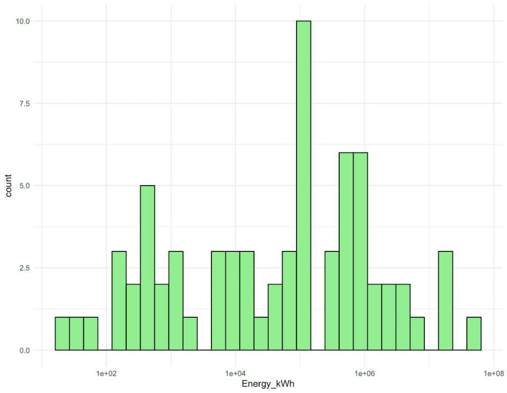

图 2. 能量消耗对数（千瓦时）的直方图

#### **建模困境：对数变换与对数链接**

可视化看起来不错，但当继续建模时，我面临了一个困境：我应该建模**对数变换后的响应变量**（*`log(Y) ~ X`*），还是应该使用**对数链接函数**（*`Y ~ X, link = “log"`*）来建模原始响应变量？我还考虑了两种分布——高斯（正态）分布和伽马分布——并将每种分布与两种对数方法相结合。这给了我四个不同的模型，如下所示，所有模型都使用 R 的广义线性模型（GLM）拟合：

```py
all_gaussian_log_link <- glm(Energy_kWh ~ Parameters +
      Training_compute_FLOP +
      Training_dataset_size +
      Training_time_hour +
      Hardware_quantity +
      Training_hardware, 
    family = gaussian(link = "log"), data = df)
all_gaussian_log_transform <- glm(log(Energy_kWh) ~ Parameters +
                          Training_compute_FLOP +
                          Training_dataset_size +
                          Training_time_hour +
                          Hardware_quantity +
                          Training_hardware, 
                         data = df)
all_gamma_log_link  <- glm(Energy_kWh ~ Parameters +
                    Training_compute_FLOP +
                    Training_dataset_size +
                    Training_time_hour +
                    Hardware_quantity +
                    Training_hardware + 0, 
                  family = Gamma(link = "log"), data = df)
all_gamma_log_transform  <- glm(log(Energy_kWh) ~ Parameters +
                    Training_compute_FLOP +
                    Training_dataset_size +
                    Training_time_hour +
                    Hardware_quantity +
                    Training_hardware + 0, 
                  family = Gamma(), data = df)
```

#### **模型比较：AIC 和诊断图**

我使用赤池信息准则（AIC）比较了这四个模型，它是预测误差的估计量。通常，AIC 越低，模型拟合得越好。

```py
AIC(all_gaussian_log_link, all_gaussian_log_transform, all_gamma_log_link, all_gamma_log_transform)

                           df       AIC
all_gaussian_log_link      25 2005.8263
all_gaussian_log_transform 25  311.5963
all_gamma_log_link         25 1780.8524
all_gamma_log_transform    25  352.5450
```

在这四个模型中，使用对数变换结果的模型的 AIC 值比使用对数链接的模型低得多。由于对数变换模型和对数链接模型之间的 AIC 差异很大（311 和 352 比 1780 和 2005），我还检查了诊断图以进一步验证对数变换模型拟合得更好：

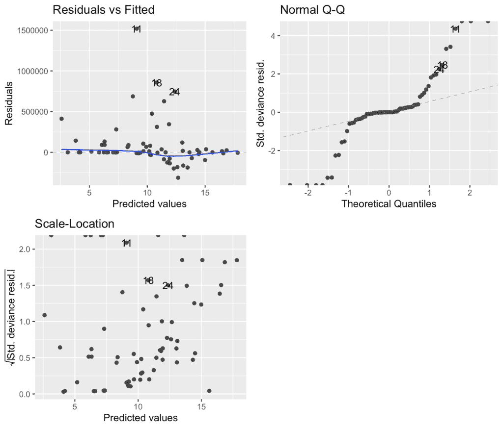

图 4. 对数链接高斯模型的诊断图。残差与拟合图显示尽管有几个异常值，但呈现线性关系。然而，Q-Q 图显示出与理论线的明显偏差，表明非正态性。

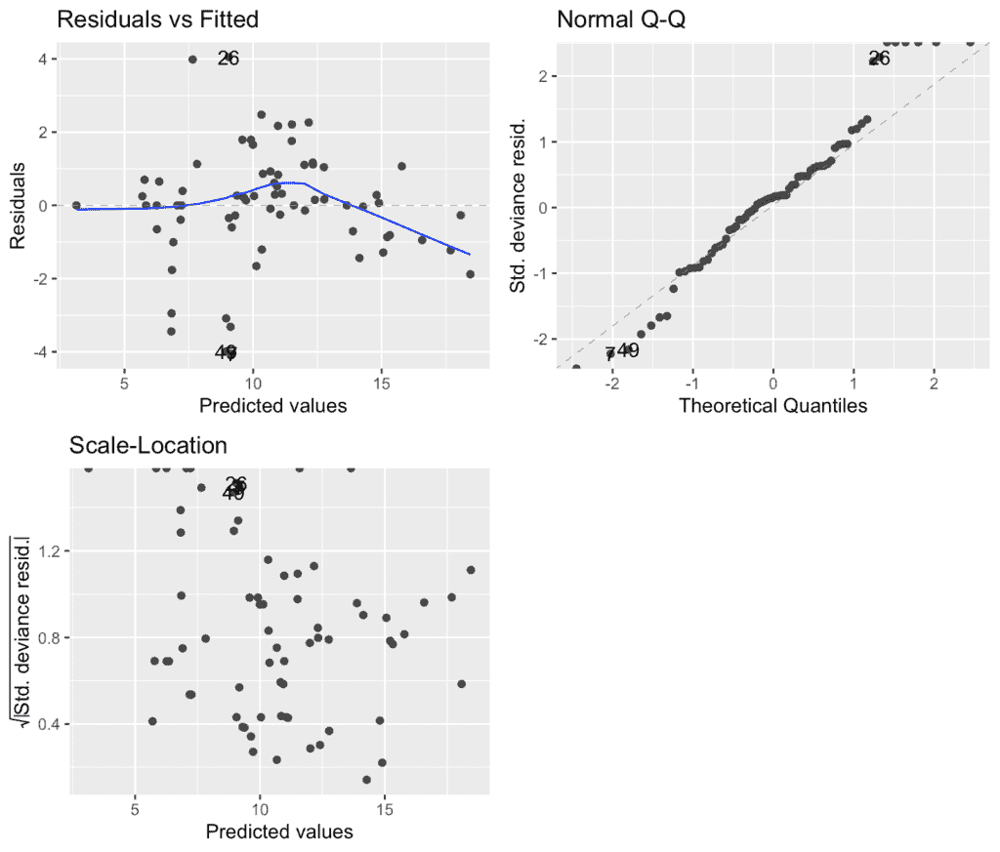

图 5. 对数转换的高斯模型的诊断图。Q-Q 图显示出更好的拟合，支持正态性。然而，残差与拟合图有一个到-2 的凹陷，这可能表明非线性。

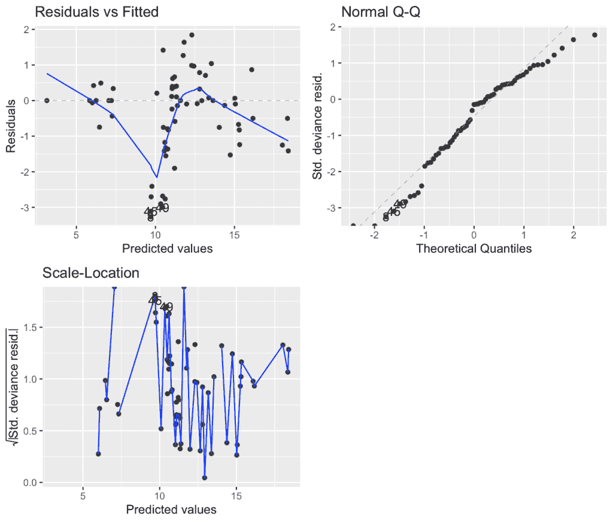

图 6. 对数链接的 Gamma 模型的诊断图。Q-Q 图看起来不错，但残差与拟合图显示出明显的非线性迹象

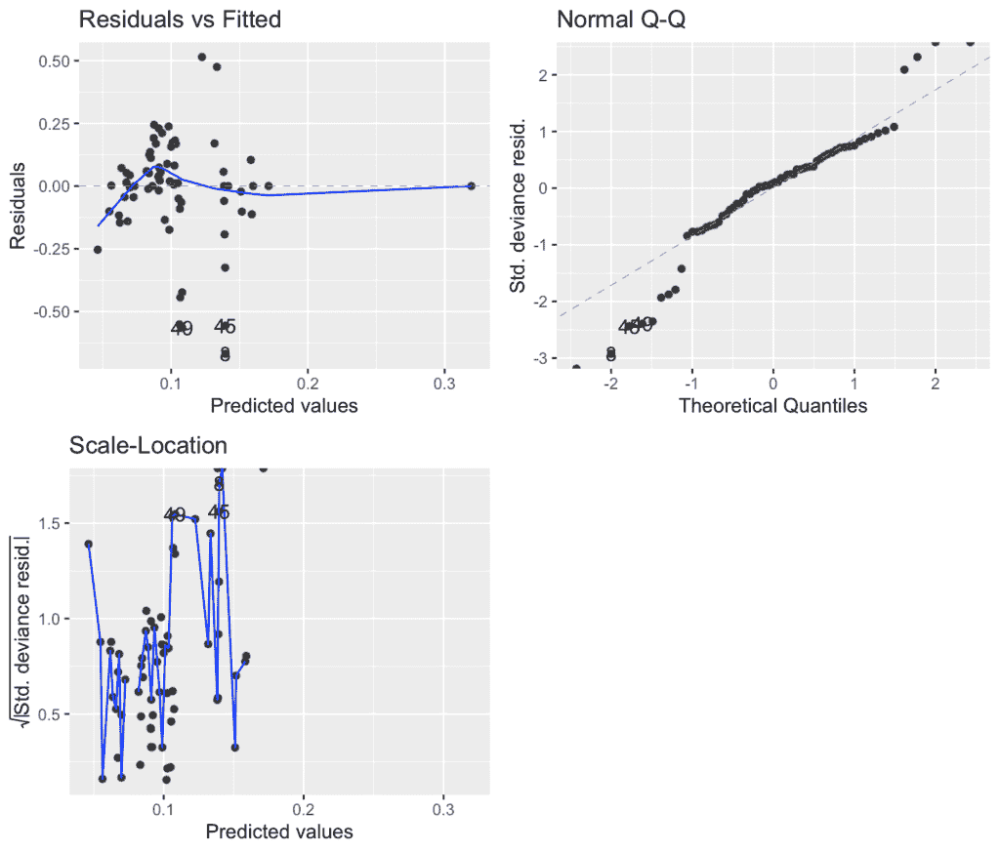

图 7. 对数转换的 Gamma 模型的诊断图。残差与拟合图看起来不错，在开始时有一个-0.25 的小凹陷。然而，Q-Q 图在两端显示出一些偏差。

根据 AIC 值和诊断图，我决定继续使用对数转换的 Gamma 模型，因为它有第二低的 AIC 值，并且其残差与拟合图看起来比对数转换的高斯模型更好。

我继续探索哪些解释变量是有用的，哪些交互可能具有显著性。我选择的最终模型是：

```py
glm(formula = log(Energy_kWh) ~ Training_time_hour * Hardware_quantity + 
    Training_hardware + 0, family = Gamma(), data = df)
```

#### 系数解释

然而，当我开始解释模型的系数时，感觉有些不对劲。由于只有响应变量进行了对数转换，预测变量的效应是乘法的，我们需要对系数进行指数化以将它们转换回原始尺度。𝓍增加一个单位会使结果𝓎乘以 exp(β)，或者说𝓍每增加一个单位会导致𝓎的(exp(β) - 1) × 100%变化 [2]。

看下面模型的成果表，我们有的*Training_time_hour, Hardware_quantity*以及它们的交互项*Training_time_hour:Hardware_quantity*是连续变量，所以它们的系数代表斜率。同时，由于我在模型公式中指定了+0，所有分类的*Training_hardware*的水平都作为截距，这意味着当相应的虚拟变量激活时，每种硬件类型都作为截距β₀。

```py
> glm(formula = log(Energy_kWh) ~ Training_time_hour * Hardware_quantity + 
    Training_hardware + 0, family = Gamma(), data = df)

Coefficients:
                                                 Estimate Std. Error t value Pr(>|t|)    
Training_time_hour                             -1.587e-05  3.112e-06  -5.098 5.76e-06 ***
Hardware_quantity                              -5.121e-06  1.564e-06  -3.275  0.00196 ** 
Training_hardwareGoogle TPU v2                  1.396e-01  2.297e-02   6.079 1.90e-07 ***
Training_hardwareGoogle TPU v3                  1.106e-01  7.048e-03  15.696  < 2e-16 ***
Training_hardwareGoogle TPU v4                  9.957e-02  7.939e-03  12.542  < 2e-16 ***
Training_hardwareHuawei Ascend 910              1.112e-01  1.862e-02   5.969 2.79e-07 ***
Training_hardwareNVIDIA A100                    1.077e-01  6.993e-03  15.409  < 2e-16 ***
Training_hardwareNVIDIA A100 SXM4 40 GB         1.020e-01  1.072e-02   9.515 1.26e-12 ***
Training_hardwareNVIDIA A100 SXM4 80 GB         1.014e-01  1.018e-02   9.958 2.90e-13 ***
Training_hardwareNVIDIA GeForce GTX 285         3.202e-01  7.491e-02   4.275 9.03e-05 ***
Training_hardwareNVIDIA GeForce GTX TITAN X     1.601e-01  2.630e-02   6.088 1.84e-07 ***
Training_hardwareNVIDIA GTX Titan Black         1.498e-01  3.328e-02   4.501 4.31e-05 ***
Training_hardwareNVIDIA H100 SXM5 80GB          9.736e-02  9.840e-03   9.894 3.59e-13 ***
Training_hardwareNVIDIA P100                    1.604e-01  1.922e-02   8.342 6.73e-11 ***
Training_hardwareNVIDIA Quadro P600             1.714e-01  3.756e-02   4.562 3.52e-05 ***
Training_hardwareNVIDIA Quadro RTX 4000         1.538e-01  3.263e-02   4.714 2.12e-05 ***
Training_hardwareNVIDIA Quadro RTX 5000         1.819e-01  4.021e-02   4.524 3.99e-05 ***
Training_hardwareNVIDIA Tesla K80               1.125e-01  1.608e-02   6.993 7.54e-09 ***
Training_hardwareNVIDIA Tesla V100 DGXS 32 GB   1.072e-01  1.353e-02   7.922 2.89e-10 ***
Training_hardwareNVIDIA Tesla V100S PCIe 32 GB  9.444e-02  2.030e-02   4.653 2.60e-05 ***
Training_hardwareNVIDIA V100                    1.420e-01  1.201e-02  11.822 8.01e-16 ***
Training_time_hour:Hardware_quantity            2.296e-09  9.372e-10   2.450  0.01799 *  
---
Signif. codes:  0 '***' 0.001 '**' 0.01 '*' 0.05 '.' 0.1 ' ' 1

(Dispersion parameter for Gamma family taken to be 0.05497984)

    Null deviance:    NaN  on 70  degrees of freedom
Residual deviance: 3.0043  on 48  degrees of freedom
AIC: 345.39
```

在将斜率转换为响应变量的百分比变化时，每个连续变量的效应几乎为零，甚至略为负：


所有截距也被转换回原始尺度上大约 1 千瓦时。结果没有意义，因为至少有一个斜率应该随着巨大的能源消耗而增长。我怀疑使用具有相同预测变量的对数链接模型可能会得到不同的结果，所以我再次拟合了模型：

```py
glm(formula = Energy_kWh ~ Training_time_hour * Hardware_quantity + 
    Training_hardware + 0, family = Gamma(link = "log"), data = df)

Coefficients:
                                                 Estimate Std. Error t value Pr(>|t|)    
Training_time_hour                              1.818e-03  1.640e-04  11.088 7.74e-15 ***
Hardware_quantity                               7.373e-04  1.008e-04   7.315 2.42e-09 ***
Training_hardwareGoogle TPU v2                  7.136e+00  7.379e-01   9.670 7.51e-13 ***
Training_hardwareGoogle TPU v3                  1.004e+01  3.156e-01  31.808  < 2e-16 ***
Training_hardwareGoogle TPU v4                  1.014e+01  4.220e-01  24.035  < 2e-16 ***
Training_hardwareHuawei Ascend 910              9.231e+00  1.108e+00   8.331 6.98e-11 ***
Training_hardwareNVIDIA A100                    1.028e+01  3.301e-01  31.144  < 2e-16 ***
Training_hardwareNVIDIA A100 SXM4 40 GB         1.057e+01  5.635e-01  18.761  < 2e-16 ***
Training_hardwareNVIDIA A100 SXM4 80 GB         1.093e+01  5.751e-01  19.005  < 2e-16 ***
Training_hardwareNVIDIA GeForce GTX 285         3.042e+00  1.043e+00   2.916  0.00538 ** 
Training_hardwareNVIDIA GeForce GTX TITAN X     6.322e+00  7.379e-01   8.568 3.09e-11 ***
Training_hardwareNVIDIA GTX Titan Black         6.135e+00  1.047e+00   5.862 4.07e-07 ***
Training_hardwareNVIDIA H100 SXM5 80GB          1.115e+01  6.614e-01  16.865  < 2e-16 ***
Training_hardwareNVIDIA P100                    5.715e+00  6.864e-01   8.326 7.12e-11 ***
Training_hardwareNVIDIA Quadro P600             4.940e+00  1.050e+00   4.705 2.18e-05 ***
Training_hardwareNVIDIA Quadro RTX 4000         5.469e+00  1.055e+00   5.184 4.30e-06 ***
Training_hardwareNVIDIA Quadro RTX 5000         4.617e+00  1.049e+00   4.401 5.98e-05 ***
Training_hardwareNVIDIA Tesla K80               8.631e+00  7.587e-01  11.376 3.16e-15 ***
Training_hardwareNVIDIA Tesla V100 DGXS 32 GB   9.994e+00  6.920e-01  14.443  < 2e-16 ***
Training_hardwareNVIDIA Tesla V100S PCIe 32 GB  1.058e+01  1.047e+00  10.105 1.80e-13 ***
Training_hardwareNVIDIA V100                    9.208e+00  3.998e-01  23.030  < 2e-16 ***
Training_time_hour:Hardware_quantity           -2.651e-07  6.130e-08  -4.324 7.70e-05 ***
---
Signif. codes:  0 '***' 0.001 '**' 0.01 '*' 0.05 '.' 0.1 ' ' 1

(Dispersion parameter for Gamma family taken to be 1.088522)

    Null deviance: 2.7045e+08  on 70  degrees of freedom
Residual deviance: 1.0593e+02  on 48  degrees of freedom
AIC: 1775
```

这次，*Training_time*和*Hardware_quantity*分别会使总能源消耗每增加一个额外小时增加 0.18%，每增加一个额外芯片增加 0.07%。同时，它们的交互作用会使能源消耗减少 2 × 10⁵%。这些结果更有意义，因为*Training_time*可以达到高达 7000 小时，而*Hardware_quantity*可以达到高达 16000 个单位。

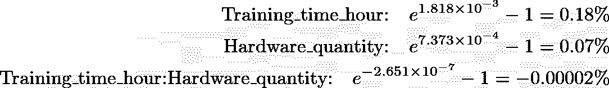

为了更好地可视化差异，我创建了两个图表，比较了两个模型（以虚线表示）的预测结果。左侧面板使用了对数转换的伽马 GLM 模型，其中虚线几乎呈水平且接近零，与原始数据的拟合实线相去甚远。另一方面，右侧面板使用了对数链接的伽马 GLM 模型，其中虚线与实际拟合线更加接近。

```py
test_data <- df[, c("Training_time_hour", "Hardware_quantity", "Training_hardware")]
prediction_data <- df %>%
  mutate(
    pred_energy1 = exp(predict(glm3, newdata = test_data)),
    pred_energy2 = predict(glm3_alt, newdata = test_data, type = "response"),
  )
y_limits <- c(min(df$Energy_KWh, prediction_data$pred_energy1, prediction_data$pred_energy2),
              max(df$Energy_KWh, prediction_data$pred_energy1, prediction_data$pred_energy2))

p1 <- ggplot(df, aes(x = Hardware_quantity, y = Energy_kWh, color = Training_time_group)) +
  geom_point(alpha = 0.6) +
  geom_smooth(method = "lm", se = FALSE) +
  geom_smooth(data = prediction_data, aes(y = pred_energy1), method = "lm", se = FALSE, 
              linetype = "dashed", size = 1) + 
  scale_y_log10(limits = y_limits) +
  labs(x="Hardware Quantity", y = "log of Energy (kWh)") +
  theme_minimal() +
  theme(legend.position = "none") 
p2 <- ggplot(df, aes(x = Hardware_quantity, y = Energy_kWh, color = Training_time_group)) +
  geom_point(alpha = 0.6) +
  geom_smooth(method = "lm", se = FALSE) +
  geom_smooth(data = prediction_data, aes(y = pred_energy2), method = "lm", se = FALSE, 
              linetype = "dashed", size = 1) + 
  scale_y_log10(limits = y_limits) +
  labs(x="Hardware Quantity", color = "Training Time Level") +
  theme_minimal() +
  theme(axis.title.y = element_blank()) 
p1 + p2
```

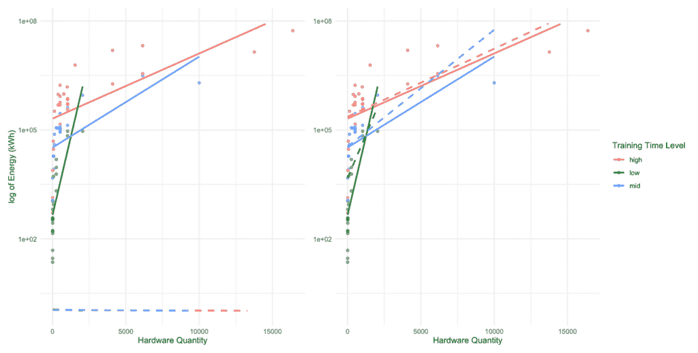

*图 8. 训练时间组之间硬件数量与能耗对数的关系。在两个面板中，原始数据以点表示，实线代表线性模型的拟合值，虚线代表广义线性模型的预测值。左侧面板使用对数转换的伽马 GLM，而右侧面板使用具有相同预测器的对数链接伽马 GLM。*

#### 为什么对数转换失败

要理解为什么对数转换的模型无法像对数链接模型那样捕捉到潜在效应，让我们看看当我们对响应变量应用对数转换时会发生什么：

假设 Y 等于 X 的某个函数加上误差项：

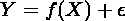

当我们对 Y 应用对数转换时，实际上是在压缩 f(X) 和误差：

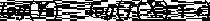

这意味着我们正在对整个新的响应变量进行建模，即 log(Y)。当我们插入自己的函数 g(X)——在我的情况下 *g(X) = 训练时间小时*硬件数量 + 训练硬件——它试图捕捉到“缩小”的 f(X) 和误差项的联合效应。

相比之下，当我们使用对数链接时，我们仍在建模原始 Y，而不是转换后的版本。相反，模型将我们的函数 g(X) 指数化以预测 Y。

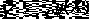

模型随后最小化实际 Y 和预测 Y 之间的差异。这样，误差项在原始尺度上保持完整：

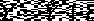

#### 结论

对变量进行对数转换与使用对数链接不同，并且它可能并不总是产生可靠的结果。在底层，对数转换改变了变量本身，并扭曲了变异和噪声。理解你模型背后的这种微妙数学差异与尝试找到最佳拟合模型一样重要。

* * *

[1] Epoch AI. *知名 AI 模型数据*. 从 [`epoch.ai/data/notable-ai-models`](https://epoch.ai/data/notable-ai-models) 获取。

[2] 弗吉尼亚大学图书馆. *在线性模型中解释对数转换*. 从 [`library.virginia.edu/data/articles/interpreting-log-transformations-in-a-linear-model`](https://library.virginia.edu/data/articles/interpreting-log-transformations-in-a-linear-model) 获取。
