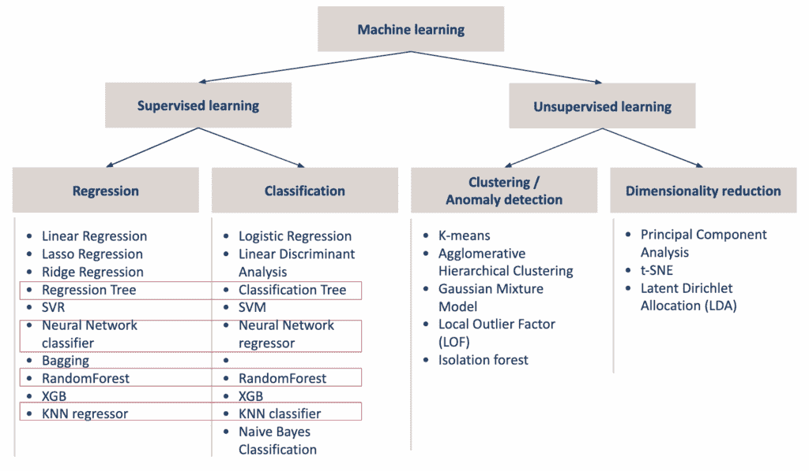
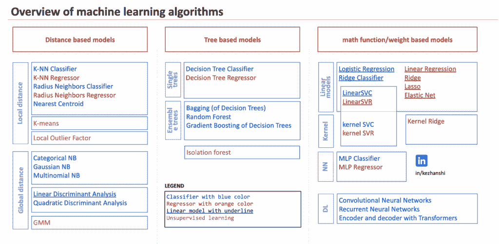
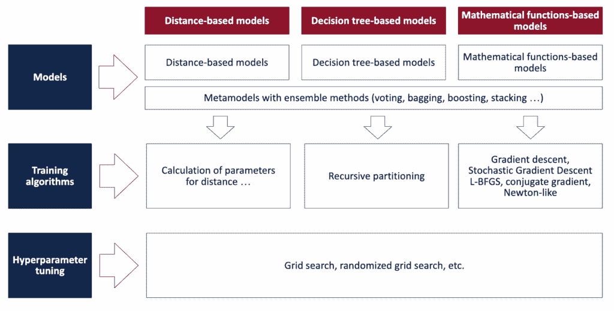

# 机器学习和深度学习“圣诞日历”系列：蓝图

> 原文：[`towardsdatascience.com/machine-learning-and-deep-learning-in-excel-advent-calendar-announcement/`](https://towardsdatascience.com/machine-learning-and-deep-learning-in-excel-advent-calendar-announcement/)

为什么 Excel 是真正理解机器学习模型的最佳方式

### **现代训练中的简单幻觉**

使用 scikit-learn，一切感觉都很简单。

并且训练过程总是以看似相同的方法拟合。因此，我们习惯了这样的想法，即训练任何模型都是相似且简单的。

通过自动机器学习、网格搜索和生成式 AI，使用简单的“提示”就可以“训练”机器学习模型。

但现实是，当我们进行模型拟合时，每个模型背后的过程可能非常不同。每个模型本身与数据的工作方式也非常不同。

### **机器学习中的两种相反趋势**

我们可以观察到两个截然不同的趋势，几乎在两个相反的方向上：

+   一方面，我们使用模型（例如生成模型）进行训练、使用、操作和预测变得越来越复杂。

+   另一方面，我们并不总是能够解释简单的模型（例如线性回归、线性判别分类器），并且手动重新计算结果。

### **为什么理解模型很重要**

理解我们使用的模型很重要。而理解它们最好的方式就是亲自实现它们。有些人用 Python、R 或其他编程语言来做。但对于那些不编程的人来说，仍然存在障碍。而且如今，理解人工智能对每个人来说都是必不可少的。此外，使用编程语言也可能隐藏一些操作在已存在的函数背后。而且它没有视觉上的解释，这意味着每个操作都没有清楚地展示出来，因为函数是编码后运行的，只提供结果。

因此，在我看来，最好的探索工具是 **Excel**。

通过清晰地展示计算每一步的公式。

### **为什么 Excel 是学习机器学习的最佳工具**

事实上，当我们收到一个数据集时，大多数非程序员都会在 Excel 中打开它来了解里面的内容。这在商业界是非常常见的。

即使许多数据科学家，包括我自己，也会使用 Excel 来快速查看。当需要解释结果时，直接在 Excel 中展示通常是最高效的方式，尤其是在面对高管时。

在 Excel 中，一切 **都是可见的**。没有“黑盒”。你可以看到每一个公式，每一个数字，每一次计算。

这有助于更好地理解模型的实际工作原理，而不走捷径。

此外，你不需要安装任何东西。只需一个电子表格。

### **一系列在 Excel 中学习机器学习和深度学习的文章**

我将发布一系列关于如何在 **Excel** 中 **理解**、**实现** 和 **可视化** 机器学习和深度学习模型的文章。

对于“圣诞日历”，我每天将发布一篇文章。

## 这个系列是为谁准备的？

不同的人以非常不同的方式使用机器学习。但它们都面临着相同的问题：理解模型内部真正发生的事情。本系列展示了 Excel 如何为每个受众提供他们需要的清晰度。

### 对于学生：让复杂的公式最终变得有意义

对于正在学习的学生，我认为这些文章提供了一个实用的观点。那就是理解复杂的公式。

学生们经常用大量的代数、矩阵和概率来学习机器学习。

但他们很少“看到”计算发生。

Excel 改变了这一点。

每一步都变得清晰可见。

每个公式都变得具体。

一个看起来很抽象的模型突然变得直观。

对于学生来说，编程技能很棒。但在商业世界中，仅 Python 是不够的来传达。人们立刻就能理解 Excel。它成为连接你的技术技能与真实商业理解的桥梁。

### 对于机器学习和人工智能开发者：打开`model.fit`背后的黑盒

对于机器学习或人工智能开发者来说，他们有时没有学习理论，但现在，没有复杂的代数、概率或统计学，你就可以打开模型.fit 背后的黑盒。因为对于所有模型，你都会做模型.fit。但在现实中，模型可能非常不同。

Excel 展示了隐藏的步骤。

没有复杂的数学。

没有高级符号。

只是一些简单的公式，一个接一个地排列。

因此，你最终可以看到为什么两个模型都使用 `.fit` 但表现完全不同。

对于开发者来说，Python 是运行模型的最佳选择。但在商业世界中，它可能会让你看起来像来自另一个星球的极客。Excel 帮助你清晰地传达你的想法，并搭建与非技术团队的桥梁。

### 对于管理者：直觉优先，然后是更好的决策

这同样适用于可能没有全部技术背景，但 Excel 能给出模型背后所有直观想法的管理者。因此，结合你的业务专业知识，你可以更好地判断机器学习是否真的必要，以及哪种模型可能更合适。

### 对于教师：一个使学习变得简单的工具

教师需要方法来解释困难的概念。

Excel 让学生立即理解：

+   模型计算的内容

+   为什么它会以这种方式工作

+   每个变量如何影响结果

这是一个视觉的、一步一步的课堂。

### 对于初学者：一个友好的起点

对于初学者来说，这是开始的最简单方式。

你经常听到这样的建议：“如果你想学习机器学习，你必须首先学习概率、统计学、线性代数……”

不。

本系列的前提条件要简单得多：你只需要知道加法、乘法以及如何用一个小数据集（10 行，甚至更少）打开电子表格。

因为在这样的小数据集上，你实际上可以跟随每一个计算。你可以理解每个数字的来源。你可以在进行过程中添加自己的列来测试你的想法。

你不需要编程，安装包或配置任何东西。

你只需打开一个工作表。

你可以改变一个数字，并立即看到模型如何反应。

你可以添加一个功能，删除一行，修改标签，重新组织你的工作表，并立即观察结果。

这种直接实验在大多数编程环境中是看不到的。

这也是为什么电子表格对初学者来说如此强大的原因：

它们从一开始就给你正确的直觉，你通过实践学习，而不是通过记忆公式。

### 对于高级用户：Excel 只是一个借口

对于高级用户来说，因为 Excel 只是一个借口，我将揭示许多未教授的课程

对于有经验的人来说，Excel 成为了揭示的方式：

+   模型背后的隐藏逻辑

+   算法之间未教授的联系

+   连接许多技术的常见结构

+   传统机器学习课程中通常被忽视的课程

Excel 简单，但它揭示的是深刻的。

### 对于那些也想提高 Excel 技能的人来说

对于那些想用 Excel 进行数据处理和组织的人来说，这个系列也有帮助。

这不是主要目标，但这是一个练习使用简单公式的机会：**IF、SUM、SUMIF、SUMIFS、SUMPRODUCT、AVERAGE、VLOOKUP**，甚至带有多个条件的 VLOOKUP 等。

你将在实际环境中使用它们，并了解如何构建工作表，以便公式可以扩展。

因为在 Excel 中，人们（包括我自己）倾向于在任何地方进行计算。由于单元格无处不在，公式最终也无处不在。

我的主要关注点实际上是**组织计算**：有时以可视化的方式，有时让公式保持可拖动。

可视化部分构建起来也很痛苦。我实际上使用的是 Google Sheets，其绘图逻辑与 Excel 不同。因此，当你下载文件并在 Excel 中打开时，某些图表可能无法完美工作，因为其底层原理不同。我仍然不完全理解 Excel 如何处理这个问题，但在 Google Sheets 中，我认为我现在理解得更好了。

### **总之**，真正的目标是

这些文章存在的一个原因是：

**为了帮助每个人真正理解模型，它们是如何训练的，如何解释它们，以及不同的算法如何相互连接。**

Excel 是工具。

理解是目标。

因此，总的来说，是为了更好地理解模型、模型的训练、模型的可解释性以及不同模型之间的联系。

记住，在商业世界中，Excel 是一种通用语言。Python 给技术人士留下了深刻印象，但 Excel 是让其他人理解你的东西。它是你的专业知识与实际使用你见解的人之间的桥梁。

## 文章的结构

### **为什么经典机器学习分类不够**

从实践者的角度来看，我们通常将模型分为以下两类：监督学习和无监督学习。

然后对于监督学习，我们有回归和分类。对于无监督学习，我们有聚类和降维。

从实践者的角度概述机器学习模型——图片由作者提供

但你肯定已经注意到，一些算法可能具有相同或类似的方法，例如 KNN 分类器与 KNN 回归器，决策树分类器与决策树回归器，线性回归与“线性分类器”。

回归树和线性回归具有相同的目标，即执行回归任务。但是，当你尝试在 Excel 中实现它们时，你会发现回归树非常接近分类树。而线性回归更接近神经网络。

有时人们会将 K-NN 与 K-means 混淆。有些人可能会争论它们的目标完全不同，混淆它们是初学者的错误。但是，我们也要承认，它们在计算数据点之间距离的方法上是相同的。因此，它们之间存在某种联系。

这同样适用于隔离森林，正如我们可以在随机森林中看到也存在一个“森林”。

### 另一个组织：按理论方法组织的模型

因此，我将从理论角度组织所有模型。有三种主要方法，我们将清楚地看到这些方法如何在 Excel 中以非常不同的方式实现。

这个概述将帮助我们导航所有不同的模型，并在许多模型之间建立联系。

按理论方法组织的机器学习模型概述——图片由作者提供

+   对于基于距离的模型，我们将计算新观测值与训练数据集之间的局部或全局距离。

+   对于基于树的模型，我们必须定义用于对特征进行分类的分割或规则。

+   对于数学函数，想法是应用权重到特征上。而为了训练模型，主要使用梯度下降法。

+   对于深度学习模型，我们将看到主要点是关于特征工程，以创建数据的适当表示。

### 我们将为每个模型解答的关键问题

对于每个模型，我们将尝试回答这些问题。

**关于模型的一般问题：**

+   模型的本质是什么？

+   模型是如何训练的？

+   模型的超参数是什么？

+   同样的模型方法如何用于回归、分类，甚至聚类？

**如何对特征进行建模：**

+   如何处理分类特征？

+   缺失值是如何处理的？

+   对于连续特征，缩放是否有影响？

+   我们如何衡量一个特征的重要性？

我们如何衡量**特征的重要性**？这个问题也将被讨论。你可能知道，像 LIME 和 SHAP 这样的包非常受欢迎，它们是模型无关的。但事实是，每个模型的行为都相当不同，直接用模型进行解释也是很有趣且重要的。

### 模型之间的隐藏联系

每个模型将单独成文，但我们将讨论它们与其他模型之间的联系。

我们还将讨论不同模型之间的关系。因为我们真正打开了每个“黑盒”，我们也将知道如何对某些模型进行理论上的改进。

+   KNN 和 LDA（线性判别分析）非常接近。前者使用局部距离，而后者使用全局距离。

+   梯度提升与梯度下降相同，只是向量空间不同。

+   线性回归也是一种分类器。

+   标签编码可以，某种程度上，用于分类特征，它可以非常有用，非常强大，但你必须明智地选择“标签”。

+   SVM 非常接近线性回归，甚至比岭回归更接近。

+   LASSO 和 SVM 使用一个类似的原则来选择特征或数据点。你知道 LASSO 中的第二个 S 是用于选择吗？

对于每个模型，我们还将讨论一个大多数传统课程会忽略的特定点。我称之为机器学习模型的未教授课程。

### 我们不会涵盖的内容：超参数调整

在这些文章中，我们将只关注模型的工作原理和训练方式。我们不会讨论超参数调整，因为对于每个模型，这个过程本质上都是相同的。我们通常使用网格搜索。

### 在 Ko-fi 上获取 Excel 文件并支持项目

下面将有一个列表，我将通过每天发布一篇文章来更新，从 12 月 1 日开始！

你可以在这个[Kofi 链接](https://ko-fi.com/s/4ddca6dff1)中找到所有的 Excel 文件。如果你想要支持我的工作，这对我很重要。价格将在本月内上涨，所以早期支持者将获得最佳价值。

所有用于机器学习和深度学习的 Excel/Google 表格文件

## 第一部分。基于距离的模型

我们从基于点之间距离的模型开始。它们是直观的，可视的，非常适合 Excel。你将看到像“我的最近邻是谁？”这样简单的东西。

### [**第 1 天：KNN 回归器**](https://towardsdatascience.com/day-1-k-nn-regressor-in-excel-how-distance-drives-prediction/)

因此，首先，在机器学习中，这是最简单的模型。简单到我们可以说：这真的是机器学习吗？

在 model.fit 后面，我们将看到 fit 实际上什么都没做。

未教授的课程：标准化或最小-最大缩放是否总是处理特征尺度的正确方式？

### [**第 2 天：KNN 分类器**](https://towardsdatascience.com/the-machine-learning-advent-calendar-day-2-k-nn-classifier-in-excel/)

KNN 分类器与 KNN 回归器非常相似地工作。

有趣的是，我们可以从局部距离（到附近点的欧几里得距离）移动到全局距离，这推广了通常的 k-NN 概念。

一个缺点是没有变量加权。

我们还将看到与最近中心、高斯朴素贝叶斯等模型的联系…

### [**第 3 天：GNB、LDA 和 QDA**](https://towardsdatascience.com/the-machine-learning-advent-calendar-day-3-gnb-lda-and-qda-in-excel/)

线性判别分析和二次判别分析与 K-NN 分类器非常接近。两者都引入了一种“全局距离”，称为马氏距离，而不是 k-NN 中使用的局部欧几里得距离。

一件额外的事情：核密度估计器也可以用来定制分布的形状。记住这个想法，因为我们稍后会在其他模型中看到它再次出现。

### **[第 4 天：k-means](https://towardsdatascience.com/the-machine-learning-advent-calendar-day-4-k-means-in-excel/)**

K-means 是一个**无监督**模型，它也使用距离。有时它与 k-NN 混淆，你很快就会看到原因。

揭秘：两个**k**并不代表同一件事。

k-means 实际上更接近我们之前看到的其他模型。

### [第 5 天：GMM（高斯混合模型）](https://towardsdatascience.com/the-machine-learning-advent-calendar-day-5-gmm-in-excel/)

GMM 是 k-means 的自然扩展。

K-means 使用欧几里得距离将每个点分配到一个簇中。GMM 分配概率。

簇不再仅仅是中心，它们是具有方差（甚至协方差）的高斯分布。

在 Excel 中，你可以清楚地看到这如何使簇更加灵活，以及为什么公式会迅速变长。

### [**第 9 天**](https://towardsdatascience.com/the-machine-learning-advent-calendar-day-9-lof-in-excel/) [**LOF – 局部异常因子**](https://towardsdatascience.com/the-machine-learning-advent-calendar-day-10-dbscan-in-excel/)

LOF 使用局部密度检测异常。

一个点异常不是因为它离得很远，而是因为它比其邻居的密度小得多。

在 Excel 中，每一步都是可见的：距离、邻居、密度和最终的异常分数。

### [**第 10 天**](https://towardsdatascience.com/the-machine-learning-advent-calendar-day-10-dbscan-in-excel/) **[DBSCAN](https://towardsdatascience.com/the-machine-learning-advent-calendar-day-9-lof-in-excel/)**

DBSCAN 通过密度而不是到中心的距离进行聚类。

密集区域成为簇。稀疏点成为噪声。

它自然地找到任何形状的簇，并同时检测异常值。

## **第二部分：基于树的模型**

这些模型不使用距离或概率。

他们使用**规则**。他们将特征分割成片段。这个系列都是关于**分割**的。

通过逐个堆叠这些规则，我们构建了我们所说的**决策树**。

模型本身不过是一系列规则。这些规则是逐个通过一个简单的标准学到的，该标准在每个步骤中选择最佳的分割。

超参数然后决定模型可以添加多少规则。换句话说，树可以长多深。

### **[第 6 天：**决策树回归器**](https://towardsdatascience.com/the-machine-learning-advent-calendar-day-6-decision-tree-regressor/)**

决策树回归器测试所有可能的分割并计算误差（均方误差）。

在 Excel 中，你会看到一种更简单的方式来表示这个均方误差。

所有的东西都是循环：测试、计算、比较。

当你构建合成表时，每一个分割和每一个决策都变得可见。

在多个特征的情况下，没有任何变化。

重复相同的循环，Excel 清楚地显示了如何将所有分割组合成一个表格。

### **[第 7 天：决策树分类器](https://towardsdatascience.com/the-machine-learning-advent-calendar-day-7-decision-tree-classifier/)**

与回归树具有相同的结构，但目标不同。

我们不是最小化均方误差，而是最小化不纯度（基尼系数或任何有效的替代方案）。

模型只是测试所有可能的分割，测量不纯度，并保留最佳分割。

Excel 使这一点非常清晰：树不会“思考”，它们会尝试一切。

多类分类在概念上很简单。

在 Excel 中，一旦数据结构良好且公式可以拖动，它就变得简单。

### **[第 8 天：隔离森林](https://towardsdatascience.com/the-machine-learning-advent-calendar-day-8-isolation-forest-in-excel/)**

隔离森林通过隔离点而不是建模正常行为来检测异常。

异常更容易分离，因此它们在更少的分割中被隔离。

模型构建随机树并测量每个点被隔离的速度。

在 Excel 中，这使得异常检测变得非常具体：随机分割、路径长度和异常分数变得容易可视化。

## **C 部分. 基于权重的模型**

基于权重的模型都共享相同的核心思想。

它们通过使用权重组合输入特征来生成分数。

每个特征都有一个系数。

模型通过最小化一个损失函数来学习这些系数，该函数衡量预测的错误程度。

训练只是一个优化问题。

计算损失，计算其相对于权重的梯度，并逐步更新它们。

当你在 Excel 中构建这些模型时，这一点变得非常清晰。

没有魔法，只有重复循环的分数、损失和梯度。

### **[第 11 天：线性回归](https://towardsdatascience.com/the-machine-learning-advent-calendar-day-11-linear-regression-in-excel/)**

这是最简单的基于权重的模型。

但掌握基础知识是至关重要的：梯度下降、处理分类特征以及线性回归也可以用作分类器的事实。

这也是重要区别出现的地方：

参数生成模型与参数判别模型。

### **[第 12 天：逻辑回归](https://towardsdatascience.com/the-machine-learning-advent-calendar-day-12-logistic-regression-in-excel/)**

同样的线性分数，但通过 Sigmoid 函数产生概率。

损失变化，逻辑保持不变。

Excel 使得分数、概率、损失和梯度之间的联系非常清晰。

### **[第 13 天：岭回归和 Lasso 回归](https://towardsdatascience.com/the-machine-learning-advent-calendar-day-13-lasso-and-ridge-regression-in-excel/)**

对系数进行惩罚的线性回归。

模型本身没有变化，只是目标函数发生了变化。

在 Excel 中，你可以清楚地看到惩罚是如何缩小权重的。

### **[第 14 天：Softmax 回归](https://towardsdatascience.com/the-machine-learning-advent-calendar-day-14-softmax-regression-in-excel/)**

逻辑回归扩展到多类。

几个线性分数并行计算并归一化为概率。

在 Excel 中，多类逻辑变得异常简单。

### [**第 15 天：支持向量机（SVM**）](https://towardsdatascience.com/the-machine-learning-advent-calendar-day-15-svm-in-excel/)

这将是一个非常不同的解释，不同于通常的“最大间隔”故事。

我们将把 SVM 与您已经了解的模型联系起来：线性回归和逻辑回归。

同样的线性分数，同样的权重，但完全不同的目标。

一旦你看到这个链接，SVM 就不再像是一个特殊的几何技巧，而成为基于权重的模型的自然延续。

### **[第 16 天：核技巧](https://towardsdatascience.com/the-machine-learning-advent-calendar-day-16-kernel-trick-in-excel/)**

核技巧通常被描绘得神秘莫测，但它仅仅是一种观点的改变。

我们没有改变模型，只是改变了相似度计算的方式。

在 Excel 中，你可以清楚地看到非线性决策边界是如何从一个线性算法中产生的。

### [**第 17 天：神经网络回归器**](https://towardsdatascience.com/the-machine-learning-advent-calendar-day-17-neural-network-regressor-in-excel/)

神经网络不是一个新对象，而是简单函数的组合。

线性组合、非线性激活和梯度下降，仅此而已。

当所有内容都在 Excel 中编写时，所谓的黑盒就消失了。

### [**第 18 天：神经网络分类器**](https://towardsdatascience.com/the-machine-learning-advent-calendar-day-18-neural-network-classifier-in-excel/)

分类器版本几乎没有任何变化。

结构保持不变，只是输出和损失函数不同。

这最后一步展示了所有基于权重的模型遵循相同的训练逻辑。

神经网络的分类器版本在实践中更为常用。在 Excel 中处理它有助于建立对为什么通常只需要一个隐藏层以及实际需要多少神经元的直觉。

这不应与深度学习混淆，深度学习依赖于许多隐藏层。

## Part D. 集合模型

### **[第 19 天：Bagging](https://towardsdatascience.com/the-machine-learning-advent-calendar-day-19-bagging-in-excel/)**

Bagging 在自助样本上构建了许多独立的模型，并平均它们的预测。

它的作用简单而有效：在不改变基础模型偏差的情况下减少方差。

它与不稳定的学习者配合得最好，例如决策树，其中小的数据变化会导致非常不同的模型。

我还会谈到随机森林。

### **[第 20 天：梯度提升线性回归](https://towardsdatascience.com/the-machine-learning-advent-calendar-day-20-gradient-boosted-linear-regression-in-excel/)**

这种模型构建主要是一个教学步骤。

目标不是性能，而是用最简单的基模型介绍提升概念。

通过使用线性回归作为弱学习器，重点保持在提升机制本身：残差、增量更新和在函数空间中的损失最小化。

每次迭代都会添加一个新的线性模型，该模型拟合于前一个模型的残差。

### **[第 21 天：梯度提升决策树](https://towardsdatascience.com/the-machine-learning-advent-calendar-day-21-gradient-boosted-decision-tree-regressor-in-excel/)**

这是实际应用中最广泛使用的提升变体。

弱决策树依次添加，每个都纠正前一个集成中的错误。

结果是一个强大的非线性模型，可以自动捕捉交互，具有强大的泛化能力和出色的实际性能。

## 第 E 部分. 深度学习 – 简介

本部分通过少数核心思想介绍深度学习，应用于文本。

目标不是详尽无遗，而是通过使用与系列中其他部分相同的直观、基于电子表格的方法来理解现代深度学习模型的**逻辑**。

本节涵盖了三个互补的想法：

单词如何以数值形式表示，

在文本中如何检测局部模式，

以及如何建模全局上下文。

卷积神经网络在本系列早期已经介绍过，用于**图像**。

（参见*[通过 Excel 理解卷积神经网络（CNNs）](https://towardsdatascience.com/understanding-convolutional-neural-networks-cnns-through-excel/)*）。

在这里，我们关注这些类似机制如何应用于文本，以及如何更近期的架构扩展这些想法。

深度学习需要的空间比日历还要多。

这就是为什么本节仍然是一个简介。

将有一系列专门介绍深度学习的文章，包含更深入的解释和更详细的例子。

### [第 22 天：文本嵌入](https://towardsdatascience.com/the-machine-learning-advent-calendar-day-22-embeddings-in-excel/)

在模型可以从文本中学习之前，单词必须被转换为数字。

这一天展示了单词如何表示为向量，以及意义如何成为模型可以处理的空间几何对象。

### [第 23 天：用于文本分类的 1D CNN](https://towardsdatascience.com/the-machine-learning-advent-calendar-day-23-cnn-in-excel/)

1D 卷积神经网络使用小的滑动窗口扫描句子。

每个过滤器检测简单的局部模式，例如短词序列或表达。

通过结合这些局部信号，模型可以识别更高层次的模式并做出分类决策。

尽管这种方法很简单，但它对于许多文本分类任务非常有效。

### [第 24 天：文本中的变压器](https://towardsdatascience.com/the-machine-learning-advent-calendar-day-24-transformers-for-text-in-excel/)

变压器以不同的方式看待文本。

每个词通过注意力与其他所有词进行交互，使模型能够捕捉全局上下文和长距离依赖关系。

今天的最后一天介绍了变压器背后的核心思想，这是现代大型语言模型的基础。

## 奖金

这个系列并没有在这里结束。

回来获取带有额外示例、澄清和实际扩展的奖金文章。

拜拜，很快见！
