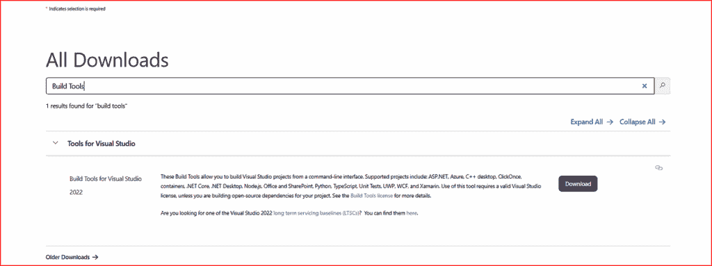
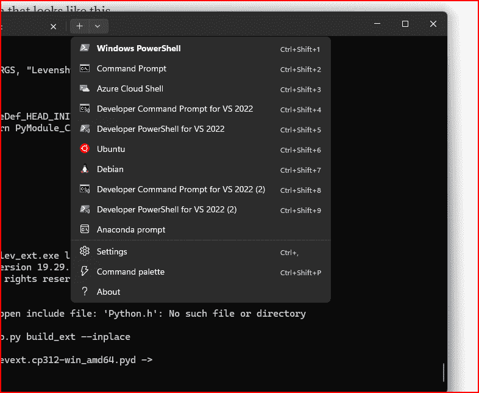

# 使用 C 将 Python 运行速度提高 150 倍

> 原文：[`towardsdatascience.com/make-python-up-to-150x-faster-with-c/`](https://towardsdatascience.com/make-python-up-to-150x-faster-with-c/)

<mdspan datatext="el1762803060797" class="mdspan-comment">如果你是 Python 程序员</mdspan>，迟早你会遇到代码执行速度的瓶颈。如果你曾经用 Python 编写过计算密集型的算法，比如字符串距离、矩阵数学或加密散列，你就会知道我的意思。

当然，有时外部库如 NumPy 可以救你于水火之中，但算法本身是**本质上是顺序的**时会发生什么呢？这正是我想对某个特定算法进行基准测试时遇到的问题，该算法确定将一个字符串转换为另一个字符串所需的编辑次数。

我尝试了 Python。我尝试了 NumPy。然后我转向 C 语言，这是我几十年前在大学里学的，但大约 15 年来一直没有使用过。从这里开始变得有趣。

我首先必须回答这个问题，“你能从 Python 调用 C 语言吗？”。经过一番研究，答案很快就变得清晰，确实**可以**。实际上，你可以用几种方法来实现，在这篇文章中，我将探讨其中三种最常见的方法。

从最简单到最复杂，我们将探讨使用，

+   a subprocess

+   ctypes

+   Python C 扩展

我们将要测试的算法被称为**Levenshtein 距离（LD）算法**。两个单词之间的 Levenshtein 距离是将一个单词转换为另一个单词所需的最小单字符编辑数（插入、删除或替换）。它是以苏联数学家弗拉基米尔·莱文斯坦的名字命名的，他在 1965 年定义了这个度量。它在各种工具中有应用，例如拼写检查器和光学字符识别系统。

为了更清楚地说明我们正在讨论的内容，这里有一些例子。

计算单词“book”和“black”之间的 LD。

1.  book → baok（将“o”替换为“a”）

1.  baok → back（将“c”替换为“o”）

1.  back → black（添加字母“l”）

因此，在这种情况下，LD 是三个。

计算单词“superb”和“super”之间的 LD。

1.  superb → super（删除字母“b”）

在这种情况下，LD 简单地为一个是。

我们将用 Python 和 C 编写 LD 算法，然后设置基准测试来测试使用纯 Python 代码运行它所需的时间与从 Python 中调用 C 代码运行它所需的时间。

## 前提条件

由于我在 MS Windows 上运行这个程序，我需要一种编译 C 程序的方法。我发现最简单的方法是下载 2022 年的 Visual Studio 构建工具。这允许你在命令行上编译 C 程序。

要安装，首先访问主[Visual Studio 下载页面](https://visualstudio.microsoft.com/downloads/)。在第二屏上，你会看到一个搜索框。在搜索字段中输入**“Build Tools”**并点击搜索。搜索应该返回一个看起来像这样的屏幕，



图片由作者提供

点击下载按钮，遵循任何安装说明。一旦安装完成，在 DOS 终端窗口中，当你点击小加号按钮以打开新终端时，你应该会看到一个选项来打开“VS 2022 的开发者命令提示符”。



图片由作者提供

我的大部分 Python 代码将在 Jupyter 笔记本上运行，因此你应该设置一个新的开发环境并安装 Jupyter。如果你想跟上，现在就做。我在这部分使用 UV 工具，但你可以自由地使用你最舒适的方法。

```py
c:\> uv init pythonc
c:\> cd pythonc
c:\> uv venv pythonc
c:\> source pythonc/bin/activate
(pythonc) c:\> uv pip install jupyter
```

## C 中的 LD 算法

根据调用它的方法，我们需要 C 中 LD 算法的不同版本。这是第一个示例的版本，其中我们使用子进程调用 C 可执行文件。

**1/ 子进程: lev_sub.c**

```py
#include <stdio.h>
#include <stdlib.h>
#include <string.h>

static int levenshtein(const char* a, const char* b) {
    size_t n = strlen(a), m = strlen(b);
    if (n == 0) return (int)m;
    if (m == 0) return (int)n;
    int* prev = (int*)malloc((m + 1) * sizeof(int));
    int* curr = (int*)malloc((m + 1) * sizeof(int));
    if (!prev || !curr) { free(prev); free(curr); return -1; }
    for (size_t j = 0; j <= m; ++j) prev[j] = (int)j;
    for (size_t i = 1; i <= n; ++i) {
        curr[0] = (int)i; char ca = a[i - 1];
        for (size_t j = 1; j <= m; ++j) {
            int cost = (ca == b[j - 1]) ? 0 : 1;
            int del = prev[j] + 1, ins = curr[j - 1] + 1, sub = prev[j - 1] + cost;
            int d = del < ins ? del : ins; curr[j] = d < sub ? d : sub;
        }
        int* tmp = prev; prev = curr; curr = tmp;
    }
    int ans = prev[m]; free(prev); free(curr); return ans;
}

int main(int argc, char** argv) {
    if (argc != 3) { fprintf(stderr, "usage: %s <s1> <s2>\n", argv[0]); return 2; }
    int d = levenshtein(argv[1], argv[2]);
    if (d < 0) return 1;
    printf("%d\n", d);
    return 0;
}
```

要编译此代码，启动一个新的 VS Code 2022 开发者命令提示符，并输入以下命令以确保我们正在优化 64 位架构的编译。

```py
(pythonc) c:\> "%VSINSTALLDIR%VC\Auxiliary\Build\vcvarsall.bat" x64
```

接下来，我们可以使用此命令编译我们的 C 代码。

```py
(pythonc) c:\> cl /O2 /Fe:lev_sub.exe lev_sub.c
```

这将创建一个可执行文件。

## 基准测试子进程代码

在 Jupyter 笔记本中，输入以下代码，这将适用于我们所有的基准测试。它生成长度为 N 的随机小写字符串，并计算将 string1 转换为 string2 所需的编辑次数。

```py
# Sub-process benchmark
import time, random, string, subprocess
import numpy as np

EXE = r"lev_sub.exe"  

def rnd_ascii(n):
    return ''.join(random.choice(string.ascii_lowercase) for _ in range(n))

def lev_py(a: str, b: str) -> int:
    n, m = len(a), len(b)
    if n == 0: return m
    if m == 0: return n
    prev = list(range(m+1))
    curr = [0]*(m+1)
    for i, ca in enumerate(a, 1):
        curr[0] = i
        for j, cb in enumerate(b, 1):
            cost = 0 if ca == cb else 1
            curr[j] = min(prev[j] + 1, curr[j-1] + 1, prev[j-1] + cost)
        prev, curr = curr, prev
    return prev[m]
```

接下来是实际的基准测试代码和运行结果。为了运行代码的 C 部分，我们启动一个子进程来执行我们之前创建的编译后的 C 代码文件，并测量其运行所需的时间，并将其与纯 Python 方法进行比较。我们对每种方法使用 2000 和 4000 个随机单词各运行三次，并取最快的那个时间。

```py
def lev_subprocess(a: str, b: str) -> int:
    out = subprocess.check_output([EXE, a, b], text=True)
    return int(out.strip())

def bench(fn, *args, repeat=3, warmup=1):
    for _ in range(warmup): fn(*args)
    best = float("inf"); out_best = None
    for _ in range(repeat):
        t0 = time.perf_counter(); out = fn(*args); dt = time.perf_counter() - t0
        if dt < best: best, out_best = dt, out
    return out_best, best

if __name__ == "__main__":
    cases = [(2000,2000),(4000, 4000)]
    print("Benchmark: Pythonvs C (subprocess)\n")
    for n, m in cases:
        a, b = rnd_ascii(n), rnd_ascii(m)
        py_out, py_t = bench(lev_py, a, b, repeat=3)
        sp_out, sp_t = bench(lev_subprocess, a, b, repeat=3)
        print(f"n={n} m={m}")
        print(f"  Python   : {py_t:.3f}s -> {py_out}")
        print(f"  Subproc  : {sp_t:.3f}s -> {sp_out}\n")
```

这里是结果。

```py
Benchmark: Python vs C (subprocess)

n=2000 m=2000 
  Python   : 1.276s -> 1768
  Subproc  : 0.024s -> 1768

n=4000 m=4000 
  Python   : 5.015s -> 3519
  Subproc  : 0.050s -> 3519
```

这是在 C 的运行时间上相对于 Python 的一个相当显著的改进。

**2\. ctypes: lev.c**

ctypes 是一个直接集成在 Python 标准库中的**外部函数接口（FFI）库**。它允许你从 C（Windows 上的 DLL，Linux 上的.so 文件，macOS 上的.dylib）编写的共享库中加载和调用函数，**直接从 Python 中调用**，无需编写完整的 C 扩展模块。

首先，这是我们的 LD 算法的 C 版本，使用 ctypes。它与我们的子进程 C 函数几乎相同，只是增加了一行，使我们能够在编译后使用 Python 调用 DLL。

```py
/* 
 * lev.c
*/

#include <stdlib.h>
#include <string.h>

/* below line includes this function in the 
 * DLL's export table so other programs can use it.
 */
__declspec(dllexport)

int levenshtein(const char* a, const char* b) {
    size_t n = strlen(a), m = strlen(b);
    if (n == 0) return (int)m;
    if (m == 0) return (int)n;

    int* prev = (int*)malloc((m + 1) * sizeof(int));
    int* curr = (int*)malloc((m + 1) * sizeof(int));
    if (!prev || !curr) { free(prev); free(curr); return -1; }

    for (size_t j = 0; j <= m; ++j) prev[j] = (int)j;

    for (size_t i = 1; i <= n; ++i) {
        curr[0] = (int)i;
        char ca = a[i - 1];
        for (size_t j = 1; j <= m; ++j) {
            int cost = (ca == b[j - 1]) ? 0 : 1;
            int del = prev[j] + 1;
            int ins = curr[j - 1] + 1;
            int sub = prev[j - 1] + cost;
            int d = del < ins ? del : ins;
            curr[j] = d < sub ? d : sub;
        }
        int* tmp = prev; prev = curr; curr = tmp;
    }
    int ans = prev[m];
    free(prev); free(curr);
    return ans;
}
```

当使用 ctypes 在 Python 中调用 C 时，我们需要将我们的 C 代码转换为动态链接库（DLL），而不是可执行文件。以下是构建所需的命令。

```py
(pythonc) c:\> cl /O2 /LD lev.c /Fe:lev.dll
```

## 基准测试 ctypes 代码

在这个代码片段中，我省略了**lev_py**和**rnd_ascii** Python 函数，因为它们与上一个示例中的相同。将这些内容输入到你的笔记本中。

```py
#ctypes benchmark

import time, random, string, ctypes
import numpy as np

DLL = r"lev.dll"  

levdll = ctypes.CDLL(DLL)
levdll.levenshtein.argtypes = [ctypes.c_char_p, ctypes.c_char_p]
levdll.levenshtein.restype  = ctypes.c_int

def lev_ctypes(a: str, b: str) -> int:
    return int(levdll.levenshtein(a.encode('utf-8'), b.encode('utf-8')))

def bench(fn, *args, repeat=3, warmup=1):
    for _ in range(warmup): fn(*args)
    best = float("inf"); out_best = None
    for _ in range(repeat):
        t0 = time.perf_counter(); out = fn(*args); dt = time.perf_counter() - t0
        if dt < best: best, out_best = dt, out
    return out_best, best

if __name__ == "__main__":
    cases = [(2000,2000),(4000, 4000)]
    print("Benchmark: Python vs NumPy vs C (ctypes)\n")
    for n, m in cases:
        a, b = rnd_ascii(n), rnd_ascii(m)
        py_out, py_t = bench(lev_py, a, b, repeat=3)
        ct_out, ct_t = bench(lev_ctypes, a, b, repeat=3)
        print(f"n={n} m={m}")
        print(f"  Python   : {py_t:.3f}s -> {py_out}")
        print(f"  ctypes   : {ct_t:.3f}s -> {ct_out}\n")
```

结果如何？

```py
Benchmark: Python vs C (ctypes)

n=2000 m=2000  
  Python   : 1.258s -> 1769
  ctypes   : 0.019s -> 1769

n=4000 m=4000 
  Python   : 5.138s -> 3521
  ctypes   : 0.035s -> 3521
```

我们的结果与第一个示例非常相似。

**3/ Python C 扩展: lev_cext.c**

当使用 Python C 扩展时，需要做更多的工作。首先，让我们检查 C 代码。基本算法没有改变。只是我们需要添加更多的脚手架，以便代码可以从 Python 中调用。它使用 CPython 的 API (`Python.h`) 来解析 Python 参数，运行 C 代码，并将结果作为 Python 整数返回。

函数 **levext_lev** 作为包装器。它从 Python 中解析两个字符串参数（PyArg_ParseTuple），调用 C 函数 **lev_impl** 来计算距离，处理内存错误，并将结果作为 Python 整数（PyLong_FromLong）返回。方法表将此函数注册为“levenshtein”名称，因此可以从 Python 代码中调用它。最后，PyInit_levext 定义并初始化模块 **levext**，使其可以通过 import levext 命令在 Python 中导入。

```py
#include <Python.h>
#include <string.h>
#include <stdlib.h>

static int lev_impl(const char* a, const char* b) {
    size_t n = strlen(a), m = strlen(b);
    if (n == 0) return (int)m;
    if (m == 0) return (int)n;
    int* prev = (int*)malloc((m + 1) * sizeof(int));
    int* curr = (int*)malloc((m + 1) * sizeof(int));
    if (!prev || !curr) { free(prev); free(curr); return -1; }
    for (size_t j = 0; j <= m; ++j) prev[j] = (int)j;
    for (size_t i = 1; i <= n; ++i) {
        curr[0] = (int)i; char ca = a[i - 1];
        for (size_t j = 1; j <= m; ++j) {
            int cost = (ca == b[j - 1]) ? 0 : 1;
            int del = prev[j] + 1, ins = curr[j - 1] + 1, sub = prev[j - 1] + cost;
            int d = del < ins ? del : ins; curr[j] = d < sub ? d : sub;
        }
        int* tmp = prev; prev = curr; curr = tmp;
    }
    int ans = prev[m]; free(prev); free(curr); return ans;
}

static PyObject* levext_lev(PyObject* self, PyObject* args) {
    const char *a, *b;
    if (!PyArg_ParseTuple(args, "ss", &a, &b)) return NULL;
    int d = lev_impl(a, b);
    if (d < 0) { PyErr_SetString(PyExc_MemoryError, "alloc failed"); return NULL; }
    return PyLong_FromLong(d);
}

static PyMethodDef Methods[] = {
    {"levenshtein", levext_lev, METH_VARARGS, "Levenshtein distance"},
    {NULL, NULL, 0, NULL}
};

static struct PyModuleDef mod = { PyModuleDef_HEAD_INIT, "levext", NULL, -1, Methods };
PyMODINIT_FUNC PyInit_levext(void) { return PyModule_Create(&mod); }
```

由于这次我们不仅构建一个可执行文件，还要构建一个本地的 Python 扩展模块，因此我们必须以不同的方式构建 C 代码。

这种类型的模块必须针对 Python 的头文件进行编译，并适当地链接到 Python 的运行时，以便它表现得像内置的 Python 模块。

为了实现这一点，我们创建了一个名为 setup.py 的 Python 模块，该模块导入 setuptools 库以简化此过程。它自动化：

+   找到 Python.h 的正确包含路径

+   传递正确的编译器和链接器标志

+   生成符合你 Python 版本和平台命名约定的 .pyd 文件

如果使用 **cl** 编译器命令手动执行此操作将会很繁琐且容易出错，因为你必须手动指定所有这些路径和标志。

这里是我们需要的代码。

```py
from setuptools import setup, Extension
setup(
    name="levext",
    version="0.1.0",
    ext_modules=[Extension("levext", ["lev_cext.c"], extra_compile_args=["/O2"])],
)
```

我们使用常规的 Python 命令行来运行它，如下所示。

```py
(pythonc) c:\> python setup.py build_ext --inplace

#output
running build_ext
copying build\lib.win-amd64-cpython-312\levext.cp312-win_amd64.pyd ->
```

## 基准测试 Python C 扩展代码

现在，这是调用我们的 C 语言的 Python 代码。同样，我省略了两个与之前示例中未更改的 Python 辅助函数。

```py
# c-ext benchmark

import time, random, string
import numpy as np
import levext  # make sure levext.cp312-win_amd64.pyd is built & importable

def lev_extension(a: str, b: str) -> int:
    return levext.levenshtein(a, b)

def bench(fn, *args, repeat=3, warmup=1):
    for _ in range(warmup): fn(*args)
    best = float("inf"); out_best = None
    for _ in range(repeat):
        t0 = time.perf_counter(); out = fn(*args); dt = time.perf_counter() - t0
        if dt < best: best, out_best = dt, out
    return out_best, best

if __name__ == "__main__":
    cases = [(2000, 2000), (4000, 4000)]
    print("Benchmark: Python vs NumPy vs C (C extension)\n")
    for n, m in cases:
        a, b = rnd_ascii(n), rnd_ascii(m)
        py_out, py_t = bench(lev_py, a, b, repeat=3)
        ex_out, ex_t = bench(lev_extension, a, b, repeat=3)
        print(f"n={n} m={m} ")
        print(f"  Python   : {py_t:.3f}s -> {py_out}")
        print(f"  C ext    : {ex_t:.3f}s -> {ex_out}\n")
```

这里是输出。

```py
Benchmark: Python vs C (C extension)

n=2000 m=2000  
  Python   : 1.204s -> 1768
  C ext    : 0.010s -> 1768

n=4000 m=4000  
  Python   : 5.039s -> 3526
  C ext    : 0.033s -> 3526
```

因此，这给出了最快的结果。在上述第二个测试用例中，C 版本显示比纯 Python 快 150 多倍。

还不错。

## 但 NumPy 呢？

一些读者可能想知道为什么没有使用 NumPy。嗯，NumPy 对于矢量化数值数组操作非常出色，例如点积，但并非所有算法都能干净地映射到矢量化。计算 Levenshtein 距离是一个本质上顺序的过程，因此 NumPy 并没有提供太多帮助。在这些情况下，通过 **subprocess**、**ctypes** 或 **原生 C 扩展** 跳入 C 可以提供真正的运行时速度提升，同时仍然可以从 Python 中调用。

> *PS. 我使用一些适用于 NumPy 的代码进行了额外的测试，并且并不奇怪，NumPy 的速度与调用的 C 代码一样快。这是预期的，因为 NumPy 在底层使用 C，并且拥有多年的开发和优化。*

## 概述

本文探讨了 Python 开发者如何通过将 C 代码集成到 Python 中，克服计算密集型任务中的性能瓶颈，例如计算**Levenshtein 距离**（一种字符串相似度算法）。虽然像 NumPy 这样的库可以加速向量化操作，但像 Levenshtein 这样的顺序算法通常对 NumPy 的优化无动于衷。

为了解决这个问题，我演示了**三种集成模式**，从最简单到最复杂，允许你从 Python 中调用快速的 C 代码。

**子进程**。将 C 代码编译成可执行文件（例如，使用 gcc 或 Visual Studio Build Tools），然后使用 subprocess 模块从 Python 中运行它。这很容易设置，并且与纯 Python 相比已经显示出巨大的速度提升。

**ctypes**。使用 ctypes 可以让 Python 直接从 C 共享库中加载和调用函数，而无需编写完整的 Python 扩展模块。这使得将性能关键的 C 代码集成到 Python 中变得更加简单和快速，避免了运行外部进程的开销，同时仍然保持你的代码主要在 Python 中。

**Python C 扩展**。使用 CPython API（python.h）在 C 中编写完整的 Python 扩展。这需要更多的设置，但提供了最快的性能和最平滑的集成，允许你像调用本地 Python 函数一样调用 C 函数。

基准测试显示，Levenshtein 算法的 C 实现比纯 Python 快**超过 100 倍**。虽然像**NumPy**这样的外部库在向量化数值操作方面表现出色，但它对本质上顺序的算法（如 Levenshtein）的性能提升并不显著，这使得在这种情况下集成 C 成为更好的选择。

如果你遇到 Python 的性能限制，将繁重的计算卸载到 C 中可以提供巨大的速度提升，这是值得考虑的。你可以从 subprocess 开始，然后转向 ctypes 或完整的 C 扩展，以实现更紧密的集成和更好的性能。

我只概述了三种将 C 代码与 Python 集成最流行的方法，但如果这个话题对你感兴趣，我推荐你阅读其他一些方法。
