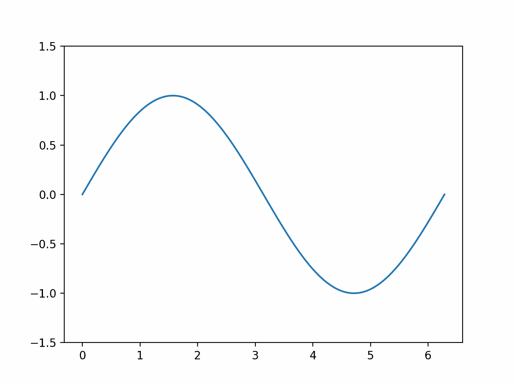
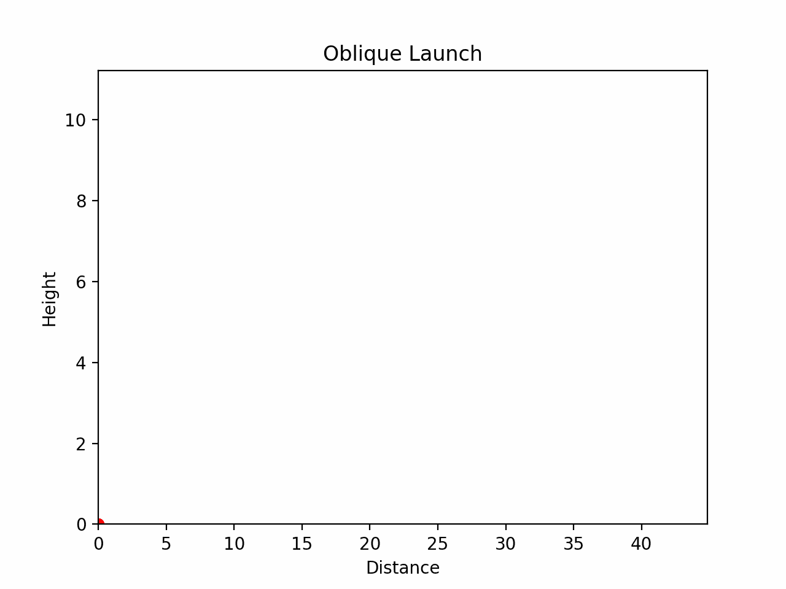
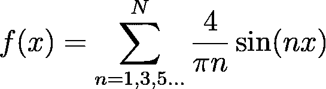
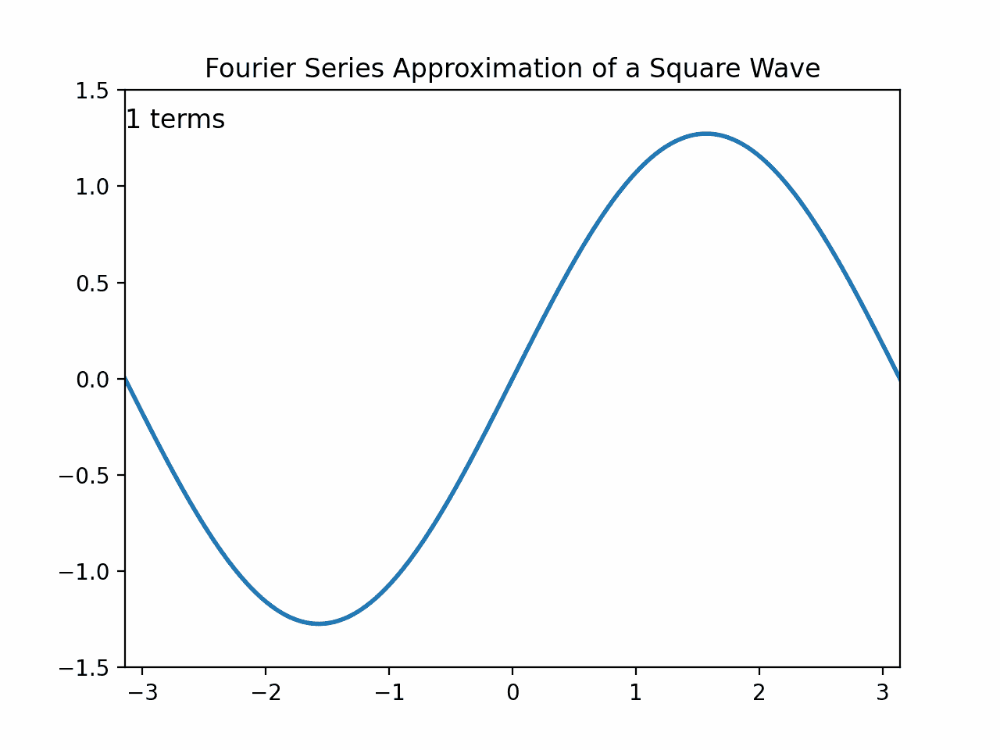
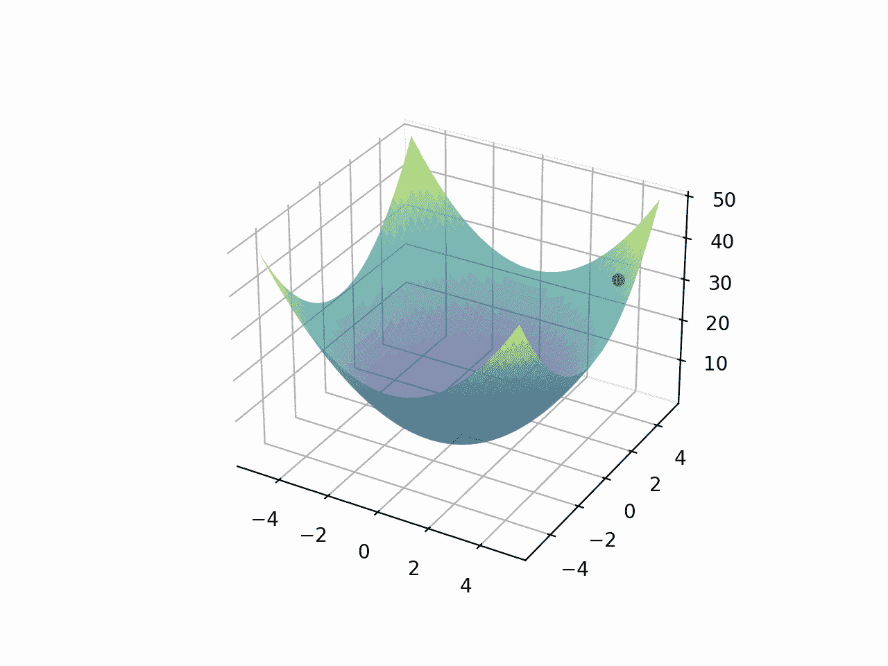

# 让你的数据动起来：使用 Python 为科学和机器学习创建动画

> 原文：[`towardsdatascience.com/make-your-data-move-creating-animations-in-python-for-science-and-machine-learning/`](https://towardsdatascience.com/make-your-data-move-creating-animations-in-python-for-science-and-machine-learning/)

<mdspan datatext="el1746561221147" class="mdspan-comment">作为一名数据科学家和教授，我经常需要解释学习算法和数学概念的内部工作原理，无论是在技术演示、课堂讲座还是书面文章中。在许多情况下，静态图可以显示最终结果，但它们在说明底层过程时往往不够充分。

在这个背景下，动画可以产生显著的影响。通过展示一系列帧，每帧显示代表过程步骤的绘图，你可以更好地吸引观众的注意力，并更有效地解释复杂的概念和工作流程。

本教程将向您展示如何使用 Python 和 Matplotlib 通过动画使科学思想栩栩如生。无论你是可视化机器学习算法的数据科学家、演示谐波运动的高中物理老师，还是旨在直观传达数学的技术作家，本指南都是为你准备的。

我们将探讨以下主题：

1.  使用 Matplotlib 的基本动画设置

1.  数学示例

1.  物理示例

1.  动画机器学习算法

1.  导出动画用于网页和演示

## 1. 使用 Matplotlib 的基本动画设置

让我们通过动画正弦函数来介绍 Matplotlib 动画包中的`FuncAnimation`类。以下步骤几乎可以在每种情况下复制。

+   **导入所需的库**

```py
import numpy as np
import matplotlib.pyplot as plt
from matplotlib.animation import FuncAnimation
```

`FuncAnimation` 类来自 `matplotlib.animation`，它允许你通过重复调用更新函数来创建动画。

+   **定义绘制的数据（正弦函数）**

```py
x = np.linspace(0, 2 * np.pi, 1000)
y = np.sin(x)
```

`y = np.sin(x)` 计算每个 x 值的正弦值。这是将要绘制的初始正弦波。

+   **创建初始绘图**

```py
fig, ax = plt.subplots()
line, = ax.plot(x, y)
ax.set_ylim(-1.5, 1.5)
```

`line, = ax.plot(x, y)` 绘制初始正弦波并将线条对象存储在`line`中。

> **注意**：`line`后面的逗号很重要：它解包了`plot`返回的单元素元组。

+   **定义更新函数**

```py
def update(frame):
    line.set_ydata(np.sin(x + frame / 10))
    return line,
```

`np.sin(x + frame / 10)` 将正弦波水平移动，产生移动波的效果。

+   **创建和显示动画**

```py
ani = FuncAnimation(fig, update, frames=100, interval=50, blit=True)
plt.show()
```

这将所有内容结合起来创建动画：

`fig`: 要动画化的图形。

`update`：调用每个帧的函数。

`frames=100`: 动画中的帧数。

`interval=50`: 帧之间的延迟（以毫秒为单位）（50 ms = 每秒 20 帧）。

`blit=True`: 通过仅重绘变化的绘图部分来优化性能。

+   **结果**



正弦函数示例（图片由作者提供）。

## 2. 动画物理：斜抛

我们将展示如何动画化物理课中的经典示例：斜抛。我们将遵循之前展示的基本示例的类似步骤。

+   **定义运动参数和时间向量**

```py
g = 9.81  # gravity (m/s²)
v0 = 20   # initial velocity (m/s)
theta = np.radians(45)  # launch angle in radians

# total time the projectile will be in the air
t_flight = 2 * v0 * np.sin(theta) / g
# time vector with 100 equally spaced values between 0 and t_flight
t = np.linspace(0, t_flight, 100)
```

+   **计算轨迹**

```py
x = v0 * np.cos(theta) * t # horizontal position at time t
y = v0 * np.sin(theta) * t - 0.5 * g * t**2 # vertical position at time t
```

+   **设置绘图**

```py
fig, ax = plt.subplots()
ax.set_xlim(0, max(x)*1.1)
ax.set_ylim(0, max(y)*1.1)
ax.set_title("Oblique Launch")
ax.set_xlabel("Distance")
ax.set_ylabel("Height")
line, = ax.plot([], [], lw=2)
point, = ax.plot([], [], 'ro')  # red dot for projectile
```

+   **初始化函数**

在此示例中，我们将使用初始化函数将一切设置为零状态。它返回动画期间要更新的绘图元素。

```py
def init():
    line.set_data([], [])
    point.set_data([], [])
    return line, point
```

+   **更新函数和动画**

```py
def update(frame):
    line.set_data(x[:frame], y[:frame])     # trajectory up to current frame
    point.set_data(x[frame], y[frame])      # current projectile position
    return line, point
```

更新函数在每一帧被调用。帧参数索引到时间数组中，因此`x[frame]`和`y[frame]`给出当前坐标。

```py
ani = FuncAnimation(fig, update, frames=len(t), init_func=init, blit=True, interval=30)
```

`frames=len(t)`：动画步骤的总数。

`interval=30`：帧之间的时间（以毫秒为单位）（约 33 fps）。

`blit=True`：通过仅重绘帧中更改的部分来提高性能。

+   **结果**



斜抛（图像由作者提供）。

## 3. 动画数学：傅里叶级数

在以下示例中，我们将展示如何使用傅里叶变换从正弦函数构建方波。

+   **创建 x 值和绘图图形**

```py
x = np.linspace(-np.pi, np.pi, 1000)
y = np.zeros_like(x)
fig, ax = plt.subplots()
line, = ax.plot(x, y, lw=2)

# Setting text labels and axis limits
ax.set_title("Fourier Series Approximation of a Square Wave")
ax.set_ylim(-1.5, 1.5)
ax.set_xlim(-np.pi, np.pi)
text = ax.text(-np.pi, 1.3, '', fontsize=12)
```

`x`：一个从-π到π的 1000 个等间距点的数组，这是周期性傅里叶级数的典型域。

`y`：初始化一个与`x`形状相同的零数组。

+   **定义傅里叶级数函数**

用于傅里叶级数的公式如下：



使用傅里叶级数的前 n 项近似正弦波的公式（作者使用[codecogs](https://editor.codecogs.com/)提供）。

```py
def fourier_series(n_terms):
    result = np.zeros_like(x)
    for n in range(1, n_terms * 2, 2):  # Only odd terms: 1, 3, 5, ...
        result += (4 / (np.pi * n)) * np.sin(n * x)
    return result
```

+   **设置更新函数**

```py
def update(frame):
    y = fourier_series(frame + 1)
    line.set_ydata(y)
    text.set_text(f'{2*frame+1} terms')
    return line, text
```

此函数在动画的每一帧更新绘图：

+   它使用`frame + 1`项计算新的近似值。

+   更新线的 y 值。

+   更新标签以显示使用了多少项（例如，“3 项”，“5 项”等）。

+   返回要重绘的更新后的绘图元素。

+   **创建可视化**

```py
ani = FuncAnimation(fig, update, frames=20, interval=200, blit=True)
plt.show()
```



## 4. 机器学习实战：梯度下降

现在，我们将展示经典机器学习算法如何在三维抛物函数上找到最小值。

```py
import numpy as np
import matplotlib.pyplot as plt
from matplotlib.animation import FuncAnimation

# Define the function and its gradient
def f(x, y):
    return x**2 + y**2

def grad_f(x, y):
    return 2*x, 2*y

# Initialize parameters
lr = 0.1
steps = 50
x, y = 4.0, 4.0  # start point
history = [(x, y)]

# Perform gradient descent
for _ in range(steps):
    dx, dy = grad_f(x, y)
    x -= lr * dx
    y -= lr * dy
    history.append((x, y))

# Extract coordinates
xs, ys = zip(*history)
zs = [f(xi, yi) for xi, yi in history]

# Prepare 3D plot
fig = plt.figure()
ax = fig.add_subplot(111, projection='3d')
X, Y = np.meshgrid(np.linspace(-5, 5, 100), np.linspace(-5, 5, 100))
Z = f(X, Y)
ax.plot_surface(X, Y, Z, alpha=0.6, cmap='viridis')
point, = ax.plot([], [], [], 'ro', markersize=6)
line, = ax.plot([], [], [], 'r-', lw=1)

# Animation functions
def init():
    point.set_data([], [])
    point.set_3d_properties([])
    line.set_data([], [])
    line.set_3d_properties([])
    return point, line

def update(i):
    point.set_data(xs[i], ys[i])
    point.set_3d_properties(zs[i])
    line.set_data(xs[:i+1], ys[:i+1])
    line.set_3d_properties(zs[:i+1])
    return point, line

ani = FuncAnimation(fig, update, frames=len(xs), init_func=init, blit=True, interval=200)
```

+   **结果**



梯度下降的实际应用（图像由作者提供）。

## 5. 导出动画用于网页和演示

最后，要将动画图导出为文件，您可以使用`animation.save()`函数。

+   **示例**

```py
# Export as GIF (optional)
ani.save("launch.gif", writer='pillow', fps=30)
```

在上面的示例中，该函数接受`FuncAnimation`对象，使用 Pillow 库逐帧渲染，并以每秒 30 帧的速度将结果导出为名为`launch.gif`的`.gif`文件。

## 结论

在本文中，我们看到了如何使用 matplotlib 的动画类来演示算法、数学和物理过程的内部工作原理。本文中探讨的示例可以扩展，以创建博客文章、讲座和报告的引人注目的视觉效果。

为了使本文更加有益，我建议使用展示的示例来创建您自己的动画，并模拟您领域相关的过程。

> 查看我的 GitHub 仓库，其中包含完整的代码示例和动画，[在此处](https://github.com/Marcussena/Data_Animation)可获取。

## 参考文献

[1] GeeksforGeeks. *使用 Matplotlib 进行动画*. [`www.geeksforgeeks.org/using-matplotlib-for-animations/`](https://www.geeksforgeeks.org/using-matplotlib-for-animations/)

[2] TutorialsPoint. *Matplotlib – 动画*. [`www.tutorialspoint.com/matplotlib/matplotlib_animations.htm`](https://www.tutorialspoint.com/matplotlib/matplotlib_animations.htm)

[3] Matplotlib 开发团队. *使用 Matplotlib 创建动画*. [`matplotlib.org/stable/users/explain/animations/animations.html`](https://matplotlib.org/stable/users/explain/animations/animations.html)
