# 理解 KPI 变化

> 原文：[`towardsdatascience.com/making-sense-of-kpi-changes/`](https://towardsdatascience.com/making-sense-of-kpi-changes/)

<mdspan datatext="el1746494659669" class="mdspan-comment">作为分析师</mdspan>，我们通常在监控指标。经常发生的是，指标会发生变化。当它们发生变化时，我们的任务是找出原因：为什么转化率突然下降，或者是什么因素推动了持续的收入增长？

我的数据分析之旅始于 KPI 分析师。近三年的时间里，我几乎全职进行根本原因分析和 KPI 深入研究。即使后来转向产品分析，我仍然定期调查 KPI 的变化。可以说，我已经成为了一位经验丰富的分析侦探。

根本原因分析的基础通常是数据切片和切块。通常，找出哪些细分市场推动了变化将为你提供根本原因的线索。因此，在这篇文章中，我想分享一个框架，用于估计不同细分市场如何影响你的关键指标的变化。我们将组合一系列函数来切片和切块我们的数据，并确定指标变化的背后主要驱动因素。

然而，在现实生活中，在开始数据挖掘之前，了解背景非常重要：

+   数据是否完整，我们能否将近期与之前的时间段进行比较？

+   我们在过去是否观察到任何长期趋势和已知的季节性影响？

+   我们最近是否推出了任何新事物，或者我们是否了解任何可能影响我们指标的外部事件，例如竞争对手的市场营销活动或货币波动？

> *我在之前的文章“[“Root Cause Analysis 101”](https://towardsdatascience.com/anomaly-root-cause-analysis-101-98f63dd12016/)中更详细地讨论了这样的细微差别。*

## KPI 变化框架

我们会遇到不同的指标，分析它们的变化需要不同的方法。让我们首先定义我们将要处理的两类指标：

+   **简单指标**代表单一衡量标准，例如，总收入或活跃用户数量。尽管它们很简单，但它们在产品分析中经常被使用。一个常见的例子是北极星指标。好的北极星指标可以估算客户获得的总价值。例如，AirBnB 可能会使用预订的夜晚数，而 WhatsApp 可能会跟踪发送的消息数。这两个都是简单指标。

> *您可以从[Amplitude Playbook](https://amplitude.com/books/north-star)中了解更多关于北极星指标的信息。*

+   然而，我们无法避免使用**复合或比率指标**，如转化率或平均每用户收入（ARPU）。这样的指标帮助我们更精确地跟踪产品性能，并隔离特定变化的影响。例如，想象你的团队正在改进注册页面。他们可以将注册客户的数量作为他们的主要 KPI，但这可能受到外部因素的影响（即，营销活动带来更多流量）。在这种情况下，更好的指标可能是从注册页面着陆到完成注册的转化率。

我们将通过一个虚构的例子来学习如何对不同类型的指标进行根本原因分析。想象我们正在开发一个电子商务产品，我们的团队专注于两个主要的 KPI：

+   **总收入** (*一个简单指标*),

+   **转化为购买**— 已购买用户数与总用户数的比率（*一个比率指标*）。

我们将使用合成数据集来查看指标变化的可能场景。现在，让我们继续看看收入方面的情况。

## 分析：简单指标

让我们从简单开始，深入挖掘收入变化。像往常一样，第一步是加载数据集。我们的数据有两个维度：国家和成熟度（客户是新客户还是现有客户）。此外，我们有三个不同的场景来测试我们的框架在不同条件下的表现。

```py
import pandas as pd
df = pd.read_csv('absolute_metrics_example.csv', sep = '\t')
df.head()
```

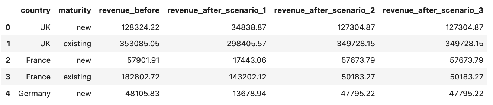

图片由作者提供

我们分析的主要目标是确定每个细分市场如何影响我们的关键指标。让我们将其分解。我们将写下一系列公式。但不用担心，这不需要任何超出基础算术的知识。

首先，了解每个细分市场的指标变化情况，无论是绝对值还是相对数，都是很有帮助的。

\[\textbf{差异}^{\textsf{i}} = \textbf{指标}_{\textsf{之前}}^\textsf{i} – \textbf{指标}_{\textsf{之后}}^\textsf{i}\\

\textbf{差异率}^{\textsf{i}} = \frac{\textbf{差异}^{\textsf{i}}}{\textbf{指标}_{\textsf{之前}}^\textsf{i}}\]

下一步是整体审视，看看每个细分市场如何贡献于指标的整体变化。我们将计算影响作为总差异的份额。

\[\textbf{影响}^{\textsf{i}} = \frac{\textbf{差异}^{\textsf{i}}}{\sum_{\textsf{i}}{\textbf{差异}^{\textsf{i}}}}\]

这已经给我们提供了一些有价值的见解。然而，为了了解是否有任何细分市场表现异常并需要特别关注，将细分市场对指标变化的贡献与其指标初始份额进行比较是有用的。

这里是推理。如果一个细分市场占我们指标 90%，那么它贡献 85-95%的变化是预期的。但如果一个只占 10%的细分市场最终贡献了 90%的变化，那肯定是一个异常情况。

为了计算它，我们将简单地通过初始细分市场的大小来归一化每个细分市场对指标的贡献。

\[\textbf{segment\_share}_{\textsf{before}}^\textsf{i} = \frac{\textbf{metric}_{\textsf{before}}^\textsf{i}}{\sum_{\textsf{i}}{\textbf{metric}_{\textsf{before}}^\textsf{i}}}\\

\textbf{impact\_normalised}^\textsf{i} = \frac{\textbf{impact}^{\textsf{i}}}{\textbf{segment\_share}_{\textsf{before}}^\textsf{i}}\]

公式就到这里。现在，让我们编写代码并看看这种方法在实际中的应用。通过实际例子，这将更容易理解它是如何工作的。

```py
def calculate_simple_growth_metrics(stats_df):
  # Calculating overall stats
  before = stats_df.before.sum()
  after = stats_df.after.sum()
  print('Metric change: %.2f -> %.2f (%.2f%%)' % (before, after, 100*(after - before)/before))

  # Estimating impact of each segment
  stats_df['difference'] = stats_df.after - stats_df.before
  stats_df['difference_rate'] = (100*stats_df.difference/stats_df.before)\
    .map(lambda x: round(x, 2))
  stats_df['impact'] = (100*stats_df.difference / stats_df.difference.sum())\
    .map(lambda x: round(x, 2))
  stats_df['segment_share_before'] = (100* stats_df.before / stats_df.before.sum())\
    .map(lambda x: round(x, 2))
  stats_df['impact_norm'] = (stats_df.impact/stats_df.segment_share_before)\
    .map(lambda x: round(x, 2))

  # Creating visualisations
  create_parallel_coordinates_chart(stats_df.reset_index(), stats_df.index.name)
  create_share_vs_impact_chart(stats_df.reset_index(), stats_df.index.name, 'segment_share_before', 'impact')

  return stats_df.sort_values('impact_norm', ascending = False)
```

我相信，可视化是任何数据故事讲述的关键部分，因为可视化有助于观众更快、更直观地抓住洞察力。这就是为什么我在我们的函数中包含了一些图表：

+   **平行坐标图**用于显示每个切片中指标的变化——这种可视化将帮助我们看到绝对意义上的最大驱动因素。

+   **散点图**用于比较每个细分市场对关键绩效指标的影响与细分市场的初始大小。此图表有助于发现异常——对关键绩效指标影响不成比例大或小的细分市场。

> *您可以在 [GitHub](https://github.com/miptgirl/miptgirl_medium/blob/main/growth_narrative_llm_agent/growth_narrative_utils.py) 上找到可视化代码的完整代码。*

现在我们已经拥有了分析收入数据所需的所有工具，让我们看看我们的框架在不同场景下的表现。

#### 场景 1：所有细分市场的收入均等下降

让我们从第一个场景开始。分析非常直接——我们只需要调用上面定义的函数。

```py
calculate_simple_growth_metrics(
  df.groupby('country')[['revenue_before', 'revenue_after_scenario_1']].sum()\
    .sort_values('revenue_before', ascending = False).rename(
        columns = {'revenue_after_scenario_1': 'after', 
          'revenue_before': 'before'}
    )
)
```

在输出中，我们将得到一个包含详细统计数据的表格。

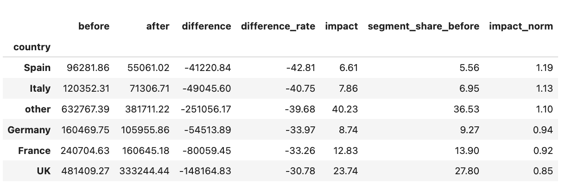

图片由作者提供

然而，在我看来，可视化更有信息量。很明显，所有国家的收入都下降了 30-40%，并且没有异常。

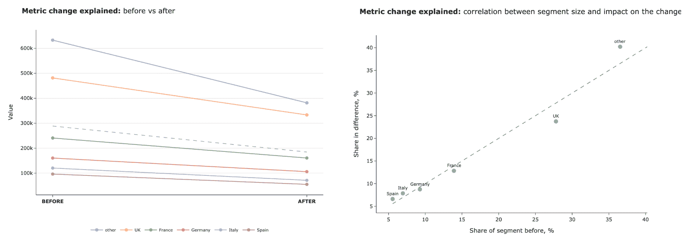

图片由作者提供

#### 场景 2：一个或多个细分市场驱动了变化

让我们通过调用相同的函数来检查另一个场景。

```py
calculate_simple_growth_metrics(
  df.groupby('country')[['revenue_before', 'revenue_after_scenario_2']].sum()\
    .sort_values('revenue_before', ascending = False).rename(
        columns = {'revenue_after_scenario_2': 'after', 
          'revenue_before': 'before'}
    )
)
```

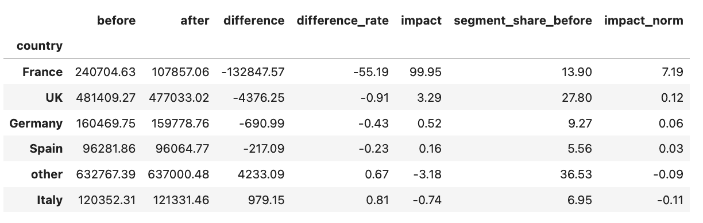

图片由作者提供

我们可以看到，在绝对数和相对数上，法国的下降幅度最大。这绝对是一个异常情况，因为它占到了总指标变化的 99.9%。我们可以在我们的可视化中轻松地发现这一点。

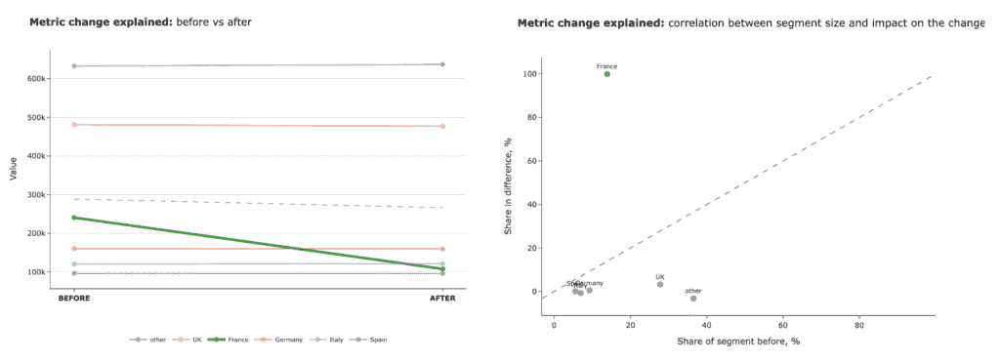

图片由作者提供

此外，值得回顾一下第一个例子。我们按国家划分了指标，发现没有特定的细分市场驱动变化。但深入挖掘可能会帮助我们了解正在发生的事情。让我们尝试添加另一个层次，查看国家和成熟度。

```py
df['segment'] = df.country + ' - ' + df.maturity 
calculate_simple_growth_metrics(
    df.groupby(['segment'])[['revenue_before', 'revenue_after_scenario_1']].sum()\
        .sort_values('revenue_before', ascending = False).rename(
            columns = {'revenue_after_scenario_1': 'after', 'revenue_before': 'before'}
        )
)
```

现在，我们可以看到变化主要是由各国的新增用户驱动的。这些图表清楚地突出了新客户体验中的问题，并为进一步的调查提供了明确的方向。

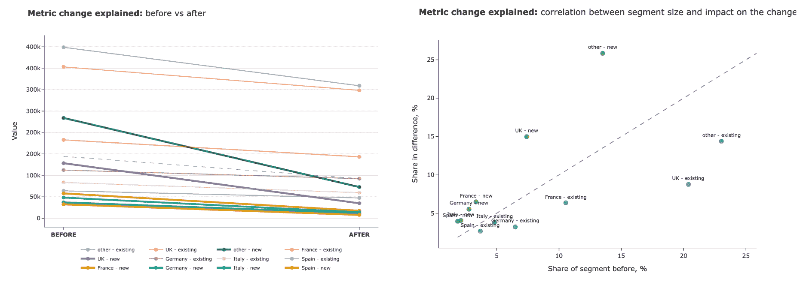

图片由作者提供

#### 场景 3：各部分之间的数量转移

最后，让我们探讨收入方面的最后一种情况。

```py
calculate_simple_growth_metrics(
    df.groupby(['segment'])[['revenue_before', 'revenue_after_scenario_3']].sum()\
        .sort_values('revenue_before', ascending = False).rename(
            columns = {'revenue_after_scenario_3': 'after', 'revenue_before': 'before'}
        )
)
```

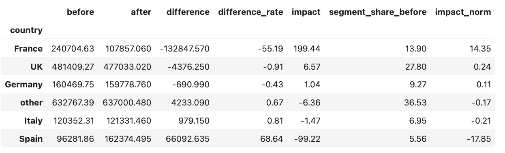

作者提供的图片

我们可以清楚地看到，法国是最大的异常值——法国的收入下降了，这种变化与总收入下降相关。然而，还有一个突出的部分——西班牙。在西班牙，收入显著增加。

这种模式引起了对法国部分收入可能转移到西班牙的怀疑。然而，我们仍然看到总收入指标下降，因此值得进一步调查。实际上，这种情况可能是由于某些地区的数据问题、记录错误或服务不可用（因此客户必须使用 VPN，并在我们的日志中显示为不同的国家）。

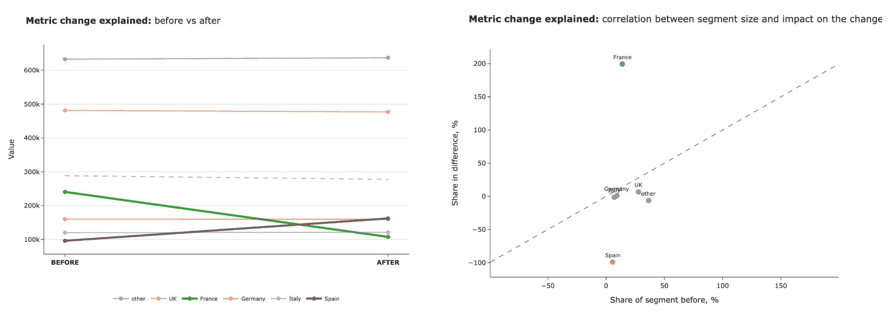

作者提供的图片

我们已经查看了一系列不同的例子，我们的框架帮助我们找到了变化的主要驱动因素。我希望现在已经很清楚如何使用简单指标进行根本原因分析，我们现在可以继续到比率指标。

## 分析：比率指标

产品指标通常是比率，如平均每位客户的收入或转换率。让我们看看我们如何分解这类指标的变化。在我们的案例中，我们将查看转换率。

分析比率指标时，需要考虑两种类型的影响：

+   **一个部分内的变化**，例如，如果法国的客户转换率下降，整体转换率也会下降。

+   **混合变化**，例如，如果新客户的份额增加，而新用户通常转换率较低，这种混合变化也可能导致整体转换率下降。

为了了解发生了什么，我们需要能够区分这些影响。再一次，我们将写出一堆公式来分解和量化每种类型的影响。

让我们从定义一些有用的变量开始。

\[

\textbf{c}_{\textsf{before}}^{\textsf{i}}, \textbf{c}_{\textsf{after}}^{\textsf{i}} – \textsf{已转换用户}\\

\textbf{C}_{\textsf{before}}^{\textsf{total}} = \sum_{\textsf{i}}{\textbf{c}_{\textsf{before}}^{\textsf{i}}}\\

\textbf{C}_{\textsf{after}}^{\textsf{total}} = \sum_{\textsf{i}}{\textbf{c}_{\textsf{after}}^{\textsf{i}}}\\

\textbf{t}_{\textsf{before}}^{\textsf{i}}, \textbf{t}_{\textsf{after}}^{\textsf{i}} – \textsf{总用户}\\

\textbf{T}_{\textsf{before}}^{\textsf{total}} = \sum_{\textsf{i}}{\textbf{t}_{\textsf{before}}^{\textsf{i}}}\\

\textbf{T}_{\textsf{after}}^{\textsf{total}} = \sum_{\textsf{i}}{\textbf{t}_{\textsf{after}}^{\textsf{i}}}

\]

接下来，让我们谈谈**混合变化**的影响。为了隔离这一效应，我们将估计如果所有细分市场的转换率保持不变，整体转换率会如何变化，以及所有其他细分市场的已转换和总用户数的绝对值保持固定。我们将唯一改变的是细分市场 *i* 中的总用户数和已转换用户数。我们将调整它以反映其在整体人口中的新份额。

让我们先计算一下，我们的细分市场中的总用户数需要如何变化才能匹配目标细分市场份额。

\[

\frac{\textbf{t}_{\textsf{after}}^{\textsf{i}}}{\textbf{T}_{\textsf{after}}^{\textsf{total}}} = \frac{\textbf{t}_{\textsf{before}}^{\textsf{i}} + \delta\textbf{t}^{\textsf{i}}}{\textbf{T}_{\textsf{before}}^{\textsf{total}}+ \delta\textbf{t}^{\textsf{i}}} \\

\delta\textbf{t}^{\textsf{i}} = \frac{\textbf{T}_{\textsf{before}}^{\textsf{total}} * \textbf{t}_{\textsf{after}}^{\textsf{i}} – \textbf{T}_{\textsf{after}}^{\textsf{total}} * \textbf{t}_{\textsf{before}}^{\textsf{i}}}{\textbf{T}_{\textsf{after}}^{\textsf{total}} – \textbf{t}_{\textsf{after}}^{\textsf{i}}}

\]

现在，我们可以使用以下公式来估计混合变化影响。

\[

\textbf{混合变化影响} = \frac{\textbf{C}_{\textsf{before}}^{\textsf{total}} + \delta\textbf{t}^{\textsf{i}} * \frac{\textbf{c}_{\textsf{before}}^{\textsf{i}}}{\textbf{t}_{\textsf{before}}^{\textsf{i}}}}{\textbf{T}_{\textsf{before}}^{\textsf{total}} + \delta\textbf{t}^{\textsf{i}}} – \frac{\textbf{C}_{\textsf{before}}^{\textsf{total}}}{\textbf{T}_{\textsf{before}}^{\textsf{total}}}

\]

下一步是估计**细分市场 *i* 中转换率变化的影响**。为了隔离这一效应，我们将保持所有其他细分市场的客户总数和已转换客户数不变。我们只改变细分市场 *i* 中的已转换用户数，以匹配在新的时间点上的目标转换率。

\[

\textbf{细分市场内变化影响} = \frac{\textbf{C}_{\textsf{before}}^{\textsf{total}} + \textbf{t}_{\textsf{before}}^{\textsf{i}} * \frac{\textbf{c}_{\textsf{after}}^{\textsf{i}}}{\textbf{t}_{\textsf{after}}^{\textsf{i}}} – \textbf{c}_{\textsf{before}}^{\textsf{i}}}{\textbf{T}_{\textsf{before}}^{\textsf{total}}} – \frac{\textbf{C}_{\textsf{before}}^{\textsf{total}}}{\textbf{T}_{\textsf{before}}^{\textsf{total}}} \\ = \frac{\textbf{t}_{\textsf{before}}^{\textsf{i}} * \textbf{c}_{\textsf{after}}^{\textsf{i}} – \textbf{t}_{\textsf{after}}^{\textsf{i}} * \textbf{c}_{\textsf{before}}^{\textsf{i}}}{\textbf{T}_{\textsf{before}}^{\textsf{total}} * \textbf{t}_{\textsf{after}}^{\textsf{i}}}

\]

我们不能简单地累加不同类型的影响，因为它们之间的关系不是线性的。这就是为什么我们还需要估计细分市场的综合影响。这将结合上述两个公式，假设我们将匹配细分市场 *i* 中的新转换率和新的细分市场份额。

\[

\textbf{总段变化} = \frac{\textbf{C}_{\textsf{before}}^{\textsf{total}} – \textbf{c}_{\textsf{before}}^{\textsf{i}} + (\textbf{t}_{\textsf{before}}^{\textsf{i}} + \delta\textbf{t}^{\textsf{i}}) * \frac{\textbf{c}_{\textsf{after}}^{\textsf{i}}}{\textbf{t}_{\textsf{after}}^{\textsf{i}}}}{\textbf{T}_{\textsf{before}}^{\textsf{total}} + \delta\textbf{t}^{\textsf{i}}} – \frac{\textbf{C}_{\textsf{before}}^{\textsf{total}}}{\textbf{T}_{\textsf{before}}^{\textsf{total}}}

\]

值得注意的是，这些影响估计并不完全准确（即我们无法直接求和）。然而，它们足够精确，可以做出决策并识别变化的主要驱动因素。

下一步是将所有内容放入代码。我们再次利用可视化：我们已经用于简单指标的关联图和平行坐标图，以及几个瀑布图来按段分解影响。

```py
def calculate_conversion_effects(df, dimension, numerator_field1, denominator_field1, 
                       numerator_field2, denominator_field2):
  cmp_df = df.groupby(dimension)[[numerator_field1, denominator_field1, numerator_field2, denominator_field2]].sum()
  cmp_df = cmp_df.rename(columns = {
      numerator_field1: 'c1', 
      numerator_field2: 'c2',
      denominator_field1: 't1', 
      denominator_field2: 't2'
  })

  cmp_df['conversion_before'] = cmp_df['c1']/cmp_df['t1']
  cmp_df['conversion_after'] = cmp_df['c2']/cmp_df['t2']

  C1 = cmp_df['c1'].sum()
  T1 = cmp_df['t1'].sum()
  C2 = cmp_df['c2'].sum()
  T2 = cmp_df['t2'].sum()

  print('conversion before = %.2f' % (100*C1/T1))
  print('conversion after = %.2f' % (100*C2/T2))
  print('total conversion change = %.2f' % (100*(C2/T2 - C1/T1)))

  cmp_df['dt'] = (T1*cmp_df.t2 - T2*cmp_df.t1)/(T2 - cmp_df.t2)
  cmp_df['total_effect'] = (C1 - cmp_df.c1 + (cmp_df.t1 + cmp_df.dt)*cmp_df.conversion_after)/(T1 + cmp_df.dt) - C1/T1
  cmp_df['mix_change_effect'] = (C1 + cmp_df.dt*cmp_df.conversion_before)/(T1 + cmp_df.dt) - C1/T1
  cmp_df['conversion_change_effect'] = (cmp_df.t1*cmp_df.c2 - cmp_df.t2*cmp_df.c1)/(T1 * cmp_df.t2)

  for col in ['total_effect', 'mix_change_effect', 'conversion_change_effect', 'conversion_before', 'conversion_after']:
      cmp_df[col] = 100*cmp_df[col]

  cmp_df['conversion_diff'] = cmp_df.conversion_after - cmp_df.conversion_before
  cmp_df['before_segment_share'] = 100*cmp_df.t1/T1
  cmp_df['after_segment_share'] = 100*cmp_df.t2/T2
  for p in ['before_segment_share', 'after_segment_share', 'conversion_before', 'conversion_after', 'conversion_diff',
                   'total_effect', 'mix_change_effect', 'conversion_change_effect']:
      cmp_df[p] = cmp_df[p].map(lambda x: round(x, 2))
  cmp_df['total_effect_share'] = 100*cmp_df.total_effect/(100*(C2/T2 - C1/T1))
  cmp_df['impact_norm'] = cmp_df.total_effect_share/cmp_df.before_segment_share

  # creating visualisations
  create_share_vs_impact_chart(cmp_df.reset_index(), dimension, 'before_segment_share', 'total_effect_share')
  cmp_df = cmp_df[['t1', 't2', 'before_segment_share', 'after_segment_share', 'conversion_before', 'conversion_after', 'conversion_diff',
                   'total_effect', 'mix_change_effect', 'conversion_change_effect', 'total_effect_share']]

  plot_conversion_waterfall(
      100*C1/T1, 100*C2/T2, cmp_df[['total_effect']].rename(columns = {'total_effect': 'effect'})
  )

  # putting together effects split by change of mix and conversion change
  tmp = []
  for rec in cmp_df.reset_index().to_dict('records'): 
    tmp.append(
      {
          'segment': rec[dimension] + ' - change of mix',
          'effect': rec['mix_change_effect']
      }
    )
    tmp.append(
      {
        'segment': rec[dimension] + ' - conversion change',
        'effect': rec['conversion_change_effect']
      }
    )
  effects_det_df = pd.DataFrame(tmp)
  effects_det_df['effect_abs'] = effects_det_df.effect.map(lambda x: abs(x))
  effects_det_df = effects_det_df.sort_values('effect_abs', ascending = False) 
  top_effects_det_df = effects_det_df.head(5).drop('effect_abs', axis = 1)
  plot_conversion_waterfall(
    100*C1/T1, 100*C2/T2, top_effects_det_df.set_index('segment'),
    add_other = True
  )

  create_parallel_coordinates_chart(cmp_df.reset_index(), dimension, before_field='before_segment_share', 
    after_field='after_segment_share', impact_norm_field = 'impact_norm', 
    metric_name = 'share of segment', show_mean = False)
  create_parallel_coordinates_chart(cmp_df.reset_index(), dimension, before_field='conversion_before', 
    after_field='conversion_after', impact_norm_field = 'impact_norm', 
    metric_name = 'conversion', show_mean = False)

  return cmp_df.rename(columns = {'t1': 'total_before', 't2': 'total_after'})
```

因此，我们已经完成了理论部分，准备将这个框架应用于实践。我们将加载另一个包含几个场景的数据集。

```py
conv_df = pd.read_csv('conversion_metrics_example.csv', sep = '\t')
conv_df.head()
```

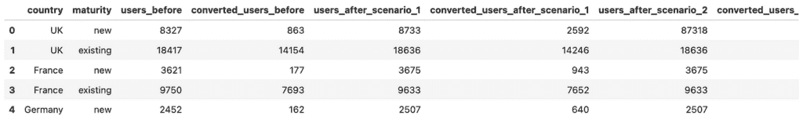

图片由作者提供

#### 场景 1：均匀转化提升

我们将再次调用上面的函数并分析结果。

```py
calculate_conversion_effects(
    conv_df, 'country', 'converted_users_before', 'users_before', 
    'converted_users_after_scenario_1', 'users_after_scenario_1',
)
```

第一个场景相当直接：所有国家的转化率都增加了 4-7 个百分点，从而导致总转化率也相应增加。

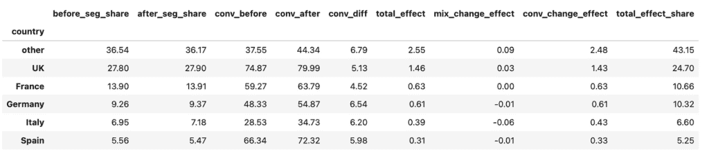

图片由作者提供

我们可以看到在各个段中没有任何异常：影响与段份额相关，并且转化率在所有国家都均匀增加。

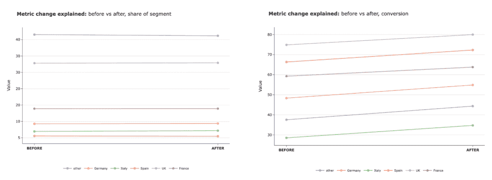

图片由作者提供

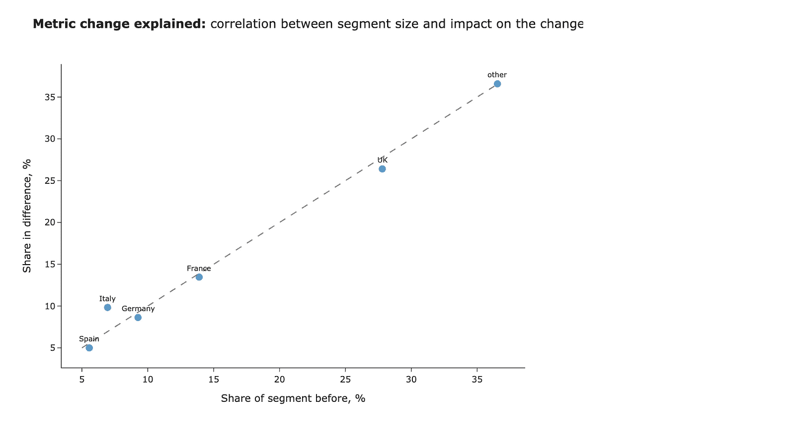

图片由作者提供

我们可以通过瀑布图查看按国家和影响类型划分的变化。尽管影响估计不是累加的，但我们仍然可以使用它们来比较不同部分的影响。

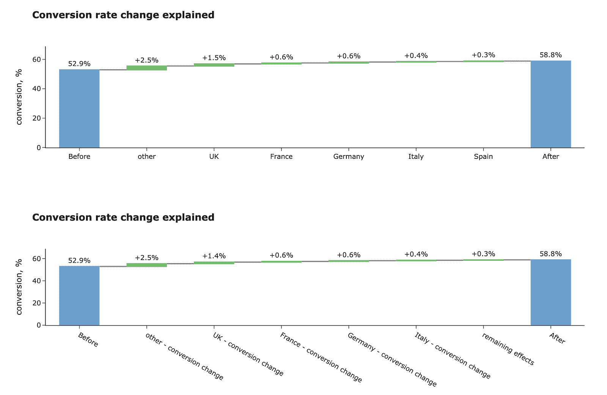

图片由作者提供

建议的框架非常有帮助。我们能够快速弄清楚指标的情况。

#### 场景 2：辛普森悖论

让我们看看一个稍微复杂一些的情况。

```py
calculate_conversion_effects(
    conv_df, 'country', 'converted_users_before', 'users_before', 
    'converted_users_after_scenario_2', 'users_after_scenario_2',
)
```

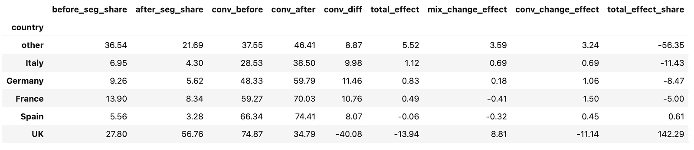

图片由作者提供

这里的情况更加复杂：

+   英国用户的份额有所增加，而该段的转化率显著下降，从 74.9%降至 34.8%。

+   在所有其他国家，转化率增加了 8-11 个百分点。

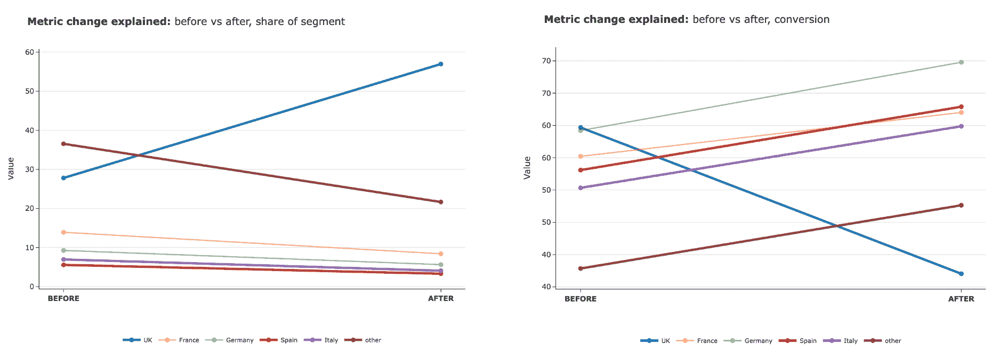

图片由作者提供

毫不奇怪，英国转化率的变化是总指标下降的最大驱动因素。

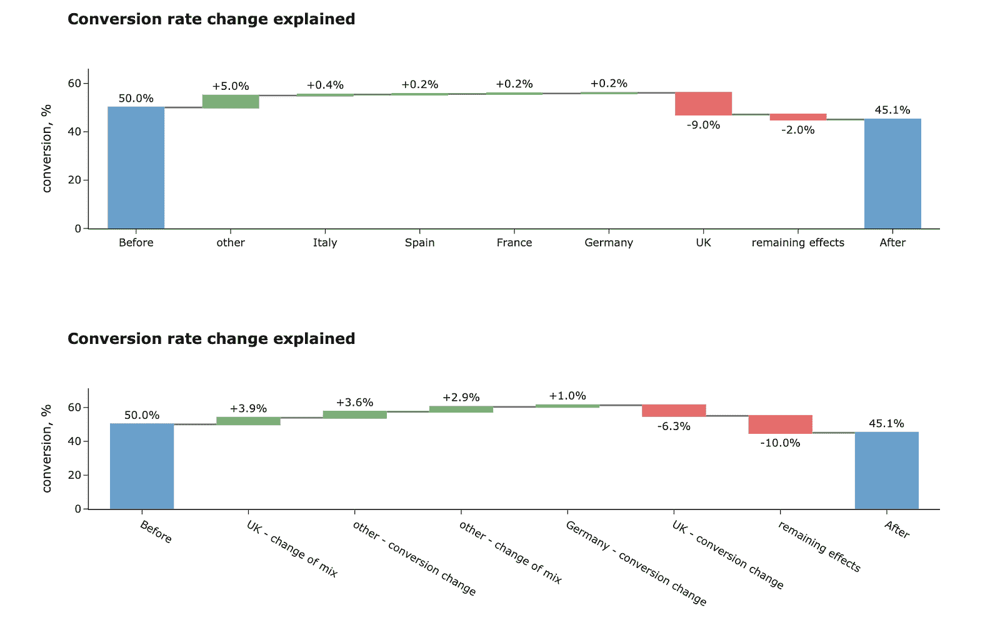

图片由作者提供

在这里我们可以看到一个非线性例子：10%的影响无法由当前的分割解释。让我们深入一层，添加一个成熟度维度。这揭示了真相：

+   转化率实际上在所有细分市场中均匀增长了约 10 个百分点，但总体指标仍然有所下降。

+   主要原因是英国新用户份额的增加，因为这些客户的转化率显著低于平均水平。

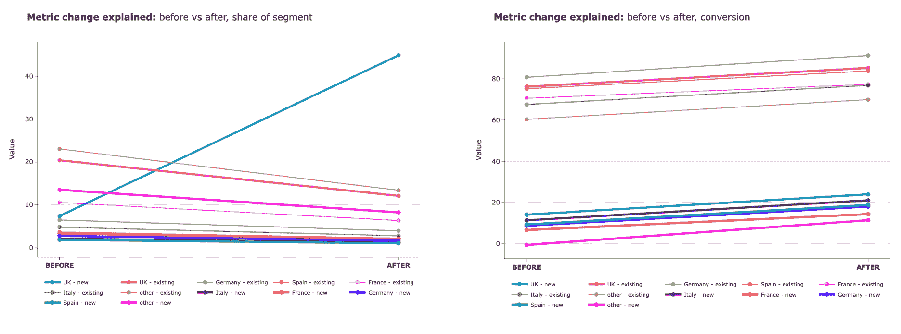

图片由作者提供

这里是按细分市场划分的效果分割。

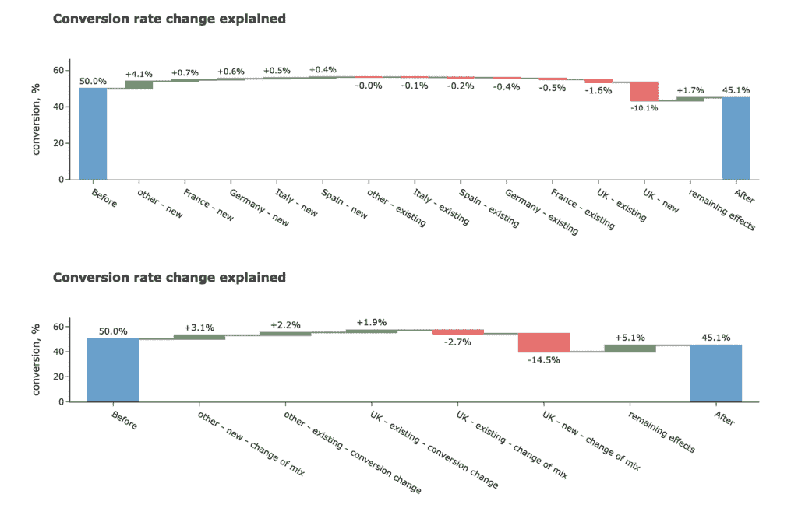

图片由作者提供

这种看似矛盾的现象被称为[辛普森悖论](https://en.wikipedia.org/wiki/Simpson%27s_paradox)。辛普森悖论的一个经典例子来自于 1973 年对伯克利研究生院入学情况的研究。最初，似乎男性比女性有更高的录取机会。然而，当他们查看申请的部门时，发现女性倾向于申请竞争激烈且录取率较低的部门，而男性则倾向于申请竞争不那么激烈的部门。当加入部门作为混杂因素时，数据显示出对女性有微小但显著的偏见。

如往常一样，可视化可以给你一些关于这个悖论如何工作的直观感受。

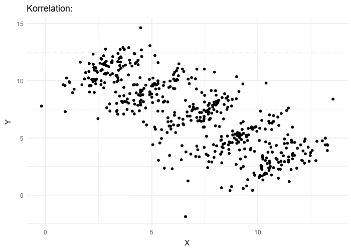

[来源](https://en.wikipedia.org/wiki/Simpson%27s_paradox#/media/File:Simpsons_paradox_-_animation.gif) | 许可证 [CC BY-SA 4.0](https://creativecommons.org/licenses/by-sa/4.0)

就这样。我们学习了如何分解比率指标的变化。

> *你可以在[GitHub](https://github.com/miptgirl/miptgirl_medium/tree/main/growth_narrative_llm_agent)上找到完整的代码和数据。*

## 摘要

这已经是一次漫长的旅程，让我们快速回顾一下在这篇文章中我们涵盖了哪些内容：

+   我们已经确定了两种主要的指标类型：简单指标（如收入或用户数量）和比率指标（如转化率或 ARPU）。

+   对于每种指标类型，我们学习了如何分解变化并识别主要驱动因素。我们制定了一套函数，只需调用几个函数即可找到答案。

使用这个实用的框架，你现在已经完全准备好对任何指标进行根本原因分析了。然而，我们的解决方案仍有改进的空间。在我的下一篇文章中，我将探讨如何构建一个 LLM 代理，为我们完成整个分析和总结。敬请期待！

> *非常感谢您阅读这篇文章。我希望这篇文章对您有所启发。*
