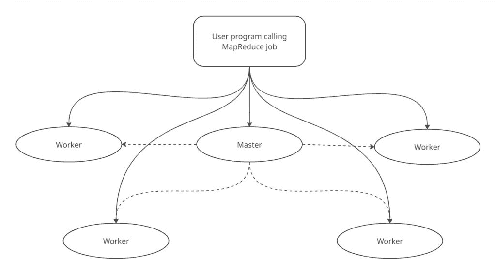
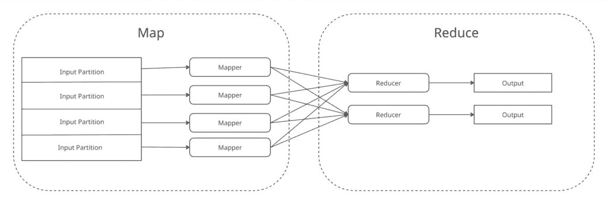
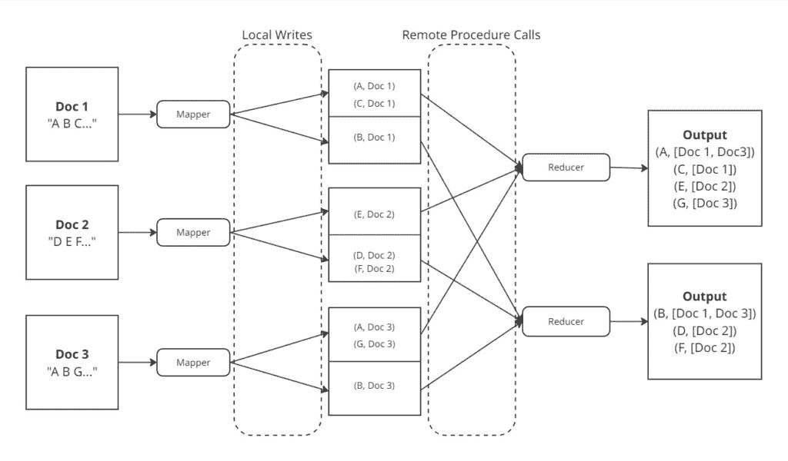
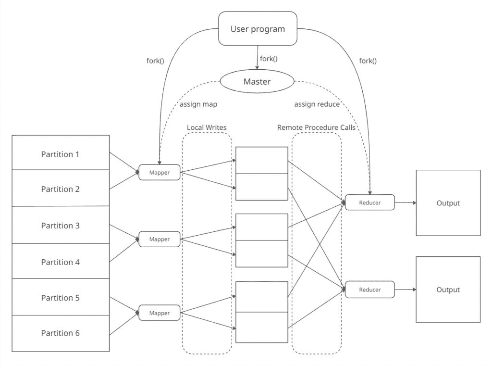

# MapReduce：如何推动可扩展数据处理

> 原文：[`towardsdatascience.com/mapreduce-how-it-powers-scalable-data-processing/`](https://towardsdatascience.com/mapreduce-how-it-powers-scalable-data-processing/)

<mdspan datatext="el1745350024281" class="mdspan-comment">在本文中</mdspan>，我将简要介绍[MapReduce](https://en.wikipedia.org/wiki/MapReduce)编程模型。希望阅读本文后，您能对 MapReduce 是什么，它在可扩展数据处理中扮演的角色，以及何时可以应用它来优化计算任务有一个清晰的理解。

**内容：**

+   **术语与有用背景**

+   **什么是 MapReduce?**

+   **动机与简单示例**

+   **MapReduce 流程**

+   **用代码表达 MapReduce 作业**

+   **MapReduce 贡献与当前状态**

+   **总结**

+   **来源**

* * *

### 术语与有用背景：

以下是阅读本文其余部分之前可能需要了解的一些术语/概念。

+   [分布式计算基础](https://en.wikipedia.org/wiki/Distributed_computing)

+   [Map & reduce 操作](https://web.mit.edu/6.005/www/fa15/classes/25-map-filter-reduce/)

+   [键值数据表示](https://en.wikipedia.org/wiki/Name%E2%80%93value_pair)

+   [Map 数据结构](https://en.wikipedia.org/wiki/Associative_array)

* * *

### 什么是 MapReduce？

MapReduce 是由谷歌几位开发者于 21 世纪初引入的，它是一种编程模型，允许在大规模数据处理中，以并行和分布式的方式在由许多[商用机器](https://www.techtarget.com/whatis/definition/commodity-hardware#:~:text=Commodity%20hardware%20in%20computing%20is,all%20PCs%20use%20commodity%20hardware.)组成的[计算集群](https://en.wikipedia.org/wiki/Computer_cluster)上执行。

MapReduce 编程模型非常适合优化那些可以分解为对输入数据不同分区进行独立转换的计算任务。这些转换通常随后进行[分组聚合](https://pandas.pydata.org/docs/user_guide/groupby.html)。

该编程模型将计算分解为以下两个基本操作：

+   **Map**：给定要处理的输入数据分区，对每个单独的记录进行输入数据的解析。对于每个记录，应用一些用户定义的数据转换来提取一组中间键值对。

+   **Reduce**：对于中间键值对集中的每个不同键，以某种方式聚合值，以生成一组更小的键值对。通常，reduce 阶段的输出是每个不同键的单个键值对。

在这个 MapReduce 框架中，计算被分配到由*N*台具有同质商品硬件的计算集群中，其中*N*在实践中可能是几百或几千。其中一台机器被指定为**master**，所有其他机器都被指定为**workers**。

+   **Master**：通过将 map 和 reduce 任务分配给可用的 worker 来处理任务调度。

+   **Worker**：处理由 master 分配的 map 和 reduce 任务。



MapReduce 集群设置。实线箭头表示[fork()](https://en.wikipedia.org/wiki/Fork_(system_call)#)，虚线箭头表示任务分配。

在 map 或 reduce 阶段内的每个任务都可以在计算集群中可用的工人之间并行和分布式执行。然而，map 和 reduce 阶段是**顺序执行**的——也就是说，所有 map 任务必须完成，然后才能启动 reduce 阶段。



单个 MapReduce 作业执行过程的粗略数据流。

所有这些都可能听起来相当抽象，所以让我们通过一些动机和具体示例来了解 MapReduce 框架如何应用于优化常见的数据处理任务。

* * *

### 动机与简单示例

MapReduce 编程模型通常最适合需要执行独立数据转换的大批量处理任务，这些转换作用于输入数据的不同组，每组通常由键属性的唯一值标识。

你可以将这个框架视为数据分析上下文中[split-apply-combine](https://www.jstatsoft.org/article/view/v040i01)模式的扩展，其中 map 封装了 split-apply 逻辑，reduce 对应于 combine。关键的区别是 MapReduce 可以应用于实现通用计算任务的并行和分布式实现，而不仅仅是数据整理和统计计算。

激励 Google 创建 MapReduce 框架的其中一个数据处理任务是为其搜索引擎构建[索引](https://www.cockroachlabs.com/blog/inverted-indexes/)。

我们可以使用以下逻辑将此任务表示为 MapReduce 作业：

+   将要搜索的语料库划分为单独的分区/文档。

+   定义一个应用于语料库中每个文档的**map()**函数，该函数将为每个分区中解析的每个单词生成<word, documentID>对。

+   对于由 mappers 产生的中间<word, documentID>对集中的每个不同键，应用一个用户定义的**reduce()**函数，该函数将组合与每个单词关联的文档 ID，以生成<word, list(documentIDs)>对。



构建倒排索引的 MapReduce 工作流程。

对于适合 MapReduce 框架的数据处理任务的更多示例，请参阅[原始论文](https://research.google/pubs/mapreduce-simplified-data-processing-on-large-clusters/)。

***

### MapReduce 流程

有许多其他优秀的资源可以介绍 MapReduce 算法的工作原理。然而，我认为这篇文章如果没有介绍这一点就不完整。当然，请参阅[原始论文](https://research.google/pubs/mapreduce-simplified-data-processing-on-large-clusters/)以了解算法的工作原理“真相”。

首先，需要一些基本的配置来准备执行 MapReduce 作业。

+   实现用于处理计算任务特定数据转换和聚合逻辑的**map()**和**reduce()**函数。

+   配置传递给每个 map 任务的输入分区的大小。然后，MapReduce 库将相应地确定要创建和执行的 map 任务数，**M**。

+   配置将要执行的 reduce 任务数，**R**。此外，用户可以指定一个确定性的分区函数来指定键值对如何分配到分区。在实践中，这个分区函数通常是键的哈希函数（即 hash(key) mod **R**）。

+   通常，希望有**细粒度任务**（[`en.wikipedia.org/wiki/Granularity_%28parallel_computing%29#Fine-grained_parallelism`](https://en.wikipedia.org/wiki/Granularity_%28parallel_computing%29#Fine-grained_parallelism)）。换句话说，**M**和**R**应该远大于计算集群中的机器数量。由于 MapReduce 集群中的主节点根据可用性将任务分配给工作节点，将处理工作负载划分为许多任务可以降低单个工作节点过载的可能性。



MapReduce 作业执行（M = 6, R = 2）。

完成所需的配置步骤后，可以执行 MapReduce 作业。MapReduce 作业的执行过程可以分解为以下步骤：

+   将输入数据划分为**M**个分区，其中每个分区与一个 map 工作节点相关联。

+   每个 map 工作节点将应用用户定义的**map()**函数到其数据分区。每个 map 工作节点上这些**map()**函数的执行可以是并行的。**map()**函数将解析其数据分区中的输入记录，并从每个输入记录中提取所有键值对。

+   map 工作节点将按递增的键顺序对这些键值对进行排序。如果需要，如果有多个键值对对应单个键，可以将该键的值合并为一个键值对。

+   这些键值对随后被写入*R*个单独的文件，存储在工作节点的本地磁盘上。每个文件对应一个单独的 reduce 任务。这些文件的位置已注册到 master 节点。

+   当所有 map 任务完成后，master 节点会通知 reducer 工作节点与 reduce 任务关联的中间文件的位置。

+   每个 reduce 任务使用[远程过程调用](https://en.wikipedia.org/wiki/Remote_procedure_call)来读取存储在 mapper 工作节点本地磁盘上的与任务关联的中间文件。

+   reduce 任务随后遍历中间输出中的每个键，然后对中间输出中的每个不同键及其相关值集应用用户定义的**reduce()**函数。

+   一旦所有 reduce 工作节点完成，master 工作节点会通知用户程序 MapReduce 作业已完成。MapReduce 作业的输出将可用在*R*个输出文件中，这些文件存储在分布式文件系统中。用户可以直接访问这些文件，或者将它们作为输入文件传递给另一个 MapReduce 作业以进行进一步处理。

* * *

### 用代码表达 MapReduce 作业

现在让我们看看如何使用 MapReduce 框架来优化常见的数据工程工作负载——清洗/标准化大量原始数据，或者典型[ETL 工作流程](https://www.bigdataframework.org/knowledge/etl-in-data-engineering/#:~:text=in%20Data%20Engineering-,Introduction%20to%20ETL,Adding%20additional%20data%20or%20context.)的转换阶段。

假设我们负责管理与用户注册系统相关的数据。我们的数据模式可能包含以下信息：

+   用户姓名

+   加入日期

+   居住地状态

+   电子邮件地址

原始数据的示例转储可能看起来像这样：

```py
John Doe , 04/09/25, il, [[email protected]](/cdn-cgi/l/email-protection)
 jane SMITH, 2025/04/08, CA, [[email protected]](/cdn-cgi/l/email-protection)
 JOHN  DOE, 2025-04-09, IL, [[email protected]](/cdn-cgi/l/email-protection)
 Mary  Jane, 09-04-2025, Ny, [[email protected]](/cdn-cgi/l/email-protection)
    Alice Walker, 2025.04.07, tx, [[email protected]](/cdn-cgi/l/email-protection)
   Bob Stone  , 04/08/2025, CA, [[email protected]](/cdn-cgi/l/email-protection)
 BOB  STONE , 2025/04/08, CA, [[email protected]](/cdn-cgi/l/email-protection)
```

在使这些数据可用于分析之前，我们可能希望将数据转换成干净、标准化的格式。

我们希望解决以下问题：

+   名称和状态的大小写不一致。

+   日期格式各不相同。

+   一些字段包含多余的空白字符。

+   某些用户存在重复条目（例如：John Doe, Bob Stone）。

我们希望最终输出看起来像这样。

```py
alice walker,2025-04-07,TX,[[email protected]](/cdn-cgi/l/email-protection)
bob stone,2025-04-08,CA,[[email protected]](/cdn-cgi/l/email-protection)
jane smith,2025-04-08,CA,[[email protected]](/cdn-cgi/l/email-protection)
john doe,2025-09-04,IL,[[email protected]](/cdn-cgi/l/email-protection)
mary jane,2025-09-04,NY,[[email protected]](/cdn-cgi/l/email-protection)
```

我们想要执行的数据转换很简单，我们可以编写一个简单的程序来解析原始数据，并以串行方式对每行数据应用所需的转换步骤。然而，如果我们处理的是数百万或数十亿条记录，这种方法可能相当耗时。

相反，我们可以使用 MapReduce 模型将我们的数据转换应用于原始数据的各个分区，然后通过丢弃中间结果中出现的任何重复条目来“聚合”这些转换后的输出。

有许多库/框架可用于将程序表达为 MapReduce 作业。在我们的例子中，我们将使用[mrjob](https://mrjob.readthedocs.io/en/latest/)库将我们的数据转换程序作为 Python 中的 MapReduce 作业来表示。

mrjob 简化了编写 MapReduce 的过程，因为开发者只需在一个 Python 类中提供 mapper 和 reducer 逻辑的实现。尽管它已经不再处于积极开发状态，并且可能无法达到允许在 Hadoop 上部署作业的其他选项（因为它是在 Hadoop API 上的 Python 包装器）相同的性能水平，但对于熟悉 Python 的人来说，这是一个开始学习如何编写 MapReduce 作业并识别如何将计算分解为 map 和 reduce 任务的好方法。

使用 mrjob，我们可以通过继承 MRJob 类并重写 **mapper()** 和 **reducer()** 方法来编写一个简单的 MapReduce 作业。

我们的 **mapper()** 将包含我们想要应用于每个输入记录的数据转换/清理逻辑：

+   将名称和状态分别标准化为小写和大写。

+   将日期标准化为 %Y-%m-%d 格式。

+   去除字段周围的无关空白。

在将数据转换应用于每条记录之后，我们可能会发现某些用户存在重复条目。我们的 **reducer()** 实现将消除出现的这些重复条目。

```py
from mrjob.job import MRJob
from mrjob.step import MRStep
from datetime import datetime
import csv
import re

class UserDataCleaner(MRJob):

   def mapper(self, _, line):
       """
       Given a record of input data (i.e. a line of csv input),
       parse the record for <Name, (Date, State, Email)> pairs and emit them.

       If this function is not implemented,
       by default, <None, line> will be emitted.
       """
       try:
           row = next(csv.reader([line])) # returns row contents as a list of strings ("," delimited by default)

           # if row contents don't follow schema, don't extract KV pairs
           if len(row) != 4:
               return

           name, date_str, state, email = row

           # clean data
           name = re.sub(r'\s+', ' ', name).strip().lower() # replace 2+ whitespaces with a single space, then strip leading/trailing whitespace
           state = state.strip().upper()
           email = email.strip().lower()
           date = self.normalize_date(date_str)

           # emit cleaned KV pair
           if name and date and state and email:
               yield name, (date, state, email)
       except: 
           pass # skip bad records

   def reducer(self, key, values):
       """
       Given a Name and an iterator of (Date, State, Email) values associated with that key,
       return a set of (Date, State, Email) values for that Name.

       This will eliminate all duplicate <Name, (Date, State, Email)> entries.
       """
       seen = set()
       for value in values:
           value = tuple(value)
           if value not in seen:
               seen.add(value)
               yield key, value

   def normalize_date(self, date_str):
       formats = ["%Y-%m-%d", "%m-%d-%Y", "%d-%m-%Y", "%d/%m/%y", "%m/%d/%Y", "%Y/%m/%d", "%Y.%m.%d"]
       for fmt in formats:
           try:
               return datetime.strptime(date_str.strip(), fmt).strftime("%Y-%m-%d")
           except ValueError:
               continue
       return ""

if __name__ == '__main__':
   UserDataCleaner.run()
```

这只是一个使用 mrjob 框架表达简单数据转换任务的例子。对于无法用单个 MapReduce 作业表达更复杂的数据处理任务，mrjob 通过允许开发者编写多个 **mapper()** 和 **producer()** 方法，并定义一系列 mapper/producer 步骤以产生所需输出，来支持这一点。[mrjob 支持](https://mrjob.readthedocs.io/en/latest/guides/quickstart.html#writing-your-second-job)。

默认情况下，mrjob 在单个进程中执行你的作业，因为这允许友好的开发、测试和调试。当然，mrjob 支持在多种平台上执行 MapReduce 作业（Hadoop、Google Dataproc、Amazon EMR）。值得注意的是，初始集群设置的开销可能相当大（约 5+ 分钟，取决于平台和多种因素），但当在真正的大型数据集（10+ GB）上执行 MapReduce 作业时，在这些平台之一上部署作业将节省大量时间，因为相对于单机上的执行时间，初始设置的开销相对较小。

如果你想进一步探索其功能，请查看 [mrjob 文档](https://mrjob.readthedocs.io/en/latest/) :) 

* * *

### MapReduce：贡献与当前状态

MapReduce 对可扩展、数据密集型应用程序的发展做出了重大贡献，主要原因如下：

+   作者认识到，起源于函数式编程的原始操作（[map 和 reduce](https://www.cs.cornell.edu/courses/cs3110/2014sp/lectures/5/map-fold-map-reduce.html)），可以串联起来完成许多大数据任务。

+   它抽象掉了在分布式系统上执行这些操作所遇到的[困难](https://aws.amazon.com/builders-library/challenges-with-distributed-systems/)。

MapReduce 之所以有影响力，并不是因为它引入了新的原始概念。相反，MapReduce 之所以有影响力，是因为它将这些映射和归约原始概念封装到一个库中，该库自动处理来自管理分布式系统（如[任务调度](https://en.wikipedia.org/wiki/Scheduling_%28computing%29)和[容错](https://en.wikipedia.org/wiki/Fault_tolerance)）的挑战。这些抽象使得经验不足的分布式编程开发者能够高效地编写并行程序。

有来自数据库社区的[反对者](https://www.cs.utexas.edu/~rossbach/cs380p/papers/dewitt08blog-mapreduce-backwards.pdf)，他们对 MapReduce 框架的新颖性持怀疑态度——在 MapReduce 之前，已经存在关于[并行数据库系统](https://dl.acm.org/doi/10.1145/129888.129894)的研究，这些研究探讨了如何实现分析 SQL 查询的并行和分布式执行。然而，MapReduce 通常与分布式文件系统集成，无需对数据进行模式约束，并且它为开发者提供了在**map()**和**reduce()**中实现自定义数据处理逻辑（例如：机器学习工作负载、图像处理、网络分析）的自由，这些逻辑仅通过 SQL 查询是无法表达的。这些特性使得 MapReduce 能够编排通用程序的并行和分布式执行，而不是仅限于声明性 SQL 查询。

所有这些都被说过了，MapReduce 框架不再是大多数现代大规模数据处理任务的首选模型。

它因其某种程度上[限制性](https://www.the-paper-trail.org/post/2014-06-25-the-elephant-was-a-trojan-horse-on-the-death-of-map-reduce-at-google/)而被批评，即要求计算过程被转换为映射和归约阶段，并且在将中间数据在映射器和归约器之间传输之前需要将其实体化。实体化中间结果可能会导致 I/O 瓶颈，因为所有映射器必须在归约阶段开始之前完成其处理。此外，复杂的数据处理任务可能需要将许多 MapReduce 作业串联起来并顺序执行。

现代框架，如 Apache Spark，通过选择更灵活的[DAG 执行模型](https://blog.devgenius.io/mastering-spark-dags-the-ultimate-guide-to-understanding-execution-ce6683ae785b)来扩展原始的 MapReduce 设计。这种 DAG 执行模型允许优化整个转换序列，以便识别和利用阶段之间的依赖关系，在适当的时候在内存中执行数据转换并管道化中间结果。

然而，MapReduce 由于其引入的基本分布式编程概念，如[本地感知调度](https://arxiv.org/pdf/cs/0403019)、通过重执行实现容错性和可扩展性，对现代数据处理框架（Apache Spark、Flink、Google Cloud Dataflow）产生了重大影响。

* * *

### 总结

如果你已经读到这儿，感谢你的阅读！这里有很多内容，让我们快速总结一下我们讨论的内容。

+   MapReduce 是一种编程模型，用于在大规模计算集群上并行和分布式执行程序。开发者可以通过简单地定义针对其任务的特定 mapper 和 reducer 逻辑来使用 MapReduce 框架编写并行程序。

+   由对数据独立分区应用转换后进行分组聚合的任务非常适合通过 MapReduce 进行优化。

+   我们通过使用 MRJob 库，展示了如何将常见的数据工程工作负载表达为 MapReduce 任务。

+   MapReduce 如其最初设计的那样，不再用于现代大数据任务，但其核心组件在现代分布式编程框架的设计中发挥了重要作用。

如果这里缺少了关于 MapReduce 框架的重要细节或值得更多关注的地方，我非常愿意在评论中听到。此外，我尽力包括了我在撰写本文时阅读的所有优秀资源，如果您对进一步学习感兴趣，我强烈推荐您查看它们！

*本文中所有图像均由作者创建。*

* * *

### **来源**

MapReduce 基础知识：

+   [MapReduce：简化大型集群上的数据处理](https://research.google/pubs/mapreduce-simplified-data-processing-on-large-clusters/)

+   [马丁·克莱普曼，第十章，设计数据密集型应用](https://dataintensive.net/)

mrjob：

+   [文档](https://mrjob.readthedocs.io/en/latest/index.html)

相关背景：

+   [Map, Fold, Reduce](https://www.cs.cornell.edu/courses/cs3110/2014sp/lectures/5/map-fold-map-reduce.html)

+   [Split-Apply-Combine](https://www.jstatsoft.org/article/view/v040i01%20and%20https://pandas.pydata.org/docs/user_guide/groupby.html)

MapReduce 限制与扩展：

+   [MapReduce：一个重大的倒退](https://www.cs.utexas.edu/~rossbach/cs380p/papers/dewitt08blog-mapreduce-backwards.pdf)

+   [大象是特洛伊木马：关于 Google Map-Reduce 的消亡](https://www.the-paper-trail.org/post/2014-06-25-the-elephant-was-a-trojan-horse-on-the-death-of-map-reduce-at-google/)

+   [Spark DAG 执行模型](https://blog.devgenius.io/mastering-spark-dags-the-ultimate-guide-to-understanding-execution-ce6683ae785b)
