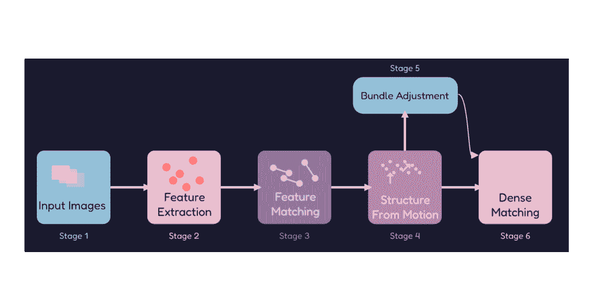
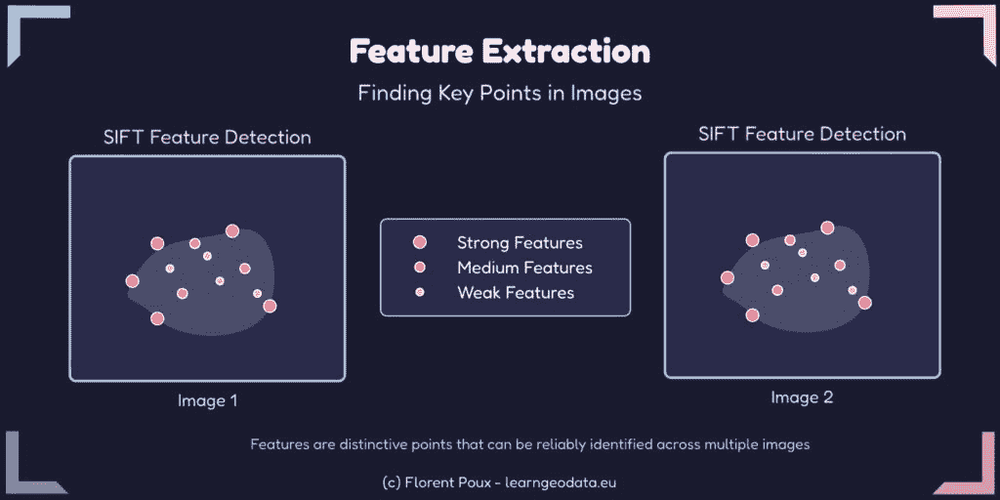
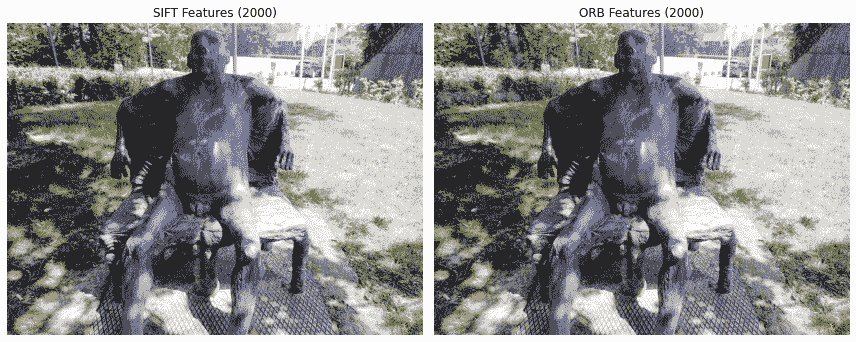
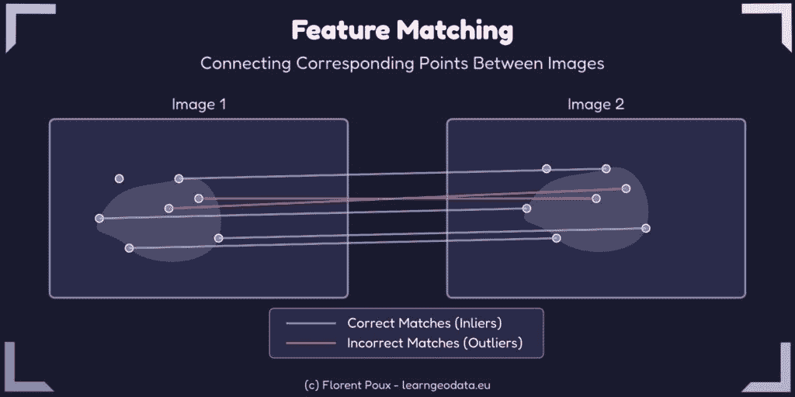
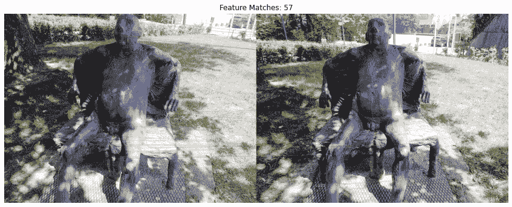
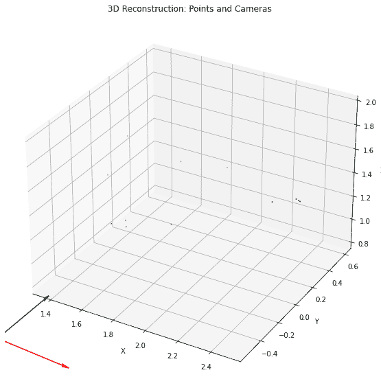
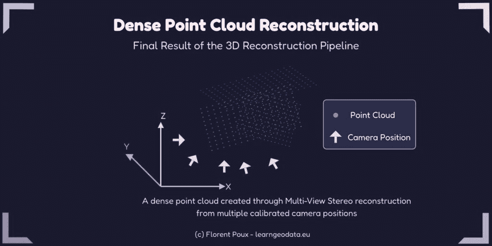
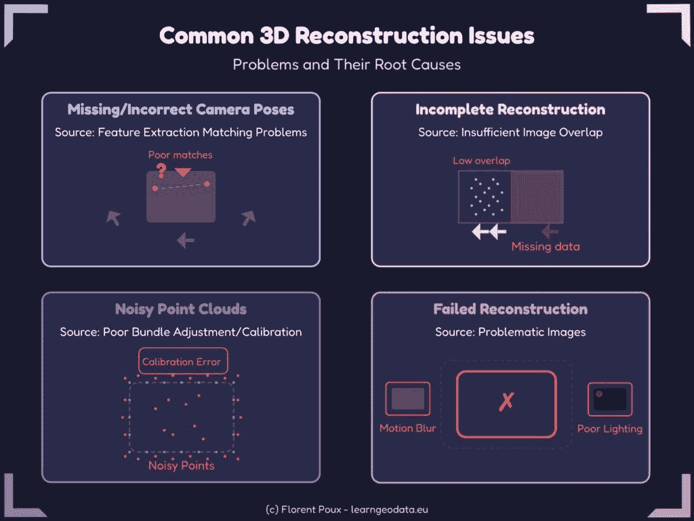

# 掌握 3D 重建过程：一步步指南

> 原文：[`towardsdatascience.com/master-the-3d-reconstruction-process-step-by-step-guide/`](https://towardsdatascience.com/master-the-3d-reconstruction-process-step-by-step-guide/)

<mdspan datatext="el1742241650978" class="mdspan-comment">从 2D 照片到 3D 模型的 3D 重建之旅遵循一个结构化的路径。*

此路径由一系列相互依赖的步骤组成，将平面图像转换为空间信息。

理解这个管道对于任何想要创建高质量 3D 重建的人来说至关重要。

让我来解释……

大多数人认为 3D 重建意味着：

+   在物体周围随机拍照

+   在昂贵的软件中按下一个按钮

+   等待魔法发生

+   每次都获得完美的结果

+   跳过基础知识

不需要。

我所见过的最成功的 3D 重建都是基于三个核心原则：

+   它们使用与较少图像一起工作的管道，但位置更好。

+   它们确保用户花费更少的时间处理，但获得更干净的结果。

+   它们允许更快地进行故障排除，因为用户知道确切的位置在哪里。

因此，这给我们提供了一个很好的教训：

你的 3D 模型只能与你对它们创建方式的理解一样好。

从科学的角度来看，这一点非常重要。

让我们直接深入探讨！

> 🦊 *如果你是第一次接触我的（3D）写作世界，欢迎！我们将踏上一次激动人心的冒险之旅，让你掌握一个关键的 3D Python 技能。*

*一旦场景布置好，我们就开始 Python 之旅。一切都被提供，包括资源列表。你将看到提示（*🦚**注意事项***和 *🌱**成长***）以帮助你充分利用这篇文章。感谢*[***3D Geodata Academy***](https://learngeodata.eu/)*对这项事业的支持。* *本文灵感来源于 3D [Reconstructor OS 课程](https://learngeodata.eu/3d-course-pack/)模块 1 的一个小节。*

## 完整的 3D 重建工作流程

让我突出一下使用摄影测量的 3D 重建管道。该过程遵循以下逻辑步骤，如下所示。



需要注意的是，每一步都是建立在之前步骤之上的。因此，每个阶段的质量直接影响到最终结果，这一点非常重要！

> 🦊 *理解整个过程对于故障排除工作流程至关重要，因为它具有顺序性。*

考虑到这一点，让我们详细说明每一步，重点关注理论和实际应用。

## 自然特征提取：寻找独特点

自然特征提取是摄影测量的基础。它识别图像中的独特点，这些点可以在多张照片中可靠地定位。



这些点作为锚点，将不同的视图连接在一起。

> 🌱 *当处理低纹理物体时，考虑添加临时标记或纹理图案以改善特征提取结果。*

常见的特征提取算法包括：

| **算法** | **优点** | **缺点** | **最佳用途** |
| --- | --- | --- | --- |
| SIFT | 尺度和旋转不变 | 计算成本高 | 高质量、通用重建 |
| SURF | 比 SIFT 快 | 比 SIFT 不准确 | 快速原型设计 |
| ORB | 非常快，没有专利限制 | 对视点变化不太鲁棒 | 实时应用 |

让我们使用 OpenCV 实现一个简单的特征提取：

```py
#%% SECTION 1: Natural Feature Extraction
import cv2
import numpy as np
import matplotlib.pyplot as plt

def extract_features(image_path, feature_method='sift', max_features=2000):
    """
    Extract features from an image using different methods.
    """

    # Read the image in color and convert to grayscale
    img = cv2.imread(image_path)
    if img is None:
        raise ValueError(f"Could not read image at {image_path}")

    gray = cv2.cvtColor(img, cv2.COLOR_BGR2GRAY)

    # Initialize feature detector based on method
    if feature_method.lower() == 'sift':
        detector = cv2.SIFT_create(nfeatures=max_features)
    elif feature_method.lower() == 'surf':
        # Note: SURF is patented and may not be available in all OpenCV distributions
        detector = cv2.xfeatures2d.SURF_create(400)  # Adjust threshold as needed
    elif feature_method.lower() == 'orb':
        detector = cv2.ORB_create(nfeatures=max_features)
    else:
        raise ValueError(f"Unsupported feature method: {feature_method}")

    # Detect and compute keypoints and descriptors
    keypoints, descriptors = detector.detectAndCompute(gray, None)

    # Create visualization
    img_with_features = cv2.drawKeypoints(
        img, keypoints, None, 
        flags=cv2.DRAW_MATCHES_FLAGS_DRAW_RICH_KEYPOINTS
    )

    print(f"Extracted {len(keypoints)} {feature_method.upper()} features")

    return keypoints, descriptors, img_with_features

image_path = "sample_image.jpg"  # Replace with your image path

# Extract features with different methods
kp_sift, desc_sift, vis_sift = extract_features(image_path, 'sift')
kp_orb, desc_orb, vis_orb = extract_features(image_path, 'orb')
```

我在这里做的是遍历一张图像，寻找从周围环境中脱颖而出的独特模式。

这些模式创建了数学“签名”称为描述符，即使在从不同的角度或距离观看时也能被识别。

将它们视为可以在多张照片之间匹配的独特指纹。

可视化步骤揭示了算法在您的图像中认为重要的是什么。

```py
# Display results
plt.figure(figsize=(12, 6))

plt.subplot(1, 2, 1)
plt.title(f'SIFT Features ({len(kp_sift)})')
plt.imshow(cv2.cvtColor(vis_sift, cv2.COLOR_BGR2RGB))
plt.axis('off')

plt.subplot(1, 2, 2)
plt.title(f'ORB Features ({len(kp_orb)})')
plt.imshow(cv2.cvtColor(vis_orb, cv2.COLOR_BGR2RGB))
plt.axis('off')

plt.tight_layout()
plt.show()
```

注意到角落、边缘和纹理区域吸引了更多的关键点，而平滑或均匀的区域则基本被忽略。



这种视觉反馈对于理解为什么某些物体的重建比其他物体好非常有价值。

> 🦥 **技术笔记**：*`max_features`参数至关重要。设置得太高会显著减慢处理速度并捕获噪声，而设置得太低可能会错过重要细节。对于大多数物体，2000-5000 个特征提供了一个良好的平衡，但我会将其推至 10,000+以进行高度详细的结构重建。*

## 特征匹配：将图像连接在一起

一旦提取了特征，下一步就是找到图像之间的对应关系。这个过程确定了不同图像中哪些点代表现实世界中的同一物理点。特征匹配创建了确定相机位置所需的连接。



我看到无数次的尝试失败，因为算法无法在不同图像之间可靠地连接相同的点。

比率测试是默默的英雄，在它们毒害你的重建之前，它会清除模糊的匹配。

```py
#%% SECTION 2: Feature Matching
import cv2
import numpy as np
import matplotlib.pyplot as plt

def match_features(descriptors1, descriptors2, method='flann', ratio_thresh=0.75):
    """
    Match features between two images using different methods.
    """

    # Convert descriptors to appropriate type if needed
    if descriptors1 is None or descriptors2 is None:
        return []

    if method.lower() == 'flann':
        # FLANN parameters
        if descriptors1.dtype != np.float32:
            descriptors1 = np.float32(descriptors1)
        if descriptors2.dtype != np.float32:
            descriptors2 = np.float32(descriptors2)

        FLANN_INDEX_KDTREE = 1
        index_params = dict(algorithm=FLANN_INDEX_KDTREE, trees=5)
        search_params = dict(checks=50)  # Higher values = more accurate but slower

        flann = cv2.FlannBasedMatcher(index_params, search_params)
        matches = flann.knnMatch(descriptors1, descriptors2, k=2)
    else:  # Brute Force
        # For ORB descriptors
        if descriptors1.dtype == np.uint8:
            bf = cv2.BFMatcher(cv2.NORM_HAMMING, crossCheck=False)
        else:  # For SIFT and SURF descriptors
            bf = cv2.BFMatcher(cv2.NORM_L2, crossCheck=False)

        matches = bf.knnMatch(descriptors1, descriptors2, k=2)

    # Apply Lowe's ratio test
    good_matches = []
    for match in matches:
        if len(match) == 2:  # Sometimes fewer than 2 matches are returned
            m, n = match
            if m.distance < ratio_thresh * n.distance:
                good_matches.append(m)

    return good_matches

def visualize_matches(img1, kp1, img2, kp2, matches, max_display=100):
    """
    Create a visualization of feature matches between two images.
    """

    # Limit the number of matches to display
    matches_to_draw = matches[:min(max_display, len(matches))]

    # Create match visualization
    match_img = cv2.drawMatches(
        img1, kp1, img2, kp2, matches_to_draw, None,
        flags=cv2.DrawMatchesFlags_NOT_DRAW_SINGLE_POINTS
    )

    return match_img

# Load two images
img1_path = "image1.jpg"  # Replace with your image paths
img2_path = "image2.jpg"

# Extract features using SIFT (or your preferred method)
kp1, desc1, _ = extract_features(img1_path, 'sift')
kp2, desc2, _ = extract_features(img2_path, 'sift')

# Match features
good_matches = match_features(desc1, desc2, method='flann')

print(f"Found {len(good_matches)} good matches")
```

匹配过程通过比较两张图像之间的特征描述符，测量它们的数学相似度。对于第一张图像中的每个特征，我们在第二张图像中找到其两个最近的匹配项，并评估它们的相对距离。

如果最近的匹配项明显优于第二好的匹配项（由比率阈值控制），我们认为它是可靠的。

```py
# Visualize matches
img1 = cv2.imread(img1_path)
img2 = cv2.imread(img2_path)
match_visualization = visualize_matches(img1, kp1, img2, kp2, good_matches)

plt.figure(figsize=(12, 8))
plt.imshow(cv2.cvtColor(match_visualization, cv2.COLOR_BGR2RGB))
plt.title(f"Feature Matches: {len(good_matches)}")
plt.axis('off')
plt.tight_layout()
plt.show()
```

可视化这些匹配揭示了您图像之间的空间关系。



良好的匹配形成了一个一致的图案，反映了视点的转换，而异常值则表现为随机的连接。

这种模式立即提供了关于图像质量和相机定位的反馈——聚集的、一致的匹配表明有良好的重建潜力。

> 🦥 **Geeky Note**: ratio_thresh 参数（0.75）是 Lowe 最初的建议，在大多数情况下效果良好。较低的值（0.6-0.7）会产生较少但更可靠的匹配，这对于具有重复图案的场景更可取。较高的值（0.8-0.9）会产生更多匹配，但会增加异常值污染重建的风险。

现在，让我们转到主舞台：从运动结构节点。

## 从运动结构：在空间中放置相机

从运动结构（SfM）从二维图像对应关系重建 3D 场景结构和相机运动。这个过程确定了每张照片是从哪里拍摄的，并创建了一个场景的初始稀疏点云。

SfM（从运动结构）的关键步骤包括：

1.  估计图像对之间的基本或本质矩阵

1.  恢复相机姿态（位置和方向）

1.  从二维对应关系中三角测量 3D 点

1.  建立一个轨迹图来连接多张图像中的观测

本质矩阵编码了两个相机视点的几何关系，揭示了它们在空间中的相对位置。

这种数学关系是重建相机位置和它们观察到的 3D 结构的基础。

```py
#%% SECTION 3: Structure from Motion
import cv2
import numpy as np
import matplotlib.pyplot as plt
from mpl_toolkits.mplot3d import Axes3D

def estimate_pose(kp1, kp2, matches, K, method=cv2.RANSAC, prob=0.999, threshold=1.0):
    """
    Estimate the relative pose between two cameras using matched features.
    """

    # Extract matched points
    pts1 = np.float32([kp1[m.queryIdx].pt for m in matches])
    pts2 = np.float32([kp2[m.trainIdx].pt for m in matches])

    # Estimate essential matrix
    E, mask = cv2.findEssentialMat(pts1, pts2, K, method, prob, threshold)

    # Recover pose from essential matrix
    _, R, t, mask = cv2.recoverPose(E, pts1, pts2, K, mask=mask)

    inlier_matches = [matches[i] for i in range(len(matches)) if mask[i] > 0]
    print(f"Estimated pose with {np.sum(mask)} inliers out of {len(matches)} matches")

    return R, t, mask, inlier_matches

def triangulate_points(kp1, kp2, matches, K, R1, t1, R2, t2):
    """
    Triangulate 3D points from two views.
    """

    # Extract matched points
    pts1 = np.float32([kp1[m.queryIdx].pt for m in matches])
    pts2 = np.float32([kp2[m.trainIdx].pt for m in matches])

    # Create projection matrices
    P1 = np.dot(K, np.hstack((R1, t1)))
    P2 = np.dot(K, np.hstack((R2, t2)))

    # Triangulate points
    points_4d = cv2.triangulatePoints(P1, P2, pts1.T, pts2.T)

    # Convert to 3D points
    points_3d = points_4d[:3] / points_4d[3]

    return points_3d.T

def visualize_points_and_cameras(points_3d, R1, t1, R2, t2):
    """
    Visualize 3D points and camera positions.
    """

    fig = plt.figure(figsize=(10, 8))
    ax = fig.add_subplot(111, projection='3d')

    # Plot points
    ax.scatter(points_3d[:, 0], points_3d[:, 1], points_3d[:, 2], c='b', s=1)

    # Helper function to create camera visualization
    def plot_camera(R, t, color):
        # Camera center
        center = -R.T @ t
        ax.scatter(center[0], center[1], center[2], c=color, s=100, marker='o')

        # Camera axes (showing orientation)
        axes_length = 0.5  # Scale to make it visible
        for i, c in zip(range(3), ['r', 'g', 'b']):
            axis = R.T[:, i] * axes_length
            ax.quiver(center[0], center[1], center[2], 
                      axis[0], axis[1], axis[2], 
                      color=c, arrow_length_ratio=0.1)

    # Plot cameras
    plot_camera(R1, t1, 'red')
    plot_camera(R2, t2, 'green')

    ax.set_title('3D Reconstruction: Points and Cameras')
    ax.set_xlabel('X')
    ax.set_ylabel('Y')
    ax.set_zlabel('Z')

    # Try to make axes equal
    max_range = np.max([
        np.max(points_3d[:, 0]) - np.min(points_3d[:, 0]),
        np.max(points_3d[:, 1]) - np.min(points_3d[:, 1]),
        np.max(points_3d[:, 2]) - np.min(points_3d[:, 2])
    ])

    mid_x = (np.max(points_3d[:, 0]) + np.min(points_3d[:, 0])) * 0.5
    mid_y = (np.max(points_3d[:, 1]) + np.min(points_3d[:, 1])) * 0.5
    mid_z = (np.max(points_3d[:, 2]) + np.min(points_3d[:, 2])) * 0.5

    ax.set_xlim(mid_x - max_range * 0.5, mid_x + max_range * 0.5)
    ax.set_ylim(mid_y - max_range * 0.5, mid_y + max_range * 0.5)
    ax.set_zlim(mid_z - max_range * 0.5, mid_z + max_range * 0.5)

    plt.tight_layout()
    plt.show()
```

> 🦥 **Geeky Note**: RANSAC 阈值参数（threshold=1.0）决定了我们对几何一致性的严格程度。我发现 0.5-1.0 在受控环境中效果良好，但增加到 1.5-2.0 有助于处理可能因风力导致轻微相机移动的户外场景。概率参数（prob=0.999）确保了高置信度，但会增加计算时间；0.95 对于原型设计来说已经足够。

本质矩阵估计使用匹配的特征点和相机的内部参数来计算图像之间的几何关系。



然后将这种关系分解以提取旋转和平移信息——本质上确定每张照片在三维空间中的位置。这一步骤的准确性直接影响着后续的所有操作。

```py
 # This is a simplified example - in practice you would use images and matches
# from the previous steps

# Example camera intrinsic matrix (replace with your calibrated values)
K = np.array([
        [1000, 0, 320],
        [0, 1000, 240],
        [0, 0, 1]
])

# For first camera, we use identity rotation and zero translation
R1 = np.eye(3)
t1 = np.zeros((3, 1))

# Load images, extract features, and match as in previous sections
img1_path = "image1.jpg"  # Replace with your image paths
img2_path = "image2.jpg"

img1 = cv2.imread(img1_path)
img2 = cv2.imread(img2_path)

kp1, desc1, _ = extract_features(img1_path, 'sift')
kp2, desc2, _ = extract_features(img2_path, 'sift')

matches = match_features(desc1, desc2, method='flann')

# Estimate pose of second camera relative to first
R2, t2, mask, inliers = estimate_pose(kp1, kp2, matches, K)

# Triangulate points
points_3d = triangulate_points(kp1, kp2, inliers, K, R1, t1, R2, t2)
```

一旦确定了相机位置，三角测量会将多张图像中匹配点的光线投影到三维空间中，以确定它们在哪里相交。

```py
# Visualize the result
visualize_points_and_cameras(points_3d, R1, t1, R2, t2)
```

这些交点形成了初始的稀疏点云，为后续的密集重建提供了骨架。可视化显示了重建的点云和相机位置，有助于您理解数据集中的空间关系。

> 🌱 SfM 与良好的重叠图像网络效果最佳。目标是在相邻图像之间至少有 60%的重叠，以实现可靠的重建。

## 集束调整：优化精度

在从运动结构“计算节点”中还有一个额外的优化阶段。

这被称为：捆绑调整。

这是一个优化步骤，它联合优化相机参数和 3D 点位置。这意味着它最小化了重投影误差，即观测到的图像点与其对应 3D 点的投影之间的差异。

这对你来说有道理吗？本质上，这种优化很好，因为它允许：

+   提高了重建的精度

+   校正累积漂移

+   确保模型的全局一致性

在这个阶段，这应该足以让你对它的工作方式有一个良好的直观理解。

> 🌱 在更大的项目中，增量捆绑调整（在添加每个新相机后进行优化）可以与全局调整相比提高速度和稳定性。

## 稠密匹配：创建详细重建

在建立相机位置和稀疏点之后，最后一步是稠密匹配，以创建场景的详细表示。



稠密匹配使用已知的相机参数在图像之间匹配更多的点，从而生成完整的点云。

常见的方法包括：

+   多视图立体（MVS）

+   基于补丁的多视图立体（PMVS）

+   半全局匹配（SGM）

## 将一切整合：实用工具

理论上的管道已在几个开源和商业软件包中实现。每个软件包都提供不同的功能和能力：

| **工具** | **优点** | **用例** | **定价** |
| --- | --- | --- | --- |
| COLMAP | 高度准确，可定制 | 研究，精确重建 | 免费，开源 |
| OpenMVG | 模块化，广泛的文档 | 教育，与自定义管道集成 | 免费，开源 |
| Meshroom | 用户友好的基于节点的界面 | 艺术家，初学者 | 免费，开源 |
| RealityCapture | 极快，高质量的结果 | 专业，大规模项目 | 商业 |

这些工具将上述描述的各种管道步骤打包成一个更用户友好的界面，但理解底层过程对于故障排除和优化仍然是必要的。

自动化重建流程节省了无数小时的手动工作。

真正的生产力提升来自于从原始照片到稠密点云的整个过程的脚本化。

COLMAP 的命令行界面使得这种自动化成为可能，即使是复杂的重建任务。

```py
#%% SECTION 4: Complete Pipeline Automation with COLMAP
import os
import subprocess
import glob
import numpy as np

def run_colmap_pipeline(image_folder, output_folder, colmap_path="colmap"):
    """
    Run the complete COLMAP pipeline from feature extraction to dense reconstruction.
    """

    # Create output directories if they don't exist
    sparse_folder = os.path.join(output_folder, "sparse")
    dense_folder = os.path.join(output_folder, "dense")
    database_path = os.path.join(output_folder, "database.db")

    os.makedirs(output_folder, exist_ok=True)
    os.makedirs(sparse_folder, exist_ok=True)
    os.makedirs(dense_folder, exist_ok=True)

    # Step 1: Feature extraction
    print("Step 1: Feature extraction")
    feature_cmd = [
        colmap_path, "feature_extractor",
        "--database_path", database_path,
        "--image_path", image_folder,
        "--ImageReader.camera_model", "SIMPLE_RADIAL",
        "--ImageReader.single_camera", "1",
        "--SiftExtraction.use_gpu", "1"
    ]

    try:
        subprocess.run(feature_cmd, check=True)
    except subprocess.CalledProcessError as e:
        print(f"Feature extraction failed: {e}")
        return False

    # Step 2: Match features
    print("Step 2: Feature matching")
    match_cmd = [
        colmap_path, "exhaustive_matcher",
        "--database_path", database_path,
        "--SiftMatching.use_gpu", "1"
    ]

    try:
        subprocess.run(match_cmd, check=True)
    except subprocess.CalledProcessError as e:
        print(f"Feature matching failed: {e}")
        return False

    # Step 3: Sparse reconstruction (Structure from Motion)
    print("Step 3: Sparse reconstruction")
    sfm_cmd = [
        colmap_path, "mapper",
        "--database_path", database_path,
        "--image_path", image_folder,
        "--output_path", sparse_folder
    ]

    try:
        subprocess.run(sfm_cmd, check=True)
    except subprocess.CalledProcessError as e:
        print(f"Sparse reconstruction failed: {e}")
        return False

    # Find the largest sparse model
    sparse_models = glob.glob(os.path.join(sparse_folder, "*/"))
    if not sparse_models:
        print("No sparse models found")
        return False

    # Sort by model size (using number of images as proxy)
    largest_model = 0
    max_images = 0
    for i, model_dir in enumerate(sparse_models):
        images_txt = os.path.join(model_dir, "images.txt")
        if os.path.exists(images_txt):
            with open(images_txt, 'r') as f:
                num_images = sum(1 for line in f if line.strip() and not line.startswith("#"))
                num_images = num_images // 2  # Each image has 2 lines
                if num_images > max_images:
                    max_images = num_images
                    largest_model = i

    selected_model = os.path.join(sparse_folder, str(largest_model))
    print(f"Selected model {largest_model} with {max_images} images")

    # Step 4: Image undistortion
    print("Step 4: Image undistortion")
    undistort_cmd = [
        colmap_path, "image_undistorter",
        "--image_path", image_folder,
        "--input_path", selected_model,
        "--output_path", dense_folder,
        "--output_type", "COLMAP"
    ]

    try:
        subprocess.run(undistort_cmd, check=True)
    except subprocess.CalledProcessError as e:
        print(f"Image undistortion failed: {e}")
        return False

    # Step 5: Dense reconstruction (Multi-View Stereo)
    print("Step 5: Dense reconstruction")
    mvs_cmd = [
        colmap_path, "patch_match_stereo",
        "--workspace_path", dense_folder,
        "--workspace_format", "COLMAP",
        "--PatchMatchStereo.geom_consistency", "true"
    ]

    try:
        subprocess.run(mvs_cmd, check=True)
    except subprocess.CalledProcessError as e:
        print(f"Dense reconstruction failed: {e}")
        return False

    # Step 6: Stereo fusion
    print("Step 6: Stereo fusion")
    fusion_cmd = [
        colmap_path, "stereo_fusion",
        "--workspace_path", dense_folder,
        "--workspace_format", "COLMAP",
        "--input_type", "geometric",
        "--output_path", os.path.join(dense_folder, "fused.ply")
    ]

    try:
        subprocess.run(fusion_cmd, check=True)
    except subprocess.CalledProcessError as e:
        print(f"Stereo fusion failed: {e}")
        return False

    print("Pipeline completed successfully!")
    return True
```

脚本编排了一系列 COLMAP 操作，这些操作通常在每个阶段都需要手动干预。它处理从特征提取到匹配、稀疏重建，最后到稠密重建的过程，保持步骤之间的正确数据流。当处理多个数据集或迭代优化重建参数时，这种自动化变得非常有价值。

```py
# Replace with your image and output folder paths
image_folder = "path/to/images"
output_folder = "path/to/output"

# Path to COLMAP executable (may be just "colmap" if it's in your PATH)
colmap_path = "colmap"

run_colmap_pipeline(image_folder, output_folder, colmap_path)
```

一个关键方面是自动选择最大的重建模型。在具有挑战性的数据集中，COLMAP 有时会创建多个不连接的重建，而不是一个单一的连贯模型。

脚本智能地识别并继续使用最完整的重建，使用图像数量作为模型质量和完整性的代理。

> 🦥 **极客笔记**：–SiftExtraction.use_gpu 和 –SiftMatching.use_gpu 标志启用 GPU 加速，将处理速度提高 5-10 倍。对于密集重建，–PatchMatchStereo.geom_consistency true 参数通过强制多个视图的一致性，显著提高质量，但代价是更长的处理时间。

## 理解流程的力量

理解完整的重建流程让你能够控制你的 3D 建模过程。当你遇到问题时，知道哪个阶段可能引起问题，可以让你有效地针对故障排除工作。



如上图所示，常见问题和它们的来源包括：

1.  **缺失或错误的相机位姿**：特征提取和匹配问题

1.  **不完整的重建**：图像重叠不足

1.  **噪声点云**：糟糕的捆绑调整或相机校准

1.  **重建失败**：问题图像（运动模糊，光线不足）

诊断这些问题的能力来自于对每个流程组件如何工作以及如何与其他组件交互的深入了解。

## 下一步：实践和自动化

现在你已经了解了整个流程，是时候将其付诸实践了。尝试使用提供的代码示例，并尝试自动化你自己的数据集的过程。

从小型、控制良好的场景开始，随着你获得信心，逐渐处理更复杂的环境。

记住，你输入图像的质量会极大地影响最终结果。花时间捕捉高质量的照片，确保有良好的重叠、一致的光线和最小的运动模糊。

> 🌱 *考虑开始一个小型的个人项目，重建你拥有的物体。记录你的过程，包括你遇到的问题以及你如何解决它们——这种实践经验是无价的。*

如果你想要建立真正的专业知识，考虑

**[3D 重建操作系统课程](https://learngeodata.eu/3d-course-pack/)** ▶️，

或 [**使用 Python 进行 3D 数据科学**](https://www.oreilly.com/library/view/3d-data-science/9781098161323/) 📕 (O’Reilly)

## 参考资料和有用资源

我为你整理了一些有趣的软件、工具和有用的算法扩展文档：

### **软件和工具**

+   [COLMAP](https://colmap.github.io/) – 免费开源的 3D 重建软件

+   [OpenMVG](https://github.com/openMVG/openMVG) – 开放多视图几何库

+   [Meshroom](https://alicevision.org/#meshroom) – 免费基于节点的摄影测量软件

+   [RealityCapture](https://www.capturingreality.com/) – 商业高性能摄影测量软件

+   [Agisoft Metashape](https://www.agisoft.com/) – 商业摄影测量和 3D 建模软件

+   [OpenCV](https://opencv.org/) – 具有特征检测实现的计算机视觉库

+   [3DF Zephyr](https://www.3dflow.net/) – 3D 重建的摄影测量软件

+   [Python](https://www.python.org/) – 适用于 3D 重建自动化的理想编程语言

### **算法**

+   [SIFT (尺度不变特征变换)](https://en.wikipedia.org/wiki/Scale-invariant_feature_transform) – 鲁棒特征检测算法

+   [SURF (加速鲁棒特征)](https://en.wikipedia.org/wiki/Speeded_up_robust_features) – 快速特征检测算法

+   [ORB (方向快速和旋转 BRIEF)](https://docs.opencv.org/3.4/d1/d89/tutorial_py_orb.html) – SIFT 和 SURF 的高效替代方案

+   [RANSAC (随机样本一致性)](https://en.wikipedia.org/wiki/Random_sample_consensus) – 用于匹配中的异常值拒绝

+   [运动结构 (SfM)](https://en.wikipedia.org/wiki/Structure_from_motion) – 从 2D 图像恢复 3D 结构的算法

+   [多视图立体 (MVS)](https://en.wikipedia.org/wiki/Multi-view_stereo) – 密集重建算法

+   [捆绑调整](https://en.wikipedia.org/wiki/Bundle_adjustment) – 用于相机姿态和 3D 点的优化技术

+   [FLANN (快速近似最近邻库)](https://github.com/flann-lib/flann) – 用于特征描述符的快速匹配算法

## 关于作者

> [**Florent Poux, Ph.D.**](https://medium.com/u/8ba7bf4ad784?source=post_page---user_mention--de393e1f23f4---------------------------------------) *是一位专注于教育工程师利用 AI 和 3D 数据科学的科学和课程总监。他领导研究团队，并在多所大学教授 3D 计算机视觉。他目前的目的是确保人类能够正确装备知识和技能，以应对 3D 挑战，实现有影响力的创新。*

## 资源

1.  🏆奖项：[Jack Dangermond 奖](https://www.geographie.uliege.be/cms/c_5724437/en/florent-poux-and-roland-billen-winners-of-the-2019-jack-dangermond-award)

1.  📕书：[使用 Python 进行 3D 数据科学](https://www.amazon.fr/Data-Science-Python-Environments-Workflows/dp/1098161335)

1.  📜研究：[3D 智能点云（论文）](https://orbi.uliege.be/handle/2268/235520)

1.  🎓课程：[3D 地数据学院目录](https://learngeodata.eu/)

1.  💻代码：[Florent 的 GitHub 仓库](https://github.com/florentPoux)

1.  💌3D 技术摘要：[每周通讯](https://learngeodata.eu/3d-newsletter/)
