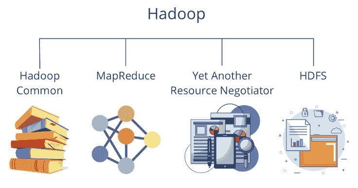
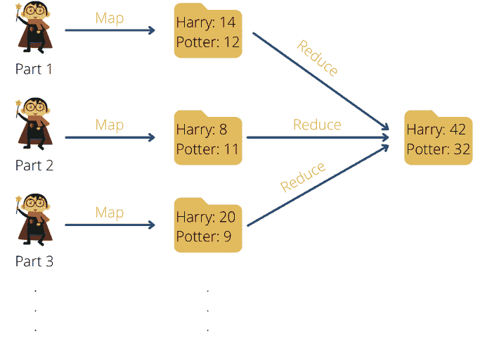

# 掌握 Hadoop，第二部分：动手实践——设置和扩展 Hadoop

> 原文：[`towardsdatascience.com/mastering-hadoop-part-2-getting-hands-on-setting-up-and-scaling-hadoop/`](https://towardsdatascience.com/mastering-hadoop-part-2-getting-hands-on-setting-up-and-scaling-hadoop/)

现在我们已经探讨了[Hadoop 的作用和相关性](https://towardsdatascience.com/mastering-hadoop-part-1-installation-configuration-and-modern-big-data-strategies/)，现在是时候向您展示它在底层是如何工作的，以及您如何开始使用它。首先，我们将分解 Hadoop 的核心组件——HDFS 用于存储，MapReduce 用于处理，YARN 用于资源管理，等等。然后，我们将指导您安装 Hadoop（无论是在本地还是在云中），并介绍一些基本命令，以帮助您导航和操作您的第一个 Hadoop 环境。

## 哪些组件是 Hadoop 架构的一部分？

Hadoop 的架构设计旨在具有弹性和无错误，依赖于几个核心组件协同工作。这些组件将大型数据集分割成更小的块，使得它们更容易处理并在服务器集群中分布。这种分布式方法使得数据处理效率更高——远比集中式的“超级计算机”可扩展。



Hadoop Components | 来源：作者

Hadoop 的基本组件包括：

+   **Hadoop Common**包含其他模块所需的基本库和功能。

+   [**Hadoop 分布式文件系统（HDFS）**](https://databasecamp.de/en/data/apache-hdfs)确保数据存储在不同的服务器上，并支持特别大的带宽。

+   **Hadoop YARN**负责系统内的资源分配，并在单个计算机达到极限时重新分配负载。

+   **MapReduce**是一种编程模型，旨在使大量数据的处理特别高效。

2020 年，作为 HDFS 的替代方案，Hadoop Ozone 被添加到这个基本架构中。它包含一个专门为大数据工作负载设计的分布式对象存储系统，以更好地处理现代数据需求，尤其是在云环境中。

### HDFS (Hadoop Distributed File System)

让我们深入了解 HDFS，这是 Hadoop 的核心存储系统，专门设计来满足大数据处理的需求。其基本原理是文件不是作为一个整体存储在中央服务器上，而是被分割成 128MB 或 256MB 大小的块，然后分布到计算机集群的不同节点上。

为了确保数据完整性，每个块会在不同的服务器上复制三次。如果某个服务器失败，系统仍然可以从剩余的副本中恢复。这种复制机制使得在发生故障时很容易回退到另一个节点。

根据其[文档](https://hadoop.apache.org/docs/r1.2.1/hdfs_design.html)，Hadoop 使用 HDFS 追求以下目标：

+   通过回退到工作组件来**快速恢复**硬件故障。

+   提供**流数据处理**。

+   具有能够处理大数据集的**大数据框架**。

+   具有能够轻松迁移到新硬件或软件的**标准化流程**。

Apache Hadoop 根据所谓的 master-slave 原则工作。在这个集群中，有一个节点扮演主节点的角色。它将数据集的块分配给各个从节点，并记住哪些分区存储在哪些计算机上。只有块的引用，即元数据，存储在主节点上。如果主节点失败，有一个次要的名称节点可以接管。

Apache Hadoop 分布式文件系统中的主节点被称为 NameNode。从节点，反过来，被称为 DataNode。DataNode 的任务是存储实际的数据块，并定期向 NameNode 报告它们仍然存活的状态。如果一个 DataNode 失败，其他节点会复制数据块以确保足够的容错性。

客户端将存储在各个 DataNode 上的文件保存。在我们的示例中，这些文件位于 1 号和 2 号机架上。通常情况下，每个机架上的机器只有一个 DataNode。它的主要任务是管理内存中的数据块。

NameNode 反过来负责记住哪些数据块存储在哪个 DataNode 上，以便在请求时检索它们。它还管理文件，可以打开、关闭，如果需要，还可以重命名它们。

最后，DataNodes 执行客户端的实际读写过程。当进行查询时，客户端从 DataNodes 接收所需信息。它们还确保数据的复制，以便系统可以以容错方式运行。

### MapReduce

MapReduce 是一种支持大量数据并行处理的编程模型。它最初由 Google 开发，可以分为两个阶段：

+   **Map**：在 Map 阶段，定义了一个可以将输入数据转换为键值对的过程。然后可以设置多个 mapper 来同时处理大量数据，从而实现更快的处理。

+   **Reduce**：Reduce 阶段在所有 mapper 完成后开始，聚合所有具有相同键的值。聚合可以涉及各种函数，例如求和或确定最大值。在 Map 阶段结束和 Reduce 阶段开始之间，数据根据键进行洗牌和排序。

MapReduce 机制的一个经典应用是文档中的单词计数，例如我们例子中的七本《哈利·波特》系列。任务是计算“Harry”和“Potter”这两个词出现的频率。为此，在映射阶段，每个单词被分割成一个键值对，其中单词作为键，数字一作为值，因为单词出现了一次。

这的优点是这项任务可以并行运行，并且相互独立，例如，可以为每个波段或甚至每个页面单独运行一个映射器。这意味着任务可以并行化，并且可以更快地实现。扩展仅取决于可用的计算资源，如果硬件适当，可以按需增加。映射阶段的输出可能如下所示：

```py
[(„Harry“, 1), („Potter“, 1), („Potter“, 1), („Harry“, 1), („Harry”, 1)]
```



使用《哈利·波特》书籍中的单词计数示例的 MapReduce | 来源：作者

一旦所有映射器完成工作，就可以开始减少阶段。对于单词计数示例，应该将所有键值对（键为“Harry”和“Potter”）分组并计数。

分组会产生以下结果：

```py
[(„Harry“, [1,1,1]), („Potter“, [1,1])]
```

然后将分组的结果进行聚合。在我们的例子中，要计算单词的频率，分组值相加：

```py
[(„Harry“, 3), („Potter“, 2)]
```

这种处理的优点是任务可以并行化，同时只发生最小限度的文件移动。这意味着即使处理大量数据也可以高效完成。

尽管许多系统仍在使用原始 Hadoop 结构中使用的 MapReduce 程序，但在此期间也开发了更高效的框架，例如[Apache Spark](https://databasecamp.de/en/data/apache-sparks)。我们将在文章的后面更详细地介绍这一点。

### YARN（另一种资源协调器）

YARN（另一种资源协调器）管理集群内的硬件资源。它将资源管理从数据处理中分离出来，使得多个应用程序（如 MapReduce、Spark 和 Flink）可以在同一集群上高效运行。它专注于以下关键功能：

+   管理性能和内存资源，例如 CPU 或 SSD 存储空间。

+   将空闲资源分配给运行中的进程，例如 MapReduce、Spark 或 Flink。

+   作业执行的优化和并行化。

与 HDFS 类似，YARN 也遵循主从原则。资源管理器充当主节点，并集中监控整个集群中的所有资源。它还将可用资源分配给各个应用程序。各种节点管理器作为从节点，安装在每台机器上。它们负责运行应用程序的容器，并监控其资源消耗，如内存空间或 CPU 性能。这些数据定期反馈给资源管理器，以便它可以保持概览。

在高层次上，对 YARN 的请求看起来是这样的：客户端调用资源管理器并请求执行应用程序。然后它在集群中搜索可用资源，如果可能的话，启动一个所谓的应用程序主实例，该实例启动并监控应用程序的执行。然后它从节点管理器请求可用资源并启动相应的容器。计算现在可以在容器中并行运行，并由应用程序主进行监控。在成功处理之后，YARN 释放用于新作业的资源。

### Hadoop common

可以将 Hadoop Common 视为构建在完整 Hadoop 生态系统基础上的基石，主要组件可以在此基础上构建。它包含所有 Hadoop 组件都可以使用的库、工具和配置文件。主要组件包括：

+   **通用库和实用工具**：Hadoop Common 提供了一组 Java 库、[API](https://databasecamp.de/en/data/api-en)和实用工具，这些工具是运行集群所需的。这包括例如集群节点之间的通信机制或对不同的序列化格式（如 Avro）的支持。还包括用于 HDFS 或其他文件系统中文件管理的所需接口。

+   **配置管理**：Hadoop 基于大量基于[XML](https://databasecamp.de/en/data/xml-file)的配置文件，这些文件定义了操作所必需的主要系统参数。一个中心方面是控制集群中机器所需的网络参数。此外，这里定义了 HDFS 的允许存储位置或最大资源大小，例如可用的存储空间。

+   **平台独立性**：Hadoop 最初是专门为 Linux 环境开发的。然而，在 Hadoop Common 的帮助下，它也可以扩展到其他操作系统。这包括对其他环境（如 macOS 或 Windows）的原生代码支持。

+   **I/O 工具（输入/输出）**：大数据框架处理大量需要高效存储和处理的庞大数据量。因此，各种文件系统（如 TextFiles 或 Parquet）所需的必要构建块存储在 Hadoop Common 中。它还包含支持的压缩方法的功能，确保节省存储空间并优化处理时间。

由于这个统一和集中的代码库，Hadoop Common 在框架内提供了改进的模块化，并确保所有组件可以无缝协同工作。

### Hadoop Ozone

Hadoop Ozone 是一种分布式对象存储系统，作为 HDFS 的替代品被引入，并专门为大数据工作负载开发。HDFS 最初是为具有数 GB 或甚至 TB 的大型文件而设计的。然而，当需要存储大量小文件时，它很快就会达到其极限。主要问题是 NameNode 的限制，它将元数据存储在 RAM 中，因此当保留数十亿个小文件时，会遇到内存问题。

此外，HDFS 是为计算集群内的经典 Hadoop 使用而设计的。然而，当前的架构通常采用混合方法，结合云中的存储解决方案。Hadoop Ozone 通过提供可扩展且灵活的存储架构来解决这些问题，该架构针对 [Kubernetes](https://databasecamp.de/en/data/kubernetes-basics) 和混合云环境进行了优化。

与 HDFS 不同，在 HDFS 中一个 NameNode 处理所有文件元数据，Hadoop Ozone 引入了一种更灵活的架构，不依赖于单个集中式 NameNode，从而提高了可扩展性。相反，它使用以下组件：

+   **Ozone 管理器**与 HDFS NameNode 最相似，但仅管理桶和卷元数据。它确保对象的高效管理，并且具有可扩展性，因为并非所有文件元数据都需要保留在 RAM 中。

+   **存储容器管理器 (SCM)** 可以最好地想象为 HDFS 中的 DataNode，它负责管理和复制所谓的容器中的数据。支持各种复制策略，如三副本复制或纠删码以节省空间。

+   **Ozone 3 网关**具有与 S3 兼容的 API，因此可以用作 Amazon S3 的替代品。这意味着为 AWS S3 开发的应用程序可以轻松连接到 Ozone 并与之交互，而无需更改代码。

这种结构使 Hadoop Ozone 在以下表格中相对于 HDFS 具有多种优势，我们已简要总结如下：

| **属性** | **Hadoop Ozone** | **HDFS** |
| --- | --- | --- |
| 存储结构 | 基于对象（桶和键） | 基于块（文件和块） |
| 可扩展性 | 百万到数十亿的小文件 | 许多小文件的问题 |
| NameNode – 依赖 | 无中央 NameNode 且可扩展 | NameNode 是瓶颈 |
| 云集成 | 支持 S3 API、Kubernetes、多云 | 强烈绑定到 Hadoop 集群 |
| 复制策略 | 经典的三副本复制或纠删码 | 仅三副本复制 |
| 应用程序 | 大数据、Kubernetes、混合云、S3 替代品 | 传统 Hadoop 工作负载 |

Hadoop Ozone 是生态系统的强大扩展，它使得实现 HDFS 无法实现的混合云架构成为可能。它也易于扩展，因为它不再依赖于中央名称节点。这意味着具有许多但文件较小的大数据应用程序，如用于传感器测量的应用程序，也可以无任何问题地实现。

## 如何开始使用 Hadoop？

Hadoop 是一个健壮且可扩展的大数据框架，为世界上一些最大的数据驱动应用程序提供动力。由于其许多组件，它可能对初学者来说显得有些令人不知所措，但本指南将引导您通过简单、易于遵循的阶段开始使用 Hadoop。

**Hadoop 的安装**

在我们开始使用 Hadoop 之前，我们必须首先在我们的相应环境中安装它。在本章中，我们根据框架是本地安装还是云安装来区分几种场景。同时，通常建议在操作系统为 Linux 或 macOS 的系统上工作，因为需要为 Windows 进行额外的适配。此外，Java 应已可用，至少 Java 8 或 11，并且应能够通过 SSH 进行内部通信。

**Hadoop 的本地安装**

要在本地计算机上尝试 Hadoop 并熟悉它，您可以执行单节点安装，这样所有必要的组件都运行在同一台计算机上。在开始安装之前，您可以在 [`hadoop.apache.org/releases.html`](https://hadoop.apache.org/releases.html) 检查您想要安装的最新版本，在我们的例子中这是版本 3.4.1。如果需要不同的版本，以下命令可以简单地更改，以便代码中的版本号进行调整。

然后，我们打开一个新的终端并执行以下代码，该代码从互联网下载指定的版本，解压目录，然后切换到解压后的目录。

```py
wget https://downloads.apache.org/hadoop/common/hadoop-3.4.1/hadoop-3.4.1.tar.gz
tar -xvzf hadoop-3.4.1.tar.gz
cd hadoop-3.4.1
```

如果第一行有错误，这很可能是由于链接错误，提到的版本可能已经无法访问。应使用更新版本的版本，并再次执行代码。安装目录的大小约为 1GB。

然后，可以创建并设置环境变量，这告诉系统 Hadoop 存储在计算机上的哪个目录下。然后，`PATH` 变量允许在终端的任何位置执行 Hadoop 命令，而无需设置 Hadoop 安装的完整路径。

```py
export HADOOP_HOME=~/hadoop-3.4.1 
export PATH=$PATH:$HADOOP_HOME/bin
```

在我们启动系统之前，我们可以更改 Hadoop 的基本配置，例如，为 HDFS 定义特定的目录或指定副本因子。在启动之前，我们可以调整总共三个重要的配置文件：

+   `core-site.xml` 配置基本 Hadoop 设置，例如多个节点的连接信息。

+   `hdfs-site.xml` 包含了 HDFS 设置的特殊参数，例如数据存储的典型目录或副本因子，它决定了存储的数据副本数量。

+   `yarn-site.xml` 配置 YARN 组件，该组件负责资源管理和作业调度。

对于我们的本地测试，我们可以调整 HDFS 配置，将复制因子设置为 1，因为我们只在一个服务器上工作，因此数据复制没有用。为此，我们使用文本编辑器，在我们的例子中是`nano`，打开 HDFS 的配置文件：

```py
nano $HADOOP_HOME/etc/hadoop/hdfs-site.xml
```

文件随后在终端中打开，可能还没有任何条目。然后可以在配置区域中添加一个新的具有属性键的 XML：

```py
<property> 
    <name>dfs.replication</name> 
    <value>1</value> 
</property>
```

可以根据此格式设置各种属性。配置文件中可以指定的不同键以及允许的值可以在[`hadoop.apache.org/docs/current/hadoop-project-dist/`](https://hadoop.apache.org/docs/current/hadoop-project-dist/)找到。对于 HDFS，此概述可以在[这里](https://hadoop.apache.org/docs/current/hadoop-project-dist/hadoop-hdfs/hdfs-default.xml)看到。

现在配置完成后，可以启动 Hadoop。为此，需要初始化 HDFS，这是新安装后的第一个重要步骤，并且将用作 NameNode 的目录被格式化。接下来的两个命令然后启动集群中配置的所有节点上的 HDFS，并启动资源管理 YARN。

```py
hdfs namenode -format 
start-dfs.sh 
start-yarn.sh
```

如果 Java 尚未安装，此步骤可能会出现问题。然而，这可以通过相应的安装轻松完成。此外，当我在 macOS 上尝试此操作时，HDFS 的 NameNode 和 DataNode 必须显式启动：

```py
~/hadoop-3.4.1/bin/hdfs --daemon start namenode
~/hadoop-3.4.1/bin/hdfs --daemon start datanode
```

对于 YARN，资源管理和 NodeManager 的相同程序适用：

```py
~/hadoop-3.4.1/bin/yarn --daemon start resourcemanager
~/hadoop-3.4.1/bin/yarn --daemon start nodemanager
```

最后，可以使用*jps*命令检查运行中的进程，以查看是否所有组件都已正确启动。

## 分布式系统中的 Hadoop 安装

对于弹性和高效的过程，Hadoop 在具有多个服务器（称为节点）的分布式环境中使用，这确保了更大的可伸缩性和可用性。通常区分以下集群角色：

+   **NameNode**：此角色存储元数据并管理文件系统（HDFS）。

+   **DataNode**：这是实际数据存储和计算发生的地方。

+   **ResourceManager & NodeManagers**：这些管理 YARN 的集群资源。

然后可以在各个服务器上使用上一节中更详细解释的相同命令。然而，它们之间也必须建立通信，以便它们可以相互协调。通常，在安装过程中可以遵循以下顺序：

1.  设置几个基于 Linux 的服务器，用于集群。

1.  在服务器之间设置 SSH 访问，以便它们可以相互通信并发送数据。

1.  在每个服务器上安装 Hadoop 并做出所需的配置。

1.  在集群中分配角色并定义 NameNodes 和数据节点。

1.  格式化 NameNodes 然后启动集群。

具体的步骤和要执行的代码更多地取决于实际的实现。

## 云端 Hadoop 安装

许多公司使用云中的 Hadoop 来避免运营自己的集群，可能节省成本，并且能够使用现代硬件。各种提供商已经预定义了程序，可以在他们的环境中使用 Hadoop。最常见的 Hadoop 云服务包括：

+   **AWS EMR (弹性 MapReduce)**: 该程序基于 Hadoop，正如其名所示，也使用 MapReduce，这允许用户用 Java 编写程序，以分布式方式处理和存储大量数据。集群运行在亚马逊弹性计算云（EC2）的虚拟服务器上，并将数据存储在亚马逊简单存储服务（S3）中。关键字“弹性”来源于系统可以动态地改变以适应所需的计算能力。最后，AWS EMR 还提供了使用其他 Hadoop 扩展选项，如 Apache Spark 或 Apache Presto。

+   **Google Dataproc**：谷歌的替代方案称为 Dataproc，它允许在谷歌云中完全管理和可扩展的 Hadoop 集群。它基于 BigQuery，并使用谷歌云存储进行数据存储。许多公司，如沃达丰和 Twitter，已经使用这个系统。

+   **Azure HDInsight**：微软的 Azure 云提供了 HDInsight，用于在云中完全使用 Hadoop，并提供了对广泛其他开源程序的支持。

使用云的整体优势在于无需手动安装和维护工作。根据计算需求，会自动使用几个节点，并添加更多节点。对于客户来说，自动扩展的优势在于可以控制成本，并且只支付所使用的部分。

另一方面，本地集群的硬件通常设置得足够强大，即使在高峰负载下也能保持功能，这样大部分时间就不需要整个硬件。最后，使用云的优势在于它使得与其他同一提供商运行的系统集成变得更加容易，例如。

## 初学者使用的 Hadoop 基本命令

不论选择哪种架构，以下命令都可以用于在 Hadoop 中执行非常通用且经常重复的操作。这涵盖了 Hadoop ETL 过程中所需的所有区域。

+   **上传文件到 HDFS**：要能够执行 HDFS 命令，始终需要以`hdfs dfs`开头。您使用 put 来定义您想要从本地目录上传文件到 HDFS。`local_file.txt`描述了要上传的文件。为此，命令可以在文件的目录中执行，或者将文件的完整路径添加到文件名而不是文件名。最后，使用`/user/hadoop/`来定义文件要存储在 HDFS 中的目录。

```py
hdfs dfs -put local_file.txt /user/hadoop/
```

+   **列出 HDFS 中的文件**：您可以使用`-ls`列出 HDFS 目录`/user/hadoop/`中的所有文件和文件夹，并在终端中以列表形式显示。

```py
hdfs dfs -put local_file.txt /user/hadoop/
```

+   **从 HDFS 下载文件**：`-get`参数将文件`/user/hadoop/file.txt`从 HDFS 目录下载到本地目录。点*.*表示文件存储在执行命令的当前本地目录中。如果不希望这样，可以定义相应的本地目录。

```py
hdfs dfs -get /user/hadoop/file.txt 
```

+   **删除 HDFS 中的文件**：使用*-rm*从 HDFS 目录中删除文件*/user/hadoop/file.txt*。此命令还会自动删除分布在集群中的所有副本。

```py
hdfs dfs -rm /user/hadoop/file.txt
```

+   **启动 MapReduce 命令（处理数据）**：MapReduce 是 Hadoop 中的分布式计算模型，可以用于处理大量数据。使用`hadoop jar`表示要执行一个带有“.jar”文件的 Hadoop 作业。包含各种 MapReduce 程序的相应文件位于目录`/usr/local/hadoop/share/hadoop/mapreduce/hadoop-mapreduce-examples-*.jar`中。从这些示例中，将执行`wordcount`作业，该作业统计文本文件中出现的单词。要分析的数据位于 HDFS 目录`/input`中，然后结果将被存储在目录`output/`中。

```py
hadoop jar /usr/local/hadoop/share/hadoop/mapreduce/hadoop-mapreduce-examples-*.jar wordcount input/ output/
```

+   **监控作业的进度**：尽管有分布式计算能力，但许多 MapReduce 作业的运行时间取决于数据量。因此，可以在终端中监控其状态。可以使用 YARN 显示资源和正在运行的应用程序。要在此系统中执行命令，我们首先使用命令*yarn*，然后借助 application-list 获取所有活动应用程序的列表。可以从该列表中读取各种信息，例如应用程序的唯一 ID、启动它们的使用者以及进度百分比。

```py
yarn application -list
```

+   **显示正在运行作业的日志**：为了能够更深入地了解正在运行的过程并在早期阶段识别潜在问题，我们可以读取日志。日志命令用于此目的，通过该命令可以调用特定应用程序的日志。独特的应用程序 ID 被用来定义此应用程序。为此，必须在以下命令中将 APP_ID 替换为实际的 ID，并且必须移除大于和小于符号。

```py
yarn logs -applicationId <APP_ID>
```

通过这些命令，数据可以已保存在 HDFS 中，并且也可以创建 MapReduce 作业。这些是填充集群并处理数据的基本操作。

## Hadoop 中的调试与日志记录

为了使集群能够长期可持续，并且能够读取错误，掌握基本的调试和日志记录命令非常重要。由于 Hadoop 是一个分布式系统，错误可能发生在各种组件和节点上。因此，熟悉相应的命令以快速找到并关闭错误至关重要。

详细日志文件存储在 `$HADOOP_HOME/logs` 目录中。各种服务器和组件的日志文件可以在它们的子目录中找到。其中最重要的是：

+   **NameNode-Logs** 包含有关 HDFS 元数据和可能的连接问题的信息：

```py
cat $HADOOP_HOME/logs/hadoop-hadoop-namenode-<hostname>.log 
```

+   **DataNode 日志**显示了数据块存储的问题：

```py
cat $HADOOP_HOME/logs/hadoop-hadoop-datanode-<hostname>.log
```

+   YARN **ResourceManager 日志**揭示了作业调度中可能出现的资源问题或错误：

```py
cat $HADOOP_HOME/logs/yarn-hadoop-resourcemanager-<hostname>.log
```

+   **NodeManager 日志**有助于调试已执行的作业及其逻辑：

```py
cat $HADOOP_HOME/logs/yarn-hadoop-nodemanager-<hostname>.log
```

通过这些日志，可以识别出过程中的具体问题，并从中得出可能的解决方案。然而，如果整个集群存在问题，并且您想检查各个服务器上的整体状态，那么使用以下命令进行详细的集群分析是有意义的：

```py
hdfs dfsadmin -report
```

这包括活动数据节点和失败数据节点的数量，以及可用和已占用的存储容量。这里还显示了 HDFS 文件的复制状态，并提供了有关集群的附加运行时信息。一个示例输出可能看起来像这样：

```py
Configured Capacity: 10 TB
DFS Used: 2 TB
Remaining: 8 TB
Number of DataNodes: 5
DataNodes Available: 4
DataNodes Dead: 1
```

通过这些初步步骤，我们已经学会了如何在不同的环境中设置 Hadoop，如何在 HDFS 中存储和管理数据，如何执行 MapReduce 作业，以及如何读取日志以检测和修复错误。这将使您能够开始您的第一个 Hadoop 项目，并获得大数据框架的经验。

在这部分中，我们介绍了 Hadoop 的核心组件，包括 HDFS、YARN 和 MapReduce。我们还介绍了安装过程，从在本地或分布式环境中设置 Hadoop 到配置关键文件，如 core-site.xml 和 hdfs-site.xml。理解这些组件对于在集群中有效地存储和处理大型数据集至关重要。

如果这个基本设置不足以满足您的用例，并且您想了解如何扩展您的 Hadoop 集群以使其更具适应性和可扩展性，那么我们接下来的部分正是您所需要的。我们将深入了解庞大的 Hadoop 生态系统，包括 Apache Spark、HBase、Hive 等工具，这些工具可以使您的集群更具可扩展性和适应性。敬请期待！
