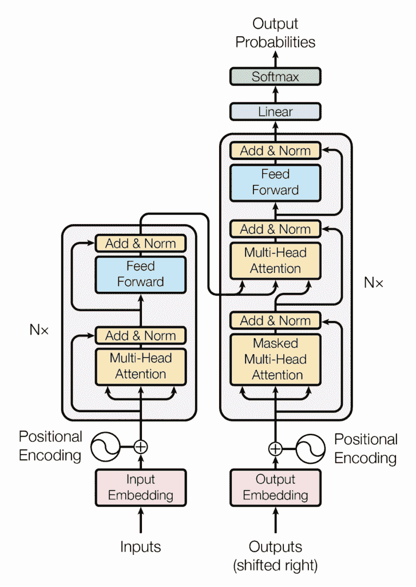
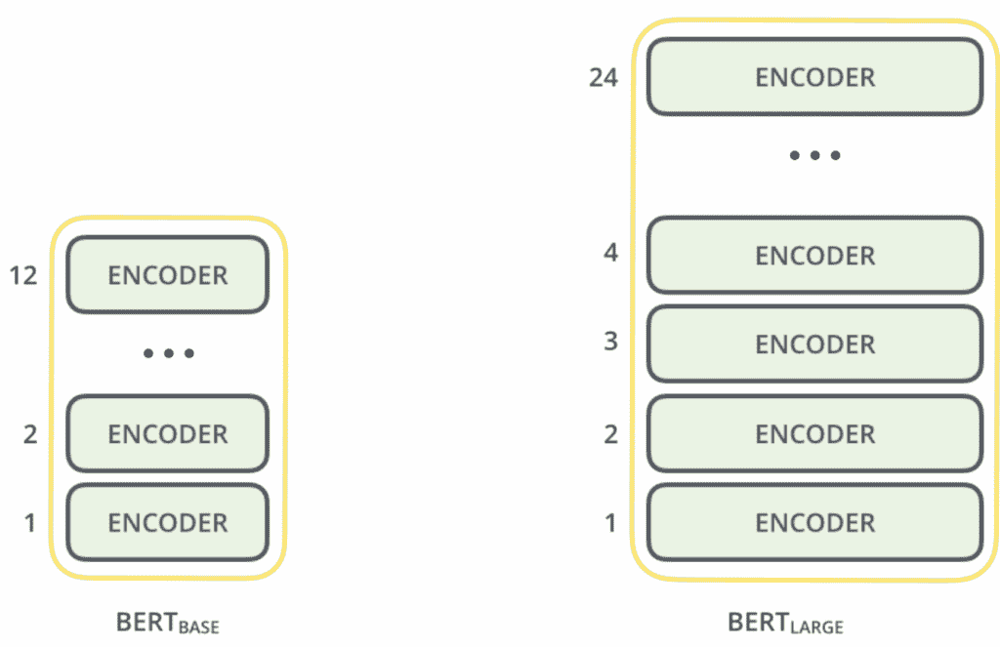
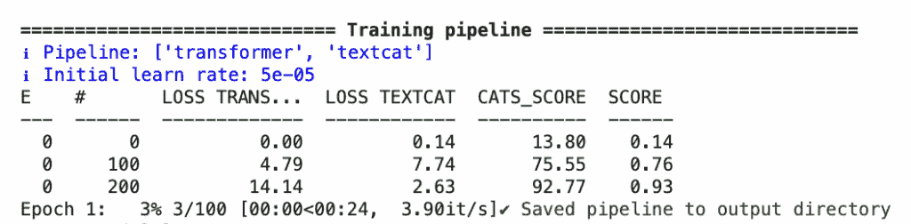

# 学习如何使用 HuggingFace 和 SpaCy 使用 Transformer

> 原文：[`towardsdatascience.com/mastering-nlp-with-spacy-part-4/`](https://towardsdatascience.com/mastering-nlp-with-spacy-part-4/)

## 简介

<mdspan datatext="el1756944594177" class="mdspan-comment">Transformer 目前是 NLP 以及其他领域的最先进架构。现代模型如 ChatGPT、Llama 和 Gemma 都基于 2017 年 Vaswani 等人在《Attention Is All You Need》论文中提出的这一架构。

在 [前一篇文章](https://towardsdatascience.com/mastering-nlp-with-spacy-part-3/) 中，我们看到了如何使用 spaCy 完成几个任务，你可能已经注意到我们从未需要训练任何东西，但我们利用了 spaCy 的能力，这些能力主要是基于规则的方法。

SpaCy 还提供在 NLP 管道中插入可训练组件或使用来自 🤗 HuggingFace Hub 的现成模型，这是一个在线平台，为 AI 开发者提供开源模型以供使用。

那么，让我们学习如何使用 Hugging Face 的模型来使用 SpaCy 吧！

## 为什么是 Transformer？

在 Transformer 之前，创建单词向量表示的 SOTA 架构是 **词向量** 技术。词向量是单词的密集表示，我们可以用它来进行一些数学计算。

例如，我们可以观察到具有相似含义的两个单词也具有相似的向量。这类最著名的技巧是 **GloVe** 和 **FastText**。

然而，这些方法引入了一个大问题，一个单词总是由相同的向量表示。但一个单词并不总是具有相同的含义。

例如：

+   “她去了**银行**取了一些钱。”

+   “他坐在河**岸**边，看着水流。”

在这两句话中，单词 bank 具有两种不同的含义，因此总是用相同的向量来表示这个单词是没有意义的。

基于 Transformer 架构，我们今天能够创建 **考虑整个上下文的模型** 来生成单词的向量表示。



src: [`arxiv.org/abs/1706.03762`](https://arxiv.org/abs/1706.03762)

该网络引入的主要创新是 **多头注意力块**。如果您不熟悉它，我最近写了一篇文章关于这个话题：[`towardsdatascience.com/a-simple-implementation-of-the-attention-mechanism-from-scratch/`](https://towardsdatascience.com/a-simple-implementation-of-the-attention-mechanism-from-scratch/)

Transformer 由两部分组成。左边是 **编码器**，它创建文本的向量表示，右边是 **解码器**，用于生成新的文本。例如，GPT 基于右边部分，因为它作为聊天机器人生成文本。

在这篇文章中，我们关注的是编码器部分，它能够捕捉我们作为输入提供的文本的语义。

## BERT 和 RoBERTa

这不会是一堂关于这些模型的课程，但让我们回顾一些主要话题。

虽然 ChatGPT 是建立在 transformer 架构的解码器一侧，但 BERT 和 RoBERTa 建立在编码器一侧。

BERT 由 Google 在 2018 年推出，你可以在这里了解更多信息：[`arxiv.org/abs/1810.04805`](https://arxiv.org/abs/1810.04805)

BERT 是一系列编码器层。这个模型有两种大小。BERT base 包含 12 个编码器，而 BERT large 包含 24 个编码器



src: [`iq.opengenus.org/content/images/2021/01/bert-base-bert-large-encoders.png`](https://iq.opengenus.org/content/images/2021/01/bert-base-bert-large-encoders.png)

BERT base 生成一个大小为 768 的向量，而大型生成一个大小为 1024 的向量。两者都接受大小为 512 个标记的输入。

BERT 模型使用的分词器称为 [WordPiece](https://huggingface.co/learn/llm-course/chapter6/6)。

BERT 在两个目标上进行训练：

+   **掩码语言模型（MLM）**：预测句子中的缺失（掩码）标记。

+   **下一句预测（NSP）**：确定给定的第二句是否逻辑上跟随第一句。

RoBERTa 模型建立在 BERT 之上，有一些关键的不同之处：[`arxiv.org/abs/1907.11692`](https://arxiv.org/abs/1907.11692)。

RoBERTa 使用动态掩码，因此在训练过程中，掩码标记会随每次迭代而改变，并且不使用 NSP 作为训练目标。

## 使用 RoBERTa 与 SpaCy

`TextCategorizer` 是 spaCy 的一个组件，它为整个文档预测一个或多个标签。它可以工作在两种模式中：

+   **exclusive_classes = true**：每个文本有一个标签（例如，*正面* 或 *负面*）

+   **exclusive_classes = false**：每个文本有多个标签（例如，*垃圾邮件*，*紧急*，*账单*）

spaCy 可以与不同的嵌入相结合：

+   经典词向量（`tok2vec`）

+   我们在这里使用的 Transformer 模型如 **RoBERTa**

这样我们就可以利用 RoBERTa 对英语语言的理解，并将其集成到 spacy 管道中，使其可用于生产。

如果你有一个数据集，你可以使用 spaCy 进一步训练 RoBERTa 模型，以在特定的下游任务上进行微调。

### 数据集准备

在这篇文章中，我将使用 TREC 数据集，它包含简短的 **问题**。每个问题都标记为它期望的 **答案类型**，例如：

|  标签 | 含义 |
| --- | --- |
| ABBR | 缩写 |
| DESC | 描述 / 定义 |
| ENTY | 实体（事物，对象） |
| HUM | 人（个人，团体） |
| LOC | 位置（地点） |
| NUM | 数值（计数，日期等） |

这是一个例子，我们期望的答案是人的名字：

Q（文本）：“谁写了《伊利亚特》？”

A（标签）：“HUM”

如往常一样，我们首先安装库。

```py
!pip install datasets==3.6.0
!pip install -U spacy[transformers]
```

现在我们需要加载准备数据集。

使用 `spacy.blank("en"`) 我们可以创建一个 **空白 spaCy 管道**用于英语。它不包含任何组件（如分词器或解析器），它轻量级且非常适合将原始文本转换为 `Doc` 对象，而不需要加载完整的语言模型，就像我们使用 `en_core_web_sm` 一样。

`DocBin` 是一个特殊的 spaCy 类，它以二进制格式高效地存储许多 `Doc` 对象。这正是 spaCy 预期训练数据应该被保存的方式。

一旦转换并保存为 `.spacy` 文件，这些文件可以直接传递给 `spacy train`，这比使用纯 JSON 或文本文件要快得多。

所以现在这个脚本准备训练和开发数据集应该是相当直接的。

```py
from datasets import load_dataset
import spacy
from spacy.tokens import DocBin

# Load TREC dataset
dataset = load_dataset("trec")

# Get label names (e.g., ["DESC", "ENTY", "ABBR", ...])
label_names = dataset["train"].features["coarse_label"].names

# Create a blank English pipeline (no components yet)
nlp = spacy.blank("en")

# Convert Hugging Face examples into spaCy Docs and save as .spacy file
def convert_to_spacy(split, filename):
    doc_bin = DocBin()
    for example in split:
        text = example["text"]
        label = label_names[example["coarse_label"]]
        cats = {name: 0.0 for name in label_names}
        cats[label] = 1.0
        doc = nlp.make_doc(text)
        doc.cats = cats
        doc_bin.add(doc)
    doc_bin.to_disk(filename)

convert_to_spacy(dataset["train"], "train.spacy")
convert_to_spacy(dataset["test"], "dev.spacy") 
```

我们将使用 spaCy CLI 命令在此数据集上进一步训练 RoBERTa。该命令期望一个 *config.cfg* 文件，其中我们描述了训练类型、使用的模型、epoch 数量等。

这里是我用于训练目的的配置文件。

```py
[paths]
train = ./train.spacy
dev = ./dev.spacy
vectors = null
init_tok2vec = null

[system]
gpu_allocator = "pytorch"
seed = 42

[nlp]
lang = "en"
pipeline = ["transformer", "textcat"]
batch_size = 32

[components]

[components.transformer]
factory = "transformer"

[components.transformer.model]
@architectures = "spacy-transformers.TransformerModel.v3"
name = "roberta-base"
tokenizer_config = {"use_fast": true}
transformer_config = {}
mixed_precision = false
grad_scaler_config = {}

[components.transformer.model.get_spans]
@span_getters = "spacy-transformers.strided_spans.v1"
window = 128
stride = 96

[components.textcat]
factory = "textcat"
scorer = {"@scorers": "spacy.textcat_scorer.v2"}
threshold = 0.5

[components.textcat.model]
@architectures = "spacy.TextCatEnsemble.v2"
nO = null

[components.textcat.model.linear_model]
@architectures = "spacy.TextCatBOW.v3"
ngram_size = 1
no_output_layer = true
exclusive_classes = true
length = 262144

[components.textcat.model.tok2vec]
@architectures = "spacy-transformers.TransformerListener.v1"
upstream = "transformer"
pooling = {"@layers": "reduce_mean.v1"}
grad_factor = 1.0

[corpora]

[corpora.train]
@readers = "spacy.Corpus.v1"
path = ${paths.train}

[corpora.dev]
@readers = "spacy.Corpus.v1"
path = ${paths.dev}

[training]
train_corpus = "corpora.train"
dev_corpus = "corpora.dev"
seed = ${system.seed}
gpu_allocator = ${system.gpu_allocator}
dropout = 0.1
accumulate_gradient = 1
patience = 1600
max_epochs = 10
max_steps = 2000
eval_frequency = 100
frozen_components = []
annotating_components = []

[training.optimizer]
@optimizers = "Adam.v1"
learn_rate = 0.00005
L2 = 0.01
grad_clip = 1.0
use_averages = false
eps = 1e-08
beta1 = 0.9
beta2 = 0.999
L2_is_weight_decay = true

[training.batcher]
@batchers = "spacy.batch_by_words.v1"
discard_oversize = false
tolerance = 0.2

[training.batcher.size]
@schedules = "compounding.v1"
start = 256
stop = 2048
compound = 1.001

[training.logger]
@loggers = "spacy.ConsoleLogger.v1"
progress_bar = true

[training.score_weights]
cats_score = 1.0

[initialize]
vectors = ${paths.vectors}
init_tok2vec = ${paths.init_tok2vec}
vocab_data = null
lookups = null

[initialize.components]
[initialize.tokenizer] 
```

确保你有可用的 GPU 并启动训练 CLI 命令！

`python —m spacy train config.cfg --output ./output --gpu-id 0`

你将看到训练从那里开始，你可以监控 TextCategorizer 组件的损失。



只是为了明确，我们在这里训练的是 **TextCategorizer** 组件，这是一个小的神经网络头部，它接收文档表示并学习预测正确的标签。

但我们也在这个训练过程中对 RoBERTa 进行微调。这意味着 RoBERTa 的权重使用 TREC 数据集进行更新，以便它学会以对分类更有用的方式表示输入问题。

一旦模型训练并保存，我们就可以在推理中使用它了！

```py
import spacy

nlp = spacy.load("output/model-best")

doc = nlp("What is the capital of Italy?")
print(doc.cats) 
```

输出应该类似于以下内容

`{'LOC': 0.98, 'HUM': 0.01, 'NUM': 0.0, …}`

## 最后的想法

回顾一下，在这篇文章中我们看到了如何：使用 spaCy 与 Hugging Face 数据集

+   将文本分类数据转换为 `.spacy` 格式

+   使用 RoBERTa 和 `textcat` 配置完整管道

+   使用 spaCy CLI 训练和测试你的模型

这种方法适用于任何短文本分类任务，如电子邮件、支持工单、产品评论、常见问题解答，甚至聊天机器人意图。
