# 掌握传感器融合：使用 KITTI 数据进行彩色图像障碍物检测 – 第二部分

> 原文：[`towardsdatascience.com/mastering-sensor-fusion-color-image-obstacle-detection-with-kitti-data-part-2-5118be4e92ee/`](https://towardsdatascience.com/mastering-sensor-fusion-color-image-obstacle-detection-with-kitti-data-part-2-5118be4e92ee/)

传感器融合的概念是一种决策机制，可以应用于不同的问题，并使用不同的模态。我们在上一篇文章中提到，在这个 Medium 博客系列中，我们将分析使用激光雷达和彩色图像进行障碍物检测的传感器融合概念。如果您还没有阅读那篇文章，它涉及到使用激光雷达数据的障碍物检测，以下是链接：

> [**传感器融合 – KITTI – ‘基于激光雷达的障碍物检测’ – 第一部分**](https://medium.com/@eroltak/sensor-fusion-kitti-lidar-based-obstacle-detection-part-1-9c5f4bc8d497)

这篇文章是续篇，在这一节中，我将深入探讨彩色图像上的障碍物检测问题。在系列的下一篇和最后一篇文章中（我希望它很快就能发布！），我们将研究使用激光雷达和彩色图像进行传感器融合。

但在继续到这一步之前，让我们继续我们的单模态研究。正如我们之前仅使用激光雷达数据进行障碍物检测一样，这里我们将仅使用彩色图像进行障碍物检测。

正如我们在第一篇文章中所做的那样，我们在这里再次使用 KITTI 数据集。有关需要从 KITTI [1] 下载哪些数据的详细信息，请查看上一篇文章。那里说明了每种数据类型所需的数据、标签和校准文件。

然而，对于那些时间不多的人来说，我们将在 KITTI 视觉基准套件范围内分析 3D 目标检测问题。在这个背景下，我们将在这篇文章中分析使用“左相机”获取的彩色图像。

在本篇文章范围内，我们将首先检查的子标题是使用“左相机”获取的图像分析。下一个主题将是基于 2D 图像的目标检测器。虽然这些目标检测器有着悠久的历史，并且有不同的类型，如两阶段检测器、单阶段检测器或视觉-语言模型，但我们将分析最流行的两种技术：YoloWorld [2]，它是一个开放词汇的目标检测器，以及 YoloV8[3]，它是一个单阶段目标检测器。在这种情况下，在比较这些目标检测器之前，我将给出如何微调 YoloV8 以解决 KITTI 目标检测问题的应用示例。之后，我们将比较模型，是的，我们将通过讨论切片辅助目标检测框架 SAHI [4] 来完成这篇文章，以解决我们未来将看到的检测小型目标的问题。

那么，让我们从数据分析部分开始吧！

### KITTI 2D 彩色图像数据集分析

KITTI 3D 目标检测数据集包括 7481 张训练图像和 7581 张测试图像。并且，每张训练图像都有一个包含图像平面中对象坐标的标签文件。这些标签文件以".txt"格式呈现，并按行组织。每一行代表相关图像中的标记对象。在这种情况下，每一行由总共 16 列组成（如果你对这些列感兴趣，我强烈建议你查看本系列中的前一篇文章）。但在这里大致介绍一下，第一列表示相关对象的类型，第 5 列到第 8 列之间的值表示该对象在图像坐标系中的位置。让我分享一个样本图像及其标签文件如下。

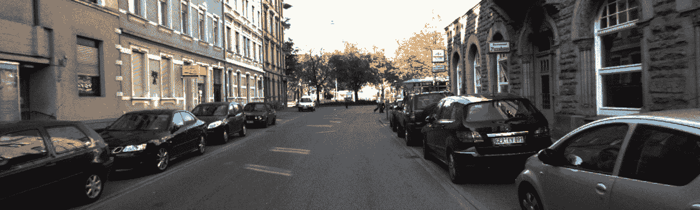

一个样本 2D 彩色图像（图像来自 KITTI）

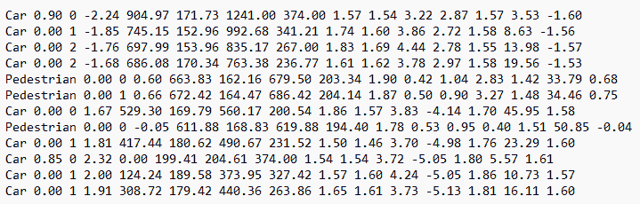

上图对应的标签文件（标签文件来自 KITTI）

如我们所见，图像中识别出了很多汽车和三名行人。在深入分析之前，让我分享一下 KITTI 中的对象类型。KITTI 的标签文件中有 9 个不同的类别。这些是："Car"（汽车）,"Truck"（卡车）,"Van"（货车）,"Tram"（电车）,"Pedestrian"（行人）,"Cyclist"（骑自行车的人）,"Person_sitting"（坐着的人）,"Misc"（其他）和"DontCare"（不考虑）。

虽然一些对象类型很明显，但"Misc"和"Don’t Care"可能有点令人困惑。同时，"Misc"代表不适用于上述主要类别（汽车、行人、骑自行车的人等）的对象。它们可能是交通锥、小物体、未知车辆或类似物体但无法明确分类的对象。另一方面，"DontCare"指的是我们不应考虑的区域。

在了解类别之后，让我们尝试可视化主要类的分布。

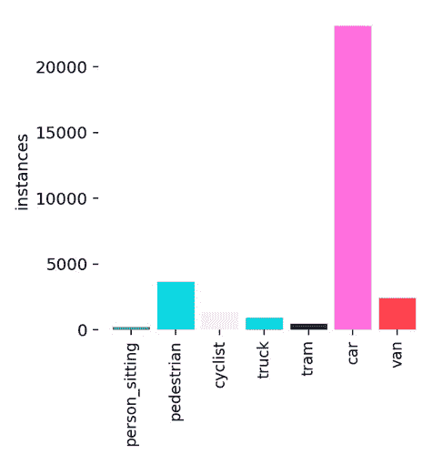

KITTI 彩色图像中主要类的分布

从分布图中可以看出，类中包含的示例数量分布不平衡。例如，"Car"类的示例数量远高于类中的平均示例数量，而对于"Person_sitting"类，情况正好相反。

在这里，我想对这些数字开一个括号，特别是从统计学习角度来看。这种类别之间的不平衡分布可能会导致统计学习方法表现不佳或偏向某些类别。我想为那些想要处理这个主题的读者留下一些应该想到的重要关键词：子采样、正则化、偏差-方差问题、加权或焦点损失等。（如果您想让我写一篇关于这些概念的文章，请在评论中留言。）

在分析部分，我们将探讨的另一个主题将与对象的大小有关。在这里，我指的是图像坐标系中相关对象的像素尺寸。这个问题可能一开始会被忽视，或者可能不理解这种测量可能带来的积极回报。然而，某种对象类型的平均边界框大小可能天生比其他对象类别的框大小小得多。在这种情况下，我们可能无法检测到该对象类型（这种情况大多数时候都会发生）或者我们可以将其分类为不同的对象类型（很少见）。然后让我们按如下方式分析每个类别的尺寸分布。

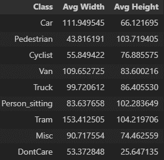

KITTI 数据集中每个类别的边界框大小

如果我们将“Misc”和“DontCare”对象类型分开，则在“行人”、“Person_sitting”和“Cyclist”类型的边界框大小与其他对象类型的大小之间只有微小的差异。这给我们一个红旗，表明我们在识别这些类别时可能需要特别努力。在这种情况下，我将在以下部分通过开设一个关于切片辅助目标检测的特殊子标题来给你一些提示！

### 基于二维图像的目标检测器

基于二维图像的目标检测器是计算机视觉模型，旨在识别和定位图像中的对象。这些模型可以广泛分为两阶段和单阶段检测器。在**两阶段检测器**中，模型首先通过区域提议网络（RPN）或类似机制生成潜在对象提议。然后，在第二阶段，这些提议被细化并分类到特定的对象类别。这种类型的流行例子是**Faster R-CNN** [5]。这种方法因其对潜在对象的详细评估而以其高精度而闻名，但由于两步过程，它往往较慢，这可能对实时应用构成限制。

![Faster RCNN 的系统架构（图片来自[5]）](../Images/ede173911bbe77fa9e1c7a314dfcea27.png)

Faster RCNN 的系统架构（图片来自[5]）

相比之下，**单阶段检测器**旨在通过单次遍历直接预测所有潜在边界框的对象位置和分类。这种方法更快、更高效，使其非常适合实时检测应用。例如包括**YOLO（You Only Look Once）**[3]和**SSD（Single Shot Multibox Detector）**[6]。这些模型将图像划分为网格，并对每个网格单元预测边界框和类别概率，从而实现更流畅和快速的检测过程。尽管单阶段检测器可能为了速度牺牲一些精度，但它们在需要实时性能的应用中得到了广泛应用，如自动驾驶和视频监控。

![YoloV8 的系统架构（图片来自[3]）](../Images/49df84e64e41fda4f355e5a9059814b6.png)

YoloV8 的系统架构（图片来自[3]）

在提供简介信息之后，让我们深入探讨应用于我们问题的目标检测器；第一个是 YoloWorld[2]，第二个是 YoloV8 [3]。在这里，你可能想知道为什么我们要分析两个不同的 YOLO 模型。这里的主要观点是，YoloV8 是一个单阶段检测器，而 YoloWorld 是一种特殊的检测器，近年来在开放关键词下被广泛研究，即没有封闭集分类模型。这意味着，从理论上讲，这些基于开放词汇检测的模型能够检测任何类型的对象！

### YoloWorld

YoloWorld 是开放词汇目标检测时代有希望的研究之一。但开放词汇目标检测究竟是什么呢？

要理解开放词汇的概念，让我们退一步，理解传统目标检测器背后的核心思想。训练模型的样本和简单基石可以表述如下。

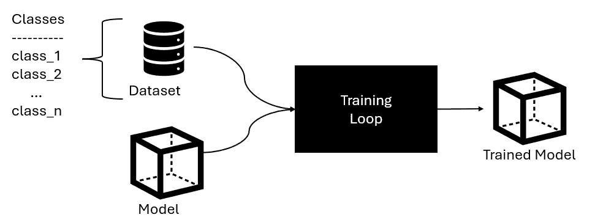

训练模型的训练流程

在传统的机器学习中，模型是在*n*个不同的类别上训练的，其性能也只在这些*n*个类别上评估。例如，让我们考虑一个在训练过程中未包含的类别，比如“鸟”。如果我们给训练好的模型一个鸟的图像，它将无法在图像中检测到“鸟”。由于“鸟”不是训练数据集的一部分，模型无法将其识别为新的类别或泛化理解它超出了其训练范围。简而言之，传统模型无法识别或处理训练过程中未见过的类别。

另一方面，开放词汇物体检测通过使模型能够检测它们明确训练的类别之外的物体来克服这一限制。这是通过利用视觉-文本表示来实现的，其中模型使用配对的图像-文本数据进行训练，例如“一张猫的照片”或“一个人骑自行车的照片”。这些模型不是仅仅依赖于固定的类别标签，而是通过它们的语义描述学习对物体的更普遍的理解。

因此，当面对一个新的物体类别，例如“鸟”时，模型可以通过将物体的视觉特征与文本描述关联起来来识别和分类它，即使这个类别不是其训练数据的一部分。这种能力在现实世界的应用中特别有用，在这些应用中，物体的种类繁多，对每个可能的类别进行模型训练是不切实际的。

那么，这个机制是如何工作的呢？实际上，这里的真正魔法是同时使用视觉和文本信息。那么，让我们首先看看 YoloWorld 的系统架构，然后逐一分析核心组件。

![YoloWorld 的系统架构（图片来自 YoloWorld [2]）](../Images/a2961c95c55336f679c4af821100c3f4.png)

YoloWorld 的系统架构（图片来自 YoloWorld [2]）

我们可以从一般到具体分析模型如下。YoloWorld 接受图像 *{I}* 和相应的文本 *{T}* 作为输入，然后输出预测的边界框 *{Bk}* 和物体嵌入 *{ek}*。

*{T}* 被输入到预训练的 CLIP [7] 模型中，以转换为词汇嵌入。另一方面，YOLO Backbone，作为一个视觉信息编码器，从 *{I}* 中提取多尺度图像特征。目前，两种不同的输入类型有自己的模态特定嵌入，由不同的编码器处理。然而，“视觉-语言 PAN”同时使用这两种嵌入，并通过跨模态融合方法创建了一种多模态嵌入。

![YoloWorld 中的视觉-语言 PAN 层 [2]](../Images/1bf9ccc941e0ff3c029e6f8e8357447f.png)

YoloWorld 中的视觉-语言 PAN 层 [2]

让我们一步一步地过这个层。首先 {Cx} 是多尺度视觉特征。在顶部，我们有文本嵌入 *{Tc}.* 每个视觉特征遵循 *Cx* ∈ H×W×D 维度，每个文本特征遵循 *Tc* ∈ CXD 维度。然后每个组件的乘积（在视觉特征重塑后），将会有一个注意力得分向量，它形成 1XC。

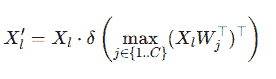

T-CSPLayer 中文本到图像特征融合的公式

然后，通过归一化最大注意力向量和乘以视觉向量和基于融合的注意力向量，我们计算新的视觉向量形式。

然后，这些新形成的视觉特征被输入到“I-Pooling 注意力”层，该层使用 3×3 的最大核提取 27 个补丁。这些补丁的输出被提供给多头注意力机制，类似于 Transformer 架构，以更新图像感知文本嵌入如下。

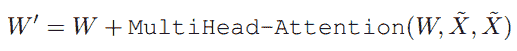

I-Pooling 注意力层的公式

在这些过程之后，输出由两个回归头形成。第一个是“文本对比头”，另一个是“边界框头”。为了训练模型，整体系统损失函数可以表示如下。

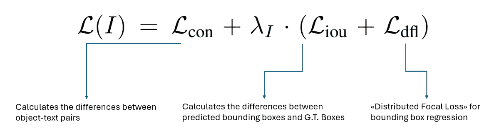

YoloWorld 的损失函数

然后，现在让我们进入应用部分，看看结果，而不进行任何微调。毕竟，我们希望这个模型即使没有专门用我们的 KITTI 类别进行训练，也能做出正确的判断，对吧 😎

如我们在之前的博客文章中所做的那样，您可以通过以下 GitHub 链接找到完整的文件、代码等，我将在底部提供。

第一步是模型初始化，以及定义我们感兴趣的 KITTI 问题的类。

```py
# Load YOLOOpenWorld model (pre-trained on COCO dataset)
yoloWorld_model = YOLOWorld("yolov8x-worldv2.pt")

# Define class names to filter
target_classes = ["car", "van", "truck", "pedestrian", "person_sitting", "cyclist", "tram"]  
class_map = {idx:class_name for idx, class_name in enumerate(target_classes)}

## set the interested classes there
yoloWorld_model.set_classes(target_classes)
```

下一步是加载一个样本图像及其 G.T.框的可视化。

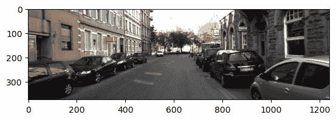

KITTI 数据集的样本图像

我们样本的 G.T.边界框如下。更具体地说，G.T.标签包括 9 辆车和 3 个行人！（如此复杂的场景）

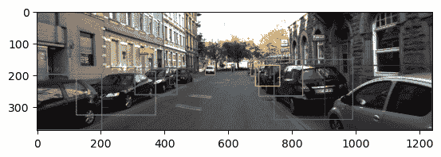

样本图像的 G.T.边界框

在进入 YoloWorld 预测之前，让我再次强调，我们没有对 YoloWorld 模型进行任何微调，我们直接使用了该模型。使用它的预测可以如下进行。

```py
## 2\. Perform detection and detection list arrangement
det_boxes, det_class_ids, det_scores = utils.perform_detection_and_nms(yoloWorld_model, sample_image, det_conf= 0.35, nms_thresh= 0.25)
```

预测的输出如下。

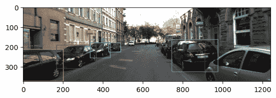

YoloWorld 模型对样本图像的预测

关于预测，我们可以看到找到了 6 个汽车类别和 1 个货车类别。输出评估可以如下进行。

```py
## 4\. Evaluate the predicted detections with G.T. detections
print("# predicted boxes: {}".format(len(pred_detections)))
print("# G.T. boxes: {}".format(len(gt_detections)))
tp, fp, fn, tp_boxes, fp_boxes, fn_boxes = utils.evaluate_detections(pred_detections, gt_detections, iou_threshold=0.40)
pred_precision, pred_recall = utils.calculate_precision_recall(tp, fp, fn)
print(f"TP: {tp}, FP: {fp}, FN: {fn}")
print(f"Precision: {pred_precision}, Recall: {pred_recall}") 
```

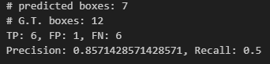

使用 YoloWorld 模型进行预测的评价指标得分

现在我们能做的，识别出一个对象但分类错误（实际类别是“Car”但被分类为“Van”）。然后总共，有 6 个边界框找不到。这使得我们的召回率得分为 0.5，精确率得分约为 0.86。

让我分享一些其他预测图作为例子。

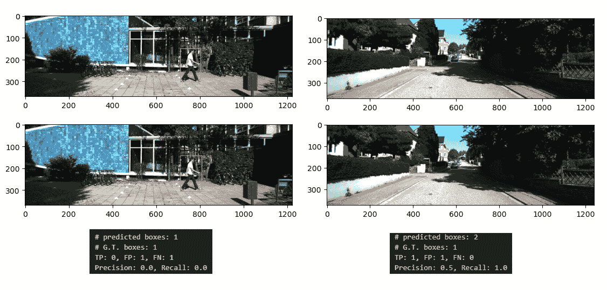

YoloWorld 模型的其它示例

第一行指的是预测样本，第二行代表真实标签的边界框和类别。在左侧，我们可以看到一个行人从左向右行走。幸运的是，YoloWorld 在边界框尺寸方面完美地预测了物体，但类别预测为“Pedestrian_sitting”，而真实标签是“Pedestrian”。这就是为什么精确率和召回率都是 0.0 :/

在右侧，YoloWorld 预测了 2 个“Cars”，而真实标签中只有 1 个“Car”。因此，精确率得分为 0.5，召回率得分为 1.0

所以到目前为止，我们已经看到了一些 Yolo 的预测，这个模型作为一个初始步骤，可以说是可以接受的，不是吗？

我们必须承认，对于这样一个关键应用领域的模型，改进肯定是必要的。然而，我们不应忘记，即使没有微调，我们也能取得一些令人满意的结果！

然后，这个需求引导我们进入下一步，即传统的模型，YoloV8 及其微调。让我们开始吧！

### YoloV8

YOLOv8（You Only Look Once 版本 8）是 YOLO 系列目标检测模型中最先进的版本之一，旨在推动计算机视觉任务中速度、精度和灵活性的边界。在继承前辈的成功基础上，YOLOv8 集成了诸如无锚点检测机制和解耦检测头部等创新特性，以简化目标检测流程。这些改进降低了计算开销，同时提高了在不同尺度和复杂场景中检测对象的能力。此外，YOLOv8 引入了动态任务适应性，使其不仅能够执行目标检测，还能够无缝地进行图像分割和分类。这种多功能性使其成为各种实际应用的理想解决方案，从自动驾驶汽车和监控到医学成像和零售分析。

使 YOLOv8 与众不同的地方在于它专注于现代深度学习趋势，如优化的训练流程、最先进的损失函数和模型缩放策略。包含无锚点检测机制消除了对预定义锚框的需求，使模型对变化的对象形状更加鲁棒，并减少了假阴性的可能性。解耦头部设计分别优化分类和回归任务，提高了整体检测精度。此外，YOLOv8 的轻量级架构确保了在性能不受影响的情况下更快地推理，使其适合在边缘设备上部署。总的来说，YOLOv8 通过提供一种高效且准确的解决方案，继续了 YOLO 的传统，适用于广泛的计算机视觉任务。

对于更深入的分析和实现细节，请参阅：

1.  Yolov8 Medium 文章：[`docs.ultralytics.com/`](https://abintimilsina.medium.com/yolov8-architecture-explained-a5e90a560ce5)

1.  探索性文章：[`arxiv.org/pdf/2408.15857`](https://arxiv.org/pdf/2408.15857)

但在进入下一步，即微调 Yolo 模型以适应我们的问题之前，让我们可视化现成的 YoloV8 模型在我们样本图像上的输出。（当然，现成的模型并不涵盖我们问题的所有类别，但至少它可以检测到我们样本图像所需的车辆和行人）

```py
## Load the off-the-shelf yolo model and get the class name mapping dict
off_the_shelf_model = YOLO("yolov8m.pt")
off_the_shelf_class_names = off_the_shelf_model.names

## then make a prediction as we did before
det_boxes, det_class_ids, det_scores = utils.perform_detection_and_nms(off_the_shelf_model, sample_image, det_conf= 0.35, nms_thresh= 0.25)
```

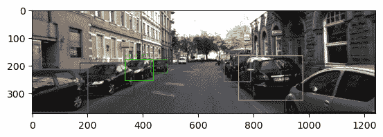

现成的 YoloV8-m 模型的预测输出

现成的模型预测了 8 辆车，这几乎是可以接受的！只缺少 1 辆车和 1 个行人，但就目前来说这也足够了。

然后，让我们尝试微调这个现成的模型以适应我们的问题。

### YoloV8 微调

在本节中，我们将微调现成的 YoloV8-m 模型以更好地适应我们的问题。但在那之前，我们需要调整适当的标签文件。我知道这不是最有意思的部分，但这是在微调阶段看到进度条之前必须做的事情。为了使其可用，我准备了一个函数，就像所有其他组件一样，可以在我的 GitHub 仓库中找到。

```py
def convert_label_format(label_path, image_path, class_names=None):
    """
    Converts a custom label format into YOLO label format. 

    This function takes a path to a label file and the corresponding image file, processes the label information, 
    and outputs the annotations in YOLO format. YOLO format represents bounding boxes with normalized values 
    relative to the image dimensions and includes a class ID.

    Key Parameters:
    - `label_path` (str): Path to the label file in custom format.
    - `image_path` (str): Path to the corresponding image file.
    - `class_names` (list or set, optional): A collection of class names. If not provided, 
    the function will create a set of unique class names encountered in the labels.

    Processing Details:
    1\. Reads the image dimensions to normalize bounding box coordinates.
    2\. Filters out labels that do not match predefined classes (e.g., car, pedestrian, etc.).
    3\. Converts bounding box coordinates from the custom format to YOLO's normalized center-x, center-y, width, and height format.
    4\. Updates or utilizes the provided `class_names` to assign a class ID for each annotation.

    Returns:
    - `yolo_lines` (list): List of strings, each in YOLO format (<class_id> <x_center> <y_center> <width> <height>).
    - `class_names` (set or list): Updated set or list of unique class names.

    Notes:
    - The function assumes specific indices (4 to 7) for bounding box coordinates in the input label file.
    - Normalization is based on the dimensions of the input image.
    - Class filtering is limited to a predefined set of relevant classes.
    """
```

此操作后的样本标签文件将如下所示。

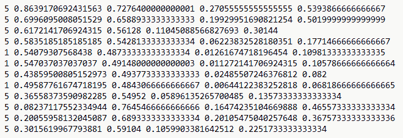

用于样本图像的 Yolo 方向标签文件

第一个显示类 ID，接下来的 4 个显示坐标。然后，我们需要创建一个".ymal"文件，显示标签文件的存储位置，训练和验证集的分割，以及相应的图像。同样，我也准备了所需的函数。

```py
def create_data_yaml(images_path, labels_path, base_path, train_ratio=0.8):
    """
    Creates a dataset directory structure with train and validation splits for YOLO format.

    This function organizes image and label files into separate training and validation directories,
    converts label files to the YOLO format, and ensures the output structure adheres to YOLO conventions.

    Key Parameters:
    - `images_path` (str): Path to the directory containing the image files.
    - `labels_path` (str): Path to the directory containing the label files in custom format.
    - `base_path` (str): Base directory where the train/val split directories will be created.
    - `train_ratio` (float, optional): Ratio of images to allocate for training (default is 0.8).

    Processing Details:
    1\. **Dataset Splitting**:
    - Reads all image files from `images_path` and splits them into training and validation sets 
        based on `train_ratio`.
    2\. **Directory Creation**:
    - Creates the necessary directory structure for train/val splits, including `images` and `labels` subdirectories.
    3\. **Label Conversion**:
    - Uses `convert_label_format` to convert label files to YOLO format.
    - Updates a set of unique class names encountered in the labels.
    4\. **File Organization**:
    - Copies image files into their respective directories (train or val).
    - Writes the converted YOLO labels into the appropriate `labels` subdirectory.

    Returns:
    - None (operates directly on the file system to organize the dataset).

    Notes:
    - The function assumes labels correspond to image files with the same name (except for the file extension).
    - Handles label conversion using a predefined set of class names, ensuring consistency.
    - Uses `shutil.copy` for images to avoid removing original files.

    Dependencies:
    - Requires `convert_label_format` to be implemented for proper label conversion.
    - Relies on `os`, `shutil`, `Path`, and `tqdm` libraries.

    Usage Example:
    ```python

    create_data_yaml(

        images_path='/path/to/images',

        labels_path='/path/to/labels',

        base_path='/output/dataset',

        train_ratio=0.8

    )

    """

```py

Then, it’s time to fine-tune our model!

```

def train_yolo_world(data_yaml_path, epochs=100):

    """

    在自定义数据集上训练 YOLOv8 模型。

    此函数利用 YOLOv8 框架使用指定数据集微调预训练模型。

    和训练配置。

    关键参数：

    - `data_yaml_path`（str）：包含数据集配置的 YAML 文件路径（例如，训练/验证分割的路径，类名）。

    - `epochs`（int，可选）：训练轮数（默认为 100）。

    处理细节：

    1. **模型初始化**：

    - 加载 YOLOv8 中等尺寸模型（`yolov8m.pt`）作为训练的基础模型。

    2. **训练配置**：

    - 定义训练超参数，包括图像大小、批大小、设备、工作进程数和提前停止（`patience`）。

    - 结果保存到项目目录（`yolo_runs`）中，具有特定的运行名称（`fine_tuning`）。

    3. **训练执行**：

    - 启动训练过程并跟踪指标，如损失和 mAP。

    返回值：

    - `results`: 训练结果，包括评估指标和性能跟踪。

    备注：

    - 假设 YOLOv8 框架已正确安装且可通过`YOLO`访问。

    - 数据集 YAML 文件必须包含训练集和验证集的路径，以及类名。

    依赖关系：

    - 需要 YOLOv8 框架中的`YOLO`类。

    用例示例：

    ```pypython
    results = train_yolo_world(
        data_yaml_path='path/to/data.yaml',
        epochs=50
    )
    print(results)
    """
```

在那个阶段，我使用了默认的微调参数，这些参数在这里定义：[`docs.ultralytics.com/models/yolov8/#can-i-benchmark-yolov8-models-for-performance`](https://docs.ultralytics.com/models/yolov8/#can-i-benchmark-yolov8-models-for-performance)

但是我强烈建议你尝试其他超参数，比如学习率、优化器等。因为这些参数直接影响到模型的输出性能，它们非常重要。

无论如何，让我们现在尽量保持简单，跳到我们对 KITTI 主要类别的微调模型输出性能上。

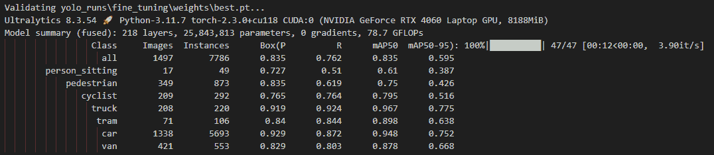

微调的 YoloV8-m 模型在验证集上的输出性能

如我们所见，整体 mAP50 为 0.835，这对于第一次射击来说是个不错的成绩。但是，“Person_sitting”和“Pedestrian”这些在自动驾驶中非常重要的类别，mAP50 分数分别为 0.61 和 0.75。这背后可能有几个原因；它们的边界框尺寸相对较小，另一个原因可能是这些类别的样本数量。当然，还有一些像“Cyclist”和“Tram”这样的类别也有几张图像，但确实有点像黑盒。如果你想让我深入调查这种行为，请在评论中指明。这将是我的一大乐事！

正如我们在前面的章节中所做的那样，让我在这里再次分享样本图像的微调模型结果。

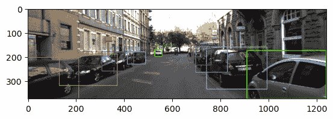

微调模型在样本图像上的输出

现在，微调模型检测到了 2 个行人，1 个骑自行车的人，9 辆车！对于那个样本图像来说，几乎就完成了。因为这个检测意味着；

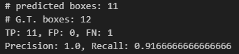

使用微调模型预测的评价指标分数

它比现成的模型要好得多（即使我们没有进行太多的超参数搜索！）。然后让我再和你分享另一张图片。

![另一个样本图像（原始版本，图像来自 KITTI [1]）](../Images/d13495b2857ca804d9552ae829540a00.png)

另一个样本图像（原始版本，图像来自 KITTI [1]）

现在，在那个场景中，左侧有一辆车。但是等等！那里还有一些其他的车辆，但它们太小了，看不清楚。

让我们检查一下我们精心微调的模型输出！

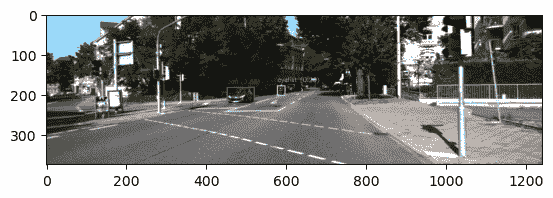

微调模型在第二个样本图像上的输出

OMG！它只检测到了汽车和紧跟其后的骑自行车的人。那么那些站在骑自行车者右侧的人呢？是的，现在这种情况带我们来到了下一个也是最后一个话题：在二维图像中检测小型物体。让我们开始吧。

### 处理小型物体

KITTI 图像的宽度为 1342 像素，高度为 375 像素。然后在将其输入模型之前进行缩放操作，使其变为 640 x 640。让我给你展示一下在输入模型之前的视觉图像如下。

![左边是原始的原始图像，右边是它的缩放版本（图像来自 KITTI [1])](../Images/dcdf2226536238e3df6d3a2a3c557264.png)

左边是原始的原始图像，右边是它的缩放版本（图像来自 KITTI [1])

我们可以看到一些物体严重变形。此外，我们还可以观察到一些距离相机较远的物体变得更小。有一种方法可以帮助我们克服在这两种情况下以及在高分辨率图像中检测物体时遇到的问题。它的名字叫“SAHI” [4]，切片辅助超推理。其核心概念非常清晰；它将图像分割成更小的、可管理的切片，在每个切片上执行目标检测，并将结果无缝合并。

然而，在多个切片上重复运行目标检测模型并合并结果，正如预期的那样，将需要大量的计算能力和时间。然而，SAHI 通过其优化和内存使用克服了这一点！此外，它与许多不同的目标检测器兼容，使其适用于实际工作。

这里有一些链接，可以帮助你深入了解 SAHI 并观察其在不同问题上的性能提升：

— SAHI 论文：[`arxiv.org/pdf/2202.06934`](https://arxiv.org/pdf/2202.06934)

— SAHI GitHub：[`github.com/obss/sahi`](https://github.com/obss/sahi)

然后让我们使用基于 SAHI 的推理可视化我们的第二个样本图像：

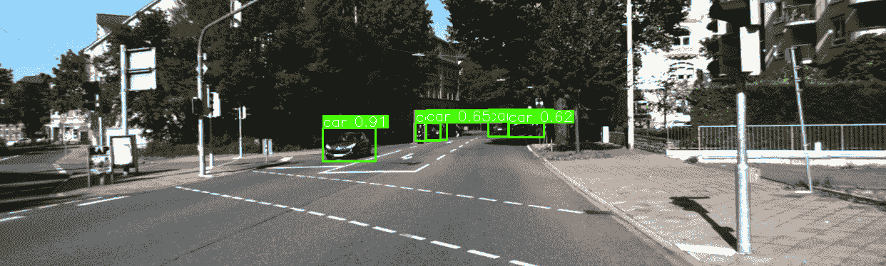

使用 SAHI 在另一张样本图像上微调模型的输出

哇！我们可以看到几辆汽车和一名骑自行车的人被完美地检测到了！如果你也遇到了类似的问题，请查看论文和实现代码！

### 结论

好吧，现在我们终于到达了终点。在这个过程中，我们首先在我们的第一篇文章中尝试使用无监督学习算法来解决基于激光雷达的障碍物检测问题。在这篇文章中，我们使用了不同的目标检测算法。在这些算法中，有基于“开放词汇”的 YoloWorld，或者更传统的“闭集”目标检测模型 YoloV8，以及 YoloV8 的“微调”版本，它更适合 KITTI 问题。此外，我们还借助“SAHI”在检测小型物体方面获得了一些结果。

当然，我们提到的每个主题都是一个活跃的研究领域。许多研究人员仍在这些领域努力取得更成功的成果。在这里，我们尝试从应用科学家的角度提出解决方案。

然而，如果您希望我更多地讨论某个主题，或者您希望关于某些部分的文章完全不同，请在评论中指明。

### 接下来是什么？

那么，现在，让我们在下一次出版物中见面，那将是系列的最后一篇文章，我们将同时使用激光雷达和彩色图像检测障碍物。

> **欢迎任何评论、错误修复或改进！**
> 
> ***感谢大家，祝你们健康。***

* * *

***GitHub 链接***：[`github.com/ErolCitak/KITTI-Sensor-Fusion/tree/main/color_image_based_object_detection`](https://github.com/ErolCitak/KITTI-Sensor-Fusion/tree/main/color_image_based_object_detection)

**参考文献：**

[1] [`www.cvlibs.net/datasets/kitti/`](https://www.cvlibs.net/datasets/kitti/)

[2] [`docs.ultralytics.com/models/yolo-world/`](https://docs.ultralytics.com/models/yolo-world/)

[3] [`docs.ultralytics.com/models/yolov8/`](https://docs.ultralytics.com/models/yolov8/)

[4] [`github.com/obss/sahi`](https://github.com/obss/sahi)

[5] [`arxiv.org/abs/1506.01497`](https://arxiv.org/abs/1506.01497)

[6] [`arxiv.org/abs/1512.02325`](https://arxiv.org/abs/1512.02325)

[7] [`openai.com/index/clip/`](https://openai.com/index/clip/)

## 免责声明

本博客系列中使用的图像是用于教育和研究目的从 KITTI 数据集中获取的。如果您想用于类似目的，您必须前往相关网站，批准那里的预期用途，并按照基准创建者定义的引用使用。

对于**2012 年立体视觉**、**2012 年光流**、**里程计**、**目标检测**或**跟踪基准**，请引用：@inproceedings{[Geiger2012CVPR](https://www.cvlibs.net/publications/Geiger2012CVPR.pdf), author = {[Andreas Geiger](https://www.cvlibs.net/) and [Philip Lenz](http://www.mrt.kit.edu/mitarbeiter_lenz.php) and [Raquel Urtasun](http://ttic.uchicago.edu/~rurtasun)}, title = {Are we ready for Autonomous Driving? The KITTI Vision Benchmark Suite}, booktitle = {Conference on Computer Vision and Pattern Recognition (CVPR)}, year = {2012} }

对于**原始数据集**，请引用：@article{[Geiger2013IJRR](https://www.cvlibs.net/publications/Geiger2013IJRR.pdf), author = {[Andreas Geiger](https://www.cvlibs.net/) and [Philip Lenz](http://www.mrt.kit.edu/mitarbeiter_lenz.php) and [Christoph Stiller](http://www.mrt.kit.edu/mitarbeiter_stiller.php) and [Raquel Urtasun](http://ttic.uchicago.edu/~rurtasun)}, title = {Vision meets Robotics: The KITTI Dataset}, journal = {International Journal of Robotics Research (IJRR)}, year = {2013} }

对于**道路基准**，请引用：@inproceedings{[Fritsch2013ITSC](https://www.cvlibs.net/publications/Fritsch2013ITSC.pdf), author = {Jannik Fritsch and Tobias Kuehnl and [Andreas Geiger](https://www.cvlibs.net/)}, title = {A New Performance Measure and Evaluation Benchmark for Road Detection Algorithms}, booktitle = {International Conference on Intelligent Transportation Systems (ITSC)}, year = {2013} }

对于**2015 年立体视觉**、**2015 年光流**和**2015 年场景流**基准，请引用：@inproceedings{[Menze2015CVPR](https://www.cvlibs.net/publications/Menze2015CVPR.pdf), author = {[Moritz Menze](http://www.ipi.uni-hannover.de/tmm.html) and [Andreas Geiger](https://www.cvlibs.net/)}, title = {Object Scene Flow for Autonomous Vehicles}, booktitle = {Conference on Computer Vision and Pattern Recognition (CVPR)}, year = {2015} }
