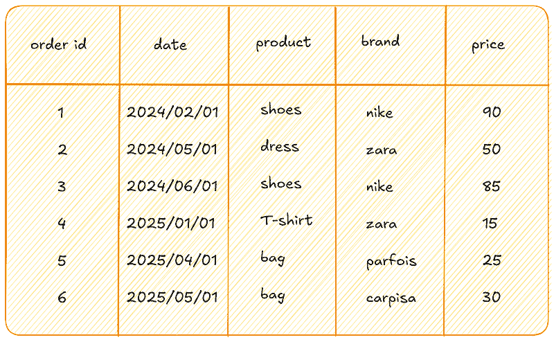

# 掌握 SQL 窗口函数

> 原文：[`towardsdatascience.com/mastering-sql-window-functions/`](https://towardsdatascience.com/mastering-sql-window-functions/)

<mdspan datatext="el1749533647765" class="mdspan-comment">在过去的一年里</mdspan>，我在工作中编写了无数个 SQL 查询来从数据中提取洞察。这始终是一个具有挑战性的任务，因为它不仅需要编写高效的查询，而且还需要足够简单，以便随着时间的推移进行维护。

每个新问题都带来新的教训，最近，我一直在深入研究 SQL 窗口函数。当你需要在对一组行进行计算时，这些强大的工具非常有用，而且不会丢失单个记录的粒度。

在这篇文章中，我将逐步分解 SQL 窗口函数。它们一开始可能看起来很复杂或不直观，但一旦你了解了它们的工作原理，你就会看到它们是多么不可或缺。你准备好了吗？让我们一起深入研究并掌握它们！

* * *

**目录**

+   **我们为什么需要窗口函数？**

+   **窗口函数的语法**

+   **四个简单示例**

* * *

## 我们为什么需要窗口函数？

要理解窗口函数的强大之处，让我们从一个简单的例子开始。想象我们有一个包含来自电子商务网站的六个订单的表。每一行包括订单 ID、日期、产品、品牌和价格。



作者插图。展示窗口函数强大功能的示例表。

假设我们想要计算每个品牌的总价格。使用**GROUP BY**子句，我们可以编写如下查询：

```py
SELECT 
      brand, 
      SUM(price) as total_price 
FROM Orders 
GROUP BY brand
```

这返回了一个结果，其中每行代表一个品牌，以及该品牌下所有订单的总价格。

```py
|brand  |total_price|
|-------|-----------|
|carpisa|30         |
|nike   |175        |
|parfois|25         |
|zara   |65         |
```

这个聚合移除了单个订单的细节，因为输出只为每个品牌包含一行。如果我们想保留所有原始行并添加每个品牌的总价格作为额外字段呢？

通过使用 `SUM(price) OVER (PARTITION BY brand)`，我们可以计算每个品牌的总价格 **而不合并行**：

```py
SELECT 
    order_id,
    date,
    product,
    brand,
    price,
    SUM(price) OVER (PARTITION BY brand) as total_price
FROM Orders
```

我们得到了这样的结果：

```py
|order_id|date      |product|brand  |price|total_price|
|--------|----------|-------|-------|-----|-----------|
|6       |2025/05/01|bag    |carpisa|30   |30         |
|1       |2024/02/01|shoes  |nike   |90   |175        |
|3       |2024/06/01|shoes  |nike   |85   |175        |
|5       |2025/04/01|bag    |parfois|25   |25         |
|2       |2024/05/01|dress  |zara   |50   |65         |
|4       |2025/01/01|t-shirt|zara   |15   |65         |
```

这个查询返回所有六行，保留每个单独的订单，并添加一个显示每个品牌总价格的新的列。例如，品牌 Carpisa 的订单显示总额为 30，因为它只有一个 Carpisa 订单，耐克的两个订单显示 175（90+85），依此类推。

你可能会注意到，表格不再按订单 _id 排序。这是因为窗口函数按品牌分区，而 SQL 不保证除非明确指定，否则行顺序。为了恢复原始顺序，我们只需简单地添加一个`ORDER BY`子句：

```py
SELECT 
    order_id,
    date,
    product,
    brand,
    price,
    SUM(price) OVER (PARTITION BY brand) as total_price
FROM Orders
ORDER BY order_id
```

最后，我们得到了包含所有所需细节的输出：

```py
|order_id|date      |product|brand  |price|total_price|
|--------|----------|-------|-------|-----|-----------|
|1       |2024/02/01|shoes  |nike   |90   |175        |
|2       |2024/05/01|dress  |zara   |50   |65         |
|3       |2024/06/01|shoes  |nike   |85   |175        |
|4       |2025/01/01|t-shirt|zara   |15   |65         |
|5       |2025/04/01|bag    |parfois|25   |25         |
|6       |2025/05/01|bag    |carpisa|30   |30         |
```

现在，我们添加了与`GROUP BY`相同的聚合，同时保留了所有单个订单的详细信息。

## 窗口函数的语法

通常，窗口函数的语法看起来像这样：

```py
f(col2) OVER(
[PARTITION BY col1] 
[ORDER BY col3]
)
```

让我们分解一下。`f(col2)`是你想要执行的操作，例如求和、计数和排名。`OVER`子句定义了“窗口”或窗口函数操作的行子集。`PARTITION BY col1`将数据分割成组，而`ORDER BY col1`确定每个分区中行的顺序。

此外，窗口函数分为三大类：

+   聚合函数：`COUNT`、`SUM`、`AVG`、`MIN`和`MAX`

+   排名函数：`ROW_NUMBER`、`RANK`、`DENSE_RANK`、`CUME_DIST`、`PERCENT_RANK`和`NTILE`

+   值函数：`LEAD`、`LAG`、`FIRST_VALUE`和`LAST_VALUE`

## 四个简单示例

让我们通过不同的示例来掌握窗口函数。

### 示例 1：简单的窗口函数

要理解窗口函数的概念，让我们从一个简单的例子开始。假设我们想计算表中所有订单的总价。使用`GROUP BY`子句将给出一个单一值：`295`。然而，这将折叠行并丢失单个订单的详细信息。相反，如果我们想在每条记录旁边显示总价，我们可以使用如下的窗口函数：

```py
SELECT 
    order_id,
    date,
    product,
    brand,
    price,
    SUM(price) OVER () as tot_price
FROM Orders
```

这是输出：

```py
|order_id|date      |product|brand  |price|tot_price|
|--------|----------|-------|-------|-----|---------|
|1       |2024-02-01|shoes  |nike   |90   |295      |
|2       |2024-05-01|dress  |zara   |50   |295      |
|3       |2024-06-01|shoes  |nike   |85   |295      |
|4       |2025-01-01|t-shirt|zara   |15   |295      |
|5       |2025-04-01|bag    |parfois|25   |295      |
|6       |2025-05-01|bag    |carpisa|30   |295      |
```

以这种方式，我们在整个数据集上获得了所有价格的总和，并重复应用于每一行。

### 示例 2：分区子句

现在，我们计算每年的平均价格，同时保留所有详细信息。我们可以通过在窗口函数内部使用`PARTITION BY`子句按年份分组行，并在每个组内计算平均值来实现：

```py
SELECT 
    order_id,
    date,
    product,
    brand,
    price,
    round(AVG(price) OVER (PARTITION BY YEAR(date) as avg_price
FROM Orders
```

输出如下所示：

```py
|order_id|date      |product|brand  |price|avg_price|
|--------|----------|-------|-------|-----|---------|
|1       |2024-02-01|shoes  |nike   |90   |75       |
|2       |2024-05-01|dress  |zara   |50   |75       |
|3       |2024-06-01|shoes  |nike   |85   |75       |
|4       |2025-01-01|t-shirt|zara   |15   |23.33    |
|5       |2025-04-01|bag    |parfois|25   |23.33    |
|6       |2025-05-01|bag    |carpisa|30   |23.33    |
```

非常好！我们看到每个年份的平均价格都显示在每行旁边。

### 示例 3：排序子句

理解窗口函数内部排序工作的最佳方法之一是应用**排名**函数。假设我们想按价格从高到低对所有订单进行排名。以下是使用`RANK()`函数进行操作的步骤：

```py
SELECT 
    order_id,
    date,
    product,
    brand,
    price,
    RANK() OVER (ORDER BY price DESC) as Rank
FROM Orders
```

我们得到如下输出：

```py
|order_id|date      |product|brand  |price|Rank|
|--------|----------|-------|-------|-----|----|
|1       |2024-02-01|shoes  |nike   |90   |1   |
|3       |2024-06-01|shoes  |nike   |85   |2   |
|2       |2024-05-01|dress  |zara   |50   |3   |
|6       |2025-05-01|bag    |carpisa|30   |4   |
|5       |2025-04-01|bag    |parfois|25   |5   |
|4       |2025-01-01|t-shirt|zara   |15   |6   |
```

如所示，价格最高的订单获得排名 1，其余的按降序排列。

### 示例 4：结合分区子句和分组子句

在上一个示例中，我们按价格从高到低对所有订单在整个数据集中进行排名。但如果我们想为每年的排名重新开始，我们可以通过在窗口函数中添加`PARTITION BY`子句来实现。这允许按年份将数据分割成不同的组，并按价格从高到低排序订单。

```py
SELECT 
    order_id,
    date,
    product,
    brand,
    price,
    RANK() OVER (PARTITION BY YEAR(date) ORDER BY price DESC) as Rank
FROM Orders
```

结果应该看起来像这样：

```py
|order_id|date      |product|brand  |price|Rank|
|--------|----------|-------|-------|-----|----|
|1       |2024-02-01|shoes  |nike   |90   |1   |
|3       |2024-06-01|shoes  |nike   |85   |2   |
|2       |2024-05-01|dress  |zara   |50   |3   |
|6       |2025-05-01|bag    |carpisa|30   |1   |
|5       |2025-04-01|bag    |parfois|25   |2   |
|4       |2025-01-01|t-shirt|zara   |15   |3   |
```

现在，排名按我们决定的方式为每年重新开始。

## 最后的想法：

我希望这份指南能帮助你清晰地了解 SQL 窗口函数的实用介绍。一开始，它们可能感觉有点不直观，但一旦你将它们与`GROUP BY`子句并排比较，它们带来的价值就变得更容易理解。

根据我的个人经验，窗口函数在提取洞察力而不丢失行级细节方面非常强大，这是传统聚合所隐藏的。当提取总计、排名、年度或月度比较等指标时，它们非常有用。

然而，也有一些限制。窗口函数在处理大型数据集或复杂分区时可能会计算成本较高。在您的特定用例中，评估增加的灵活性是否能够证明性能权衡是重要的。

感谢阅读！祝您有个愉快的一天！

* * *

**有用资源：**

+   [SQL 中窗口函数教程](https://www.geeksforgeeks.org/window-functions-in-sql/)

+   [SQL 窗口函数基础视频](https://www.youtube.com/watch?v=o666k19mZwE&t=578s)
