# 掌握基础知识：线性回归如何解锁复杂模型的秘密

> 原文：[`towardsdatascience.com/mastering-the-basics-how-linear-regression-unlocks-the-secrets-of-complex-models-8aa33920c105/`](https://towardsdatascience.com/mastering-the-basics-how-linear-regression-unlocks-the-secrets-of-complex-models-8aa33920c105/)

鹤形拳。来自[Openverse](https://openverse.org/image/dfa430e5-882e-4758-ba73-3248fcfe9464?q=karate+kid&p=11)的公有领域图片

就像宫崎先生通过重复简单的家务教会年轻丹尼尔·拉索斯空手道，最终将他变成了空手道小子，掌握像线性回归这样的基础算法为理解最复杂的 AI 架构，如深度神经网络和 LLMs 奠定了基础。

通过对简单而强大的线性回归的深入研究，你将了解构成当今由数十亿美元公司构建的最先进模型的基本组成部分。

## 什么是线性回归？

线性回归是一种简单的数学方法，用于理解一个因变量（你想要预测的内容）与一个或多个自变量（你认为影响因变量价值的因素）之间的**线性关系**。

例如，如果你想预测钻石的价格，你可能使用克拉数作为主要因素。因变量（价格）依赖于一个或多个自变量（克拉）。

线性关系部分意味着，当你的因素（s）变化时，你的因变量将以一致的速度（斜率，m）变化，由直线公式确定。**y = m*x + c**

假设我们在市场上看到 5 颗钻石的价格：

1.  2 克拉钻石售价为 2 千美元

1.  4 克拉钻石售价为 4 千美元

1.  6 克拉钻石售价为 4 千美元

1.  8 克拉钻石售价为 4 千美元

1.  8 克拉钻石售价为 5 千美元

（我知道，市场有点混乱！这种不一致性在现实世界的数据中经常发生，回归帮助我们找到整体趋势。）

如果我们在图上绘制这些数据，我们可以使用线性回归模型来绘制一个“**最佳拟合线**”（我们稍后会看到它是如何计算的）。这条线最小化了实际数据点与预测值之间的总体差异，它帮助我们估计新的值——例如，9 克拉钻石的价格。

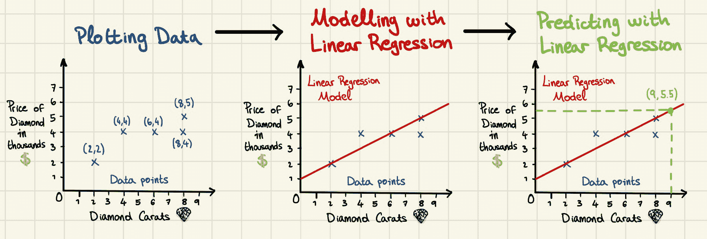

应用线性回归到数据并使用模型进行预测的步骤。图片由作者提供。

在这个例子中，最佳拟合线由以下方程表示：**价格 = 0.5 × (克拉) + 1**

使用这个方程，9 克拉钻石的估计价格为：**价格 = 0.5 × 9 + 1 = 5.5**（千美元）。

请记住，在现实生活中的情况下，像净度、切工和颜色这样的额外因素也可能影响价格。这些因素可以作为回归模型中的独立变量添加，以获得更准确的预测。

### 线性回归公式

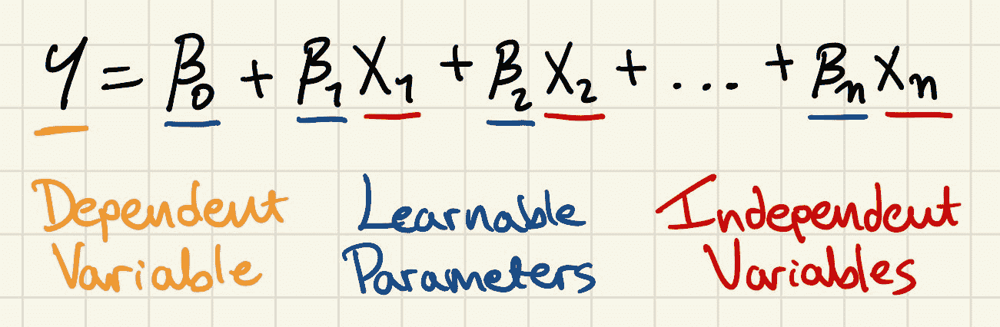

标记的线性回归公式。图片由作者提供

这个公式与你在钻石示例中看到的是一样的，只是稍微复杂一些。在我们的例子中，由于独立变量的数量是一个（n=1），我们使用的公式是：**Y = β0 + β1*X1** 其中 Y 是价格，β0 = 1，β1 = 0.5，而 X1 是克拉数。

在另一种情况下，如果我们有三个独立变量（n=3），我们将使用：**Y = β0 + β1*X1 + β2*X2 + β3*X3**

注意，尽管增加了独立变量，但公式仍然类似于一条直线。唯一的区别是我们增加了这条线所存在的空间维度。当我们之前绘制最佳拟合线时，它是一个二维图表，因为我们只有一个独立变量（克拉数）。如果我们有两个独立变量（例如，克拉数和净度），图表将是三维的。当有三个或更多独立变量时，这条“线”存在于一个更高维度的空间中（我们虽然难以直观地可视化，但仍然可以计算）。

重要的是要注意，Y 指的是实际观察到的值（如市场上的真实钻石价格）。然而，当你使用模型进行预测时，输出是 *Ŷ*（读作“y hat”）。这种区别提醒我们 *Ŷ* 只是一个估计——它是模型认为的值应该是多少，而不一定是真实值。

参数（β）是模型在训练过程中调整（或学习）的值，以捕捉独立变量 *X* 和因变量 *Y* 之间的关系。我们现在将了解这些值的计算过程，这与神经网络和大型语言模型用来“学习”的过程是相同的。

### 参数学习

我们需要一些东西来调整参数并实现准确的预测。

1.  训练数据——这些数据由输入和输出对组成。输入将被输入到模型中，在训练过程中，参数将被调整，试图输出目标（真实）值。我们之前已经看到了这一点，那些 5 颗钻石的价格是我们的训练数据。

1.  成本函数——也称为**损失函数**，是一个数学函数，用于衡量模型预测与目标值匹配的程度。

1.  训练算法——是一种用于调整模型参数以最小化由成本函数测量的错误的方法。

让我们回顾一下线性回归中可以使用的成本函数和训练算法。

## 成本函数：均方误差（MSE）

均方误差（MSE）是回归任务中广泛使用的成本函数，其目标是预测一个连续数值。它通过计算预测值与实际值之间平方差的平均值来衡量预测值与实际值之间的距离。目标是使这个差异尽可能小。当我们努力减少成本函数的值时，我们称这个值为“**损失**”。这是它的计算方式：

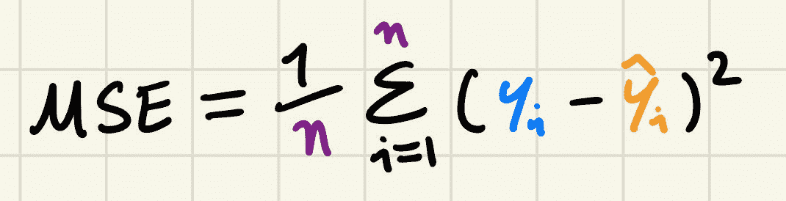

均方误差（MSE）公式。图片由作者提供。

1.  计算预测值*Ŷ*和目标值*Y*之间的差异。

1.  将这个差异平方——确保所有误差都是正的，并且对大误差进行更重的惩罚。

1.  对所有数据样本的平方差异求和。

1.  将总和除以样本数*n*，得到平均平方误差。

后面我们将看到一个更实际的例子，但现在考虑这个。我们的训练数据中有三个样本，我们想要计算均方误差（MSE）。

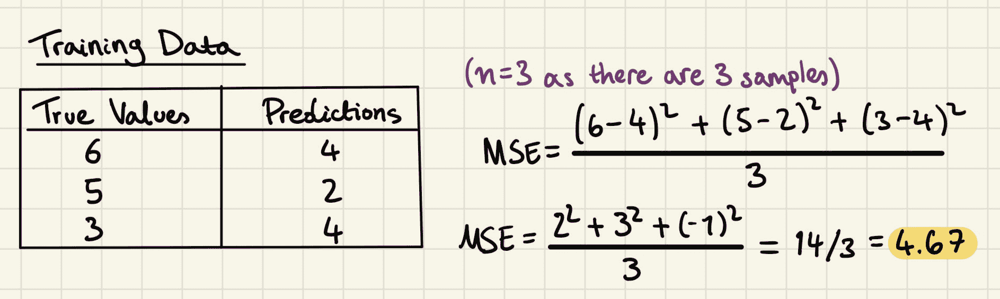

MSE 计算示例。图片由作者提供。

好的模型将具有低 MSE，因为目标和预测之间的差异很小。另一方面，较差的模型将具有较大的 MSE，因为差异会更大。

## 训练算法：梯度下降

梯度下降就像在黑暗中下山，目标是达到最低点——**全局最小值**——那里的成本（误差）最小。

**成本函数**告诉我们当前模型的预测是好是坏。它给我们一个“分数”（称为损失），衡量我们的预测与实际目标值之间的偏差。随机改变模型的参数（它调整以学习的东西）不会帮助我们持续改进。

相反，我们使用成本函数的**梯度**，它告诉我们最陡下降的斜率或方向。把梯度想象成指向下山的指南。通过跟随这个方向，我们可以更新参数以减少成本，这意味着我们的预测值更接近实际目标。

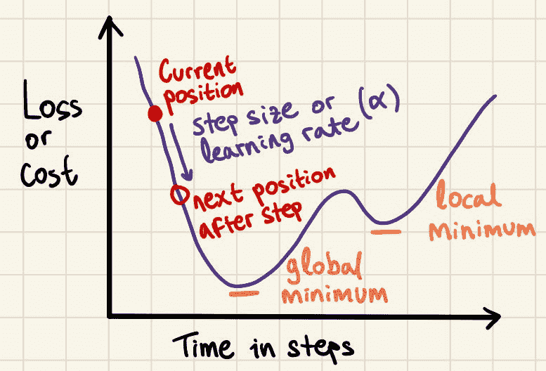

标注的图表显示了梯度下降算法的关键概念。图片由作者提供。

每个步长的大小（称为**学习率**）非常重要：

+   如果步长**太大**，我们可能会超过最低点，永远找不到它。

+   如果步长**太小**，我们会移动得很慢，浪费时间，甚至可能卡在一个小低谷（局部最小值）而不是找到整体最低点。

关键是要采取恰到好处的步长，这样我们才能高效且准确地达到全局最小值。

### 梯度下降公式

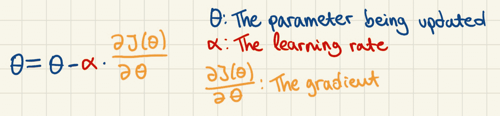

标记的梯度下降公式。图由作者提供。

在钻石的例子中，θ 可以是 _β_0 或 *β1*。梯度是代价函数相对于 θ 的偏导数，或者用更简单的话说，它是衡量代价函数在参数 θ 稍微调整时变化多少的一个度量。

大梯度表示参数对代价函数有显著影响，而小梯度则表示影响较小。梯度的符号表示代价函数变化的方向。负梯度意味着随着参数的增加，代价函数将减少，而正梯度则意味着它将增加。

那么，在梯度很大的情况下，参数会发生什么变化？嗯，学习率前面的负号将与梯度的负号相抵消，从而在参数上增加。由于梯度很大，我们将向其添加一个很大的数字。因此，参数会大幅调整，反映出它对降低代价函数的更大影响。

## 实际例子

让我们看看《空手道小子》用来洗三浦先生的车的海绵的价格。如果我们想根据它们的宽度和高度预测它们的价格，我们可以使用线性回归来建模。

我们可以从这三个训练数据样本开始。

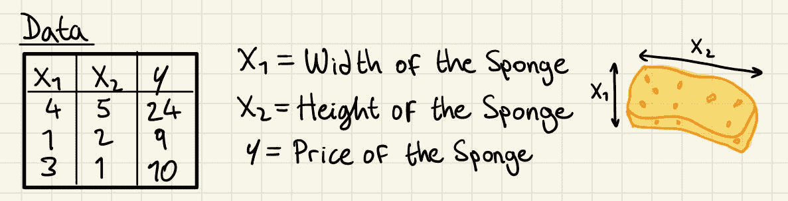

用于模拟海绵价格的线性回归示例的训练数据。图由作者提供。

现在，让我们以均方误差（MSE）作为我们的代价函数 *J*，并以线性回归作为我们的模型。

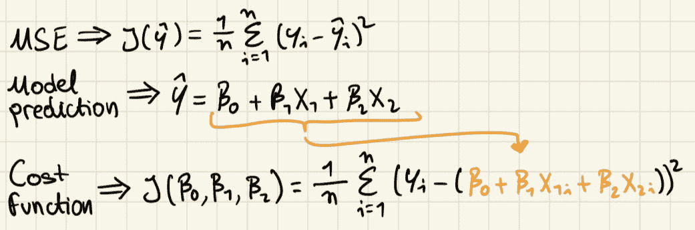

由均方误差和线性回归推导出的代价函数公式。图由作者提供。

注意我们在均方误差公式中用 *Ŷ* 替换了线性回归公式，因为我们将会使用线性回归进行预测。线性回归公式使用 X1 和 X2 分别表示宽度和高度，因为没有更多的自变量，因为我们的训练数据不包括更多。这就是我们在本例中做出的假设，即海绵的宽度和高度足以预测其价格。

现在，第一步是初始化参数，在这种情况下为 0。这是为了让我们有一些起始值作为参数，以便我们可以做出预测。这些可能不是最优的（通常它们会很糟糕），但它们为我们提供了一个起点。

然后，我们可以将自变量输入模型以获取我们的预测值，*Ŷ*，并检查这些预测值与我们的目标 *Y* 相距多远。

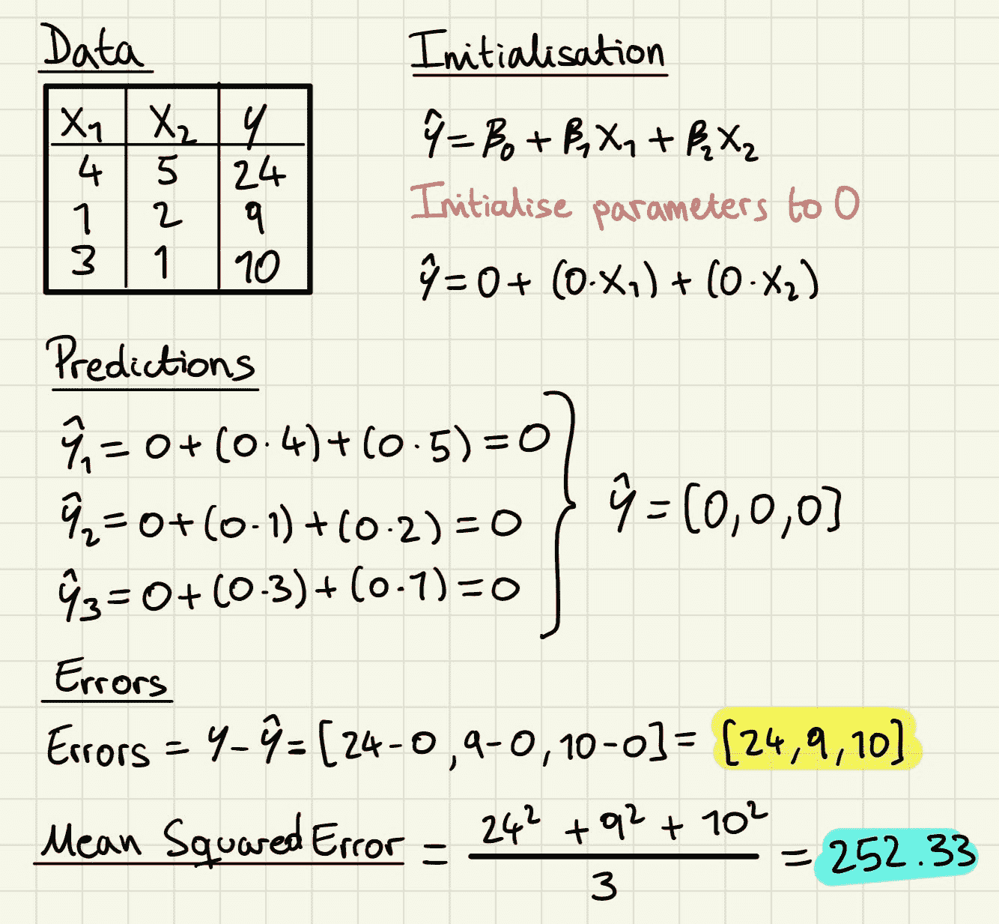

梯度下降算法的第 0 步和均方误差的计算。图片由作者提供。

现在，正如你可以想象的那样，参数并不是很有帮助。但我们现在准备使用梯度下降算法来更新参数，使其更加有用。首先，我们需要计算每个参数的偏导数，这需要一些微积分知识，但幸运的是，在整个过程中我们只需要做一次。回想一下，每个参数的偏导数将告诉我们当我们稍微改变该参数时损失如何变化。

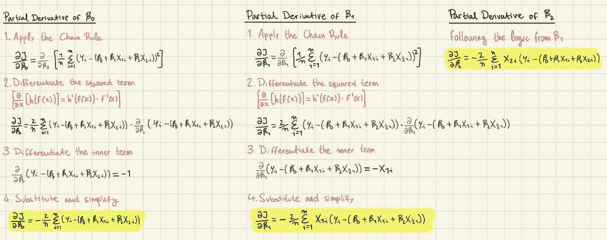

计算线性回归参数的偏导数。图片由作者提供。

通过偏导数，我们可以将我们的误差值代入来计算每个参数的梯度。

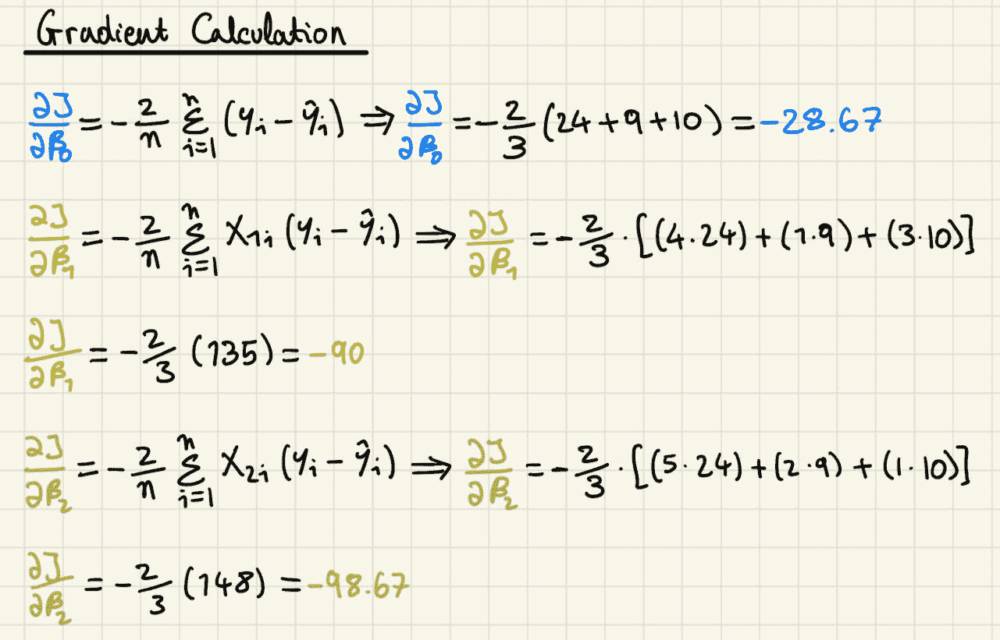

参数梯度的计算。图片由作者提供。

注意，没有必要计算 MSE，因为它在参数更新过程中并没有直接使用，只有它的导数被使用。这也立即很明显，所有梯度都是负的，这意味着所有梯度都可以增加以减少损失。下一步是使用学习率来更新参数，学习率是一个超参数，即在训练过程开始之前在机器学习模型中指定的配置设置。与在训练过程中学习的模型参数不同，超参数是手动设置的，并控制学习过程的各个方面。在这里，我们任意使用 0.01。

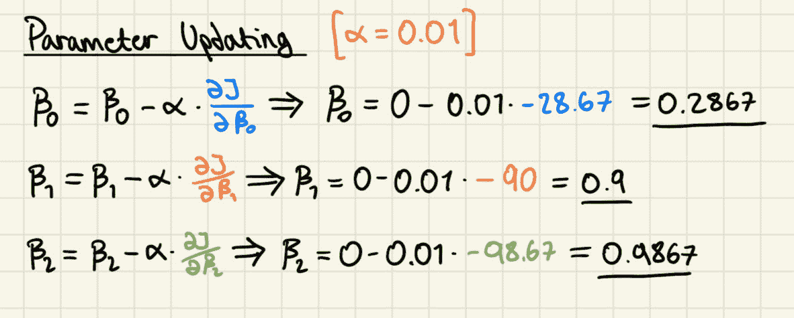

梯度下降第一次迭代的参数更新。图片由作者提供。

这已经是我们梯度下降过程中的第一次迭代的最后一步。我们可以使用这些新的参数值来做出新的预测并重新计算我们模型的 MSE。

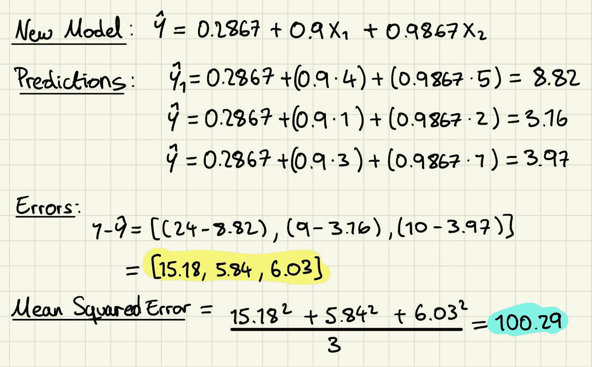

梯度下降第一次迭代的最后一步，以及参数更新后的 MSE 重新计算。图片由作者提供。

新参数正在接近真实的海绵价格，并且已经产生了更低的 MSE，但还有很多训练要做。如果我们迭代梯度下降算法 50 次，这次使用 Python 而不是手动操作——因为宫崎先生从未提到过编码——我们将达到以下值。

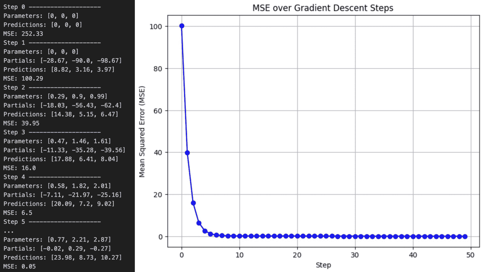

梯度下降算法的一些迭代结果，以及一个显示梯度下降步骤中均方误差的图表。图片由作者提供。

最终我们得到了一个相当不错的模型。我用来生成这些数字的真实值是[1, 2, 3]，经过仅仅 50 次迭代，模型的参数就令人印象深刻地接近了。将训练扩展到 200 步，这是一个另一个超参数，使用相同的学习率，使得线性回归模型几乎完美地收敛到真实参数，展示了梯度下降法的强大能力。

## 结论

构成复杂的人工智能武术的基本概念，如代价函数和梯度下降，仅通过研究线性回归的简单“磨刀不误砍柴工”工具就可以彻底理解。

人工智能是一个庞大而复杂的领域，建立在许多想法和方法之上。尽管还有更多值得探索，但掌握这些基础知识是一个重要的第一步。希望这篇文章能让你更接近这个目标，一次“磨刀不误砍柴工”。
