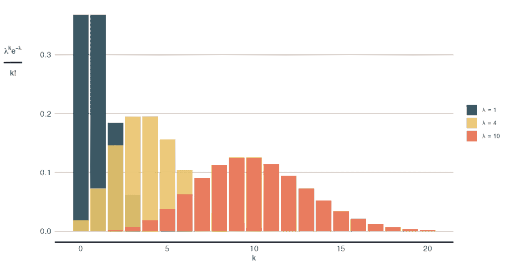
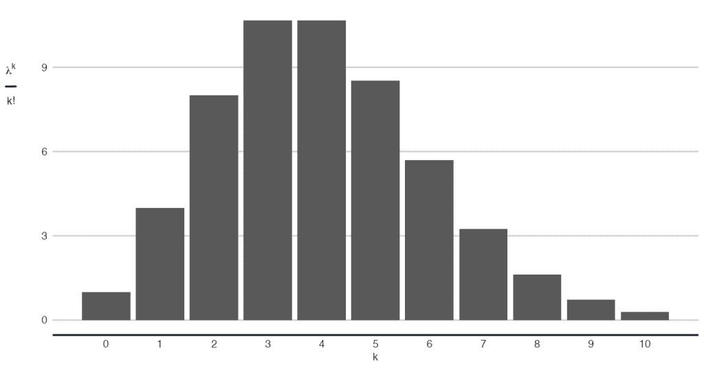
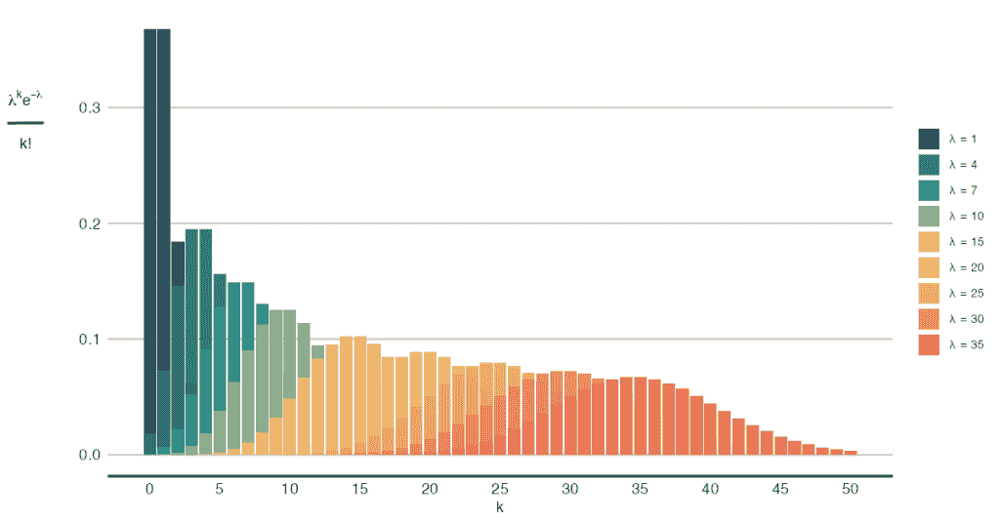
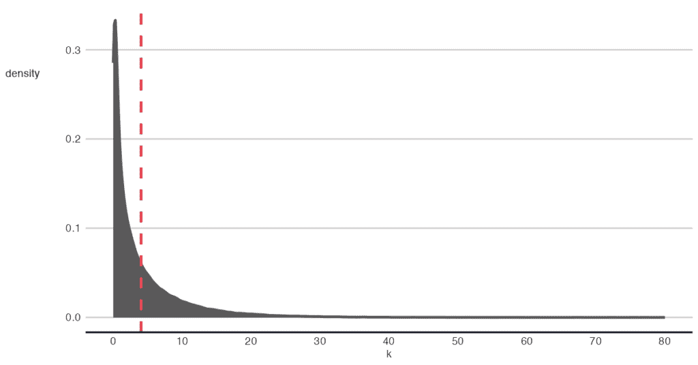
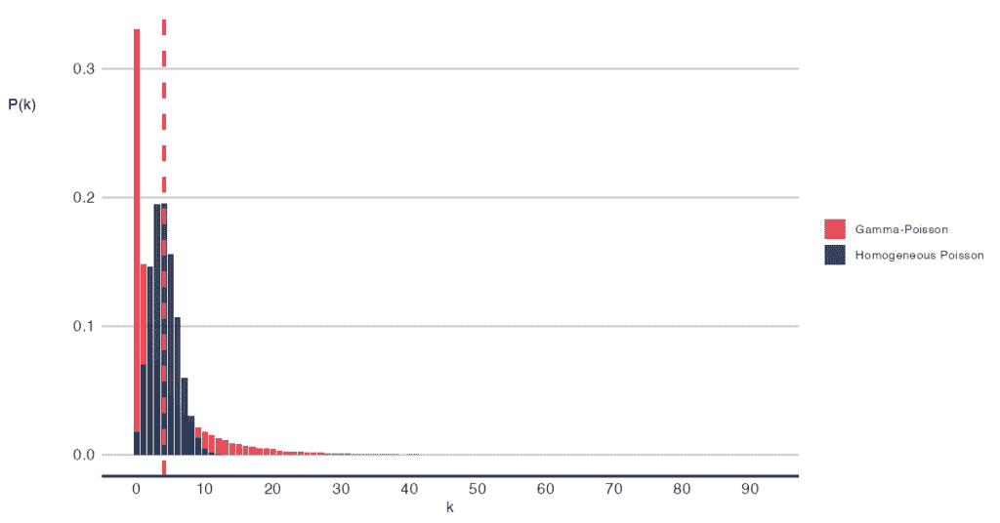

# 掌握泊松分布：直觉与基础

> 原文：[`towardsdatascience.com/mastering-the-poisson-distribution-intuition-and-foundations/`](https://towardsdatascience.com/mastering-the-poisson-distribution-intuition-and-foundations/)

你可能过度使用了正态分布一两次。我们都有——它是一匹真正的马。但有时，我们会遇到问题。例如，在预测或预测值时，根据特定的数据生成过程模拟数据，或者当我们试图可视化模型输出并向非技术利益相关者直观解释时。突然之间，事情没有太多意义：用户真的会在横幅上点击-8 次吗？或者甚至 4.3 次？这两个都是计数数据如何不表现出来的例子。

我发现，将数据生成过程更好地封装到我的模型中对于获得合理的模型输出至关重要。在适当的时候使用泊松分布不仅帮助我向利益相关者传达更有意义的见解，还使我能够产生更准确的误差估计、更好的推理和明智的决策。

在这篇文章中，我的目标是通过对示例应用进行讲解，并深入探讨基础——数学，帮助你深入理解泊松分布。我希望你不仅学会它是如何工作的，还学会为什么它会工作，以及何时应用这个分布。

*如果你知道某个资源特别有助于你掌握这个博客中的概念，请邀请你在评论中分享！*

## 概述

1.  **示例和用例：**让我们通过一些用例来加深我刚才提到的直觉，在这个过程中，泊松分布的相关性将变得清晰。

1.  **基础：**接下来，让我们将方程分解为其各个组成部分。通过研究每一部分，我们将揭示分布为何以这种方式工作。

1.  **假设：**有了某种形式性，我们将更容易理解推动分布的假设，同时为它何时有效和何时无效设定边界。

1.  **当现实生活偏离模型时：**最后，让我们探索泊松分布与负二项分布之间的特殊联系。理解这些关系可以加深我们的理解，并在泊松分布不适合工作时提供替代方案。

## 在线市场的例子

我选择深入研究泊松分布，因为它经常出现在我的日常工作中。在线市场依赖于两方面的二元用户选择：卖家决定列出商品和买家决定进行购买。这些微观行为在短期和长期都驱动着供需。一个市场就诞生了。

二元选择汇总为计数——许多此类决策的总和。将时间框架附加到这个计数过程，你将开始看到到处都是泊松分布。让我们接下来探讨一个具体的例子。

考虑一个平台上的卖家。在一个月内，卖家可能列出也可能不列出待售商品（一个二元选择）。我们只会知道她是否这样做，因为那时我们会有一个可测量的事件计数。没有任何东西阻止她在同一个月内列出另一件商品。如果她这样做，我们会计算这些事件。对于不活跃的卖家，总数可能为零，或者对于一个高度参与的卖家，可能是 120。

在几个月内，我们会观察到这个卖家列出的商品数量会有所不同——有时较少，有时较多——围绕着平均每月列表率。这本质上是一个泊松过程。当我们到达假设部分时，你会看到我们为了使这个例子工作而必须放弃的假设。

### 其他示例

其他可以用泊松分布建模的现象包括：

+   **体育分析**：两支球队之间比赛中进球的数量。

+   **排队**：客户到达帮助台或客户支持电话。

+   **保险**：在一定时期内提出的索赔数量。

这些每个例子都值得进一步检查，但在这篇帖子的剩余部分，我们将使用市场示例来说明分布的内部工作原理。

## 数学部分

*…或者基础。*

我发现打开分布的概率质量函数（PMF）有助于理解为什么事物会按照它们的方式运作。泊松分布的 PMF 如下所示：

其中λ是速率参数，而𝑘是随机变量的显现计数（𝑘 = 0, 1, 2, 3, …事件）。非常整洁且紧凑。

泊松分布的概率质量函数，对于几个不同的λ值。

### λ和 k 的上下文：市场示例

在我们之前的例子——一个在我们的平台上列出商品的卖家——的背景下，λ代表卖家的平均每月列表数。作为这个卖家的预期月度值，λ协调她一个月内会列出多少商品。请注意，λ是希腊字母，所以读作：λ是我们可以从数据中估计的参数。另一方面，𝑘不包含任何关于卖家独特行为的任何信息。它是我们为可能发生的事件数量设定的目标值，以了解其概率。

### λ作为平均值和方差的二重角色

当我说λ协调卖家每月的列表数量时，我是字面意义上的。也就是说，λ对于所有λ的值，既是分布的期望值也是方差，无差别。这意味着均值到方差的比例（离散指数）始终为 1。

为了将这一点置于正确的视角，正态分布需要两个参数——𝜇 和 𝜎²，分别是平均值和方差——来完全描述它。泊松分布只需一个参数就能达到同样的效果。

只需要估计一个参数可能对参数推断有益。具体来说，通过减少模型的方差并增加统计功效。另一方面，这个假设可能过于限制。像负二项分布这样的替代方案可以缓解这种限制。我们将在以后探讨这一点。

### 拆解概率质量函数

现在我们知道了最小的构建块，让我们退后一步：λᵏ、𝑒^⁻λ 和 𝑘! 是什么，更重要的是，这些组成部分在整个函数中的作用是什么？

+   **λᵏ** 是一个权重，表示在期望值为 λ 的情况下 𝑘 个事件发生的可能性。请注意，“可能性”在这里并不意味着概率，而仅仅是一个信号强度。

+   **𝑘!** 是一个组合校正项，因此我们可以认为事件发生的顺序是不相关的。事件是可以互换的。

+   **𝑒^⁻λ** 正则化 PMF 函数的积分，使其总和为 1。它被称为指数族分布的配分函数。

更详细地说，λᵏ 将观察到的值 𝑘 与随机变量的期望值 λ 相关联。直观上，更多的概率质量位于期望值周围。因此，如果观察到的值接近期望值，发生的概率大于远离期望值的观察值的概率。在我们能够用 λᵏ 的数值行为来交叉检查我们的直觉之前，我们需要考虑 𝑘! 是什么。

### 可互换事件

如果我们关心事件发生的顺序，那么每个独特的事件可以以 𝑘! 种方式排序。但因为我们不关心，并且我们认为每个事件可以互换，所以我们“除以” 𝑘! 来校正过度计数。

由于 λᵏ 是一个指数项，当 𝑘 增加时，输出值总是更大的，保持 λ 不变。这与我们的直觉相反，即当 λ = 𝑘 时存在最大概率，因为当 𝑘 = λ + 1 时，输出值更大。但现在我们知道了关于可互换事件假设——以及过度计数问题——我们知道我们必须考虑 𝑘!，如下所示：λᵏ 𝑒^⁻λ / 𝑘!，以看到我们期望的行为。

现在我们通过 λᵏ 来检查 λ 和 𝑘 之间关系的感觉，这里已经对 𝑘! 进行了校正。对于相同的 λ，比如说 λ = 4，我们应该看到当 𝑘 的值远离 4 时，λᵏ 𝑒^⁻λ / 𝑘! 的值应该比 𝑘 的值接近 4 时的值要小。例如：内联代码：4²/2 = 8 小于 4⁴/24 = 10.7。这与当 𝑘 接近期望值时其可能性更高的直觉一致。下面的图像更普遍地展示了这种关系，其中你可以看到当 𝑘 接近 λ 时，输出值更大。

没有归一化成分 e^-lambda 的概率质量函数。

## 假设

首先，让我们澄清一点：**泊松过程**和**泊松分布**之间的区别。**过程**是一个随机连续时间模型，描述在给定区间内发生的事件：一维，一条线；二维，一个区域，或更高维度。我们数据科学家最常处理的是一维情况，其中“线”是时间，而“点”是感兴趣的事件——我敢这么说。

这些是泊松过程的假设：

1.  **一个事件的发生不会影响第二个事件发生的概率。**想象一下我们的卖家明天继续列出另一个商品，无论他今天是否已经这样做，或者五天前的情况也是如此。这里的要点是事件之间没有记忆。

1.  **事件发生的平均速率与任何发生的事件无关。**换句话说，任何已经发生（或将要发生）的事件都不会改变λ，它在整个观察时间段内保持恒定。在我们的卖家例子中，这意味着今天列出商品不会增加或减少卖家明天再列出商品的动机或可能性。

1.  **两个事件不能在完全相同的时刻发生。**如果我们无限放大时间尺度上的粒度，就没有两个列出行为可以同时发生；总是按顺序发生。

从这些假设——无记忆、恒定速率、事件独立发生——可以得出以下结论：1）任何区间的发生事件数量都服从参数λₜ的泊松分布；2）不相交的区间是独立的——泊松过程的两个关键特性。

*关于分布的说明：*分布只是描述区间内各种计数数的概率。严格来说，只要数据非负，可以在右侧无界，具有均值λ，并且合理地模拟数据，就可以实用地使用分布。如果底层过程是泊松过程，那么使用分布将是方便的，并且实际上可以证明使用分布的合理性。

### 市场例子：影响

那么，我们能否为我们的市场例子证明使用泊松分布的合理性？让我们打开泊松过程的假设，进行测试。

**恒定的λ**

+   *可能失败的原因：*卖家有模式化的在线活动；节假日；促销；列出商品是季节性商品。

+   *后果：*λ不是恒定的，导致过度分散（均值与方差比大于 1，或时间模式）。

**独立性和无记忆性**

+   *可能失败的原因：*在成功列出商品后，再次列出的倾向更高，或者相反，一次列出会耗尽库存并干扰再次列出的倾向。

+   *后果：*两个事件不再相互独立，因为一个事件的发生会告知另一个事件的发生。

**同时发生的事件**

+   *可能失败的原因：*为了帮助卖家，引入了批量列出这一新功能。

+   *后果*：多个列表将同时上线，聚集在一起，并且它们将被同时计算。

### 平衡严谨和实用主义

作为在职的数据科学家，我们可能会感到在严谨和实用主义之间感到被困。以下三个步骤应该为你提供一个坚实的基础，以决定在泊松分布不足时，应该偏向哪一方：

1.  **明确你的目标**：是推理、模拟还是预测，以及它是否关乎高风险的输出？列出可能发生的最糟糕的事情，以及对企业造成的成本。

1.  **识别问题和解决方案**：为什么泊松分布不适用，你能做些什么？列出 2-3 个解决方案，包括什么都不做。

1.  **平衡收益和成本**：你的解决方案会改善事情，还是会变得更糟？以及代价是什么：可解释性、引入的新假设和使用的资源。这有助于你实现目标吗？

话虽如此，以下是一些我在需要时使用的反例。

## 当现实生活偏离你的模型时

到目前为止所描述的一切都适用于标准的或同质泊松过程。但现实可能需要不同的东西？

在下一节中，我们将介绍泊松分布的两个扩展，当常数λ假设不成立时。这些扩展不是相互排斥的，但它们也不相同：

1.  **时间变化的λ**：一个卖家在节假日前的列表速率上升，之后放缓

1.  **混合泊松分布**：多个卖家列出物品，每个卖家都有自己的λ，可以看作是各种泊松过程的混合

## 时间变化的λ

第一个扩展允许λ对于每个时间*t*有自己的值。此时，概率质量函数（PMF）变为

在区间𝑇内事件的数量𝐾(𝑇)遵循泊松分布，其速率不再等于固定的λ，而是等于：

更直观地说，对区间𝑡到𝑡 + 𝑖进行积分，我们得到一个单一的数字：该区间内事件期望值。积分将根据每个任意区间而变化，这就是λ随时间变化的原因。为了理解这种积分是如何工作的，对我来说，将其想象成这样是有帮助的：如果区间𝑡到𝑡₁的积分是 3，而𝑡₁到𝑡₂的积分是 5，那么区间𝑡到𝑡₂的积分就是 8 = 3 + 5。这是两个期望值的总和，现在整个区间的期望值。

**实际影响**

有些人可能想要将泊松分布的期望值建模为时间的函数。例如，为了模拟趋势的整体变化或季节性。在生成模型符号中：

时间可能是一个连续变量，或者是对其的任意函数。

## 过程变化的λ：混合泊松分布

但然后有一个问题。记得我提到λ具有均值和方差的双重角色吗？这一点在这里仍然适用。查看“放松”的 PMF*，唯一改变的是λ可以自由地随时间变化。但它仍然是唯一一个λ，它协调了 PMF*的期望值和分散。更精确地说，𝔼[𝑋] = Var(𝑋)仍然成立。

实际上，这个约束不成立有多种原因。模型误设、事件相互依赖和未考虑到的异质性可能是问题所在。我想重点讨论后者，因为它证明了负二项分布——我承诺要展开讨论的一个主题。

**异质性和过度分散**

想象一下，我们不是处理一个卖家，而是处理 10 个卖家，他们以不同的强度水平λᵢ列表，其中𝑖 = 1, 2, 3, …, 10 个卖家。那么，本质上，我们有 10 个泊松过程在进行。如果我们统一这些过程并估计总体λ，我们就简化了混合。这意味着我们得到了所有卖家平均的正确估计，但得到的总体λ是天真且不了解λᵢ的原始分布。它仍然假设方差和均值相等，这是分布公理。这将导致过度分散，进而导致误差估计不足。最终，它增加了假阳性率，并导致不良决策。*我们需要一种方法来接受卖家λᵢ之间的异质性。*

**负二项分布：扩展泊松分布**

在看待负二项分布的几种方法中，一种方法是将它视为复合泊松过程——10 个卖家，听起来熟悉吗？这意味着多个独立的泊松过程汇总为一个。数学上，首先我们从伽马分布中抽取λ：λ ~ Γ(r, θ)，然后我们抽取计数𝑋 | λ ~ 泊松(λ)。

在一个图像中，就好像我们会从许多泊松分布中进行抽样，对应于每个卖家。

许多泊松分布产生负二项分布。

负二项分布的更常见的别称是*伽马泊松混合分布*，现在我们知道了原因：主导的λ来自一个连续混合。这正是我们需要解释卖家之间异质性的原因。

让我们模拟这个场景，以获得更多的直观感受。

λ的伽马混合。

首先，我们从伽马分布中抽取λᵢ：λᵢ ~ Γ(r, θ)。直观上，伽马分布告诉我们卖家之间强度——列表率——的多样性。

在实际方面，一个人可以在模型的这一步设定他们对异构程度的假设：卖家**如何**不同？通过改变异构性的水平，可以观察对最终泊松分布的影响。进行此类检查（即后验预测检查）在贝叶斯建模中很常见，其中假设被明确设定。

*伽马泊松混合分布与同质泊松分布的比较。虚线反映λ，两个分布均为 4。*

在第二步中，我们将获得的λ插入泊松分布：𝑋 | λ ~ Poisson(λ)，并得到一个表示总和子过程的泊松分布。值得注意的是，这个统一过程比同质泊松分布预期的分散性更大，但它与λ的伽马混合一致。

## 异构λ和推理

将灵活性引入假设分布的实践后果是推理变得更加困难。需要估计更多的参数（即伽马参数）。参数作为数据的灵活解释者，倾向于过度拟合并解释变量中的方差。参数越多，解释可能看起来越好，但模型也更容易受到数据噪声的影响。更高的方差会降低识别均值差异的能力，如果存在的话，因为——好吧——它丢失在方差中了。

**对抗功效损失**

1.  确认你是否确实需要扩展标准的泊松分布。如果不是，简化到最简单、最合适的模型。对此进行快速检查过度分散可能就足够了。

1.  使用正则化、信息先验（想想：贝叶斯）来锁定伽马混合分布参数的估计。

在撰写这篇博客的研究过程中，我学到了很多关于所有这些背后的连接组织：二项分布在我们讨论的过程中扮演着基本角色。虽然我很想就此展开讨论，但我可能留到另一篇帖子中，也许吧。在此期间，请随时在下面的评论部分分享你的理解 👍。

## 结论

泊松分布是一种简单的分布，非常适合用于建模计数数据。然而，当假设不成立时，可以通过允许速率参数随时间或其他因素变化，或者通过假设构成计数数据的子过程来扩展分布。这种增加的灵活性可以解决局限性，但代价是：模型中的灵活性增加会导致方差增加，从而削弱模型的统计功效。

如果你的最终目标是推断，你可能需要三思而后行，并考虑探索数据更简单的模型。或者，切换到贝叶斯范式，利用其内置的解决方案来正则化估计：信息先验。

希望这已经给了你你想要的——对泊松分布的更好直觉。我很乐意在评论中听到你对这个的看法！

除非另有说明，所有图片均为作者所有。

原文发表于 2025 年 1 月 5 日于[*https://aalvarezperez.github.io*](https://aalvarezperez.github.io/posts/Mastering-the-Poisson-Distribution-Intuition-and-Foundations/)。
