# 需要的数学知识来旋转和倾斜 360 度图像

> 原文：[`towardsdatascience.com/math-to-tilt-pan-360-images/`](https://towardsdatascience.com/math-to-tilt-pan-360-images/)

## 0. <mdspan datatext="el1756149509948" class="mdspan-comment">简介</mdspan>

你肯定已经熟悉球形或 360 度图像了。它们用于 Google 街景或虚拟房屋游览，通过让你在任何方向上环顾四周，给你带来沉浸式的体验。

由于此类图像位于单位球体上，将它们作为平面图像存储在内存中可能很棘手。在实践中，我们通常使用以下两种格式之一将它们存储为平面数组：

+   **立方体贴图（6 个图像）**：每个图像对应于单位球体投影到其上的立方体的一个面。

+   **等经线图像**：类似于地球的平面地图。单位球体的南半球和北半球被拉伸以将图像展平到规则的网格上。与立方体贴图不同，图像存储为单个图像，这简化了图像处理过程中的边界处理。但这种方法引入了显著的失真。

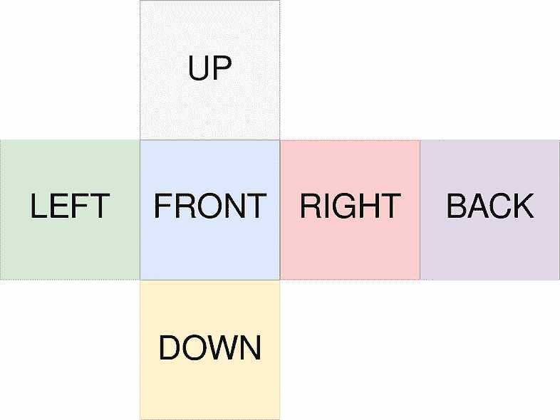

带有标注面的立方体贴图 6 个图像 — 图表由作者提供，来自[理解 360 度图像](https://medium.com/check-visit-computer-vision/understanding-360-images-8e0fcf0ee861)

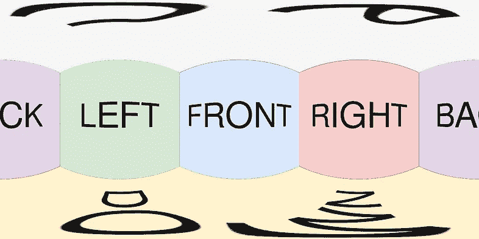

带有标注面的立方体贴图的等经线视图 — 图表由作者提供，来自[理解 360 度图像](https://medium.com/check-visit-computer-vision/understanding-360-images-8e0fcf0ee861)

在之前的一篇文章中（[理解 360 度图像](https://medium.com/check-visit-computer-vision/understanding-360-images-8e0fcf0ee861)），我解释了这两种格式之间转换背后的数学原理。在这篇文章中，我们将专注于等经线格式，并调查修改等经线图像相机姿态背后的数学。

这是一个更好地理解球坐标、旋转矩阵和图像重映射的绝佳机会！

下面的图像说明了我们想要应用的转换类型。

> “如果我的 360 度图像向下倾斜 20°，它会是什么样子？”

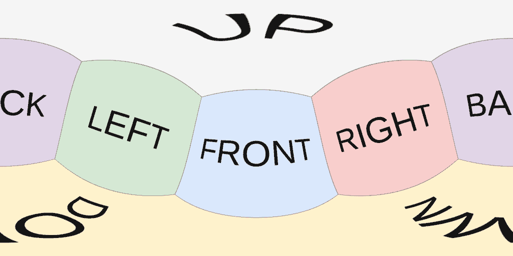

立方体贴图 360 度图像的 360 度图像，带有标注的面，向下倾斜 20° — 图像由作者提供

> “如果我的 360 度图像向右移动 45°，它会是什么样子？”

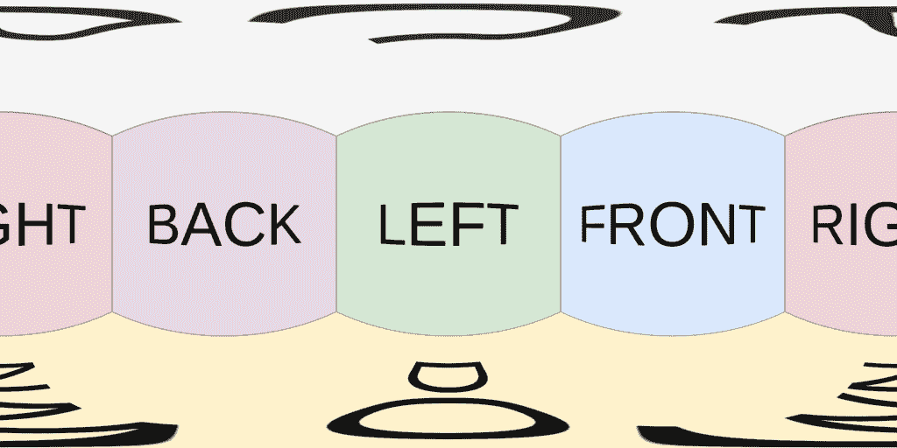

立方体贴图 360 度图像的 360 度图像，向右移动 45° — 图像由作者提供

> “如果我的 360 度图像向右移动 45°并向下倾斜 20°，它会是什么样子？”

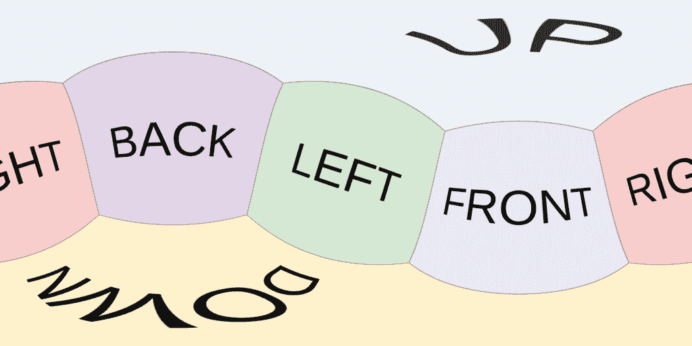

立方体贴图 360 度图像的 360 度图像，向右移动 45°并向下倾斜 20° — 图像由作者提供

注意：最广泛使用的图像坐标系系统是将图像中的垂直 Y 轴指向下方，水平 X 轴指向右侧。因此，我发现一个正的横向Δθ移动将图像向右移动，而一个负的Δθ将图像向左移动，这更直观。然而，这反直觉地意味着将图像向右移动对应于在场景中向左看！同样，一个正的纵向Δφ倾斜将图像向上移动。约定的选择是随意的，实际上并不重要。

* * *

由 Grillot Edouard 在[Unsplash](https://unsplash.com/photos/a-spiral-staircase-in-a-building-with-people-walking-down-it-uX4ikaLXYtE)拍摄的照片

## 1. 球形相机模型

### 球坐标

在地球的平面图上，水平线对应纬度，而垂直线对应经度。

当从笛卡尔坐标转换为球坐标时，场景中的点 M 完全由其半径 r 和两个角度θ和φ描述。这些角度允许我们将球面展开成等角图像，其中θ作为经度，φ作为纬度。

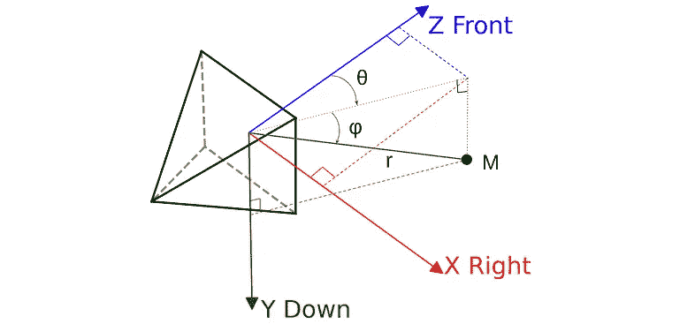

球坐标，Theta 绕 Y 轴旋转，Phi 绕 X 轴旋转—— 图表由作者绘制，来自[理解 360 度图像](https://medium.com/check-visit-computer-vision/understanding-360-images-8e0fcf0ee861)

> 我**随意**选择了使用***Right_Down_Front*** XYZ 相机约定（参见[我之前的文章](https://medium.com/check-visit-computer-vision/converting-camera-poses-from-opencv-to-opengl-can-be-easy-27ff6c413bdb)关于相机姿态），并且在我们面前将**θ=φ=0**。您可以使用其他约定。无论如何，最终您都会得到相同的图像。我只是觉得这种方法更方便。

下面的图像说明了我们使用的约定，其中θ在等角图像上水平变化，从左边的-π，中心为 0，到右边的+π。请注意，图像的左右边缘平滑地延伸。至于φ，北极在-π/2，南极在π/2。

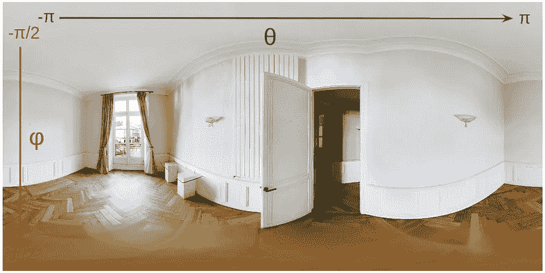

θ（经度）和φ（纬度）—— 图表由作者绘制，来自[理解 360 度图像](https://medium.com/check-visit-computer-vision/understanding-360-images-8e0fcf0ee861)

将映射到像素坐标只是一个仿射变换。

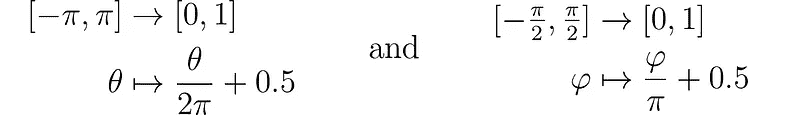

### 旋转矩阵

当处理 3D 旋转时，如果不使用矩阵形式，很快就会变得混乱。旋转矩阵提供了一种方便的方式来表示旋转，作为简单的矩阵-向量乘法。

在我们的***Right_Down_Front*** XYZ 相机约定（随意选择）中，围绕 X 轴的φ角度旋转由下面的矩阵描述。

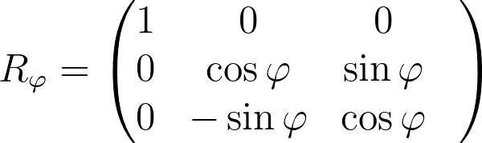

如您所见，这个矩阵没有改变 X 轴，因为它是其旋转轴。

沿对角线有余弦是有意义的，因为φ=0 必须产生单位矩阵。

至于正弦前的符号，我发现参考上面的球坐标图并思考一个很小的正φ会发生什么是有帮助的。相机正前方的点是(0,0,1)，即 Z 轴的前端，因此将被旋转到 Rφ的最后一列：(0, sinφ, cosφ)。这给我们一个接近 Z 的向量，但也沿着 Y 轴有一个很小的正分量，这正是我们期望的！

同样，我们有一个描述围绕 Y 轴旋转角度θ的矩阵。

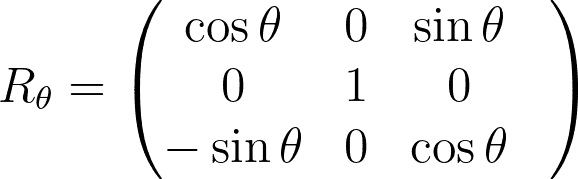

### 笛卡尔坐标和球坐标之间的转换

具有球坐标(φ,θ)的点 M 可以通过从相机前的(0,0,1)点开始，绕 X 轴倾斜φ，最后绕 Y 轴平移θ来转换为 3D 笛卡尔坐标 p。

以 Y 轴为 Theta，X 轴为 Phi 的球坐标——作者提供的图，来自[理解 360 度图像](https://medium.com/check-visit-computer-vision/understanding-360-images-8e0fcf0ee861)

下面的方程通过依次应用旋转矩阵在(0,0,1)上推导出笛卡尔坐标。半径 r 已被省略，因为我们只对单位球感兴趣。

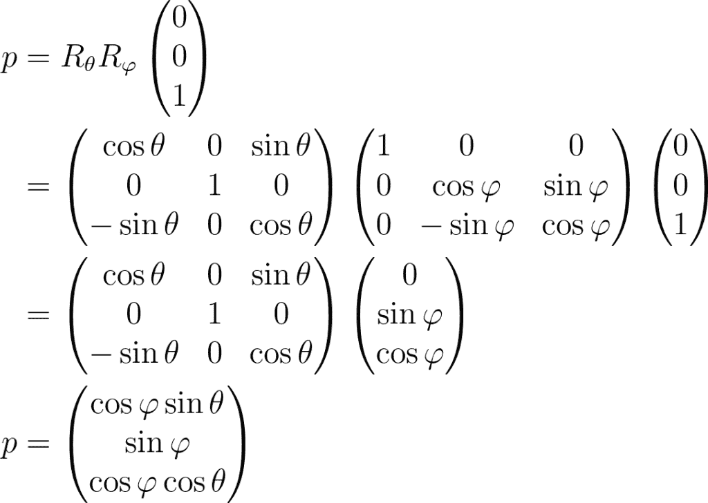

要恢复球坐标(φ,θ)，我们只需对 p 的分量应用反三角函数。请注意，由于φ位于[-π/2,π/2]，我们知道因子 cosφ保证保持正值，这允许我们安全地应用 arctan2。

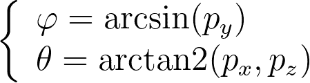

***

图片由 Jakob Owens 在[Unsplash](https://unsplash.com/photos/trowed-black-canon-dslr-camera-H6a1mbbXFis)拍摄

## 2. 倾斜/平移 360 度图像

### 图像重映射

我们的目标是将一个等经线图像转换成另一个等经线图像，模拟一个(Δφ, Δθ)角度偏移。在[理解 360 度图像](https://medium.com/check-visit-computer-vision/understanding-360-images-8e0fcf0ee861)中，我解释了如何将等经线图像和立方体贴图之间的转换。从根本上讲，这是一个采样任务，其中我们应用一个转换到现有的像素以生成新的像素。

由于转换可以产生浮点坐标，我们必须使用插值而不是仅仅移动整数像素。

虽然听起来有些反直觉，但在重新映射图像时，我们实际上需要反向变换，而不是变换本身。变换的雅可比行列式的行列式定义了局部密度的变化，这意味着输入和输出像素之间不一定总是一一对应。如果我们将变换应用于每个输入像素以填充新图像，由于密度变化，我们可能会在变换后的图像中产生巨大的空洞。

因此，我们需要定义反向变换，以便我们可以迭代每个输出像素坐标，将它们映射回输入图像，并从相邻像素插值其颜色。

### 转换矩阵

我们有两个三维坐标系：

+   **帧 0**：输入 360 度图像

+   **帧 1**：通过（Δφ, Δθ）变换的输出 360 度图像

每个帧都可以定义其局部的球面角度。

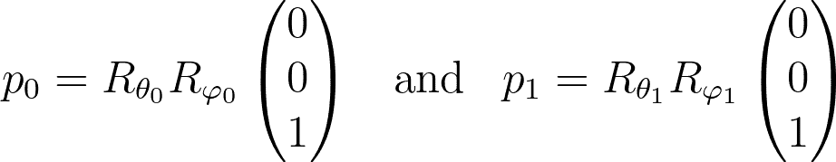

我们现在正在寻找两个帧之间的 3×3 转换矩阵。

转换是由以下事实定义的：我们希望输入图像 0 的中心映射到输出图像 1 中的点（Δφ, Δθ）。

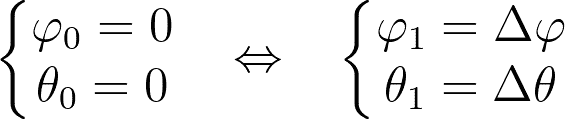

结果表明，这正是我们在球坐标系统中已经做的事情：将点（0,0,1）映射到给定的球面角度。因此，我们最终得到以下变换。

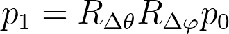

反向变换如下：

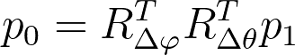

> 警告：当旋转轴不同时，旋转矩阵通常不交换。顺序很重要！

这直接给出了变换后相机的姿态。实际上，你可以用 1 号帧的任何基轴（1,0,0）、（0,1,0）和（0,0,1）来替换 p1，并观察它在 0 号帧中的位置。

因此，相机首先通过-Δθ进行平移，然后通过-Δφ倾斜。这正是你直观上会用相机做的事情：面向目标定位，然后调整倾斜角度。如果颠倒顺序，会导致相机方向倾斜或滚动。

### 反向变换

让我们展开矩阵形式，以得到反向变换的干净闭式表达式，从而从角度 1 得到角度 0。

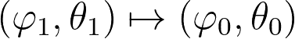

首先，我们将 p1 用其定义替换，以使φ1 和θ1 出现。

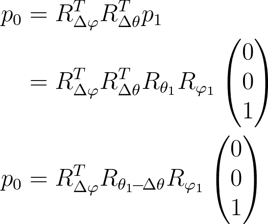

结果表明，围绕 Y 轴的两个旋转矩阵最终并排在一起，可以合并成一个角度为θ1-Δθ的单个旋转矩阵。

方程的右侧对应于坐标为（φ1, θ1-Δθ）的球面点。我们用其显式形式替换它。

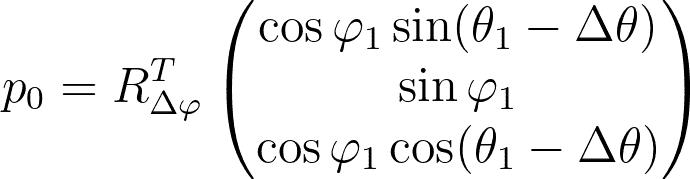

然后我们用其显式形式替换剩余的旋转矩阵并执行乘法。

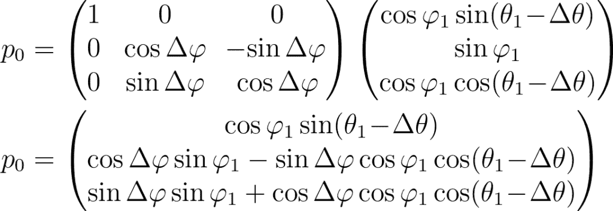

我们最终使用反正切函数来检索（φ0,θ0）。

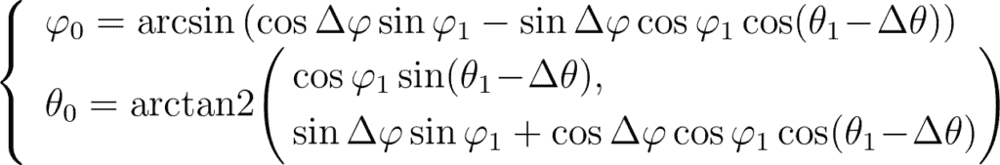

太好了！我们现在知道在输入图像中哪里进行插值。

### 代码

以下代码加载一个球形图像，选择任意的旋转角度(Δφ,Δθ)，计算逆变换映射，并最终使用 cv2.remap 应用它们以获得输出变换图像。

> 注意事项。以下代码<mdspan datatext="el1756149327443" class="mdspan-comment">用于教学目的。仍有性能优化的空间！

### 仅相机平移

如果Δφ=0 且变换是纯平移，会怎样？

当Δφ=0 时，旋转矩阵变为单位矩阵，p0 的表达式简化为球坐标中的规范形式(φ1, θ1-Δθ)。

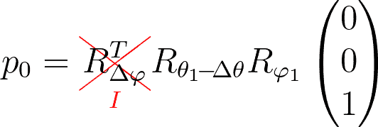

变换很简单，只是在θ角度上进行简单的减法。我们基本上只是在水平方向上使用浮点Δθ位移简单地滚动图像。

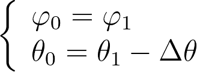

### 仅相机倾斜

如果Δθ=0 且变换是纯倾斜，会怎样？

当Δθ=0 时，旋转矩阵变为单位矩阵。但不幸的是，它并没有改变任何东西，我们只是在方程中将θ1-Δθ替换为θ1，就是这样。

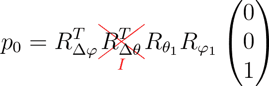

***

图片由 Kaitlin Duffey 在[Unsplash](https://unsplash.com/photos/crystal-ball-photography-of-building-during-daytime-l1MOcqruH-o)拍摄

## 3. 图像边界的行为

### 简介

看看输入 360 图像边界上的点如何受到变换的影响可能会很有趣。

例如，南极对应于φ0=π/2，这显著简化了方程，因为 cos(φ0)=0 和 sin(φ0)=1。我们还知道θ0 的值无关紧要，因为每个极点都简化为一个单点。

不幸的是，将φ0=π/2 代入上面推导出的最终逆变换公式，给我们一个显然非平凡的方程来求解(φ1,θ1)。

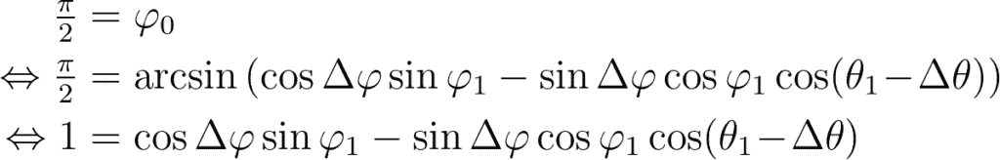

经典错误！与其使用逆变换公式，不如使用正向变换简单。让我们推导它。

### 直接变换

与逆变换不同，我们无法合并旋转矩阵，因为平移和倾斜旋转严格交替。

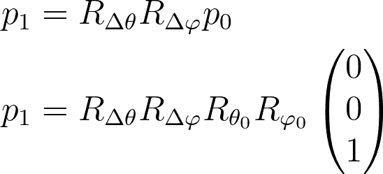

让我们使用 p0 的显式形式和旋转矩阵Δθ和Δφ。由于图像边界上的点(φ0,θ0)由于它们方便的 cos(φ0)和 sin(φ0)值而极大地简化了方程，我选择仅计算 RΔφ和 RΔθ的乘积，以保持对平凡 p0 值的替换简单。

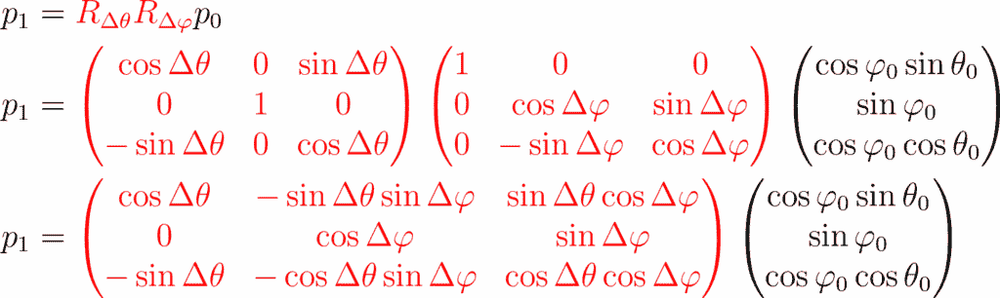

### 北/南极

南极由φ0=π/2 定义。我们有 cos(φ0)=0 和 sin(φ0)=1，这简化了乘积，只需保留旋转矩阵的第二列。

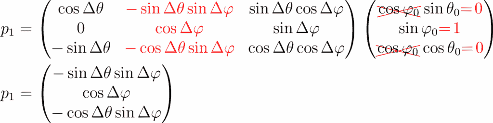

如预期的那样，θ0 不出现在表达式中。尽管极点在球形图像的顶部/底部无限拉伸，但在三维空间中它们仍然是单点。

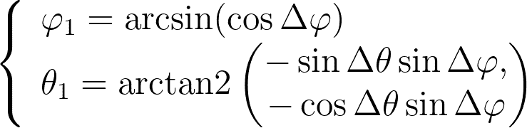

考虑到 Δφ 在 [-π,π] 范围内，我们可以用 π/2-|Δφ| 替换 φ1。

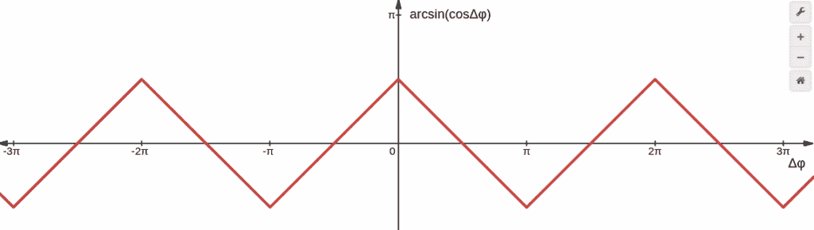

arcsin(cosΔφ) 的图像 — 由作者在 [desmos](https://www.desmos.com) 上生成

至于 θ1，它将取决于 sinΔφ 的符号。注意，在 [-π,π] 范围内，sinΔφ 和 Δφ 有相同的符号。最后，我们得到：

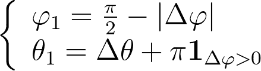

当 Δφ<0 时，图像向下倾斜，相机开始向上看。因此，南极出现在相机前的 θ1=Δθ 位置。然而，当 Δφ>0 时，相机开始向下看，南极移动到后面，这解释了 θ1=Δθ+π。

北极的数学计算与之前非常相似，我们得到：

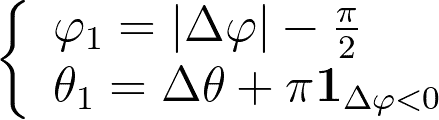

在现实生活中的 360 度图像中，南极很容易辨认，因为它对应于三脚架。为了使这一点更清晰，我在下面的图中在输入 360 度图像的底部添加了一条绿色带以标记南极，在顶部添加了一条洋红色带以突出北极。左列对应负 Δφ 角度，而右列对应正 Δφ 角度。

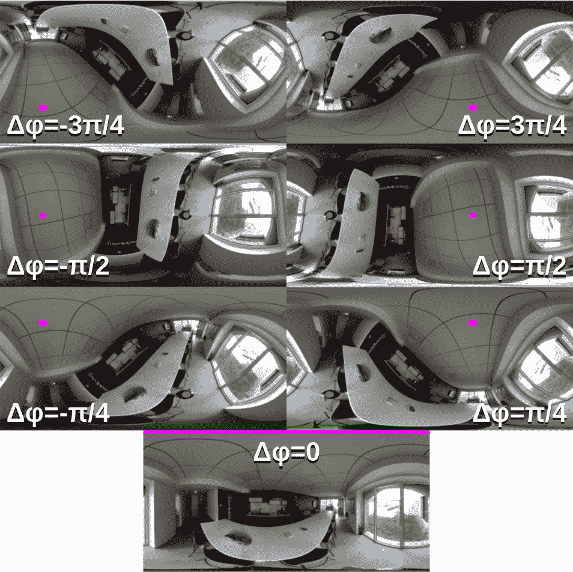

南极（绿色）和北极（洋红色）相对于 Δφ 的演变，Δθ 固定在 π/3 — 图表由作者绘制

### 左/右边缘

360 度图像的左右边缘重合，对应于 θ0=±π，这意味着 cosθ0=-1 且 sinθ0=0。

识别余弦差恒等式有助于简化方程。

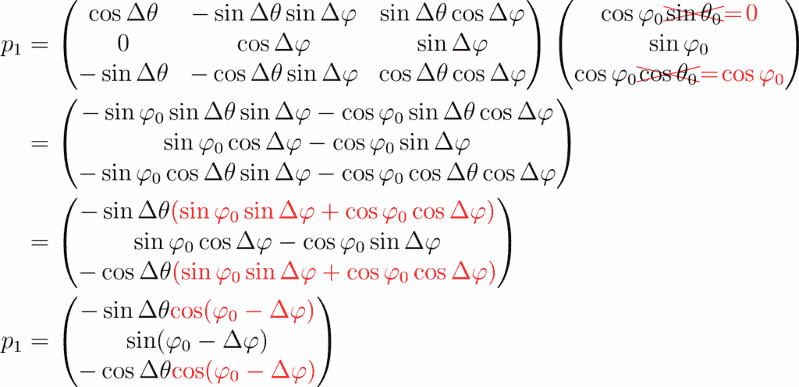

反三角函数给我们：

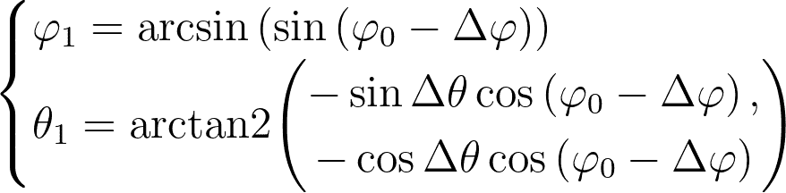

只要你保持在 [-π/2,π/2] 的范围内，arcsin(sinx) 就是恒等函数。但超出这个范围，函数就变成了周期性的三角波。

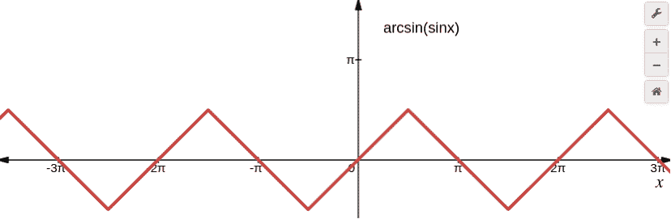

arcsin(sinx) 的图像 — 由作者在 [desmos](https://www.desmos.com) 上生成

至于 θ1，它将是 Δθ 或 Δθ+π，这取决于 cos(φ0-Δφ) 的符号。

实际上这非常直观：前后边缘仅仅是南北极之间的连接。由于极点沿着 Δθ 和 Δθ+π 平移，前后边缘简单地沿着这两条垂直轨道跟随。

在下面的图像中，我用青色突出了前边缘，用红色突出了后边缘。和之前一样，左列对应负 Δφ 角度，而右列对应正 Δφ 角度。

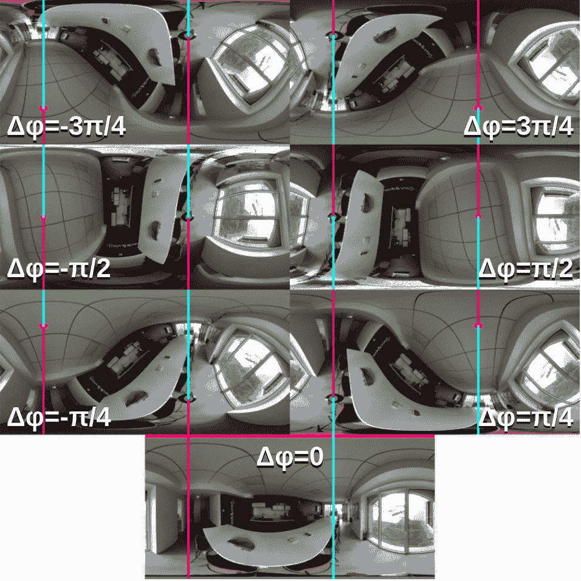

后边缘（红色）、前边缘（青色）、南极（绿色）和北极（洋红色）相对于 Δφ 的演变，Δθ 固定在 π/3 — 图表由作者绘制

* * *

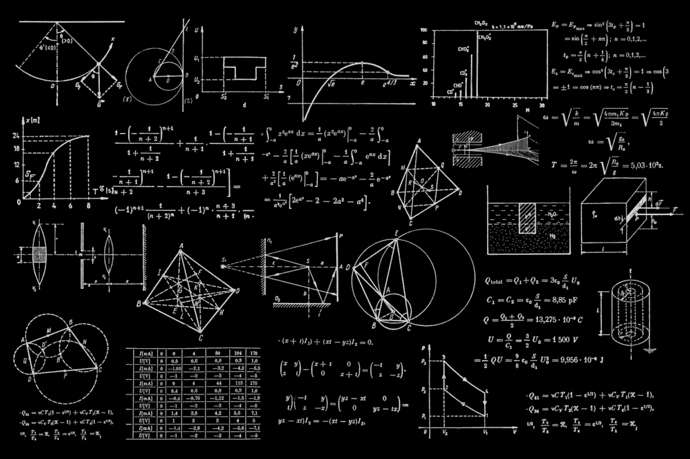

照片由 Dan Cristian Pădureț 在 [Unsplash](https://unsplash.com/photos/a-blackboard-with-a-bunch-of-diagrams-on-it-h3kuhYUCE9A) 提供

## 结论

我希望你们像我一样，彻底调查了解旋转或倾斜球形图像的实际意义时，也能感到同样的乐趣！

有时数学可能会变得有些冗长，但矩阵形式有助于保持事物的整洁，最终最终的公式并不长。

最后，用仅仅十几行代码将变换应用于图像，真的非常令人满意。

一旦你真正理解了图像重映射的工作原理，你就可以轻松地将其应用于许多应用：在立方体贴图和球形图像之间进行转换，消除图像畸变，拼接全景图……
