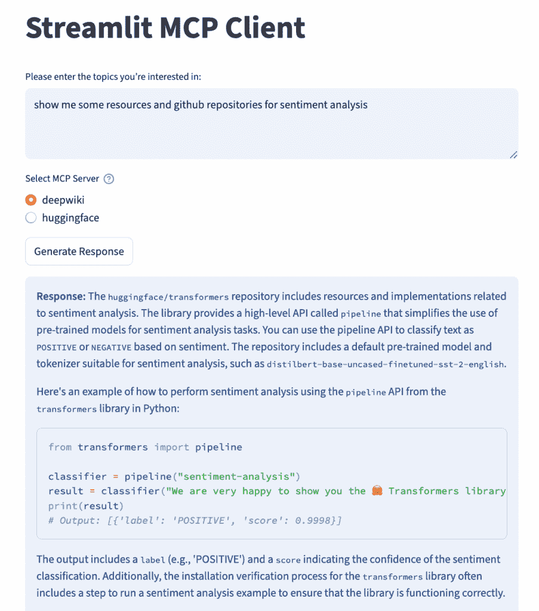
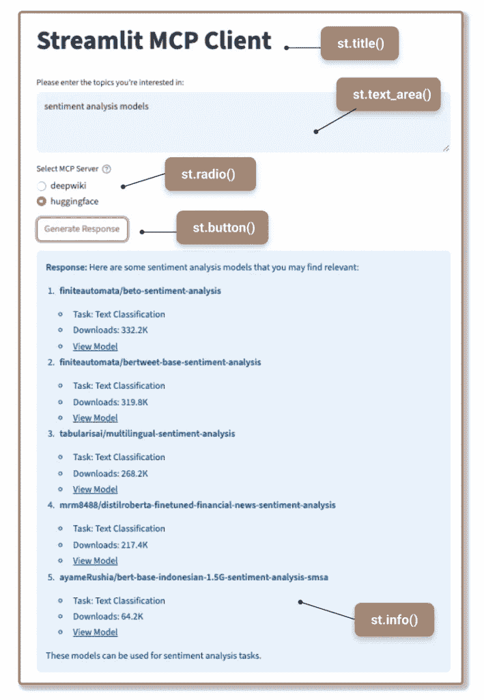
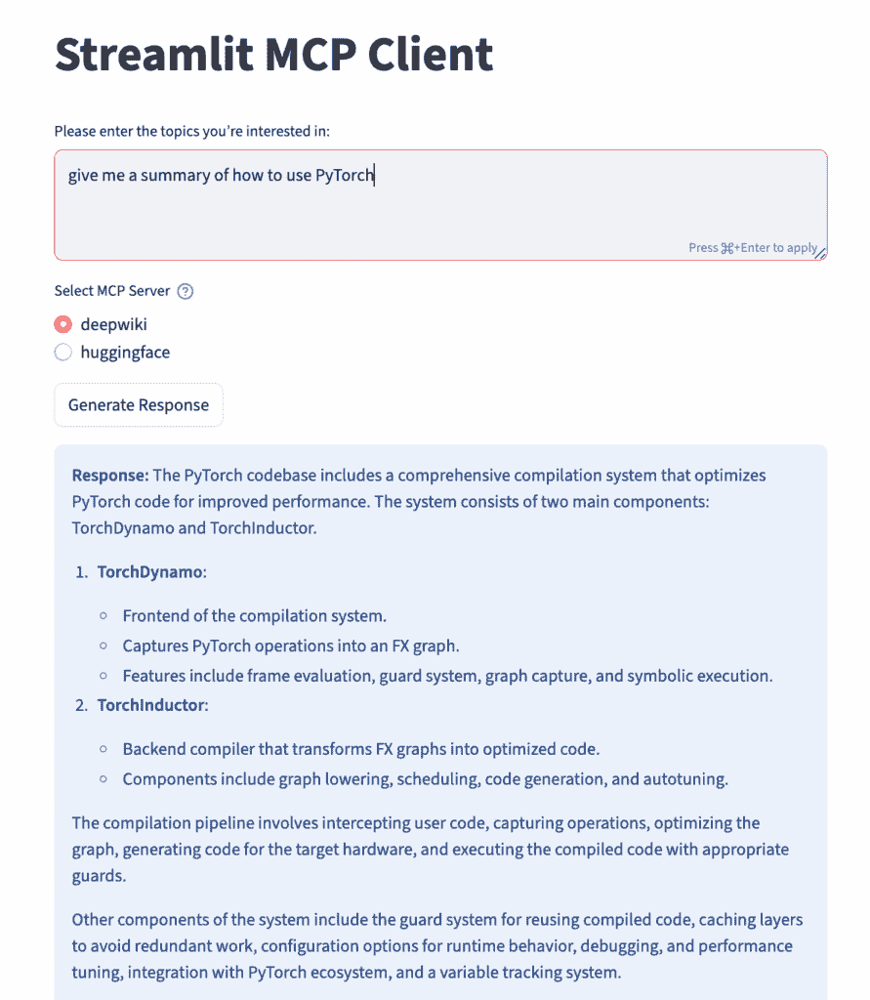

# 使用 Streamlit 构建 MCP 客户端：创建你的 AI 驱动 Web 应用程序

> 原文：[`towardsdatascience.com/mcp-client-development-with-streamlit-build-your-ai-powered-web-app/`](https://towardsdatascience.com/mcp-client-development-with-streamlit-build-your-ai-powered-web-app/)

在我们之前的文章“[模型上下文协议（MCP）教程：6 步构建你的第一个 MCP 服务器](https://towardsdatascience.com/model-context-protocol-mcp-tutorial-build-your-first-mcp-server-in-6-steps/)”中，我们介绍了 MCP 架构并详细探讨了 MCP 服务器。在本教程中，我们将继续探索 MCP，通过使用 Streamlit 构建一个交互式的 MCP 客户端界面。MCP 服务器和 MCP 客户端之间的主要区别在于，MCP 服务器通过连接到各种工具和资源来提供功能，而 MCP 客户端通过界面利用这些功能。Streamlit 是一个用于数据驱动交互式 Web 应用程序开发的轻量级 Python 库，它加速了开发周期，并抽象了前端框架，使其成为快速原型设计和 AI 工具的简化部署的理想选择。因此，我们将使用 Streamlit 通过最小设置构建我们的 MCP 客户端用户界面，同时专注于连接到远程 MCP 服务器以探索各种 AI 功能。

## 项目概述

创建一个交互式 Web 应用程序原型，用户可以输入他们感兴趣的主题，并在提供相关资源的两个 MCP 服务器——DeepWiki 和 HuggingFace 之间进行选择。DeepWiki 专注于总结代码库和 GitHub 仓库，而 HuggingFace MCP 服务器为用户感兴趣的主题提供开源数据集和模型的推荐。下面的图片显示了 Web 应用程序针对“情感分析”主题的输出。



**使用此链接自行尝试应用程序 > “🤖** **[Streamlit MCP 客户端](https://mcp-client-app.streamlit.app/?embed_options=show_toolbar)”。**

为了开发 Streamlit MCP 客户端，我们将将其分解为以下步骤：

+   设置开发环境

+   初始化 Streamlit 应用程序布局

+   获取用户输入

+   连接到远程 MCP 服务器

+   生成模型响应

+   运行 Streamlit 应用程序

如果你对构建自己的 MCP 服务器并连接你的 MCP 客户端感兴趣，请查看我们的视频。

* * *

## 设置开发环境

首先，让我们使用简单的结构设置我们的项目目录。

```py
mcp_streamlit_client/
├── .env                  # Environment variables (API keys)
├── README.md             # Project documentation
├── requirements.txt      # Required libraries and dependencies
└── app.py                # Main Streamlit application
```

然后安装必要的库——我们需要`streamlit`来构建 Web 界面，以及`openai`来与支持 MCP 的 OpenAI API 交互。

```py
pip install streamlit openai
```

或者，你可以创建一个`requirements.txt`文件，通过运行以下命令来指定可重复安装的库版本：

```py
pip install -r requirements.txt
```

其次，使用环境变量保护你的 API 密钥。当与 OpenAI 等 LLM 提供商一起工作时，你需要设置一个 API 密钥。为了保持此密钥的机密性，最佳实践是使用环境变量来加载 API 密钥，避免直接将密钥硬编码到你的脚本中，特别是如果你计划分享你的代码或部署你的应用程序。为此，请使用以下格式在`.env`文件中添加你的 API 密钥。我们还需要 Hugging Face API 令牌来访问其远程 MCP 服务器。

```py
OPENAI_API_KEY="your_openai_api_key_here" 
HF_API_KEY="your_huggingface_api_key_here" 
```

现在，在`app.py`脚本中，你可以使用`dotenv`库中的`load_dotenv()`函数将这些变量加载到你的应用程序环境中。此函数从`.env`文件中读取键值对，并通过`os.getenv()`使它们可访问。

```py
from dotenv import load_dotenv
import os

load_dotenv() 

# access HuggingFace API key using os.getenv()
HF_API_KEY = os.getenv('HF_API_KEY')
```

## 连接 MCP 服务器和客户端

在深入 MCP 客户端开发之前，让我们了解建立 MCP 服务器-客户端连接的基本知识。随着 MCP 的日益流行，越来越多的 LLM 提供商现在支持 MCP 客户端实现。例如，OpenAI 提供了一个简单的初始化方法，如下面的代码所示。

```py
from openai import OpenAI

client = OpenAI()
```

<details class="wp-block-details is-layout-flow wp-block-details-is-layout-flow" open=""><summary>进一步阅读：</summary>

*文章“[面向客户端开发者](https://modelcontextprotocol.io/quickstart/client)”提供了设置 Anthropic MCP 客户端的示例，这稍微复杂一些，但更健壮，因为它能够更好地管理会话和资源。*</details>

要将客户端连接到 MCP 服务器，你需要实现一个连接方法，该方法接受服务器脚本路径（用于本地 MCP 服务器）或 URL（用于远程 MCP 服务器）作为输入。本地 MCP 服务器是在你的本地机器上运行的程序，而远程 MCP 服务器是部署在线上并通过 URL 访问的。例如，以下示例中，我们通过`“https://mcp.deepwiki.com/mcp”`连接到远程 MCP 服务器“DeepWiki”。

```py
response = client.responses.create(
    model="gpt-4.1",
    tools=[
        {
            "type": "mcp",
            "server_label": "deepwiki",
            "server_url": "https://mcp.deepwiki.com/mcp",
            "require_approval": "never",
        },
    ]
)
```

<details class="wp-block-details is-layout-flow wp-block-details-is-layout-flow" open=""><summary>进一步阅读：</summary>

*你还可以探索其他 MCP 服务器选项，以满足你的特定需求。文章“[面向客户端开发者](https://modelcontextprotocol.io/quickstart/client)”也提供了连接本地 MCP 服务器的示例。*</details>

## 构建 Streamlit MCP 客户端



现在我们已经了解了在 MCP 客户端和服务器之间建立连接的基本原理，我们将把这个功能封装在一个网络界面中，以增强用户体验。这个 Web 应用程序设计时考虑了模块化，由使用 Streamlit 方法实现的几个元素组成，例如`st.radio()`、`st.button()`、`st.info()`、`st.title()`和`st.text_area()`。

如果你更喜欢视频教程，请查看我们的 YouTube 视频 🎬

### 1. 初始化你的 Streamlit 页面

我们将从 `initialize_page()` 函数开始，该函数设置页面图标和标题，并使用 `layout="centered"` 确保整个 Web 应用布局居中对齐。此函数返回一个位于页面标题下的列对象，我们将在此处放置后续步骤中显示的小部件。

```py
import streamlit as st

def initialize_page():
    """Initialize the Streamlit page configuration and layout"""
    st.set_page_config(
        page_icon="🤖", # A robot emoji as the page icon
        layout="centered" # Center the content on the page
    )
    st.title("Streamlit MCP Client") # Set the main title of the app

    # Return a column object which can be used to place widgets
    return st.columns(1)[0]
```

### 2. 获取用户输入

`get_user_input()` 函数允许用户通过使用 `st.text_area()` 创建文本区域小部件来提供他们的输入。`height` 参数确保输入框大小合适，`placeholder` 文本向用户提供具体指令。

```py
def get_user_input(column):
    """Handle transcript input methods and return the transcript text"""

    user_text = column.text_area(
        "Please enter the topics you’re interested in:",
        height=100,
        placeholder="Type it here..."
    )

    return user_text
```

### 3. 连接到 MCP 服务器

`create_mcp_server_dropdown()` 函数提供了从一系列 MCP 服务器中选择灵活性的功能。它定义了一个包含可用 MCP 服务器的字典，将标签（如“deepwiki”或“huggingface”）映射到其对应的服务器 URL。Streamlit 的 `st.radio()` 小部件将这些选项显示为单选按钮，供用户选择。此函数随后返回所选服务器的标签和 URL，以便在后续步骤中生成响应。

```py
def create_mcp_server_dropdown():
    # Define a list of MCP servers with their labels and URLs
    mcp_servers = {
        "deepwiki": "https://mcp.deepwiki.com/mcp",
        "huggingface": "https://huggingface.co/mcp"
    }

    # Create a radio button for selecting the MCP server
    selected_server = st.radio(
        "Select MCP Server",
        options=list(mcp_servers.keys()), 
        help="Choose the MCP server you want to connect to"
    )

    # Get the URL corresponding to the selected server
    server_url = mcp_servers[selected_server]

    return selected_server, server_url
```

### 4. 生成响应

之前我们看到如何使用 `client.responses.create()` 作为生成响应的标准方式。下面的 `generate_response()` 函数通过传递几个自定义参数扩展了这一点。

+   `model`：选择适合您预算和目的的 LLM 模型。

+   `tools`：由用户选择的 MCP 服务器 URL 决定。在这种情况下，由于 Hugging Face 服务器需要用户身份验证，我们在工具配置中指定了 API 密钥，并在密钥找不到时显示错误消息。

+   `input`：结合用户的查询和工具特定的指令

    以提供清晰的提示上下文。

用户输入随后发送到 LLM，LLM 利用所选 MCP 服务器作为外部工具来满足请求。并使用 Streamlit 的信息小部件 `st.info()` 显示响应。如果没有生成响应，它将使用 `st.error()` 返回错误消息。

```py
from openai import OpenAI
import os

load_dotenv()
HF_API_KEY = os.getenv('HF_API_KEY') 

def generate_response(user_text, selected_server, server_url):
    """Generate response using OpenAI client and MCP tools"""
    client = OpenAI() 

    try:
        mcp_tool = {
            "type": "mcp",
            "server_label": selected_server, 
            "server_url": server_url,      
            "require_approval": "never",   
        }

        if selected_server == 'huggingface':
            if HF_API_KEY:
                mcp_tool["headers"] = {"Authorization": f"Bearer {HF_API_KEY}"}
            else:
                st.warning("Hugging Face API Key not found in .env. Some functionalities might be limited.")
            prompt_text = f"List some resources relevant to this topic: {user_text}?"
        else:
            prompt_text = f"Summarize codebase contents relevant to this topic: {user_text}?"

        response = client.responses.create(
            model="gpt-3.5-turbo", 
            tools=[mcp_tool],      
            input=prompt_text
        )

        st.info(
            f"""
            **Response:**
            {response.output_text}
            """
        )
        return response

    except Exception as e:
        st.error(f"Error generating response: {str(e)}") 
        return None
```

### 5. 定义主函数

最后一步是创建一个 `main()` 函数，将所有操作串联起来。此函数依次调用 `initialize_page()`、`get_user_input()` 和 `create_mcp_server_dropdown()` 来设置 UI 并收集用户输入。然后创建一个条件，当用户点击 `st.button("Generate Response")` 时触发 `generate_response()`。点击后，函数检查是否存在用户输入，使用 `st.spinner()` 显示进度，并返回响应。如果没有提供输入，应用程序将显示警告消息而不是调用 `generate_response()`，以防止不必要的令牌使用和额外费用。

```py
def main():
    # 1\. Initialize the page layout
    main_column = initialize_page()

    # 2\. Get user input for the topic
    user_text = get_user_input(main_column)

    # 3\. Allow user to select the MCP server
    with main_column: # Place the radio buttons within the main column
        selected_server, server_url = create_mcp_server_dropdown()

    # 4\. Add a button to trigger the response generation
    if st.button("Generate Response", key="generate_button"):
        if user_text:
            with st.spinner("Generating response..."): 
                generate_response(user_text, selected_server, server_url)
        else:
            st.warning("Please enter a topic first.")
```

## 运行 Streamlit 应用程序

最后，一个标准的 Python 脚本入口点确保当脚本运行时执行我们的 `main()` 函数。

```py
if __name__ == "__main__":
    main()
```

打开您的终端或命令提示符，导航到您保存文件的目录，并运行：

```py
streamlit run app.py
```

如果你是在本地开发应用程序，一个本地 Streamlit 服务器将会启动，并且你的应用程序将在默认的网页浏览器的新标签页中打开。或者，如果你是在云环境中开发，例如 AWS JupyterLab，请将默认 URL 替换为以下格式：`https://<APP_ID>.studio`.`<REGION>.sagemaker.aws/jupyterlab/default/proxy/8501/`。你可能发现这篇帖子 “[在 Amazon SageMaker AI Studio 中构建 Streamlit 应用程序](https://aws.amazon.com/blogs/machine-learning/build-streamlit-apps-in-amazon-sagemaker-studio/)” 有所帮助。

最后，你可以在我们的 GitHub 仓库中找到代码 “[mcp-streamlit-client](https://github.com/destingong/mcp-client-streamlit/blob/master/app.py)” 并通过尝试不同的主题来探索你的 Streamlit MCP 客户端。



***

## 要点

在我们之前的文章中，我们介绍了 MCP 架构并重点介绍了 MCP 服务器。在此基础上，我们现在探讨使用 Streamlit 实现 MCP 客户端，以增强远程 MCP 服务器的工具调用能力。本指南提供了基本步骤——从设置你的开发环境、保护 API 密钥，处理用户输入，连接到远程 MCP 服务器，以及显示 AI 生成的响应。为了将此应用程序准备用于生产，请考虑以下步骤：

+   异步处理多个客户端请求

+   用于更快响应时间的缓存机制

+   会话状态管理

+   用户身份验证和访问管理
