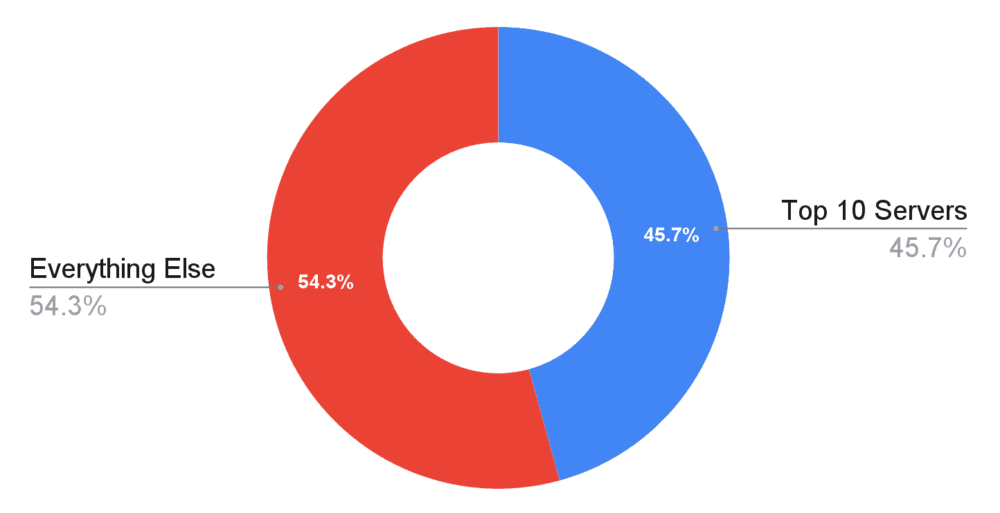
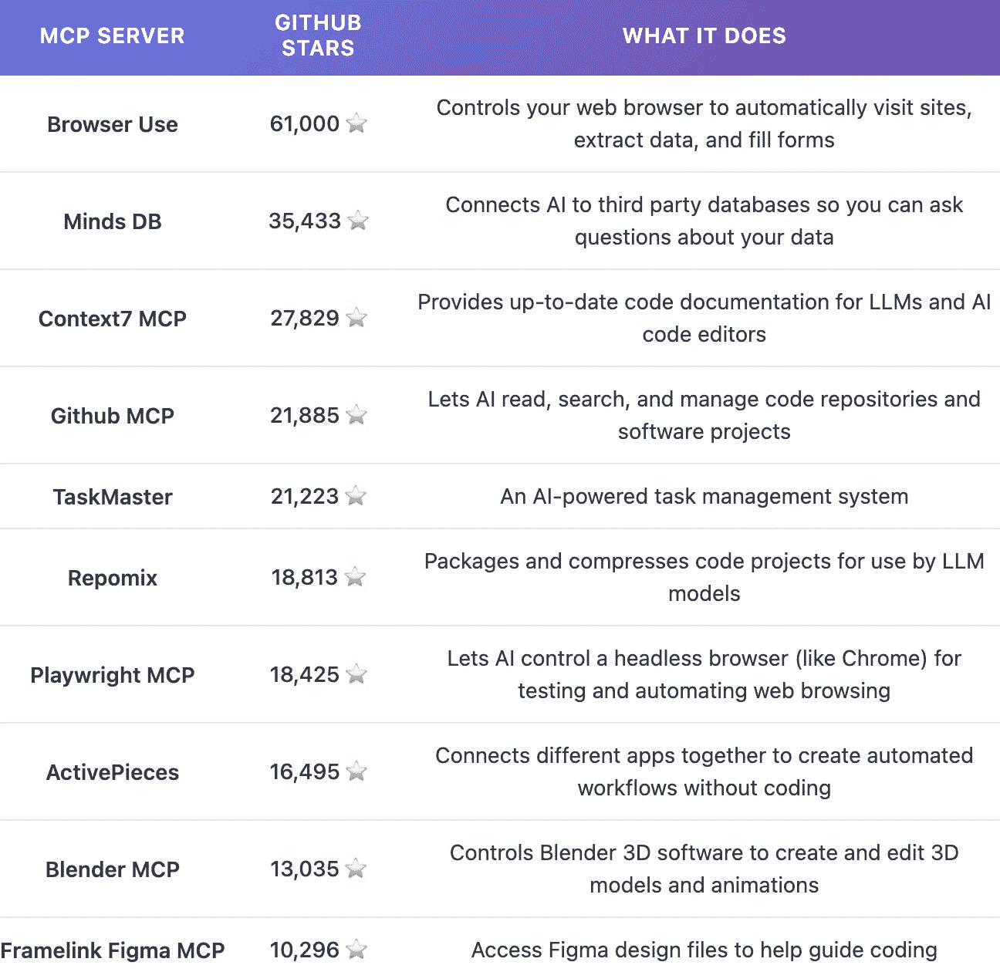
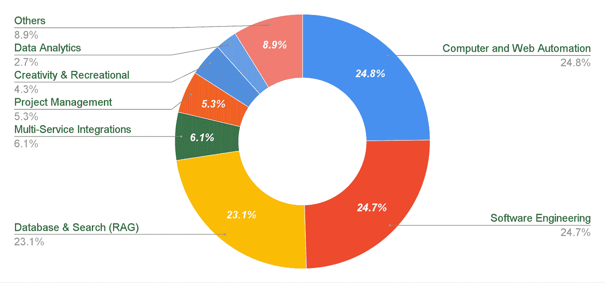
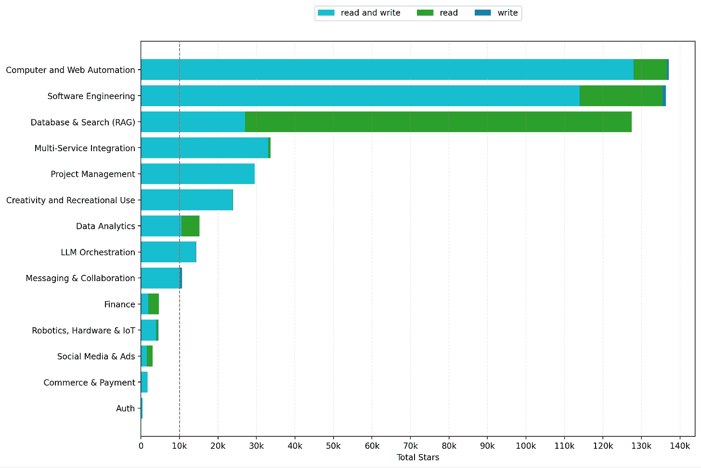
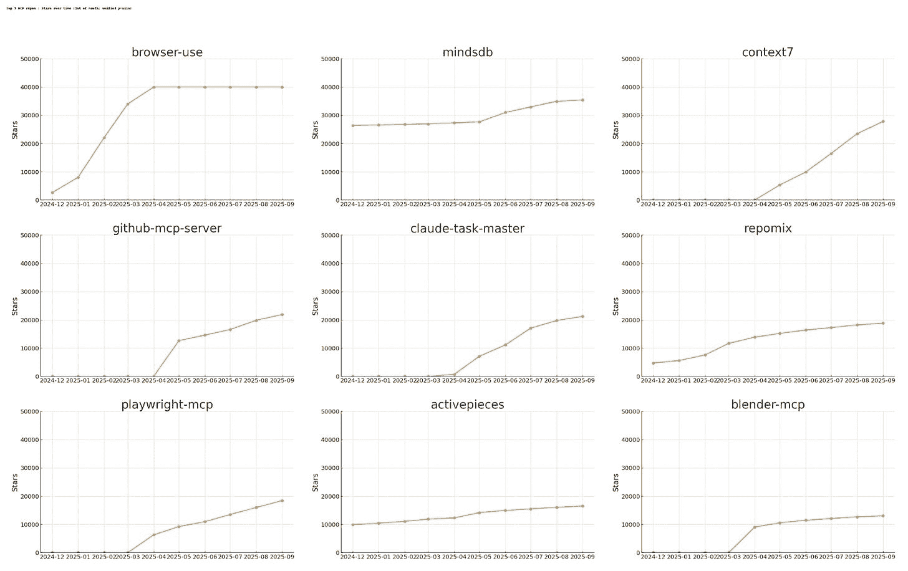

# MCP 实践

> 原文：[`towardsdatascience.com/mcp-in-practice/`](https://towardsdatascience.com/mcp-in-practice/)
> 
> 与**Ilan Strauss**、**Isobel Moure**和**Tim O’Reilly**共同撰写，作为[AI 披露项目](https://www.ssrc.org/programs/ai-disclosures-project/)的一部分。最初发表在我们的博客上：[Asimov 的附录](https://asimovaddendum.substack.com/p/read-write-act-inside-the-mcp-server)。

## 1\. <mdspan datatext="el1758912208244" class="mdspan-comment">MCP 的兴起与兴起</mdspan>

Anthropic 的[模型上下文协议](https://www.anthropic.com/news/model-context-protocol)（MCP）于 2024 年 11 月发布，作为一种使工具和平台模型无关的方法。MCP 通过定义服务器和客户端来工作。MCP 服务器是定义工具和资源的本地或远程端点。例如，GitHub 发布了一个 MCP 服务器，允许 LLM 从 GitHub 读取和写入。MCP 客户端是从 AI 应用程序到 MCP 服务器的连接——它们允许 LLM 与来自不同服务器的上下文和工具交互。一个 MCP 客户端的例子是 Claude Desktop，它允许 Claude 模型与数千个 MCP 服务器交互。

**在相对较短的时间内，MCP 已经成为了数百个 AI 管道和应用程序的骨干**。像 Anthropic 和 OpenAI 这样的主要玩家已经将其集成到他们的产品中。开发者工具，如 Cursor（一个以编码为重点的文本编辑器或 IDE），以及生产力应用如[Raycast](https://www.raycast.com/EvanZhouDev/mcp)也使用了 MCP。此外，成千上万的[开发者](https://arxiv.org/abs/2506.13538)使用它来集成 AI 模型和访问外部工具和数据，而无需从头开始构建整个生态系统。

在与*AI Frontiers*合作发表的前期工作中，我们论证了[MCP 可以作为“上下文”的绝佳解包者](https://ai-frontiers.org/articles/open-protocols-prevent-ai-monopolies)，即帮助 AI 应用程序向消费者提供更相关答案的数据。这样做可以帮助去中心化 AI 市场。**我们论证，为了 MCP 真正实现其目标，它需要以下支持**：

1.  **开放 API**：这样 MCP 应用程序就可以访问第三方工具进行代理使用（*写*操作）和上下文（*读*）

1.  **流体记忆**：通过类似 MCP 的开放协议访问的互操作 LLM 内存标准，这样 OpenAI 和其他领先开发者积累的记忆上下文就不会被困在那里，从而防止下游创新。

我们在一份[最新政策简报](https://ssrc-static.s3.us-east-1.amazonaws.com/Protocols-and-Power-Moure-OReilly-Strauss_SSRC_08272025.pdf)中进一步阐述了这两点，供那些想要深入了解的人参考。

更普遍地说，**我们认为协议**，**如 MCP**，**实际上是**[**AI 市场的根本“交通规则”**](https://asimovaddendum.substack.com/p/disclosures-i-do-not-think-that-word)，*其中开放披露和通信标准被构建到网络本身中*，而不是由监管者在事后强加。协议是塑造市场的根本工具，通过网络的权限、规则和互操作性来构建市场。它们对在它们之上构建的商业市场的运作方式也有重大影响。

### 1.1 但 MCP 生态系统是如何演变的呢？

**然而，我们并没有一个清晰的 MCP 生态系统当前的形状**。MCP 最常见的使用案例是什么？MCP 服务器提供的访问类型是什么？MCP 客户端使用的通过 MCP 访问的数据是“只读”的上下文，还是允许代理“写入”并与之交互——例如，通过编辑文件或发送电子邮件？

为了开始回答这些问题，我们来看看 AI 代理通过**MCP 服务器**使用的工具和上下文。这为我们提供了关于正在构建的内容和受到关注的线索。在这篇文章中，我们不分析**MCP 客户端**——使用 MCP 服务器的应用程序。我们反而将我们的分析限制在 MCP 服务器为构建提供的内容上。

我们收集了一个大型 MCP 服务器数据集（n = 2,874），这些数据是从[Pulse](https://www.pulsemcp.com/)爬取的。然后我们为每个服务器添加了 GitHub 星星计数数据。在 GitHub 上，星星类似于 Facebook 的“赞”，[开发者使用它们](https://homepages.dcc.ufmg.br/~mtov/pub/2018-jss-github-stars.pdf)来表示赞赏、收藏项目或指示使用。

在实践中，**尽管有大量的 MCP 服务器，但我们发现，前几个服务器获得了最多的关注，并且很可能是通过扩展，也获得了最多的使用**。**仅前 10 个服务器就几乎获得了所有 GitHub 星星中 MCP 服务器的近一半**。

**我们的一些见解包括：**

1.  **MCP 的使用似乎相当集中**。这意味着，如果不受控制，少数服务器和（通过扩展）API 可能会对正在创建的 MCP 生态系统产生不成比例的控制。

1.  **MCP 的使用（访问的工具和数据）主要由三个类别主导**：数据库与搜索（RAG）、计算机与网络自动化、以及软件工程。它们共同获得了近四分之三（72.6%）的 GitHub 星星（我们将其作为使用量的代理）。

1.  大多数 MCP 服务器都支持**读取**（访问上下文）和**写入**（更改上下文）操作，这表明开发者希望他们的代理能够对上下文进行操作，而不仅仅是消费它。

## 2. 发现

**首先，我们分析了 MCP 生态系统的集中风险**。

### 2.1 MCP 服务器使用集中

**我们发现 MCP 的使用集中在几个关键的 MCP 服务器上**，这是根据每个仓库收到的 GitHub 星星数量来判断的。

尽管存在数千个 MCP 服务器，但**前 10 个服务器占据了 GitHub 上所有 MCP 服务器星标的近一半（45.7%）**（下方的饼图所示），而前 10% 的服务器占据了 88.3% 的所有 GitHub 星标（未显示）。

**在我们的 2,874 个服务器的数据集中，顶级 10 个服务器获得了 45.7% 的所有 GitHub 星标。** 图片版权所有。

**这意味着，大多数现实世界的 MCP 用户可能依赖于通过少数几个 API 提供的相同几个服务**。这种集中化可能源于网络效应和实际效用：所有开发者都会倾向于使用解决像网络浏览、数据库访问以及与 GitHub、Figma 和 Blender 等广泛使用的平台集成的通用问题的服务器。这种集中化模式似乎在开发者工具生态系统中很典型。一些执行得很好、适用范围广泛的解决方案往往会占据主导地位。与此同时，更多专业化的工具则占据了较小的细分市场。

### 2.2 顶级 10 个 MCP 服务器真的很重要

接下来，下表展示了前 10 个 MCP 服务器，包括它们的星标数量和功能。

**在顶级 10 个 MCP 服务器中**，*GitHub*、*Repomix*、*Context7* 和 *Framelink* 都旨在协助软件开发：*Context7* 和 *Repomix* 通过收集上下文，*GitHub* 通过允许代理与项目交互，*Framelink* 通过将来自 *Figma* 的设计规范直接传递给模型。*Blender* 服务器允许代理使用流行的开源 *Blender* 应用创建任何东西的 3D 模型。最后，*Activepieces* 和 *MindsDB* 通过一个标准化的界面将代理连接到多个 API：在 *MindsDB* 的情况下，主要是从数据库中读取数据，而在 *Activepieces* 中则是自动化服务。

**顶级 10 个 MCP 服务器及其简短描述，设计由 Claude 提供。** 图片版权所有。

**代理浏览的统治地位**，以**浏览器使用**（61,000 个星标）和**Playwright MCP**（18,425 个星标）的形式出现，**格外引人注目**。这反映了人工智能系统与网络内容交互的基本需求。这些工具允许人工智能像人类一样导航网站、点击按钮、填写表格和提取数据。**尽管代理浏览的效率远低于调用 API**，但其使用量却大幅增加。浏览代理通常需要浏览多页的模板文本才能提取出单个 API 请求就能返回的数据片段。由于许多服务缺乏可用的 API 或严格控制 API 的访问，基于浏览器的代理通常是——有时是唯一的方式——来集成，这突显了当今 API 的局限性。

**一些顶级服务器是非官方的。**Framelink 和 Blender MCP 都是仅与单个应用程序交互的服务器，但它们都是“非官方”产品。这意味着它们没有得到它们所集成的应用程序的开发者（即拥有底层服务或 API 的人，例如 GitHub、Slack、Google）的官方认可。相反，它们是由独立开发者构建的，这些开发者创建了一个 AI 客户端和服务的桥梁——通常是通过逆向工程 API、包装非官方 SDK 或使用浏览器自动化来模拟用户交互。

第三方开发者可以构建自己的 MCP 服务器是件好事，因为这种开放性鼓励创新。但这也引入了用户和 API 之间的中介层，这带来了关于信任、验证甚至潜在滥用的风险。使用开源本地服务器，代码是透明的，可以被审查。相比之下，远程第三方服务器更难审计，因为用户必须信任他们无法轻易检查的代码。

**在更深的层次上，目前主导 MCP 服务器的仓库突出了 MCP 生态系统的三个令人鼓舞的事实：**

1.  **首先，一些突出的 MCP 服务器支持多个第三方服务以增强其功能。**MindsDB 和 Activepieces 通过单个服务器充当多个（通常是竞争的）服务提供商的网关。MindsDB 允许开发者通过单个界面查询不同的数据库，如 PostgreSQL、MongoDB 和 MySQL，而 Taskmaster 允许代理将任务委托给来自 OpenAI、Anthropic 和 Google 的各种 AI 模型，而无需更改服务器。

1.  **其次，代理浏览 MCP 服务器被用来绕过可能限制性的 API。**如上所述，Browser Use 和 Playwright 通过网页浏览器访问互联网服务，帮助绕过 API 限制，但它们却遇到了反机器人保护。这绕过了 API 对开发者能够构建的内容可能施加的限制。

1.  **第三，一些 MCP 服务器在开发者的计算机上（本地）进行其处理**，**这使得它们对供应商维护 API 访问的依赖性降低**。这里检查的一些 MCP 服务器可以在本地计算机上完全运行，无需将数据发送到云端——这意味着没有任何守门人有权切断你的服务。在上面的 10 个 MCP 服务器中，只有 Framelink、Context7 和 GitHub 依赖于仅适用于云端的单一 API 依赖项，无法在您的机器上端到端本地运行。Blender 和 Repomix 是完全开源的，无需任何互联网访问即可工作，而 MindsDB、Browser Use 和 Activepieces 都有本地开源实现。

### 2.3 主导 MCP 使用的三个类别

*接下来，我们将 MCP 服务器根据其功能分为不同的类别*。

当我们分析最受欢迎的服务器类型时，我们发现三种类型主导：**计算机与网络自动化（24.8%）**、**软件工程（24.7%）**和**数据库与搜索（23.1%）**。

*软件工程、计算机与网络自动化和数据库与搜索获得了分配给 MCP 服务器的所有星星的 72.6%。* 图片来源：我们。

软件工程（24.7%）MCP 服务器的广泛应用与[Anthropic 的经济指数](https://arxiv.org/abs/2503.04761)相一致，该指数发现，大量的人工智能交互与软件开发相关。

计算机与网络自动化（24.8%）和数据库与搜索（23.1%）的普及也是有道理的。在 MCP 出现之前，网络爬虫和数据库搜索是 ChatGPT、Perplexity 和 Gemini 等平台上的高度集成应用。然而，有了 MCP，用户现在可以轻松访问相同的搜索功能，并将他们的代理连接到任何数据库。换句话说，MCP 的[解包](https://ai-frontiers.org/articles/open-protocols-prevent-ai-monopolies)效应在这里非常明显。

### 2.4 代理与环境交互

*最后，我们分析了这些服务器的功能：它们是否只是允许人工智能应用程序访问数据和工具（*读取*），或者相反，使用它们进行代理操作（*写入*）？

**在查看的所有 MCP 服务器类别中，除了两个之外，最受欢迎的 MCP 服务器都支持*读取*（访问上下文）和*写入*（代理）操作**——以青色显示。具有读写访问权限的服务器普遍存在，这表明代理不仅仅是为了根据数据回答问题而构建，而是为了代表用户采取行动和与服务交互。

*按类别显示 MCP 服务器。10,000 颗星（点赞）处的虚线红色线。最受欢迎的服务器支持代理的读写操作。相比之下，几乎没有服务器只支持写操作。* 图片来源：我们。

两个例外是数据库与搜索（RAG）和金融 MCP 服务器，在这些服务器中，*只读*访问是一种常见的权限。这很可能是由于数据完整性对于确保可靠性至关重要。

## 3. 多个访问点的意义

在这个初步阶段，我们可以从我们的分析中得出一些启示。

**首先，集中使用 MCP 服务器会加剧 API 访问受限的风险**。正如我们在“[协议与权力](https://asimovaddendum.substack.com/p/protocols-and-power)”中讨论的那样，MCP 仍然受到“*特定服务（如 GitHub 或 Slack）通过其 API 暴露的内容*”的限制。一些强大的数字服务提供商有权关闭对其服务器的访问。

*一种重要的防范 API 审查的措施是，许多顶级服务器尽量避免依赖单一供应商*。**此外**，**以下两项安全措施也相关**：

+   **它们在可能的情况下提供本地数据处理**，而不是将数据发送到第三方服务器进行处理。本地处理确保功能无法被限制。

+   如果在本地运行服务不可行（例如，电子邮件或网络搜索），服务器仍然应该**支持通过竞争性 API 获取所需上下文的多种途径**。例如，*MindsDB*充当多个数据源的网关，因此它不依赖于单一数据库来读取和写入数据，而是尽力在一个统一的界面中支持多个数据库，本质上使后端工具可互换。

**其次，我们的分析指出，当前的严格 API 访问政策是不可持续的**。通过 MCP 服务器访问的网页抓取和机器人（至少部分）可能被用来规避过于严格的 API 访问，从而复杂化了越来越常见的禁止机器人的做法。甚至 OpenAI 也在 API 线外行动，通过第三方服务使用网页抓取来访问谷歌搜索的结果，从而**规避其限制性的 API**（[参见](https://www.theinformation.com/articles/openai-challenging-google-using-search-data)）。

**以有意义的方式扩展结构化 API 访问至关重要**。*这确保了合法的 AI 自动化可以通过稳定、文档化的端点运行*。否则，开发者会求助于脆弱的浏览器自动化，其中隐私和授权没有得到妥善处理。监管指导[可能推动](https://ai-frontiers.org/articles/open-protocols-prevent-ai-monopolies)市场向这一方向发展，就像美国的开放银行一样。

**最后，鼓励更大的透明度和披露**可能有助于确定 MCP 生态系统中瓶颈所在。

+   运营流行 MCP 服务器（超过一定使用阈值）或提供顶级服务器使用的 API 的开发者应报告使用统计、访问拒绝和速率限制策略。这些数据将帮助监管者识别在成为根深蒂固之前的新兴瓶颈。*例如，GitHub 可以通过鼓励这些披露来促进这一点*。

+   此外，超过一定使用阈值的 MCP 服务器应明确列出其对外部 API 的依赖，以及如果主 API 不可用时的回退选项。这不仅有助于确定市场结构，而且对于下游应用的安全性和鲁棒性也是关键信息。

目标不是消除网络中的所有集中，而是确保 MCP 生态系统保持可竞争性，有多个可行的创新路径和用户选择。通过解决技术架构和市场动态，这些建议的调整可以帮助 MCP 实现其在 AI 发展中作为民主化力量的潜力，而不仅仅是将瓶颈从一层转移到另一层。

* * *

## 附录

### 数据集

对于这次分析，我们使用 GPT-5 mini 将[PulseMCP.com](http://PulseMCP.com)上发现的 MCP 服务器分为 15 个类别之一。然后我们对构成数据集中约 70%总星标数的顶级 50 个服务器进行了人工审查和编辑。

完整数据集以及类别的描述可以在这里找到（由 Sruly Rosenblat 构建）：

[`huggingface.co/datasets/sruly/MCP-In-Practice`](https://huggingface.co/datasets/sruly/MCP-In-Practice)

### 局限性

我们初步研究有一些局限性：

+   GitHub 的星标并不是下载次数的衡量标准，甚至不一定能反映仓库的流行程度。

+   在使用 LLM 对仓库进行分类时，只使用了名称和描述。

+   分类受到人类和 AI 错误的限制，许多服务器可能适合多个类别。

+   我们只使用了 PulseMCP 列表作为我们的数据集；其他列表有不同的服务器（例如，Browser Use 不在 mcpmarket.com 上）。

+   我们排除了一些仓库的分析，例如那些每个代码仓库有多个服务器以及我们无法获取星标数的仓库。我们还只看了 PulseMCP 上列出的服务器。我们的服务器列表并不全面。

### MCP 服务器使用情况随时间变化

*从 MCP 于 2024 年 11 月 25 日启动至 2025 年 9 月期间，前九个仓库的星标数量随时间增长。*

*注意：我们只能追踪到 Browser Use 的仓库有 40,000 颗星；因此其图表呈现为水平线。实际上，在接下来的几个月里大约增加了 21,000 颗星。（本博客中的其他图表已适当调整。）*
