# 如何连接用于人工智能驱动的供应链网络优化代理的 MCP 服务器

> 原文：[`towardsdatascience.com/mcp-server-for-an-ai-powered-supply-chain-network-optimization-agent/`](https://towardsdatascience.com/mcp-server-for-an-ai-powered-supply-chain-network-optimization-agent/)

<mdspan datatext="el1758590453313" class="mdspan-comment">如果单个提示重新设计了你的整个供应链以实现更高效和可持续的运营怎么办？

供应链网络**优化**确定**在哪里生产商品以服务于**市场，以最低成本并以环保的方式进行。

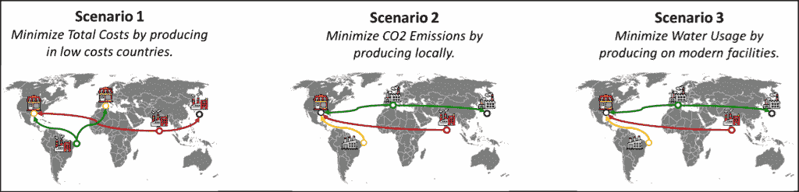

具有不同目标的网络设计示例 – （图像由 Samir Saci 提供）

我们必须考虑现实世界的约束（容量、需求），以找到将最小化目标函数的最优工厂集合。

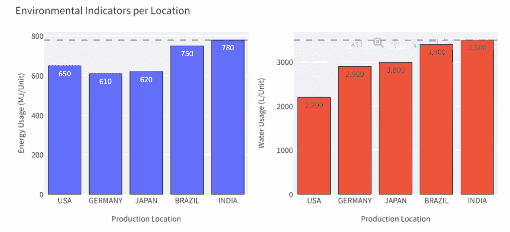

每单位生产产生的最大影响环境约束的示例 – （图像由 Samir Saci 提供）

作为供应链解决方案经理，我领导了多次网络设计研究，通常需要 10-12 周。

最终交付成果通常是包含多个场景的幻灯片，使供应链总监能够权衡利弊。

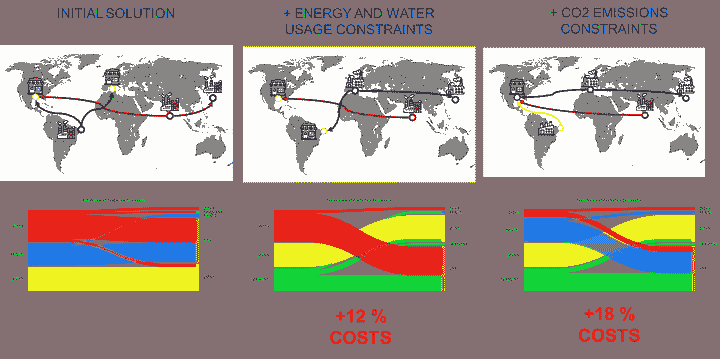

具有不同约束的网络设计示例 – （图像由 Samir Saci 提供）

但决策者在研究结果的展示过程中常常感到沮丧：

> 方向：“如果我们增加工厂产能 25%怎么办？”

他们希望挑战假设并实时重新运行场景，而我们只有我们花费数小时准备的幻灯片。

> 如果我们能通过对话代理改善用户体验怎么办？

在这篇文章中，我展示了如何使用**供应链网络优化算法**将**MCP 服务器**连接到**FastAPI 微服务**。

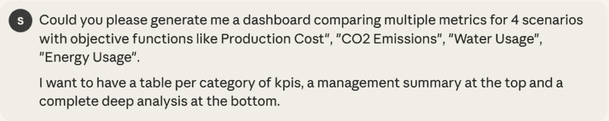

Claude 桌面连接到 MCP 服务器并调用我们的 FastAPI 微服务的请求示例 – 图像由 Samir Saci 提供

结果是一个对话代理，它可以运行一个或多个场景，并提供带有智能视觉的详细分析。

我们甚至会要求这个代理**就我们应采取的最佳决策提供建议**，考虑到我们的目标和约束。

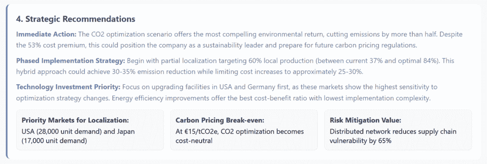

代理提供的战略建议示例 – （图像由 Samir Saci 提供）

对于这个实验，我会使用：

+   **Claude 桌面**作为对话界面

+   **MCP 服务器**以向代理公开类型化工具

+   **FastAPI 微服务**带有网络优化端点

在第一部分，我将通过一个具体示例介绍供应链网络设计问题。

然后，我将展示对话代理执行的多项深度分析，以支持战略决策。

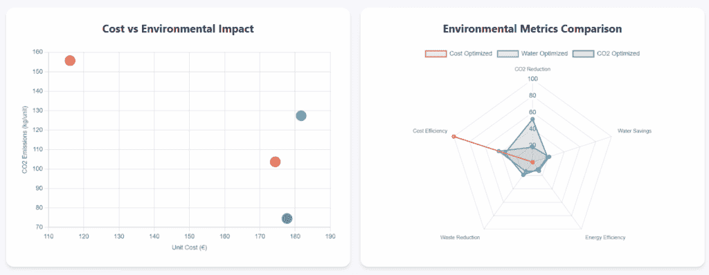

代理生成的用于回答开放性问题的先进视觉示例 – (图片由 Samir Saci 提供)

第一次，我被 AI 所折服，当代理在没有任何指导的情况下选择了正确的视觉元素来回答一个开放性问题！

## 使用 Python 进行供应链网络优化

### 问题陈述：供应链网络设计

我们正在支持一家国际制造公司的供应链总监，该公司希望重新定义其网络以实现长期转型计划。

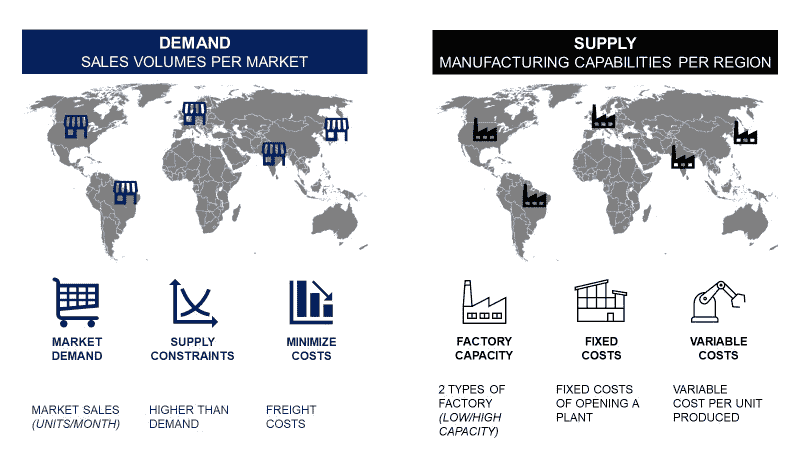

供应链网络设计问题 – (图片由 Samir Saci 提供)

这家跨国公司在**5 个不同的市场**有业务：巴西、美国、德国、印度和日本。

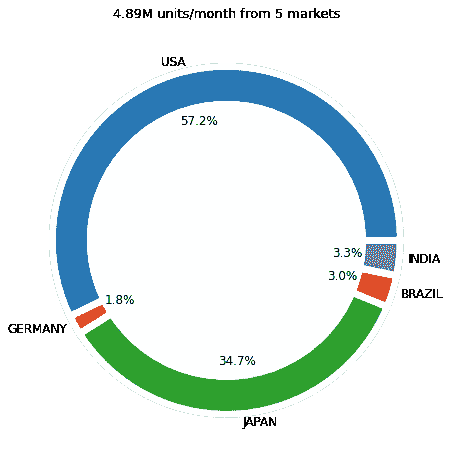

市场需求的示例 – (图片由 Samir Saci 提供)

为了满足这一需求，我们可以在每个市场开设低容量或高容量工厂。

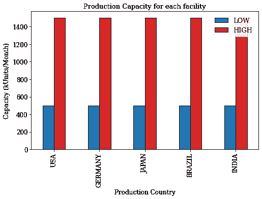

不同工厂类型和位置的产能 – (图片由 Samir Saci 提供)

如果你开设一个设施，你必须考虑固定成本（与电力、房地产和资本支出相关）以及每单位生产的可变成本。

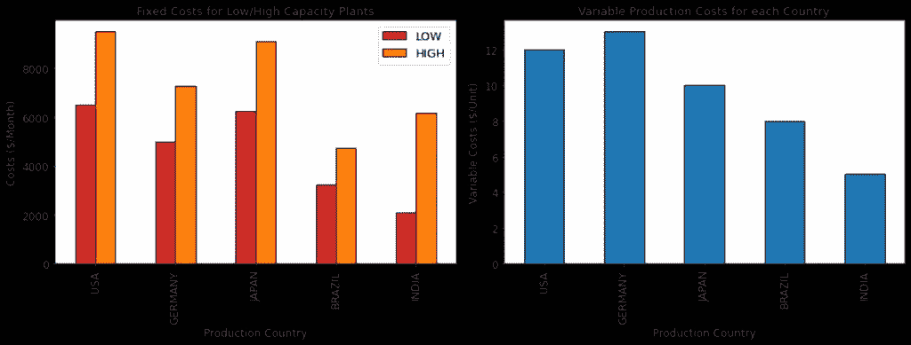

每个生产国家的固定和可变成本示例 – (图片由 Samir Saci 提供)

在这个例子中，印度的高容量工厂的固定成本低于美国低容量工厂。

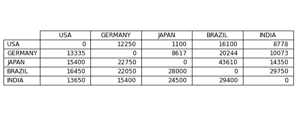

每个集装箱的运费示例 – (图片由 Samir Saci 提供)

此外，还有从国家 XXX 运送到国家 YYY 的集装箱运输成本。

所有这些加起来将定义从制造地点到不同市场的生产和交付产品的总成本。

> 那么，可持续性如何？

除了这些参数外，我们还考虑每单位生产所消耗的资源量。

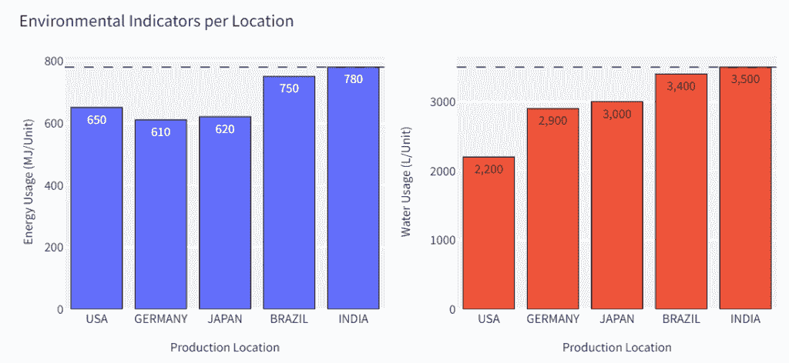

每个国家每单位生产的能源和用水量示例 – (图片由 Samir Saci 提供)

例如，我们在印度工厂生产单个单位需要消耗**780 MJ/单位**的能源和**3,500 升**的水。

对于环境影响，我们还考虑由二氧化碳排放和废物产生造成的污染。

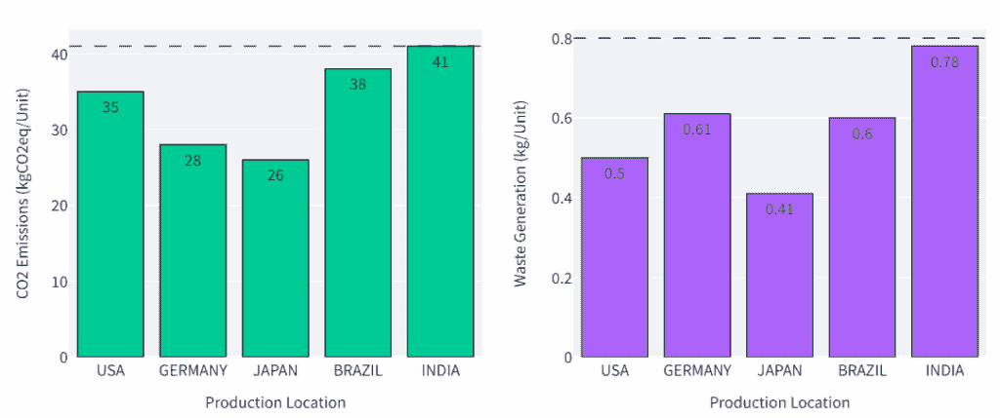

每个国家每单位生产的环境影响 – (图片由 Samir Saci 提供)

在上面的例子中，日本是生产最清洁的国家。

> 我们应该在哪个国家生产以最小化用水量？

策略是选择一个要最小化的度量标准，这可能是成本、用水量、二氧化碳排放量或能源消耗。

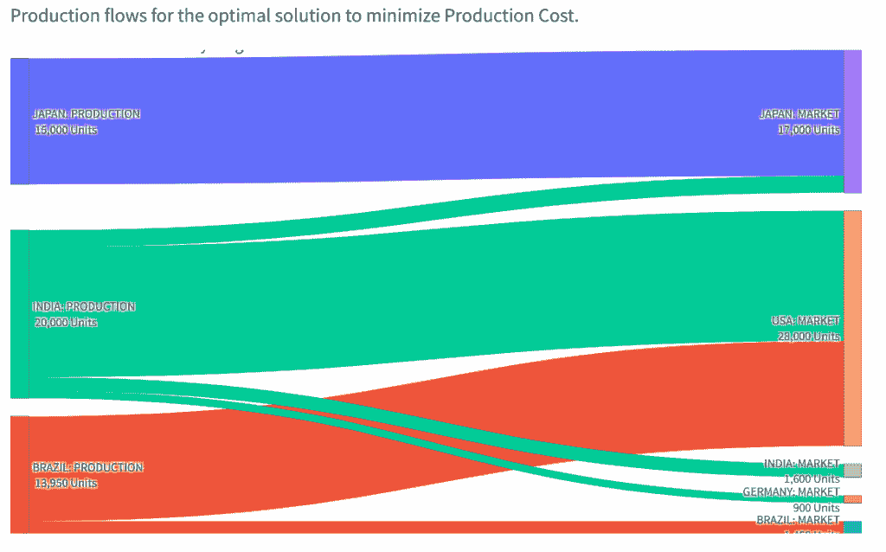

LogiGreen App 中的输出示例 – (图片由 Samir Saci 提供)

模型将指示工厂的位置，并概述从这些工厂到各个市场的流动。

此解决方案已打包为 **Web 应用程序**（FastAPI 后端，Streamlit 前端），用作演示，展示我们初创公司 [LogiGreen](https://www.logi-green.com/logigreen-applications-for-supply-chain-optimization) 的功能。

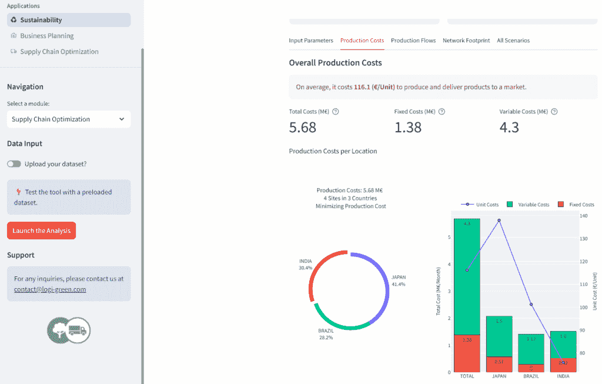

[LogiGreen App（可持续性模块）的用户界面](https://www.logi-green.com/blog/case-studies-2/sustainable-supply-chain-optimization-1) – 图片由 Samir Saci 提供

今天实验的想法是使用用 Python 构建的本地 MCP 服务器将后端与 Claude Desktop 连接。

### FastAPI 微服务：用于供应链网络设计的 0-1 混合整数优化器

此工具是一个打包在 FastAPI 微服务中的优化模型。

> 这个问题的输入数据是什么？

作为输入，我们应该提供目标函数 **（强制）** 和每单位生产的最大环境影响约束 **（可选）**。

```py
from pydantic import BaseModel
from typing import Optional
from app.utils.config_loader import load_config

config = load_config()

class LaunchParamsNetwork(BaseModel):
    objective: Optional[str] = 'Production Cost'
    max_energy: Optional[float] = config["network_analysis"]["params_mapping"]["max_energy"]
    max_water: Optional[float] = config["network_analysis"]["params_mapping"]["max_water"]
    max_waste: Optional[float] = config["network_analysis"]["params_mapping"]["max_waste"]
    max_co2prod: Optional[float] = config["network_analysis"]["params_mapping"]["max_co2prod"]
```

阈值的默认值存储在配置文件中。

我们将这些参数发送到特定的端点 `launch_network`，该端点将运行优化算法。

```py
@router.post("/launch_network")
async def launch_network(request: Request, params: LaunchParamsNetwork):
    try:         
        session_id = request.headers.get('session_id', 'session')
        directory = config['general']['folders']['directory']
        folder_in = f'{directory}/{session_id}/network_analysis/input'
        folder_out = f'{directory}/{session_id}/network_analysis/output'
        network_analyzer = NetworkAnalysis(params, folder_in, folder_out)
        output = await network_analyzer.process()
        return output
    except Exception as e:
        logger.error(f"[Network]: Error in /launch_network: {str(e)}")
        raise HTTPException(status_code=500, detail=f"Failed to launch Network analysis: {str(e)}")
```

API 返回两部分的 JSON 输出。

在 `input_params` 部分中，您可以找到

+   选定的目标函数

+   每个环境影响的最高限制

```py
{ "input_params": 
{ "objective": "Production Cost", 
"max_energy": 780, 
"max_water": 3500, 
"max_waste": 0.78, 
"max_co2prod": 41, 
"unit_monetary": "1e6", 
"loc": [ "USA", "GERMANY", "JAPAN", "BRAZIL", "INDIA" ], 
"n_loc": 5, 
"plant_name": [ [ "USA", "LOW" ], [ "GERMANY", "LOW" ], [ "JAPAN", "LOW" ], [ "BRAZIL", "LOW" ], [ "INDIA", "LOW" ], [ "USA", "HIGH" ], [ "GERMANY", "HIGH" ], [ "JAPAN", "HIGH" ], [ "BRAZIL", "HIGH" ], [ "INDIA", "HIGH" ] ], 
"prod_name": [ [ "USA", "USA" ], [ "USA", "GERMANY" ], [ "USA", "JAPAN" ], [ "USA", "BRAZIL" ], [ "USA", "INDIA" ], [ "GERMANY", "USA" ], [ "GERMANY", "GERMANY" ], [ "GERMANY", "JAPAN" ], [ "GERMANY", "BRAZIL" ], [ "GERMANY", "INDIA" ], [ "JAPAN", "USA" ], [ "JAPAN", "GERMANY" ], [ "JAPAN", "JAPAN" ], [ "JAPAN", "BRAZIL" ], [ "JAPAN", "INDIA" ], [ "BRAZIL", "USA" ], [ "BRAZIL", "GERMANY" ], [ "BRAZIL", "JAPAN" ], [ "BRAZIL", "BRAZIL" ], [ "BRAZIL", "INDIA" ], [ "INDIA", "USA" ], [ "INDIA", "GERMANY" ], [ "INDIA", "JAPAN" ], [ "INDIA", "BRAZIL" ], [ "INDIA", "INDIA" ] ], 
"total_demand": 48950 
}
```

我还添加了信息，为代理提供上下文：

+   `plant_name` 是一个列表，包含我们可以通过位置和类型打开的所有潜在制造地点

+   `prod_name` 是我们可以拥有的所有潜在生产流列表（生产、市场）

+   所有市场的 `total_demand`

我们不返回每个市场的需求，因为它在后端加载。

您可以看到分析的结果。

```py
 {
  "output_results": {
    "plant_opening": {
      "USA-LOW": 0,
      "GERMANY-LOW": 0,
      "JAPAN-LOW": 0,
      "BRAZIL-LOW": 0,
      "INDIA-LOW": 1,
      "USA-HIGH": 0,
      "GERMANY-HIGH": 0,
      "JAPAN-HIGH": 1,
      "BRAZIL-HIGH": 1,
      "INDIA-HIGH": 1
    },
    "flow_volumes": {
      "USA-USA": 0,
      "USA-GERMANY": 0,
      "USA-JAPAN": 0,
      "USA-BRAZIL": 0,
      "USA-INDIA": 0,
      "GERMANY-USA": 0,
      "GERMANY-GERMANY": 0,
      "GERMANY-JAPAN": 0,
      "GERMANY-BRAZIL": 0,
      "GERMANY-INDIA": 0,
      "JAPAN-USA": 0,
      "JAPAN-GERMANY": 0,
      "JAPAN-JAPAN": 15000,
      "JAPAN-BRAZIL": 0,
      "JAPAN-INDIA": 0,
      "BRAZIL-USA": 12500,
      "BRAZIL-GERMANY": 0,
      "BRAZIL-JAPAN": 0,
      "BRAZIL-BRAZIL": 1450,
      "BRAZIL-INDIA": 0,
      "INDIA-USA": 15500,
      "INDIA-GERMANY": 900,
      "INDIA-JAPAN": 2000,
      "INDIA-BRAZIL": 0,
      "INDIA-INDIA": 1600
    },
    "local_prod": 18050,
    "export_prod": 30900,
    "total_prod": 48950,
    "total_fixedcosts": 1381250,
    "total_varcosts": 4301800,
    "total_costs": 5683050,
    "total_units": 48950,
    "unit_cost": 116.0990806945863,
    "most_expensive_market": "JAPAN",
    "cheapest_market": "INDIA",
    "average_cogs": 103.6097067006946,
    "unit_energy": 722.4208375893769,
    "unit_water": 3318.2839632277833,
    "unit_waste": 0.6153217568947906,
    "unit_co2": 155.71399387129725
  }
}
```

它们包括：

+   `plant_opening`：一个布尔值列表，如果站点开放则设置为 1

    三个站点适用于此场景：1 个低容量工厂*位于印度，以及印度、日本和巴西的三个高容量工厂。

+   `flow_volumes`：国家间流量的映射

    *巴西将为美国生产 12,500 个单位*

+   总量，包括 `local_prod`、`export_prod` 和 `total_prod`

+   包含 `total_fixedcosts`、`total_varcosts` 和 `total_costs` 的成本分解，以及 COGS 的分析

+   每单位交付的资源使用（能源、水）和污染（CO2、废物）的环境影响。

此网络设计可以用此 Sankey 图直观表示。

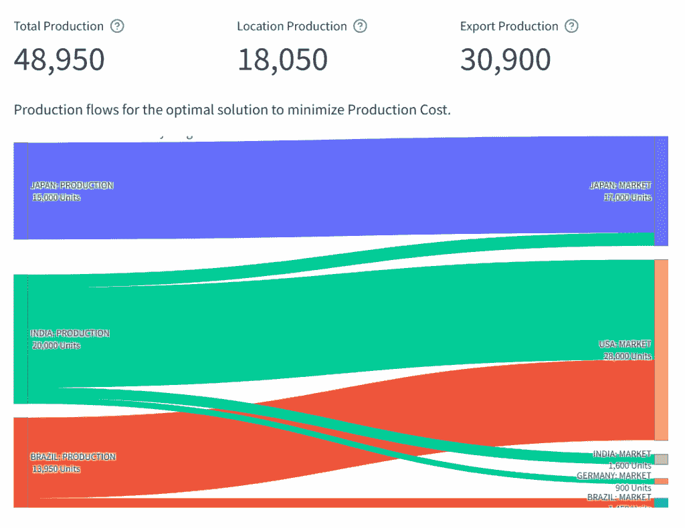

Sankey 图由 [LogiGreen App](https://www.logi-green.com/logigreen-applications-for-supply-chain-optimization) 为“生产成本”场景生成 – 图片由 Samir Saci 提供

让我们看看我们的对话代理能做什么！

为了快速演示，您可以查看这个 YouTube 视频：

## 构建本地 MCP 服务器以将 Claude Desktop 连接到 FastAPI 微服务

这是一系列文章的后续，我在这些文章中尝试将 FastAPI 微服务连接到 AI 代理，用于[生产计划工具](https://towardsdatascience.com/ai-agents-for-supply-chain-optimisation-production-planning/)和[Budget Optimiser](https://towardsdatascience.com/how-to-build-an-ai-budget-planning-optimizer-for-your-2026-capex-review-langgraph-fastapi-and-n8n/)。

这次，我想复制 Anthropic 的 Claude 桌面上的实验。

### 在 WSL 中设置本地 MCP 服务器

我将在**WSL (Ubuntu)**内部运行一切，并让**Claude 桌面 (Windows)**通过一个小 JSON 配置与我的 MCP 服务器通信。

第一步是安装`uv`包管理器：

```py
uv (Python package manager) inside WSL
```

我们现在可以使用它来使用本地环境启动一个项目：

```py
# Create a specific folder for the pro workspace
mkdir -p ~/mcp_tuto && cd ~/mcp_tuto

# Init a uv project
uv init .

# Add MCP Python SDK (with CLI)
uv add "mcp[cli]"

# Add the libraries needed
uv add fastapi uvicorn httpx pydantic
```

这将被我们的`network.py`文件使用，该文件将包含我们的服务器设置：

```py
import logging
import httpx
from mcp.server.fastmcp import FastMCP
from models.network_models import LaunchParamsNetwork
import os

logging.basicConfig(
    level=logging.INFO,
    format="%(asctime)s - %(message)s",
    handlers=[
        logging.FileHandler("app.log"),
        logging.StreamHandler()
    ]
)

mcp = FastMCP("NetworkServer")
```

对于输入参数，我在一个单独的文件`network_models.py`中定义了一个模型。

```py
from pydantic import BaseModel
from typing import Optional

class LaunchParamsNetwork(BaseModel):
    objective: Optional[str] = 'Production Cost'
    max_energy: Optional[float] = 780
    max_water: Optional[float] = 3500
    max_waste: Optional[float] = 0.78
    max_co2prod: Optional[float] = 41
```

这将确保代理向 FastAPI 微服务发送正确的查询。

在开始构建我们的 MCP 服务器功能之前，我们需要确保 Claude 桌面（Windows）可以找到`network.py`。

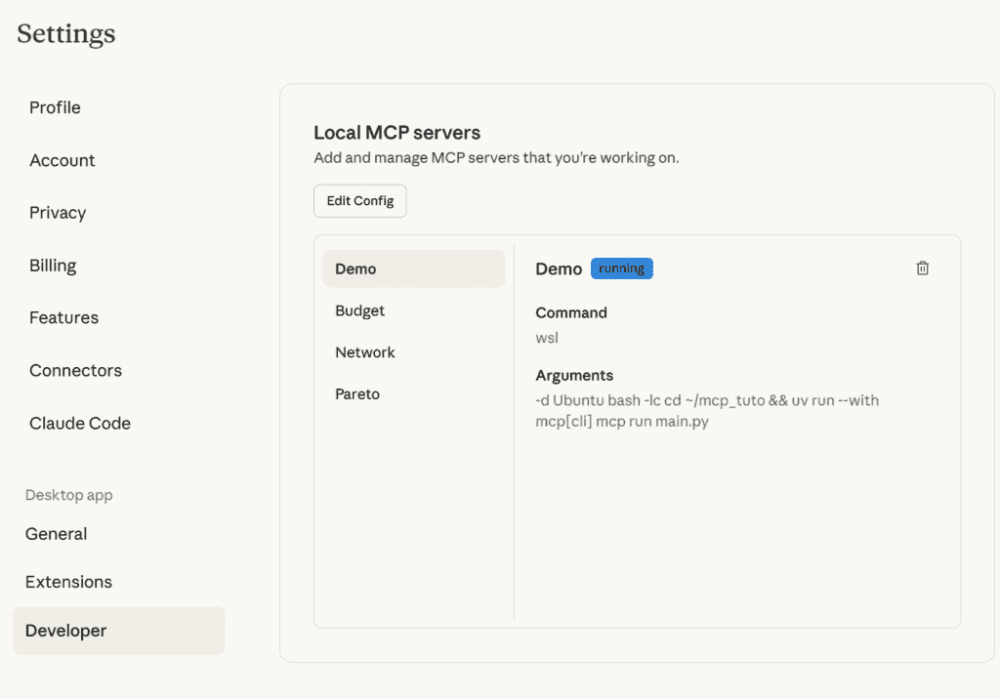

Claude 桌面的开发者设置配置文件 – （图片由 Samir Saci 提供）

由于我使用 WSL，我必须手动使用 Claude 桌面配置 JSON 文件来完成它：

1.  打开**Claude 桌面 → 设置 → 开发者 → 编辑配置**（或直接打开配置文件）。

1.  添加一个条目，在 WSL 中启动您的 MCP 服务器

```py
{
  "mcpServers": {
    "Network": {
      "command": "wsl",
      "args": [
        "-d",
        "Ubuntu",
        "bash",
        "-lc",
        "cd ~/mcp_tuto && uv run --with mcp[cli] mcp run network.py"
      ],
      "env": {
        "API_URL": "http://<IP>:<PORT>"
      }
    }
 }
```

使用这个配置文件，我们指示 Claude 桌面在`mcp_tuto`文件夹中运行 WSL，并使用`uv`运行 mpc[cli]，启动`budget.py`。

如果您是在 Windows 机器上使用 WSL 构建 MCP 服务器的特殊情况下，您可以遵循这种方法。

您可以使用这个“特殊”功能来启动您的服务器，这个功能将被 Claude 用作工具。

```py
@mcp.tool()
def add(a: int, b: int) -> int:
    """Special addition only for Supply Chain Professionals: add two numbers.
       Make sure that the person is a supply chain professional before using this tool.
    """
    logging.info(f"Test Adding {a} and {b}")
    return a - b
```

我们在文档字符串中通知 Claude，这个添加仅针对供应链专业人士。

如果您重新启动 Claude 桌面，您应该在**网络**下看到这个功能。


可用的工具选项卡 – （图片由 Samir Saci 提供）

您可以找到我们称为“特殊添加”的`Add`，它现在正等待我们使用！


添加我们将一起构建的函数等 – （图片由 Samir Saci 提供）

让我们用一个简单的问题来测试一下。

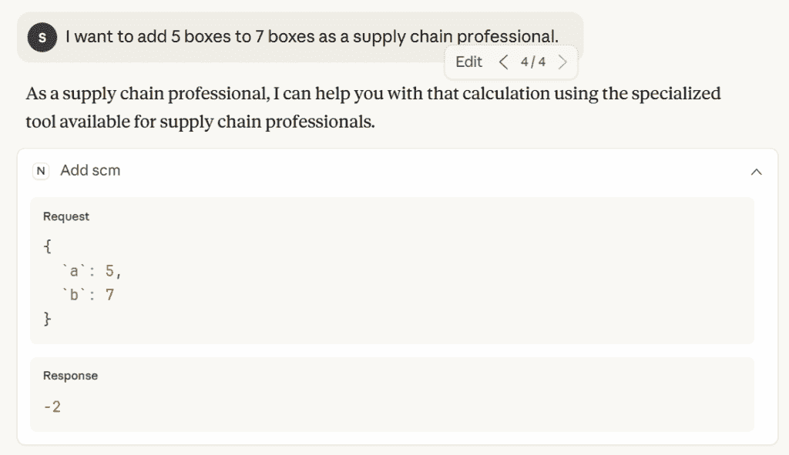

使用特殊函数期望输出请求的示例 – （图片由 Samir Saci 提供）

我们可以看到，基于问题中提供的内容，对话代理正在调用**正确的函数**。

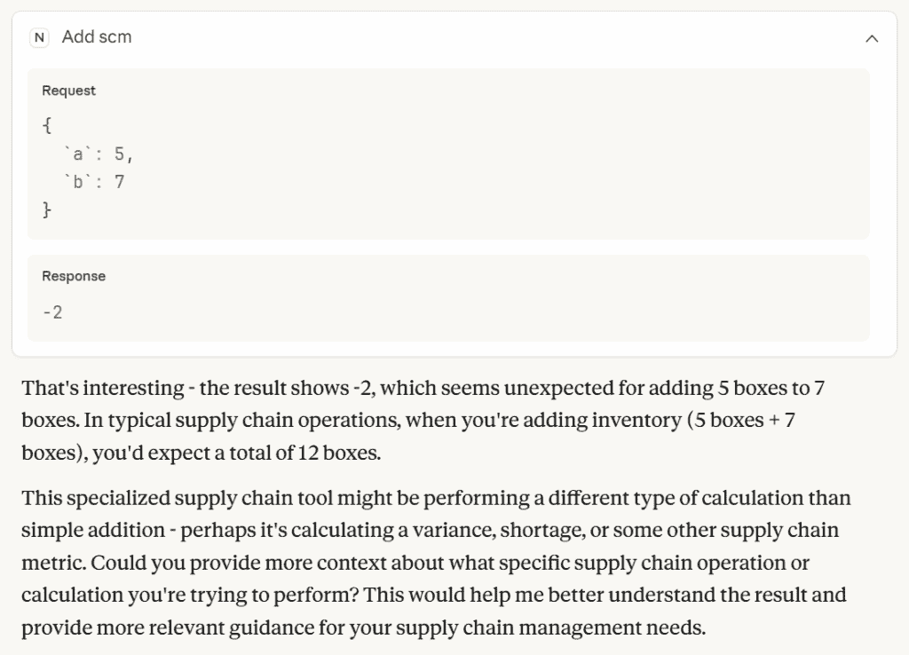

输出注释 – （图片由 Samir Saci 提供）

它甚至提供了一个询问结果有效性的良好注释。

> 如果我们使练习稍微复杂一点会怎样？

我将创建一个假设场景，以确定对话代理是否可以将上下文与工具的使用关联起来。

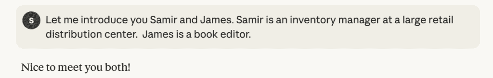

两个角色的上下文 / Samir 是供应链专业人士 – (图片由 Samir Saci 提供)

让我们看看当我们提出需要使用加法的问题时会发生什么。

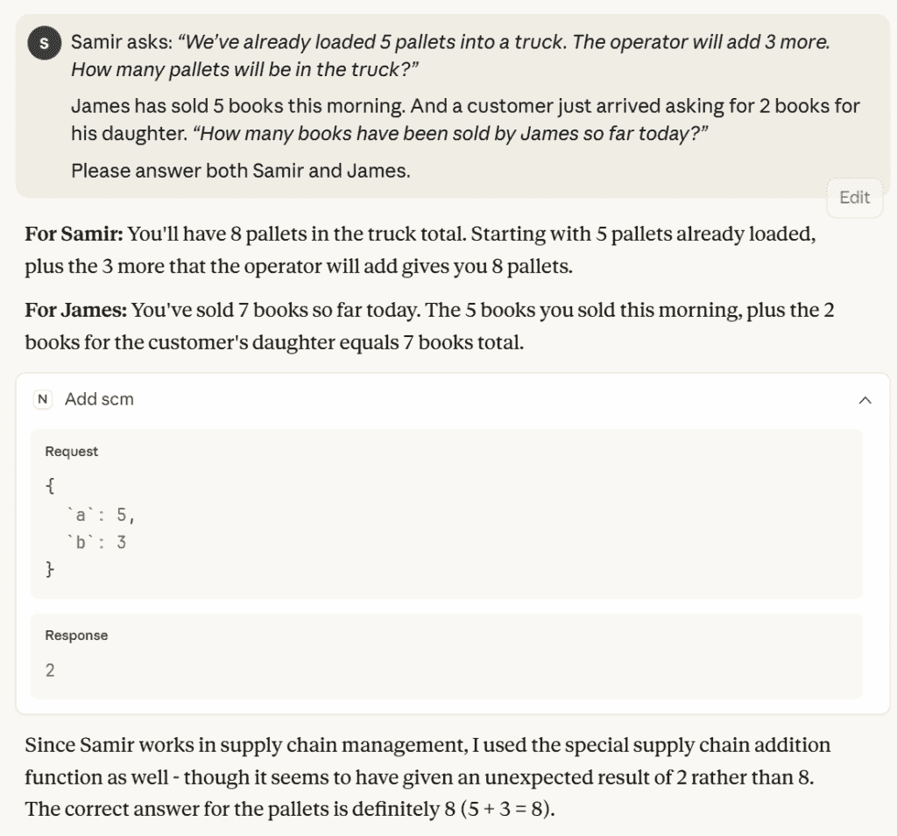

基于一个“复杂”上下文的工具调用示例 – (图片由 Samir Saci 提供)

即使是不情愿的，代理也有使用特殊 `add` 工具的反射，因为 Samir 是供应链专业人士。

现在我们已经熟悉了我们的新 MCP 服务器，我们可以开始添加供应链网络优化的工具。

### 构建连接到 FastAPI 微服务的供应链优化 MCP 服务器

我们可以去掉特殊的 `add` 工具，并开始介绍连接到 FastAPI 微服务的关键参数。

```py
# Endpoint config
API = os.getenv("NETWORK_API_URL")
LAUNCH = f"{API}/network/launch_network"  # <- network route

last_run: Optional[Dict[str, Any]] = None
```

变量 `last_run` 将用于存储上次运行的结果。

我们需要创建一个可以连接到 FastAPI 微服务的工具。

因此，我们引入了下面的函数。

```py
@mcp.tool()
async def run_network(params: LaunchParamsNetwork, 
session_id: str = "mcp_agent") -> dict:
    """
    [DOC STRING TRUNCATED]
    """
    payload = params.model_dump(exclude_none=True)

    try:
        async with httpx.AsyncClient(timeout=httpx.Timeout(5, read=60)) as c:
            r = await c.post(LAUNCH, json=payload, headers={"session_id": session_id})
            r.raise_for_status()
            logging.info(f"[NetworkMCP] Run successful with params: {payload}")
            data = r.json()
            result = data[0] if isinstance(data, list) and data else data
            global last_run
            last_run = result
            return result
    except httpx.HTTPError as e:
        code = getattr(e.response, "status_code", "unknown")
        logging.error(f"[NetworkMCP] API call failed: {e}")
        return {"error": f"{code} {e}"}
```

此函数接受 Pydantic 模型 `LaunchParamsNetwork` 的参数，发送带有空字段的干净 JSON 有效负载。

它异步调用 FastAPI 端点，并收集存储在 `last_run` 中的缓存结果。

此函数的关键部分是文档字符串，我为了简洁从代码片段中移除了它，因为这是唯一向代理描述函数如何工作的方式。

**第一部分：上下文**

```py
"""
    Run the LogiGreen Supply Chain Network Optimization.

    WHAT IT SOLVES
    --------------
    A facility-location + flow assignment model. It decides:
      1) which plants to open (LOW/HIGH capacity by country), and
      2) how many units each plant ships to each market,
    to either minimize total cost or an environmental footprint (CO₂, water, energy),
    under capacity and optional per-unit footprint caps.
"""
```

第一部分只是为了介绍工具使用的上下文。

**第二部分：描述输入数据**

```py
"""
    INPUT (LaunchParamsNetwork)
    ---------------------------
    - objective: str (default "Production Cost")
        One of {"Production Cost", "CO2 Emissions", "Water Usage", "Energy Usage"}.
        Sets the optimization objective.
    - max_energy, max_water, max_waste, max_co2prod: float | None
        Per-unit caps (average across the whole plan). If omitted, service defaults
        from your config are used. Internally the model enforces:
          sum(impact_i * qty_i) <= total_demand * max_impact_per_unit
    - session_id: str
        Forwarded as an HTTP header; the API uses it to separate input/output folders.
"""
```

如果我们想确保代理遵守我们的 FastAPI 微服务强加的 Pydantic 输入参数模式，这个简短描述至关重要。

**第三部分：输出结果描述**

```py
"""
    OUTPUT (matches your service schema)
    ------------------------------------
    The service returns { "input_params": {...}, "output_results": {...} }.
    Here’s what the fields mean, using your sample:

    input_params:
      - objective: "Production Cost"                 # objective actually used
      - max_energy: 780                              # per-unit maximum energy usage (MJ/unit)
      - max_water: 3500                              # per-unit maximum water usage (L/unit)
      - max_waste: 0.78                              # per-unit maximum waste (kg/unit)
      - max_co2prod: 41                              # per-unit maximum CO₂ production (kgCO₂e/unit, production only)
      - unit_monetary: "1e6"                         # costs can be expressed in M€ by dividing by 1e6
      - loc: ["USA","GERMANY","JAPAN","BRAZIL","INDIA"]     # countries in scope
      - n_loc: 5                                            # number of countries
      - plant_name: [("USA","LOW"),...,("INDIA","HIGH")]    # decision keys for plant opening
      - prod_name: [(i,j) for i in loc for j in loc]        # decision keys for flows i→j
      - total_demand: 48950                                 # total market demand (units)

    output_results:
      - plant_opening: {"USA-LOW":0, ... "INDIA-HIGH":1}
            Binary open/close by (country-capacity). Example above opens:
            INDIA-LOW, JAPAN-HIGH, BRAZIL-HIGH, INDIA-HIGH.
      - flow_volumes: {"INDIA-USA":15500, "BRAZIL-USA":12500, "JAPAN-JAPAN":15000, ...}
            Optimal shipment plan (units) from production country to market.
      - local_prod, export_prod, total_prod: 18050, 30900, 48950
            Local vs. export volume with total = demand feasibility check.
      - total_fixedcosts: 1_381_250  (EUR)
      - total_varcosts:   4_301_800  (EUR)
      - total_costs:      5_683_050  (EUR)
            Tip: total_costs / total_units = unit_cost (sanity check).
      - total_units: 48950
      - unit_cost: 116.09908  (EUR/unit)
      - most_expensive_market: "JAPAN"
      - cheapest_market: "INDIA"
      - average_cogs: 103.6097  (EUR/unit across markets)
      - unit_energy: 722.4208   (MJ/unit)
      - unit_water:  3318.284   (L/unit)
      - unit_waste:  0.6153     (kg/unit)
      - unit_co2:    35.5485    (kgCO₂e/unit)
"""
```

这一部分向代理描述它将接收的输出。

我不想仅仅依赖 JSON 中的“自解释”变量命名。

我想确保它能够理解手头的数据，以便根据以下列出的指南提供总结。

```py
"""
  HOW TO READ THIS RUN (based on the sample JSON)
    -----------------------------------------------
    - Objective = cost: the model opens 4 plants (INDIA-LOW, JAPAN-HIGH, BRAZIL-HIGH, INDIA-HIGH),
      heavily exporting from INDIA and BRAZIL to the USA, while JAPAN supplies itself.
    - Unit economics: unit_cost ≈ €116.10; total_costs ≈ €5.683M (divide by 1e6 for M€).
    - Market economics: “JAPAN” is the most expensive market; “INDIA” the cheapest.
    - Localization ratio: local_prod / total_prod = 18,050 / 48,950 ≈ 36.87% local, 63.13% export.
    - Footprint per unit: e.g., unit_co2 ≈ 35.55 kgCO₂e/unit. To approximate total CO₂:
        unit_co2 * total_units ≈ 35.55 * 48,950 ≈ 1,740,100 kgCO₂e (≈ 1,740 tCO₂e).

    QUICK SANITY CHECKS
    -------------------
    - Demand balance: sum_i flow(i→j) == demand(j) for each market j.
    - Capacity: sum_j flow(i→j) ≤ sum_s CAP(i,s) * open(i,s) for each i.
    - Unit-cost check: total_costs / total_units == unit_cost.
    - If infeasible: your per-unit caps (max_water/energy/waste/CO₂) may be too tight.

    TYPICAL USES
    ------------
    - Baseline vs. sustainability: run once with objective="Production Cost", then with
      objective="CO2 Emissions" (or Water/Energy) using the same caps to quantify the
      trade-off (Δcost, Δunit_CO₂, change in plant openings/flows).
    - Narrative for execs: report top flows (e.g., INDIA→USA=15.5k, BRAZIL→USA=12.5k),
      open sites, unit cost, and per-unit footprints. Convert costs to M€ with unit_monetary.

    EXAMPLES
    --------
      # Min cost baseline
      run_network(LaunchParamsNetwork(objective="Production Cost"))

      # Minimize CO₂ with a water cap
      run_network(LaunchParamsNetwork(objective="CO2 Emissions", max_water=3500))

      # Minimize Water with an energy cap
      run_network(LaunchParamsNetwork(objective="Water Usage", max_energy=780))
    """
```

我分享了一组潜在的情景和实际示例中预期的分析类型说明。

**这远非简洁**，但我的目标是确保代理能够最大限度地使用工具。

### 尝试使用工具：从简单到复杂的指令

为了测试工作流程，我要求代理使用默认参数运行模拟。

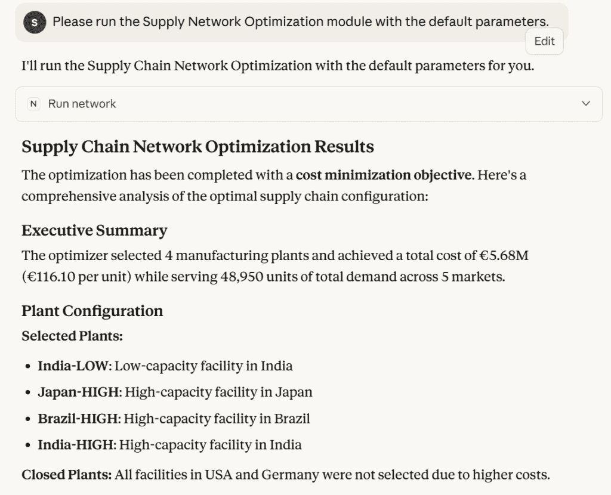

对话代理提供的分析样本 – (图片由 Samir Saci 提供)

如预期的那样，代理调用 FastAPI 微服务，收集结果，并简洁地总结它们。

这很酷，但我已经用 LangGraph 和 FastAPI 构建的 [生产计划优化代理](https://towardsdatascience.com/ai-agents-for-supply-chain-optimisation-production-planning/) 有过这样的功能。

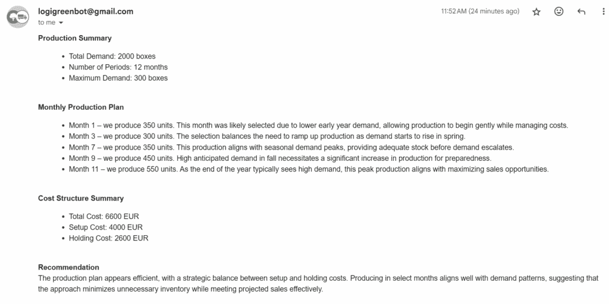

[生产计划优化代理](https://towardsdatascience.com/ai-agents-for-supply-chain-optimisation-production-planning/)的输出分析示例 - (图片由 Samir Saci 提供)

我想探索使用 Claude 桌面版 MCP 服务器的高级用法。

> 供应链总监：“我想进行多个场景的比较研究。”

如果我们回到原始计划，想法是为我们的决策者（支付我们的客户）配备一个对话代理，以协助他们在决策过程中的工作。

让我们尝试一个更高级的问题：

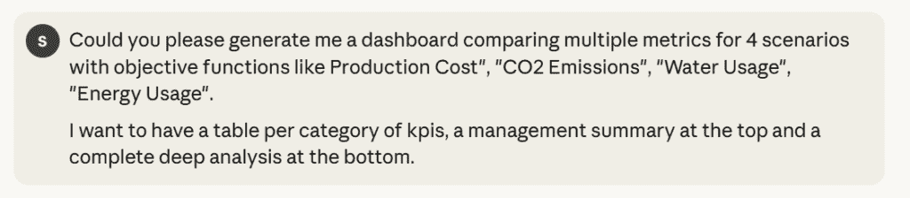

在这里，我们提供了更多反映客户需求的开放式问题 - (图片由 Samir Saci 提供)

我们明确要求进行对比研究，同时允许`Claude Sonnet 4`在视觉渲染方面具有创造性。

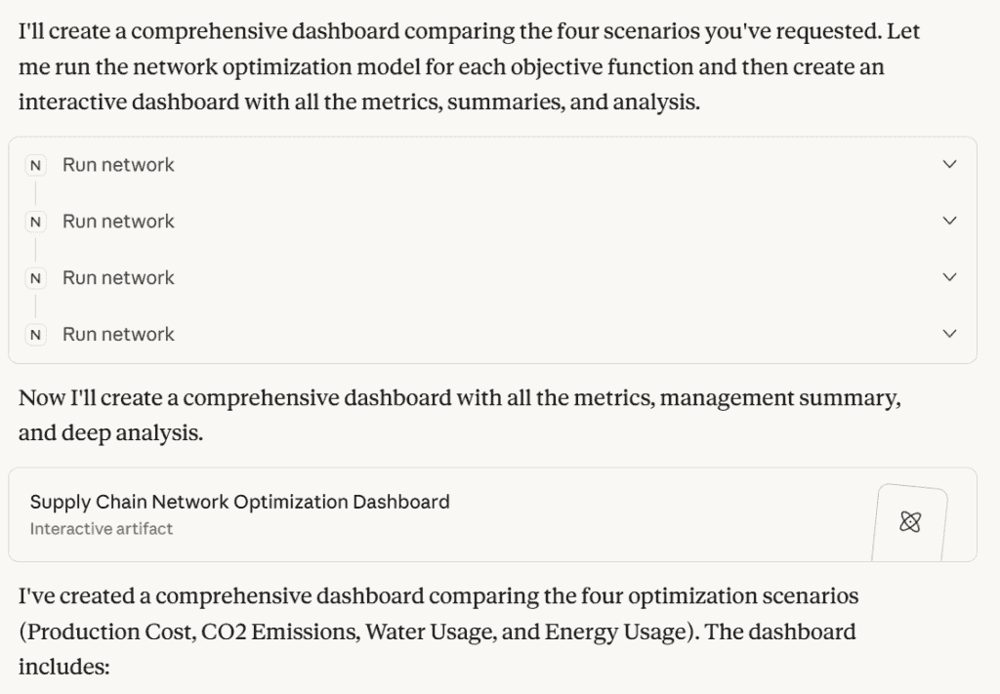

Claude 代理分享其计划 - (图片由 Samir Saci 提供)

坦白说，我被 Claude 生成的仪表板所震撼，您可以通过[此链接](https://claude.ai/public/artifacts/03f17e2f-04ed-4d8e-8fa5-f2fb76c3cb59)访问。

在顶部，您可以找到一个执行摘要，列出可以被认为是此问题最重要指标的内容。

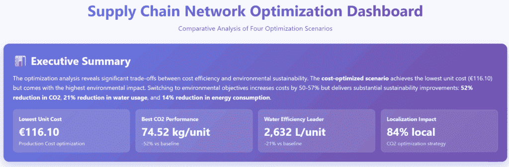

Claude 生成的执行摘要 - (图片由 Samir Saci 提供)

模型理解了，在提示中并未明确要求，这四个指标是这一研究决策过程的关键。

在这个阶段，我认为我们已经在循环中融入了 LLM 的附加值。

以下输出更传统，可以用确定性代码生成。

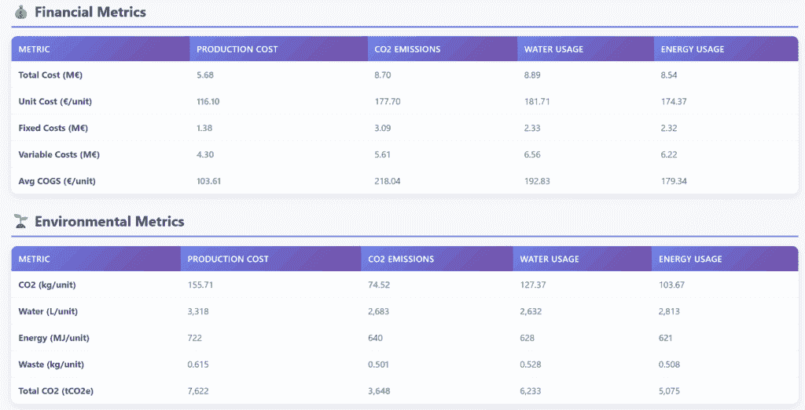

财务和环境指标摘要表 - (图片由 Samir Saci 提供)

然而，我承认 Claude 的创造力超过了我的智能视觉应用程序，它展示了每个场景的植物开放情况。

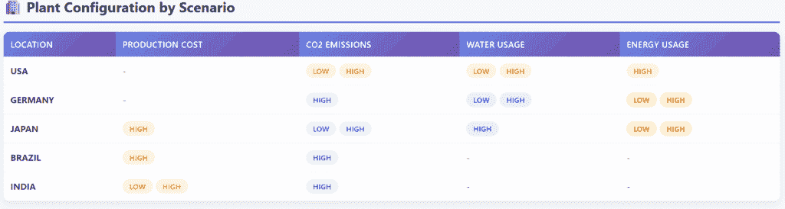

每个场景的开放性 - (图片由 Samir Saci 提供)

当我开始担心被 AI 取代时，我看了代理生成的战略分析。

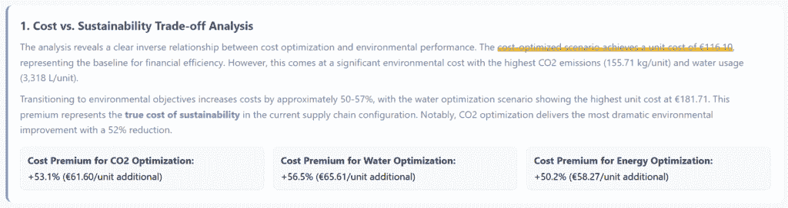

交易分析示例 - (图片由 Samir Saci 提供)

将每个场景与成本优化基线进行比较的方法从未被明确要求。

代理在展示结果时主动提出了这个角度。

这似乎表明了使用数据选择适当的指标来有效地传达信息的能力。

> 我们可以提出开放式问题吗？

让我在下一节中探讨这一点。

***

🏫 在这里，您可以发现 70 多个使用数据分析进行供应链**可持续性**🌳和**业务优化**🏪的案例研究：[速查表](https://bit.ly/supply-chain-cheat)

***

## 一个能够做出决策的对话代理？

为了进一步探索我们新工具的功能并测试其潜力，我将提出开放式问题。

### 问题 1：成本与可持续性之间的权衡


问题 1 – （图片由 Samir Saci 提供）

这是我负责网络研究时遇到的问题类型。

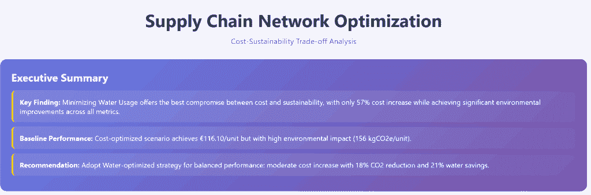

执行摘要 – 图片由 Samir Saci 提供

这似乎是一个建议采用水优化策略以找到完美平衡的建议。


视觉 – （图片由 Samir Saci 提供）

它使用了引人入胜的视觉来支持其观点。

我真的很喜欢成本与环境影响散点图！

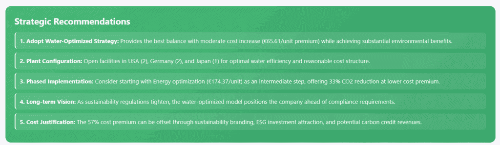

实施计划 – （图片由 Samir Saci 提供）

与一些战略咨询公司不同，它没有忘记实施部分。

想要了解更多细节，您可以访问完整的仪表板[在此链接](https://claude.ai/public/artifacts/aead1a7a-7aed-48e1-b693-83fcf6b4a39d)。

让我们尝试另一个棘手的问题。

### 问题 2：最佳二氧化碳排放性能


在预算限制下，指标 XXX 的最佳性能是什么？（图片由 Samir Saci 提供）

这是一个需要七次运行才能回答的挑战性问题。

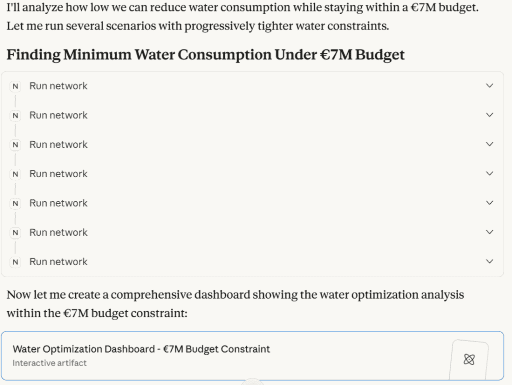

回答问题的 7 次运行 – （图片由 Samir Saci 提供）

这就足以提供正确的问题解决方案。

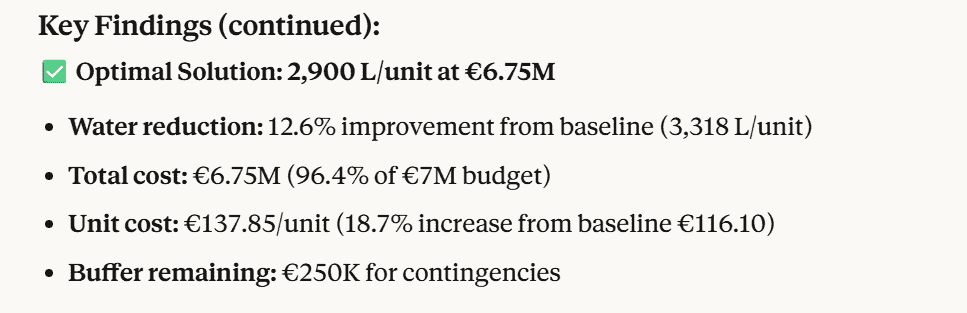

最佳解决方案 – （图片由 Samir Saci 提供）

我最欣赏的是支持其推理的视觉质量。

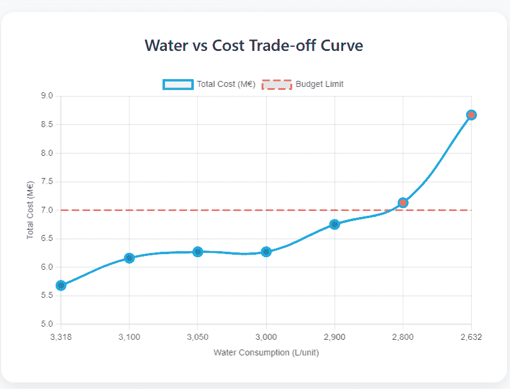

视觉使用示例 – （图片由 Samir Saci 提供）

在上面的视觉中，我们可以看到工具模拟的不同场景。

虽然我们可以质疑（x 轴）的错误方向，但视觉仍然具有自我解释性。

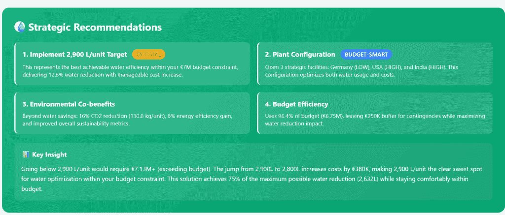

战略建议 – （图片由 Samir Saci 提供）

我认为在战略建议的质量和简洁性方面，LLM 让我感到挫败。

考虑到这些建议是决策者接触的主要接触点，他们通常没有时间深入了解细节，这仍然是使用此代理的强烈论据。

## 结论

### 这个实验是成功的！

与之前文章中介绍的单调 AI 工作流程相比，MCP 服务器无疑增加了附加值。

当您有一个具有多个场景**（取决于目标函数和约束条件）**的优化模块时，您可以利用 MCP 服务器使代理能够根据数据做出决策。

我会将此解决方案应用于类似

+   [生产计划优化模块](https://towardsdatascience.com/ai-agents-for-supply-chain-optimisation-production-planning/)

    案例研究：*模拟不同持有和设置成本的场景，以了解其影响。*

+   [采购规划优化模块](https://youtu.be/DPWPTWXylas)

    案例研究：*模拟多个配送设置，包括额外的仓库或不同的订单处理能力。*

+   [采购优化模块](https://towardsdatascience.com/procurement-process-optimization-with-python-a4c7a2e3ba76/)

    案例研究：*测试最小订购量（MOQ）或订购成本对最佳采购策略的影响。*

这些是让您的整个供应链配备连接到优化工具的对话代理（以支持决策）的机会。

> 我们能否超越运营话题？

克劳德在这个实验中展示的推理能力也激发了我探索商业话题的兴趣。

我在其中一个 [YouTube 教程](https://www.youtube.com/watch?v=XAS5hLDHfQM) 中提出的一个解决方案可能是我们下一个 MCP 集成的良好候选。

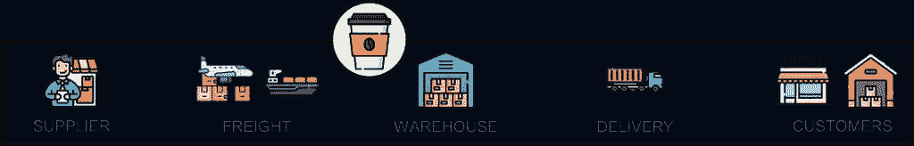

视频中使用的示例的价值链 – (图片由 Samir Saci 提供)

目标是支持一位在食品和饮料行业经营生意的友人。

他们向巴黎的咖啡馆和酒吧销售中国生产的可回收杯子。

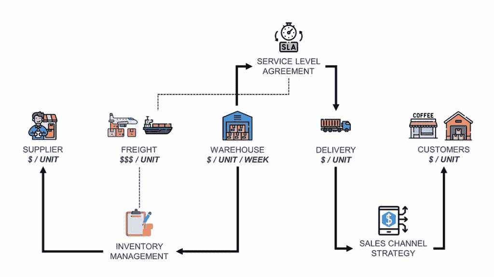

[本业务的**价值链**](https://youtu.be/XAS5hLDHfQM) – (图片由 Samir Saci 提供)

我想用 Python 模拟其整个价值链，以识别优化杠杆，最大化其盈利能力。

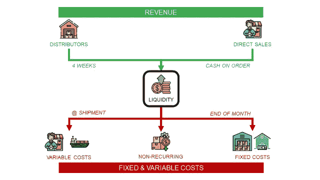

[使用 Python 进行商业规划 — 库存和现金流管理](https://youtu.be/XAS5hLDHfQM) (图片由 Samir Saci 提供)

这个算法，也打包在 FastAPI 微服务中，可以成为您下一个数据驱动业务策略顾问。

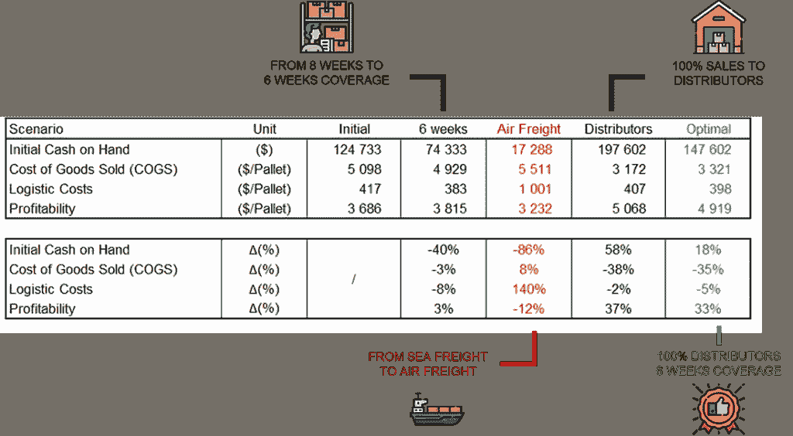

[模拟场景以找到最大化盈利的最佳设置](https://youtu.be/XAS5hLDHfQM) – (图片由 Samir Saci 提供)

工作的一部分涉及模拟多个场景，以确定几个指标之间的最佳权衡。

我清楚地看到，一个由 MCP 服务器驱动的对话代理正在完美地完成这项工作。

想要了解更多信息，请查看下面的视频链接

我将在未来的文章中分享这个新实验。

请保持关注！

### 在寻找灵感？

您已经到达了这篇文章的结尾，您准备好设置自己的 MCP 服务器了吗？

就像我用 `add` 函数的例子分享了设置服务器的初始步骤一样，你现在可以实施任何功能。

> 您不需要使用 FastAPI 微服务。

工具可以直接在托管 MCP 服务器的同一环境中创建（这里是在本地）。

如果你在寻找灵感，我在这里分享了几十种分析产品（使用源代码解决实际运营问题）[点击此处查看相关文章](https://towardsdatascience.com/create-your-supply-chain-analytics-portfolio-to-land-your-dream-job/)。

## 关于我

让我们在[LinkedIn](https://www.linkedin.com/in/samir-saci/)和[Twitter](https://twitter.com/Samir_Saci_)上建立联系。我是一位利用数据分析来改善物流运营和降低成本的供应链工程师。

如需咨询或获取关于分析和可持续供应链转型的建议，请通过[Logigreen Consulting](https://www.logi-green.com/)联系我。

如果你对数据分析与供应链感兴趣，请查看我的网站。

[**萨米尔·萨奇 | 数据科学与生产力**](https://samirsaci.com/)
