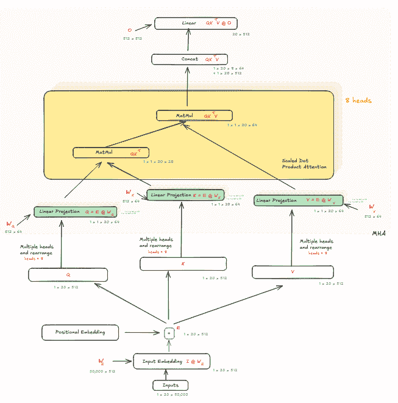
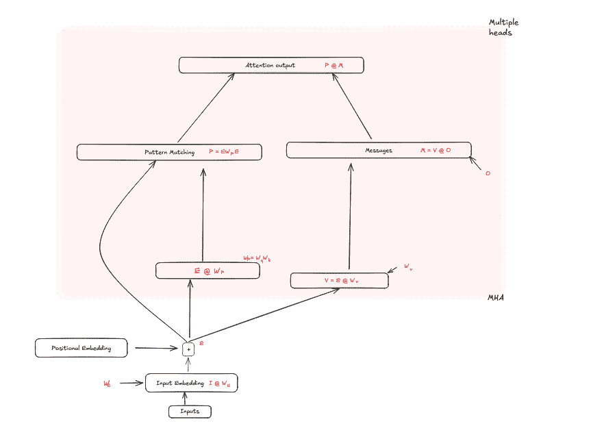
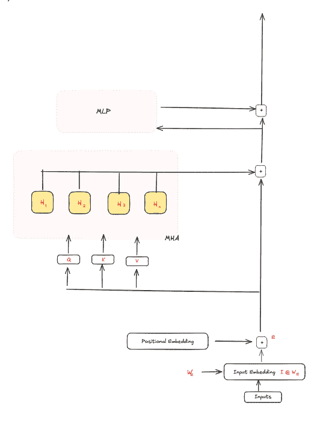
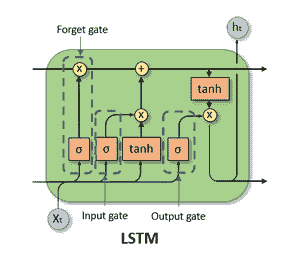

# Transformer 的机制观点：模式、消息、残差流……以及 LSTMs

> 原文：[`towardsdatascience.com/mechanistic-view-of-transformers-patterns-messages-residual-stream-and-lstms/`](https://towardsdatascience.com/mechanistic-view-of-transformers-patterns-messages-residual-stream-and-lstms/)

<mdspan datatext="el1754324724973" class="mdspan-comment">在我的上一篇文章](https://towardsdatascience.com/transformers-and-attention-are-just-fancy-addition-machines/)中，我谈到了机制可解释性如何重新想象 Transformer 中的注意力，使其在没有任何连接的情况下是加性的。在这里，我将深入探讨这个观点，并展示它如何与 LSTMs 中的想法产生共鸣，以及这种重新解释如何为理解打开新的途径。

为了打好基础：在 Transformer 中的注意力机制依赖于一系列涉及查询（Q）、键（K）、值（V）和输出投影矩阵（O）的矩阵乘法。传统上，每个头独立计算注意力，然后将结果连接起来，并通过 O 进行投影。但从机制的角度来看，最好理解为最终通过权重矩阵 O 的投影实际上是对每个头 W[o]（与传统观点中将头连接后再投影相比）。这种细微的转变意味着头在最终之前是独立且可分离的。

图片由作者提供

## 模式和消息

> 关于 Q、K 和 V 的简要类比：每个矩阵都是嵌入 E（或该层的激活）的线性投影。然后，Q 中的标记可以被视为向 K 提问“哪些其他标记与我相关？”K 代表一个键（类似于哈希表），它表示存储在 V 中的标记中包含的实际信息。这样，序列中的输入标记就知道应该关注哪些标记，以及关注程度如何。

从本质上讲，Q 和 K 确定*相关性*，而 V 持有*内容*。这种交互告诉每个标记应该关注哪些其他标记，以及关注程度如何。现在让我们看看将头视为独立是如何导致每个头的查询-键和值-输出矩阵属于两个独立过程，即*模式*和*消息*的观点。

解构注意力的步骤：

1.  将嵌入矩阵 E 与 W[q]相乘以获得查询向量 Q。类似地，通过将 E 与 W[k]和 W[v]相乘，获得键向量 K 和值向量 V。

1.  与 Q 和 K^T 相乘。在传统的注意力观点中，这个操作被视为确定序列中哪些其他标记与当前考虑的标记最相关。

1.  应用 softmax。这确保了在上一步计算的相关性或相似度得分归一化到 1，从而给出了其他标记在上下文中相对于当前标记的重要性的概率分布。softmax (QK^T/*sqrt*(d[k]))，其中 d[k]是键向量 K 的维度。

1.  与 V 相乘。这一步结束了注意力计算，我们现在已经根据计算出的分数从（即，关注）序列中提取了信息。这为我们提供了一个上下文丰富的当前标记表示，其中编码了有关序列中其他标记如何与它相关联的信息。

1.  最后，使用矩阵 O* 将此结果投影回模型空间，每层应用 W[o]

最终的注意力计算如下：**QK^TVW[o]**

现在，不再将此视为 **((QK^T)V)O**，机制解释将其视为重新排列的 **(QK^T)(VW[o]**)，其中 **QK^T** 形成模式，**VW[o]** 形成消息，每层一个。*这为什么重要？* 因为它让我们可以清晰地分离两个概念过程：

**消息** **(VW[o])**：确定要传输的内容。

**模式** **(QKᵀ)：**确定要查看的位置（相关性）。

深入挖掘，记住 Q 和 K 本身是从嵌入矩阵 E 中派生出来的。因此，我们也可以将方程写成：

(EW[q])(W^T[k]E)

机制解释指的是将 W[q]W[k]^T 作为 **W**[**p**] 用于模式权重矩阵。在这里，EW[p] 可以理解为产生一个模式，然后与另一个 E 中的嵌入进行匹配，获得一个可以用来加权消息的分数。基本上，这重新定义了注意力中的相似度计算为“模式匹配”，并为我们提供了相似度计算与嵌入之间的直接关系。

同样，VO 可以被视为 EW[v]W[o]，这是 *每头* 值向量，从嵌入中派生出来并投影到模型空间。再次，这种重新定义为我们提供了嵌入与最终输出之间的直接关系，而不是将注意力视为一系列步骤。另一个区别是，虽然传统的注意力观点暗示信息 V 中的信息是通过 Q 表示的查询提取的，但机制观点允许我们思考要打包到消息中的信息是由嵌入本身 *选择* 的，并且只是通过模式加权。

最后，使用模式-消息术语的注意力是这样的：嵌入中的每个标记使用获得的模式来确定要传达多少消息以预测下一个标记。

图片由作者提供

## 这使得可能：残差流

在我的上一篇文章 [这里](https://towardsdatascience.com/transformers-and-attention-are-just-fancy-addition-machines/) 中，我们看到了多头注意力的加性重写，以及在这里我们直接用嵌入来重写注意力计算，我们可以将每个操作视为是 *加到* 而不是 *转换* 初始嵌入的。在 transformer 中的残差连接，传统上被解释为跳跃连接，可以重新解释为携带嵌入的残差 *流*，从该流中多头注意力和 MLP 等组件读取，执行某些操作，并将其添加回嵌入。这使得每个操作成为对持久记忆的更新，而不是转换链。因此，这种观点在概念上更简单，同时仍然保持了完整的数学等价性。更多关于这个话题的内容 [在这里](https://mccormickml.com/2025/02/20/patterns-and-messages-part-5-the-residual-stream/)。

注意，这个观点简化并忽略了引入非线性操作的归一化和 softmax 等操作。

图片由作者提供

## 这与 LSTM 有何关系？

由 [Jonte Decker](https://towardsdatascience.com/a-brief-introduction-to-recurrent-neural-networks-638f64a61ff4/) 提供的 LSTM

回顾一下：LSTMs，或长短期记忆，是一种设计用来处理 RNN 中常见的梯度消失问题的 RNN 类型，它通过在“细胞”中存储信息并允许它们学习数据中的长距离依赖关系。如上图所示，LSTM 细胞有两个状态——用于长期记忆的细胞状态 **c** 和用于短期记忆的隐藏状态 **h**。

它还具有门——遗忘门、输入门和输出门，用于控制信息流入和流出细胞。直观地说，遗忘门充当一个杠杆，用于确定不传递或忘记多少长期信息；输入门充当一个杠杆，用于确定将多少当前输入从隐藏状态添加到长期记忆中；输出门充当一个杠杆，用于确定发送到下一个时间步隐藏状态的 *修改后* 长期记忆的多少。

LSTM 和 transformer 的核心区别在于 LSTM 是顺序性和局部的，它一次只处理一个标记，而 transformer 则在整个序列上并行工作。但它们也有相似之处，因为它们都是本质上基于状态更新机制，尤其是在从机制的角度来看 transformer 时。因此，类比是这样的：

1.  细胞状态类似于残差流；作为长期记忆的作用

1.  输入门与模式匹配或相似度评分在确定当前考虑的标记的相关信息方面的作用相同；唯一的区别是 transformer 对序列中的所有标记并行执行此操作

1.  输出门类似于消息，决定了要发出哪些信息以及发出强度。

最后，*与 LSTMs 不同*，transformer 不会忘记；残差流无限累积更新。

* * *

通过将注意力重新构造成模式（QKᵀ）和消息（VO），并将残差连接重新构造成持续的残差流，机制解释提供了一种强大的方式来概念化 transformer。这不仅增强了可解释性，而且使注意力与更广泛的信息处理范式保持一致——使它更接近 LSTMs 等系统中看到的这种概念清晰度。
