# 基于 Python 代码的矩估计法

> 原文：[`towardsdatascience.com/method-of-moments-estimation-with-python-code/`](https://towardsdatascience.com/method-of-moments-estimation-with-python-code/)

假设你在一个客户服务中心，你想要知道每分钟通话次数的概率分布，换句话说，你想要回答这样的问题：每分钟接收到零个、一个、两个、等等通话的概率是多少？你需要这个分布来预测基于不同数量的通话概率，从而可以计划需要多少员工，是否需要扩张等。

为了使我们的决策“数据驱动”，我们首先从数据中收集信息，试图推断出这种分布，换句话说，我们希望从样本数据推广到未见数据，这在统计学中也被称作总体。这是统计推断的本质。

从收集到的数据中，我们可以计算每分钟通话次数的相对频率。例如，如果收集到的数据随时间变化看起来像这样：2, 2, 3, 5, 4, 5, 5, 3, 6, 3, 4, …等等。这些数据是通过计算每分钟收到的通话次数获得的。为了计算每个值的相对频率，你可以计算每个值出现的次数除以总出现次数。这样，你最终会得到类似于下面图中灰色曲线的东西，这相当于本例中数据的直方图。


作者生成的图像

另一种选择是假设我们的数据中的每个数据点都是一个随机变量（X）的实现，该随机变量遵循某种概率分布。这种概率分布代表了如果我们长期收集这些数据时可能生成的所有可能值。换句话说，我们可以说它代表了我们的样本数据所收集的总体。此外，我们可以假设所有数据点都来自同一个概率分布，即数据点是同分布的。此外，我们假设数据点是独立的，即样本中一个数据点的值不受其他数据点值的影响。样本数据点的独立同分布（iid）假设使我们能够以系统且直接的方式对统计推断问题进行数学处理。更正式地说，我们假设一个生成概率模型负责生成如下所示的同分布数据。

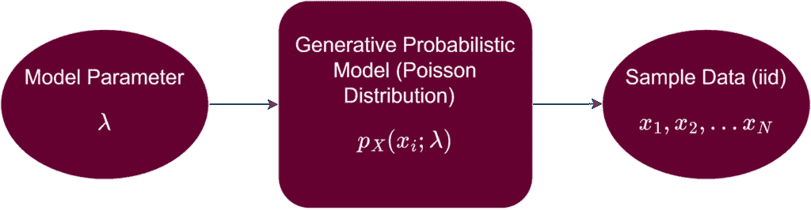

作者生成的图像

在这个特定的例子中，假设数据是由均值为λ = 5 的泊松分布生成的，如图下蓝色曲线所示。换句话说，我们假设我们知道λ的真实值，这通常是不知的，需要从数据中估计出来。

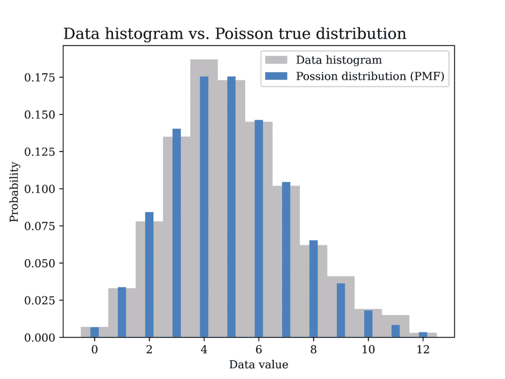

作者生成的图像

与之前的方法不同，我们不得不计算每分钟呼叫次数的相对频率（例如，本例中需要估计 12 个值，如上图灰色部分所示），现在我们只有一个参数，即λ，我们旨在找到它。这种生成模型方法的另一个优点是它在从样本到总体的泛化方面表现更好。假设的概率分布可以说以一种优雅的方式总结了数据，遵循奥卡姆剃刀原则。

在进一步探讨我们如何寻找参数λ之前，让我们首先展示一些用于生成上述图的 Python 代码。

```py
# Import the Python libraries that we will need in this article
import pandas as pd
import matplotlib.pyplot as plt
import numpy as np
import seaborn as sns
import math
from scipy import stats

# Poisson distribution example
lambda_ = 5
sample_size = 1000
data_poisson = stats.poisson.rvs(lambda_,size= sample_size) # generate data

# Plot the data histogram vs the PMF
x1 = np.arange(data_poisson.min(), data_poisson.max(), 1)
fig1, ax = plt.subplots()
plt.bar(x1, stats.poisson.pmf(x1,lambda_),
        label="Possion distribution (PMF)",color = BLUE2,linewidth=3.0,width=0.3,zorder=2)
ax.hist(data_poisson, bins=x1.size, density=True, label="Data histogram",color = GRAY9, width=1,zorder=1,align='left')

ax.set_title("Data histogram vs. Poisson true distribution", fontsize=14, loc='left')
ax.set_xlabel('Data value')
ax.set_ylabel('Probability')
ax.legend()
plt.savefig("Possion_hist_PMF.png", format="png", dpi=800)
```

我们现在的问题是使用我们收集到的数据估计未知参数λ的值。这就是我们将使用本文标题中出现的*矩法(MoM)*方法的地方。

首先，我们需要定义随机变量的矩是什么意思。从数学上讲，离散随机变量(X)的第 k 个矩定义为以下：

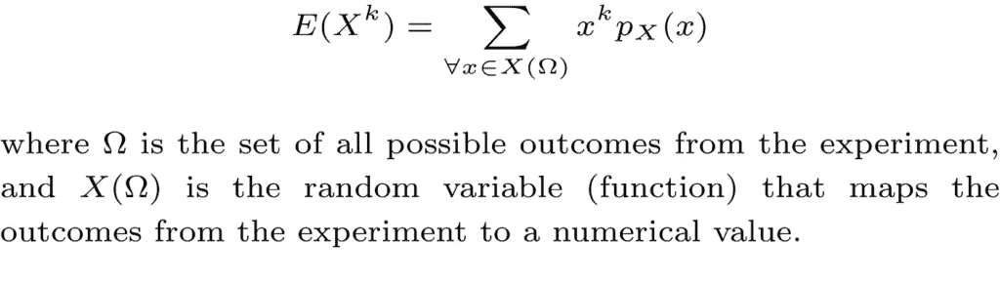

以第一矩 E(X)为例，它也是随机变量的均值μ，假设我们收集的数据是随机变量 X 的 N 个独立同分布(N iid)实现。μ的合理估计是样本均值，其定义如下：

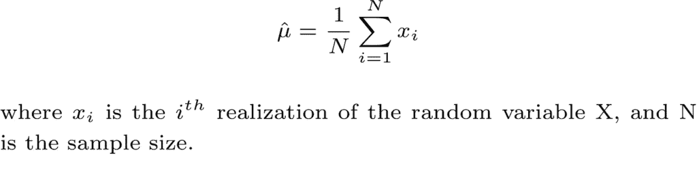

因此，为了获得一个 MoM 估计，该估计参数化随机变量 X 的概率分布，我们首先将未知参数表示为随机变量第 k 个矩的一个或多个函数，然后将第 k 个矩替换为其样本估计。我们模型中的未知参数越多，我们需要的矩就越多。

在我们的泊松模型示例中，这很简单，如下所示。

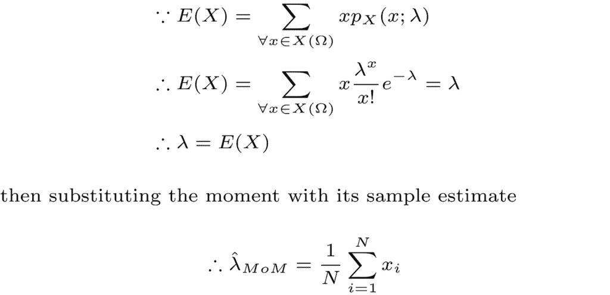

在下一部分，我们将在之前生成的模拟数据上测试我们的 MoM 估计器。以下代码用于获取估计器和使用估计参数绘制相应概率分布。

```py
# Method of moments estimator using the data (Poisson Dist)
lambda_hat = sum(data_poisson) / len(data_poisson)

# Plot the MoM estimated PMF vs the true PMF
x1 = np.arange(data_poisson.min(), data_poisson.max(), 1)
fig2, ax = plt.subplots()
plt.bar(x1, stats.poisson.pmf(x1,lambda_hat),
        label="Estimated PMF",color = ORANGE1,linewidth=3.0,width=0.3)
plt.bar(x1+0.3, stats.poisson.pmf(x1,lambda_),
        label="True PMF",color = BLUE2,linewidth=3.0,width=0.3)

ax.set_title("Estimated Poisson distribution vs. true distribution", fontsize=14, loc='left')
ax.set_xlabel('Data value')
ax.set_ylabel('Probability')
ax.legend()
#ax.grid()
plt.savefig("Possion_true_vs_est.png", format="png", dpi=800)
```

下图显示了估计分布与真实分布的比较。分布非常接近，表明 MoM 估计器是我们问题的合理估计器。事实上，在 MoM 估计器中将期望值替换为平均值意味着根据大数定律，估计器是一致的估计器，这是使用此类估计器的好理由。

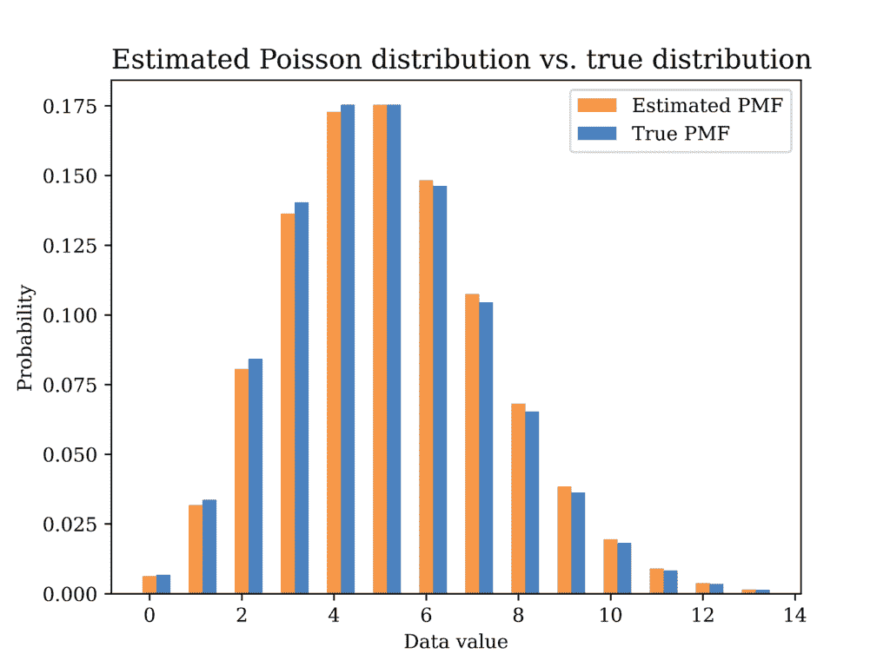

由作者生成的图像

另一个 MoM 估计示例如下，假设独立同分布的数据是由均值为 μ 和方差 σ² 的正态分布生成的，如下所示。

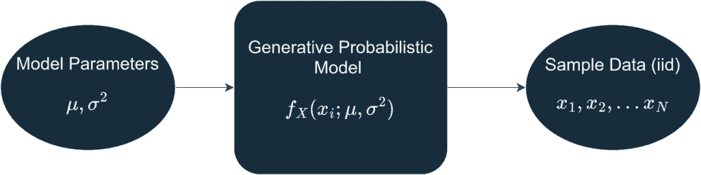

由作者生成的图像

在这个特定的例子中，假设数据是由均值为 μ = 10 和标准差 σ = 2 的高斯（正态）分布生成的。生成的数据样本（样本大小 = 1000）的直方图在下面的图形中以灰色显示，而真实分布以蓝色曲线显示。

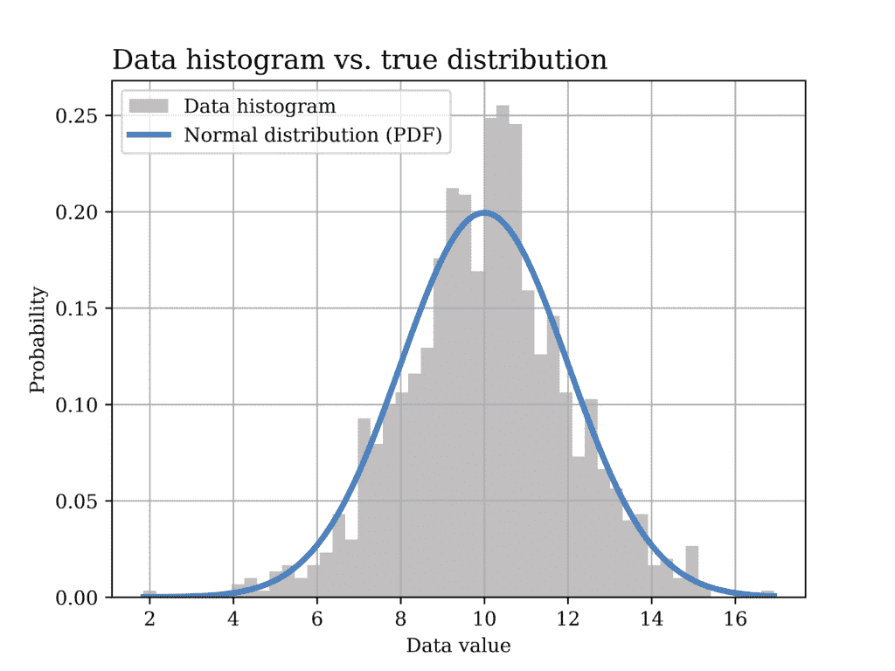

由作者生成的图像

生成上述图形所使用的 Python 代码如下所示。

```py
# Normal distribution example
mu = 10
sigma = 2
sample_size = 1000
data_normal = stats.norm.rvs(loc=mu, scale=sigma ,size= sample_size) # generate data

# Plot the data histogram vs the PDF
x2 = np.linspace(data_normal.min(), data_normal.max(), sample_size)
fig3, ax = plt.subplots()
ax.hist(data_normal, bins=50, density=True, label="Data histogram",color = GRAY9)
ax.plot(x2, stats.norm(loc=mu, scale=sigma).pdf(x2),
        label="Normal distribution (PDF)",color = BLUE2,linewidth=3.0)

ax.set_title("Data histogram vs. true distribution", fontsize=14, loc='left')
ax.set_xlabel('Data value')
ax.set_ylabel('Probability')
ax.legend()
ax.grid()

plt.savefig("Normal_hist_PMF.png", format="png", dpi=800)
```

现在，我们希望使用 MoM 估计器找到模型参数的估计值，即 μ 和 σ²，如下所示。

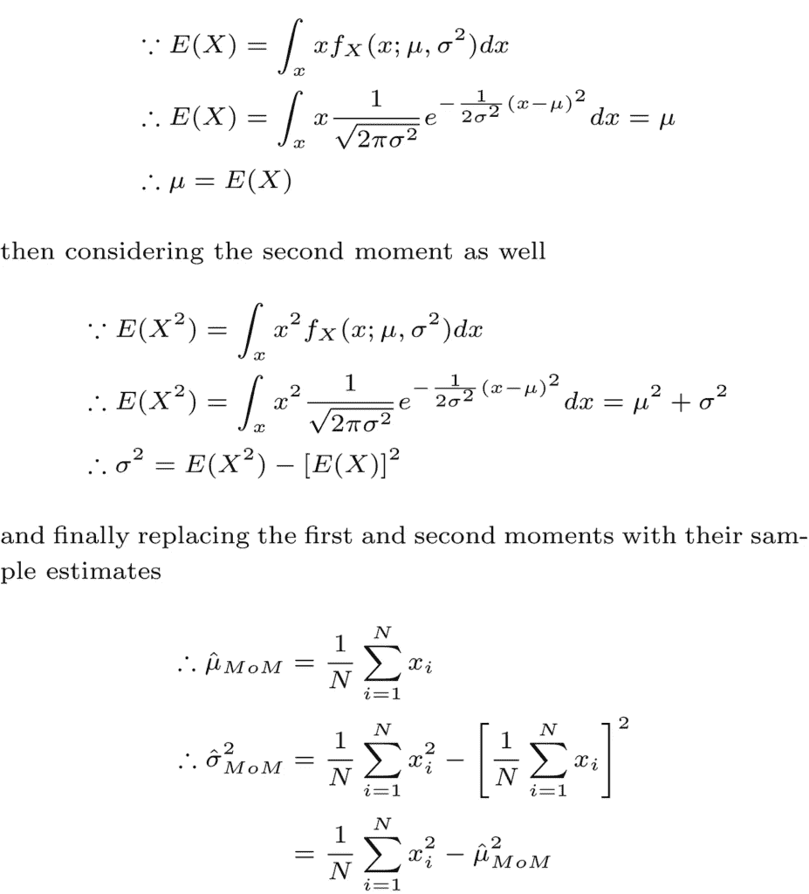

为了使用我们的样本数据测试这个估计器，我们在下面的图形中绘制了具有估计参数（橙色）的分布，与真实分布（蓝色）进行比较。再次，可以看出这两个分布非常接近。当然，为了量化这个估计器，我们需要在多个数据实现上测试它，并观察偏差、方差等属性。这些重要方面[已在之前的文章中讨论过](https://medium.com/@mahmoudabdelaziz_67006/bias-variance-tradeoff-in-parameter-estimation-with-python-code-74e531092c6e)。

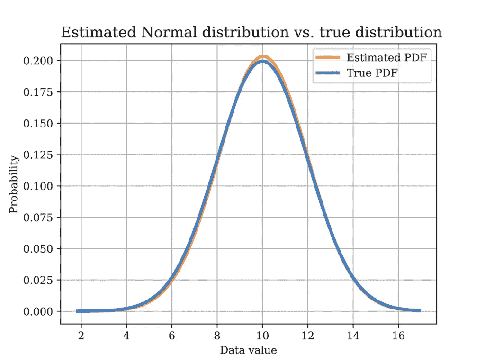

由作者生成的图像

以下代码展示了使用 MoM 方法估计模型参数并绘制上述图形所使用的 Python 代码。

```py
# Method of moments estimator using the data (Normal Dist)
mu_hat = sum(data_normal) / len(data_normal) # MoM mean estimator
var_hat = sum(pow(x-mu_hat,2) for x in data_normal) / len(data_normal) # variance
sigma_hat = math.sqrt(var_hat)  # MoM standard deviation estimator

# Plot the MoM estimated PDF vs the true PDF
x2 = np.linspace(data_normal.min(), data_normal.max(), sample_size)
fig4, ax = plt.subplots()
ax.plot(x2, stats.norm(loc=mu_hat, scale=sigma_hat).pdf(x2),
        label="Estimated PDF",color = ORANGE1,linewidth=3.0)
ax.plot(x2, stats.norm(loc=mu, scale=sigma).pdf(x2),
        label="True PDF",color = BLUE2,linewidth=3.0)

ax.set_title("Estimated Normal distribution vs. true distribution", fontsize=14, loc='left')
ax.set_xlabel('Data value')
ax.set_ylabel('Probability')
ax.legend()
ax.grid()
plt.savefig("Normal_true_vs_est.png", format="png", dpi=800)
```

另一个有用的概率分布是伽马分布。在之前的[文章](https://medium.com/python-in-plain-english/univariate-statistical-modeling-fundamentals-0b178fbe8686)中讨论了该分布在实际生活中的应用示例。然而，在这篇文章中，我们推导了伽马分布参数 α 和 β 的 MoM 估计器，如下所示，假设数据是独立同分布的。

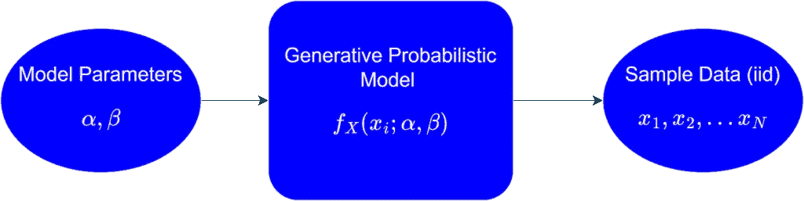

由作者生成的图像

在这个特定的例子中，假设数据是由 α = 6 和 β = 0.5 的伽马分布生成的。生成的数据样本（样本大小 = 1000）的直方图在下面的图形中以灰色显示，而真实分布以蓝色曲线显示。

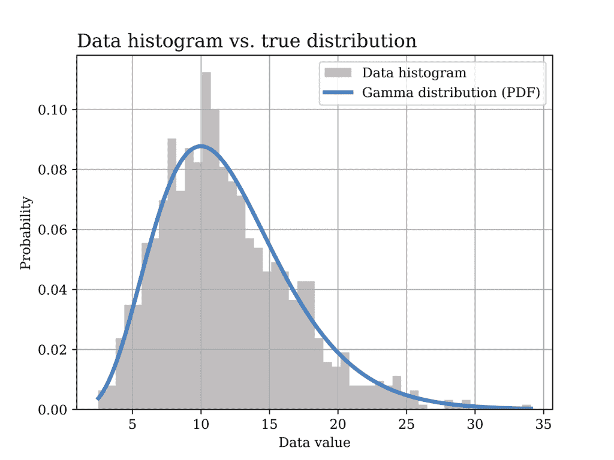

由作者生成的图像

生成上述图形所使用的 Python 代码如下所示。

```py
# Gamma distribution example
alpha_ = 6 # shape parameter
scale_ = 2 # scale paramter (lamda) = 1/beta in gamma dist.
sample_size = 1000
data_gamma = stats.gamma.rvs(alpha_,loc=0, scale=scale_ ,size= sample_size) # generate data

# Plot the data histogram vs the PDF
x3 = np.linspace(data_gamma.min(), data_gamma.max(), sample_size)
fig5, ax = plt.subplots()
ax.hist(data_gamma, bins=50, density=True, label="Data histogram",color = GRAY9)
ax.plot(x3, stats.gamma(alpha_,loc=0, scale=scale_).pdf(x3),
        label="Gamma distribution (PDF)",color = BLUE2,linewidth=3.0)

ax.set_title("Data histogram vs. true distribution", fontsize=14, loc='left')
ax.set_xlabel('Data value')
ax.set_ylabel('Probability')
ax.legend()
ax.grid()
plt.savefig("Gamma_hist_PMF.png", format="png", dpi=800)
```

现在，我们希望使用 MoM 估计器找到模型参数的估计值，即 α 和 β，如下所示。

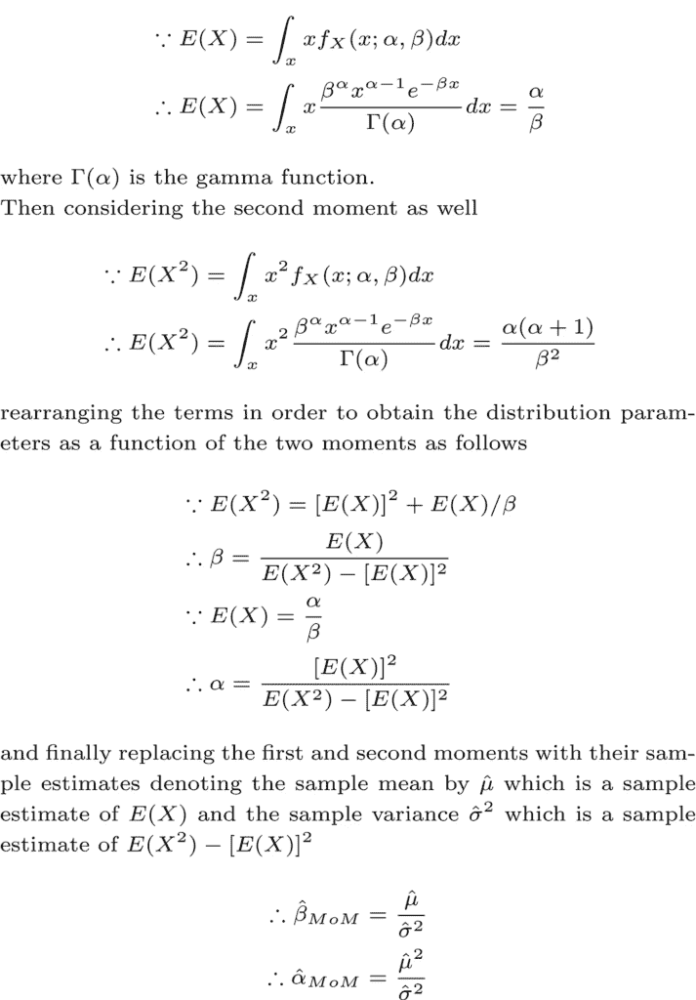

为了使用我们的样本数据测试这个估计器，我们在下面的图形中绘制了具有估计参数（橙色）的分布，与真实分布（蓝色）进行比较。再次，可以看出这两个分布非常接近。

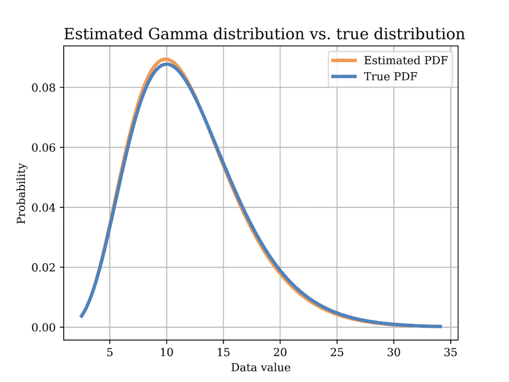

由作者生成的图像

下面展示了用于使用 MoM 估计模型参数并绘制上述图形的 Python 代码。

```py
# Method of moments estimator using the data (Gamma Dist)
sample_mean = data_gamma.mean()
sample_var = data_gamma.var()
scale_hat = sample_var/sample_mean #scale is equal to 1/beta in gamma dist.
alpha_hat = sample_mean**2/sample_var

# Plot the MoM estimated PDF vs the true PDF
x4 = np.linspace(data_gamma.min(), data_gamma.max(), sample_size)
fig6, ax = plt.subplots()

ax.plot(x4, stats.gamma(alpha_hat,loc=0, scale=scale_hat).pdf(x4),
        label="Estimated PDF",color = ORANGE1,linewidth=3.0)
ax.plot(x4, stats.gamma(alpha_,loc=0, scale=scale_).pdf(x4),
        label="True PDF",color = BLUE2,linewidth=3.0)

ax.set_title("Estimated Gamma distribution vs. true distribution", fontsize=14, loc='left')
ax.set_xlabel('Data value')
ax.set_ylabel('Probability')
ax.legend()
ax.grid()
plt.savefig("Gamma_true_vs_est.png", format="png", dpi=800)
```

注意，在推导高斯分布和伽马分布情况下的估计器时，我们使用了以下等价的方差表示方法。

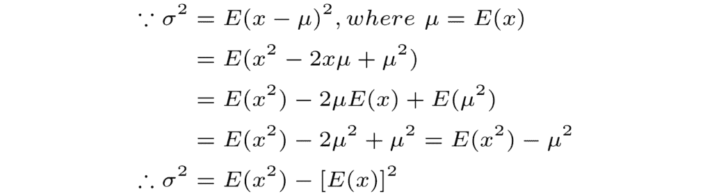

## 结论

在本文中，我们探讨了矩估计法在不同数据科学问题中的应用实例。此外，还展示了用于从头实现估计器和绘制不同图形的详细 Python 代码。希望这篇文章对您有所帮助。
