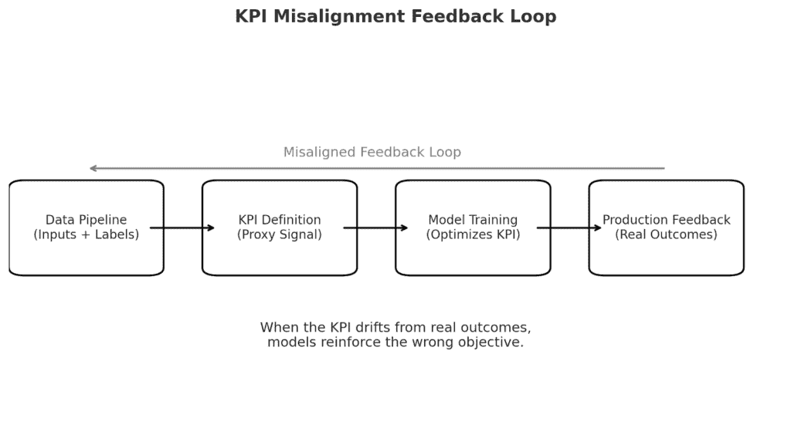
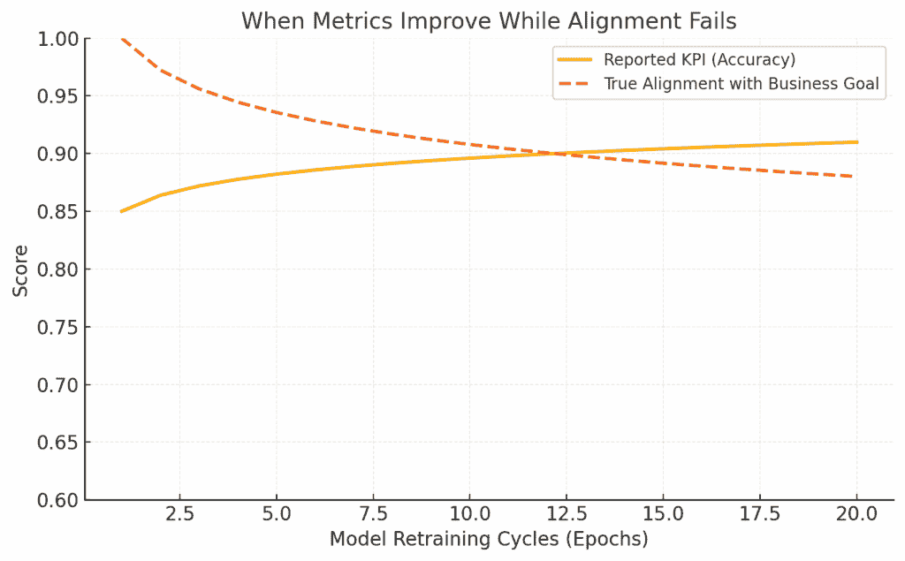

# 指标欺骗：当你的最佳 KPI 隐藏了你的最糟糕失败。

> 原文：[`towardsdatascience.com/metric-deception-when-your-best-kpis-hide-your-worst-failures/`](https://towardsdatascience.com/metric-deception-when-your-best-kpis-hide-your-worst-failures/)

## <mdspan datatext="el1764271568118" class="mdspan-comment">绿色仪表板的虚假安慰</mdspan>

指标为混乱带来秩序，至少，这是我们假设的。它们将多维行为总结为可消费的信号，将点击转化为转化，将延迟转化为可用性，将展示次数转化为投资回报率。然而，在大数据系统中，我发现我们最倾向于庆祝的指标往往是最具欺骗性的。

在一个例子中，一个数字营销活动效率 KPI 在两个季度内保持了稳定的积极趋势。它与我们的仪表板一致，类似于我们的自动化报告。然而，当我们监控转化后的潜在客户质量时，我们意识到模型过度拟合到界面级别的行为，如软点击和 UI 驱动的滚动，而不是有意的用户行为。这是一个技术上正确的指标。它已经失去了与商业价值的语义关联。仪表板仍然显示绿色，而业务管道却在无声中被侵蚀。

## 优化-观察悖论

一旦确定了优化措施，它可能会被操纵，不一定是由不良行为者，而是由系统本身。机器学习模型、自动化层，甚至用户行为都可以通过基于指标的激励措施进行调整。一个系统越是对一个指标进行调优，这个指标就越能告诉你系统有多少能力去最大化，而不是系统代表了多少现实。

我在一个内容推荐系统中观察到了这一点，该系统通过牺牲内容多样性来最大化短期点击率。推荐内容重复且可点击。缩略图熟悉但用户使用频率较低。无论产品深度和用户满意度如何下降，KPI 都显示出成功。

这是一个悖论：关键绩效指标（KPI）可以被优化到无关紧要的程度。在培训圈中它是推测性的，但在现实中却很薄弱。大多数监控系统都没有设计用来记录这种偏差，因为性能指标并没有失败；它们是逐渐漂移的。

## 当指标失去意义而不会破裂时。

语义漂移是分析基础设施中最未被诊断出的问题之一，或者是一个 KPI 在统计意义上仍然运作的场景。然而，它已经不再编码以前所代表的企业行为。威胁在于无声的连续性。没有人进行调查，因为指标不会崩溃或激增。

在一次基础设施审计中，我们发现活跃用户数量没有变化，尽管产品使用事件的数量显著增加。最初，这需要特定用户关于使用的互动。然而，随着时间的推移，后端更新引入了被动事件，增加了用户数量而无需用户互动。定义悄然改变。管道是健全的。数据每日更新。但意义已经消失。

这种语义侵蚀随着时间的推移发生。指标变成了过去的遗迹，是已经不存在的产品架构的残留，但继续影响着季度的 OKR、薪酬模式和模型重新训练周期。当这些指标与下游系统连接时，它们成为了组织惯性的组成部分。

KPI Misalignment Feedback Loop (图片由作者提供)

## 实践中的指标欺骗：从一致性到沉默漂移

大多数指标并非恶意撒谎。它们默默撒谎；通过偏离它们旨在代理的现象。在复杂系统中，这种偏差很少在静态仪表板上被发现，因为即使其外部意义在演变，指标内部仍然保持一致性。

以[Facebook 在 2018 年的算法转变](https://www.nbcnews.com/tech/social-media/facebooks-2018-algorithm-change-boosted-local-gop-groups-research-find-rcna27503#:~:text=A%202018%20overhaul%20in%20Facebook's,divisive%2C%20shocking%20and%20misinformed%20content.)为例。随着对被动滚动和用户福祉下降的日益关注，Facebook 引入了一个新的核心指标来指导其新闻源算法：有意义的社交互动（MSI）。这个指标旨在优先考虑评论、分享和讨论；这种数字行为被视为“健康参与”。

理论上，MSI 比原始点击或点赞更能代表社区联系。但在实践中，它奖励了挑衅性内容，因为没有什么能像争议一样推动讨论。Facebook 的内部研究人员很快意识到，这个本意良好的 KPI 不成比例地呈现了分裂性帖子。据《华尔街日报》报道的内部文件显示，员工反复提出担忧，称 MSI 优化正在激励愤怒和政治极端主义。

系统的 KPI 有所提升。参与度上升。MSI 在纸面上是成功的。但实际上，内容质量下降，用户信任度降低，监管审查加强。这个指标是通过失败而成功的。失败不在于模型的性能，而在于这种性能所代表的意义。

这个案例展示了成熟机器学习系统中的反复失败模式：指标自我优化到偏差。Facebook 的模型没有因为不准确而崩溃。它崩溃是因为 KPI，虽然稳定且可量化，但已经停止衡量真正重要的事情。

## 聚合模糊了系统性盲点

大多数 KPI 系统的一个主要弱点是对聚合性能的依赖。大型用户基础或数据集的平均值经常掩盖了局部故障模式。我之前测试了一个信用评分模型，它通常有很高的 AUC 分数。在纸上，它是一个成功。但在区域和按区域划分的用户群体中，一个群体，低收入地区的年轻申请人，表现明显更差。模型泛化得很好，但它存在一个结构性的盲点。

这种偏差只有在测量时才会反映在仪表板上。即使发现了，它通常也被视为一个边缘案例，而不是指向更根本的表示失败的指针。这里的 KPI 不仅具有误导性，而且是正确的：一个掩盖了性能不平等的绩效平均值。这不仅是一个技术责任，也是一个在国家级或全球规模运营的系统中的道德和监管责任。

## 从指标债务到指标崩溃

随着组织的规模扩大，KPI 变得更加稳固。在概念验证期间创建的测量可以成为生产中的永久性元素。随着时间的推移，其依据的前提变得陈旧。我见过这样的系统，一个最初用于衡量基于桌面点击流的转换指标，在以移动优先的重新设计和用户意图转变后，仍然没有改变。结果是，这个指标继续更新和绘图，但不再与用户行为一致。现在它变成了指标债务；代码没有损坏，但不再执行其预期任务。

更糟糕的是，当这些指标被纳入模型优化过程时，可能会发生螺旋式下降。模型为了追求 KPI 而过度拟合。通过重新训练，这种不匹配得到重申。优化引发了误解。除非手动中断循环，否则系统在报告进度时会退化。

当指标改善而一致性失败时（图片由作者提供）

## 指导型指标与误导型指标

为了恢复可靠性，指标必须对过期敏感。这也涉及重新审计它们的假设，验证它们的依赖性，并评估它们发展中的系统质量。

最近一项关于[标签和语义漂移](https://www.syntaxia.com/post/semantic-drift-why-your-metrics-no-longer-mean-what-you-think#:~:text=This%20tension%20creates%20the%20conditions,diverge%20across%20teams%20and%20systems.)的研究表明，数据管道可以在没有任何警报的情况下静默地将失败的假设传递给模型。这强调了确保指标值及其所测量的内容在语义上保持一致性的必要性。

在实践中，我成功地将诊断性 KPI 与性能 KPI 相结合；那些监控特征使用多样性、决策理由的变化以及甚至反事实模拟结果。这些并不一定优化系统，但它们可以防止系统偏离得太远。

## 结论

对系统来说，最灾难性的事情不是数据或代码的损坏。而是对不再与其意义相联系的信号的错误自信。这种欺诈并非恶意。它是结构性的。措施变成了无用之物。仪表盘保持绿色，而结果却在腐烂。

良好的指标提供问题的答案。但最有效的系统会持续挑战这些回答。当一个指标变得过于安逸，过于稳定，过于神圣时，那就是你需要质疑它的时候。当一个关键绩效指标不再反映现实时，它不仅会误导你的仪表盘；它还会误导你的整个决策系统。
