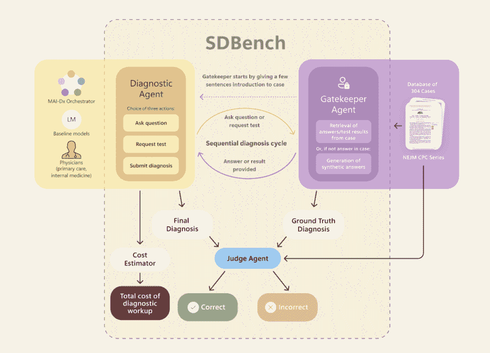
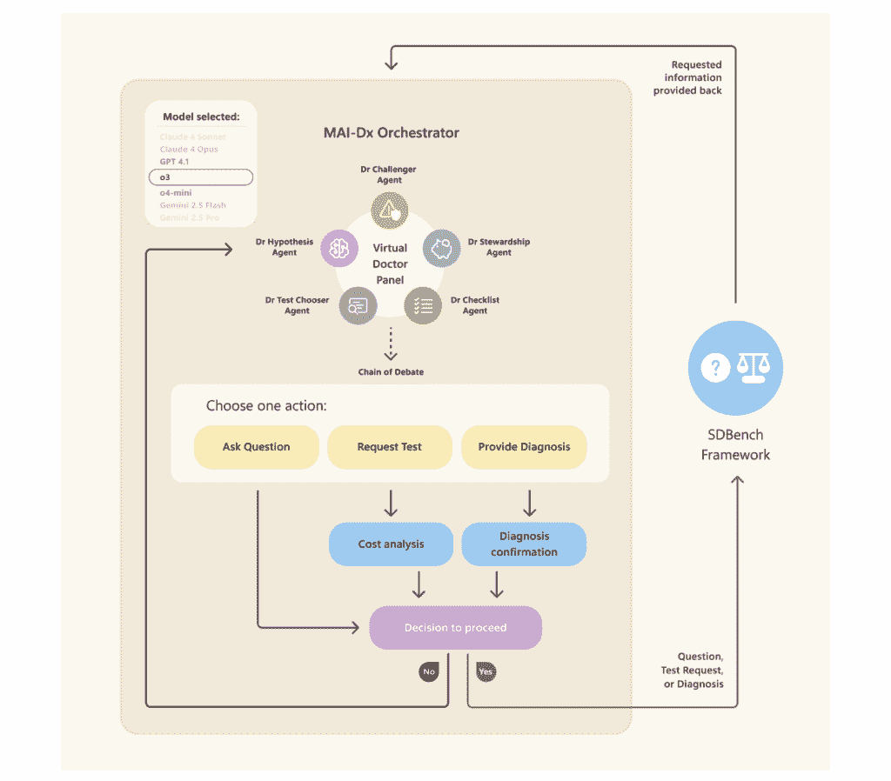
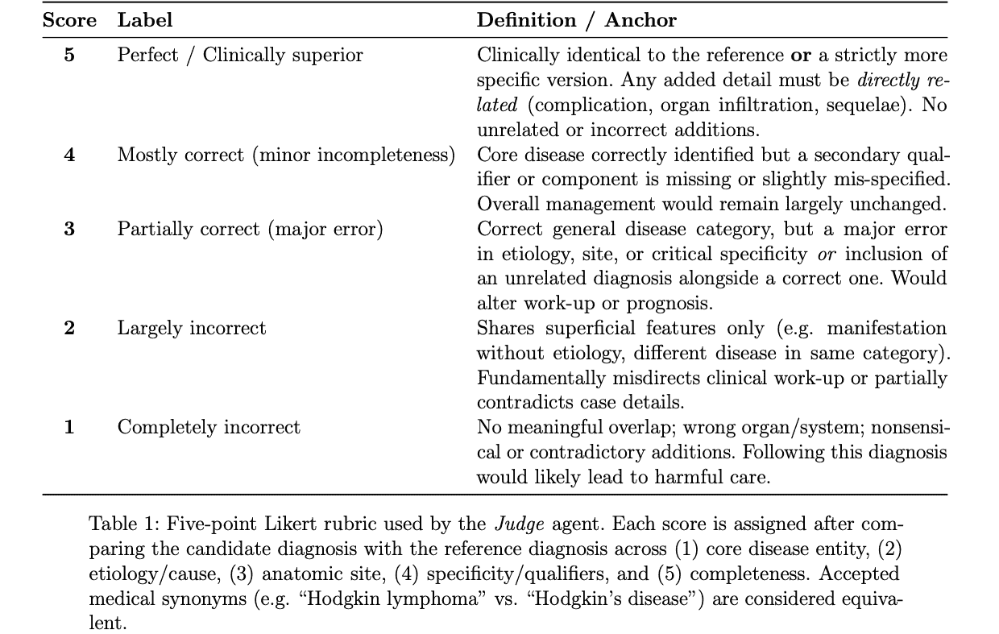
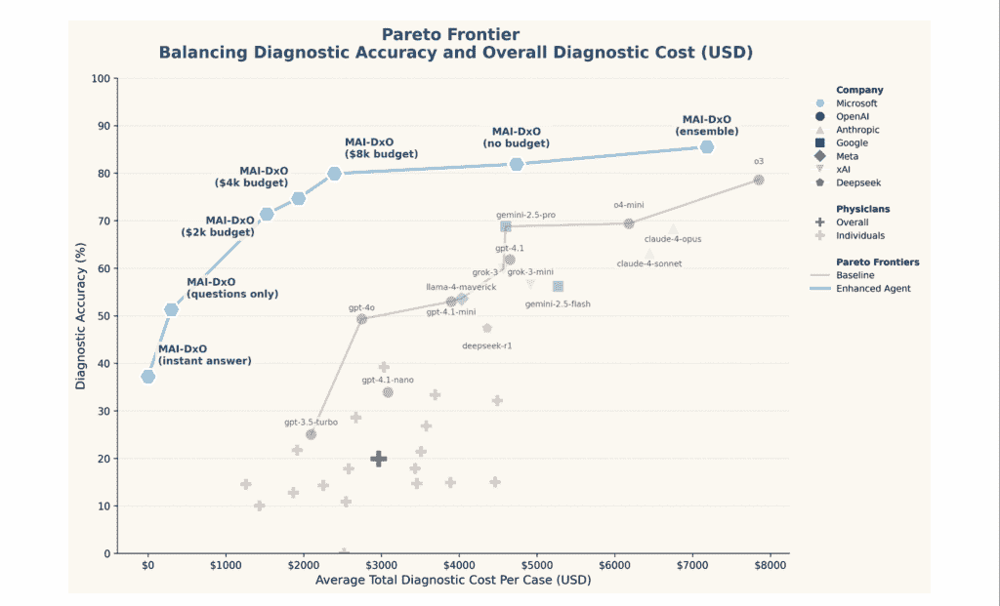

# 微软革命性的诊断医疗人工智能，解析

> 原文：[`towardsdatascience.com/microsofts-revolutionary-diagnostic-medical-ai-explained/`](https://towardsdatascience.com/microsofts-revolutionary-diagnostic-medical-ai-explained/)

<mdspan datatext="el1751937245680" class="mdspan-comment">上周</mdspan>，微软发布了其最新的医疗人工智能论文，*基于语言模型的顺序诊断*，并显示出巨大的潜力。他们将其称为“通往医疗超级智能的道路”。医生会被人工智能超越吗？这真的是我们领域的一次革命性进步吗？尽管这篇论文刚刚提交审查，可能还需要额外的实验，但本文将概述论文的主要观点，并提供一些讨论和论文的局限性。

整体标题令人瞩目：一种将 AI 诊断性能提高到 80%的方法（使用微软的新 SDBench 指标）。但让我们看看这是如何发生的。

对于论文的简要总结，研究人员基于临床案例创建了一个新的基准，称为 SDBench。与大多数情况不同，性能基于诊断准确性和达到诊断的总成本。这不是一个新的 AI 模型，而是一个名为**MAI-DxO**（我们稍后会进一步讨论）的 MAI 诊断编排器。这种 AI 编排器是模型无关的，进行了许多实验变体以获得成本-准确度帕累托前沿。最终结果引用了医生在 20%的准确度上，而 MAI-DxO 在 80%的准确度上。然而，这些百分比并不一定能说明整个故事。

## 什么是顺序诊断？

首先，这篇论文的标题是*基于语言模型的顺序诊断*。那么它究竟是什么呢？当患者到达医生那里时，他们需要复述他们的病史，为医生提供背景信息。通过迭代提问和测试，医生可以缩小诊断的假设。论文引用了在顺序诊断过程中考虑的几个因素，这些因素后来在开发中发挥了作用：信息性提问、平衡诊断产量和成本与患者负担，以及知道何时做出自信的诊断[1]。

## SDBench

顺序诊断基准是微软研究团队引入的一个新基准。在本文之前，大多数医疗基准涉及多项选择题和答案。谷歌在开发其医疗 LLM MeD-PaLM 2 时，著名地使用了 MedQA，它包含美国医学执照考试（USMLE）风格的题目，你可能还记得 MeD-PaLM 最初作为医疗 LLM 通过 USMLE[2]时的头条新闻。这种问答基准似乎很合适，因为医生通过 USMLE 多项选择题获得执照。然而，有人认为这些问题测试的是某种程度的记忆，而不是深层次的理解。在 LLM 以记忆著称的时代，这并不一定是最好的基准。

为了应对这一点，SDBench 结合了 2017 年至 2025 年间发表的 304 个《新英格兰医学杂志》（NEJM）临床病理学会议（CPC）案例 [1]。它旨在模拟人类医生进行诊断所采取的迭代过程。在这些场景中，AI 模型（或人类医生）从患者的原始病史开始，必须迭代地做出决策，以缩小诊断范围。在这种情况下，决策模型被称为**诊断代理**，而揭示信息的模型被称为**守门人代理**。我们将在下一节中进一步讨论这些代理。

SDBench 的另一个新颖之处在于考虑成本。每个诊断在无限资金和资源以及无限测试的情况下可能会更加准确，但这并不现实。因此，每个提出的问题和下达的测试都会产生模拟的财务成本，反映了使用当前操作术语（CPT）代码的现实世界医疗保健经济学。这意味着 AI 性能不仅在其诊断准确性（将其最终诊断与 NEJM 的黄金标准进行比较）上得到评估，而且在其以成本效益的方式实现该诊断的能力上得到评估。

#### 使用 SDBench 评估诊断

自然会出现的疑问是，“这些诊断在 SD Bench 框架内是如何进行正确性评估的？” 这并不简单，因为疾病往往有多种名称，直接字符串匹配不可靠。为了解决这个问题，微软研究人员创建了一个**裁判代理**。

SDBench 中刚刚描述的所有内容的完整图表如图 1 所示。

图 1：SDBench 图表。来源 [1]

## 代理和 AI

需要记住的最重要的事情是 MAI-DxO 是模型无关的。它是一个 AI 协调器。或许不是一个广为人知的术语，但微软为我们定义了它。“在生成式 AI 的背景下，协调器就像一个数字指挥家，帮助协调实现复杂任务的多步骤。在医疗保健领域，鉴于每个决策的高风险，协调的作用至关重要” [3]。因此，任何模型都可以作为代理使用。这很好，因为每当出现新的模型时，系统就不会过时。MAI-DxO 的完整图表如图 3 所示。

图 3：MAI-DxO 图表。来源 [1]

之前提到，存在 3 个代理：诊断代理、守门人代理和裁判代理。思考诊断代理和守门人代理作为某种生成对抗网络（GAN）的功能，其中诊断代理试图改进，同时受到守门人信息的限制，这很有趣。让我们进一步研究这些代理。

#### 诊断代理

对于诊断代理，语言模型同时协调 5 个不同的部分。不知道每个角色是如何训练的，但很可能有一个专门组件或针对该任务的微调 LLM。以下是 5 个角色：

+   **假设博士** – 包含序列诊断中每个步骤最有可能的 3 个诊断

+   **测试选择者博士** – 在每个时间步选择 3 项诊断测试，以尝试区分诊断假设

+   **查林杰博士** – 作为魔鬼的代言人，试图破坏诊断的当前假设

+   ** stewardship 博士** – 通过最小化成本同时最大化诊断产出，关注成本

+   **清单博士** – 对整个诊断代理进行质量控制，确保结果有效和一致

在序列诊断的每个时间步之后，5 面板诊断代理必须就 3 个决策中的 1 个达成一致：提问、订购诊断测试或产生最终诊断。最终诊断基于代理可以达到的置信度阈值。还有一个可选的预算跟踪器，如果代理想考虑成本的话。

#### 守门人代理

守门人代理使用 ChatGPT o4-mini 实现。代理的指南和回应由医生创建和指导。这意味着守门人不会透露比实际患者或诊断测试更多的信息。论文引用了教育案例报告中可能存在事后诸葛亮偏差，但代理旨在防止这种情况。

系统中最初存在的偏见是诊断代理会提示信息，而这些信息在案例中并不存在。当守门人返回“未响应”时，诊断代理会获得提示。这可以与 GAN 中的模式崩溃进行类似比较，其中生成器可以欺骗对抗网络。为了纠正这一点，守门人将基于查询/测试最有可能产生的结果返回合成数据。

#### 法官代理

法官代理是基于 ChatGPT 的 o3 模型实现的，并遵循图 2 中所示的标准，但它是基于 OpenAI 在 2025 年 5 月介绍的 HealthBench [4]。研究人员表示，要算作正确的诊断，法官代理必须评估至少 4 分的分数。

图 2：为法官代理创建的利克特量表。来源 [1]

为了确定法官代理是否正确地完成了其工作，诊断代理产生的诊断结果也由医生进行了评分。只有少数几个案例存在分歧，而在大多数这些案例中，法官被认为过于严格。

## 实验

在训练之前，数据集中最近 56 个案例被用于测试，其余的用于训练。就不同代理而言，微软测试了许多不同的基础模型：GPT-3.5-turbo、GPT-4o、GPT-4.1、GPT-4.1-mini、GPT-4.1-nano、o3、o4-mini、Claude 4 Sonnet、Claude 4 Opus、Gemini 2.5 Pro、Gemini 2.5 Flash、Grok-3、Grok-3-mini、Llama 4 Maverick 和 Deepseek-R1。

> 作为旁白，模型使用 XML 格式进行提示，这最近似乎是最有效的提示 LLM 的方式，与 JSON 提示一起。XML 格式似乎是 Claude 模型中最受欢迎的。

在测试 SDBench 的准确性和成本结果时，进行了 5 种主要变体的实验：

+   **即时回答**– 诊断必须仅从患者的初始表现中产生（不允许后续问题/测试）

+   **仅提问**– 诊断代理可以提问但不能订购测试

+   **预算制**– 实施了一个预算系统，一旦看到成本，就可以取消测试

+   **无预算**– 正如它看起来那样。没有预算考虑

+   **集成**– 类似于并行运行多个诊断代理面板的模型集成

每个变体的性能将在结果中展示，但结果与传统机器学习中的不同数据分层、约束和模型集成相似。

## 结果

现在我们已经了解了论文的基础及其代理设置，我们可以看看结果。MAI-DxO 在其最终形式下，在集成时具有最佳的诊断准确性，如图 3 所示，它在给定预算下的准确性也是最佳的。所有提到的单个 LLM 都是仅将案例输入 LLM 并请求诊断的结果。

图 3：MAI-DxO 准确性和成本结果。来源 [1]

从这个图中可以看出，结果看起来非常令人印象深刻。帕累托前沿由 MAI-DxO 的结果定义。MAI-DxO 在诊断准确性和成本方面都优于其他模型和医生。这就是关于医生因 AI 的优越性而不再必要的重大新闻标题的来源。在类似的预算下，MAI-DxO 的准确性是样本医生的 4 倍。

论文展示了包含更多结果的几个图，但为了简单起见，这是展示的主要结果。其他结果包括 MAI-DxO 提升现有模型性能和显示模型并非纯粹记忆信息的帕累托前沿曲线。

## 这些结果有多好？

你可能想知道这些结果是否真的那么好。尽管这些令人惊叹的结果，研究人员在阐述他们的结果时做得很好，解释了系统存在的缺点。让我们回顾一下论文中解释的一些细微差别。

首先，患者摘要通常不会用 2-3 个简洁的句子来呈现。患者可能永远不会直接提出他们的主要投诉，他们的主要投诉可能不是真正的问题，他们可能在初步病史中谈论几分钟。如果 MAI-DxO 要用于实践，它需要训练来处理所有这些场景。患者并不总是知道他们怎么了或如何正确表达。

此外，论文提到，NEJM 案例中展示的是一些最具挑战性的案例。世界上许多顶尖的医生都无法解决这些案例。MAI-DxO 在这些案例上表现出色，但它们在占据许多医生职业生涯大部分时间的日常案例上的表现如何呢？AI 代理并不像我们这样思考。仅仅因为他们能解决难题，并不意味着他们能解决简单的难题。还有更多因素，如测试等待时间和患者舒适度，这些因素也会影响诊断。需要更多结果来证明这一点。

医生的 20%准确率也有点误导。论文在局限性部分很好地讨论了这个问题。医生在处理案例时不允许使用互联网。我们有多少次在学校听到，在现实生活中我们总能使用互联网？即使是医生也需要查找信息。有了搜索引擎，医生在案例上的得分可能会更高。

在论文的早期部分，我们讨论了守门人代理生成合成数据以防止诊断代理获得提示。这些合成数据的质量需要进一步检验。由于我们实际上不知道这些案例的人类结果，因此这些测试仍然有可能泄露提示。所有这些都要说明，这个系统可能不会泛化，因为诊断代理可能会因为其下令的不准确诊断测试的混淆结果而减慢速度。

## 那么，我们能从中得到什么启示？

在医疗保健 AI 的世界里，微软的 MAI-DxO 极具潜力。就在几年前，世界上会有 AI 代理的想法似乎很疯狂。现在，一个系统可以执行顺序医疗推理，并解决平衡成本和准确性的 NEJM 案例。

然而，这并非没有局限性。我们必须找到一个真正的黄金标准来比较医疗保健 AI 代理。如果每篇论文都以不同的方式衡量医生准确性，那么将很难判断 AI 实际上有多好。我们还需要确定诊断中最重要的因素。成本和准确性是否是仅有的两个因素，或者应该有更多因素？SDBench 似乎是一个正确的方向，用概念学习取代了记忆测试，但还有更多需要考虑。

新闻上到处都是的头条新闻不应该让你感到害怕。我们离医疗超级智能还有很长的路要走。即使一个伟大的系统被创造出来，也会随之而来多年的验证和监管批准。我们仍然处于智能的早期阶段，但 AI 确实有能力革命性地改变医学。

* * *

## 参考文献

[1] Nori, Harsha, 等人. “使用语言模型进行顺序诊断.” *arXiv:2506.22405v1* (2025 年 6 月).

[2] Singhal, Karan, 等人. “利用大型语言模型向专家级医学问答迈进.” *Nature Medicine* (2025 年 1 月).

[3] [`microsoft.ai/new/the-path-to-medical-superintelligence/`](https://microsoft.ai/new/the-path-to-medical-superintelligence/)

[4] Arora, Rahul, 等人. “HealthBench: 评估大型语言模型以改善人类健康.” *arXiv:2505.08775v1* (2025 年 5 月).
