# 从数据中挖掘规则

> 原文：[`towardsdatascience.com/mining-rules-from-data/`](https://towardsdatascience.com/mining-rules-from-data/)

<mdspan datatext="el1744217464415" class="mdspan-comment">工作中</mdspan>与产品合作时，我们可能会遇到需要引入一些“规则”的需求。让我通过实际例子来解释一下我所说的“规则”：

+   假设我们在产品中看到了大量的欺诈行为，我们希望限制特定客户群体的注册，以降低风险。例如，我们发现大多数欺诈者来自某些国家的特定用户代理和 IP 地址。

+   另一个选择是向客户发送优惠券，让他们在我们的在线商店中使用。然而，我们只想针对可能流失的客户进行处理，因为忠诚的用户无论如何都会回到产品上来。我们可能会发现，最可行的客户群体是那些加入时间不到一年且上个月消费减少了 30%以上的客户。

+   交易型业务通常有一群客户，他们正在亏损。例如，一位银行客户通过了验证，并定期联系客户支持（因此产生了注册和服务成本），但几乎不做任何交易（因此没有产生任何收入）。银行可能会为账户余额低于 1000 美元的客户引入小额月度订阅费，因为他们可能是不盈利的。

当然，在这些所有情况下，我们可能已经使用了一个复杂的机器学习模型，该模型会考虑所有因素并预测概率（无论是客户是否为欺诈者还是即将流失）。然而，在某些情况下，我们可能更喜欢仅使用一组静态规则，以下是一些原因：

+   **实施的速度和复杂性**。在生产环境中部署机器学习模型需要时间和精力。如果你现在正经历欺诈浪潮，那么立即上线一组可以快速实施的静态规则可能更加可行，然后可以着手解决全面解决方案。

+   **可解释性**。机器学习模型是黑盒。尽管我们可能能够从高层次上理解它们是如何工作的以及哪些特征是最重要的，但向客户解释它们是具有挑战性的。在非盈利客户订阅费示例中，与客户分享一组透明的规则很重要，这样他们就可以理解定价。

+   **合规性**。某些行业，如金融或医疗保健，可能需要可审计和基于规则的决策来满足合规要求。

在这篇文章中，我想向你展示我们如何使用这些规则来解决业务问题。我们将用一个实际例子深入探讨这个主题：

+   我们将讨论我们可以使用哪些模型从数据中挖掘这样的规则，

+   我们将从头开始构建决策树分类器，以了解它是如何工作的，

+   我们将拟合`sklearn`决策树分类器模型，从数据中提取规则，

+   我们将学习如何解析决策树结构以获取结果细分，

+   最后，我们将探索不同的类别编码选项，因为`sklearn`实现不支持分类变量。

我们有很多主题要讨论，所以让我们直接进入正题。

## 案例

如同往常，通过一个实际例子学习东西更容易。所以，让我们先讨论一下本文我们将要解决的问题。

我们将使用[银行营销](https://archive.ics.uci.edu/dataset/222/bank+marketing)数据集（<mdspan datatext="el1744217074911" class="mdspan-comment">CC BY 4.0 许可</mdspan>）。这个数据集包含了一家葡萄牙银行机构的直接营销活动数据。对于每个客户，我们知道很多特征以及他们是否订阅了定期存款（我们的目标）。

我们的业务目标是最大化转换次数（订阅）的数量，同时有限的运营资源。因此，我们不能联系整个用户群，我们希望用我们拥有的资源达到最佳结果。

第一步是查看数据。那么，让我们加载数据集。

```py
import pandas as pd
pd.set_option('display.max_colwidth', 5000)
pd.set_option('display.float_format', lambda x: '%.2f' % x)

df = pd.read_csv('bank-full.csv', sep = ';')
df = df.drop(['duration', 'campaign'], axis = 1)
# removed columns related to the current marketing campaign, 
# since they introduce data leakage

df.head()
```

我们对客户了解很多，包括个人信息（如工作类型或婚姻状况）以及他们的先前行为（如是否有贷款或他们的平均年度余额）。

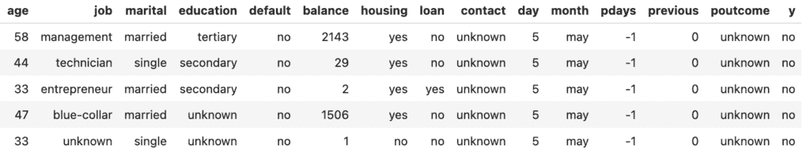

图片由作者提供

下一步是选择一个机器学习模型。当我们需要易于解释的模型时，通常有两种模型类别：

+   决策树，

+   线性或逻辑回归。

这两种选择都是可行的，并且可以给我们提供易于实现和解释的好模型。然而，在这篇文章中，我想要坚持使用决策树模型，因为它会产生实际的规则，而逻辑回归将给出特征加权求和的概率。

## 数据预处理

正如我们在数据中看到的，有很多分类变量（例如教育或婚姻状况）。不幸的是，`sklearn`决策树实现无法处理分类数据，因此我们需要进行一些预处理。

让我们从将是/否标志转换为整数开始。

```py
for p in ['default', 'housing', 'loan', 'y']:
    df[p] = df[p].map(lambda x: 1 if x == 'yes' else 0)
```

下一步是将`month`变量进行转换。我们可以对月份使用独热编码，引入如`month_jan`、`month_feb`等标志。然而，可能会有季节性影响，我认为将月份转换为整数（按照它们的顺序）会更合理。

```py
month_map = {
    'jan': 1, 'feb': 2, 'mar': 3, 'apr': 4, 'may': 5, 'jun': 6, 
    'jul': 7, 'aug': 8, 'sep': 9, 'oct': 10, 'nov': 11, 'dec': 12
}
# I saved 5 mins by asking ChatGPT to do this mapping

df['month'] = df.month.map(lambda x: month_map[x] if x in month_map else x)
```

对于所有其他分类变量，让我们使用独热编码。我们将在稍后讨论不同的类别编码策略，但现在让我们坚持默认方法。

进行独热编码最简单的方法是利用 pandas 中的`get_dummies` [函数](https://pandas.pydata.org/docs/reference/api/pandas.get_dummies.html)。

```py
fin_df = pd.get_dummies(
  df, columns=['job', 'marital', 'education', 'poutcome', 'contact'], 
  dtype = int, # to convert to flags 0/1
  drop_first = False # to keep all possible values
)
```

这个函数将每个分类变量转换成单独的 1/0 列，对应每个可能的值。我们可以看到它是如何为`poutcome`列工作的。

```py
fin_df.merge(df[['id', 'poutcome']])\
    .groupby(['poutcome', 'poutcome_unknown', 'poutcome_failure', 
      'poutcome_other', 'poutcome_success'], as_index = False).y.count()\
    .rename(columns = {'y': 'cases'})\
    .sort_values('cases', ascending = False)
```

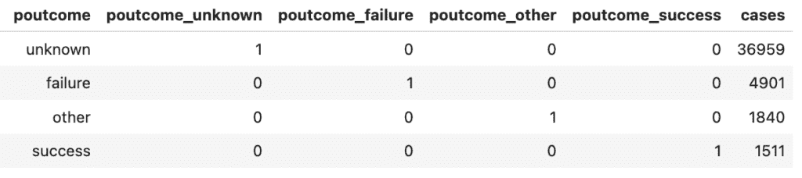

图片由作者提供

我们的数据现在已经准备好了，是时候讨论决策树分类器是如何工作的了。

## 决策树分类器：理论

在本节中，我们将探讨决策树分类器背后的理论，并从头开始构建算法。如果你对实际例子更感兴趣，可以直接跳到下一部分。

理解决策树模型的最简单方式是查看一个例子。所以，让我们基于我们的数据构建一个简单的模型。我们将使用 `sklearn` 中的 [DecisionTreeClassifier](https://scikit-learn.org/stable/modules/generated/sklearn.tree.DecisionTreeClassifier.html)。

```py
feature_names = fin_df.drop(['y'], axis = 1).columns
model = sklearn.tree.DecisionTreeClassifier(
  max_depth = 2, min_samples_leaf = 1000)
model.fit(fin_df[feature_names], fin_df['y'])
```

下一步是可视化树。

```py
dot_data = sklearn.tree.export_graphviz(
    model, out_file=None, feature_names = feature_names, filled = True, 
    proportion = True, precision = 2 
    # to show shares of classes instead of absolute numbers
)

graph = graphviz.Source(dot_data)
graph
```

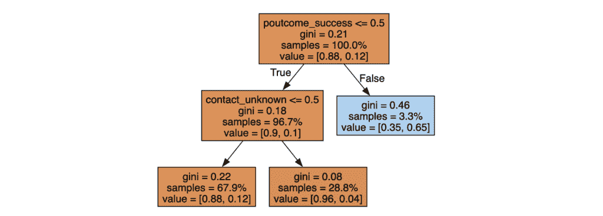

图片由作者提供

因此，我们可以看到模型很简单。它是一组我们可以用作启发式的二分分割。

让我们来了解一下分类器在底层是如何工作的。通常，理解模型的最佳方式是从头开始构建逻辑。

任何问题的基石是优化函数。在决策树分类器中，默认情况下，我们正在优化 [基尼系数](https://en.wikipedia.org/wiki/Gini_coefficient)。想象一下从样本中随机抽取一个项目，然后是另一个。基尼系数将等于这些项目来自不同类别的概率。因此，我们的目标将是最小化基尼系数。

在只有两个类别的情况下（比如在我们的例子中，营销干预要么成功，要么不成功），基尼系数仅由一个参数 `p` 定义，其中 `p` 是从其中一个类别获得一个项目的概率。以下是公式：

\[\textbf{gini}(\textsf{p}) = 1 – \textsf{p}² – (1 – \textsf{p})² = 2 * \textsf{p} * (1 – \textsf{p}) \]

如果我们的分类是理想的，并且我们能够完美地分离类别，那么基尼系数将等于 0。最坏的情况是当 `p = 0.5` 时，基尼系数也等于 0.5。

使用上述公式，我们可以计算树中每个叶子的基尼系数。为了计算整个树的基尼系数，我们需要组合二分分割的基尼系数。为此，我们可以简单地得到加权总和：

\[\textbf{gini}_{\textsf{total}} = \textbf{gini}_{\textsf{left}} * \frac{\textbf{n}_{\textsf{left}}}{\textbf{n}_{\textsf{left}} + \textbf{n}_{\textsf{right}}} + \textbf{gini}_{\textsf{right}} * \frac{\textbf{n}_{\textsf{right}}}{\textbf{n}_{\textsf{left}} + \textbf{n}_{\textsf{right}}}\]

既然我们已经知道了我们要优化的值，我们只需要定义所有可能的二分分割，遍历它们，并选择最佳选项。

定义所有可能的二分分割也很直接。我们可以逐个参数进行，排序可能的值，并选择它们之间的阈值。例如，对于月份（整数从 1 到 12）。

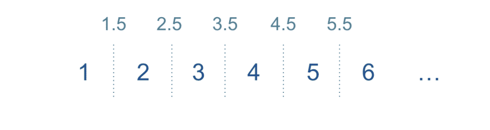

图片由作者提供

让我们尝试编写代码并看看我们是否会得到相同的结果。首先，我们将定义计算一个数据集和组合的 Gini 系数的函数。

```py
def get_gini(df):
    p = df.y.mean()
    return 2*p*(1-p)

print(get_gini(fin_df)) 
# 0.2065
# close to what we see at the root node of Decision Tree

def get_gini_comb(df1, df2):
    n1 = df1.shape[0]
    n2 = df2.shape[0]

    gini1 = get_gini(df1)
    gini2 = get_gini(df2)
    return (gini1*n1 + gini2*n2)/(n1 + n2)
```

下一步是获取一个参数的所有可能阈值并计算它们的 Gini 系数。

```py
import tqdm
def optimise_one_parameter(df, param):
    tmp = []
    possible_values = list(sorted(df[param].unique()))
    print(param)

    for i in tqdm.tqdm(range(1, len(possible_values))): 
        threshold = (possible_values[i-1] + possible_values[i])/2
        gini = get_gini_comb(df[df[param] <= threshold], 
          df[df[param] > threshold])
        tmp.append(
            {'param': param, 
            'threshold': threshold, 
            'gini': gini, 
            'sizes': (df[df[param] <= threshold].shape[0], df[df[param] > threshold].shape[0]))
            }
        )
    return pd.DataFrame(tmp)
```

最后一步是遍历所有特征并计算所有可能的分割。

```py
tmp_dfs = []
for feature in feature_names:
    tmp_dfs.append(optimise_one_parameter(fin_df, feature))
opt_df = pd.concat(tmp_dfs)
opt_df.sort_values('gini', asceding = True).head(5)
```


图片由作者提供

太棒了，我们得到了与我们的 `DecisionTreeClassifier` 模型相同的结果。最优分割是 `poutcome = success` 或不是。我们将 Gini 系数从 0.2065 降低到 0.1872。

要继续构建树，我们需要递归地重复这个过程。例如，向下进入 `poutcome_success <= 0.5` 分支：

```py
tmp_dfs = []
for feature in feature_names:
    tmp_dfs.append(optimise_one_parameter(
      fin_df[fin_df.poutcome_success <= 0.5], feature))

opt_df = pd.concat(tmp_dfs)
opt_df.sort_values('gini', ascending = True).head(5)
```


图片由作者提供

我们唯一需要讨论的问题是停止标准。在我们的初始示例中，我们使用了两个条件：

+   `max_depth = 2` — 它只是限制了树的最大深度，

+   `min_samples_leaf = 1000` 防止我们得到少于 1K 样本的叶子节点。正因为这个条件，我们选择了通过 `contact_unknown` 的二分分割，尽管 `age` 导致了更低的 Gini 系数。

此外，我通常限制 `min_impurity_decrease`，以防止在收益太小时继续深入。通过收益，我们指的是 Gini 系数的减少。

因此，我们已经了解了决策树分类器的工作原理，现在是时候将其应用于实践了。

> *如果您想详细了解决策树回归器的工作原理，可以在我的[上一篇文章](https://towardsdatascience.com/interpreting-random-forests-638bca8b49ea/)中查看。*

## 决策树：实践

我们已经构建了一个具有两层简单树模型，但这绝对不够，因为它太简单，无法从数据中获得所有见解。让我们通过限制叶子节点中的样本数量并减少不纯度（Gini 系数的减少）来训练另一个决策树。

```py
model = sklearn.tree.DecisionTreeClassifier(
  min_samples_leaf = 1000, min_impurity_decrease=0.001)
model.fit(fin_df[features], fin_df['y'])

dot_data = sklearn.tree.export_graphviz(
    model, out_file=None, feature_names = features, filled = True, 
    proportion = True, precision=2, impurity = True)

graph = graphviz.Source(dot_data)

# saving graph to png file
png_bytes = graph.pipe(format='png')
with open('decision_tree.png','wb') as f:
    f.write(png_bytes)
```

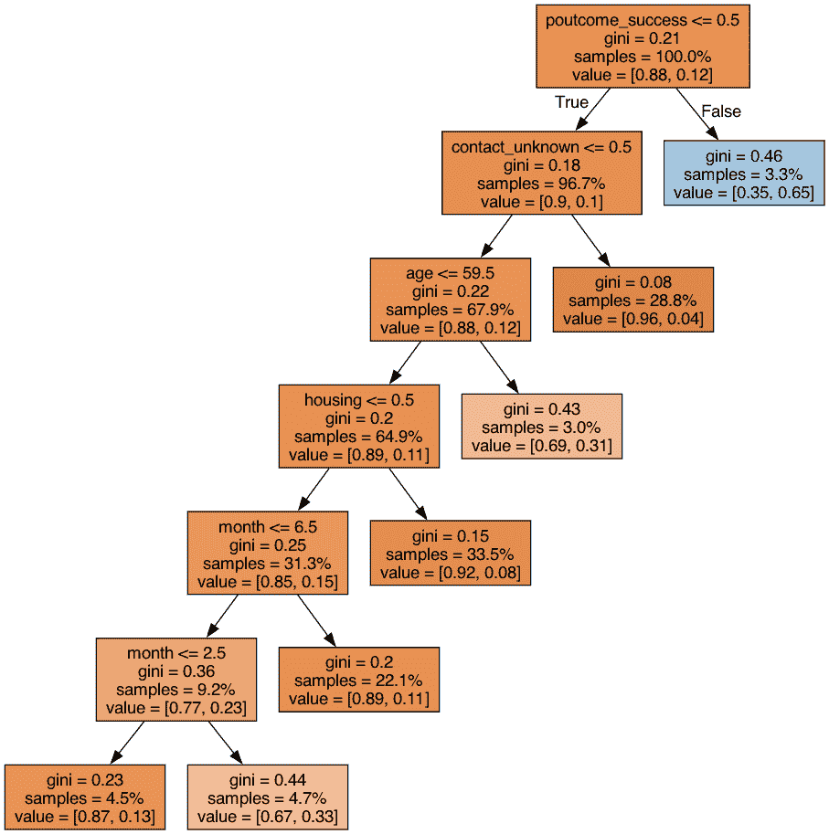

图片由作者提供

就这样。我们得到了将客户分成组（叶子）的规则。现在，我们可以遍历这些组，看看我们想要联系哪些客户组。尽管我们的模型相对较小，但复制图像中的所有条件是令人畏惧的。幸运的是，我们可以解析[树结构](https://scikit-learn.org/stable/auto_examples/tree/plot_unveil_tree_structure.html)并从模型中获取所有组。

决策树分类器有一个名为 `tree_` 的属性，它将允许我们访问树的底层属性，例如 `node_count`。

```py
n_nodes = model.tree_.node_count
print(n_nodes)
# 13
```

`tree_` 变量还存储了整个树结构作为并行数组，其中每个数组的第 `i` 个元素存储了关于节点 `i` 的信息。对于根节点 `i` 等于 0。

这里是我们用来表示树结构的数组：

+   `children_left` 和 `children_right` — 分别是左节点和右节点的 ID；如果节点是叶节点，则为 -1。

+   `feature` — 用于分割节点 `i` 的特征。

+   `threshold` — 节点 `i` 的二分分割所使用的阈值。

+   `n_node_samples` — 达到节点 `i` 的训练样本数量。

+   `values` — 每个类别的样本份额。

让我们将所有这些数组保存起来。

```py
children_left = model.tree_.children_left
# [ 1,  2,  3,  4,  5,  6, -1, -1, -1, -1, -1, -1, -1]
children_right = model.tree_.children_right
# [12, 11, 10,  9,  8,  7, -1, -1, -1, -1, -1, -1, -1]
features = model.tree_.feature
# [30, 34,  0,  3,  6,  6, -2, -2, -2, -2, -2, -2, -2]
thresholds = model.tree_.threshold
# [ 0.5,  0.5, 59.5,  0.5,  6.5,  2.5, -2\. , -2\. , -2\. , -2\. , -2\. , -2\. , -2\. ]
num_nodes = model.tree_.n_node_samples
# [45211, 43700, 30692, 29328, 14165,  4165,  2053,  2112, 10000, 
#  15163,  1364, 13008,  1511] 
values = model.tree_.value
# [[[0.8830152 , 0.1169848 ]],
# [[0.90135011, 0.09864989]],
# [[0.87671054, 0.12328946]],
# [[0.88550191, 0.11449809]],
# [[0.8530886 , 0.1469114 ]],
# [[0.76686675, 0.23313325]],
# [[0.87043351, 0.12956649]],
# [[0.66619318, 0.33380682]],
# [[0.889     , 0.111     ]],
# [[0.91578184, 0.08421816]],
# [[0.68768328, 0.31231672]],
# [[0.95948647, 0.04051353]],
# [[0.35274653, 0.64725347]]]
```

对于我们来说，使用树结构的分层视图将更加方便，所以让我们遍历所有节点，并为每个节点保存父节点 ID 以及它是否是右分支或左分支。

```py
hierarchy = {}

for node_id in range(n_nodes):
  if children_left[node_id] != -1: 
    hierarchy[children_left[node_id]] = {
      'parent': node_id, 
      'condition': 'left'
    }

  if children_right[node_id] != -1:
      hierarchy[children_right[node_id]] = {
       'parent': node_id, 
       'condition': 'right'
  }

print(hierarchy)
# {1: {'parent': 0, 'condition': 'left'},
# 12: {'parent': 0, 'condition': 'right'},
# 2: {'parent': 1, 'condition': 'left'},
# 11: {'parent': 1, 'condition': 'right'},
# 3: {'parent': 2, 'condition': 'left'},
# 10: {'parent': 2, 'condition': 'right'},
# 4: {'parent': 3, 'condition': 'left'},
# 9: {'parent': 3, 'condition': 'right'},
# 5: {'parent': 4, 'condition': 'left'},
# 8: {'parent': 4, 'condition': 'right'},
# 6: {'parent': 5, 'condition': 'left'},
# 7: {'parent': 5, 'condition': 'right'}}
```

下一步是过滤掉叶节点，因为它们是终端节点，对我们来说最有兴趣，因为它们定义了客户细分。

```py
leaves = []
for node_id in range(n_nodes):
    if (children_left[node_id] == -1) and (children_right[node_id] == -1):
        leaves.append(node_id)
print(leaves)
# [6, 7, 8, 9, 10, 11, 12]
leaves_df = pd.DataFrame({'node_id': leaves})
```

下一步是确定应用于每个组的所有条件，因为它们将定义我们的客户细分。第一个函数`get_condition`将为我们提供一个节点（特征、条件类型和阈值）的元组。

```py
def get_condition(node_id, condition, features, thresholds, feature_names):
    # print(node_id, condition)
    feature = feature_names[features[node_id]]
    threshold = thresholds[node_id]
    cond = '>' if condition == 'right'  else '<='
    return (feature, cond, threshold)

print(get_condition(0, 'left', features, thresholds, feature_names)) 
# ('poutcome_success', '<=', 0.5)

print(get_condition(0, 'right', features, thresholds, feature_names))
# ('poutcome_success', '>', 0.5)
```

下一个函数将允许我们递归地从叶节点到根节点，并获取所有二分分割。

```py
def get_decision_path_rec(node_id, decision_path, hierarchy):
  if node_id == 0:
    yield decision_path 
  else:
    parent_id = hierarchy[node_id]['parent']
    condition = hierarchy[node_id]['condition']
    for res in get_decision_path_rec(parent_id, decision_path + [(parent_id, condition)], hierarchy):
        yield res

decision_path = list(get_decision_path_rec(12, [], hierarchy))[0]
print(decision_path) 
# [(0, 'right')]

fmt_decision_path = list(map(
  lambda x: get_condition(x[0], x[1], features, thresholds, feature_names), 
  decision_path))
print(fmt_decision_path)
# [('poutcome_success', '>', 0.5)]
```

让我们将执行递归和格式化的逻辑保存到一个包装函数中。

```py
def get_decision_path(node_id, features, thresholds, hierarchy, feature_names):
  decision_path = list(get_decision_path_rec(node_id, [], hierarchy))[0]
  return list(map(lambda x: get_condition(x[0], x[1], features, thresholds, 
    feature_names), decision_path))
```

我们已经学会了如何获取每个节点的二分分割条件。唯一剩下的逻辑就是合并这些条件。

```py
def get_decision_path_string(node_id, features, thresholds, hierarchy, 
  feature_names):
  conditions_df = pd.DataFrame(get_decision_path(node_id, features, thresholds, hierarchy, feature_names))
  conditions_df.columns = ['feature', 'condition', 'threshold']

  left_conditions_df = conditions_df[conditions_df.condition == '<=']
  right_conditions_df = conditions_df[conditions_df.condition == '>']

  # deduplication 
  left_conditions_df = left_conditions_df.groupby(['feature', 'condition'], as_index = False).min()
  right_conditions_df = right_conditions_df.groupby(['feature', 'condition'], as_index = False).max()

  # concatination
  fin_conditions_df = pd.concat([left_conditions_df, right_conditions_df])\
      .sort_values(['feature', 'condition'], ascending = False)

  # formatting 
  fin_conditions_df['cond_string'] = list(map(
      lambda x, y, z: '(%s %s %.2f)' % (x, y, z),
      fin_conditions_df.feature,
      fin_conditions_df.condition,
      fin_conditions_df.threshold
  ))
  return ' and '.join(fin_conditions_df.cond_string.values)

print(get_decision_path_string(12, features, thresholds, hierarchy, 
  feature_names))
# (poutcome_success > 0.50)
```

现在，我们可以计算每个组的条件。

```py
leaves_df['condition'] = leaves_df['node_id'].map(
  lambda x: get_decision_path_string(x, features, thresholds, hierarchy, 
  feature_names)
)
```

最后一步是将它们的大小和转换添加到组中。

```py
leaves_df['total'] = leaves_df.node_id.map(lambda x: num_nodes[x])
leaves_df['conversion'] = leaves_df['node_id'].map(lambda x: values[x][0][1])*100
leaves_df['converted_users'] = (leaves_df.conversion * leaves_df.total)\
  .map(lambda x: int(round(x/100)))
leaves_df['share_of_converted'] = 100*leaves_df['converted_users']/leaves_df['converted_users'].sum()
leaves_df['share_of_total'] = 100*leaves_df['total']/leaves_df['total'].sum()
```

现在，我们可以使用这些规则来做出决策。我们可以按转换率（成功接触的概率）对组进行排序，并选择概率最高的客户。

```py
leaves_df.sort_values('conversion', ascending = False)\
  .drop('node_id', axis = 1).set_index('condition')
```

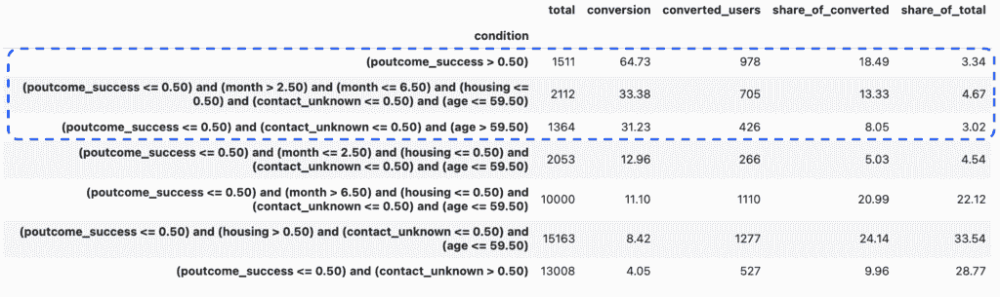

图片由作者提供

想象我们只有资源来联系大约 10%的用户基础，我们可以专注于前三个组。即使在这样的有限能力下，我们预计可以获得近 40%的转换率 — 这是一个非常好的结果，我们只是通过一些简单的启发式方法就实现了它。

在现实生活中，在将模型（或启发式方法）部署到生产之前，测试模型（或启发式方法）也是值得的。我会将训练数据集分成训练和验证部分（按时间划分以避免泄漏），并查看启发式方法在验证集上的性能，以更好地了解实际模型的质量。

## 处理高基数类别

在这个背景下，另一个值得讨论的话题是类别编码，因为我们必须对`sklearn`实现进行类别变量的编码。我们使用了一种简单的方法，即独热编码，但在某些情况下，它不起作用。

想象我们数据中也有一个区域。我为每一行合成了英文城市。我们有 155 个独特的区域，所以特征的数量增加到 190。

```py
model = sklearn.tree.DecisionTreeClassifier(min_samples_leaf = 100, min_impurity_decrease=0.001)
model.fit(fin_df[feature_names], fin_df['y'])
```

因此，基本的树现在基于区域有很多条件，与它们一起工作并不方便。

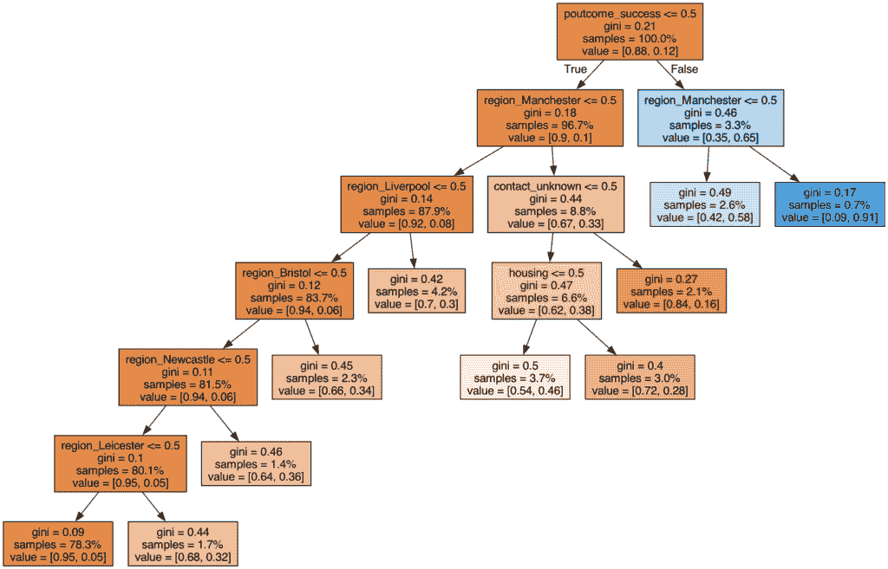

图片由作者提供

在这种情况下，爆炸特征的数量可能没有意义，现在是考虑编码的时候了。有一篇全面的文章，“[“分类：不要爆炸——编码！”](https://medium.com/data-science-at-microsoft/categorically-dont-explode-encode-dd623b565ce3)”，分享了处理高基数分类变量的多种不同选项。我认为在我们的案例中，最可行的是以下两个选项：

+   **计数或频率编码器**，在基准测试中表现出良好的性能。这种编码假设相似大小的类别会有相似的特征。

+   **目标编码器**，我们可以通过目标变量的平均值来编码类别。这将使我们能够优先考虑转化率较高的部分，并降低转化率较低的部分的优先级。理想情况下，使用历史数据来获取编码的平均值会很好，但我们将使用现有的数据集。

然而，测试不同的方法将很有趣，所以让我们将数据集分为训练集和测试集，保留 10%用于验证。为了简单起见，我除了地区（因为它有最高的基数）之外的所有列都使用了独热编码。

```py
from sklearn.model_selection import train_test_split
fin_df = pd.get_dummies(df, columns=['job', 'marital', 'education', 
  'poutcome', 'contact'], dtype = int, drop_first = False)
train_df, test_df = train_test_split(fin_df,test_size=0.1, random_state=42)
print(train_df.shape[0], test_df.shape[0])
# (40689, 4522)
```

为了方便起见，让我们将解析树的所有逻辑合并到一个函数中。

```py
def get_model_definition(model, feature_names):
  n_nodes = model.tree_.node_count
  children_left = model.tree_.children_left
  children_right = model.tree_.children_right
  features = model.tree_.feature
  thresholds = model.tree_.threshold
  num_nodes = model.tree_.n_node_samples
  values = model.tree_.value

  hierarchy = {}

  for node_id in range(n_nodes):
      if children_left[node_id] != -1: 
          hierarchy[children_left[node_id]] = {
            'parent': node_id, 
            'condition': 'left'
          }

      if children_right[node_id] != -1:
            hierarchy[children_right[node_id]] = {
             'parent': node_id, 
             'condition': 'right'
            }

  leaves = []
  for node_id in range(n_nodes):
      if (children_left[node_id] == -1) and (children_right[node_id] == -1):
          leaves.append(node_id)
  leaves_df = pd.DataFrame({'node_id': leaves})
  leaves_df['condition'] = leaves_df['node_id'].map(
    lambda x: get_decision_path_string(x, features, thresholds, hierarchy, feature_names)
  )

  leaves_df['total'] = leaves_df.node_id.map(lambda x: num_nodes[x])
  leaves_df['conversion'] = leaves_df['node_id'].map(lambda x: values[x][0][1])*100
  leaves_df['converted_users'] = (leaves_df.conversion * leaves_df.total).map(lambda x: int(round(x/100)))
  leaves_df['share_of_converted'] = 100*leaves_df['converted_users']/leaves_df['converted_users'].sum()
  leaves_df['share_of_total'] = 100*leaves_df['total']/leaves_df['total'].sum()
  leaves_df = leaves_df.sort_values('conversion', ascending = False)\
    .drop('node_id', axis = 1).set_index('condition')
  leaves_df['cum_share_of_total'] = leaves_df['share_of_total'].cumsum()
  leaves_df['cum_share_of_converted'] = leaves_df['share_of_converted'].cumsum()
  return leaves_df
```

让我们创建一个编码数据框，计算频率和转化率。

```py
region_encoding_df = train_df.groupby('region', as_index = False)\
  .aggregate({'id': 'count', 'y': 'mean'}).rename(columns = 
    {'id': 'region_count', 'y': 'region_target'})
```

然后，将其合并到我们的训练集和验证集中。对于验证集，我们还将用平均值填充 NAs。

```py
train_df = train_df.merge(region_encoding_df, on = 'region')

test_df = test_df.merge(region_encoding_df, on = 'region', how = 'left')
test_df['region_target'] = test_df['region_target']\
  .fillna(region_encoding_df.region_target.mean())
test_df['region_count'] = test_df['region_count']\
  .fillna(region_encoding_df.region_count.mean())
```

现在，我们可以拟合模型并获取它们的结构。

```py
count_feature_names = train_df.drop(
  ['y', 'id', 'region_target', 'region'], axis = 1).columns
target_feature_names = train_df.drop(
  ['y', 'id', 'region_count', 'region'], axis = 1).columns
print(len(count_feature_names), len(target_feature_names))
# (36, 36)

count_model = sklearn.tree.DecisionTreeClassifier(min_samples_leaf = 500, 
  min_impurity_decrease=0.001)
count_model.fit(train_df[count_feature_names], train_df['y'])

target_model = sklearn.tree.DecisionTreeClassifier(min_samples_leaf = 500, 
  min_impurity_decrease=0.001)
target_model.fit(train_df[target_feature_names], train_df['y'])

count_model_def_df = get_model_definition(count_model, count_feature_names)
target_model_def_df = get_model_definition(target_model, target_feature_names)
```

让我们查看结构并选择目标受众的 10-15%以上的顶级类别。我们还可以将这些条件应用于我们的验证集以测试我们的方法。

让我们从计数编码器开始。

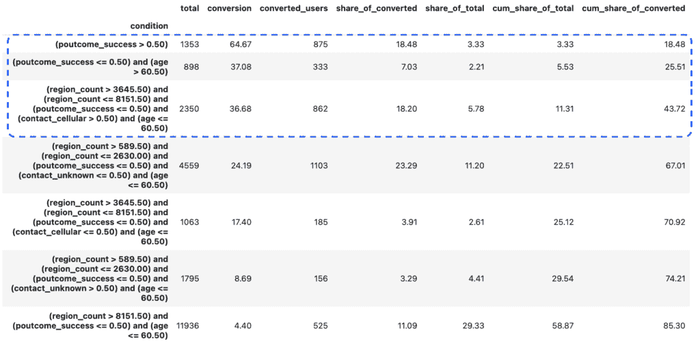

图片由作者提供

```py
count_selected_df = test_df[
    (test_df.poutcome_success > 0.50) | 
    ((test_df.poutcome_success <= 0.50) & (test_df.age > 60.50)) | 
    ((test_df.region_count > 3645.50) & (test_df.region_count <= 8151.50) & 
         (test_df.poutcome_success <= 0.50) & (test_df.contact_cellular > 0.50) & (test_df.age <= 60.50))
]

print(count_selected_df.shape[0], count_selected_df.y.sum())
# (508, 227)
```

我们还可以看到哪些地区已被选中，只有曼彻斯特。


图片由作者提供

让我们继续使用目标编码。

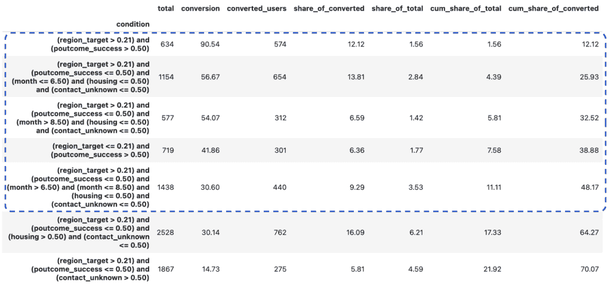

图片由作者提供

```py
target_selected_df = test_df[
    ((test_df.region_target > 0.21) & (test_df.poutcome_success > 0.50)) | 
    ((test_df.region_target > 0.21) & (test_df.poutcome_success <= 0.50) & (test_df.month <= 6.50) & (test_df.housing <= 0.50) & (test_df.contact_unknown <= 0.50)) | 
    ((test_df.region_target > 0.21) & (test_df.poutcome_success <= 0.50) & (test_df.month > 8.50) & (test_df.housing <= 0.50) 
         & (test_df.contact_unknown <= 0.50)) |
    ((test_df.region_target <= 0.21) & (test_df.poutcome_success > 0.50)) |
    ((test_df.region_target > 0.21) & (test_df.poutcome_success <= 0.50) & (test_df.month > 6.50) & (test_df.month <= 8.50) 
         & (test_df.housing <= 0.50) & (test_df.contact_unknown <= 0.50))
]

print(target_selected_df.shape[0], target_selected_df.y.sum())
# (502, 248)
```

我们看到选定的用户数量在通信方面略有下降，但转化率显著提高：248 比 227（+9.3%）。

让我们也看看选定的类别。我们看到模型选择了所有转化率高的城市（曼彻斯特、利物浦、布里斯托尔、莱斯特和新卡斯尔），但也有许多小区域仅由于偶然机会而转化率高。

```py
region_encoding_df[region_encoding_df.region_target > 0.21]\
  .sort_values('region_count', ascending = False)
```

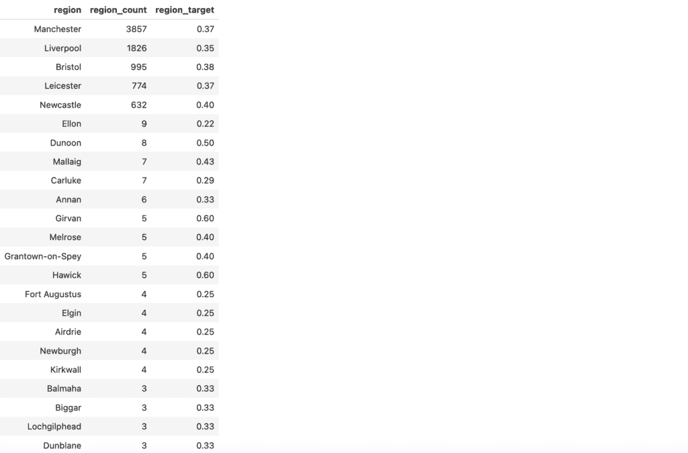

图片由作者提供

在我们的案例中，这影响不大，因为这样小城市的份额很低。然而，如果你有更多的小类别，你可能会看到过拟合的显著缺点。在这个时候，目标编码可能会变得棘手，所以值得注意你模型的输出。

幸运的是，有一种方法可以帮助您克服这个问题。遵循文章[“编码分类变量：深入探讨目标编码”](https://towardsdatascience.com/encoding-categorical-variables-a-deep-dive-into-target-encoding-2862217c2753/)，我们可以添加平滑处理。想法是将组的转化率与整体平均数相结合：组越大，其数据携带的权重就越大，而较小的部分将更多地倾向于全局平均数。

首先，我选择了对我们分布有意义的参数，查看了一组选项。我选择为 100 人以下的组使用全局平均值。这部分有点主观，所以请使用常识和您对业务领域的了解。

```py
import numpy as np
import matplotlib.pyplot as plt

global_mean = train_df.y.mean()

k = 100
f = 10
smooth_df = pd.DataFrame({'region_count':np.arange(1, 100001, 1) })
smooth_df['smoothing'] = (1 / (1 + np.exp(-(smooth_df.region_count - k) / f)))

ax = plt.scatter(smooth_df.region_count, smooth_df.smoothing)
plt.xscale('log')
plt.ylim([-.1, 1.1])
plt.title('Smoothing')
```

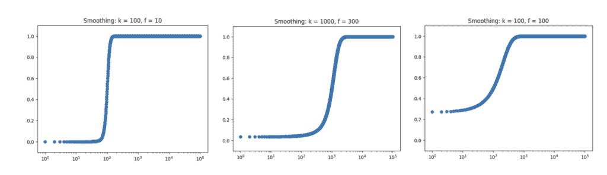

图片由作者提供

然后，我们可以根据选定的参数计算平滑系数和混合平均值。

```py
region_encoding_df['smoothing'] = (1 / (1 + np.exp(-(region_encoding_df.region_count - k) / f)))
region_encoding_df['region_target'] = region_encoding_df.smoothing * region_encoding_df.raw_region_target \
    + (1 - region_encoding_df.smoothing) * global_mean
```

然后，我们可以使用平滑的目标类别编码拟合另一个模型。

```py
train_df = train_df.merge(region_encoding_df[['region', 'region_target']], 
  on = 'region')
test_df = test_df.merge(region_encoding_df[['region', 'region_target']], 
  on = 'region', how = 'left')
test_df['region_target'] = test_df['region_target']\
  .fillna(region_encoding_df.region_target.mean())

target_v2_feature_names = train_df.drop(['y', 'id', 'region'], axis = 1)\
  .columns

target_v2_model = sklearn.tree.DecisionTreeClassifier(min_samples_leaf = 500, 
  min_impurity_decrease=0.001)
target_v2_model.fit(train_df[target_v2_feature_names], train_df['y'])
target_v2_model_def_df = get_model_definition(target_v2_model, 
  target_v2_feature_names)
```

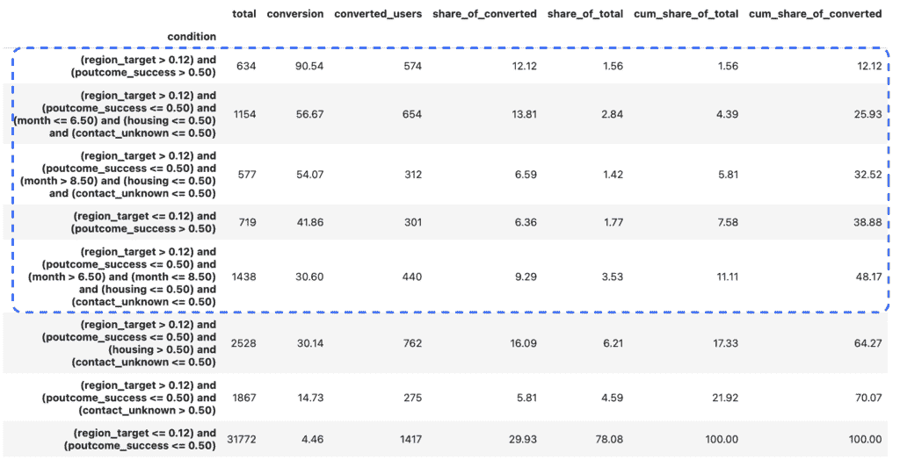

图片由作者提供

```py
target_v2_selected_df = test_df[
    ((test_df.region_target > 0.12) & (test_df.poutcome_success > 0.50)) | 
    ((test_df.region_target > 0.12) & (test_df.poutcome_success <= 0.50) & (test_df.month <= 6.50) & (test_df.housing <= 0.50) & (test_df.contact_unknown <= 0.50)) | 
    ((test_df.region_target > 0.12) & (test_df.poutcome_success <= 0.50) & (test_df.month > 8.50) & (test_df.housing <= 0.50) 
         & (test_df.contact_unknown <= 0.50)) | 
    ((test_df.region_target <= 0.12) & (test_df.poutcome_success > 0.50) ) | 
    ((test_df.region_target > 0.12) & (test_df.poutcome_success <= 0.50) & (test_df.month > 6.50) & (test_df.month <= 8.50) 
         & (test_df.housing <= 0.50) & (test_df.contact_unknown <= 0.50) )
]

target_v2_selected_df.shape[0], target_v2_selected_df.y.sum()
# (500, 247)
```

我们可以看到，我们在模型中消除了小城市并防止了过拟合，同时保持了大致相同的性能，捕获了 247 次转化。

```py
region_encoding_df[region_encoding_df.region_target > 0.12]
```

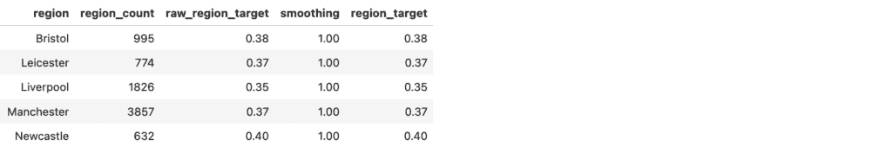

图片由作者提供

您也可以使用来自`sklearn`的[TargetEncoder](https://scikit-learn.org/stable/modules/generated/sklearn.preprocessing.TargetEncoder.html)，它根据段的大小平滑和混合类别和全局平均值。然而，它也添加了随机噪声，这对我们的启发式方法来说并不理想。

> *您可以在[GitHub](https://github.com/miptgirl/miptgirl_medium/blob/main/mining_rules/churn_prediction.ipynb)上找到完整的代码。*

## 摘要

在这篇文章中，我们探讨了如何从数据中提取简单的“规则”并使用它们来指导商业决策。我们使用决策树分类器生成了启发式规则，并简要介绍了分类编码的重要主题，因为决策树算法需要将分类变量转换为数值。

我们看到，这种基于规则的简单方法可以非常有效，帮助您快速做出商业决策。然而，值得注意的是，这种简单的方法有其缺点：

+   我们在模型的强大和准确性与其简单性和可解释性之间进行权衡，因此如果您正在优化准确性，请选择另一种方法。

+   尽管我们使用了一套静态的启发式规则，但您的数据仍然可能发生变化，它们可能会过时，因此您需要不时地重新检查您的模型。

* * *

*非常感谢您阅读这篇文章。希望它对您有所启发。如果您有任何后续问题或评论，请留下它们在评论部分。*

## 参考文献

**数据集：** *Moro, S., Rita, P., & Cortez, P. (2014). Bank Marketing [数据集]. UCI 机器学习库。[`doi.org/10.24432/C5K306`](https://doi.org/10.24432/C5K306)*
