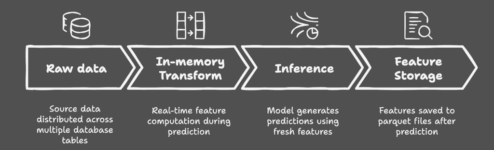
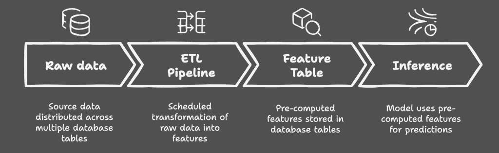
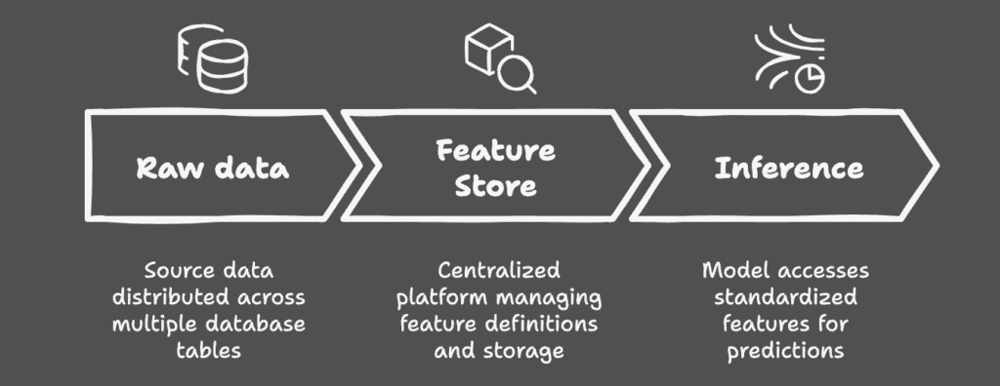

# 机器学习特征管理：实用进化指南

> 原文：[`towardsdatascience.com/ml-feature-management-a-practical-evolution-guide/`](https://towardsdatascience.com/ml-feature-management-a-practical-evolution-guide/)

在机器学习的世界里，我们痴迷于模型架构、训练管道和超参数调整，然而往往忽略了一个基本方面：我们的特征在其生命周期中是如何生存和呼吸的。从每次预测后消失的内存计算到几个月后重现精确特征值的挑战，我们处理特征的方式可能会决定我们的机器学习系统可靠性和可扩展性的成败。

#### 应该阅读此内容的人

+   评估其特征管理方法的机器学习工程师

+   经历训练-服务偏差问题的数据科学家

+   计划扩大其机器学习操作的负责人

+   考虑实施特征存储的团队

* * *

#### 起始点：无形的方法

许多机器学习团队，尤其是那些处于早期阶段或没有专门的机器学习工程师的团队，开始采用我所说的“无形的方法”进行特征工程。这看似简单：获取原始数据，在内存中转换它，并实时创建特征。生成的数据集虽然功能齐全，但本质上是一个短暂的短期计算的黑盒——特征只存在于一瞬间，在每次预测或训练运行后就会消失。

虽然这种方法看起来可以完成工作，但它建立在摇摇欲坠的基础上。随着团队扩大其机器学习操作规模，在测试中表现出色的模型在生产中突然变得不可预测。在训练期间完美工作的特征在实时推理中神秘地产生不同的值。当利益相关者询问为什么上个月做出了特定的预测时，团队发现自己无法重建导致该决策的确切特征值。

#### 特征工程的核心挑战

这些痛点并非任何单一团队所独有；它们代表了每个成长中的机器学习团队最终都会面临的根本挑战。

1.  **可观察性**

    没有物化的特征，调试变成了一场侦探任务。想象一下，试图理解几个月前模型做出特定预测的原因，却发现支撑该决策的特征早已消失。特征可观察性还使持续监控成为可能，允许团队检测其特征分布随时间的变化中的恶化或令人担忧的趋势。

1.  **时间点正确性**

    当用于训练的特征与在推理期间生成的特征不匹配，导致臭名昭著的训练-服务偏差。这不仅仅是关于数据准确性——这是确保您的模型在生产中遇到的特征计算与训练期间相同。

1.  **可重用性**

    在不同的模型中重复计算相同的特征变得越来越浪费。当特征计算涉及大量计算资源时，这种低效不仅是不便，而且是对资源的重大消耗。

### 解决方案的演变

#### 方法 1：按需特征生成

最简单的解决方案始于许多机器学习团队开始的地方：为预测立即使用而按需创建特征。原始数据通过转换生成特征，用于推理，然后——在预测已经做出之后——这些特征通常保存到 parquet 文件中。虽然这种方法很简单，因为团队通常选择 parquet 文件，因为它们可以从内存数据中轻松创建，但它有其局限性。这种方法部分解决了可观察性问题，因为特征被保存了，但分析这些特征后来变得具有挑战性——查询多个 parquet 文件中的数据需要特定的工具和仔细组织您的保存文件。

按需特征生成推理流程的示意图。图片由作者提供

#### 方法 2：特征表物化

随着团队的发展，许多团队转向在线上广泛讨论的替代方案：特征表物化。这种方法利用现有的数据仓库基础设施在需要之前转换和存储特征。将其视为一个中心仓库，其中特征通过建立的 ETL 管道持续计算，然后用于训练和推理。这种解决方案巧妙地解决了时间点正确性和可观察性问题——您的特征始终可用于检查，并且始终一致生成。然而，当处理特征演变时，它显示出其局限性。随着您的模型生态系统的发展，添加新特征、修改现有特征或管理不同版本变得越来越复杂——尤其是在数据库模式演变带来的约束下。

特征表物化推理流程的示意图。图片由作者提供

#### 方法 3：特征存储

在光谱的另一端是特征存储——通常是综合机器学习平台的一部分。这些解决方案提供全套服务：特征版本控制、高效的在线/离线服务以及与更广泛的机器学习工作流程的无缝集成。它们就像一台运转良好的机器，全面解决我们的核心挑战。特征是版本控制的，易于观察，并且可以在模型之间内在地重用。然而，这种力量伴随着巨大的成本：技术复杂性、资源需求以及对专用机器学习工程专业知识的需求。

特征存储推理流程的示意图。图片由作者提供

***

### 做出正确的选择

与流行的机器学习博客文章所暗示的相反，并非每个团队都需要特征存储库。根据我的经验，特征表物化通常提供了最佳平衡点——尤其是在你的组织已经拥有稳健的 ETL 基础设施的情况下。关键在于理解你的具体需求：如果你正在管理多个共享和频繁修改特征的多模型，那么特征存储库可能值得投资。但对于模型间相互依赖性有限或仍在建立其机器学习实践的团队来说，更简单的解决方案通常能提供更好的投资回报率。当然，你*可以*坚持使用按需特征生成——如果凌晨 2 点调试竞态条件是你的乐趣所在。

最终的决定取决于你团队的成熟度、资源可用性和具体用例。特征存储库是强大的工具，但像任何复杂的解决方案一样，它们需要大量的人力资本和基础设施投资。有时，尽管有其局限性，但特征表物化的实用路径提供了能力和复杂性的最佳平衡。

记住：机器学习特征管理中的成功不在于选择最复杂的解决方案，而在于找到适合你团队需求和能力的正确匹配。关键在于诚实地评估你的需求，了解你的局限性，并选择一条能够使你的团阛建立可靠、可观察和可维护的机器学习系统的路径。
