# 使用 Python 开发移动应用程序

> 原文：[`towardsdatascience.com/mobile-app-development-with-python/`](https://towardsdatascience.com/mobile-app-development-with-python/)

## <mdspan datatext="el1749599474581" class="mdspan-comment">简介</mdspan>

[**移动应用程序开发**](https://en.wikipedia.org/wiki/Mobile_app_development)是构建移动设备（如智能手机和平板电脑）应用程序的过程。通常，移动应用程序的开发比网络应用程序更困难，因为它们必须为每个平台从头开始设计，而网络开发在不同设备之间共享通用代码。

每个操作系统都有自己的用于编写**原生应用**（即使用针对特定平台的技术创建的应用）的语言。例如，Android 使用 Java，而 iOS 使用 Swift。通常，对于需要高性能的应用，如游戏或重动画，最好使用专用技术。相反，**混合应用**使用跨平台语言（例如 Python），这些语言可以在多个操作系统上运行。

移动应用程序开发对于人工智能来说高度相关，因为它使得新技术能够融入人们的日常生活中。LLMs（大型语言模型）之所以如此受欢迎，是因为它们已经被部署到用户友好的手机应用程序中，可以随时随地轻松访问。

通过这篇教程，我将解释**如何使用 Python 构建跨平台移动应用程序**，以我的 Memorizer 应用程序为例（文章末尾有完整代码的链接）。

## 设置

我将使用**Kivy 框架**，这是 Python 社区中用于移动开发的框架中最常用的。[*Kivy*](http://kivy.org/#home)是一个用于移动应用程序的开源包，而[*KivyMD*](https://kivymd.readthedocs.io/en/latest/)是利用谷歌的[*Material Design*](https://material.io/design/introduction)并使该框架的使用更加容易的库（类似于网络开发中的 Bootstrap）。

```py
## for development
pip install kivy==2.0.0
pip install kivymd==0.104.2

## for deployment
pip install Cython==0.29.27
pip install kivy-ios==1.2.1
```

首件事是创建两个文件：

+   *main.py*（名称必须是这个）将包含应用程序的 Python 代码，基本上是后端

+   *components.kv*（你可以叫它不同的名字）将包含用于应用程序布局的所有*Kivy*代码，你可以将其视为前端

然后，在 *main.py* 文件中，我们导入包以初始化一个[空应用](https://kivymd.readthedocs.io/en/latest/themes/material-app/index.html)：

```py
from kivymd.app import MDApp

class App(MDApp):
   def build(self):        
       self.theme_cls.theme_style = "Light"        
       return 0

if __name__ == "__main__":    
   App().run()
```

在我们开始之前，我将简要描述我正在构建的应用程序。这是一个简单的应用，帮助记忆东西：用户插入一对单词（即英语中的某个词和另一种语言的对应词，或者一个日期和与之相关联的历史事件）。然后，用户可以通过尝试记住打乱的信息来玩游戏。实际上，我正在用它来记忆中文词汇。

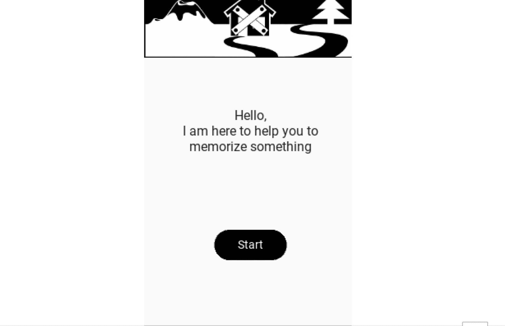

如您从图中所见，我将包括：

+   一个用于显示标志的简介屏幕

+   一个可以跳转到其他屏幕的主屏幕

+   一个用于保存单词的屏幕

+   一个屏幕用于查看和删除存储的信息

+   一个用于玩游戏屏幕。

因此，我们可以在*components.kv*文件中写下它们：

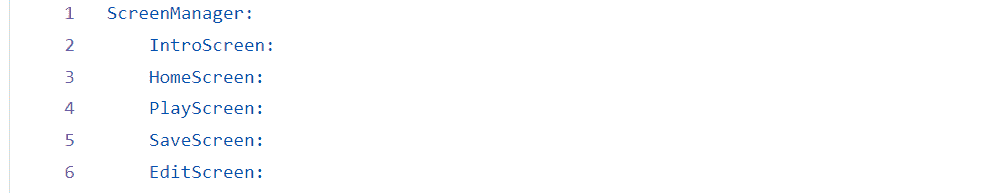

为了将*Kivy*文件包含到应用程序中，我们需要在*main.py*中使用[构建器类](https://kivy.org/doc/stable/api-kivy.lang.builder.html)来加载它，而[屏幕类](https://kivy.org/doc/stable/api-kivy.uix.screenmanager.html)则将两个文件之间的屏幕链接起来。

```py
from kivymd.app import MDApp
from kivy.lang import Builder
from kivy.uix.screenmanager import Screen

class App(MDApp):
   def build(self):        
       self.theme_cls.theme_style = "Light"        
       return Builder.load_file("components.kv")

class IntroScreen(Screen):    
   pass 

class HomeScreen(Screen):    
   pass 

class PlayScreen(Screen):
   pass  

class SaveScreen(Screen):    
   pass 

class EditScreen(Screen):
   pass

if __name__ == "__main__":    
   App().run()
```

请注意，即使应用程序本身很简单，也有一个相当棘手的功能：**通过手机管理数据库**。这就是为什么我们还将使用原生的 Python 数据库包：

```py
import sqlite3
```

## 开发 — 基础

我们将从**简介屏幕**开始，预热：它简单地包含一个[图像标志](https://kivy.org/doc/stable/api-kivy.uix.image.html)，一些[文本标签](https://kivymd.readthedocs.io/en/latest/components/label/)，以及一个[按钮](https://kivymd.readthedocs.io/en/latest/components/button/)，用于移动到另一个屏幕。

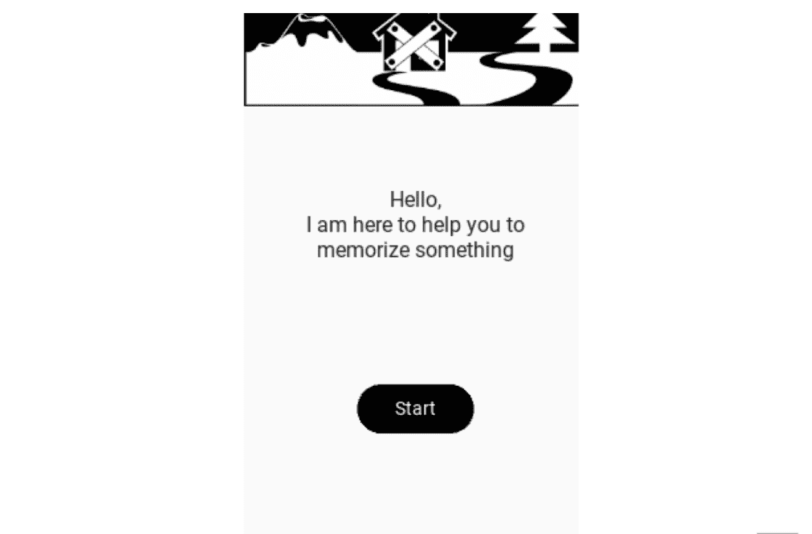

我认为这很简单，因为它不需要任何 Python 代码，可以通过*components.kv*文件来处理。由按钮触发的屏幕变化必须链接到根目录，如下所示：

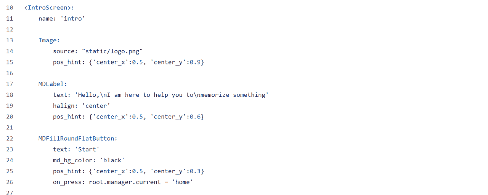

同样适用于**主页屏幕**：因为它只是一个重定向，所以可以用*Kivy*代码全部管理。你只需指定该屏幕必须有 1 个图标和 3 个按钮。

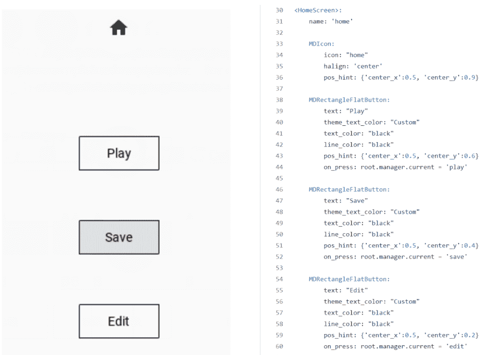

你可能已经注意到屏幕顶部有一个“家”图标**。**请注意，[简单图标](https://kivymd.readthedocs.io/en/latest/components/label/index.html#mdicon)和[图标按钮](https://kivymd.readthedocs.io/en/latest/components/button/#mdiconbutton)之间有一个区别：后者是可按的。在这个屏幕上，它只是一个简单图标，但在其他屏幕上，它将是一个图标按钮，用于从任何其他屏幕返回主页。

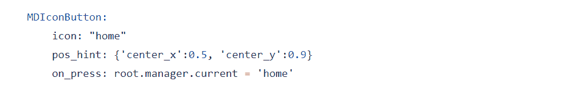

当我们使用图标时，我们必须提供标签（即“家”显示一个小房子）。我发现[此代码](https://gist.github.com/gottadiveintopython/c59044b578aaac4eb8b4193716d8421b)非常有用，只需运行它，它就会显示所有可用的图标。

## 开发 — 高级

让我们提高我们的水平，并通过**保存屏幕**处理数据库。它必须允许用户为不同的类别保存不同的单词（例如学习多种语言）。这意味着：

+   选择一个现有类别（例如中文），因此查询现有类别

+   创建一个新的类别（例如法语）

+   两个文本输入（即一个单词及其翻译）

+   一个按钮用于保存表单，因此写入数据库的新行。

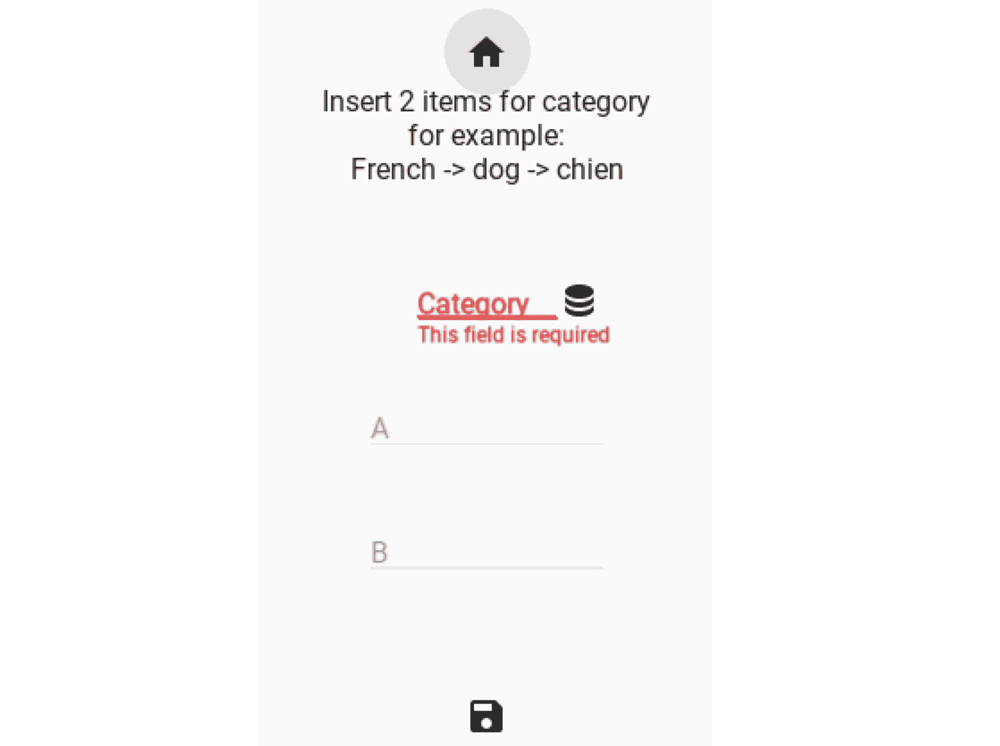

当你第一次运行应用程序时，必须创建数据库。我们可以在应用程序的主函数中完成这项工作。为了方便，我打算添加另一个函数，该函数使用你传递的任何 SQL 查询数据库。

```py
class App(MDApp):

   def query_db(self, q, data=False):        
       conn = sqlite3.connect("db.db")        
       db = conn.cursor()        
       db.execute(q)        
       if data is True:            
           lst_tuples_rows = db.fetchall()        
       conn.commit()        
       conn.close()        
       return lst_tuples_rows if data is True else None

   def build(self):        
       self.theme_cls.theme_style = "Light"
       q = "CREATE TABLE if not exists SAVED (category text, left
            text, right text, unique (category,left,right))"      
       self.query_db(q)
       return Builder.load_file("components.kv")
```

复杂的部分是 DB 图标，当按下时，会显示所有现有类别并允许选择一个。在*components.kv*文件中，在保存屏幕（命名为“*save*”）下，我们添加了一个图标按钮（命名为“*category_dropdown_save*”），如果按下，则从主应用程序启动 Python 的*dropdown_save()*函数。

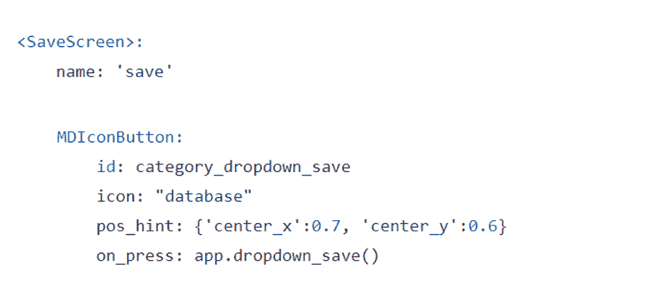

该函数定义在*main.py*文件中，并返回一个[下拉菜单](https://kivymd.readthedocs.io/en/latest/components/menu/index.html)，这样，当按下某个项目时，它会被分配给一个名为“*category*”的变量。

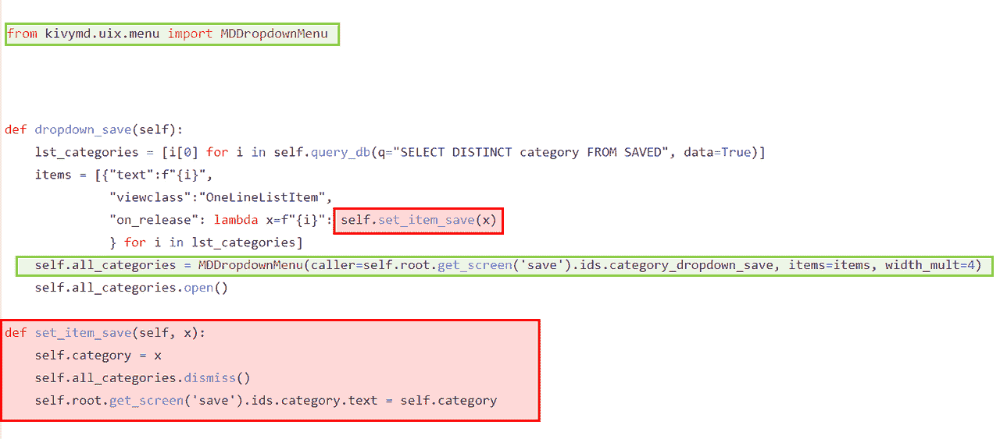

那最后一行代码将*category*变量与前端显示的标签链接起来。屏幕管理器通过*get_screen()*调用屏幕，并通过*id*识别项目：

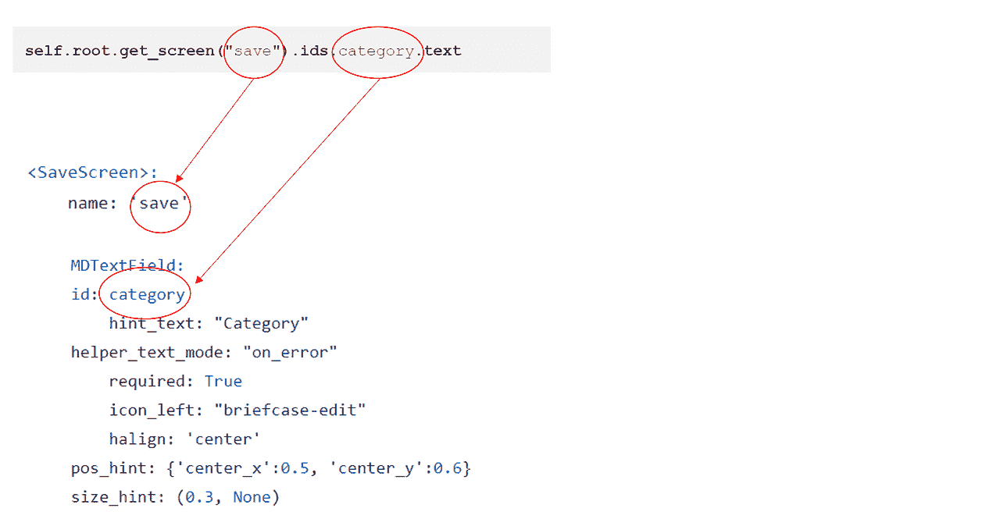

当用户进入保存屏幕时，*category*变量应该为*null*，直到选择一个。当有人进入和有人离开时，我们可以指定屏幕的[属性](https://kivymd.readthedocs.io/en/latest/components/screen/)。因此，我打算在屏幕类中添加一个函数来清空 App 变量。

```py
class SaveScreen(Screen):    
   def on_enter(self):        
       App.category = ''
```

一旦选择了类别，用户就可以插入其他文本输入，这些输入是保存表单所必需的（通过按按钮）。

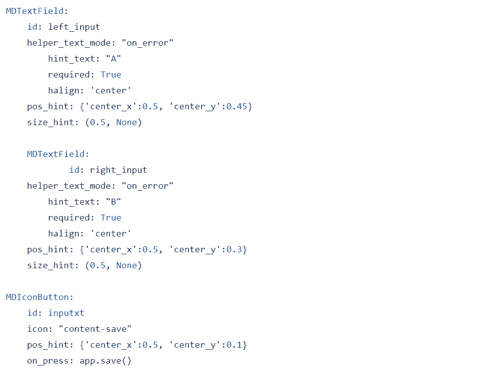

为了确保如果输入之一为空，则函数不会保存，我将使用一个[对话框](https://kivymd.readthedocs.io/en/latest/components/dialog/index.html)。

```py
from kivymd.uix.dialog import MDDialog

class App(MDApp):    
  dialog = None     

  def alert_dialog(self, txt):        
     if not self.dialog:            
        self.dialog = MDDialog(text=txt)        
     self.dialog.open()        
     self.dialog = None

  def save(self):
     self.category = self.root.get_screen('save').ids.category.text  
          if self.category == '' else self.category            
     left = self.root.get_screen('save').ids.left_input.text            
     right = self.root.get_screen('save').ids.right_input.text            
     if "" in [self.category.strip(), left.strip(), right.strip()]:                
          self.alert_dialog("Fields are required")            
     else:                
          q = f"INSERT INTO SAVED VALUES('{self.category}',
                '{left}','{right}')"                
          self.query_db(q)                
          self.alert_dialog("Saved")                  
          self.root.get_screen('save').ids.left_input.text = ''                
          self.root.get_screen('save').ids.right_input.text = ''                
          self.category = ''
```

到目前为止，我确信你能够通读全部代码并理解正在发生的事情。其他屏幕的逻辑相当相似。

## 测试

你可以在 MacBook 上的**iOS 模拟器**上测试应用程序，它复制了一个 iPhone 环境，而无需物理 iOS 设备。

[Xcode](https://apps.apple.com/us/app/xcode/id497799835?mt=12)需要安装。首先打开终端并运行以下命令（最后一个命令将花费大约 30 分钟）：

```py
brew install autoconf automake libtool pkg-config

brew link libtool

toolchain build kivy
```

现在决定你的应用程序名称，并使用它来创建存储库，然后打开.*xcodeproj*文件：

```py
toolchain create yourappname ~/some/path/directory

open yourappname-ios/yourappname.xcodeproj
```

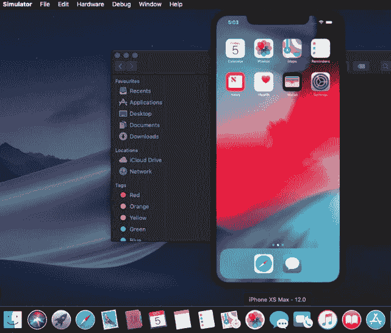

最后，如果你正在使用 iOS 并且想在你的手机上测试应用程序然后发布到 App Store，Apple 要求你支付[开发者账户](https://developer.apple.com/)的费用。

## 结论

这篇文章是一个教程，旨在演示**如何使用 Python 设计和构建跨平台移动应用程序**。我使用了*Kivy*来设计用户界面，并展示了如何使其适用于 iOS 设备。现在你可以使用 Python 和*Kivy*来制作自己的移动应用程序。

本文章的完整代码：**[GitHub](https://github.com/mdipietro09/mApp_Memorizer)**

希望您喜欢！如有任何问题或反馈，请随时联系我，或者只是分享您有趣的项目。

👉 **[让我们联系](https://maurodp.carrd.co/)** 👈


[^((所有图片，除非另有说明，均为作者所有))]
