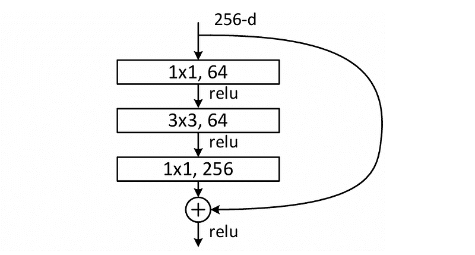
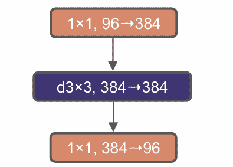
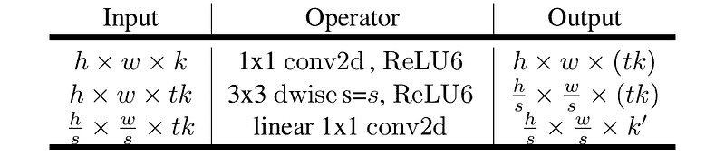
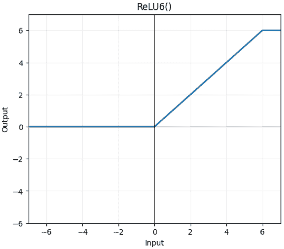
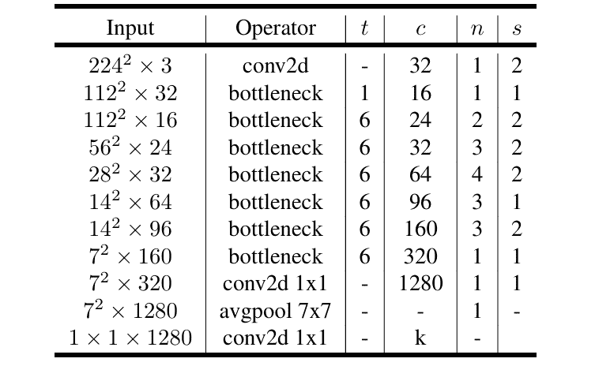
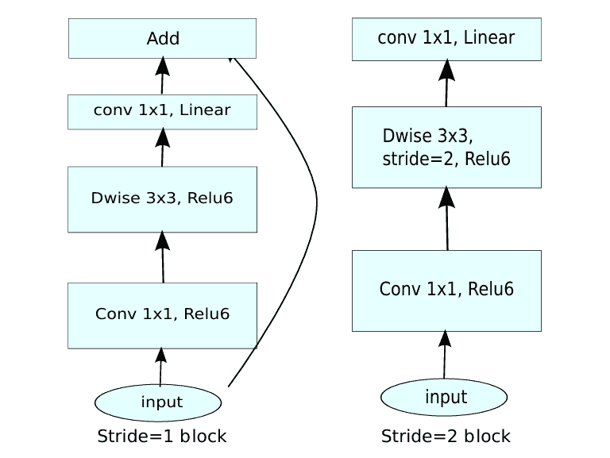
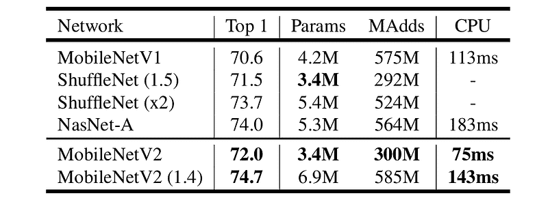
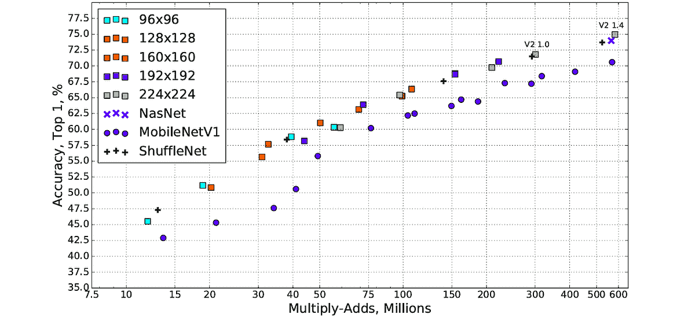
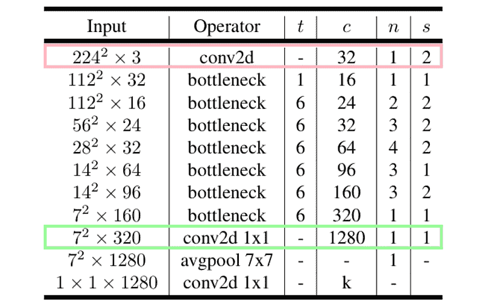
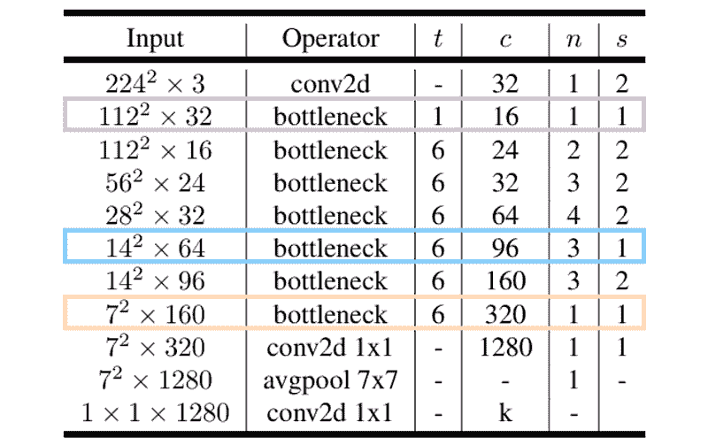

# MobileNetV2 论文解读：更智能的小巨人

> 原文：[`towardsdatascience.com/mobilenetv2-paper-walkthrough-the-smarter-tiny-giant/`](https://towardsdatascience.com/mobilenetv2-paper-walkthrough-the-smarter-tiny-giant/)

## 简介

<mdspan datatext="el1759430128089" class="mdspan-comment">MobileNetV1</mdspan>在计算机视觉领域是一个突破，因为它证明了深度学习模型并不一定需要计算成本高昂才能实现高精度。上个月我发表了一篇文章，从零开始解释了该模型及其 PyTorch 实现的所有内容。如果你对此感兴趣，请查看本文末尾的参考文献编号[1]中的链接。MobileNet 的第一个版本最早是在 2017 年 4 月由 Google 的 Howard 等人发表在题为*MobileNets: Efficient Convolutional Neural Networks for Mobile Vision Applications* [2]的论文中提出的。不久之后——确切地说是在 2018 年 1 月——来自同一机构的 Sandler 等人介绍了 MobileNetV1 的后继产品，在题为*MobileNetV2: Inverted Residuals and Linear Bottlenecks* [3]的论文中，它在精度和效率方面都带来了显著的改进。在这篇文章中，我将向您介绍 MobileNetV2 论文中提出的思想，并展示如何从头开始实现该架构。

* * *

## 改进之处

MobileNet 的第一个版本完全依赖于所谓的*深度可分离卷积*层。确实有必要承认，使用这些层作为标准卷积的替代品可以使模型变得极其轻量级。然而，作者们认为这种架构还可以进一步改进。他们提出了一个想法，即不仅仅使用深度可分离卷积，还采用了*残差反转*和*线性瓶颈*机制——这也是 MobileNetV2 论文标题的由来。

### 残差反转

如果你熟悉 ResNet，我相信你知道所谓的*瓶颈块*。对于那些不熟悉的人，它本质上是一种机制，网络的构建块通过遵循*宽→窄→宽*的模式工作。下面图 1 显示了 ResNet 中使用的瓶颈块的示意图。我们可以看到，它最初接受一个 256 通道的张量，将其缩小到 64，然后再将其扩展回 256。



图 1. ResNet 的构建块，通常称为“瓶颈” [4]。

上面的模块的倒置版本通常被称为*倒置瓶颈*，它遵循*narrow → wide → narrow*的结构。图 2 展示了来自 ConvNeXt 论文[5]的一个例子，其中输入张量中的通道数是 96，扩展到 384，并通过最后一个卷积层压缩回 96。需要注意的是，在 MobileNetV2 中，由于某些原因，*倒置瓶颈*模块被称为*倒置残差*。因此，从现在开始，我将使用这个术语以避免混淆。



图 2. ConvNeXt [5]中引入的倒置瓶颈模块。

到目前为止，你可能想知道为什么我们不直接在 MobileNetV2 上使用标准的瓶颈。答案在于标准瓶颈设计的原始目的，它最初是为了减少计算复杂度。这主要是因为 ResNet 在本质上计算成本高昂，但信息丰富。因此，ResNet 的作者提出了通过在每个构建块中间缩小张量大小来减少计算成本，这就是瓶颈块产生的原因。

这种通道数的减少并不会对模型容量造成太大的损害，因为 ResNet 本身就有大量的通道。另一方面，MobileNetV2 最初的目标是尽可能轻量，这意味着模型容量不如 ResNet 高。为了增加模型容量，作者在中间部分扩展张量大小以形成倒置残差块，这使得模型能够学习更多模式，同时仅略微增加复杂性。简而言之，瓶颈块（*narrow*）的中间部分用于提高效率，而倒置残差块（*wide*）的中间部分用于学习复杂模式。如果我们尝试在 MobileNetV2 上应用标准的瓶颈，计算将会更快，但这可能会导致准确度下降，因为模型将丢失大量信息。

### 线性瓶颈

我们需要了解的下一个概念是所谓的 *线性瓶颈*。这个概念实际上非常简单，因为我们在这里本质上只是省略了每个倒残差块的最后一层的非线性（即 ReLU 激活函数）。在神经网络中使用激活函数的初衷是允许网络捕捉复杂模式。然而，如果我们将其应用于低维张量，特别是像 MobileNetV2 这样的上下文中，倒残差块在最后一个卷积层中将高维张量投影到较小的张量，那么它将破坏重要信息。通过在最后一个卷积层中这样移除激活函数，我们实际上防止了模型丢失重要信息。下面的图 3 展示了 MobileNetV2 中使用的倒残差块的样子。注意，ReLU 没有应用于最后一个点卷积，这本质上意味着这一层的行为与标准线性回归层有些相似。除了这个图之外，变量 *k* 和 *k’* 分别表示输入通道数和输出通道数。在中间过程中，我们通过 *t* 扩展通道数，最终将其缩小到 *k’*。我将在下一节中详细介绍这些变量。



图 3\. MobileNetV2 中使用的倒残差块。注意，我们在最后一个点卷积层之后没有应用 ReLU [3]。

### ReLU6

那么为什么我们使用 ReLU6 而不是常规的 ReLU 呢？如果你还不熟悉它，这个激活函数实际上与 ReLU 类似，只是输出值被限制在 6。所以，任何大于 6 的输入都会映射到这个数字。同时，对于负输入的行为也是完全相同的。因此，我们可以简单地说，ReLU6 的输出值始终在 0 到 6（包含）的范围内。查看下面的图 4 以更好地理解这个概念。



图 4\. ReLU6 激活函数 [6]。

在标准的 ReLU 中，存在一种可能性，即输入值（因此输出值）可以任意增大，这在低精度环境中可能会引起不稳定性。请记住，MobileNet 的目的是能够在小型设备上运行，我们知道这类设备通常期望使用较小的数字来节省内存，比如 8 位整数。在这种情况下，非常大的激活值可能会导致量化到低比特表示时精度损失或截断。因此，为了保持值小且在可管理范围内，我们可以简单地使用 ReLU6 来实现这一点。

* * *

## 完整的 MobileNetV2 架构

现在，让我们看看下面的图 5 中完整的 MobileNetV2 架构。就像 MobileNet 的第一个版本，主要由深度可分卷积组成一样，MobileNetV2 的大部分组件是我们之前讨论过的具有线性瓶颈的逆残差块。以下表格中标记为*bottleneck*的每一行对应一个单独的阶段，其中每个阶段由几个逆残差块组成。谈到表格中的列，*t*代表每个块中间部分使用的*扩展因子*，*c*表示每个块的输出通道数，*n*是该阶段内块的重复次数，*s*表示阶段内第一个块的步长。

为了更好地理解这个想法，让我们仔细看看输入形状为 56×56×24 的阶段。在这里，你可以看到这个阶段的相应参数是*t*=6, *c*=32, *n*=3, 和*s*=2。这实际上意味着逆残差阶段由 3 个块组成。所有这些块都是相同的，除了第一个块使用步长 2，将空间维度减半从 56×56 到 28×28。接下来，*c*=32 相当直接，因为它基本上表示该阶段内每个块的输出通道数为 32。同时，*t*=6 表示块内部的中间层比输入宽 6 倍，形成了逆瓶颈结构。因此，在这种情况下，处理中的通道数将是 32 → 192 → 32。然而，重要的是要注意，该阶段内的第一个块是不同的，它使用 24 → 144 → 32 结构，这得益于 24 通道输入张量。如果我们参考图 3，这两个结构本质上遵循*k → kt → k’*模式。



图 5. 我们即将实现的 MobileNetV2 架构[3]。

除了上述架构之外，我们还在逆残差块内放置了跳跃连接。这个跳跃连接只有在块的步长设置为 1 时才会应用。这基本上是因为当我们使用步长 2 时，图像的空间维度将会改变，导致输出张量与输入张量形状不同。这种张量形状的差异将有效地阻止我们在原始流和跳跃连接之间执行逐元素求和。请参见下面的图 6 的详细信息。请注意，这个图中的两个插图基本上只是图 3 中表格的可视化。



图 6. 当步长设置为 2（即层执行空间下采样时）时，我们不实现跳跃连接[3]。

### 参数调整

与 MobileNetV1 类似，MobileNetV2 也有两个可调整的参数，称为*宽度乘数*和*输入分辨率*。前者用于调整网络的宽度，而后者用于改变输入图像的分辨率。图 5 中展示的架构是基本配置，其中我们将宽度乘数设置为 1，输入分辨率设置为 224×224。通过这两个参数，我们可以根据我们的需求调整模型，以找到一个平衡准确性和效率的甜点。

我们可以从技术上选择任意数字作为这两个参数的值，但作者已经为他们的实验提供了几个预定的数字。对于宽度乘数，我们可以使用 0.75、0.5 或 0.35，其中所有这些都会使模型变得更小。例如，如果我们使用 0.5，那么图 5 中列*c*中的所有数字都将减少到默认值的一半。对于输入分辨率，我们可以选择 192×192、160×160、128×128 或 96×96 作为 224×224 的替代，如果你想在推理过程中降低操作数量的话。

### 一些实验结果

下面的图 7 展示了作者进行的实验结果。尽管 MobileNetV1 已经被认为是轻量级的，但 MobileNetV2 在所有指标上与前辈相比都证明了其性能更好。然而，有必要承认，基本 MobileNetV2 在考虑所有方面时并不完全优于其他轻量级模型。



图 7. MobileNetV2 在 ImageNet 数据集上与其他轻量级模型的性能比较[3]。

为了实现更高的准确性，作者还尝试通过将宽度乘数改为 1.4 来增大模型，对于 224×224 的输入分辨率，这在上述图中对应于最后一行的结果。这样做无疑会导致模型复杂性和计算时间增加，但作为回报，它允许模型获得最高的准确性。图 8 中的结果也显示了类似的情况，其中所有 MobileNetV2 变体都完全优于 MobileNetV1 的对应版本，最大的 MobileNetV2 在所有模型中获得了最高的准确性。



图 8. 展示了 MobileNetV2 相较于现有模型的优越性以及输入分辨率如何影响准确性的更多结果[3]。

* * *

## MobileNetV2 实现

每当我完成学习某样东西时，我总是想知道我是否真的理解了我刚刚学到的。在深度学习的情况下，我（几乎）总是会在阅读论文后立即尝试自己实现架构，以证明给自己看，我理解了。以下是推动我这样做的引言：

> *我不能创造的东西，我就不理解。*
> 
> *理查德·费曼*

这基本上是我总是包括我在帖子中解释的论文的代码实现的原因。

* * *

那真是一个插曲。现在让我们把注意力转回到 MobileNetV2 上。在本节中，我将向你展示我们如何从头开始实现架构。一如既往，我们首先需要做的是导入所需的模块。

```py
# Codeblock 1
import torch
import torch.nn as nn
from torchinfo import summary
```

接下来，我们还需要初始化一些配置变量，这样我们就可以轻松地调整我们的模型。下面代码块 2 中我想强调的两个变量是 `WIDTH_MULTIPLIER` 和 `IMAGE_SIZE`，这两个变量本质上对应于我们之前讨论的 *宽度乘数* 和 *输入分辨率* 参数。在这里，我将这两个设置为 1.0 和 224，因为我想要实现基础 MobileNetV2 架构。

```py
# Codeblock 2
BATCH_SIZE        = 1
IMAGE_SIZE        = 224
IN_CHANNELS       = 3
NUM_CLASSES       = 1000
WIDTH_MULTIPLIER  = 1.0
```

如果我们看一下图 5 中的架构细节，我们可以看到标记为 *bottleneck* 的行是一组块，我们之前称之为 *阶段*。同时，每个标记为 *conv2d* 的行基本上就是一个标准的卷积层。我将首先从后者开始，因为那一个更容易实现。

### 标准卷积层

谈到标记为 *conv2d* 的行，你可能想知道为什么我们真的需要在这个单独的卷积层外面包装一个单独的类。我们难道不能直接在主类中使用 `nn.Conv2d` 吗？——实际上，论文中提到，每个卷积层总是被一个批归一化层跟随，最终被 ReLU6 激活函数处理。这实际上与 MobileNetV1 一致，它使用 *conv-BN-ReLU* 结构。为了使代码更简洁，我们可以在一个类中包装这些层，这样我们就不必重复定义它们。请看下面的代码块 3，看看我是如何创建 `Conv` 类的。

```py
# Codeblock 3
class Conv(nn.Module):
    def __init__(self, first=False):      #(1)
        super().__init__()

        if first:
            in_channels = 3               #(2)
            out_channels = int(32*WIDTH_MULTIPLIER)          #(3)
            kernel_size = 3               #(4)
            stride = 2                    #(5)
            padding = 1                   #(6)
        else:
            in_channels  = int(320*WIDTH_MULTIPLIER)         #(7)
            out_channels = int(1280*WIDTH_MULTIPLIER)        #(8)
            kernel_size = 1               #(9)
            stride = 1                    #(10)
            padding = 0                   #(11)

        self.conv = nn.Conv2d(in_channels=in_channels,       #(12)
                              out_channels=out_channels, 
                              kernel_size=kernel_size,
                              stride=stride, 
                              padding=padding, 
                              bias=False)
        self.bn = nn.BatchNorm2d(num_features=out_channels)  #(13)
        self.relu6 = nn.ReLU6()           #(14)

    def forward(self, x):
        x = self.relu6(self.bn(self.conv(x)))                #(15)
        return x
```

每次我们想要实例化一个 `Conv` 实例时，都需要传递一个 `first` 参数的值，如上述代码中用 `#(1)` 标记的行所示。如果你看一下架构，你会注意到这个 `Conv` 层要么在倒残差序列之前使用，要么在序列之后立即使用。下面的图 9 再次显示了架构，其中两个卷积层分别用粉色和绿色突出显示。在主类中稍后，如果我们想实例化粉色层，我们可以简单地设置 `first` 标志为 `True`，如果我们想实例化绿色层，我们可以不传递任何参数运行它，因为我已经默认将其设置为 `False`。



图 9。**Conv** 类将被用来实例化这两个卷积层 [3][6]。

使用这样的标志可以帮助我们为两个卷积应用不同的配置。当我们使用 `first=True` 时，我们将卷积层设置为接受 3 个输入通道 (`#(2)`) 并产生一个 32 个通道的张量 (`#(3)`). 使用的内核大小将是 3×3 (`#(4)`)，步长为 2 (`#(5)`)，有效地将空间维度减半。使用这个内核大小，我们需要将填充设置为 1 (`#(6)`)，以防止卷积过程进一步减少空间维度。所有这些配置基本上都是从高亮显示的粉色卷积层中获得的。

同时，当我们使用 `first=False` 时，这个卷积层将接受一个包含 320 个通道的张量作为输入 (`#(7)`)，并产生一个包含 1280 个通道的张量 (`#(8)`). 这个绿色高亮的层是一个逐点卷积，因此我们需要将内核大小设置为 1 (`#(9)`). 由于这里我们不会执行空间下采样，步长参数必须设置为 1，如第 `#(10)` 行所示（注意，这个层和下一个层的输入尺寸在空间上都是 7×7）。最后，我们将填充设置为 0 (`#(11)`)，因为本质上 1×1 内核不能单独减少空间维度。

由于卷积层的参数已经定义，我们在上面的 `Conv` 类中接下来要做的事情是使用 `nn.Conv2d` (`#(12)`) 初始化卷积层本身，以及批量归一化层 (`#(13)`) 和 ReLU6 激活函数 (`#(14)`). 最后，我们在 `forward()` 方法中组装这些层，形成 *conv-BN-ReLU* 结构 (`#(15)`). 除了上面的代码之外，别忘了在指定输入和输出通道数时应用 `WIDTH_MULTIPLIER`，即在第 `#(3)`、`#(7)` 和 `#(8)` 行，这样我们就可以通过改变变量的值简单地调整模型大小。

现在，让我们通过运行下面的两个测试用例来检查我们是否正确实现了 `Conv` 类。代码块 4 展示了粉色层，而代码块 5 展示了绿色层。在两个测试中使用的虚拟张量 `x` 的形状都根据每个层所需的输入形状设置。根据结果输出，我们可以确认我们的实现是正确的，因为输出张量的形状与相应后续层的预期输入形状完全匹配。

```py
# Codeblock 4
conv = Conv(first=True)
x = torch.randn(1, 3, 224, 224)

out = conv(x)
out.shape
```

```py
# Codeblock 4 Output
torch.Size([1, 32, 112, 112])
```

```py
# Codeblock 5
conv = Conv(first=False)
x = torch.randn(1, int(320*WIDTH_MULTIPLIER), 7, 7)

out = conv(x)
out.shape
```

```py
# Codeblock 5 Output
torch.Size([1, 1280, 7, 7])
```

* * *

### 步长为 2 的倒残差块

我们已经完成了标准卷积层的类，现在我们将讨论倒残差块的类。记住，在某些情况下，我们使用步长 1 或 2，这会导致块结构略有不同（见图 6）。在这种情况下，我决定将它们实现为两个单独的类。从实用性角度来看，如果我们只是将它们放在同一个类中，可能会更干净。然而，为了本教程的方便，我觉得将它们拆分为两个会使事情更容易理解。我打算首先实现步长为 2 的那个，因为这个由于没有跳跃连接，所以更简单。下面代码块 6 中的`InvResidualS2`类提供了详细信息。

```py
# Codeblock 6
class InvResidualS2(nn.Module):
    def __init__(self, in_channels, out_channels, t):         #(1)
        super().__init__()

        in_channels  = int(in_channels*WIDTH_MULTIPLIER)      #(2)
        out_channels = int(out_channels*WIDTH_MULTIPLIER)     #(3)

        self.pwconv0 = nn.Conv2d(in_channels=in_channels,     #(4)
                                 out_channels=in_channels*t,
                                 kernel_size=1, 
                                 stride=1, 
                                 bias=False)

        self.bn_pwconv0 = nn.BatchNorm2d(num_features=in_channels*t)

        self.dwconv = nn.Conv2d(in_channels=in_channels*t,    #(5)
                                out_channels=in_channels*t, 
                                kernel_size=3,                #(6)
                                stride=2, 
                                padding=1,
                                groups=in_channels*t,         #(7)
                                bias=False)

        self.bn_dwconv = nn.BatchNorm2d(num_features=in_channels*t)

        self.pwconv1 = nn.Conv2d(in_channels=in_channels*t,   #(8)
                                 out_channels=out_channels, 
                                 kernel_size=1, 
                                 stride=1, 
                                 bias=False)

        self.bn_pwconv1 = nn.BatchNorm2d(num_features=out_channels)

        self.relu6 = nn.ReLU6()

    def forward(self, x):
        print('original\t\t:', x.shape)

        x = self.pwconv0(x)
        print('after pwconv0\t\t:', x.shape)
        x = self.bn_pwconv0(x)
        print('after bn0_pwconv0\t:', x.shape)
        x = self.relu6(x)
        print('after relu\t\t:', x.shape)

        x = self.dwconv(x)
        print('after dwconv\t\t:', x.shape)
        x = self.bn_dwconv(x)
        print('after bn_dwconv\t\t:', x.shape)
        x = self.relu6(x)
        print('after relu\t\t:', x.shape)

        x = self.pwconv1(x)
        print('after pwconv1\t\t:', x.shape)
        x = self.bn_pwconv1(x)
        print('after bn_pwconv1\t:', x.shape)

        return x
```

上述类需要三个参数才能工作：`in_channels`、`out_channels`和`t`，如行`#(1)`所述。前两个对应于倒残差块的输入和输出通道数，而`t`是用于确定块宽部分通道数的扩展因子。所以，我们基本上只是让中间张量比输入多`t`倍通道数。输入和输出通道数本身可以通过我们之前初始化的`WIDTH_MULTIPLIER`变量进行调整，如行`#(2)`和`#(3)`所示。

接下来我们需要做的是根据图 3 和图 6 中的结构初始化倒残差块内的层。注意在这两个图中，我们在两个逐点卷积层之间放置了一个深度卷积层。第一个逐点卷积（`#(4)`）用于将通道维度从`in_channels`扩展到`in_channels*t`。随后，行`#(5)`中的深度卷积负责捕捉空间维度上的信息。在这里，我们将核大小设置为 3×3（`#(6)`），这使得层能够从其相邻像素中捕捉空间信息。不要忘记将`groups`参数设置为与该层的输入通道数相同（`#(7)`），因为我们希望卷积操作独立于每个通道执行。接下来，我们使用第二个逐点卷积（`#(8)`）处理生成的张量，其中这个层被用来将张量投影到块期望的输出通道数。

在`forward()`方法中，我们将层依次放置。记住，我们使用的是*conv-BN-ReLU*结构，除了最后一个卷积之外，遵循我们之前讨论的线性瓶颈惯例。此外，我在每个层之后打印出输出形状，这样你可以清楚地看到张量在过程中的转换情况。

接下来，我们将测试`InvResidualS2`类是否正常工作。下面的测试代码模拟了架构中第三行第一个倒残差块（*n=1*）的结构（即具有 16×112×112 输入形状的那个）。

```py
# Codeblock 7
inv_residual_s2 = InvResidualS2(in_channels=16, out_channels=24, t=6)
x = torch.randn(1, int(16*WIDTH_MULTIPLIER), 112, 112)

out = inv_residual_s2(x)
```

你可以在以下输出中标记为`#(1)`的行看到，第一个点卷积成功地将通道轴从 16 扩展到 96。经过中间深度卷积层处理的张量（`#(2)`）后，空間維度从 112×112 缩小到 56×56。最后，我们的第二个点卷积将通道数压缩到 24，如第`#(3)`行所示。现在这个最终张量的维度已经准备好通过同一阶段的下一个倒残差块。

```py
# Codeblock 7 Output
original          : torch.Size([1, 16, 112, 112])
after pwconv0     : torch.Size([1, 96, 112, 112])  #(1)
after bn0_pwconv0 : torch.Size([1, 96, 112, 112])
after relu        : torch.Size([1, 96, 112, 112])
after dwconv      : torch.Size([1, 96, 56, 56])    #(2)
after bn_dwconv   : torch.Size([1, 96, 56, 56])
after relu        : torch.Size([1, 96, 56, 56])
after pwconv1     : torch.Size([1, 24, 56, 56])    #(3)
after bn_pwconv1  : torch.Size([1, 24, 56, 56])
```

* * *

### 步长为 1 的倒残差块

用于实现步长为 1 的倒残差块的代码与步长为 2 的代码大部分相似。请参阅下文代码块 8 中的`InvResidualS1`类。

```py
# Codeblock 8
class InvResidualS1(nn.Module):
    def __init__(self, in_channels, out_channels, t):
        super().__init__()

        in_channels  = int(in_channels*WIDTH_MULTIPLIER)    #(1)
        out_channels = int(out_channels*WIDTH_MULTIPLIER)   #(2)

        self.in_channels  = in_channels
        self.out_channels = out_channels

        self.pwconv0 = nn.Conv2d(in_channels=in_channels, 
                                 out_channels=in_channels*t, 
                                 kernel_size=1, 
                                 stride=1, 
                                 bias=False)

        self.bn_pwconv0 = nn.BatchNorm2d(num_features=in_channels*t)

        self.dwconv = nn.Conv2d(in_channels=in_channels*t, 
                                out_channels=in_channels*t, 
                                kernel_size=3, 
                                stride=1,            #(3)
                                padding=1,
                                groups=in_channels*t, 
                                bias=False)

        self.bn_dwconv = nn.BatchNorm2d(num_features=in_channels*t)

        self.pwconv1 = nn.Conv2d(in_channels=in_channels*t, 
                                 out_channels=out_channels, 
                                 kernel_size=1, 
                                 stride=1, 
                                 bias=False)

        self.bn_pwconv1 = nn.BatchNorm2d(num_features=out_channels)

        self.relu6 = nn.ReLU6()

    def forward(self, x):

        if self.in_channels == self.out_channels:    #(4)
            residual = x          #(5)
            print(f'residual\t\t: {residual.size()}')

        x = self.pwconv0(x)
        print('after pwconv0\t\t:', x.shape)
        x = self.bn_pwconv0(x)
        print('after bn_pwconv0\t:', x.shape)
        x = self.relu6(x)
        print('after relu\t\t:', x.shape)

        x = self.dwconv(x)
        print('after dwconv\t\t:', x.shape)
        x = self.bn_dwconv(x)
        print('after bn_dwconv\t\t:', x.shape)
        x = self.relu6(x)
        print('after relu\t\t:', x.shape)

        x = self.pwconv1(x)
        print('after pwconv1\t\t:', x.shape)
        x = self.bn_pwconv1(x)
        print('after bn_pwconv1\t:', x.shape)

        if self.in_channels == self.out_channels:
            x = x + residual      #(6)
            print('after summation\t\t:', x.shape)

        return x
```

我们在这里的第一个不同之处无疑是`stride`参数本身，特别是属于第`#(3)`行深度卷积层的那个。通过将`stride`参数设置为 1，这个倒残差块的空間輸出維度将和输入相同。

另一件我们没有做的是创建`in_channels`和`out_channels`的实例属性，如第`#(1)`和`#(2)`行所示。我们现在这样做是因为稍后我们将需要从`forward()`方法中访问这些值。这实际上只是一个基本的面向对象概念，如果我们不将它们分配给`self`，那么它们将只存在于`__init__()`方法的局部范围内，并且不会在类的其他方法中可用。

在`forward()`方法内部，我们首先需要检查输入和输出通道数是否相同 (`#(4)`）。如果是这样，我们将保留原始输入张量 (`#(5)`) 来实现跳跃连接，其中这个张量将逐元素与主流中的张量相加 (`#(6)`)。执行张量维度检查是因为我们需要确保要相加的两个张量具有完全相同的大小。我们确实保证了空間維度保持不变，因为我们已经将所有三个卷积层设置为使用步长 1。然而，仍然存在输出通道数与输入不同的可能性，就像图 10 中紫色、蓝色和橙色突出显示的阶段中的第一个块一样。在这种情况下，不会应用跳跃连接，因为对形状不同的张量进行逐元素相加是不可能的。



图 10. 尽管没有执行空间下采样，但在三个突出显示的阶段中，由于输入和输出通道数不同，第一个块内没有跳跃连接 [3][6]。

现在我们通过运行下面的代码块 9 来测试 `InvResidualS1` 类。在这里，我将模拟架构中第三行的第二个倒残差块 (*n*=2)，这实际上只是前一个测试用例的延续。在这里，你可以看到我们使用的虚拟张量与从代码块 7 获得的张量形状完全相同，即 24×56×56。

```py
# Codeblock 9
inv_residual_s1 = InvResidualS1(in_channels=24, out_channels=24, t=6)
x = torch.randn(1, int(24*WIDTH_MULTIPLIER), 56, 56)

out = inv_residual_s1(x)
```

下面是结果的输出。很明显，网络确实遵循了 *窄 → 宽 → 窄* 的结构，在这个例子中是 24 → 144 → 24。此外，由于输入和输出张量的空间维度相同，我们可以技术上堆叠这个倒残差块任意多次。

```py
# Codeblock 9 Output
residual          : torch.Size([1, 24, 56, 56])
after pwconv0     : torch.Size([1, 144, 56, 56])
after bn_pwconv0  : torch.Size([1, 144, 56, 56])
after relu        : torch.Size([1, 144, 56, 56])
after dwconv      : torch.Size([1, 144, 56, 56])
after bn_dwconv   : torch.Size([1, 144, 56, 56])
after relu        : torch.Size([1, 144, 56, 56])
after pwconv1     : torch.Size([1, 24, 56, 56])
after bn_pwconv1  : torch.Size([1, 24, 56, 56])
after summation   : torch.Size([1, 24, 56, 56])
```

* * *

### 整个 MobileNetV2 架构

由于我们已经完成了 `Conv`、`InvResidualS2` 和 `InvResidualS1` 类的定义，我们现在可以将它们全部组装起来构建整个 MobileNetV2 架构。查看下面的代码块 10，看看我是如何做到这一点的。

```py
# Codeblock 10
class MobileNetV2(nn.Module):
    def __init__(self):
        super().__init__()

        # Input shape: 3x224x224
        self.first_conv = Conv(first=True)

        # Input shape: 32x112x112
        self.inv_residual0 = InvResidualS1(in_channels=32, 
                                           out_channels=16, 
                                           t=1)

        # Input shape: 16x112x112
        self.inv_residual1 = nn.ModuleList([InvResidualS2(in_channels=16, 
                                                          out_channels=24, 
                                                          t=6)])

        self.inv_residual1.append(InvResidualS1(in_channels=24, 
                                                out_channels=24, 
                                                t=6))

        # Input shape: 24x56x56
        self.inv_residual2 = nn.ModuleList([InvResidualS2(in_channels=24, 
                                                          out_channels=32, 
                                                          t=6)])

        for _ in range(2):
            self.inv_residual2.append(InvResidualS1(in_channels=32, 
                                                    out_channels=32, 
                                                    t=6))

        # Input shape: 32x28x28
        self.inv_residual3 = nn.ModuleList([InvResidualS2(in_channels=32, 
                                                          out_channels=64, 
                                                          t=6)])

        for _ in range(3):
            self.inv_residual3.append(InvResidualS1(in_channels=64, 
                                                    out_channels=64, 
                                                    t=6))

        # Input shape: 64x14x14
        self.inv_residual4 = nn.ModuleList([InvResidualS1(in_channels=64, 
                                                          out_channels=96, 
                                                          t=6)])

        for _ in range(2):
            self.inv_residual4.append(InvResidualS1(in_channels=96, 
                                                    out_channels=96, 
                                                    t=6))

        # Input shape: 96x14x14
        self.inv_residual5 = nn.ModuleList([InvResidualS2(in_channels=96, 
                                                          out_channels=160, 
                                                          t=6)])

        for _ in range(2):
            self.inv_residual5.append(InvResidualS1(in_channels=160, 
                                                    out_channels=160, 
                                                    t=6))

        # Input shape: 160x7x7
        self.inv_residual6 = InvResidualS1(in_channels=160, 
                                           out_channels=320, 
                                           t=6)

        # Input shape: 320x7x7
        self.last_conv = Conv(first=False)

        self.avgpool = nn.AdaptiveAvgPool2d(output_size=(1,1))        #(1)
        self.dropout = nn.Dropout(p=0.2)                              #(2)
        self.fc = nn.Linear(in_features=int(1280*WIDTH_MULTIPLIER),   #(3)
                            out_features=1000)

    def forward(self, x):
        x = self.first_conv(x)
        print(f"after first_conv\t: {x.shape}")

        x = self.inv_residual0(x)
        print(f"after inv_residual0\t: {x.shape}")

        for i, layer in enumerate(self.inv_residual1):
            x = layer(x)
            print(f"after inv_residual1 #{i}\t: {x.shape}")

        for i, layer in enumerate(self.inv_residual2):
            x = layer(x)
            print(f"after inv_residual2 #{i}\t: {x.shape}")

        for i, layer in enumerate(self.inv_residual3):
            x = layer(x)
            print(f"after inv_residual3 #{i}\t: {x.shape}")

        for i, layer in enumerate(self.inv_residual4):
            x = layer(x)
            print(f"after inv_residual4 #{i}\t: {x.shape}")

        for i, layer in enumerate(self.inv_residual5):
            x = layer(x)
            print(f"after inv_residual5 #{i}\t: {x.shape}")

        x = self.inv_residual6(x)
        print(f"after inv_residual6\t: {x.shape}")

        x = self.last_conv(x)
        print(f"after last_conv\t\t: {x.shape}")

        x = self.avgpool(x)
        print(f"after avgpool\t\t: {x.shape}")

        x = torch.flatten(x, start_dim=1)
        print(f"after flatten\t\t: {x.shape}")

        x = self.dropout(x)
        print(f"after dropout\t\t: {x.shape}")

        x = self.fc(x)
        print(f"after fc\t\t: {x.shape}")

        return x
```

尽管代码相当长，但我认为上面的代码相当简单，因为我们基本上只是根据给定的架构细节放置块。然而，我真的很想让你注意单个阶段内块的重复次数 (*n*) 以及阶段中第一个块是否执行下采样 (*s*)。这是因为架构似乎没有遵循特定的模式。有一种情况是块重复了四次，还有其他情况是重复了两次或三次，甚至有一个阶段只包含一个块。不仅如此，作者在什么条件下决定在阶段中的第一个块使用步长 1 或 2 也是不清楚的。然而，我相信这个最终架构是基于他们的内部设计迭代和实验获得的，这些实验在论文中没有讨论。

回到代码，在初始化阶段之后，我们需要做的是初始化剩余的层，即一个平均池化层 (`#(1)`), 一个 dropout 层 (`#(2)`) 和一个用于分类头的线性层 (`#(3)`). 如果你回到架构细节，你会注意到最后一层应该是一个点卷积，而不是像这样的线性层。实际上，当输入张量的空间维度为 1×1 时，点卷积和线性层是等价的。所以，使用任何一个都是基本可行的。

为了确保我们的 MobileNetV2 正常工作，我们可以运行下面的代码块 11。在这里，我们可以看到这个类实例运行没有任何错误。更重要的是，输出形状也与论文中指定的架构完全匹配。这证实了我们的实现是正确的，因此可以准备训练——只是别忘了调整最终层的输出大小以匹配数据集中类别的数量。

```py
# Codeblock 11
mobilenetv2 = MobileNetV2()
x = torch.randn(BATCH_SIZE, IN_CHANNELS, IMAGE_SIZE, IMAGE_SIZE)

out = mobilenetv2(x)
```

```py
# Codeblock 11 Output
after first_conv       : torch.Size([1, 32, 112, 112])
after inv_residual1    : torch.Size([1, 16, 112, 112])
after inv_residual1 #0 : torch.Size([1, 24, 56, 56])
after inv_residual1 #1 : torch.Size([1, 24, 56, 56])
after inv_residual2 #0 : torch.Size([1, 32, 28, 28])
after inv_residual2 #1 : torch.Size([1, 32, 28, 28])
after inv_residual2 #2 : torch.Size([1, 32, 28, 28])
after inv_residual3 #0 : torch.Size([1, 64, 14, 14])
after inv_residual3 #1 : torch.Size([1, 64, 14, 14])
after inv_residual3 #2 : torch.Size([1, 64, 14, 14])
after inv_residual3 #3 : torch.Size([1, 64, 14, 14])
after inv_residual4 #0 : torch.Size([1, 96, 14, 14])
after inv_residual4 #1 : torch.Size([1, 96, 14, 14])
after inv_residual4 #2 : torch.Size([1, 96, 14, 14])
after inv_residual5 #0 : torch.Size([1, 160, 7, 7])
after inv_residual5 #1 : torch.Size([1, 160, 7, 7])
after inv_residual5 #2 : torch.Size([1, 160, 7, 7])
after inv_residual6    : torch.Size([1, 320, 7, 7])
after last_conv        : torch.Size([1, 1280, 7, 7])
after avgpool          : torch.Size([1, 1280, 1, 1])
after flatten          : torch.Size([1, 1280])
after dropout          : torch.Size([1, 1280])
after fc               : torch.Size([1, 1000])
```

另外，也可以使用 `torchinfo` 的 `summary()` 函数来测试我们的 MobileNetV2 模型，这也会显示每个层中包含的参数数量。如果你滚动到输出的最底部，你会看到这个默认 *宽度乘数* 的模型有 3,505,960 个可训练参数。这个数字与论文中披露的不同，根据图 7，它应该是 340 万个。然而，如果我们去官方 PyTorch 文档 [7]，它说这个模型的参数计数是 3,504,872，这非常接近我们的实现。如果你知道我应该更改代码的哪些部分才能使这个数字与 PyTorch 中的数字完全匹配，请在评论中告诉我。

```py
# Codeblock 12
mobilenetv2 = MobileNetV2()
summary(mobilenetv2, input_size=(BATCH_SIZE, IN_CHANNELS, IMAGE_SIZE, IMAGE_SIZE))
```

```py
# Codeblock 12 Output
==========================================================================================
Layer (type:depth-idx)                   Output Shape              Param #
==========================================================================================
MobileNetV2                              [1, 1000]                 --
├─Conv: 1-1                              [1, 32, 112, 112]         --
│    └─Conv2d: 2-1                       [1, 32, 112, 112]         864
│    └─BatchNorm2d: 2-2                  [1, 32, 112, 112]         64
│    └─ReLU6: 2-3                        [1, 32, 112, 112]         --
├─InvResidualS1: 1-2                     [1, 16, 112, 112]         --
│    └─Conv2d: 2-4                       [1, 32, 112, 112]         1,024
│    └─BatchNorm2d: 2-5                  [1, 32, 112, 112]         64
│    └─ReLU6: 2-6                        [1, 32, 112, 112]         --
│    └─Conv2d: 2-7                       [1, 32, 112, 112]         288
│    └─BatchNorm2d: 2-8                  [1, 32, 112, 112]         64
│    └─ReLU6: 2-9                        [1, 32, 112, 112]         --
│    └─Conv2d: 2-10                      [1, 16, 112, 112]         512
│    └─BatchNorm2d: 2-11                 [1, 16, 112, 112]         32
├─ModuleList: 1-3                        --                        --
│    └─InvResidualS2: 2-12               [1, 24, 56, 56]           --
│    │    └─Conv2d: 3-1                  [1, 96, 112, 112]         1,536
│    │    └─BatchNorm2d: 3-2             [1, 96, 112, 112]         192
│    │    └─ReLU6: 3-3                   [1, 96, 112, 112]         --
│    │    └─Conv2d: 3-4                  [1, 96, 56, 56]           864
│    │    └─BatchNorm2d: 3-5             [1, 96, 56, 56]           192
│    │    └─ReLU6: 3-6                   [1, 96, 56, 56]           --
│    │    └─Conv2d: 3-7                  [1, 24, 56, 56]           2,304
│    │    └─BatchNorm2d: 3-8             [1, 24, 56, 56]           48
│    └─InvResidualS1: 2-13               [1, 24, 56, 56]           --
│    │    └─Conv2d: 3-9                  [1, 144, 56, 56]          3,456
│    │    └─BatchNorm2d: 3-10            [1, 144, 56, 56]          288
│    │    └─ReLU6: 3-11                  [1, 144, 56, 56]          --
│    │    └─Conv2d: 3-12                 [1, 144, 56, 56]          1,296
│    │    └─BatchNorm2d: 3-13            [1, 144, 56, 56]          288
│    │    └─ReLU6: 3-14                  [1, 144, 56, 56]          --
│    │    └─Conv2d: 3-15                 [1, 24, 56, 56]           3,456
│    │    └─BatchNorm2d: 3-16            [1, 24, 56, 56]           48
├─ModuleList: 1-4                        --                        --
│    └─InvResidualS2: 2-14               [1, 32, 28, 28]           --
│    │    └─Conv2d: 3-17                 [1, 144, 56, 56]          3,456
│    │    └─BatchNorm2d: 3-18            [1, 144, 56, 56]          288
│    │    └─ReLU6: 3-19                  [1, 144, 56, 56]          --
│    │    └─Conv2d: 3-20                 [1, 144, 28, 28]          1,296
│    │    └─BatchNorm2d: 3-21            [1, 144, 28, 28]          288
│    │    └─ReLU6: 3-22                  [1, 144, 28, 28]          --
│    │    └─Conv2d: 3-23                 [1, 32, 28, 28]           4,608
│    │    └─BatchNorm2d: 3-24            [1, 32, 28, 28]           64
│    └─InvResidualS1: 2-15               [1, 32, 28, 28]           --
│    │    └─Conv2d: 3-25                 [1, 192, 28, 28]          6,144
│    │    └─BatchNorm2d: 3-26            [1, 192, 28, 28]          384
│    │    └─ReLU6: 3-27                  [1, 192, 28, 28]          --
│    │    └─Conv2d: 3-28                 [1, 192, 28, 28]          1,728
│    │    └─BatchNorm2d: 3-29            [1, 192, 28, 28]          384
│    │    └─ReLU6: 3-30                  [1, 192, 28, 28]          --
│    │    └─Conv2d: 3-31                 [1, 32, 28, 28]           6,144
│    │    └─BatchNorm2d: 3-32            [1, 32, 28, 28]           64
│    └─InvResidualS1: 2-16               [1, 32, 28, 28]           --
│    │    └─Conv2d: 3-33                 [1, 192, 28, 28]          6,144
│    │    └─BatchNorm2d: 3-34            [1, 192, 28, 28]          384
│    │    └─ReLU6: 3-35                  [1, 192, 28, 28]          --
│    │    └─Conv2d: 3-36                 [1, 192, 28, 28]          1,728
│    │    └─BatchNorm2d: 3-37            [1, 192, 28, 28]          384
│    │    └─ReLU6: 3-38                  [1, 192, 28, 28]          --
│    │    └─Conv2d: 3-39                 [1, 32, 28, 28]           6,144
│    │    └─BatchNorm2d: 3-40            [1, 32, 28, 28]           64
├─ModuleList: 1-5                        --                        --
│    └─InvResidualS2: 2-17               [1, 64, 14, 14]           --
│    │    └─Conv2d: 3-41                 [1, 192, 28, 28]          6,144
│    │    └─BatchNorm2d: 3-42            [1, 192, 28, 28]          384
│    │    └─ReLU6: 3-43                  [1, 192, 28, 28]          --
│    │    └─Conv2d: 3-44                 [1, 192, 14, 14]          1,728
│    │    └─BatchNorm2d: 3-45            [1, 192, 14, 14]          384
│    │    └─ReLU6: 3-46                  [1, 192, 14, 14]          --
│    │    └─Conv2d: 3-47                 [1, 64, 14, 14]           12,288
│    │    └─BatchNorm2d: 3-48            [1, 64, 14, 14]           128
│    └─InvResidualS1: 2-18               [1, 64, 14, 14]           --
│    │    └─Conv2d: 3-49                 [1, 384, 14, 14]          24,576
│    │    └─BatchNorm2d: 3-50            [1, 384, 14, 14]          768
│    │    └─ReLU6: 3-51                  [1, 384, 14, 14]          --
│    │    └─Conv2d: 3-52                 [1, 384, 14, 14]          3,456
│    │    └─BatchNorm2d: 3-53            [1, 384, 14, 14]          768
│    │    └─ReLU6: 3-54                  [1, 384, 14, 14]          --
│    │    └─Conv2d: 3-55                 [1, 64, 14, 14]           24,576
│    │    └─BatchNorm2d: 3-56            [1, 64, 14, 14]           128
│    └─InvResidualS1: 2-19               [1, 64, 14, 14]           --
│    │    └─Conv2d: 3-57                 [1, 384, 14, 14]          24,576
│    │    └─BatchNorm2d: 3-58            [1, 384, 14, 14]          768
│    │    └─ReLU6: 3-59                  [1, 384, 14, 14]          --
│    │    └─Conv2d: 3-60                 [1, 384, 14, 14]          3,456
│    │    └─BatchNorm2d: 3-61            [1, 384, 14, 14]          768
│    │    └─ReLU6: 3-62                  [1, 384, 14, 14]          --
│    │    └─Conv2d: 3-63                 [1, 64, 14, 14]           24,576
│    │    └─BatchNorm2d: 3-64            [1, 64, 14, 14]           128
│    └─InvResidualS1: 2-20               [1, 64, 14, 14]           --
│    │    └─Conv2d: 3-65                 [1, 384, 14, 14]          24,576
│    │    └─BatchNorm2d: 3-66            [1, 384, 14, 14]          768
│    │    └─ReLU6: 3-67                  [1, 384, 14, 14]          --
│    │    └─Conv2d: 3-68                 [1, 384, 14, 14]          3,456
│    │    └─BatchNorm2d: 3-69            [1, 384, 14, 14]          768
│    │    └─ReLU6: 3-70                  [1, 384, 14, 14]          --
│    │    └─Conv2d: 3-71                 [1, 64, 14, 14]           24,576
│    │    └─BatchNorm2d: 3-72            [1, 64, 14, 14]           128
├─ModuleList: 1-6                        --                        --
│    └─InvResidualS1: 2-21               [1, 96, 14, 14]           --
│    │    └─Conv2d: 3-73                 [1, 384, 14, 14]          24,576
│    │    └─BatchNorm2d: 3-74            [1, 384, 14, 14]          768
│    │    └─ReLU6: 3-75                  [1, 384, 14, 14]          --
│    │    └─Conv2d: 3-76                 [1, 384, 14, 14]          3,456
│    │    └─BatchNorm2d: 3-77            [1, 384, 14, 14]          768
│    │    └─ReLU6: 3-78                  [1, 384, 14, 14]          --
│    │    └─Conv2d: 3-79                 [1, 96, 14, 14]           36,864
│    │    └─BatchNorm2d: 3-80            [1, 96, 14, 14]           192
│    └─InvResidualS1: 2-22               [1, 96, 14, 14]           --
│    │    └─Conv2d: 3-81                 [1, 576, 14, 14]          55,296
│    │    └─BatchNorm2d: 3-82            [1, 576, 14, 14]          1,152
│    │    └─ReLU6: 3-83                  [1, 576, 14, 14]          --
│    │    └─Conv2d: 3-84                 [1, 576, 14, 14]          5,184
│    │    └─BatchNorm2d: 3-85            [1, 576, 14, 14]          1,152
│    │    └─ReLU6: 3-86                  [1, 576, 14, 14]          --
│    │    └─Conv2d: 3-87                 [1, 96, 14, 14]           55,296
│    │    └─BatchNorm2d: 3-88            [1, 96, 14, 14]           192
│    └─InvResidualS1: 2-23               [1, 96, 14, 14]           --
│    │    └─Conv2d: 3-89                 [1, 576, 14, 14]          55,296
│    │    └─BatchNorm2d: 3-90            [1, 576, 14, 14]          1,152
│    │    └─ReLU6: 3-91                  [1, 576, 14, 14]          --
│    │    └─Conv2d: 3-92                 [1, 576, 14, 14]          5,184
│    │    └─BatchNorm2d: 3-93            [1, 576, 14, 14]          1,152
│    │    └─ReLU6: 3-94                  [1, 576, 14, 14]          --
│    │    └─Conv2d: 3-95                 [1, 96, 14, 14]           55,296
│    │    └─BatchNorm2d: 3-96            [1, 96, 14, 14]           192
├─ModuleList: 1-7                        --                        --
│    └─InvResidualS2: 2-24               [1, 160, 7, 7]            --
│    │    └─Conv2d: 3-97                 [1, 576, 14, 14]          55,296
│    │    └─BatchNorm2d: 3-98            [1, 576, 14, 14]          1,152
│    │    └─ReLU6: 3-99                  [1, 576, 14, 14]          --
│    │    └─Conv2d: 3-100                [1, 576, 7, 7]            5,184
│    │    └─BatchNorm2d: 3-101           [1, 576, 7, 7]            1,152
│    │    └─ReLU6: 3-102                 [1, 576, 7, 7]            --
│    │    └─Conv2d: 3-103                [1, 160, 7, 7]            92,160
│    │    └─BatchNorm2d: 3-104           [1, 160, 7, 7]            320
│    └─InvResidualS1: 2-25               [1, 160, 7, 7]            --
│    │    └─Conv2d: 3-105                [1, 960, 7, 7]            153,600
│    │    └─BatchNorm2d: 3-106           [1, 960, 7, 7]            1,920
│    │    └─ReLU6: 3-107                 [1, 960, 7, 7]            --
│    │    └─Conv2d: 3-108                [1, 960, 7, 7]            8,640
│    │    └─BatchNorm2d: 3-109           [1, 960, 7, 7]            1,920
│    │    └─ReLU6: 3-110                 [1, 960, 7, 7]            --
│    │    └─Conv2d: 3-111                [1, 160, 7, 7]            153,600
│    │    └─BatchNorm2d: 3-112           [1, 160, 7, 7]            320
│    └─InvResidualS1: 2-26               [1, 160, 7, 7]            --
│    │    └─Conv2d: 3-113                [1, 960, 7, 7]            153,600
│    │    └─BatchNorm2d: 3-114           [1, 960, 7, 7]            1,920
│    │    └─ReLU6: 3-115                 [1, 960, 7, 7]            --
│    │    └─Conv2d: 3-116                [1, 960, 7, 7]            8,640
│    │    └─BatchNorm2d: 3-117           [1, 960, 7, 7]            1,920
│    │    └─ReLU6: 3-118                 [1, 960, 7, 7]            --
│    │    └─Conv2d: 3-119                [1, 160, 7, 7]            153,600
│    │    └─BatchNorm2d: 3-120           [1, 160, 7, 7]            320
├─InvResidualS1: 1-8                     [1, 320, 7, 7]            --
│    └─Conv2d: 2-27                      [1, 960, 7, 7]            153,600
│    └─BatchNorm2d: 2-28                 [1, 960, 7, 7]            1,920
│    └─ReLU6: 2-29                       [1, 960, 7, 7]            --
│    └─Conv2d: 2-30                      [1, 960, 7, 7]            8,640
│    └─BatchNorm2d: 2-31                 [1, 960, 7, 7]            1,920
│    └─ReLU6: 2-32                       [1, 960, 7, 7]            --
│    └─Conv2d: 2-33                      [1, 320, 7, 7]            307,200
│    └─BatchNorm2d: 2-34                 [1, 320, 7, 7]            640
├─Conv: 1-9                              [1, 1280, 7, 7]           --
│    └─Conv2d: 2-35                      [1, 1280, 7, 7]           409,600
│    └─BatchNorm2d: 2-36                 [1, 1280, 7, 7]           2,560
│    └─ReLU6: 2-37                       [1, 1280, 7, 7]           --
├─AdaptiveAvgPool2d: 1-10                [1, 1280, 1, 1]           --
├─Dropout: 1-11                          [1, 1280]                 --
├─Linear: 1-12                           [1, 1000]                 1,281,000
==========================================================================================
Total params: 3,505,960
Trainable params: 3,505,960
Non-trainable params: 0
Total mult-adds (Units.MEGABYTES): 313.65
==========================================================================================
Input size (MB): 0.60
Forward/backward pass size (MB): 113.28
Params size (MB): 14.02
Estimated Total Size (MB): 127.91
==========================================================================================
```

* * *

## 结束

这就是关于 MobileNetV2 的所有内容。我确实鼓励你自己去探索这个架构——至少通过在一个图像分类数据集上实际训练它。别忘了尝试调整 *宽度乘数* 和 *输入分辨率* 参数，以找到预测准确性和计算效率之间的最佳平衡。顺便说一句，你还可以在我的 GitHub 仓库 [8] 中找到这篇文章中使用的代码。

希望你今天学到了一些新知识。感谢阅读！

* * *

## 参考文献

[1] Muhammad Ardi. MobileNetV1 论文解读：小型巨人。数据科学之路。 [`towardsdatascience.com/the-tiny-giant-mobilenetv1/`](https://towardsdatascience.com/the-tiny-giant-mobilenetv1/) [访问日期：2025 年 9 月 25 日].

[2] Andrew G. Howard 等人. MobileNets：用于移动视觉应用的效率卷积神经网络。Arxiv. [`arxiv.org/abs/1704.04861`](https://arxiv.org/abs/1704.04861) [访问日期：2025 年 4 月 7 日].

[3] Mark Sandler 等人. MobileNetV2: Inverted Residuals and Linear Bottlenecks. Arxiv. [`arxiv.org/abs/1801.04381`](https://arxiv.org/abs/1801.04381) [访问日期：2025 年 4 月 12 日].

[4] Kaiming He 等人. 用于图像识别的深度残差学习。Arxiv. [`arxiv.org/abs/1512.03385`](https://arxiv.org/abs/1512.03385) [访问日期：2025 年 4 月 12 日].

[5] Zhuang Liu 等人. 2020 年代的卷积神经网络。Arxiv. [`arxiv.org/abs/2201.03545`](https://arxiv.org/abs/2201.03545) [访问日期：2025 年 4 月 12 日].

[6] 图片由作者原创创建。

[7] mobilenet_v2\. PyTorch. [`pytorch.org/vision/main/models/generated/torchvision.models.mobilenet_v2.html#mobilenet-v2`](https://pytorch.org/vision/main/models/generated/torchvision.models.mobilenet_v2.html#mobilenet-v2) [访问日期：2025 年 4 月 12 日].

[8] MuhammadArdiPutra. 更聪明的微型巨人—MobileNetV2。GitHub。 [medium_articles/The Smarter Tiny Giant—MobileNetV2.ipynb at main · MuhammadArdiPutra/medium_articles](https://github.com/MuhammadArdiPutra/medium_articles/blob/main/The%20Smarter%20Tiny%20Giant%20-%20MobileNetV2.ipynb) [访问日期：2025 年 4 月 12 日].
