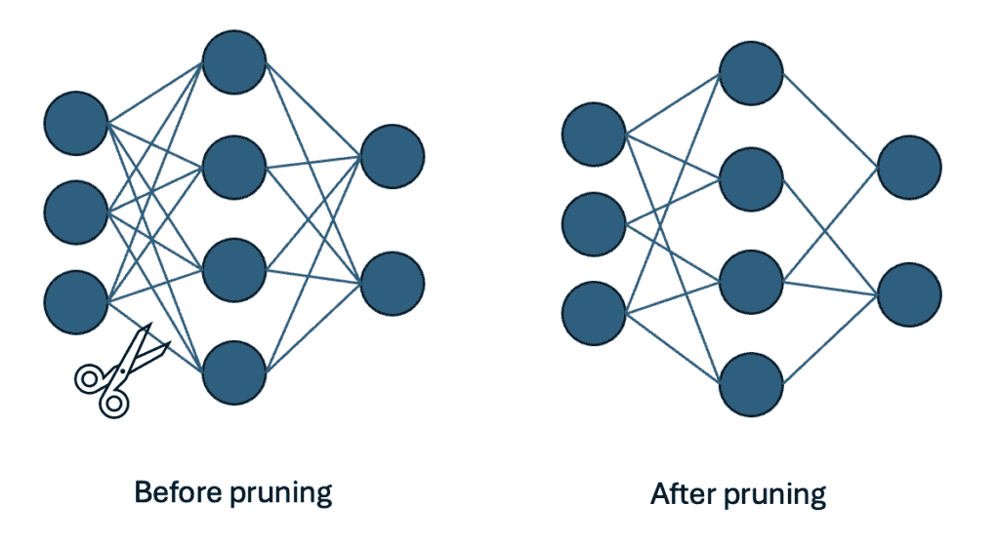
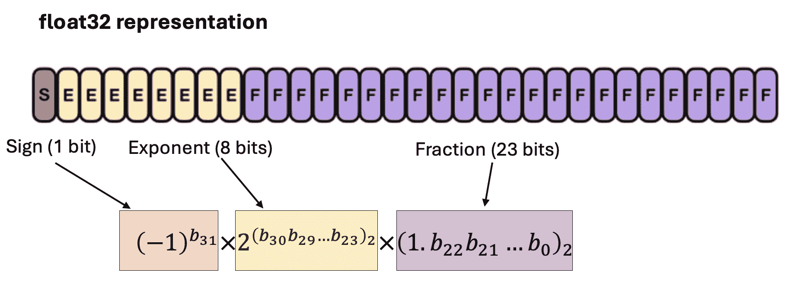
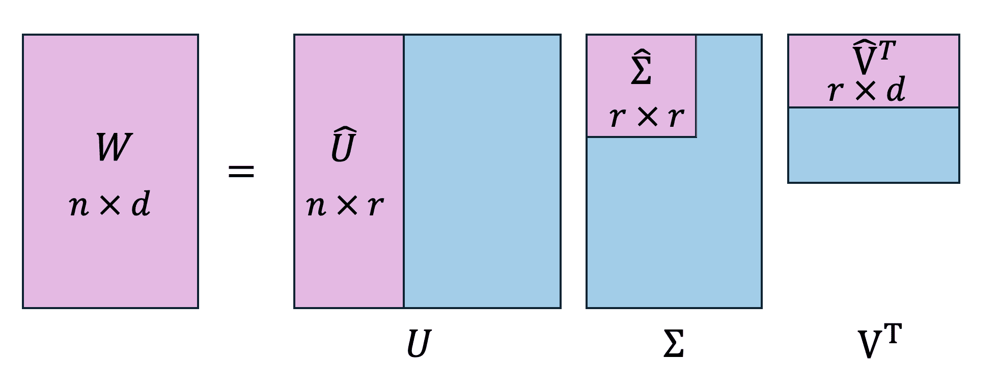
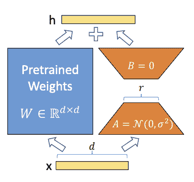
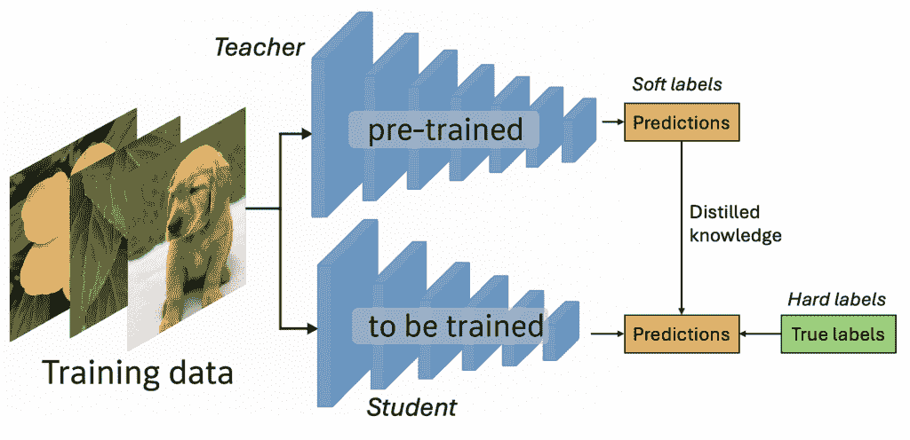

# 模型压缩：让您的机器学习模型更轻、更快

> 原文：[`towardsdatascience.com/model-compression-make-your-machine-learning-models-lighter-and-faster/`](https://towardsdatascience.com/model-compression-make-your-machine-learning-models-lighter-and-faster/)

## <mdspan datatext="el1746560110734" class="mdspan-comment">引言</mdspan>

无论您是在准备面试还是在工作中构建机器学习系统，模型压缩已经成为一项必备技能。在 LLMs 时代，模型越来越大，将这些模型压缩以使其更高效、更小，并能在轻量级机器上使用，这些挑战从未如此相关。

在这篇文章中，我将介绍每个机器学习从业者都应该理解和掌握的四种基本压缩技术。我将探讨剪枝、量化、低秩分解和知识蒸馏，每种方法都提供了独特的优势。我还会为这些方法添加一些最小的 PyTorch 代码示例。

希望您喜欢这篇文章！

* * *

+   欢迎在 [LinkedIn](https://www.linkedin.com/in/maxime-wolf/) 上与我联系！

+   关注我的 GitHub [GitHub](https://github.com/maxime7770) 并访问我的网站 [我的网站](http://maximewolf.com) 获取更多内容。

* * *

## 模型剪枝

剪枝可能是最直观的压缩技术。其想法非常简单：移除网络中的一些权重，要么随机移除，要么**移除“不那么重要”的权重**。当然，当我们谈论神经网络中的“移除”权重时，这意味着**将权重设置为 0**。



模型剪枝（图片由作者和 ChatGPT 提供 | 灵感来源：[3]）

### 结构化剪枝与无结构剪枝

让我们从**简单的启发式方法**开始：移除小于阈值的权重。

\[ w’_{ij} = \begin{cases} w_{ij} & \text{if } |w_{ij}| \ge \theta_0 \\

0 & \text{if } |w_{ij}| < \theta_0

\end{cases} \]

当然，这并不理想，因为我们需要找到一种方法来**找到合适阈值**！一个更实际的方法是移除一层中**幅度最小**的指定比例的权重。在单层中实现剪枝有 2 种常见方法：

+   **结构化剪枝**：移除网络中的整个组件（例如，权重张量中的随机行，或卷积层中的随机通道）

+   **无结构剪枝**：无论权重位置如何，无论张量结构如何，都移除单个权重

我们也可以使用**全局剪枝**与上述两种方法中的任何一种。这将移除多个层中选择的权重比例，并且可能根据每层的参数数量具有不同的移除率。

PyTorch 使这个过程非常直接（顺便说一句，你可以在我的 GitHub 仓库 [我的 GitHub 仓库](https://github.com/maxime7770/Model-Compression) 中找到所有代码片段）。

```py
import torch.nn.utils.prune as prune

# 1\. Random unstructured pruning (20% of weights at random)
prune.random_unstructured(model.layer, name="weight", amount=0.2)                           

# 2\. L1‑norm unstructured pruning (20% of smallest weights)
prune.l1_unstructured(model.layer, name="weight", amount=0.2)

# 3\. Global unstructured pruning (40% of all weights by L1 norm across layers)
prune.global_unstructured(
    [(model.layer1, "weight"), (model.layer2, "weight")],
    pruning_method=prune.L1Unstructured,
    amount=0.4
)                                             

# 4\. Structured pruning (remove 30% of rows with lowest L2 norm)
prune.ln_structured(model.layer, name="weight", amount=0.3, n=2, dim=0)
```

*注意：如果你上过统计学课程，你可能学过正则化诱导的方法，这些方法在训练过程中也隐式地剪枝了一些权重，通过使用 L0 或 L1 范数正则化。剪枝与它不同，因为它是一种**模型压缩后的后处理技术***

### 为什么剪枝有效？彩票假设


由 ChatGPT 生成的图片

我想用对彩票假设的简要提及来结束这一节，彩票假设既是剪枝的应用，也是对去除权重如何经常提高模型的一个有趣的解释。我建议阅读相关的论文（[7]）以获取更多细节。

作者使用了以下程序：

1.  训练完整模型直到收敛

1.  剪枝最小幅度的权重（比如 10%）

1.  将剩余的权重重置为其原始初始化值

1.  重新训练这个剪枝网络

1.  重复这个过程多次

经过 30 次这样的操作后，你最终只剩下原始参数的 0.9³⁰ ~ 4%。而且令人惊讶的是，**这个网络的表现可以和原始网络一样好**。

这表明存在重要的参数冗余。换句话说，存在一个**子网络**（“一张彩票”）实际上做了大部分工作！

> 剪枝是揭示这个子网络的一种方法。

<details class="wp-block-details is-layout-flow wp-block-details-is-layout-flow"><summary>我推荐这个非常好的视频，它涵盖了这一主题！</summary></details>

## 量化

虽然剪枝侧重于完全删除参数，但量化采取不同的方法：**降低每个参数的精度**。

记住，计算机中存储的每个数字都是一个位序列。float32 值使用 32 位（见下面的示例图片），而 8 位整数（int8）仅使用 8 位。



一个如何用 32 位表示 float32 数字的例子（图片由作者和 ChatGPT 提供 | 灵感来源：[2]）

大多数深度学习模型都是使用 32 位浮点数（FP32）进行训练的。量化将这些高精度值转换为**低精度格式**，如 16 位浮点数（FP16）、8 位整数（INT8）或甚至 4 位表示。

这里的节省是显而易见的：**INT8 相比于 FP32 需要 75% 更少的内存**。但我们是如何实际进行这种转换而不破坏模型性能的呢？

### 量化背后的数学原理

要将浮点数转换为整数表示，我们需要将值的连续范围映射到一组**离散的整数**。对于 INT8 量化，我们映射到 256 个可能值（从 -128 到 127）。

假设我们的权重被归一化在 -1.0 和 1.0 之间（这在深度学习中很常见）：

\[ \text{scale} = \frac{\text{float\_max} – \text{float\_min}}{\text{int8\_max} – \text{int8\_min}} = \frac{1.0 – (-1.0)}{127 – (-128)} = \frac{2.0}{255} \]

然后，量化值由以下公式给出

\[\text{quantized_value} = \text{round}(\frac{\text{original_value}}{\text{scale}} \] + \text{zero_point})

这里，`zero_point=0`因为我们希望 0 映射到 0。然后我们可以将此值四舍五入到最接近的整数，以获得介于-127 和 128 之间的整数。

并且，正如你所猜到的：要将整数转换回浮点数，我们可以使用逆操作：\[\text{float_value} = \text{integer_value} \times \text{scale} – \text{zero_point} \]

*注意：在实际应用中，缩放因子是基于我们量化的范围值确定的。*

### 如何应用量化？

量化可以在**不同阶段**和**不同策略**下应用。以下是一些值得了解的技术：（以下，“激活”一词指每一层的输出值）

+   **训练后量化（PTQ）**：

    +   **静态量化**：在训练后和推理前离线量化权重和激活

    +   **动态量化**：离线量化**权重**，但在推理过程中**实时**量化激活。这与离线量化不同，因为缩放因子是基于推理过程中看到的值确定的。

+   **量化感知训练（QAT）**：通过四舍五入值在训练期间模拟量化，但计算仍然使用浮点数。这使得模型学习到对量化更鲁棒的权重，这些权重将在训练后应用。在底层，这个想法是**添加“假”操作**：`x -> dequantize(quantize(x))`：这个新值接近 x，但它仍然有助于模型**容忍 8 位舍入和截断噪声**。

```py
import torch.quantization as tq

# 1\. Post‑training static quantization (weights + activations offline)
model.eval()
model.qconfig = tq.get_default_qconfig('fbgemm') # assign a static quantization config
tq.prepare(model, inplace=True)
# we need to use a calibration dataset to determine the ranges of values
with torch.no_grad():
    for data, _ in calibration_data:
        model(data)
tq.convert(model, inplace=True) # convert to a fully int8 model

# 2\. Post‑training dynamic quantization (weights offline, activations on‑the‑fly)
dynamic_model = tq.quantize_dynamic(
    model,
    {torch.nn.Linear, torch.nn.LSTM}, # layers to quantize
    dtype=torch.qint8
)

# 3\. Quantization‑Aware Training (QAT)
model.train()
model.qconfig = tq.get_default_qat_qconfig('fbgemm')  # set up QAT config
tq.prepare_qat(model, inplace=True) # insert fake‑quant modules
# [here, train or fine‑tune the model as usual]
qat_model = tq.convert(model.eval(), inplace=False) # convert to real int8 after QAT
```

**量化非常灵活**！你可以将不同的精度级别应用于模型的各个部分。例如，你可能会将大多数线性层量化为 8 位以实现最大速度和内存节省，同时将关键组件（例如注意力头或批归一化层）保留在 16 位或全精度。

## 低秩分解

现在让我们谈谈低秩分解——这是一种随着 LLMs 的兴起而流行起来的方法。

关键观察：神经网络中的许多权重矩阵的有效秩远低于其维度所暗示的。用简单的话说，这意味着参数中存在大量的**冗余**。

*注意：如果你曾经使用 PCA 进行降维，你已经在某种程度上遇到了低秩近似的形态。PCA 将大矩阵分解为较小、低秩因子的乘积，尽可能保留信息。*

### 低秩分解背后的线性代数

以权重矩阵 W 为例。每个实矩阵都可以使用**奇异值分解**（SVD）来表示：

\[ W = U\Sigma V^T \]

其中Σ是一个对角矩阵，其奇异值按非递增顺序排列。正系数的数量实际上对应于矩阵 W 的秩。



SVD 可视化矩阵秩为 r（图片由作者和 ChatGPT 提供 | 灵感来源：[5]）

为了用秩为 k < r 的矩阵近似 W，**我们可以选择 sigma 的 k 个最大元素**，以及 U 和 V 的对应的前 k 列和前 k 行：

\[ \begin{aligned} W_k &= U_k\,\Sigma_k\,V_k^T

\\[6pt] &= \underbrace{U_k\,\Sigma_k^{1/2}}_{A\in\mathbb{R}^{m\times k}} \underbrace{\Sigma_k^{1/2}\,V_k^T}_{B\in\mathbb{R}^{k\times n}}. \end{aligned} \]

看看新的矩阵如何**分解为 A 和 B 的乘积**，此时参数总数现在为 `m * k + k * n = k*(m+n)` 而不是 `m*n`！这是一个**巨大的改进**，尤其是当 k 远小于 `m` 和 `n` 时。

在实践中，这相当于用两个连续的线性层替换一个线性层 x → Wx：x → A(Bx)。

### 在 PyTorch

我们可以在**训练前**应用低秩分解（将每个线性层参数化为**两个较小的矩阵**——这实际上不是一个压缩方法，而是一种设计选择）或**训练后**（在权重矩阵上应用**截断奇异值分解**）。第二种方法是最常见的，下面将进行实现。

```py
import torch

# 1\. Extract weight and choose rank
W = model.layer.weight.data # (m, n)
k = 64 # desired rank

# 2\. Approximate low-rank SVD
U, S, V = torch.svd_lowrank(W, q=k) # U: (m, k), S: (k, k), V: (n, k)

# 3\. Form factors A and B
A = U * S.sqrt() # [m, k]
B = V.t() * S.sqrt().unsqueeze(1) # [k, n]

# 4\. Replace with two linear layers and insert the matrices A and B
orig = model.layer
model.layer = torch.nn.Sequential(
    torch.nn.Linear(orig.in_features, k, bias=False),
    torch.nn.Linear(k, orig.out_features, bias=False),
)
model.layer[0].weight.data.copy_(B)
model.layer[1].weight.data.copy_(A)
```

### LoRA：低秩近似的应用



LoRA 微调：W 是固定的，A 和 B 是训练的（来源：[1]）

我认为提到**LoRA**非常重要：如果你一直在关注**LLM 微调发展**，你可能已经听说过 LoRA（低秩自适应）。虽然它不是一个严格的压缩技术，但 LoRA 已经变得非常流行，可以有效地适应大型语言模型，并使微调变得非常高效。

这个想法很简单：在微调期间，而不是修改原始模型权重 W，LoRA 冻结它们并**学习可训练的低秩更新**：

$$W’ = W + \Delta W = W + AB$$

其中 A 和 B 是低秩矩阵。这允许通过仅使用一小部分参数进行特定任务的适应。

更好的是：**QLoRA** 通过结合量化与低秩自适应进一步扩展了这一概念！

再次强调，这是一个非常灵活的技术，可以在**各种阶段**应用。通常，LoRA 只应用于特定的层（例如，注意力层的权重）。

## 知识蒸馏



知识蒸馏过程（图片由作者和 ChatGPT 提供 | 灵感来源：[4]）

知识蒸馏采取了与我们迄今为止所看到的不同方法。它不是修改现有模型的参数，而是**从**一个**大**、**复杂**的模型（“教师”）**转移**到**一个**较小、更高效的模型（“学生”）的“知识”。目标是训练学生模型来**模仿**教师的行为并复制其性能，这通常比从头开始解决原始问题更容易。

### 蒸馏损失

让我们以分类问题为例解释一些概念：

+   **教师模型**通常是一个大型、复杂的模型，在手头的任务上取得了高性能

+   **学生模型**是一个第二、更小的模型，具有不同的架构，但针对相同任务进行了定制。

+   **软目标**：这些是教师模型的预测（**概率**，而不是标签！）它们将被学生模型用来模仿教师的行为。请注意，我们使用原始预测而不是标签，因为它们也包含了关于预测置信度的信息。

+   **温度**：除了教师的预测外，我们还在 softmax 函数中使用一个系数 T（称为温度）来从软目标中提取更多信息。增加 T 会软化分布，并帮助学生模型更加重视错误的预测。

在实践中，训练学生模型相当直接。我们**结合了常规损失**（基于硬标签的标准交叉熵损失）**和“蒸馏”损失**（基于教师的软目标）：

$$ L_{\text{total}} = \alpha L_{\text{hard}} + (1 – \alpha) L_{\text{distill}} $$

蒸馏损失仅仅是教师和学生分布之间的**KL 散度**（你可以将其视为两个分布之间距离的度量）。

$$ L_{\text{distill}} = D{KL}(q_{\text{teacher}} | | q_{\text{student}}) = \sum_i q_{\text{teacher}, i} \log \left( \frac{q_{\text{teacher}, i}}{q_{\text{student}, i}} \right) $$

至于其他方法，根据用例**调整此框架**是可能且鼓励的：例如，也可以比较学生和教师模型在网络中间层之间的 logits 和激活，而不仅仅是比较最终输出。

### 知识蒸馏实践

与之前的技术类似，有两种选择：

+   **离线蒸馏**：预训练的教师模型是固定的，并单独训练一个学生模型来模仿它。这两个模型完全独立，在蒸馏过程中**教师的权重保持冻结**。

+   **在线蒸馏**：两个模型同时训练，知识迁移发生在联合训练过程中。

以下是一个应用离线蒸馏的简单方法（本文的最后一个代码块哦 :)）：

```py
import torch.nn.functional as F

def distillation_loss_fn(student_logits, teacher_logits, labels, temperature=2.0, alpha=0.5):
    # Standard Cross-Entropy loss with hard labels
    student_loss = F.cross_entropy(student_logits, labels)

    # Distillation loss with soft targets (KL Divergence)
    soft_teacher_probs = F.softmax(teacher_logits / temperature, dim=-1)
    soft_student_log_probs = F.log_softmax(student_logits / temperature, dim=-1)

		# kl_div expects log probabilities as input for the first argument!
    distill_loss = F.kl_div(
        soft_student_log_probs,
        soft_teacher_probs.detach(), # don't calculate gradients for teacher
        reduction='batchmean'
    ) * (temperature ** 2) # optional, a scaling factor

    # Combine losses according to formula
    total_loss = alpha * student_loss + (1 - alpha) * distill_loss
    return total_loss

teacher_model.eval()
student_model.train()
with torch.no_grad():
     teacher_logits = teacher_model(inputs)
	 student_logits = student_model(inputs)
	 loss = distillation_loss_fn(student_logits, teacher_logits, labels, temperature=T, alpha=alpha)
	 loss.backward()
	 optimizer.step()
```

## 结论

感谢阅读这篇文章！在 LLMs 的时代，随着数十亿甚至数万亿参数的出现，模型压缩已成为一个基本概念，在几乎每个场景中都是使模型更高效和易于部署的必要条件。

但正如我们所看到的，模型压缩不仅仅是关于减小模型大小——它关乎深思熟虑的设计决策。无论是选择在线和离线方法，压缩整个网络，还是针对特定层或通道，每个选择都会**显著影响性能和可用性**。现在大多数模型**结合**了这些技术中的几种（例如，查看[这个模型](https://huggingface.co/RedHatAI/DeepSeek-R1-Distill-Llama-8B-quantized.w4a16)）。

除了介绍主要方法之外，我希望这篇文章也能激发你**进行实验并开发自己的创新解决方案**！

不要忘记查看 [GitHub 仓库](https://github.com/maxime7770/Model-Compression)，在那里你可以找到所有代码片段**以及本文讨论的四种压缩方法的并排比较**。

* * *

+   欢迎在 [LinkedIn](https://www.linkedin.com/in/maxime-wolf/) 上与我建立联系

+   关注我的 GitHub [GitHub](https://github.com/maxime7770) 获取更多内容

+   访问我的网站： [maximewolf.com](http://maximewolf.com/)

* * *

查看我的以前的文章：

> [LLaDA：可能重新定义语言生成的扩散模型](https://towardsdatascience.com/llada-the-diffusion-model-that-could-redefine-language-generation/)
> 
> [从 TRPO 到 GRPO 训练大型语言模型](https://towardsdatascience.com/training-large-language-models-from-trpo-to-grpo/)

* * *

## 参考文献

+   [1] **胡，E.，等人** (2021). [大型语言模型的低秩自适应](https://arxiv.org/pdf/2106.09685). *arXiv 预印本 arXiv:2106.09685*.

+   [2] **Lightning AI**. [使用混合精度技术加速大型语言模型](https://lightning.ai/pages/community/tutorial/accelerating-large-language-models-with-mixed-precision-techniques/). *Lightning AI 博客*.

+   [3] **TensorFlow 博客**. [TensorFlow 模型优化工具包中的剪枝 API](https://blog.tensorflow.org/2019/05/tf-model-optimization-toolkit-pruning-API.html). *TensorFlow 博客*，2019 年 5 月.

+   [4] **迈向人工智能**. [知识蒸馏的温和介绍](https://pub.towardsai.net/a-gentle-introduction-to-knowledge-distillation-6240bf8eb8ea). *Towards AI*，2022 年 8 月.

+   [5] **朱，A.** [机器学习算法：奇异值分解 (SVD)](https://www.linkedin.com/pulse/ml-algorithm-singular-value-decomposition-angela-ju/). *LinkedIn 脉搏*.

+   [6] **算法简洁性**. [这就是大型语言模型理解世界的原因](https://www.youtube.com/watch?v=UKcWu1l_UNw). *YouTube*，2023 年 4 月.

+   [7] **Frankle，J.，与 Carbin，M.** (2019). [彩票假设：寻找稀疏、可训练的神经网络](https://arxiv.org/abs/1803.03635). *arXiv 预印本 arXiv:1803.03635*.
