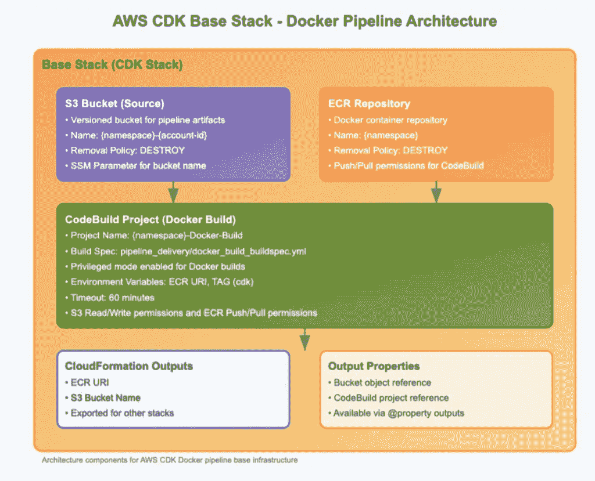
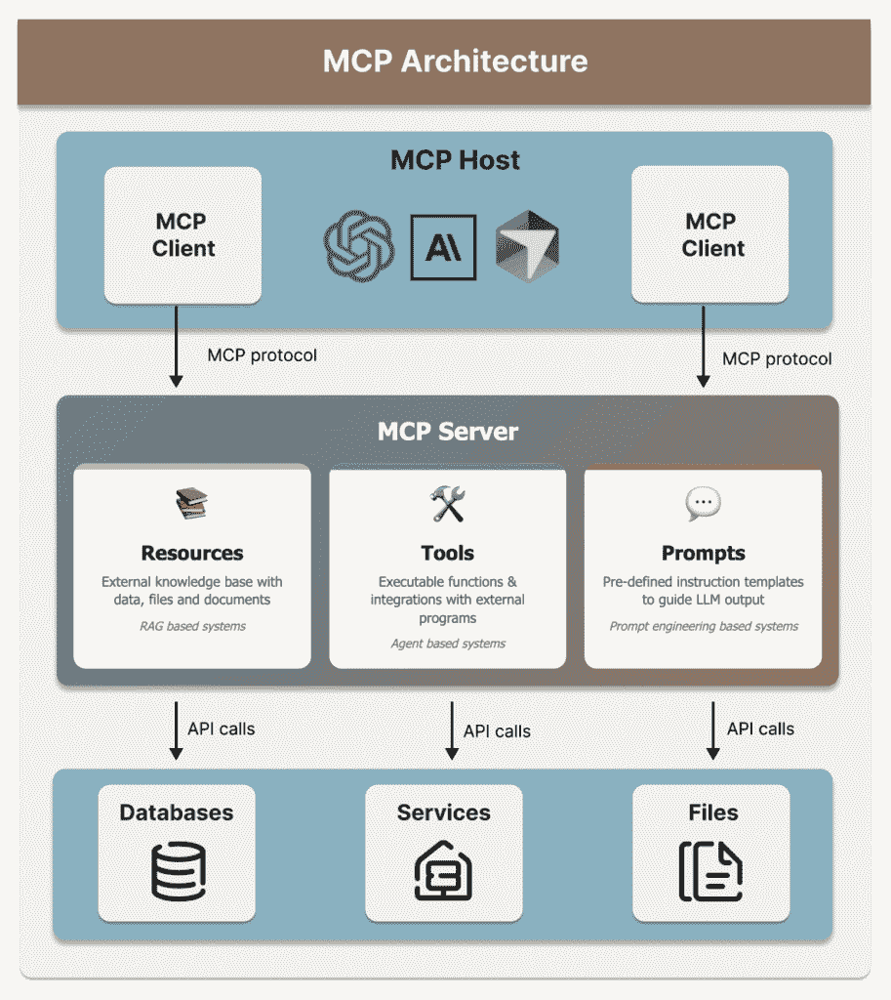
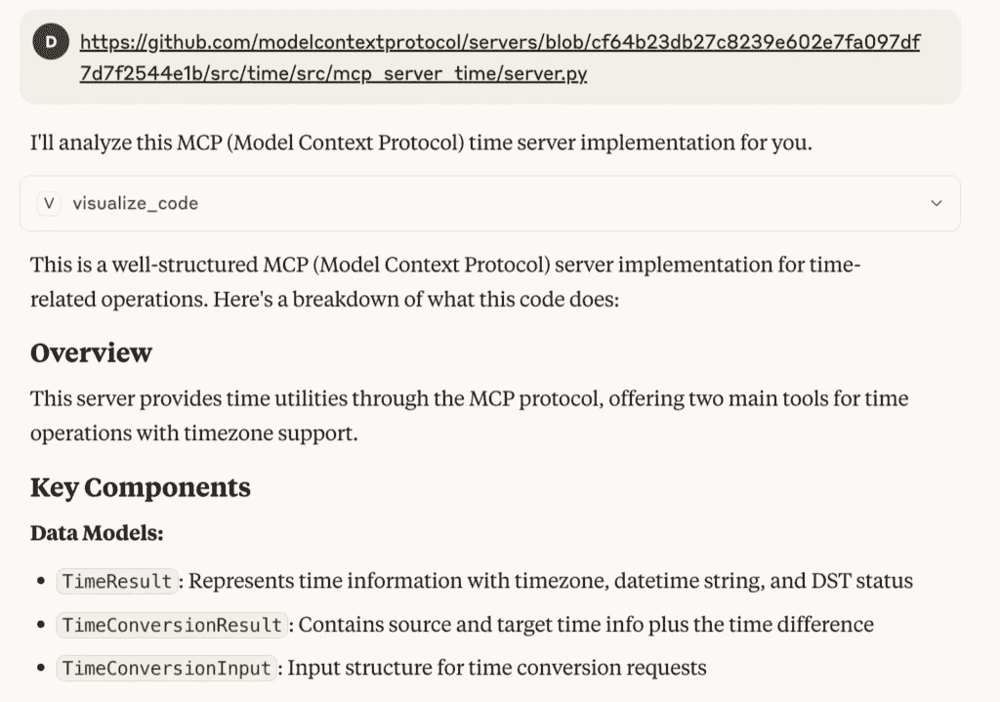
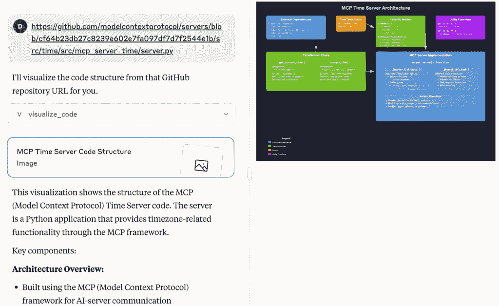
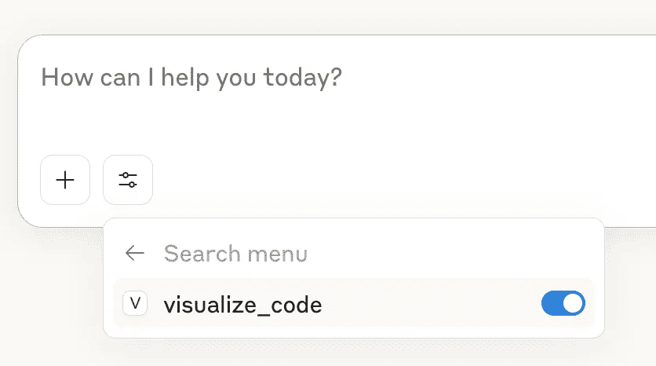
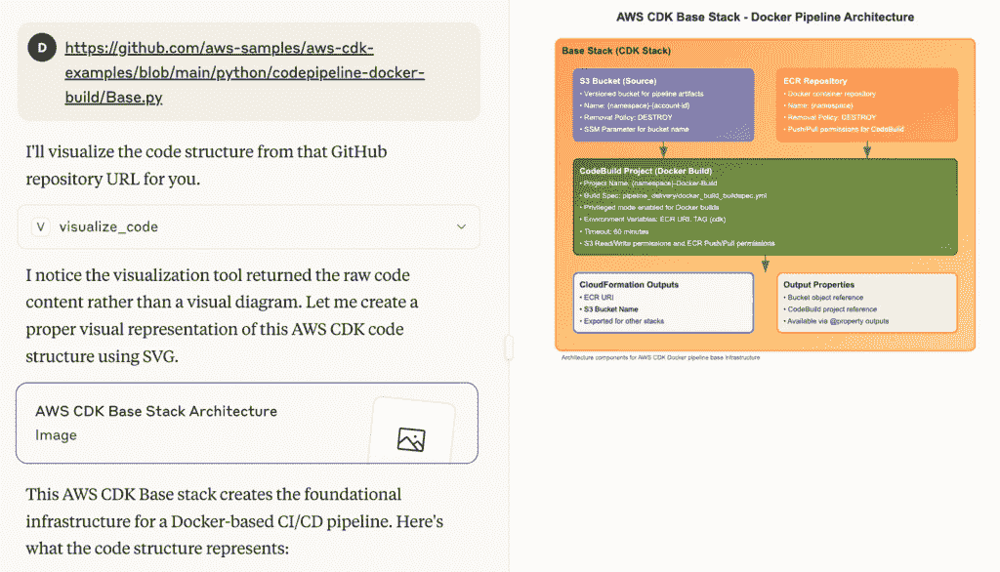

# 模型上下文协议（MCP）教程：6 步构建您的第一个 MCP 服务器

> 原文：[`towardsdatascience.com/model-context-protocol-mcp-tutorial-build-your-first-mcp-server-in-6-steps/`](https://towardsdatascience.com/model-context-protocol-mcp-tutorial-build-your-first-mcp-server-in-6-steps/)

## <mdspan datatext="el1749670714968" class="mdspan-comment">什么是模型上下文协议（MCP）</mdspan>？

近年来，随着 AI 代理和基于 RAG 的应用的出现，对通过集成外部资源（例如基于 RAG 的系统）和工具（例如基于代理的系统）来定制大型语言模型（LLMs）的需求不断增加。这通过结合外部知识并启用自主任务执行，增强了 LLMs 现有的功能。

模型上下文协议（MCP），首次由 Anthropic 于 2024 年 11 月推出，因其提供了一种更连贯、更一致的方式将 LLMs 与外部工具和资源连接起来，因此越来越受欢迎，成为为每个用例构建自定义 API 集成的有吸引力的替代方案。MCP 是一个标准化、开源的协议，它提供了一个一致的接口，使 LLM 能够与各种外部工具和资源交互，从而允许最终用户使用具有增强功能的 MCP 服务器。与当前的代理系统设计模式相比，MCP 提供了几个关键优势：

+   通过标准化集成提高系统的可扩展性和可维护性。

+   由于单个 MCP 服务器实现可以与多个 MCP 客户端协同工作，因此可以减少重复的开发工作。

+   通过提供在 LLM 提供商之间切换的灵活性来避免供应商锁定，因为 LLM 不再与代理系统紧密耦合。

+   通过允许快速创建可工作的产品，显著加快开发过程。

本文旨在指导您了解模型上下文协议的基础知识以及构建 MCP 服务器的基本组件。我们将通过以下实际示例来应用这些概念：构建一个 MCP 服务器，该服务器允许 LLMs 通过简单地提供类似以下示例的 URL 来总结和可视化 GitHub 代码库。

**用户输入：**

[`https://github.com/aws-samples/aws-cdk-examples/blob/main/python/codepipeline-docker-build/Base.py`](https://github.com/aws-samples/aws-cdk-examples/blob/main/python/codepipeline-docker-build/Base.py)

**MCP 输出：**



* * *

## 理解 MCP 组件



### MCP 架构

MCP 采用客户端-服务器架构，其中客户端是请求集中式服务器提供服务的设备或应用程序。客户端与服务器之间的关系可以用客户与餐厅的类比来帮助理解。客户（客户端）就像客户端，通过点菜单发送请求，而餐厅则类似于服务器，提供如菜品和座位等服务。餐厅拥有足够的资源在短时间内服务多个客户，而客户只需担心接收他们的订单。

MCP 架构由三个组件组成：**MCP 服务器、MCP 客户端和 MCP 主机**。**MCP 服务器**提供工具和资源，通过结构化请求暴露 AI 模型可以利用的功能。**MCP 主机**提供运行时环境，管理客户端和服务器之间的通信，例如 Claude 桌面或具有 MCP 支持扩展的 IDE。如果我们继续使用上述客户-餐厅类比，MCP 主机可以被视为一个餐厅管理系统，它协调客户（客户端）和餐厅之间的通信，处理订单接收和支付处理。**MCP 客户端**通常内置在主机应用程序中，允许用户通过界面与服务器交互。然而，也有灵活性来开发针对特定用例和需求定制的 MCP 客户端，例如使用 Streamlit 构建简单的 AI 网络应用，以支持更多的前端功能。

### MCP 服务器组件

在这篇文章中，我们将专注于理解 MCP 服务器，并将我们的知识应用于构建一个简单、定制的 MCP 服务器。MCP 服务器围绕各种外部工具和资源的 API 调用，使客户端能够访问这些功能，而无需担心额外的设置。MCP 服务器支持整合三种类型的组件，这符合三种常见的 LLM 定制策略。

+   **资源**是数据、文件和文档，它们作为外部知识库，用于丰富 LLM（大型语言模型）现有的知识。这在基于 RAG（检索增强生成）的系统尤其有用。

+   **工具**是可执行函数和与其他程序的集成，用于丰富 LLM 的动作空间，例如执行 Google 搜索、创建 Figma 原型等，这些可以在基于代理的系统中被利用。

+   **提示**是预定义的指令模板，用于指导 LLM 的输出，例如以专业或随意的语调进行回应。这在受益于提示工程技术的系统中非常有用。

如果你想了解更多关于 LLM 定制策略的信息，请查看我之前关于“[简要解释 6 种常见的 LLM 定制策略](https://towardsdatascience.com/6-common-llm-customization-strategies-briefly-explained/)”的文章和视频。

* * *

## 在 6 个步骤中构建您的 MCP 服务器

我们将使用一个简单的示例来演示如何使用 Python 构建您的第一个 MCP 服务器，这允许调用自定义的`visualize_code`工具，将从中提取的原始代码文件转换为如下示例中的可视化图表。


对于有数据科学背景的人学习构建 MCP 服务器，有几个软件开发概念可能不熟悉但很重要，包括处理异步操作时的异步编程、客户端/服务器架构以及用于修改函数行为的 Python 装饰器。随着我们通过这个实际示例进行讲解，我们将更详细地解释这些概念。

*要观看视频教程，请访问“在 6 步中构建您的第一个 MCP 服务器”*：

### 第 1 步：环境设置

+   软件包管理器设置：MCP 使用`uv`作为默认的软件包管理器。对于 macOS 和 Linux 系统，安装`uv`并使用 shell 命令`sh`执行它：


+   在新工作目录`/visual`中初始化，激活虚拟环境，创建项目结构以存储主脚本`visual.py`：

```py
# Create a new directory for our project
uv init visual
cd visual

# Create virtual environment and activate it
uv venv
source .venv/bin/activate

# Install dependencies
uv add "mcp[cli]" httpx

# Create our server file
touch visual.py
```

+   安装所需的依赖项：`pip install mcp httpx fastapi uvicorn`

**进一步阅读：**

Anthropic 的官方博客文章“[为服务器开发者 - 模型上下文协议](https://modelcontextprotocol.io/quickstart/server)”提供了一个易于遵循的指南，用于设置 MCP 服务器开发环境。

### 第 2 步：基本服务器设置

在`visual.py`脚本中，导入所需的库，初始化我们的 MCP 服务器实例，并定义用于发起 HTTP 请求的用户代理。我们将使用[FastMCP](https://gofastmcp.com/getting-started/welcome)作为官方 Python MCP SDK。

```py
from typing import Any
import httpx
from mcp.server.fastmcp import FastMCP

# Initialize FastMCP server
mcp = FastMCP("visual_code_server")
```

### 第 3 步：创建辅助函数

我们将创建一个辅助函数`get_code()`来从 GitHub URL 获取代码。

```py
async def get_code(url: str) -> str:
    """
    Fetch source code from a GitHub URL.

    Args:
        url: GitHub URL of the code file
    Returns:
        str: Source code content or error message
    """
    USER_AGENT = "visual-fastmcp/0.1"

    headers = {
        "User-Agent": USER_AGENT,
        "Accept": "text/html"
    }

    async with httpx.AsyncClient() as client:
        try:
            # Convert GitHub URL to raw content URL
            raw_url = url.replace("github.com", "raw.githubusercontent.com")\
                        .replace("/blob/", "/")
            response = await client.get(raw_url, headers=headers, timeout=30.0)
            response.raise_for_status()
            return response.text
        except Exception as e:
            return f"Error fetching code: {str(e)}"
```

让我们将`get_code()`函数分解为几个组件。

**异步实现**

异步编程允许多个操作并发运行，通过在等待操作完成时不阻塞执行来提高效率。它通常用于高效处理 I/O 操作，如网络请求、用户输入和 API 调用。相比之下，同步操作通常用于机器学习任务，是顺序执行的，每个操作在移动到下一个任务之前都会阻塞直到完成。以下是对定义此函数的异步操作所做的更改：

+   函数使用`async def`声明，以允许并发处理多个操作。

+   使用`async with`上下文管理器和`httpx.AsyncClient()`进行非阻塞 HTTP 请求。

+   通过在`client.get()`中添加`await`关键字来处理异步 HTTP 请求。

**URL 处理**

配置接受 HTML 内容的 Accept 头，并设置适当的 User-Agent 以识别发起 HTTP 请求的客户端，即`visual-fastmcp/0.1`。将常规 GitHub URL 转换为原始文件格式。

**错误处理**

捕获 HTTP 特定异常（`httpx.RequestError`，`httpx.HTTPStatusError`）并捕获其他通用异常处理作为后备，然后返回描述性错误消息以进行调试。

**进一步阅读：**

+   [Python AsyncIO 文档](https://docs.python.org/3/library/asyncio.html)

+   [同步和异步编程](https://www.geeksforgeeks.org/javascript/synchronous-and-asynchronous-programming/)

### 第 4 步：实现 MCP 服务器工具

使用几行额外的代码，我们现在可以创建我们的主要 MCP 服务器工具 `visualize_code()`。

```py
@mcp.tool()
async def visualize_code(url: str) -> str:
    """
    Visualize the code extracted from a Github repository URL in the format of SVG code.

    Args:
        url: The GitHub repository URL

    Returns:
        SVG code that visualizes the code structure or hierarchy.
    """

    code = await get_code(url)
    if "error" in code.lower():
        return code
    else:
        return "\n---\n".join(code)
    return "\n".join(visualization)
```

**装饰器**

Python 装饰器是一个特殊函数，它**修改或增强另一个函数或方法的行为**，而不改变其原始代码。FastMCP 提供装饰器，可以将自定义函数包装起来以将其集成到 MCP 服务器中。例如，我们使用 `@mcp.tool()` 通过装饰 `visualize_code` 函数来创建 MCP 服务器工具。同样，我们可以使用 `@mcp.resource()` 为资源，使用 `@mcp.prompt()` 为提示。

**类型提示和文档字符串**

FastMCP 类利用 Python 类型提示和文档字符串自动增强工具定义，简化了 MCP 工具的创建和维护。对于我们的用例，我们使用类型提示 `visualize_code(url: str) -> str` 创建工具函数，接受字符串格式的输入参数 `url`，并生成从源文件中提取的所有代码的合并字符串。然后，添加以下文档字符串以帮助 LLM 理解工具的使用。

```py
 """
    Visualize the code extracted from a Github repository URL in the format of SVG code.

    Args:
        url: The GitHub repository URL

    Returns:
        SVG code that visualizes the code structure or hierarchy.
    """
```

让我们通过调用 Claude 桌面版中的 MCP 服务器来比较带有和没有文档字符串提供的 MCP 工具函数。

*没有文档字符串的模型输出 – 只生成文本摘要*



*带有文档字符串提供的模型输出 – 生成文本摘要和图表*



**进一步阅读：**

+   [Python 类型提示教程](https://realpython.com/python-type-checking/)

+   [Python 装饰器指南](https://realpython.com/primer-on-python-decorators/)

### 第 5 步：配置 MCP 服务器

将主要执行块作为 `visual.py` 脚本的最后一步添加。使用简单的 I/O 传输在本地运行服务器，使用 “stdio”。在您的本地机器上运行代码时，MCP 服务器位于您的本地机器上，并监听来自 MCP 客户端的工具请求。对于生产部署，您可以配置不同的传输选项，例如为基于 Web 的部署配置 “streamable-http”。

```py
if __name__ == "__main__":
    mcp.run(transport='stdio')
```

### 第 6 步：从 Claude 桌面版使用 MCP 服务器

我们将通过 Claude 桌面版演示如何使用此 MCP 服务器，但请注意，它允许通过稍微调整配置将服务器连接到不同的主机（例如 Cursor）。查看 “[Claude 桌面版用户 – 模型上下文协议](https://modelcontextprotocol.io/quickstart/user)” 获取 Claude 的官方指南。

1.  下载 [Claude 桌面版](https://claude.ai/download)

1.  在你的本地文件夹`~/Library/Application\\ Support/Claude/claude_desktop_config.json`（对于 MacOS）中设置服务器设置配置文件，并将`<PARENT_FOLDER_ABSOLUTE_PATH>`更新为你的工作文件夹路径。

```py
{
    "mcpServers": {
        "visual": {
            "command": "uv",
            "args": [
                "--directory",
                "<PARENT_FOLDER_ABSOLUTE_PATH>/visual",
                "run",
                "visual.py"
            ]
        }
    }
}
```

1.  使用命令行运行它：`uv --directory <PARENT_FOLDER_ABSOLUTE_PATH>/visual run visual.py`

1.  启动（或重启）Claude 桌面，选择“搜索和工具”然后“视觉”。你应该能够切换到我们刚刚创建的`visualize_code`工具。



1.  通过提供 GitHub URL 尝试可视化工具，例如：



* * *

## 带回家的信息

本文概述了 MCP 架构（MCP 客户端、主机和服务器），主要关注 MCP 服务器组件和应用。它指导如何构建一个自定义 MCP 服务器，该服务器可以从 GitHub 仓库实现代码到图表的转换。

构建自定义 MCP 服务器的关键步骤：

1.  环境设置

1.  基本服务器设置

1.  创建辅助函数

1.  实现 MCP 工具

1.  配置 MCP 服务器

1.  从 Claude 桌面使用 MCP 服务器

如果你对此感兴趣，可能的探索方向包括在云服务提供商上探索远程 MCP 服务器，实现安全特性和健壮的错误处理。

### 更多类似内容

+   [简要解释 6 种常见的 LLM 定制策略](https://www.visual-design.net/post/6-common-llm-customization-strategies-briefly-explained)

+   [基于 Transformer 的主题建模 BERTopic 实用指南](https://towardsdatascience.com/a-practical-guide-to-bertopic-for-transformer-based-topic-modeling/)
