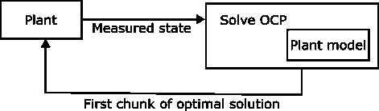
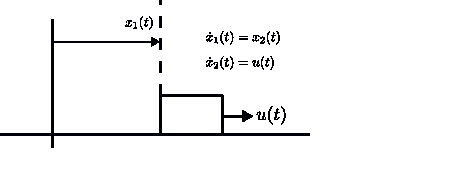
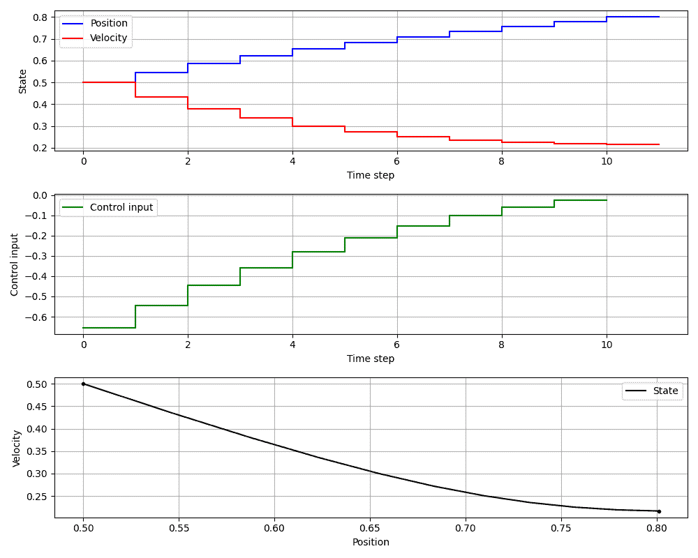
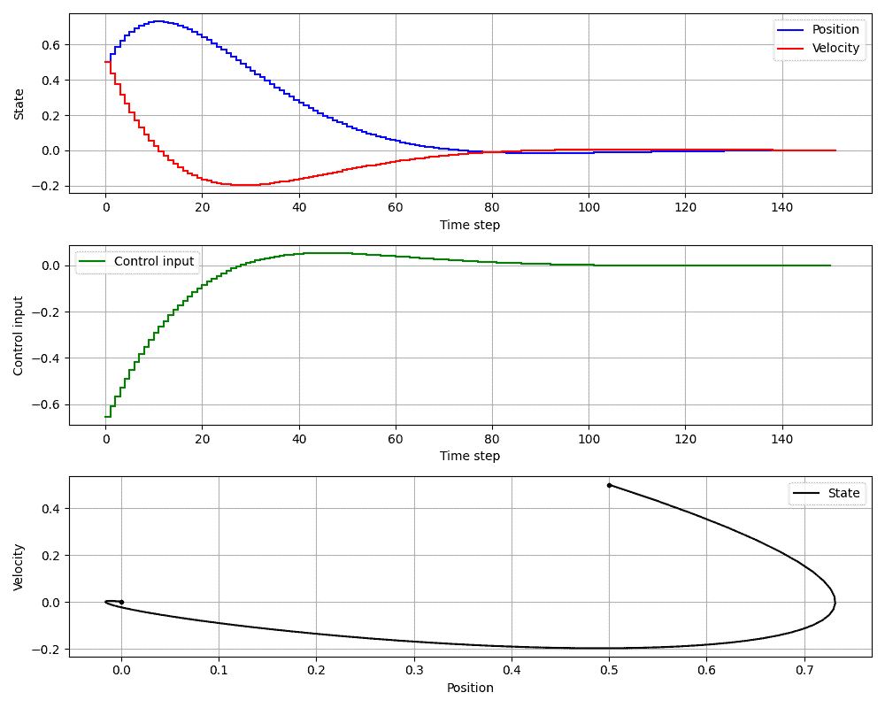
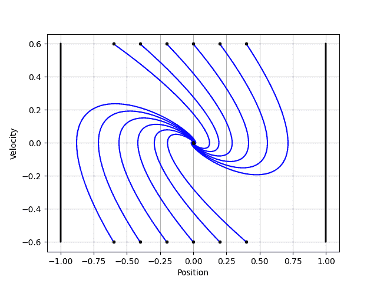

# 模型预测控制基础

> 原文：[`towardsdatascience.com/model-predictive-control-basics/`](https://towardsdatascience.com/model-predictive-control-basics/)

## 快速 <mdspan datatext="el1755021751091" class="mdspan-comment">总结</mdspan>

在本文中，我们将：

+   涵盖基本思想。

+   在 Python 中编写一个求解器。

+   玩一个简单的线性系统：双积分器。

+   在这里获取所有代码：[`github.com/willem-daniel-esterhuizen/MPC_tutorial`](https://github.com/willem-daniel-esterhuizen/MPC_tutorial)

## 1. 引言

模型预测控制（MPC）是一种流行的反馈控制方法，其中在每个迭代中，通过更新的测量状态迭代地解决一个有限时域最优控制问题（OCP）。



MPC 循环。图片由作者提供。

在 OCP 中，使用植物的模型来找到在考虑的有限时域上的最优开环控制。因为模型不能完全捕捉真实植物的动态，而且在现实世界中系统会受到噪声和干扰，所以只应用最优开环控制的第一部分，并定期测量状态以重新解决 OCP。这闭合了回路并创建了一个反馈。

它背后的数学相对简单直观（尤其是与鲁棒控制等事物相比），编写 MPC 控制器也很容易。其他优点是它可以有效地处理状态和控制上的硬约束和软约束（硬约束是严格的，而软约束通过在成本函数中惩罚来执行）并且它通常可以用于具有非凸约束的非线性系统（当然，这取决于这些约束有多糟糕！）。唯一的缺点是您需要“在线”实时解决优化问题，如果您正在控制一个快速系统或计算资源有限，这可能会成为一个问题。

### 1.2 运行示例

在整篇文章中，我将考虑使用零阶保持控制（即分段常数控制）的双积分器作为代码中的运行示例。连续时间系统如下：

\[

\begin{align*}

\dot x _1(t) & = x_2(t),\\

\dot x _2(t) & = u(t),

\end{align*}

\]

with \(t \in \mathbb{R} \) 表示时间。在这里 \( x_1(t) \in \mathbb{R} \) 是位置，而 \( x_2(t) \in \mathbb{R} \) 是速度。您可以想象这个系统是一个 1kg 的块在无摩擦的桌子上滑动，其中 \(u(t)\) 是施加的力。



运行示例：双积分器。图片由作者提供。

如果我们将控制约束为在长度为 0.1 秒的区间内分段常数，我们得到离散时间系统：

\[

\begin{align*}

x_{k+1} &= A x_k + Bu_k,

\end{align*}

\]

with \(k \in \mathbb{Z}\)，其中，

\[

\begin{align*}

A :=

\left(

\begin{array}{cc}

1 & 0.1\\

0 & 1

\end{array}

\right), \,\,

B :=

\left(

\begin{array}{c}

0.05\\

1

\end{array}

\right)

\end{align*}

\]

并且 \(x_k \in \mathbb{R}² \), \(u_k \in \mathbb{R} \)。 (注意，我在本文的其余部分使用 \(x_k\) 和 \(u_k\) 来指代离散时间系统的状态和控制，以使符号更简洁。)

并且 \(\Omega \) 表示所有可接受的对，

```py
import numpy as np
from scipy.signal import cont2discrete

A = np.array([[0, 1],[0, 0]])
B = np.array([[0],[1]])
C = np.array([[1, 0],[0, 1]])
D = np.array([[0, 0],[0, 0]])
dt = 0.1 # in seconds
discrete_system = cont2discrete((A, B, C, D), dt, method='zoh')
A_discrete, B_discrete, *_ = discrete_system
```

\(\mathbf{x}:= (x_0,x_1,…,x_{K})\in\mathbb{R}^{2(K+1)} \) 表示 *状态序列*。

## J(\mathbf{u},\mathbf{x}) :=\left( \sum_{k=0}^{K-1 }x_k^\top Q x_k + u_k^\top R u_k \right) + x_K^\top Q_K x_K

2\. 最优控制问题

\[

\begin{equation}

{\mathrm{OCP}(\bar x):}\begin{cases}

\min\limits_{\mathbf{u},\mathbf{x}} \quad & \sum_{k=0}^{K-1} \left(x_k^{\top}Qx_k + u_k^\top R u_k \right)+ x_{K}^\top Q_K x_{K}\\

\mathrm{约束条件：}\quad & x_{k+1} = Ax_k + Bu_k, &k \in[0:K-1], & \dots(1)\\

\quad & x_0 = \bar x , & & \dots(2) \\

\quad & x_k\in [-1,1]\times(-\infty,\infty),& k \in[1:K], & \dots(3)\\

\]

\end{cases}

\end{equation}

此外，我们还将让，

其中，

+   **如果您觉得这篇文章很有趣**，请考虑查看博客 [topicincontrol.com](http://topicsincontrol.com)。它深入探讨了控制理论、优化和相关主题，通常还提供免费代码。

+   \(k\in\mathbb{Z}\) 表示离散时间步长，

+   \([p:q]\)，其中 \(p,q\in\mathbb{Z}\)，表示整数集合 \(\{p,p+1,…,q\}\)，

+   \(\bar x \in \mathbb{R}² \) 表示动力系统的 *初始条件*，

+   \(x_k\in\mathbb{R}² \) 表示第 \(k\) 步的 *状态*，

+   \(u\in\mathbb{R}\) 表示第 \(k\) 步的 *控制*，

+   \(Q\in\mathbb{R}^{2\times 2}\), \(R\in\mathbb{R}\) 和 \(Q_K \in \mathbb{R}^{2\times 2}\) 是指定成本函数的正定方阵（此处 \(R\) 是标量，因为 \(u\) 是标量）。

\(\mathbf{u}:= (u_0,u_1,…,u_{K−1})\in\mathbb{R}^K \) 表示 *控制序列*，

+   \quad & u_k\in [-1,1],& k \in[0:K-1], & \dots(4)

+   您可以使用 scipy 包的 cont2discrete 函数来获取此离散时间系统，如下所示：

为了严谨起见，我们将说，如果这对 \((\mathbf{u}^{*}, \mathbf{x}^{*})\in\mathbb{R}^K \times \mathbb{R}^{2(K+1)}\) 在所有可接受的对中使成本函数最小化，那么它就是 \( \mathrm{OCP}(\bar{x})\) 的 *解*，

\[

其中 \(J:\mathbb{R}^K \times \mathbb{R}^{2(K+1)}\rightarrow \mathbb{R}_{\geq 0} \) 是，

J(\mathbf{u}^{*}, \mathbf{x}^{*}) \leq J(\mathbf{u}, \mathbf{x}),\quad \forall (\mathbf{u},\mathbf{x})\in \Omega

\end{equation*}

\]

\(K\in\mathbb{R}_{\geq 0}\) 表示我们解决 OCP 的 *有限时间范围*，

\[

\begin{equation*}

\]

\end{equation*}

\]

我们将考虑以下离散时间最优控制问题 (OCP)：

\[

\Omega :=\{(\mathbf{u},\mathbf{x})\in \mathbb{R}^{K}\times \mathbb{R}^{2(K+1)} : (1)-(4)\,\, \mathrm{hold}\}.

\]

因此，最优控制问题是要找到一个控制和状态序列，\(( \mathbf{u}^{*},\mathbf{x}^{*})\)，在满足动力学，\(f\)，以及状态和控制约束，\(x_k\in[-1,1]\times(-\infty,\infty)\)，\(u_k \in [-1,1] \)，对于所有 \(k\) 的条件下，最小化成本函数。成本函数对控制器的性能至关重要。这不仅在于确保控制器表现良好（例如，防止信号异常），还在于指定闭环状态将稳定的*平衡点*。更多内容请见第四部分。

注意\(\mathrm{OCP}(\bar x) \)是如何根据初始状态\(\bar x \)来参数化的。这源于 MPC 背后的基本思想：最优控制问题是通过迭代使用更新的测量状态来解决的。

### 2.1 编写 OCP 求解器

CasADi 的*opti*堆栈使得设置和求解 OCP 变得非常容易。

首先，一些预备知识：

```py
from casadi import *

n = 2 # state dimension
m = 1 # control dimension
K = 100 # prediction horizon

# an arbitrary initial state
x_bar = np.array([[0.5],[0.5]]) # 2 x 1 vector

# Linear cost matrices (we'll just use identities)
Q = np.array([[1\. , 0],
            [0\. , 1\. ]])
R = np.array([[1]])
Q_K = Q

# Constraints for all k
u_max = 1
x_1_max = 1
x_1_min = -1
```

现在我们定义问题的决策变量：

```py
opti = Opti()

x_tot = opti.variable(n, K+1)  # State trajectory
u_tot = opti.variable(m, K)    # Control trajectory
```

接下来，我们施加动态约束并设置成本函数：

```py
# Specify the initial condition
opti.subject_to(x_tot[:, 0] == x_bar)

cost = 0
for k in range(K):
    # add dynamic constraints
    x_tot_next = get_x_next_linear(x_tot[:, k], u_tot[:, k])
    opti.subject_to(x_tot[:, k+1] == x_tot_next)

    # add to the cost
    cost += mtimes([x_tot[:,k].T, Q, x_tot[:,k]]) + \     
                           mtimes([u_tot[:,k].T, R, u_tot[:,k]])

# terminal cost
cost += mtimes([x_tot[:,K].T, Q_K, x_tot[:,K]])
```

```py
def get_x_next_linear(x, u):
    # Linear system
    A = np.array([[1\. , 0.1],
                [0\. , 1\. ]])
    B = np.array([[0.005],
                  [0.1  ]])

    return mtimes(A, x) + mtimes(B, u)
```

代码 mtimes([x_tot[:,k].T, Q, x_tot[:,k]])实现了矩阵乘法，\(x_k^{\top} Q x_k \)。

我们现在添加控制和状态约束，

```py
# constrain the control
opti.subject_to(opti.bounded(-u_max, u_tot, u_max))

# constrain the position only
opti.subject_to(opti.bounded(x_1_min, x_tot[0,:], x_1_max))
```

并求解：

```py
# Say we want to minimise the cost and specify the solver (ipopt)
opts = {"ipopt.print_level": 0, "print_time": 0}
opti.minimize(cost)
opti.solver("ipopt", opts)

solution = opti.solve()

# Get solution
x_opt = solution.value(x_tot)
u_opt = solution.value(u_tot)
```

我们可以使用 repo 的 plot_solution()函数绘制解决方案。

```py
from MPC_tutorial import plot_solution

plot_solution(x_opt, u_opt.reshape(1,-1)) # must reshape u_opt to (1,K)
```



OCP 解（开环）。图片由作者提供。

## **3\. 预测控制**

对于给定的\(\bar x\)，\( \mathrm{OCP}(\bar x) \)的解，\( (\mathbf{x}^{*},\mathbf{u}^{*}) \)，提供了一个*开环*控制，\( \mathbf{u}^{*} \)。我们现在通过迭代求解\( \mathrm{OCP}(\bar x) \)并更新初始状态（这是 MPC 算法）来*关闭环路*。

\[

\begin{aligned}

&\textbf{输入：} \quad \mathbf{x}^{\mathrm{init}}\in\mathbb{R}² \\

&\quad \bar x \gets \mathbf{x}^{\mathrm{init}} \\

&\textbf{for } k \in [0:\infty) \textbf{:} \\

&\quad (\mathbf{x}^{*}, \mathbf{u}^{*}) \gets \arg\min \mathrm{OCP}(\bar x)\\

&\quad \mathrm{apply}\ u_0^{*} \mathrm{\ to\ the\ system} \\

&\quad \bar x \gets \mathrm{measured \ state\ at\ } k+1 \\

&\textbf{end for}

\end{aligned}

\]

### 3.1 编写 MPC 算法

剩下的部分相当直接。首先，我会把所有之前的代码放入一个函数中：

```py
def solve_OCP(x_bar, K):
    ....

    return x_opt, u_opt
```

注意，我已经用初始状态\(\bar x\)和预测范围\(K\)来参数化函数。然后使用以下方式实现 MPC 环路：

```py
x_init = np.array([[0.5],[0.5]]) # 2 x 1 vector
K = 10
number_of_iterations = 150 # must of course be finite!

# matrices of zeros with the correct sizes to store the closed loop
u_cl = np.zeros((1, number_of_iterations))
x_cl = np.zeros((2, number_of_iterations + 1))

x_cl[:, 0] = x_init[:, 0]

x_bar = x_init
for i in range(number_of_iterations):
    _, u_opt = solve_OCP(x_bar, K)
    u_opt_first_element = u_opt[0]

    # save closed loop x and u
    u_cl[:, i] = u_opt_first_element
    x_cl[:, i+1] = np.squeeze(get_x_next_linear(x_bar,   
                                                u_opt_first_element))

    # update initial state
    x_bar = get_x_next_linear(x_bar, u_opt_first_element)
```

再次，我们可以绘制闭环解决方案。

```py
plot_solution(x_cl, u_cl)
```



MPC 闭环。图片由作者提供。

注意，我通过使用函数 get_x_next_linear()来“测量”了系统的状态。换句话说，我假设我们的模型是 100%正确的。

下面是一系列初始状态下的闭环图。



MPC 从各种初始状态下的闭环。图片由作者提供。

## 4\. 其他主题

### 4.1 稳定性和递归可行性

MPC 控制器最重要的两个方面是迭代调用的 OCP 的 *递归可行性* 和闭环的 *稳定性*。换句话说，如果我在时间 \(k\) 解决了 OCP，那么在时间 \(k+1\) 是否存在 OCP 的解？如果每个时间步都存在 OCP 的解，闭环状态是否会渐近地稳定在平衡点（即它将是稳定的）？

确保 MPC 控制器表现出这两个特性，需要仔细设计成本函数和约束条件，并选择一个足够长的预测范围。回到我们的例子，回想一下成本函数中的矩阵只是简单地选择为：

\[

Q = \left( \begin{array}{cc}

1 & 0\\

0 & 1

\end{array}

\right),\, Q_K = \left( \begin{array}{cc}

1 & 0\\

0 & 1

\end{array}

\right),\, R = 1.

\]

换句话说，最优控制问题（OCP）惩罚状态到原点的距离，因此将其驱动到那里。正如你可能猜到的，如果预测范围 \(K\) 非常短，并且初始状态位于 \(x_1=\pm 1\) 的约束非常接近，OCP 将找到具有不足“预见性”的解，并且在 MPC 循环的某些未来迭代中问题将不可行。（你还可以通过在代码中将 \(K\) 设置得较小来实验这一点。）

### 4.2 一些其他主题

MPC 是一个活跃的研究领域，有许多有趣的主题可以探索。

如果无法测量完整的状态呢？这与 *可观测性* 和 *输出 MPC* 有关。如果我不关心渐近稳定性呢？这（通常）与 *经济 MPC* 有关。我如何使控制器对噪声和干扰 *鲁棒*？有几种方法可以处理这个问题，其中 *管形 MPC* 可能是最为人所知的。

未来的文章可能会关注这些主题之一。

## 5. 进一步阅读

这里有一些关于 MPC 的标准且非常好的教科书。

[1] Grüne, L., & Pannek, J. (2016). *非线性模型预测控制*。

[2] Rawlings, J. B., Mayne, D. Q., & Diehl, M. (2020). *模型预测控制：理论、计算与设计*。

[3] Kouvaritakis, B., & Cannon, M. (2016). *模型预测控制：经典、鲁棒与随机*。
