# 步骤化选择简化：在 Python 中改进你的回归模型

> 原文：[`towardsdatascience.com/model-selection-in-linear-regression/`](https://towardsdatascience.com/model-selection-in-linear-regression/)
> 
> 为了充分利用这篇教程，你应该已经对线性回归的工作原理及其背后的假设有扎实的理解。你应该还知道，在实践中，多重共线性问题通常是通过使用方差膨胀因子（VIF）来解决的。此外，你需要了解预测风险的含义，并且熟悉 Python 的基础知识以及其核心功能。
> 
> 在本文的结尾，你可以找到这里使用的步骤化选择过程的代码。实现遵循两个关键原则：**正交性**和**不要重复自己（DRY）**，确保代码干净、模块化和可重用。

## <mdspan datatext="el1756252704902" class="mdspan-comment">引言</mdspan>

减少回归模型中的变量数量不仅是一项技术练习，而且是一个必须由分析目标指导的战略选择。在[之前的工作](https://towardsdatascience.com/multiple-linear-regression-analysis/)中，我们展示了如何使用简单的工具，如相关分析和方差膨胀因子（VIF），将包含数百个预测因子的数据集压缩成一个更加紧凑的模型。然而，即使经过这种初步的减少，模型通常仍然包含过多的变量而无法有效工作。一个具有较少预测因子的较小模型提供了几个优点：它可能比大模型产生更好的预测结果，它更加简约，因此更容易解释，并且通常泛化得更好。随着变量的增加，模型的偏差降低但方差增加。这就是偏差-方差权衡的本质：变量过少会导致高偏差（欠拟合），而变量过多会导致高方差（过拟合）。良好的预测性能需要在两者之间取得平衡。

这为使用回归模型的人提出了一个基本问题：**我们如何决定哪些变量应该包含在模型中？**换句话说，我们如何在不丢失关键信息的情况下减少数据的维度？

挑战取决于分析的目的。模型是否应该提供系数的精确估计？是否应该识别哪些预测因子是重要的？或者应该最大化预测准确性？每个目标都需要不同的模型选择方法，忽视这种区别可能会导致误导性的结论。

在本文中，我们讨论了回归中的模型选择挑战。我们首先概述了线性回归的一般框架（对于已经熟悉它的读者，可以跳过这一部分）。然后，我们回顾了用于评估竞争模型的主要评分标准，接着讨论了允许我们探索可能模型空间子集的程序。最后，我们通过使用 [Communities and Crime 数据集](https://archive.ics.uci.edu/dataset/183/communities+and+crime) 的 Python 应用来展示这些方法。

## 1. 线性回归框架。

在本节中，我们简要概述线性回归模型。我们首先描述数据集，包括观测数和协变量数。然后介绍模型本身，并概述对数据所做的假设。

我们假设我们有一个包含 n 个观测值和 p 个协变量的数据集。响应变量用 Y 表示，是连续的，协变量用 X[1]，…，X[p] 表示。我们假设响应变量和协变量之间的关系是线性的，即：

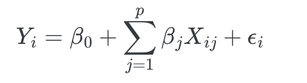

对于 i = 1, …, 𝑛，其中 β[0] 是截距，β[j] 是第 j 个协变量的系数，εᵢ 是误差项。我们假设误差项是独立同分布的 (i.i.d.)，均值为零，方差为 σ²。

在回归框架建立之后，下一步是面对模型选择的中心挑战：我们如何比较不同变量的子集？

## 2. 评估竞争模型的评分标准

在模型选择中，第一个挑战是为每个模型分配一个分数，其中模型由特定的协变量子集定义。本节解释了如何对模型进行评分。

让我们先讨论评分模型的问题。设 S ⊂ {1, …, p}，令 𝓧[S] = {Xⱼ : j ∈ S} 表示协变量的一个子集。令 β[S] 表示相应协变量集的系数，令 β̂[S] 表示 β[S] 的最小二乘估计。此外，令 X[S] 表示这个协变量子集的 X 矩阵，并定义 r̂S 为估计的回归函数。模型 S 的预测值表示为 Ŷᵢ(S) = r̂S。预测误差定义为

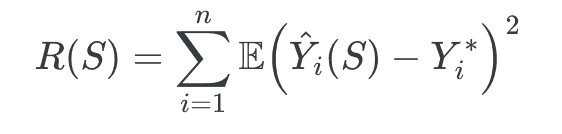

其中 Y[i]* 是 Y[i] 在协变量 X[i] 下的未来观测值。

模型选择的目的是找到子集 S，使其预测风险 R(S) 最小化。

在有数据的情况下，我们无法直接计算预测风险 R(S)。在这种情况下，我们通常使用基于可用数据的估计。预测风险的估计被用作我们的 **评分标准**。

我们可以使用的预测风险的朴素估计是：训练误差，其定义为：

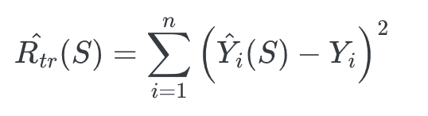

其中 Y[i] 是第 i 个观测值的响应变量的观测值。

然而，训练误差作为预测风险的估计是非常有偏差的。它总是小于预测风险。事实上，

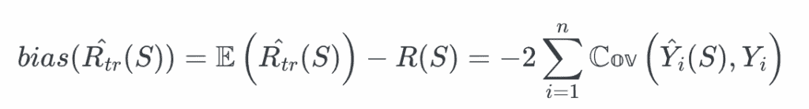

解释这种偏差的原因是数据被使用了两次：一次用于拟合模型，一次用于计算训练误差。当我们拟合一个具有许多参数的复杂模型时，协方差 𝐶𝑜𝑣(Ŷᵢ(S), 𝑌ᵢ) 将会很大，训练误差的偏差会变得更差。这就是为什么我们需要使用一个更可靠的预测风险估计。

### 2.1 Mallow 的 C[p] 统计量

Mallow 的 C[p] 统计量是模型选择的一种流行方法。它定义为：

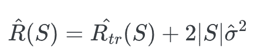

这里，|𝑆| 是 𝑆 中的项数，σ̂² 是从包含所有变量（𝑘）的完整模型中获得的误差项方差的估计。这个值代表训练误差加上偏差校正。第一个项衡量模型拟合数据的好坏，而第二个项衡量模型的复杂度。模型越复杂，第二个项就越大，因此 Mallows 的 𝐶ₚ 统计量也会越大。

Mallow 的 𝐶ₚ 统计量代表了模型拟合和复杂度之间的权衡。因此，找到一个好的模型需要平衡这两个方面。目标是识别最小化 Mallow 的 𝐶ₚ 统计量的模型。

除了 Mallows 的 C[P] 之外，模型选择标准还可以从基于似然估计的带有惩罚项中推导出来。这使我们引出下一系列方法。”

### 2.2 概率估计与惩罚

以下估计预测风险的方法是基于参数的最大似然估计。

在假设误差项服从正态分布的情况下，似然函数如下所示：

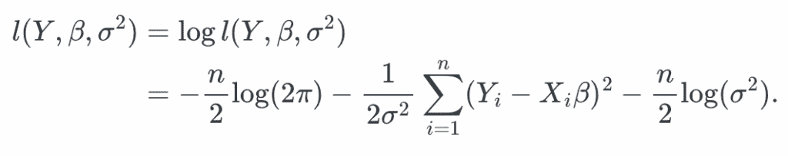

如果你计算模型 𝑆 的参数 β 和 σ² 的最大似然估计，该模型有 |𝑆| 个变量，你将分别得到：

β̂(𝑆)[mv] = β̂(𝑆)[mco] 和 σ̂(𝑆)²[mv]= (1/𝑛) ∑ᵢ₌₁ⁿ (𝑌ᵢ − 𝑌̂ᵢ(𝑆))².

对于具有 $|S|$ 个变量的模型 $S$ 的对数似然如下所示：

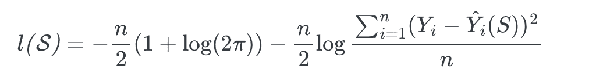

选择最大化对数似然的模型等同于选择具有最小残差平方和（RSS）的模型，即：


为了最小化一个标准，我们使用负对数似然。标准通常定义为：

−2𝓁(𝑆) + 2|𝑆|·𝑓(𝑛)

其中 𝑓(𝑛) 是一个依赖于样本大小 𝑛 的惩罚函数。

这种公式允许我们定义 AIC 和 BIC 标准，如下所示：

#### 2.2.1 赤池信息量准则（AIC）

另一种模型选择的方法是**赤池信息量准则（AIC）**。AIC 的目标是识别最小化信息损失的模型。在实践中，这意味着选择最小化 AIC 的子集 S，AIC 定义如下：

AIC(𝑆) = −2𝓁ₛ + 2|𝑆|

其中 𝓁ₛ 是模型 𝑆 在其参数的最大似然估计下的对数似然。在这里，𝑓(𝑛) = 2。

这个准则可以看作是**拟合优度**和**模型复杂度**的结合。

当比较两个模型时，倾向于选择 AIC 值较低的模型。

#### 2.2.2 贝叶斯信息准则（BIC）

贝叶斯信息准则（BIC）是模型选择的一种方法。它与 AIC 类似，BIC 定义为：

BIC(𝑆) = −2𝓁ₛ + |𝑆|·log(𝑛)

其中 𝓁ₛ 是模型 𝑆 在其参数的最大似然估计下的对数似然。

它被称为贝叶斯信息准则，因为它可以从贝叶斯视角推导出来。设 𝑆 = {𝑆₁, …, 𝑆ₘ} 表示一组模型。如果我们为每个模型 𝑆ᵢ 分配一个先验概率 π(𝑆ᵢ) = 1/𝑚，那么在给定数据的情况下，模型 𝑆ᵢ 的后验概率与它的似然成比例。这导致以下表达式：

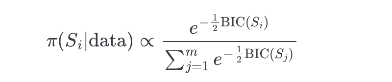

因此，选择使 BIC 最小的模型等同于选择在给定数据下后验概率最高的模型。

贝叶斯信息准则（BIC）在**最小描述长度**方面也有解释：它在模型拟合和复杂度之间取得平衡。因为其惩罚项是 𝑓(𝑛) = ½·log(𝑛)，当 𝑛 > 7 时，BIC 对 AIC 的惩罚更强。因此，BIC 通常比 AIC 选择更简约的模型，尤其是在样本量增加时。

与 AIC 类似，当比较两个模型时，倾向于选择 BIC 较低的模型。

### 2.3 留一法交叉验证（LOOCV）和 k-Fold 交叉验证

另一种广泛使用的模型选择方法是**留一法交叉验证（LOOCV）**。在这种方法中，风险估计器定义为：

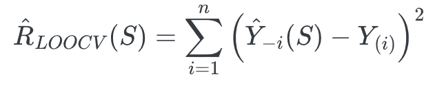

其中 Ŷ₋ᵢ(𝑆) 是使用除第 *i*-th 个观测值外的所有观测值拟合的模型 𝑆 对 𝑌ᵢ 的预测，而 𝑌ᵢ 是第 *i*-th 个观测的实际响应。

可以证明：

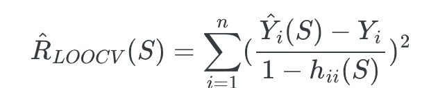

其中 hᵢᵢ(𝑆) 是帽子矩阵 H[S] = X[S] (X[S]ᵀ X[S])⁻¹ X[S]ᵀ 的 *i*-th 对角元素：对于模型 S。

这个公式表明没有必要通过每次留出一个观测值来反复重新拟合模型。相反，LOOCV 可以直接使用拟合值和帽子矩阵来计算。

LOOCV 的自然扩展是 **k-fold 交叉验证**，其中数据被划分为 *k* 组，模型在 *k − 1* 组上训练并在剩余的组上验证。这个过程在所有组上重复进行，并将结果平均以估计预测误差。

### K-Fold 交叉验证

在这种方法中，数据被分为 𝑘 组，或称为 *folds*（通常 𝑘 = 5 或 𝑘 = 10）。留出一组，然后在剩下的 𝑘 − 1 组上拟合模型。然后使用拟合的模型来预测被省略的组中的响应。该组的风险估计如下：

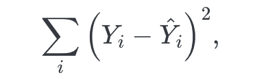

其中求和是对省略的折叠中的所有观测值进行的。此过程对每个𝑘折叠重复进行，并通过平均𝑘个单独的风险值来获得整体风险估计。

此方法特别适合当回归的主要目标是**预测**时。在这种情况下，也可以使用其他性能指标[如**平均绝对误差（MAE）**或**均方根误差（RMSE）**]来评估预测精度。

### 2.4 其他标准

在文献中，除了上述讨论的标准外，还常用其他一些措施进行模型选择。一个广泛使用的选项是**调整后的确定系数**，定义为：

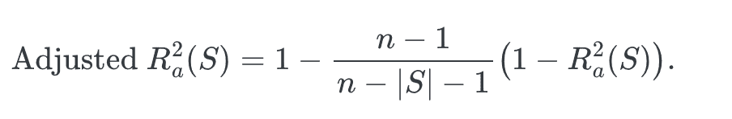

另一种方法是使用**嵌套模型检验**，例如**F 检验**。F 检验比较两个嵌套模型：一个较小的模型𝑆₁，其协变量是较大模型𝑆₂中协变量的子集。零假设表明𝑆₂中额外的变量相对于𝑆₁并没有显著提高拟合度。

总体而言，上述方法主要针对线性回归的两个核心目标：**参数估计**和**变量选择**。

定义了多种评分模型的方法后，剩下的问题是如何搜索候选集以找到评分最高的模型。

## 3. 选择程序

一旦模型可以评分，下一步是搜索所有可能的模型空间或选定的子集，以确定评分最高的模型。对于𝑘个协变量，有 2^𝑘−1 个可能的模型[这个数字在𝑘较大时很快就会变得不切实际（例如，当𝑘=20 时，超过一百万个模型）]。在这种情况下，穷举搜索在计算上是不可行的，因此更倾向于使用启发式方法。总的来说，模型选择策略可以分为两大类：**穷举搜索**和**逐步搜索**。

### 3.1 穷举搜索

这种方法评估了所有可能的模型，并选择评分最高的模型。这种方法仅在𝑘较小的情况下可行，因为随着协变量数量的增加，计算负担变得难以承受。

### 3.2 逐步搜索

逐步方法旨在识别一个**局部最优解**——一个比其直接邻居表现更好的模型。这些方法通常只在穷举搜索不可行时推荐（例如，当𝑛和𝑝都很大时）。

#### 3.2.1 前向逐步选择

+   选择一个评分标准（例如，AIC，BIC，Mallows 的𝐶ₚ）。

+   从一个空模型开始。

+   在每一步中，添加能提供最大改进的变量。

+   继续进行，直到没有变量能提高评分或所有变量都包含在模型中。

#### 3.2.2 后向逐步选择

+   选择一个评分标准（例如，AIC，BIC，Mallows 的𝐶ₚ）。

+   从包含所有变量的完整模型开始。

+   在每一步中，移除移除后能带来最大改进标准的变量。

+   继续进行，直到没有进一步的改进可能或只剩下必要的变量。

#### 3.2.3 步骤选择（混合方法）

+   选择一个评分标准（例如，AIC，BIC，Mallows 的 𝐶ₚ）。

+   从一个空模型开始，逐个添加变量，就像向前选择一样，直到没有变量能进一步改进得分。

+   然后按照向后选择的方式继续，如果这样做能改进标准，则一次移除一个变量。

+   当无法实现进一步改进或所有变量都已包含时停止。

下一个部分是关于如何在真实数据上应用它的方法。

## 4. 应用

在实践中，在应用模型选择技术之前，确保协变量之间没有高度相关性是至关重要的。以下程序可以应用：

1.  **初步过滤**：移除显然与响应变量无关的协变量（基于专家判断、处理缺失值等）。

1.  **与响应变量的相关性**：为每个协变量与响应变量之间的相关性定义一个阈值（例如，0.6）。低于此阈值的协变量可能被排除。（在此，我们将不应用此过滤器以保留足够数量的协变量进行选择。）

1.  **协变量之间的相关性**：为协变量之间的成对相关性定义一个阈值（例如，0.7）。计算相关矩阵；如果两个协变量的相关性超过阈值，则保留与响应变量相关性最强的一个或从领域角度更具可解释性的一个。

1.  **方差膨胀因子 (VIF)**: 计算所有剩余协变量的 VIF。如果一个协变量的 VIF 超过 5 或 10，则认为它与其它变量高度共线性，应该被移除。

1.  **模型选择**：应用选定的模型选择技术。在这种情况下，我们将使用 Mallows 的 𝐶ₚ 作为评分标准，并使用向后逐步选择作为变量选择方法。

最后，我们将实施一个可以结合上述所有标准（AIC，BIC，Mallows 的 𝐶ₚ 等）的**逐步选择程序**，无论是向前还是向后策略。这种统一的方法将使我们能够比较模型并选择一个在拟合优度和复杂性之间取得最佳平衡的模型。

为了说明这个程序，我们现在将展示用于分析的数据集。

### 4.1 数据集的展示

我们使用来自 UCI 机器学习仓库的**社区与犯罪**数据集，该数据集包含关于美国社区的社会经济和人口统计信息。该数据集包括超过 100 个变量。**响应变量**是每人口暴力犯罪的数量（`violentCrimesPerPop`）。我们的目标是应用上述讨论的模型选择技术来识别与这个响应最强烈相关的协变量。

### 4.2 处理缺失值

对于这次分析，我们移除了所有包含缺失值的行。

另一种策略可以是：

+   删除缺失值比例高的变量（例如，>10%），并且

+   评估剩余的缺失值是否为 **随机缺失 (MAR)**、**完全随机缺失 (MCAR)** 或 **非随机缺失 (MNAR)**，如有必要，应用适当的插补方法。

然而，我们采用更简单的方法，即丢弃所有不完整的行。在此步骤之后，数据集不包含缺失值，并包含总共 **103 个变量**：响应变量 `violentCrimesPerPop` 加上协变量。

### 4.3 使用专家判断选择相关变量

然后，我们应用 **专家判断** 来评估每个变量的相关性，并确定其与响应的相关性是否有意义。这需要统计学家和领域专家之间的协商，以了解每个协变量的背景和重要性。

对于这个数据集，我们删除：

+   `communityname`（具有许多级别的分类变量），并且

+   `fold`（仅用于交叉验证的技术变量）。

在此过滤步骤之后，我们保留了 **101 个变量**：响应变量 `violentCrimesPerPop` 和 100 个协变量。

#### 4.4 使用相关阈值减少协变量

为了进一步降低维度，我们计算协变量和响应的 **相关矩阵**。当多个协变量之间高度相关（相关系数 > 0.6）时，我们仅保留与响应最强的那个。此程序减少了冗余，同时减轻了多重共线性。

在应用此过滤和计算 **方差膨胀因子 (VIF)** 后，我们保留最终的一组 **19 个协变量**，其 VIF 值低于 5。

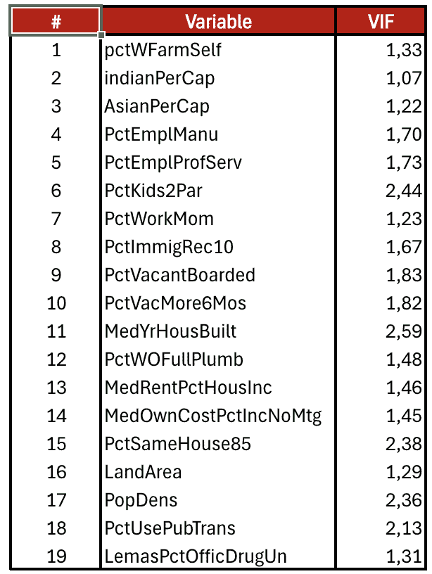

**表 1：协变量的方差膨胀因子。**

这些预处理步骤在我文章中有更详细的解释：[特征选择](https://towardsdatascience.com/multiple-linear-regression-analysis/)。现在，让我们应用我们的 **选择程序** 来识别最相关的变量

#### 4.5 使用逐步选择进行模型选择

有 19 个变量，可能的模型总数为 2¹⁹-1 = 524,287，对于许多系统来说可能计算上不可行。为了减少搜索空间，我们使用 **逐步选择程序**。我们实现了一个函数，`stepwise_selection`，它根据选择的选取标准和方法（正向、逆向或混合）识别最相关的变量。在这个例子中，我们使用 **Mallows’ 𝐶ₚ** 作为选择标准，并应用了正向和逆向逐步选择方法。

#### 4.5.1 使用 Mallows’ 𝐶ₚ 进行逆向逐步选择

应用 Mallows’ 𝐶ₚ 的逆向选择，我们按以下步骤进行：

+   **步骤 1：** 删除 `pctWFarmSelf`。其排除将标准降低到 𝐶ₚ = 41.74，低于完整模型。

+   **步骤 2：** 删除 `PctWOFullPlumb`。这进一步将 𝐶ₚ 降低到 41.69895。

+   **步骤 3：** 删除 `indianPerCap`。标准再次降低到 𝐶ₚ = 41.66073。

总共**移除了三个变量**，得到了最终的模型。

#### 4.5.2 使用 Mallows 的𝐶ₚ进行正向逐步选择

当变量数量较多时，通常推荐使用正向逐步选择，因为它比反向选择计算量要求小。从一个空模型开始，根据改进标准，逐个添加变量。

在这个例子中，正向选择识别出与反向选择**相同的变量集**。下面的图 1 展示了添加到模型中的变量序列及其相应的𝐶ₚ值。过程从`PctKids2Par`开始，接着是`PctWorkMom`、`LandArea`，并继续直到达到最终模型，其标准值为𝐶ₚ = 41.66。

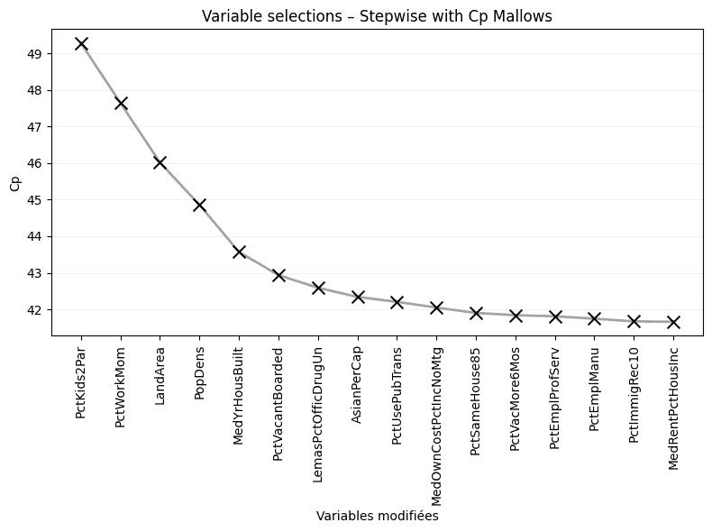

**图 1. 基于 Mallows 的𝐶ₚ准则的变量选择。相应的 Python 实现见附录。**

**警告！** 这尚未解决哪些变量是独立变量的原因的问题。

## 结论

在本文中，我们讨论了模型选择的问题。该过程的核心原则是为每个模型分配一个分数以衡量其质量，然后搜索所有可能的模型集合以识别得分最高的模型。这个分数是通过平衡拟合质量和模型复杂度来定义的。

在可用的程序中，我们介绍了逐步正向和反向方法，我们使用 Python 实现了它们。我们应用了不同的评估标准：AIC、BIC 和 Mallows 的 C[P]。

然而，这些方法有一个局限性：它们只探索所有可能模型的一个子集。因此，选定的模型有时可能代表现实的一种过度简化。尽管如此，当变量数量较多且穷举方法计算成本过高时，它们仍然非常有用。

最后，在处理预测目的的回归时，将数据集分为两部分：训练集和测试集至关重要。变量选择必须仅在训练集上执行；绝不能在测试集上执行，以确保对模型预测性能的诚实评估。

### 图片来源

本文中的所有图像和可视化均由作者使用 Python（pandas、matplotlib、seaborn 和 plotly）和 excel 创建，除非另有说明。

### 参考文献

Wasserman, L. (2013). *All of statistics: a concise course in statistical inference*. Springer Science & Business Media.

Redmond, M. (2002). Communities and Crime [Dataset]. UCI Machine Learning Repository. https://doi.org/10.24432/C53W3X.

Cornillon, P. A., Hengartner, N., Matzner-Løber, E., & Rouvière, L. (2023). Régression avec R: 3ème édition. In *Régression avec R*. EDP sciences.

### 数据与许可

本文使用的数据集是根据**创意共享署名 4.0 国际（CC BY 4.0）**许可证授权的。

本许可证允许任何人出于任何目的（包括商业用途）共享和修改数据集，前提是必须正确注明来源。

更多详情，请参阅官方许可证文本：[CC BY 4.0](https://creativecommons.org/licenses/by/4.0/)。

### 免责声明

任何剩余的错误或不准确之处均由作者负责。欢迎提供反馈和更正。

### 代码

```py
import numpy as np
import statsmodels.api as sm

def compute_score(y, X, vars_to_test, metric, full_model_mse=None):
    X_train = sm.add_constant(X[vars_to_test])
    model = sm.OLS(y, X_train).fit()
    n = len(y)
    p = len(vars_to_test) + 1  # +1 pour la constante

    if metric == 'AIC':
        return model.aic

    elif metric == 'BIC':
        return model.bic

    elif metric == 'Cp':
        if full_model_mse is None:
            raise ValueError("full_model_mse doit être fourni pour calculer Cp Mallows.")
        rss = sum(model.resid ** 2)
        return rss + 2 * p * full_model_mse

    elif metric == 'R2_adj':
        return -model.rsquared_adj  # négatif pour maximiser

    else:
        raise ValueError("Métrique inconnue. Utilisez 'AIC', 'BIC', 'Cp' ou 'R2_adj'.")

def get_best_candidate(y, X, selected, candidates, metric, strategy, full_model_mse=None):
    scores_with_candidates = []
    for candidate in candidates:
        vars_to_test = selected + [candidate] if strategy == 'forward' else [var for var in selected if var != candidate]
        score = compute_score(y, X, vars_to_test, metric, full_model_mse)
        scores_with_candidates.append((score, candidate, vars_to_test))

    scores_with_candidates.sort()
    print("Suppressions testées:", [(v, round(s, 2)) for s, v, _ in scores_with_candidates])
    return scores_with_candidates[0] if scores_with_candidates else (None, None, None)

def stepwise_selection(df, target, strategy='forward', metric='AIC', verbose=True):
    if df.isnull().values.any():
        raise ValueError("Des valeurs manquantes sont présentes dans le DataFrame.")

    X = df.drop(columns=[target])
    y = df[target]
    variables = list(X.columns)

    selected = [] if strategy == 'forward' else variables.copy()
    remaining = variables.copy() if strategy == 'forward' else []

    # Calcul préalable du MSE du modèle complet pour Cp Mallows
    if metric == 'Cp':
        X_full = sm.add_constant(X)
        full_model = sm.OLS(y, X_full).fit()
        full_model_mse = sum(full_model.resid ** 2) / (len(y) - len(variables) - 1)
    else:
        full_model_mse = None

    current_score = np.inf
    history = []
    step = 0

    while True:
        step += 1
        candidates = remaining if strategy == 'forward' else selected
        best_score, best_candidate, vars_to_test = get_best_candidate(y, X, selected, candidates, metric, strategy, full_model_mse)

        if best_candidate is None:
            if verbose:
                print("Aucun candidat disponible.")
            break

        if verbose:
            action = "ajouter" if strategy == 'forward' else "retirer"
            print(f"\nÉtape {step}: Meilleure variable à {action} : {best_candidate} (score={round(best_score,5)})")

        improvement = best_score < current_score - 1e-6

        if improvement:
            if strategy == 'forward':
                selected.append(best_candidate)
                remaining.remove(best_candidate)
            else:
                selected.remove(best_candidate)

            current_score = best_score
            history.append({
                'step': step,
                'selected': selected.copy(),
                'score': current_score,
                'modified': best_candidate
            })
        else:
            if verbose:
                print("Aucune amélioration supplémentaire du score.")
            break

    X_final = sm.add_constant(X[selected])
    best_model = sm.OLS(y, X_final).fit()

    if verbose:
        print("\nVariables sélectionnées :", selected)
        final_score = best_model.aic if metric == 'AIC' else best_model.bic
        if metric == 'Cp':
            final_score = compute_score(y, X, selected, metric, full_model_mse)
        elif metric == 'R2_adj':
            final_score = -compute_score(y, X, selected, metric)
        print(f"Score final ({metric}): {round(final_score,5)}")

    return selected, best_model, history
```

```py
import matplotlib.pyplot as plt

def plot_stepwise_crosses(history, all_vars, metric="AIC", title=None):
    """
    Affiche le graphique stepwise type heatmap à croix :
    - X : variables explicatives modifiées à au moins une étape (ordre d'apparition)
    - Y : score (AIC/BIC) à chaque étape (de l'historique)
    - Croix noire : variable modifiée à chaque étape
    - Vide ailleurs
    - Courbe du score
    """
    n_steps = len(history)
    scores = [h['score'] for h in history]

    # Extraire la liste ordonnée des variables effectivement modifiées
    modified_vars = []
    for h in history:
        var = h['modified']
        if var not in modified_vars and var is not None:
            modified_vars.append(var)

    n_mod_vars = len(modified_vars)

    # Construction des positions X pour les croix (selon modified_vars)
    mod_pos = [modified_vars.index(h['modified']) if h['modified'] in modified_vars else None for h in history]

    fig, ax = plt.subplots(figsize=(min(1.3 * n_mod_vars, 8), 6))
    # Placer la croix noire à chaque étape
    for i, x in enumerate(mod_pos):
        if x is not None:
            ax.scatter(x, scores[i], color='black', marker='x', s=100, zorder=3)
    # Tracer la courbe du score
    ax.plot(range(n_steps), scores, color='gray', alpha=0.7, linewidth=2, zorder=1)
    # Axe X : labels verticaux, police réduite (uniquement variables modifiées)
    ax.set_xticks(range(n_mod_vars))
    ax.set_xticklabels(modified_vars, rotation=90, fontsize=10)
    ax.set_xlabel("Variables modifiées")
    ax.set_ylabel(metric)
    ax.set_title(title or f"Stepwise ({metric}) – Variables modifiées à chaque étape")
    ax.grid(True, axis='y', alpha=0.2)
    plt.tight_layout()
    plt.show()
```
